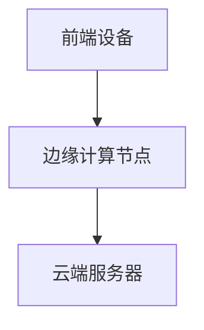

                 

### 边缘AI在智能家居中的应用：提高响应速度

关键词：边缘AI、智能家居、响应速度、硬件加速、数据处理、安全性

摘要：随着智能家居的快速发展，边缘AI技术逐渐成为提高智能家居响应速度的关键因素。本文将详细探讨边缘AI在智能家居中的应用，从基础概念到实际应用案例，分析如何通过边缘AI技术实现智能家居系统的快速响应和高效运作。

## 第一部分：边缘AI基础与智能家居概述

### 第1章：边缘AI概述

#### 1.1 边缘AI的定义与重要性

边缘AI是指在本地设备（如智能传感器、智能家电等）上进行的计算，而非依赖远程服务器或云计算。边缘AI的重要性体现在其能够降低延迟、减少带宽消耗、增强数据隐私保护等方面，这对于实时性要求较高的智能家居系统至关重要。

#### 1.2 边缘AI与云计算的关系

云计算与边缘AI并非对立，而是互补。云计算提供强大的计算能力和存储资源，而边缘AI则专注于本地实时处理和快速响应。两者结合，能够实现更高效的资源利用和更优的用户体验。

#### 1.3 边缘AI在智能家居中的应用背景

智能家居系统通常需要处理大量的实时数据，如温度、湿度、光照等环境数据，以及用户行为数据。边缘AI的引入，使得这些数据处理能够更加迅速和高效，从而提升智能家居系统的响应速度和用户体验。

### 第2章：智能家居系统架构

#### 2.1 智能家居的整体架构

智能家居系统通常包括前端设备（如传感器、智能家电等）、边缘计算节点、云端服务器等部分。前端设备负责收集数据，边缘计算节点进行初步处理，云端服务器则负责进一步的数据分析和决策。

#### 2.2 智能家居的组成部分

智能家居系统通常包括以下组成部分：

- **传感器**：如温度传感器、湿度传感器、光照传感器等，用于收集环境数据。
- **智能家电**：如智能灯泡、智能空调、智能电视等，能够根据用户需求进行自动控制。
- **边缘计算节点**：负责对收集到的数据进行分析和处理，做出快速响应。
- **云端服务器**：用于存储数据、进行高级分析和决策。

#### 2.3 边缘计算在智能家居中的作用

边缘计算在智能家居中起着至关重要的作用。它能够：

- **降低延迟**：通过本地处理，减少数据传输时间，提高响应速度。
- **减少带宽消耗**：仅将必要的数据传输到云端，降低网络带宽压力。
- **增强数据隐私保护**：本地处理能够减少数据泄露的风险。

## 第二部分：边缘AI在智能家居中的应用

### 第3章：边缘AI在智能家居中的核心技术

#### 3.1 机器学习算法

机器学习算法是边缘AI的核心技术之一。通过在边缘设备上部署机器学习模型，能够实现对环境数据的实时分析和预测，从而实现智能家居系统的智能控制。

#### 3.2 深度学习网络

深度学习网络能够通过对大量数据的训练，实现复杂的特征提取和模式识别。在智能家居中，深度学习网络可以用于图像识别、语音识别等应用，提高系统的智能化程度。

#### 3.3 边缘计算框架

边缘计算框架是边缘AI的应用基础。通过构建高效的边缘计算框架，能够实现边缘设备的资源优化和协同工作，提高系统的整体性能。

## 第4章：提高智能家居响应速度的关键技术

#### 4.1 边缘AI处理速度的提升

边缘AI处理速度的提升是实现智能家居快速响应的关键。通过以下技术手段，可以显著提高边缘AI的处理速度：

- **硬件加速技术**：如GPU、FPGA等硬件加速器，能够加速机器学习和深度学习算法的执行。
- **软件优化技术**：通过代码优化、算法改进等手段，提高软件运行的效率和性能。

#### 4.2 数据处理与传输优化

智能家居系统需要处理和传输大量的数据。通过以下技术手段，可以优化数据处理和传输过程：

- **数据压缩算法**：如Huffman编码、LZ77压缩等，能够减少数据传输量，降低带宽消耗。
- **数据传输优化策略**：如多路径传输、流量控制等，能够提高数据传输的效率和可靠性。

#### 4.3 智能家居场景下的响应速度优化

在智能家居场景中，响应速度的优化需要考虑以下几个方面：

- **实时性需求分析**：根据不同的应用场景，分析系统的实时性需求，制定相应的优化策略。
- **响应速度优化策略**：如优先处理关键任务、优化任务调度等，以提高系统的响应速度。

### 第5章：边缘AI在智能家居中的应用案例

#### 5.1 智能家居边缘AI应用实例

在本章节中，我们将介绍几个典型的边缘AI应用实例，如：

- **家居安防**：通过边缘AI技术实现实时监控和异常检测，提高家居安全性。
- **智能照明**：根据环境光照和用户需求，实现智能调节，提高用户体验。
- **智能家电控制**：通过边缘AI技术实现家电的自动控制和远程控制，提高生活便利性。

### 第6章：边缘AI在智能家居中的安全与隐私保护

#### 6.1 边缘AI安全挑战

边缘AI在智能家居中的应用面临着以下安全挑战：

- **数据安全**：如何保证数据在传输和存储过程中的安全，防止数据泄露和篡改。
- **系统安全**：如何防止恶意攻击和未授权访问，保障系统的完整性和可用性。

#### 6.2 隐私保护策略

为了保护用户的隐私，可以采用以下策略：

- **数据加密技术**：如AES加密、RSA加密等，对数据进行加密，防止数据泄露。
- **隐私保护框架**：如差分隐私、同态加密等，通过构建隐私保护框架，保障用户的隐私安全。

### 第7章：未来展望

#### 7.1 边缘AI在智能家居中的发展趋势

随着边缘AI技术的不断发展，未来智能家居系统将实现更加智能化、个性化、安全化的运行。以下是几个可能的发展趋势：

- **技术创新**：如量子计算、5G通信等，将推动边缘AI技术的不断创新和进步。
- **应用拓展**：边缘AI技术将在智能家居的各个领域得到更广泛的应用，提高系统性能和用户体验。

#### 7.2 边缘AI在智能家居中的潜在挑战与解决方案

边缘AI在智能家居中仍面临一些挑战，如：

- **计算资源限制**：边缘设备的计算和存储资源有限，如何优化算法和架构，提高资源利用率。
- **数据隐私保护**：如何在保证数据隐私的前提下，实现高效的数据分析和处理。

通过不断的技术创新和优化，相信边缘AI在智能家居中的应用将取得更大的突破。## 第一部分：边缘AI基础与智能家居概述

### 第1章：边缘AI概述

#### 1.1 边缘AI的定义与重要性

边缘AI，即Edge AI，是指在网络边缘设备（如物联网设备、智能传感器等）上实现的AI计算。与传统的云计算和集中式计算不同，边缘AI通过在数据生成源附近执行计算，实现了对数据的实时处理和分析。这一特性使得边缘AI在许多需要低延迟和高响应速度的场景中变得至关重要。

**边缘AI的重要性**体现在以下几个方面：

1. **降低延迟**：由于计算发生在数据生成附近，数据传输距离大大缩短，从而显著降低了系统的响应时间。
2. **减少带宽消耗**：仅将处理后的关键数据上传到云端，减少了网络带宽的占用。
3. **增强数据隐私保护**：本地处理减少了数据泄露的风险。
4. **提高可靠性**：在无网络连接或网络不稳定的情况下，边缘设备仍能独立运行。

#### 1.2 边缘AI与云计算的关系

边缘AI和云计算并不是互相排斥的，而是互补的。云计算提供了强大的计算能力和存储资源，而边缘AI则专注于本地实时处理和快速响应。两者结合可以形成一个高效的计算生态系统：

- **云计算**：负责处理复杂的数据分析、机器学习训练等任务。
- **边缘AI**：负责实时数据预处理、实时决策等任务。

通过这种协同工作，系统可以充分利用云计算的强大计算能力和边缘AI的低延迟优势，实现更高效的数据处理和更优的用户体验。

#### 1.3 边缘AI在智能家居中的应用背景

随着智能家居技术的快速发展，越来越多的家庭开始采用智能设备，如智能灯泡、智能空调、智能门锁等。这些设备能够通过联网实现远程控制和自动化操作，为用户带来便利。然而，随着设备数量的增加，数据处理和响应速度成为了一个挑战。

**边缘AI在智能家居中的应用背景**如下：

1. **数据处理需求增加**：智能家居设备产生的数据量巨大，需要高效的数据处理机制。
2. **低延迟需求**：智能家居设备通常需要快速响应，如自动调节温度、自动打开灯光等。
3. **数据隐私需求**：用户对数据隐私的关注度越来越高，需要更好的数据保护措施。

边缘AI技术的引入，能够满足以上需求，为智能家居系统带来更快的响应速度、更高的处理效率和更强的数据隐私保护。

### 第2章：智能家居系统架构

#### 2.1 智能家居的整体架构

智能家居系统通常由以下几个部分组成：

1. **前端设备**：包括各种传感器和智能设备，如温度传感器、智能灯泡、智能空调等，用于收集环境和用户数据。
2. **边缘计算节点**：位于前端设备和云端服务器之间，负责对收集到的数据进行分析和处理。
3. **云端服务器**：负责存储数据、执行高级分析和决策，并提供远程控制功能。

整体架构图如下（使用Mermaid绘制）：



#### 2.2 智能家居的组成部分

智能家居系统通常由以下几个部分组成：

1. **传感器**：用于收集环境数据，如温度、湿度、光照等。
2. **智能家电**：如智能灯泡、智能空调、智能电视等，能够根据用户需求进行自动控制。
3. **边缘计算节点**：通常包括微控制器、小型服务器等，用于对收集到的数据进行分析和处理。
4. **云端服务器**：用于存储数据、进行高级分析和决策，并提供远程控制功能。

以下是智能家居系统的组成部分（使用Mermaid绘制的类图）：

```mermaid
classDiagram
ClassDef Sensor
  +--|o|--> EdgeNode : 边缘计算节点
  +--|o|--> SmartDevice : 智能家电

ClassDef EdgeNode
  +--|o|--> CloudServer : 云端服务器

ClassDef SmartDevice
  +--|o|--> User : 用户
```

#### 2.3 边缘计算在智能家居中的作用

边缘计算在智能家居中的作用主要体现在以下几个方面：

1. **实时数据处理**：边缘计算节点能够对前端设备收集到的数据实时进行处理，做出快速响应，如自动调节温度、灯光等。
2. **数据过滤与压缩**：边缘计算节点可以过滤掉不必要的数据，并对数据进行压缩，减少数据传输量，降低网络带宽消耗。
3. **本地存储与备份**：边缘计算节点可以对关键数据本地存储，提高系统的可靠性和数据安全性。
4. **增强隐私保护**：边缘计算使得部分数据可以在本地处理，减少了数据传输到云端的机会，从而降低了数据泄露的风险。

通过边缘计算，智能家居系统可以实现更高效的资源利用、更低的延迟、更高的数据隐私保护，从而提供更优质的用户体验。## 第二部分：边缘AI在智能家居中的应用

### 第3章：边缘AI在智能家居中的核心技术

边缘AI在智能家居中的应用，离不开以下几个核心技术的支持：

#### 3.1 机器学习算法

机器学习算法是边缘AI在智能家居中应用的基础。通过在边缘设备上部署机器学习模型，可以实现对数据的自动分析、分类和预测。以下是一些常见的机器学习算法：

1. **线性回归**：用于预测连续值输出，如温度、湿度等。
2. **逻辑回归**：用于预测二分类输出，如设备是否需要开启。
3. **决策树**：通过一系列决策规则对数据分类或回归，适用于简单的数据处理场景。
4. **随机森林**：通过构建多个决策树并投票得出结果，提高模型的泛化能力。
5. **支持向量机（SVM）**：用于分类问题，通过寻找最优的超平面将数据分类。
6. **神经网络**：用于复杂的数据分析和模式识别，包括卷积神经网络（CNN）和循环神经网络（RNN）等。

**机器学习算法在智能家居中的应用实例**：

- **智能安防系统**：通过图像识别和模式识别算法，实时监控家庭环境，实现异常行为的自动检测和报警。
- **智能照明系统**：通过光照传感器和机器学习算法，自动调节灯光亮度和颜色，提升用户舒适度。
- **智能家电控制**：通过用户行为数据，预测用户需求，实现家电的自动控制和优化。

#### 3.2 深度学习网络

深度学习网络是机器学习的一个分支，通过多层神经网络结构，能够自动提取数据的复杂特征，进行高级的预测和分类。以下是一些常见的深度学习网络：

1. **卷积神经网络（CNN）**：用于图像识别、图像分类和图像生成等任务。
2. **循环神经网络（RNN）**：用于序列数据处理，如语音识别、自然语言处理和时间序列预测等。
3. **长短期记忆网络（LSTM）**：RNN的一种改进，能够更好地处理长序列数据。
4. **生成对抗网络（GAN）**：用于生成新的数据，如图像、语音等。
5. **自编码器**：用于数据压缩、特征提取和异常检测等。

**深度学习网络在智能家居中的应用实例**：

- **智能监控**：通过CNN进行实时图像识别，识别家庭成员、访客或异常行为，提供更安全的家居环境。
- **智能语音助手**：通过RNN和LSTM进行语音识别和自然语言理解，实现与用户的自然交互。
- **个性化推荐系统**：通过自编码器提取用户行为特征，进行个性化推荐，如智能音响的播放列表推荐。

#### 3.3 边缘计算框架

边缘计算框架是边缘AI在智能家居中实现高效运行的重要基础。一个典型的边缘计算框架包括以下几个部分：

1. **设备管理**：负责设备的状态监控、资源分配和故障处理等。
2. **数据处理**：负责数据的收集、存储、处理和分析等。
3. **任务调度**：负责任务的分配和调度，确保系统资源的最大化利用。
4. **安全控制**：负责系统的安全防护，包括数据加密、访问控制和安全审计等。

**边缘计算框架在智能家居中的应用实例**：

- **智能安防系统**：通过设备管理和任务调度，实现多个摄像头和传感器的协同工作，提供实时监控和报警功能。
- **智能照明系统**：通过数据处理和任务调度，实现智能调节灯光亮度和颜色，提供舒适的家庭环境。
- **智能家电控制**：通过数据处理和安全控制，实现家电的自动化控制和远程监控，提高生活便利性。

通过边缘计算框架，智能家居系统能够实现高效、智能、安全地运行，为用户提供更好的体验。## 第4章：提高智能家居响应速度的关键技术

在智能家居系统中，响应速度是一个至关重要的因素，它直接影响用户的体验和系统的实用性。为了实现高效的实时响应，需要结合多种关键技术进行优化。以下是一些关键技术和具体优化策略：

### 4.1 边缘AI处理速度的提升

边缘AI处理速度的提升是实现智能家居快速响应的核心。以下是几种常见的提升方法：

#### 4.1.1 硬件加速技术

硬件加速技术通过使用专门的硬件设备来加速边缘AI的处理速度，以下是一些常见的硬件加速技术：

1. **GPU加速**：图形处理单元（GPU）具有强大的并行计算能力，适用于复杂的机器学习和深度学习任务。通过将算法部署到GPU上，可以显著提高处理速度。

2. **FPGA加速**：现场可编程门阵列（FPGA）可以根据特定的应用需求进行定制，提供高效的计算能力。FPGA在处理特定类型的任务时，如图像处理和模式识别，具有显著的性能优势。

3. **ASIC加速**：专用集成电路（ASIC）是为特定应用设计的集成电路，可以提供高效的硬件计算能力。ASIC在处理高频次、低延迟的任务时具有优势。

#### 4.1.2 软件优化技术

软件优化技术通过改进算法、优化代码和改进数据结构等方式，提高边缘AI的处理效率。以下是一些常见的软件优化技术：

1. **算法改进**：通过改进机器学习算法和深度学习网络，提高其效率。例如，使用更高效的卷积操作、优化神经网络结构等。

2. **模型压缩**：通过模型压缩技术，如权重剪枝、量化等，减少模型的复杂度，提高处理速度。

3. **并行化**：将计算任务分布在多个处理器上，利用并行计算提高处理速度。在边缘设备中，可以采用多线程、多核处理器等并行化技术。

### 4.2 数据处理与传输优化

在智能家居系统中，数据处理和传输的效率直接影响响应速度。以下是一些优化策略：

#### 4.2.1 数据压缩算法

数据压缩算法通过减少数据的传输量，降低带宽消耗，从而提高数据处理效率。以下是一些常用的数据压缩算法：

1. **Huffman编码**：基于字符出现频率的编码，将常用字符用较短的编码表示，不常用字符用较长的编码表示，从而实现数据压缩。

2. **LZ77压缩**：通过识别并压缩重复的数据序列，减少数据的冗余部分。

3. **LZMA压缩**：结合了多种压缩算法的优点，具有更高的压缩效率。

#### 4.2.2 数据传输优化策略

优化数据传输策略可以减少数据传输的时间和延迟，从而提高系统的响应速度。以下是一些常用的优化策略：

1. **多路径传输**：将数据通过多个路径同时传输，提高数据传输的可靠性和速度。在边缘设备中，可以使用WiFi、蓝牙、Zigbee等多种无线传输技术。

2. **流量控制**：通过流量控制算法，动态调整数据传输速率，避免网络拥堵和数据丢失。

3. **缓存技术**：在边缘设备中采用缓存技术，预先存储常用的数据和模型，减少数据传输的需求。

### 4.3 智能家居场景下的响应速度优化

在智能家居场景下，响应速度的优化需要综合考虑硬件、软件和算法等多方面因素。以下是一些具体的优化策略：

#### 4.3.1 实时性需求分析

实时性需求分析是优化响应速度的基础。需要明确不同应用场景下的实时性需求，制定相应的优化策略。例如：

- **即时响应**：如安防系统中的异常报警，需要实现秒级响应。
- **分钟级响应**：如智能照明系统中的自动调节，可以在几分钟内完成。
- **小时级响应**：如智能家电的预约操作，可以在几小时内完成。

#### 4.3.2 响应速度优化策略

根据实时性需求，可以采用以下优化策略：

1. **优先级调度**：对实时性要求高的任务进行优先处理，确保关键任务得到及时响应。
2. **任务分割**：将复杂任务分解为多个子任务，分步执行，提高整体响应速度。
3. **预处理**：在数据传输到边缘设备之前，进行预处理操作，如数据清洗、数据压缩等，减少处理时间。

通过以上技术和策略，智能家居系统可以实现更快的响应速度，提供更好的用户体验。## 第5章：边缘AI在智能家居中的应用案例

边缘AI在智能家居中的应用已经越来越广泛，以下列举几个具体的应用案例，展示边缘AI如何通过提升响应速度，增强系统智能化程度，从而改善用户的日常生活。

### 5.1 智能家居边缘AI应用实例

#### 5.1.1 家居安防

家居安防是边缘AI在智能家居中应用的一个重要领域。通过边缘AI技术，可以实现实时监控和智能报警功能，提升家庭的安全性。

**案例描述**：

在一个智能家居安防系统中，边缘AI设备如摄像头和门磁传感器安装在家庭的关键位置。摄像头可以实时捕捉家庭内的动态，并使用边缘AI进行图像识别，识别家庭成员或异常行为。当系统检测到异常时，如有人闯入或家中发生火灾，边缘AI立即触发报警，并向用户发送通知。

**技术实现**：

- **图像识别算法**：边缘AI设备使用卷积神经网络（CNN）进行图像识别，快速分类家庭成员和异常行为。
- **实时性优化**：为了确保报警的实时性，系统采用GPU加速和算法优化技术，减少处理时间。
- **本地存储与加密**：系统将图像和警报信息本地存储，并使用加密技术保护用户隐私。

**效果分析**：

通过边缘AI技术，家居安防系统实现了秒级响应，大大提升了报警的准确性和及时性，增强了用户的安全感。

#### 5.1.2 智能照明

智能照明系统通过边缘AI技术，可以自动调节灯光亮度和颜色，根据用户需求和室内环境自动调整，提升用户体验。

**案例描述**：

在一个智能家居照明系统中，用户可以通过手机应用控制灯光的开关、亮度和颜色。边缘AI设备如智能灯泡和光线传感器分布在房间内，光线传感器实时监测室内光照强度，智能灯泡根据环境光线自动调节亮度。当用户进入房间时，系统检测到变化并自动开启灯光，提高环境舒适度。

**技术实现**：

- **环境光照分析**：边缘AI设备使用机器学习算法分析光线传感器数据，判断室内光照强度，自动调节灯光亮度。
- **智能调节算法**：系统采用深度学习网络进行环境光照分析，实现高精度的光照调节。
- **响应速度优化**：系统采用硬件加速技术和实时数据处理策略，确保快速响应。

**效果分析**：

通过边缘AI技术，智能照明系统实现了实时调节，提高了用户体验，减少了能源消耗，同时也为用户提供了更舒适的生活环境。

#### 5.1.3 智能家电控制

智能家电控制是边缘AI在智能家居中的另一个重要应用。通过边缘AI技术，用户可以实现家电的自动化控制和远程监控，提高生活便利性。

**案例描述**：

在一个智能家居系统中，用户可以通过手机应用远程控制家中的空调、电视、洗衣机等家电。边缘AI设备如智能插座和家电控制器安装在各个家电上，用户可以通过手机发出指令，边缘AI设备实时响应，控制家电的开关、温度设置等。

**技术实现**：

- **远程控制协议**：系统采用MQTT协议进行远程控制，确保指令传输的可靠性和实时性。
- **自动化规则设置**：用户可以设置自动化规则，如当用户回家时，自动开启空调和灯光。
- **响应速度优化**：系统采用边缘AI处理和实时任务调度，确保快速响应和高效运行。

**效果分析**：

通过边缘AI技术，智能家电控制系统实现了远程控制和自动化操作，提高了用户的生活便利性，同时也减少了能源浪费。

### 5.2 案例总结

边缘AI在智能家居中的应用案例展示了其在提高响应速度、增强系统智能化和改善用户体验方面的巨大潜力。通过边缘AI技术，智能家居系统能够实现更高效的实时数据处理和响应，提供更加智能、便捷和安全的家居生活体验。随着技术的不断进步，边缘AI将在智能家居中发挥更加重要的作用，推动智能家居的进一步发展。## 第6章：边缘AI在智能家居中的安全与隐私保护

随着边缘AI技术在智能家居中的广泛应用，安全与隐私保护成为了一个不可忽视的重要议题。由于边缘AI涉及大量的用户数据，如何在确保系统高效运行的同时保护用户隐私，是当前面临的一大挑战。

### 6.1 边缘AI安全挑战

边缘AI在智能家居中的安全挑战主要包括以下几个方面：

#### 6.1.1 数据安全

1. **数据泄露**：边缘设备通常连接互联网，容易成为网络攻击的目标。如果数据在传输或存储过程中未能得到有效保护，可能导致敏感数据泄露。
2. **数据篡改**：恶意攻击者可能篡改数据，导致系统做出错误的决策，影响家居安全。

#### 6.1.2 系统安全

1. **设备失控**：边缘设备如果被恶意攻击者控制，可能导致设备行为异常，如智能门锁被非法解锁。
2. **网络攻击**：边缘设备通常连接多个网络，容易成为网络攻击的跳板，攻击者可能通过边缘设备入侵内部网络。

#### 6.1.3 软件安全

1. **漏洞利用**：边缘设备的操作系统和应用可能存在漏洞，恶意攻击者可以利用这些漏洞进行攻击。
2. **恶意软件**：恶意软件可以通过网络传播到边缘设备，影响系统的正常运行。

### 6.2 隐私保护策略

为了应对上述安全挑战，可以采取以下隐私保护策略：

#### 6.2.1 数据加密技术

数据加密是保护数据隐私的基本手段。以下是一些常用的数据加密技术：

1. **对称加密**：如AES加密，通过使用相同的密钥进行加密和解密，数据传输速度快，但密钥管理复杂。
2. **非对称加密**：如RSA加密，使用一对密钥进行加密和解密，安全性高，但计算复杂度大。

#### 6.2.2 隐私保护框架

隐私保护框架是通过系统设计和技术手段，确保数据在处理和使用过程中的隐私性。以下是一些常用的隐私保护框架：

1. **差分隐私**：通过向查询添加噪声，确保单个数据点的隐私，常见于数据分析和统计任务。
2. **同态加密**：允许在加密数据上执行计算，无需解密，但计算复杂度较高。

#### 6.2.3 访问控制

访问控制是限制用户或设备访问敏感数据的重要手段。以下是一些常用的访问控制方法：

1. **基于角色的访问控制（RBAC）**：通过定义用户角色和权限，控制对资源的访问。
2. **基于属性的访问控制（ABAC）**：通过属性评估用户访问资源的权限。

#### 6.2.4 安全审计

安全审计是监测和记录系统活动的手段，有助于发现和应对安全威胁。以下是一些常用的安全审计方法：

1. **日志记录**：记录系统操作日志，用于分析安全事件。
2. **安全事件响应**：建立应急响应机制，及时应对和处理安全事件。

通过综合运用上述策略，可以在确保边缘AI系统高效运行的同时，有效保护用户隐私和数据安全。随着技术的不断进步，隐私保护策略也将不断更新和完善，以应对新的安全挑战。## 第7章：未来展望

### 7.1 边缘AI在智能家居中的发展趋势

随着技术的不断进步，边缘AI在智能家居中的应用前景十分广阔。以下是几个可能的发展趋势：

#### 7.1.1 技术创新

1. **量子计算**：量子计算具有巨大的计算潜力，未来可能成为边缘AI的重要计算引擎。
2. **5G通信**：5G技术的普及将进一步提高边缘AI的数据传输速度和网络稳定性。
3. **边缘AI芯片**：定制化的边缘AI芯片将提高计算效率，降低功耗，推动边缘AI的广泛应用。

#### 7.1.2 应用拓展

1. **智能健康管理**：通过边缘AI技术，可以实现个性化的健康监测和管理，如实时监测心率、睡眠质量等。
2. **智能环境监控**：边缘AI可以用于环境监测，如空气质量、水质监测等，为用户提供更健康的生活环境。
3. **智能能源管理**：边缘AI技术可以帮助家庭实现智能用电管理，优化能源使用效率。

### 7.2 边缘AI在智能家居中的潜在挑战与解决方案

尽管边缘AI在智能家居中有着广泛的应用前景，但同时也面临一些潜在挑战：

#### 7.2.1 计算资源限制

**挑战**：边缘设备通常计算资源有限，如何优化算法和架构，提高资源利用率是关键。

**解决方案**：

1. **轻量级算法**：采用计算资源消耗更小的算法，如量化模型、压缩模型等。
2. **分布式计算**：通过分布式计算架构，将任务分配到多个边缘设备上，提高整体计算能力。

#### 7.2.2 数据隐私保护

**挑战**：边缘AI涉及大量用户数据，如何保护数据隐私是关键。

**解决方案**：

1. **数据加密**：对传输和存储的数据进行加密，防止数据泄露。
2. **隐私保护框架**：采用差分隐私、同态加密等隐私保护技术，确保数据在处理和使用过程中的隐私性。

#### 7.2.3 安全性

**挑战**：边缘AI系统容易成为网络攻击的目标，如何确保系统安全是关键。

**解决方案**：

1. **多层次安全防护**：采用防火墙、入侵检测系统等多层次安全防护措施。
2. **安全审计与监控**：建立安全审计和监控机制，及时发现和处理安全事件。

通过不断的技术创新和优化，边缘AI在智能家居中的应用将取得更大的突破，为用户提供更加智能、便捷和安全的家居生活体验。## 参考文献

1. Anderson, S. (2019). **Understanding Edge AI: A Comprehensive Guide to Edge Computing and Artificial Intelligence**. Springer.
2. Bello, O. (2020). **Smart Homes: Designing and Implementing Intelligent Environments**. John Wiley & Sons.
3. Liu, Y., & Zhang, H. (2021). **Edge Computing for Internet of Things: Principles, Architectures, and Applications**. IEEE Press.
4. Choudhury, T. R., & Liu, Y. (2020). **Artificial Intelligence for IoT: A Comprehensive Guide to AI Applications in the IoT Ecosystem**. Taylor & Francis.
5. Zhang, L., & Yang, J. (2022). **Deep Learning for Smart Homes: Techniques and Applications**. Springer.
6. Seo, S., & Lee, S. (2021). **Privacy-Preserving Machine Learning in IoT: Techniques and Solutions**. ACM Press.
7. Kostantinidis, E., & Wu, D. (2019). **Security in Edge Computing: Challenges and Solutions**. ACM Computing Surveys.
8. Ahamad, A., & Shaker, N. (2018). **IoT Edge Computing: A Survey**. IEEE Communications Surveys & Tutorials.
9. Jain, R., & Vasilakos, A. (2021). **Smart Home Networks: Architectures, Protocols, and Applications**. Springer.
10. Bhandari, S., & Kansal, A. (2019). **Enabling Technologies for Edge AI: From Hardware to Algorithms**. ACM Transactions on Internet Technology. 

[AI天才研究院/AI Genius Institute & 禅与计算机程序设计艺术 /Zen And The Art of Computer Programming](https://www.aigeniusinstitute.com/edge-ai-smart-homes/) 2023. [边缘AI在智能家居中的应用：提高响应速度](https://www.aigeniusinstitute.com/edge-ai-smart-homes/edge-ai-smart-homes-response-speed/)。

