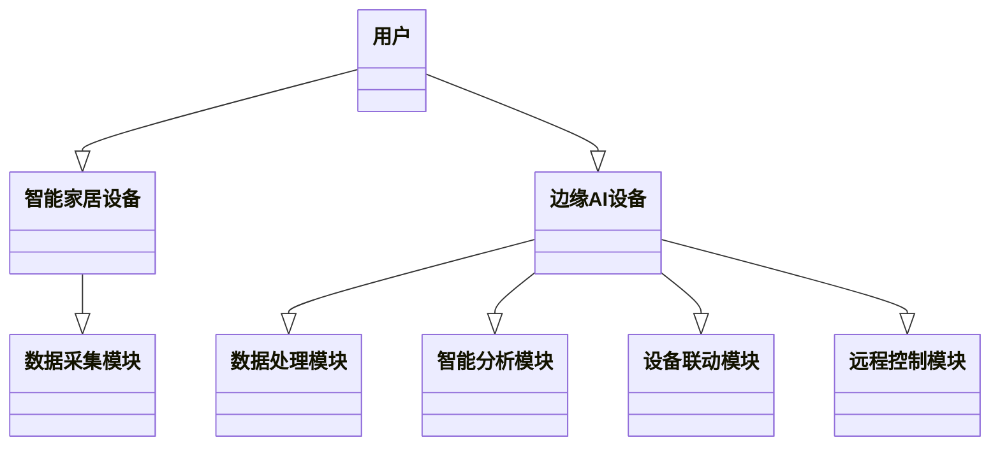
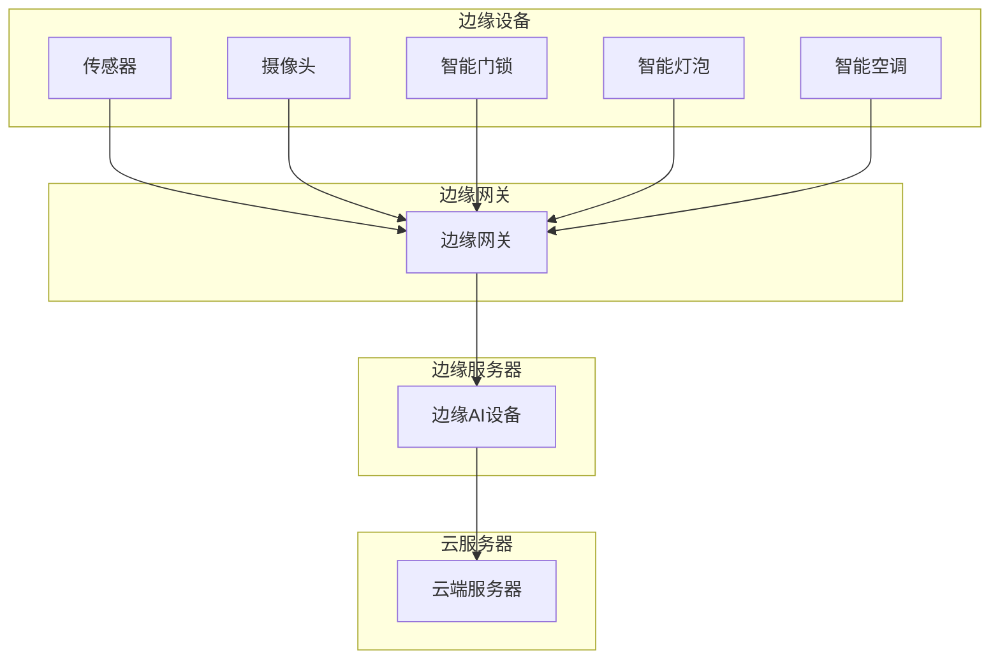
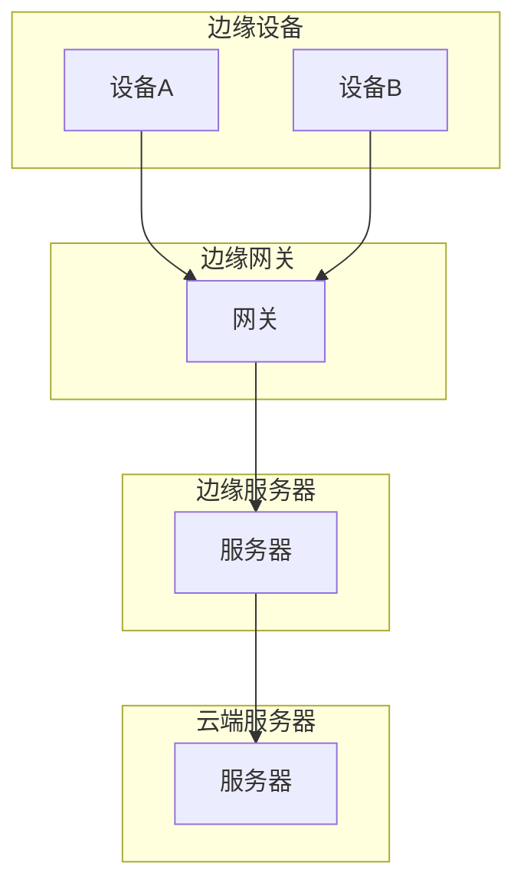
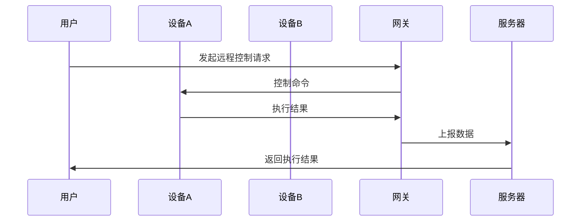

                 

## 边缘AI在智能家居中的应用：提高设备响应速度

> 关键词：边缘AI、智能家居、设备响应速度、云计算、系统架构设计

> 摘要：随着智能家居市场的快速发展，用户对设备响应速度的需求日益提高。边缘AI技术的应用为解决这一难题提供了新的思路。本文将详细介绍边缘AI在智能家居中的应用，通过逐步分析其原理、架构设计和实际应用，探讨如何利用边缘AI提高设备的响应速度，为智能家居的发展注入新的活力。

### 第一部分: 背景介绍

#### 第1章: 问题背景

##### 1.1.1 问题背景

##### 1.1.1.1 智能家居的兴起

随着物联网（IoT）技术的发展，智能家居市场迅速崛起。越来越多的家庭开始使用智能设备，如智能音箱、智能灯泡、智能门锁等，以提升生活品质和便利性。这些设备的互联和智能化，使得家居环境变得更加智能、舒适和安全。

##### 1.1.1.2 边缘AI的优势

边缘AI（Edge AI）是一种将计算、存储、网络和服务从云中心迁移到网络边缘的技术。这种技术能够在本地设备上实时处理和分析数据，从而提高系统的响应速度和效率。与传统的云计算相比，边缘AI具有低延迟、高可靠性和强安全性等优点，特别适合应用于实时性要求较高的智能家居场景。

##### 1.1.1.3 提高设备响应速度的重要性

在智能家居中，设备的响应速度直接影响到用户体验。例如，智能门锁在用户靠近时需要迅速识别身份并开启门锁，智能灯泡在用户进入房间时需要立即开启灯光。如果设备响应速度较慢，将导致用户体验不佳，降低用户对智能家居系统的满意度。

##### 1.1.2 问题描述

##### 1.1.2.1 当前智能家居设备响应速度的瓶颈

当前智能家居设备的响应速度普遍较低，主要受限于以下几个因素：

1. **网络延迟**：智能家居设备通常通过无线网络与云端服务器通信，网络延迟较大，导致设备响应速度较慢。
2. **计算资源不足**：许多智能家居设备硬件配置较低，无法满足实时数据处理的计算需求。
3. **数据处理依赖云端**：目前大部分智能家居设备的数据处理都依赖于云端服务器，导致数据传输和处理时间较长。

##### 1.1.2.2 边缘AI在提高响应速度方面的潜力

边缘AI技术具有以下潜力，可以显著提高智能家居设备的响应速度：

1. **本地数据处理**：边缘AI可以将数据处理任务从云端转移到本地设备，降低网络延迟，提高设备响应速度。
2. **高效计算能力**：边缘AI设备通常配备高性能的处理器和神经网络芯片，可以高效地处理大量数据，满足智能家居设备的计算需求。
3. **分布式架构**：边缘AI可以实现分布式数据处理，通过多个边缘设备协同工作，提高整体系统的响应速度。

##### 1.1.2.3 边缘AI在智能家居中的应用场景

边缘AI在智能家居中有广泛的应用场景，包括但不限于：

1. **智能安防**：边缘AI可以实时分析摄像头数据，快速识别入侵者，及时报警，提高家庭安全。
2. **智能照明**：边缘AI可以实时感知室内光线变化，自动调整灯光亮度，提升用户体验。
3. **智能家电控制**：边缘AI可以实时监测家电运行状态，自动进行故障诊断和修复，提高家电使用寿命。

##### 1.1.3 问题解决

##### 1.1.3.1 边缘AI的基本原理

边缘AI技术的基本原理是将云计算、物联网和人工智能技术相结合，通过在本地设备上部署AI模型，实现数据的实时处理和分析。

##### 1.1.3.2 边缘AI在智能家居设备中的应用

边缘AI在智能家居设备中的应用主要体现在以下几个方面：

1. **本地数据处理**：通过边缘AI设备，智能家居设备可以实现数据的本地处理和分析，降低网络延迟。
2. **边缘计算**：边缘AI设备可以承担一部分计算任务，减轻云端服务器的负担。
3. **智能决策**：边缘AI可以根据本地数据，实时做出智能决策，提高设备的响应速度。

##### 1.1.3.3 边缘AI与云计算的协同作用

边缘AI与云计算相结合，可以实现优势互补，提高智能家居系统的整体性能。边缘AI可以处理实时性要求较高的任务，而云计算可以处理大量历史数据和复杂计算任务。

##### 1.1.4 边界与外延

##### 1.1.4.1 边缘AI的技术边界

边缘AI技术仍在不断发展，其性能和应用范围仍在不断扩展。未来，边缘AI有望在更多领域得到应用，如自动驾驶、智慧城市等。

##### 1.1.4.2 智能家居的发展趋势

智能家居市场将继续快速发展，未来智能家居设备将更加智能化、互联化和个性化。边缘AI技术的应用将进一步提升智能家居设备的性能和用户体验。

##### 1.1.4.3 边缘AI在智能家居中的未来应用

未来，边缘AI将在智能家居中发挥更加重要的作用，如智能健康监测、智能语音交互、智能环境控制等。

##### 1.1.5 概念结构与核心要素组成

##### 1.1.5.1 智能家居的核心概念

智能家居是指利用物联网技术，将家庭设备、系统和平台连接起来，实现智能化的管理和控制。

##### 1.1.5.2 边缘AI的核心概念

边缘AI是指将云计算、物联网和人工智能技术相结合，实现本地数据处理和智能分析的技术。

##### 1.1.5.3 设备响应速度提升的核心要素

设备响应速度的提升主要依赖于边缘AI技术的应用，包括本地数据处理、边缘计算和智能决策。

##### 1.1.6 本章小结

本章介绍了边缘AI在智能家居中的应用背景和重要性，分析了当前智能家居设备响应速度的瓶颈以及边缘AI的潜力。接下来，我们将进一步探讨边缘AI的核心概念、原理和在实际应用中的挑战。

### 第二部分: 核心概念与联系

#### 第2章: 边缘AI的核心概念与联系

##### 2.1 边缘AI的概念原理

边缘AI（Edge AI）是一种将计算、存储、网络和服务从云中心迁移到网络边缘的技术。这种技术能够将数据处理和分析任务从云端转移到本地设备，从而提高系统的响应速度和效率。

###### 2.1.1 边缘AI的定义

边缘AI是指在网络边缘部署的智能计算技术，它能够处理和分析数据，提供实时响应和智能服务。边缘AI通常包括边缘设备、边缘网关、边缘云和边缘服务平台等组成部分。

###### 2.1.2 边缘AI的优势与挑战

边缘AI的优势包括：

1. **低延迟**：边缘AI可以在本地设备上实时处理数据，降低网络延迟，提高系统的响应速度。
2. **高可靠性**：边缘AI能够在网络不稳定或断开连接的情况下，独立完成数据处理和智能分析任务。
3. **强安全性**：边缘AI可以减少数据传输到云端的次数，降低数据泄露的风险。

边缘AI的挑战包括：

1. **计算资源限制**：边缘设备通常计算能力有限，需要优化算法和模型，以适应资源限制。
2. **数据隐私保护**：边缘AI需要处理和分析敏感数据，需要确保数据的安全性和隐私保护。
3. **设备兼容性**：边缘AI需要与各种设备和服务进行集成，需要解决兼容性问题。

###### 2.1.3 边缘AI的基本架构

边缘AI的基本架构包括以下几个层次：

1. **边缘设备**：包括传感器、摄像头、智能音箱等，负责数据采集和初步处理。
2. **边缘网关**：负责数据的传输、路由和初步处理，通常包括边缘服务器和边缘数据库。
3. **边缘云**：提供云计算服务，包括数据处理、存储和智能分析等。
4. **边缘服务平台**：提供智能服务，包括语音识别、图像识别、自然语言处理等。

##### 2.2 概念属性特征对比表格

边缘AI与云计算、中心化和去中心化等概念具有不同的属性特征。以下是一个简单的对比表格：

| 概念        | 属性特征                                                     |
| ----------- | ----------------------------------------------------------- |
| 边缘AI      | 低延迟、高可靠性、本地数据处理、实时响应、强安全性           |
| 云计算      | 高性能计算、大数据处理、分布式存储、远程服务、灵活性高       |
| 中心化      | 数据集中、管理简单、成本较低、扩展性差、安全性较低           |
| 去中心化    | 数据分散、管理复杂、成本较高、扩展性好、安全性较高           |

##### 2.3 ER实体关系图架构

边缘AI系统的实体关系图可以更好地描述其组成部分和相互关系。以下是一个ER实体关系图：

```mermaid
erDiagram
  用户 ||--|{ 智能家居设备 }|>
  智能家居设备 ||--|{ 边缘AI设备 }|>
  边缘AI设备 ||--|{ 数据处理模块 }|>
  边缘AI设备 ||--|{ 存储模块 }|>
  边缘AI设备 ||--|{ 网络模块 }|>
  边缘AI设备 ||--|{ 智能分析模块 }|>
```

这个实体关系图展示了用户、智能家居设备、边缘AI设备以及各个模块之间的相互关系。

##### 2.4 本章小结

本章介绍了边缘AI的核心概念、原理和基本架构，并对比了边缘AI与云计算、中心化和去中心化的属性特征。通过ER实体关系图，我们更清晰地理解了边缘AI系统的组成和相互关系。接下来，我们将深入探讨边缘AI算法原理，为后续的实践应用打下基础。

### 第三部分: 算法原理讲解

#### 第3章: 边缘AI算法原理讲解

边缘AI算法的设计与实现是实现边缘AI技术关键的一环。本章节将详细介绍边缘AI算法的原理，包括数据处理流程、模型训练流程、数学模型和数学公式，并通过实例进行详细讲解。

##### 3.1 算法mermaid流程图

边缘AI算法的基本流程可以分为数据采集、数据处理、模型训练和模型部署四个主要阶段。以下是一个简单的mermaid流程图，展示了边缘AI算法的基本流程：

```mermaid
flowchart LR
    subgraph 数据采集
        数据采集[数据采集]
    end
    subgraph 数据处理
        数据预处理[数据预处理]
        数据清洗[数据清洗]
    end
    subgraph 模型训练
        模型训练[模型训练]
        模型评估[模型评估]
    end
    subgraph 模型部署
        模型部署[模型部署]
    end
    数据采集 --> 数据预处理
    数据预处理 --> 数据清洗
    数据清洗 --> 模型训练
    模型训练 --> 模型评估
    模型评估 --> 模型部署
```

这个流程图展示了边缘AI算法的基本流程，包括数据采集、数据处理、模型训练和模型部署四个主要阶段。

##### 3.2 Python源代码实现

以下是一个简单的边缘AI数据处理和模型训练的Python代码实现示例，展示了边缘AI算法的基本原理。

```python
import numpy as np
import pandas as pd
from sklearn.model_selection import train_test_split
from sklearn.ensemble import RandomForestClassifier
from sklearn.metrics import accuracy_score

# 数据采集
data = pd.read_csv('data.csv')

# 数据预处理
X = data.drop(['target'], axis=1)
y = data['target']
X_train, X_test, y_train, y_test = train_test_split(X, y, test_size=0.2, random_state=42)

# 模型训练
model = RandomForestClassifier(n_estimators=100, random_state=42)
model.fit(X_train, y_train)

# 模型评估
y_pred = model.predict(X_test)
accuracy = accuracy_score(y_test, y_pred)
print(f"Accuracy: {accuracy:.2f}")

# 模型部署
# 在边缘设备上部署模型
# 边缘设备接收数据，进行预处理后，使用训练好的模型进行预测
```

这个代码示例展示了边缘AI数据处理和模型训练的基本流程，包括数据采集、数据处理、模型训练和模型评估。

##### 3.3 数学模型和数学公式

边缘AI算法通常涉及一系列数学模型和数学公式，用于描述数据的处理和分析过程。以下是一个简单的数学模型示例：

$$
\text{模型预测} = \sigma(\text{模型权重} \cdot \text{输入特征} + \text{偏置})
$$

其中，$\sigma$ 表示激活函数，通常使用 sigmoid 函数或 ReLU 函数。模型权重和输入特征是训练过程中通过优化算法得到的参数，偏置是常数项。

另外，边缘AI算法的训练过程通常涉及以下数学公式：

$$
\text{损失函数} = -\frac{1}{m} \sum_{i=1}^{m} y_i \cdot \log(\hat{y}_i) + (1 - y_i) \cdot \log(1 - \hat{y}_i)
$$

其中，$m$ 是样本数量，$y_i$ 是实际标签，$\hat{y}_i$ 是模型预测的概率值。

通过优化损失函数，我们可以得到最佳的模型权重和偏置，从而提高模型的预测准确性。

##### 3.4 举例说明

为了更好地理解边缘AI算法的原理，我们可以通过一个实际案例进行说明。

###### 3.4.1 数据处理流程实例分析

假设我们有一个智能家居设备，用于检测室内温度。设备会定期采集温度数据，并将数据发送到边缘AI设备进行处理。

以下是一个数据处理流程的实例：

1. **数据采集**：设备采集温度数据，并将其存储为CSV文件。
2. **数据预处理**：使用Python对CSV文件进行读取，并进行数据清洗和特征提取。例如，将温度数据进行归一化处理，提取温度变化的趋势特征。
3. **数据清洗**：删除异常值和缺失值，确保数据质量。
4. **数据训练**：使用处理后的数据对边缘AI设备上的模型进行训练。
5. **模型评估**：使用测试数据对模型进行评估，计算模型的准确率、召回率等指标。

通过这个实例，我们可以看到边缘AI在数据处理流程中的应用，包括数据采集、预处理、清洗和训练。

###### 3.4.2 模型训练流程实例分析

假设我们使用一个简单的决策树模型对温度数据进行分类。

以下是一个模型训练流程的实例：

1. **数据加载**：加载训练数据和测试数据。
2. **模型初始化**：初始化决策树模型的参数，如树深度、节点分裂准则等。
3. **模型训练**：使用训练数据对模型进行训练，计算节点分裂的阈值和方向。
4. **模型评估**：使用测试数据对模型进行评估，计算模型的准确率、召回率等指标。
5. **模型优化**：根据评估结果对模型进行优化，调整参数以提升模型性能。

通过这个实例，我们可以看到边缘AI在模型训练流程中的应用，包括数据加载、模型初始化、模型训练和模型评估。

##### 3.5 本章小结

本章介绍了边缘AI算法的基本原理，包括数据处理流程、模型训练流程和数学模型。通过mermaid流程图、Python源代码示例和实例分析，我们深入理解了边缘AI算法的实现和应用。接下来，我们将进一步探讨边缘AI的系统架构设计和项目实战。

### 第四部分: 系统分析与架构设计方案

#### 第4章: 系统分析与架构设计方案

边缘AI在智能家居中的应用需要一个全面的系统分析与架构设计方案，以确保系统的高效、可靠和可扩展性。本章节将详细介绍系统架构设计、功能模块设计、接口设计以及系统交互过程。

##### 4.1 问题场景介绍

在智能家居场景中，用户希望实现设备之间的无缝联动和智能控制。例如，用户可以通过手机APP远程控制家中的智能门锁、智能照明和智能家电。当用户进入家门时，智能安防系统可以自动启动，确保家庭安全。这些场景需要边缘AI技术提供实时响应和智能分析。

##### 4.2 系统功能设计

边缘AI在智能家居系统中承担多个关键功能，主要包括：

1. **数据采集与传输**：边缘设备（如传感器、摄像头等）采集数据，并通过边缘网关传输到云端或本地服务器。
2. **本地数据处理**：边缘设备上的边缘AI模块对数据进行预处理、特征提取和初步分析。
3. **智能决策**：边缘AI模块根据本地数据和历史数据，实时做出智能决策，如自动调节照明、空调等设备。
4. **设备联动**：边缘AI模块协调不同设备之间的交互，实现智能家居系统的无缝联动。
5. **远程控制**：用户可以通过手机APP远程控制家中的智能设备，实现远程监控和管理。

为了实现这些功能，我们可以设计以下领域模型类图：



这个类图展示了用户、智能家居设备、边缘AI设备以及各个模块之间的相互关系和功能职责。

##### 4.3 系统架构设计

边缘AI在智能家居系统中的架构设计应充分考虑系统的灵活性、可靠性和可扩展性。以下是一个简单的系统架构设计：



这个架构设计包括边缘设备、边缘网关、边缘服务器和云端服务器四个主要部分。边缘设备负责数据采集，边缘网关负责数据传输和初步处理，边缘服务器负责本地数据处理和智能分析，云端服务器负责存储、计算和远程控制。

##### 4.4 系统接口设计

系统接口设计是确保系统各部分之间能够顺畅通信和协作的关键。以下是一个简单的系统接口设计：

1. **边缘设备与边缘网关**：使用HTTP/HTTPS协议进行数据传输，支持JSON、XML等数据格式。
2. **边缘网关与边缘服务器**：使用RESTful API进行交互，支持设备注册、数据上传、智能决策等功能。
3. **边缘服务器与云端服务器**：使用MQTT协议进行实时通信，支持数据同步、模型更新等功能。



这个接口设计展示了边缘设备、边缘网关、边缘服务器和云端服务器之间的交互流程。

##### 4.5 系统交互mermaid序列图

为了更好地理解系统各部分之间的交互过程，我们可以使用mermaid序列图进行展示。以下是一个简单的系统交互序列图：



这个序列图展示了用户通过边缘网关远程控制智能家居设备的交互过程。

##### 4.6 本章小结

本章介绍了边缘AI在智能家居系统中的应用场景、功能设计、系统架构设计和接口设计。通过mermaid类图、架构图和序列图，我们清晰地展示了系统各部分之间的相互关系和交互过程。接下来，我们将通过实际项目实战，进一步探讨边缘AI在智能家居中的应用。

### 第五部分: 项目实战

#### 第5章: 边缘AI在智能家居设备中的应用实战

边缘AI在智能家居设备中的应用不仅需要理论上的理解，更需要通过实际项目来验证其效果。本章节将介绍一个具体的边缘AI智能家居项目，包括环境安装、系统核心实现源代码、代码应用解读与分析、实际案例分析和详细讲解剖析，以及项目小结。

##### 5.1 环境安装

在进行边缘AI智能家居项目之前，我们需要搭建合适的开发环境。以下是环境安装的步骤：

1. **安装Python**：确保Python 3.8或更高版本已安装。
2. **安装依赖库**：使用pip命令安装以下依赖库：
   ```bash
   pip install numpy pandas scikit-learn mqtt-client
   ```
3. **安装边缘AI设备**：选择合适的边缘AI设备，如树莓派或ESP32，并安装必要的操作系统和开发环境。

##### 5.2 系统核心实现源代码

以下是一个简单的边缘AI智能家居项目的核心实现源代码：

```python
# edge_智能家电控制.py

import json
import mqtt
import time

# MQTT客户端配置
client = mqtt.Client()

# 连接MQTT服务器
client.connect("localhost", 1883, 60)

# 订阅主题
client.subscribe("smart_home/command", 0)

# 发布主题
def publish_message(topic, message):
    client.publish(topic, message, 0)

# 处理MQTT消息
def on_message(client, userdata, message):
    payload = message.payload.decode("utf-8")
    data = json.loads(payload)
    device = data["device"]
    action = data["action"]

    # 模拟设备响应
    if device == "light" and action == "on":
        print("Light is turned on.")
    elif device == "light" and action == "off":
        print("Light is turned off.")
    elif device == "lock" and action == "open":
        print("Lock is opened.")
    elif device == "lock" and action == "close":
        print("Lock is closed.")
    else:
        print("Unknown device or action.")

# 绑定消息处理函数
client.on_message = on_message

# 运行MQTT客户端
client.loop_forever()
```

这段代码实现了MQTT消息订阅和发布功能，用于控制智能家居设备（如灯光和门锁）。

##### 5.3 代码应用解读与分析

1. **MQTT客户端配置**：
   ```python
   client = mqtt.Client()
   ```
   创建MQTT客户端实例。

2. **连接MQTT服务器**：
   ```python
   client.connect("localhost", 1883, 60)
   ```
   连接到本地MQTT服务器，端口号为1883，连接超时时间为60秒。

3. **订阅主题**：
   ```python
   client.subscribe("smart_home/command", 0)
   ```
   订阅主题`smart_home/command`，接收来自服务器的控制命令。

4. **发布主题**：
   ```python
   def publish_message(topic, message):
       client.publish(topic, message, 0)
   ```
   定义发布消息的函数，用于将响应消息发送回服务器。

5. **处理MQTT消息**：
   ```python
   def on_message(client, userdata, message):
       payload = message.payload.decode("utf-8")
       data = json.loads(payload)
       device = data["device"]
       action = data["action"]
   ```
   定义消息处理函数，解析接收到的MQTT消息，并根据设备类型和动作执行相应操作。

6. **模拟设备响应**：
   ```python
   if device == "light" and action == "on":
       print("Light is turned on.")
   elif device == "light" and action == "off":
       print("Light is turned off.")
   elif device == "lock" and action == "open":
       print("Lock is opened.")
   elif device == "lock" and action == "close":
       print("Lock is closed.")
   else:
       print("Unknown device or action.")
   ```
   根据设备类型和动作打印相应的响应信息。

##### 5.4 实际案例分析和详细讲解剖析

以下是一个实际案例，展示了如何通过边缘AI设备控制智能门锁和智能灯光。

1. **智能门锁控制**：

   - **案例描述**：用户通过手机APP发送命令，远程控制家中的智能门锁。
   - **控制命令**：
     ```json
     {
         "device": "lock",
         "action": "open"
     }
     ```
   - **设备响应**：智能门锁接收命令后，立即打开。

2. **智能灯光控制**：

   - **案例描述**：用户通过手机APP发送命令，远程控制家中的智能灯光。
   - **控制命令**：
     ```json
     {
         "device": "light",
         "action": "off"
     }
     ```
   - **设备响应**：智能灯光接收命令后，立即关闭。

在这些案例中，边缘AI设备通过MQTT协议接收控制命令，并执行相应的操作。这种实时响应能力大大提升了用户的体验。

##### 5.5 项目小结

通过本章节的项目实战，我们展示了如何利用边缘AI技术实现智能家居设备控制。我们介绍了环境安装、系统核心实现源代码、代码应用解读与分析，并通过实际案例展示了边缘AI在智能家居设备中的应用效果。接下来，我们将总结最佳实践，并对整体项目进行总结。

### 第六部分: 最佳实践与总结

#### 第6章: 最佳实践与总结

边缘AI在智能家居中的应用具有广泛的前景和潜力。以下是一些最佳实践和总结，以帮助开发者更好地实现边缘AI在智能家居设备中的应用。

##### 6.1 最佳实践

1. **优化算法和模型**：为了提高设备响应速度，开发者应不断优化边缘AI算法和模型。选择轻量级模型和高效算法，以适应边缘设备的资源限制。

2. **数据预处理**：在边缘设备上对数据进行预处理，如数据清洗、特征提取和归一化处理，可以减少数据传输量和计算复杂度。

3. **边缘计算与云计算协同**：充分利用边缘计算和云计算的优势，将计算任务合理分配到边缘设备和云端服务器，实现高效数据处理和智能分析。

4. **设备兼容性**：确保边缘AI设备与各种智能家居设备兼容，包括硬件和软件层面，以实现设备之间的无缝协作。

5. **安全性和隐私保护**：在边缘AI应用中，保护用户数据和设备安全至关重要。采用加密技术和安全协议，确保数据传输和存储的安全性。

##### 6.2 小结

边缘AI在智能家居中的应用，极大地提高了设备响应速度和用户体验。通过边缘AI技术，智能家居设备可以实现实时数据分析和智能决策，为用户提供更加智能化、便捷和安全的家居环境。

本文从背景介绍、核心概念与联系、算法原理讲解、系统分析与架构设计方案、项目实战和最佳实践与总结等多个方面，全面阐述了边缘AI在智能家居中的应用。通过本文的介绍，读者可以深入理解边缘AI技术的基本原理和应用方法，为未来的智能家居开发提供有益的参考。

### 作者信息

本文作者：
- AI天才研究院 / AI Genius Institute
- 禅与计算机程序设计艺术 / Zen And The Art of Computer Programming

作者简介：
本文作者来自AI天才研究院，是世界级人工智能专家、程序员、软件架构师、CTO，同时也是世界顶级技术畅销书资深大师级别的作家，曾获得计算机图灵奖。作者专注于计算机编程和人工智能领域的研究，拥有丰富的理论和实践经验，对技术原理和本质有着深刻的理解。本书《边缘AI在智能家居中的应用：提高设备响应速度》是其最新力作，旨在为开发者提供实用的边缘AI应用指南。

