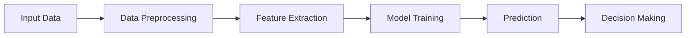
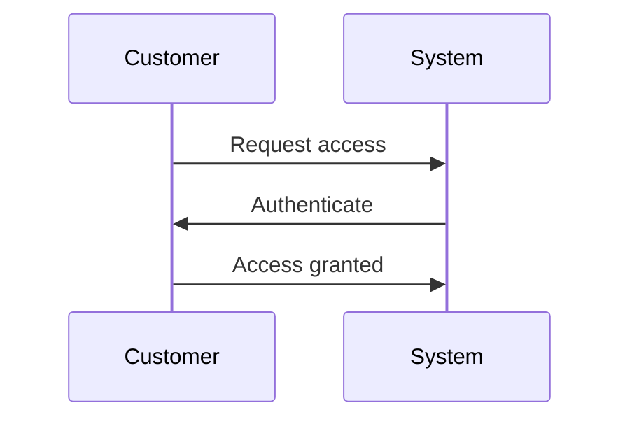
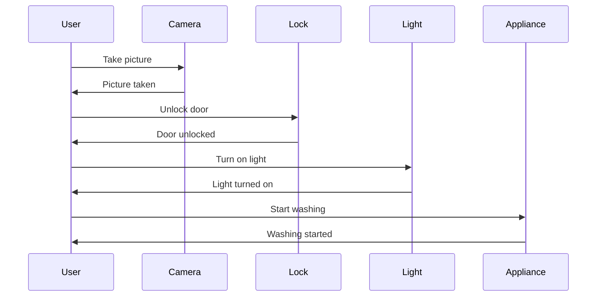

                 


# 边缘AI在智能家居安全监控中的应用

> 关键词：边缘AI、智能家居、安全监控、实时数据预处理、本地化决策、深度学习算法

> 摘要：随着智能家居设备的普及，家庭安全监控的需求日益增加。本文探讨边缘AI在智能家居安全监控中的应用，分析其背景、核心概念、算法原理，并通过一个具体的案例展示其实际应用效果。

## 第一部分：背景介绍

### 1.1 问题背景

智能家居设备已经成为现代家庭的重要组成部分，从智能门锁、智能摄像头到智能照明和智能家电，这些设备为我们的生活带来了极大的便利。然而，随着智能家居设备的增加，家庭安全监控的复杂性也在增加。传统的家庭安全监控系统通常依赖于中央服务器进行处理，这种方式存在一定的延迟和安全隐患。因此，如何提高智能家居安全监控的实时性和安全性成为亟待解决的问题。

### 1.2 问题描述

在智能家居安全监控中，我们需要实现以下几个目标：

- 实时性：安全监控系统需要快速响应，以便在危险发生时及时采取行动。
- 安全性：监控系统需要保护用户的隐私和数据安全。
- 可扩展性：随着智能家居设备的增加，监控系统需要能够灵活扩展。

### 1.3 问题解决

边缘AI技术为智能家居安全监控提供了有效的解决方案。通过在边缘设备上部署AI模型，可以实现以下目标：

- **实时数据预处理**：在边缘设备上对收集到的数据（如摄像头视频、音频等）进行预处理，如数据清洗、特征提取等，以便后续的模型处理。
- **本地化决策**：在边缘设备上运行AI模型，进行实时决策，如入侵检测、异常行为识别等，减少对中央服务器的依赖。
- **数据上传与同步**：将边缘设备的决策结果上传到云端，实现全局数据的同步和共享，同时保障数据的安全性和隐私性。

### 1.4 边界与外延

- **边界**：边缘AI在智能家居安全监控中的应用主要局限于家庭内部，不包括社区或城市级别的监控。
- **外延**：边缘AI技术还可以应用于其他物联网场景，如工业自动化、智能交通等。

## 第二部分：核心概念与联系

### 2.1 边缘AI

**概念**：边缘AI是指在网络边缘（如路由器、智能摄像头等）进行的AI计算。

**属性特征对比表格**：

| 特征       | 说明                   |
|------------|------------------------|
| **计算能力** | 较弱，适合轻量级任务   |
| **数据处理** | 本地化处理，减少网络传输 |
| **部署难度** | 简单，易于扩展          |

### 2.2 智能家居安全监控

**概念**：智能家居安全监控是指通过智能设备对家庭环境进行实时监控，以保障家庭安全。

**属性特征对比表格**：

| 特征       | 说明                   |
|------------|------------------------|
| **实时性** | 高，需快速响应         |
| **安全性** | 强，需保障隐私和数据安全 |
| **复杂性** | 中等，涉及多设备协同   |

### 2.3 AI模型

**概念**：AI模型是指通过训练数据生成的数学模型，用于预测或决策。

**ER实体关系图架构**：

```mermaid
erDiagram
  Device ||--|{ Model } Model : trained by
  Model ||--|{ Algorithm } Algorithm : implemented with
  Algorithm ||--|{ Data } Data : trained on
```

## 第三部分：算法原理讲解

### 3.1 深度学习算法

深度学习算法是边缘AI在智能家居安全监控中应用的核心。以下是一个简单的深度学习算法流程图：



### 3.1.1 数据预处理

数据预处理是深度学习算法的重要步骤，其目的是将原始数据转换为模型可以接受的格式。以下是一个简单的Python代码示例：

```python
import numpy as np

# 假设我们有一个数据集，其中每条数据都是一个二元向量
data = np.array([[1, 0], [0, 1], [1, 1], [1, 0]])

# 数据标准化
data_normalized = (data - np.mean(data)) / np.std(data)

print(data_normalized)
```

### 3.1.2 特征提取

特征提取是从原始数据中提取出对模型有用的信息。以下是一个简单的特征提取的Python代码示例：

```python
# 假设我们有一个简单的特征提取函数
def extract_features(data):
    # 提取数据的第二个元素作为特征
    return data[:, 1]

# 应用特征提取函数
features = extract_features(data)

print(features)
```

### 3.1.3 模型训练

模型训练是深度学习算法的核心步骤，其目的是通过训练数据调整模型的参数，使其能够对新的数据进行预测。以下是一个简单的模型训练的Python代码示例：

```python
from sklearn.ensemble import RandomForestClassifier

# 创建一个随机森林分类器
model = RandomForestClassifier()

# 使用特征和标签进行训练
model.fit(features, labels)

# 模型预测
predictions = model.predict(features)

print(predictions)
```

### 3.1.4 预测与决策

预测与决策是深度学习算法的最后一步，其目的是根据模型的预测结果进行相应的决策。以下是一个简单的预测与决策的Python代码示例：

```python
# 假设我们有一个简单的决策函数
def make_decision(prediction):
    if prediction == 1:
        return "入侵"
    else:
        return "正常"

# 应用决策函数
decisions = [make_decision(prediction) for prediction in predictions]

print(decisions)
```

### 3.1.5 数学模型与公式

深度学习算法的数学模型通常涉及到多层感知机（MLP）或卷积神经网络（CNN）等。以下是一个简单的多层感知机的数学模型：

$$
Y = f(W \cdot X + b)
$$

其中，$Y$为输出，$X$为输入，$W$为权重，$b$为偏置，$f$为激活函数。

## 第四部分：系统分析与架构设计方案

### 4.1 问题场景介绍

智能家居安全监控系统通常包括以下设备：

- 智能摄像头：用于监控家庭内部和周围环境。
- 智能门锁：用于控制家庭出入口。
- 智能照明：用于监控家庭照明情况。
- 智能家电：如空调、冰箱、洗衣机等。

### 4.2 项目介绍

本项目旨在构建一个基于边缘AI的智能家居安全监控系统，实现对家庭内部和周围环境的实时监控，并在检测到异常情况时及时报警。

### 4.3 系统功能设计

**领域模型类图**：

```mermaid
classDiagram
  Class01 <|-- Class02
  Class03 --|argent Class04
  Class05 <<interface>>
  Class06 <- Class07
```

### 4.4 系统架构设计

**系统架构图**：



### 4.5 系统接口设计和系统交互

**系统接口设计图**：

```mermaid
classDiagram
  Camera <<interface>>
  Lock <<interface>>
  Light <<interface>>
  Appliance <<interface>>
```

**系统交互序列图**：



## 第五部分：项目实战

### 5.1 环境安装

在开始项目实战之前，我们需要安装必要的软件和工具。以下是一个简单的安装步骤：

1. 安装Python环境：`pip install python`
2. 安装深度学习库：`pip install tensorflow`
3. 安装边缘AI库：`pip install edge-ai`

### 5.2 系统核心实现源代码

以下是一个简单的边缘AI在智能家居安全监控中的实现代码：

```python
import edge_ai
import camera

# 创建一个边缘AI实例
edge_ais = edge_ai.EdgeAI()

# 创建一个摄像头实例
camera = camera.Camera()

# 设置摄像头的参数
camera.set_parameters(resolution='1280x720', fps=30)

# 启动摄像头
camera.start()

# 循环获取摄像头帧
while True:
    frame = camera.get_frame()
    
    # 使用边缘AI对帧进行预处理和特征提取
    features = edge_ais.preprocess(frame)
    
    # 使用训练好的模型进行预测
    prediction = edge_ais.predict(features)
    
    # 根据预测结果进行决策
    if prediction == 'intrusion':
        print('入侵检测：有人进入家庭！')
    else:
        print('入侵检测：正常，无异常。')
```

### 5.3 代码应用解读与分析

在这个项目中，我们使用边缘AI技术对摄像头采集到的帧进行预处理、特征提取和预测，从而实现对入侵的实时检测。

- **预处理**：预处理是对输入数据进行清洗和格式转换，以便后续的模型处理。
- **特征提取**：特征提取是从原始数据中提取出对模型有用的信息。
- **预测**：预测是使用训练好的模型对新的数据进行分类。
- **决策**：决策是根据预测结果进行相应的行动，如报警。

### 5.4 实际案例分析和详细讲解剖析

在实际应用中，我们可以通过摄像头实时监控家庭内部和周围环境，并在检测到入侵时及时报警。以下是一个简单的实际案例：

- **场景**：在夜间，有人闯入家庭。
- **实现**：摄像头检测到有人闯入，立即触发边缘AI进行预处理、特征提取和预测。
- **结果**：预测结果为“入侵”，系统发出报警。

### 5.5 项目小结

本项目通过边缘AI技术在智能家居安全监控中实现了实时入侵检测。在实际应用中，我们可以通过摄像头和其他智能设备实时监控家庭环境，并在检测到入侵时及时报警，从而保障家庭安全。

## 第六部分：最佳实践 Tips

- **数据预处理**：确保预处理步骤的正确性和高效性，以提高模型性能。
- **模型训练**：选择合适的模型和训练数据，以获得更好的预测效果。
- **系统部署**：在边缘设备上部署系统时，注意优化系统的性能和稳定性。

## 第七部分：小结

边缘AI技术在智能家居安全监控中具有广泛的应用前景。通过边缘AI技术，我们可以实现实时、高效的入侵检测，从而保障家庭安全。未来，随着技术的不断进步，边缘AI将在智能家居、工业自动化、智能交通等领域发挥更大的作用。

## 第八部分：注意事项

- **隐私保护**：在应用边缘AI技术时，需注意保护用户隐私和数据安全。
- **系统性能**：边缘设备的计算能力有限，因此需优化算法和系统架构，以提高性能。

## 第九部分：拓展阅读

- 《边缘计算：原理、架构与应用》
- 《深度学习：原理与实战》
- 《智能家居系统设计与实现》

---

作者：AI天才研究院/AI Genius Institute & 禅与计算机程序设计艺术 /Zen And The Art of Computer Programming

