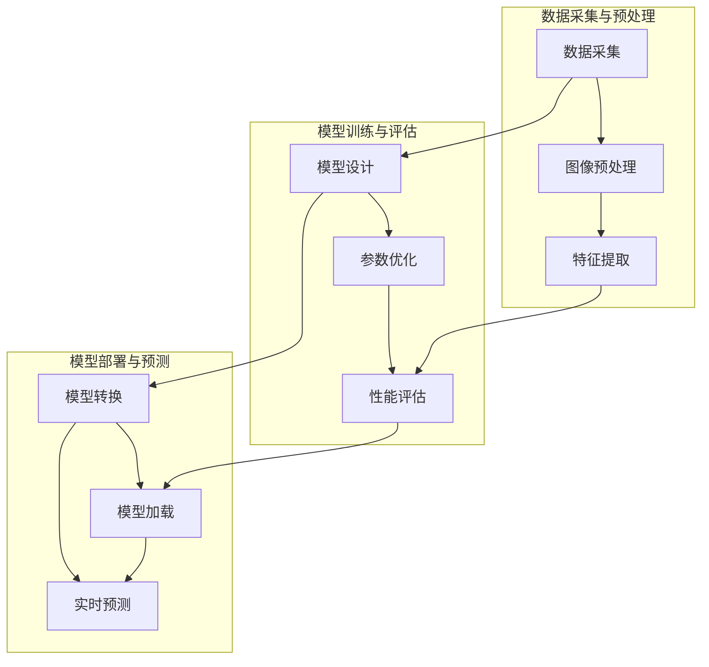
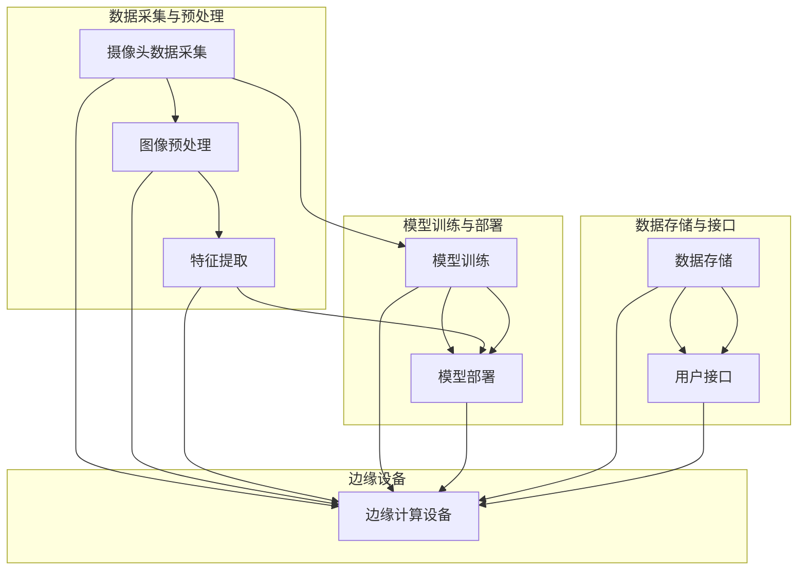

                 

### 第一部分：边缘AI基础

#### 第1章：边缘AI概述

#### 1.1 边缘AI的背景与发展

边缘AI，也称为边缘智能，是近年来随着物联网（IoT）、5G通信技术和云计算等技术的发展而逐步兴起的一个热点领域。边缘AI的目标是将数据处理和分析能力从传统的云端集中式架构转移到网络的边缘，即靠近数据源的地方，从而提高数据处理速度和响应效率，减轻网络带宽压力，并保障数据的安全性和隐私性。

**背景介绍：** 在早期的互联网时代，数据处理主要依赖于中心化的云计算架构。用户的数据首先上传到云端，然后通过云端的强大计算能力进行处理和分析。然而，随着物联网设备的普及和5G网络的快速发展，数据量和数据类型的复杂度急剧增加，传统的云计算架构开始面临诸多挑战：

1. **延迟问题**：随着数据传输距离的增加，数据从设备上传到云端需要经过多次中转，导致数据处理延迟，无法满足实时性要求。
2. **带宽瓶颈**：大规模物联网设备产生的数据量巨大，传统的网络带宽难以承载如此大的数据流量。
3. **安全性问题**：大量的敏感数据上传到云端，可能面临数据泄露和隐私侵犯的风险。

**问题描述：** 针对上述问题，边缘AI应运而生。它通过将部分计算任务下沉到网络的边缘，即靠近数据源的位置，实现了以下几个方面的优化：

1. **降低延迟**：数据在边缘设备上即可完成初步处理，减少了数据传输的距离和时间，提高了系统的响应速度。
2. **节省带宽**：部分数据处理在边缘完成，减少了上传到云端的数据量，降低了网络带宽的占用。
3. **增强安全性**：数据在边缘设备上处理，减少了数据在传输过程中的暴露风险。

**问题解决：** 边缘AI通过以下几种方式实现上述优化：

1. **分布式计算**：将计算任务分散到多个边缘设备上，共同完成数据分析和处理。
2. **高效算法**：采用轻量级的算法模型，减少计算资源的消耗。
3. **隐私保护技术**：应用加密和差分隐私等技术，保障数据的安全性和隐私性。

**边界与外延：** 边缘AI不仅涉及硬件设备，如智能路由器、智能网关、智能摄像头等，还包括软件层面，如边缘计算框架、AI算法库等。此外，边缘AI的应用场景非常广泛，包括工业自动化、智慧城市、智能交通、智能家居等。

#### 1.2 边缘AI的概念与特点

**概念说明：** 边缘AI是指在网络的边缘，即靠近数据源的地方，利用AI算法对数据进行实时处理和分析的技术。与传统的云计算相比，边缘AI具有以下几个显著特点：

1. **实时性**：边缘AI将部分计算任务下沉到边缘设备，实现了数据的本地化处理，显著降低了数据处理延迟，能够满足实时性要求。
2. **高效性**：边缘AI采用轻量级的算法模型，针对特定的应用场景进行优化，能够在有限的计算资源下实现高效的数据处理。
3. **安全性**：边缘AI通过本地化处理，减少了数据在传输过程中的暴露风险，同时应用了多种隐私保护技术，提高了数据的安全性。

**概念属性特征对比表格：**

| 特征         | 云计算         | 边缘AI         |
| ------------ | -------------- | -------------- |
| 数据处理位置 | 云端           | 边缘           |
| 延迟         | 较高           | 较低           |
| 网络带宽占用 | 较高           | 较低           |
| 安全性       | 较低           | 较高           |

**ER实体关系图架构：**

```mermaid
erDiagram
    User ||--|{ IoTDevice }|-- DeviceManager
    User ||--|{ CloudService }|-- CloudCompute
    User ||--|{ EdgeDevice }|-- EdgeCompute
    IoTDevice ||--|{ Data }|-- DataStore
    CloudService ||--|{ Service }|-- ServiceAccess
    EdgeDevice ||--|{ Algorithm }|-- AlgorithmLibrary
```

#### 1.3 边缘AI的优势与挑战

**优势：**

1. **提高系统响应速度**：边缘AI通过本地化处理，降低了数据传输的延迟，提高了系统的响应速度，尤其适用于实时性要求较高的应用场景，如自动驾驶、智能医疗等。
2. **节省网络带宽**：边缘AI实现了数据的本地处理，减少了上传到云端的数据量，节省了网络带宽资源，降低了网络拥塞的风险。
3. **增强数据安全性**：边缘AI减少了数据在传输过程中的暴露风险，同时应用了多种隐私保护技术，提高了数据的安全性。
4. **支持个性化服务**：边缘AI可以根据本地数据和用户行为特征，实现更精准的个性化服务，如智能推荐、个性化广告等。

**挑战：**

1. **计算资源有限**：边缘设备通常计算资源和存储能力有限，如何高效利用这些有限的资源进行数据处理和分析是一个重要挑战。
2. **数据隐私保护**：尽管边缘AI能够提高数据安全性，但如何有效保护数据隐私，防止数据泄露仍然是一个严峻的问题。
3. **算法优化与更新**：边缘AI的算法需要不断进行优化和更新，以满足不同应用场景的需求，但算法的更新和维护需要消耗大量的计算资源和时间。
4. **网络稳定性**：边缘AI依赖于边缘设备与云端之间的通信，网络稳定性对系统的正常运行至关重要，但边缘网络的稳定性往往难以保证。

#### 1.4 边缘AI的典型应用场景

边缘AI在多个领域展现出巨大的应用潜力，以下是一些典型的应用场景：

1. **智能制造**：在工业生产过程中，边缘AI可以实时监控设备状态，预测设备故障，优化生产流程，提高生产效率。
2. **智慧城市**：边缘AI可以用于智能交通管理，实时监测交通流量，优化信号灯控制，缓解交通拥堵。
3. **智能医疗**：边缘AI可以用于医疗设备的实时数据分析，如远程监控病人的生命体征，提供个性化的健康建议。
4. **智能家居**：边缘AI可以用于智能家居设备的管理，如智能音箱、智能门锁等，提供个性化的智能生活体验。
5. **智能农业**：边缘AI可以用于农田环境的实时监测，提供精确的灌溉、施肥建议，提高农业产量。

通过上述分析，我们可以看到边缘AI在提高系统响应速度、节省网络带宽、增强数据安全性和支持个性化服务等方面具有显著优势，但也面临计算资源有限、数据隐私保护、算法优化与更新以及网络稳定性等挑战。了解这些优势和挑战，将有助于我们在实际应用中充分发挥边缘AI的潜力，为各个领域的发展带来新的动力。

#### 第2章：边缘计算与边缘AI

#### 2.1 边缘计算的基本概念

**概念说明：** 边缘计算（Edge Computing）是一种计算范式，旨在将计算、存储和网络功能分布到网络的边缘，即在靠近数据源或用户的地方进行处理。与传统的集中式云计算不同，边缘计算通过在分布式网络边缘部署计算节点，实现了对数据的高效处理和分析。

**核心要素：** 边缘计算的核心要素包括：

1. **边缘节点**：边缘节点是指分布在网络边缘的设备或服务器，如智能路由器、智能网关、智能摄像头等。这些边缘节点具备一定的计算和存储能力，能够对数据进行初步处理。
2. **边缘网络**：边缘网络是指连接边缘节点和云端之间的通信网络，如5G网络、光纤网络等。边缘网络需要具备低延迟、高带宽和可靠性等特点，以保证数据传输的效率。
3. **边缘平台**：边缘平台是指运行在边缘节点上的计算平台，包括操作系统、中间件、应用软件等。边缘平台负责管理边缘节点的资源，提供计算、存储和网络服务。

**功能与作用：** 边缘计算的主要功能与作用包括：

1. **数据预处理**：边缘计算可以对来自物联网设备的数据进行实时预处理，包括数据清洗、去噪、特征提取等，减少数据传输量，提高数据处理效率。
2. **本地决策**：边缘计算能够基于本地数据快速做出决策，减少对云端依赖，提高系统的实时性和自主性。
3. **资源优化**：边缘计算通过在边缘节点进行数据处理，减轻了云端负载，优化了资源利用率。

**与传统云计算的对比：**

| 对比项        | 传统云计算                    | 边缘计算                    |
| ------------- | ----------------------------- | ----------------------------- |
| 数据处理位置  | 云端                           | 边缘节点                     |
| 延迟         | 较高                           | 较低                         |
| 网络带宽占用  | 较高                           | 较低                         |
| 安全性       | 较低                           | 较高                         |

#### 2.2 边缘计算与云计算的对比

**性能与资源利用：**

1. **计算性能**：传统云计算依赖于高性能服务器和数据中心，具备强大的计算能力。然而，边缘计算由于设备资源有限，通常采用轻量级的计算模型，注重性能的优化。
2. **存储容量**：传统云计算拥有大规模的数据存储能力，边缘计算则依赖于边缘节点的本地存储，存储容量相对有限。
3. **网络带宽**：边缘计算在边缘节点进行数据处理，减少了数据传输到云端的需求，降低了网络带宽的占用。

**应用场景与优势：**

1. **实时性要求高的应用**：边缘计算能够实现实时数据处理和决策，适用于自动驾驶、智能监控等需要高实时性的场景。
2. **低延迟应用**：边缘计算能够显著降低数据传输延迟，提高系统的响应速度，适用于远程医疗、在线游戏等对延迟敏感的应用。
3. **隐私保护**：边缘计算通过本地化数据处理，减少了数据在传输过程中的暴露风险，提高了数据安全性。

**挑战与局限性：**

1. **计算资源限制**：边缘计算设备通常资源有限，难以支持复杂和大规模的计算任务。
2. **网络稳定性**：边缘网络的稳定性难以保证，可能受到信号干扰、网络拥塞等因素的影响。
3. **安全性与隐私保护**：尽管边缘计算在数据本地处理方面具有优势，但仍然需要关注数据隐私保护和安全性的问题。

通过对比，我们可以看到边缘计算与云计算在性能、资源利用、应用场景等方面存在显著差异，但两者并非完全对立，而是在不同场景下发挥各自的优势，共同推动计算技术的发展。

#### 2.3 边缘AI的架构设计

**边缘AI架构概述：** 边缘AI的架构设计旨在实现边缘设备上的高效数据处理和智能分析，其核心组成部分包括边缘节点、边缘计算平台、AI算法库、数据存储和网络通信模块。

**边缘节点：** 边缘节点是边缘AI架构中的基本单元，负责数据采集、预处理和初步分析。常见的边缘节点包括智能路由器、智能网关、智能摄像头等。这些设备通常具备一定的计算和存储能力，能够实现数据的实时处理和本地化决策。

**边缘计算平台：** 边缘计算平台是边缘AI架构的核心，负责管理边缘节点的资源，提供计算、存储和网络服务。边缘计算平台通常包括操作系统、中间件和应用程序等。操作系统负责边缘节点的资源管理和调度，中间件提供数据传输、数据存储和安全性保障等功能，应用程序则负责具体的应用逻辑和AI算法的实现。

**AI算法库：** AI算法库是边缘AI架构中的关键组件，提供了丰富的AI算法和模型，如神经网络、机器学习、深度学习等。这些算法和模型可以在边缘设备上直接运行，实现数据的智能分析和处理。AI算法库通常包括预训练模型、微调模型和定制模型等，以满足不同应用场景的需求。

**数据存储模块：** 数据存储模块负责边缘节点的数据存储和管理，包括本地存储和分布式存储。本地存储通常采用闪存、硬盘等设备，用于存储边缘节点的本地数据。分布式存储则通过边缘节点之间的协作，实现数据的分布式存储和管理，提高数据的可靠性和可扩展性。

**网络通信模块：** 网络通信模块负责边缘节点与云端之间的数据传输和通信，包括边缘网关、边缘网络和云端平台等。边缘网关负责边缘节点与边缘网络之间的连接，边缘网络提供边缘节点之间的数据传输，云端平台则负责边缘节点的数据同步和集中管理。

**架构设计原则：**

1. **模块化设计**：边缘AI架构采用模块化设计，各组件之间具有清晰的接口和交互关系，便于系统的扩展和维护。
2. **分布式处理**：边缘AI架构通过分布式处理，将计算任务分散到多个边缘节点上，实现数据的高效处理和分析。
3. **灵活性**：边缘AI架构支持多种AI算法和模型，具备灵活的算法选择和定制能力，能够适应不同的应用场景。
4. **安全性**：边缘AI架构采用多种安全措施，包括数据加密、访问控制等，保障数据的安全性和隐私性。

通过以上设计原则，边缘AI架构能够实现高效、灵活和安全的边缘数据处理和智能分析，为各个领域提供强大的技术支持。

#### 2.4 边缘AI的硬件支持

**边缘AI硬件发展现状：** 随着物联网和人工智能技术的快速发展，边缘AI硬件也在不断进步。当前，边缘AI硬件主要包括高性能处理器、嵌入式系统、智能传感器等。

**高性能处理器：** 高性能处理器是边缘AI硬件的核心，用于执行复杂的计算任务。常见的处理器包括ARM处理器、Intel处理器和AMD处理器等。ARM处理器因其低功耗、高性能的特点，广泛应用于嵌入式设备和物联网设备。Intel处理器和AMD处理器则具备更高的计算性能，适用于需要处理大量数据和高性能计算的场景。

**嵌入式系统：** 嵌入式系统是边缘AI硬件的重要组成部分，用于实现边缘设备的智能化和自主化。嵌入式系统通常包括微控制器、微处理器和嵌入式操作系统等。微控制器和微处理器负责边缘设备的硬件控制和数据处理，嵌入式操作系统则提供设备的管理和调度功能。

**智能传感器：** 智能传感器是边缘AI硬件的数据采集模块，用于感知环境信息和数据。常见的智能传感器包括摄像头、麦克风、温度传感器、湿度传感器等。这些传感器能够实时采集环境数据，传输给边缘设备进行处理和分析。

**发展趋势与未来展望：** 随着技术的不断进步，边缘AI硬件将朝着更高性能、更低功耗、更智能化和更易于部署的方向发展。

1. **更高性能处理器**：未来的边缘AI硬件将采用更先进的处理器架构，如异构计算架构、AI专用处理器等，以实现更高的计算性能和能效比。
2. **更智能的传感器**：未来的智能传感器将具备更高的精度、更广的感知范围和更强的数据处理能力，为边缘AI提供更丰富的数据支持。
3. **更低的功耗**：未来的边缘AI硬件将采用更高效的电源管理技术，降低功耗，延长设备的使用寿命。
4. **更便捷的部署**：未来的边缘AI硬件将更加模块化、标准化，便于快速部署和集成，降低开发难度和成本。

**对边缘AI发展的推动作用：** 边缘AI硬件的进步将极大地推动边缘AI的发展。更高的计算性能和更智能的传感器将提高边缘AI的数据处理和分析能力，更低功耗和更便捷的部署将降低边缘AI的开发和使用成本，推动边缘AI在各个领域的广泛应用。

#### 第3章：智能摄像头与人流分析

#### 3.1 智能摄像头的功能与原理

**功能介绍：** 智能摄像头是一种集成了多种传感器和计算能力的视频监控设备，主要功能包括实时视频监控、视频分析和数据传输等。

1. **实时视频监控**：智能摄像头通过视频传感器实时捕捉场景图像，将图像传输到边缘设备或云端进行进一步处理。
2. **视频分析**：智能摄像头内置了视频分析算法，能够对视频数据进行实时分析，如人脸识别、行为分析、场景识别等。
3. **数据传输**：智能摄像头将分析结果通过无线网络或有线网络传输到边缘设备或云端，实现数据的实时共享和处理。

**原理说明：** 智能摄像头的核心原理包括图像采集、图像处理和视频传输。

1. **图像采集**：智能摄像头通过视频传感器（如CMOS传感器）捕捉场景图像，将图像信号转换为数字信号。
2. **图像处理**：智能摄像头内置的图像处理芯片对图像进行预处理，如去噪、对比度增强、图像分割等，提高图像质量。
3. **视频传输**：智能摄像头将处理后的图像通过编码压缩传输到边缘设备或云端，如H.264、H.265等视频编码标准。

**技术特点：**

1. **高分辨率**：智能摄像头具备高分辨率成像能力，能够清晰捕捉细节，提高图像质量。
2. **实时性**：智能摄像头能够实现实时视频监控和视频分析，快速响应。
3. **智能化**：智能摄像头内置了多种AI算法，如人脸识别、行为分析等，具备智能分析能力。
4. **网络通信**：智能摄像头支持多种网络通信协议，如Wi-Fi、4G/5G、有线网络等，实现稳定的数据传输。

**应用领域：**

1. **公共安全**：智能摄像头用于城市监控、交通监控、公共场所监控等，提高公共安全水平。
2. **商业应用**：智能摄像头用于商场客流分析、门店运营分析、供应链管理等，优化商业运营。
3. **智能家居**：智能摄像头用于家庭安全监控、远程看护、宠物监控等，提高家庭安全和生活便利性。

#### 3.2 人流分析的基本概念

**概念说明：** 人流分析是指通过智能摄像头或其他传感器设备，对人群的流动行为、行为特征和人数等进行实时监测和分析的技术。

**核心内容：**

1. **人群流动行为分析**：人流分析能够实时监测人群的流动路径、速度和密度等，为城市交通管理、商场运营提供数据支持。
2. **人群行为特征分析**：人流分析能够识别人群的行为特征，如聚集、分散、排队等，帮助管理者了解人群行为模式。
3. **人数统计**：人流分析能够实时统计进入或离开特定区域的人数，为商业运营、场馆管理提供数据依据。

**应用场景：**

1. **城市交通管理**：通过人流分析，实时监测交通流量和密度，优化信号灯控制，缓解交通拥堵。
2. **商业运营分析**：通过人流分析，了解商场客流量和消费行为，优化店铺布局和营销策略。
3. **场馆管理**：通过人流分析，实时监测场馆人数，确保安全运营，提高服务质量。

#### 3.3 人流分析的技术方法

**技术方法概述：** 人流分析技术主要包括图像识别、机器学习和深度学习等方法，通过这些方法，可以从图像数据中提取有价值的信息，实现对人群的实时监测和分析。

1. **图像识别**：图像识别是通过计算机视觉技术，从图像中提取目标对象和特征，如人脸、人体、车辆等。在人流分析中，图像识别用于识别人群中的特定目标，如行人、聚集区域等。
2. **机器学习**：机器学习是一种基于数据的学习方法，通过训练模型，实现对数据的自动分析和预测。在人流分析中，机器学习可以用于人群流动路径预测、行为特征识别等。
3. **深度学习**：深度学习是一种基于人工神经网络的学习方法，通过多层神经网络，实现对数据的复杂特征提取和分类。在人流分析中，深度学习可以用于人群行为分析、人数统计等。

**技术方法对比：**

| 技术方法    | 优点                             | 缺点                            |
| ----------- | -------------------------------- | -------------------------------- |
| 图像识别    | 精度高、实时性强                | 对光照、角度等环境依赖较大       |
| 机器学习    | 自动化程度高、可扩展性强       | 需要大量训练数据、预测能力有限   |
| 深度学习    | 自动化程度高、预测能力较强      | 计算资源消耗大、训练时间长       |

**适用场景：**

1. **图像识别**：适用于对精度要求较高、环境相对稳定的场景，如商场客流分析、公共安全监控等。
2. **机器学习**：适用于需要自动化分析、具有大量历史数据的场景，如交通流量预测、商业运营分析等。
3. **深度学习**：适用于需要复杂特征提取和分类、计算资源充足的场景，如智能安防、医疗诊断等。

通过以上技术方法，人流分析能够实现对人群的实时监测和分析，为各个领域提供数据支持。

#### 3.4 人流分析的应用价值

**商业领域：** 在商业领域，人流分析具有广泛的应用价值。通过智能摄像头和人流分析技术，商家可以实时了解商场的客流情况、消费者行为和店铺运营效果，从而优化店铺布局、营销策略和库存管理。

1. **客流统计**：商家可以通过人流分析系统，实时统计进入和离开商场的人数，了解商场的人流量和客流高峰时段，为门店运营提供数据支持。
2. **消费者行为分析**：通过分析消费者的移动路径、停留时间和消费行为，商家可以了解消费者的需求和偏好，优化商品陈列和营销策略。
3. **店铺布局优化**：通过分析消费者的流量分布和热点区域，商家可以优化店铺布局，提高顾客的购物体验和满意度。

**城市管理：** 在城市管理领域，人流分析技术有助于优化城市交通管理和公共资源配置。

1. **交通流量监测**：通过人流分析系统，实时监测交通流量和密度，为交通管理部门提供数据支持，优化信号灯控制和交通规划。
2. **公共安全管理**：人流分析可以用于公共场所的安全监控，实时监测人群的流动行为和聚集情况，提高公共安全水平。
3. **城市资源调度**：通过人流分析，了解城市各个区域的客流情况和活动热点，优化城市资源的配置和调度，提高城市运行效率。

**其他领域：** 人流分析技术还应用于智能交通、医疗诊断、公共安全等多个领域，为各个领域提供数据支持和智能化服务。

1. **智能交通**：通过人流分析，实时监测交通流量和密度，优化交通信号控制，提高道路通行效率。
2. **医疗诊断**：通过人流分析，了解医院和诊所的就诊人数和患者流动情况，优化医疗服务和资源配置。
3. **公共安全**：人流分析技术用于公共场所的安全监控，实时监测人群的流动行为和聚集情况，提高公共安全水平。

通过以上分析，人流分析技术在不同领域的应用具有显著的价值，为各个领域的发展提供了有力的技术支持。

#### 第4章：边缘AI在人流分析中的应用原理

#### 4.1 边缘AI在人流分析中的应用框架

**框架概述：** 边缘AI在人流分析中的应用框架主要包括数据采集、数据处理、模型训练和模型部署四个主要环节。以下将详细描述这些环节的具体内容。

**数据采集：** 数据采集是人流分析的基础，通过智能摄像头等设备，实时采集商场、交通路口、公共场所等场景的图像和视频数据。这些数据包括人员的运动轨迹、停留时间、密度分布等。数据采集的目的是获取原始数据，为后续的处理和分析提供基础。

**数据处理：** 数据处理环节包括数据清洗、去噪和特征提取等步骤。通过图像处理技术，对采集到的图像进行预处理，去除噪声和无关信息，提取有价值的特征，如人脸、人体轮廓、人群密度等。这些特征将被用于模型训练和预测。

**模型训练：** 模型训练环节使用机器学习和深度学习算法，对处理后的特征数据进行训练，构建人流分析模型。常用的算法包括卷积神经网络（CNN）、循环神经网络（RNN）、长短期记忆网络（LSTM）等。训练过程包括模型设计、参数优化和性能评估等步骤，旨在构建一个能够准确预测人流动态的模型。

**模型部署：** 模型部署是将训练好的模型部署到边缘设备上，实现实时人流分析。部署过程包括模型转换、模型加载和实时预测等步骤。在边缘设备上，模型接收实时视频数据，进行特征提取和预测，生成人流分析结果，如人群密度、流动方向等。这些结果可以实时传输到云端或本地进行进一步处理和分析。

**系统架构图：**



通过以上框架，边缘AI能够实现对人流分析的实时、高效和精确处理，为各个领域提供数据支持和智能化服务。

#### 4.2 边缘AI在人流分析中的算法原理

**算法概述：** 边缘AI在人流分析中的应用算法主要包括图像处理算法、机器学习算法和深度学习算法。以下将详细介绍这些算法的基本原理。

**图像处理算法：** 图像处理算法用于对采集到的图像进行预处理，去除噪声和无关信息，提取有用的特征。常见的图像处理算法包括滤波、边缘检测、图像分割等。

1. **滤波**：滤波算法用于去除图像中的噪声，常用的滤波器包括均值滤波、高斯滤波和中值滤波等。均值滤波通过计算像素点的平均值来平滑图像，高斯滤波使用高斯函数进行加权平均，中值滤波选择像素点的中值来平滑图像。
   
2. **边缘检测**：边缘检测算法用于提取图像中的边缘信息，常用的算法包括Sobel算子、Canny算子和Laplacian算子等。这些算法通过计算图像的梯度或二阶导数来检测边缘。

3. **图像分割**：图像分割算法用于将图像划分为不同的区域，常用的算法包括阈值分割、区域生长和轮廓检测等。阈值分割通过设置阈值将图像划分为前景和背景，区域生长基于已标记的种子点，逐步扩展到相邻像素，轮廓检测通过计算图像的轮廓线来实现图像分割。

**机器学习算法：** 机器学习算法用于训练模型，对人流进行分析和预测。常见的机器学习算法包括线性回归、逻辑回归、决策树和随机森林等。

1. **线性回归**：线性回归算法通过建立自变量和因变量之间的线性关系，预测因变量的值。在人流分析中，线性回归可以用于预测人群流量和密度。

2. **逻辑回归**：逻辑回归算法是一种广义线性模型，用于分类问题。在人流分析中，逻辑回归可以用于判断人群是否聚集、是否违反安全规定等。

3. **决策树**：决策树算法通过一系列规则进行决策，将数据集划分为不同的区域。在人流分析中，决策树可以用于分析人群的行为特征和流动路径。

4. **随机森林**：随机森林是一种基于决策树的集成学习算法，通过构建多棵决策树，提高预测的准确性和稳定性。在人流分析中，随机森林可以用于预测人群的流动方向和聚集程度。

**深度学习算法：** 深度学习算法通过多层神经网络，实现对数据的复杂特征提取和分类。常见的深度学习算法包括卷积神经网络（CNN）、循环神经网络（RNN）和长短期记忆网络（LSTM）等。

1. **卷积神经网络（CNN）**：CNN通过卷积层、池化层和全连接层，实现对图像的逐层特征提取和分类。在人流分析中，CNN可以用于检测和识别人群中的特定目标，如行人、聚集区域等。

2. **循环神经网络（RNN）**：RNN通过循环结构，实现对序列数据的建模和预测。在人流分析中，RNN可以用于预测人群的流动路径和密度变化。

3. **长短期记忆网络（LSTM）**：LSTM是RNN的一种改进，通过引入门控机制，解决了RNN的梯度消失和梯度爆炸问题。在人流分析中，LSTM可以用于长时间序列的预测，如交通流量预测和商场客流预测。

**算法比较与适用场景：**

| 算法类型       | 优点                   | 缺点                             | 适用场景               |
| -------------- | ---------------------- | -------------------------------- | ---------------------- |
| 图像处理算法   | 实时性强、精度较高     | 对光照、角度等环境依赖较大       | 室内场景、简单特征提取 |
| 机器学习算法   | 自动化程度高、预测能力较强 | 需要大量训练数据、预测能力有限   | 中等复杂度场景         |
| 深度学习算法   | 自动化程度高、预测能力较强 | 计算资源消耗大、训练时间长       | 高复杂度场景           |

通过以上算法，边缘AI能够实现对人流分析的实时、高效和精确处理，为各个领域提供数据支持和智能化服务。

#### 4.3 边缘AI在人流分析中的数据处理

**数据处理流程：** 边缘AI在人流分析中的数据处理流程主要包括数据采集、数据预处理、数据存储和数据共享四个步骤。

**数据采集：** 数据采集是通过智能摄像头和其他传感器设备，实时获取商场、交通路口、公共场所等场景的图像和视频数据。这些数据包括人员的运动轨迹、停留时间、密度分布等，是人流分析的基础。

**数据预处理：** 数据预处理是对采集到的图像和视频数据进行清洗、去噪和特征提取等操作。具体步骤包括：

1. **图像增强**：通过图像滤波、边缘检测和图像分割等技术，提高图像质量，提取有用的特征。
2. **数据标准化**：将图像数据转化为统一的格式，如灰度图或二值图，方便后续处理。
3. **特征提取**：通过卷积神经网络（CNN）或其他图像处理算法，提取图像中的关键特征，如人脸、人体轮廓、人群密度等。

**数据存储：** 数据存储是将处理后的数据存储到边缘设备或云端数据库中。为了提高数据处理效率和存储容量，可以采用以下几种数据存储技术：

1. **分布式存储**：通过分布式存储系统，将数据分散存储在多个边缘节点上，提高数据的可靠性和可扩展性。
2. **云存储**：将部分重要数据上传到云端存储，利用云存储的高带宽、高可靠性优势。
3. **边缘存储**：在边缘设备上部署本地存储，如闪存、硬盘等，用于存储实时数据和临时数据。

**数据共享：** 数据共享是将处理后的数据共享给其他系统和应用。为了实现高效的数据共享，可以采用以下几种技术：

1. **数据管道**：通过数据管道技术，将处理后的数据实时传输到其他系统和应用，实现数据的无缝对接。
2. **API接口**：通过API接口，将数据处理结果暴露给其他系统，方便其他系统进行调用和集成。
3. **消息队列**：通过消息队列技术，将数据处理结果推送到消息队列，供其他系统实时消费。

**数据处理优化方法：**

1. **数据去重**：通过数据去重技术，去除重复的数据，减少存储和传输的开销。
2. **数据压缩**：通过数据压缩技术，减少数据的大小，提高传输效率和存储容量。
3. **增量更新**：通过增量更新技术，只传输和处理变化的数据，减少冗余处理和数据传输。
4. **并行处理**：通过并行处理技术，将数据处理任务分布到多个边缘节点上，提高处理速度。

通过以上数据处理流程和优化方法，边缘AI能够高效地处理和分析人流数据，为各个领域提供数据支持和智能化服务。

#### 4.4 边缘AI在人流分析中的性能优化

**性能优化策略：** 边缘AI在人流分析中的性能优化是一个综合性的任务，涉及硬件、软件和网络等多方面。以下是一些常见的性能优化策略：

**1. 硬件优化：**

- **多核处理**：利用边缘设备的多核处理器，通过并行计算提高数据处理速度。
- **高效存储**：选择低延迟、高吞吐量的存储设备，如固态硬盘（SSD）或内存存储，减少I/O瓶颈。
- **GPU加速**：引入图形处理器（GPU）进行计算加速，特别是在深度学习和卷积神经网络（CNN）的运算中，GPU的并行处理能力显著提升性能。

**2. 算法优化：**

- **轻量化模型**：选择轻量级的AI模型，减少计算复杂度和内存占用，如MobileNet、ShuffleNet等。
- **量化技术**：使用模型量化技术，将浮点模型转换为整数模型，减少计算资源消耗。
- **模型压缩**：通过剪枝、知识蒸馏等技术，减小模型大小，提高计算效率。

**3. 软件优化：**

- **任务调度**：优化任务调度算法，合理分配计算资源，避免资源浪费和瓶颈。
- **代码优化**：优化边缘设备的代码，使用汇编语言或底层优化库，提高执行效率。
- **中间件优化**：选择适合边缘环境的中间件，如TensorFlow Lite、MXNet等，减少运行时的资源消耗。

**4. 网络优化：**

- **边缘缓存**：在边缘设备上缓存常用数据，减少数据传输需求，提高响应速度。
- **压缩传输**：使用数据压缩算法，如H.264视频编码，减少数据传输量，降低带宽占用。
- **边缘协作**：通过边缘协作技术，将计算任务分布到多个边缘设备上，实现负载均衡，提高系统整体性能。

**5. 系统优化：**

- **动态资源管理**：实现动态资源管理，根据系统负载自动调整计算资源和网络带宽，提高系统的自适应能力。
- **自优化算法**：引入自优化算法，如机器学习优化器，自动调整算法参数，提高性能和准确率。

**性能优化工具与框架：**

- **性能监控工具**：如Grafana、Prometheus等，用于实时监控系统的性能指标，发现性能瓶颈。
- **调试工具**：如gdb、Valgrind等，用于定位代码中的性能问题。
- **边缘计算框架**：如KubeEdge、FogFlow等，提供边缘计算的资源调度和管理功能，优化系统的整体性能。

通过以上性能优化策略和工具，边缘AI在人流分析中的性能可以得到显著提升，为实时、高效的人流数据分析提供有力支持。

#### 第5章：边缘AI在智能摄像头人流分析中的实现

#### 5.1 边缘AI在智能摄像头人流分析中的系统设计

**系统需求分析：** 边缘AI在智能摄像头人流分析中的系统设计需要满足以下几个基本需求：

1. **实时数据处理**：系统需能够实时处理智能摄像头采集到的图像和视频数据，实现人流监测和分析。
2. **高精度**：系统需具备高精度的图像处理和人流分析能力，确保人流数据的准确性和可靠性。
3. **易扩展性**：系统设计应具备良好的扩展性，能够方便地集成新的算法和功能。
4. **安全性**：系统需确保数据的安全性和隐私性，防止数据泄露和非法访问。

**系统架构设计：** 为了实现上述需求，边缘AI在智能摄像头人流分析中的系统架构设计主要包括以下几个部分：

1. **数据采集模块**：该模块负责从智能摄像头实时采集图像和视频数据，通过边缘设备进行处理和分析。
2. **数据处理模块**：该模块包括图像预处理、特征提取和数据分析等步骤，用于处理采集到的数据，提取人流特征，为后续分析提供基础。
3. **模型训练模块**：该模块使用机器学习和深度学习算法，对处理后的数据集进行训练，构建人流分析模型。
4. **模型部署模块**：该模块将训练好的模型部署到边缘设备上，实现实时人流监测和分析。
5. **数据存储模块**：该模块负责存储处理后的数据和模型参数，提供数据查询和备份功能。
6. **用户接口模块**：该模块提供用户界面，方便用户查看人流分析结果，进行系统配置和管理。

**系统架构图：**



通过以上系统架构设计，边缘AI在智能摄像头人流分析中的系统能够高效、准确地处理和分析人流数据，满足实时性和高精度的需求。

#### 5.2 边缘AI在智能摄像头人流分析中的算法实现

**算法实现步骤：** 边缘AI在智能摄像头人流分析中的算法实现主要包括以下几个步骤：

1. **数据采集**：从智能摄像头实时采集图像和视频数据，确保数据流的连续性和实时性。
2. **图像预处理**：对采集到的图像进行去噪、增强、滤波等操作，提高图像质量，提取有用信息。
3. **特征提取**：利用深度学习算法，从预处理后的图像中提取关键特征，如行人检测、人群密度估计、行为识别等。
4. **模型训练**：使用提取的特征数据，通过机器学习和深度学习算法，训练人流分析模型，如分类模型、回归模型等。
5. **模型优化**：通过交叉验证和超参数调优，优化模型的性能和准确性，提高预测能力。
6. **模型部署**：将训练好的模型部署到边缘设备上，实现实时人流分析功能。

**关键代码实现：** 以下是一个简单的边缘AI算法实现示例，使用Python和深度学习库TensorFlow进行行人检测。

```python
import cv2
import numpy as np
import tensorflow as tf

# 1. 数据采集
cap = cv2.VideoCapture(0)  # 使用第一个摄像头

# 2. 图像预处理
def preprocess_image(image):
    image = cv2.resize(image, (1280, 720))  # 调整图像大小
    image = cv2.cvtColor(image, cv2.COLOR_BGR2RGB)  # 转换图像格式
    image = np.expand_dims(image, axis=0)  # 扩展维度
    return image / 255.0  # 数据归一化

# 3. 特征提取
model = tf.keras.models.load_model('path/to/your/model.h5')  # 加载训练好的模型

# 4. 模型训练与优化
# 这里省略模型训练和优化的代码，实际训练过程中使用fit函数进行模型训练

# 5. 模型部署
while True:
    ret, frame = cap.read()
    if not ret:
        break

    preprocessed_image = preprocess_image(frame)
    predictions = model.predict(preprocessed_image)

    # 处理预测结果，如绘制行人框等
    for box in predictions['detection_boxes']:
        ymin, xmin, ymax, xmax = box
        ymin = int(ymin * frame.shape[0])
        xmin = int(xmin * frame.shape[1])
        ymax = int(ymax * frame.shape[0])
        xmax = int(xmax * frame.shape[1])
        cv2.rectangle(frame, (xmin, ymin), (xmax, ymax), (0, 0, 255), 2)

    cv2.imshow('Frame', frame)
    if cv2.waitKey(1) & 0xFF == ord('q'):
        break

cap.release()
cv2.destroyAllWindows()
```

通过以上关键代码，我们可以实现一个基本的边缘AI行人检测系统。在实际应用中，可以根据具体需求扩展和优化算法，提高系统的性能和准确性。

#### 5.3 边缘AI在智能摄像头人流分析中的数据处理

**数据处理流程：** 边缘AI在智能摄像头人流分析中的数据处理流程主要包括数据采集、数据预处理、数据存储和数据共享等步骤。

**数据采集：** 数据采集是通过智能摄像头和其他传感器设备，实时获取商场、交通路口、公共场所等场景的图像和视频数据。这些数据包括人员的运动轨迹、停留时间、密度分布等，是人流分析的基础。

**数据预处理：** 数据预处理是对采集到的图像和视频数据进行清洗、去噪和特征提取等操作。具体步骤包括：

1. **图像增强**：通过图像滤波、边缘检测和图像分割等技术，提高图像质量，提取有用的特征。
2. **数据标准化**：将图像数据转化为统一的格式，如灰度图或二值图，方便后续处理。
3. **特征提取**：通过卷积神经网络（CNN）或其他图像处理算法，提取图像中的关键特征，如人脸、人体轮廓、人群密度等。

**数据存储：** 数据存储是将处理后的数据存储到边缘设备或云端数据库中。为了提高数据处理效率和存储容量，可以采用以下几种数据存储技术：

1. **分布式存储**：通过分布式存储系统，将数据分散存储在多个边缘节点上，提高数据的可靠性和可扩展性。
2. **云存储**：将部分重要数据上传到云端存储，利用云存储的高带宽、高可靠性优势。
3. **边缘存储**：在边缘设备上部署本地存储，如闪存、硬盘等，用于存储实时数据和临时数据。

**数据共享：** 数据共享是将处理后的数据共享给其他系统和应用。为了实现高效的数据共享，可以采用以下几种技术：

1. **数据管道**：通过数据管道技术，将处理后的数据实时传输到其他系统和应用，实现数据的无缝对接。
2. **API接口**：通过API接口，将数据处理结果暴露给其他系统，方便其他系统进行调用和集成。
3. **消息队列**：通过消息队列技术，将数据处理结果推送到消息队列，供其他系统实时消费。

**数据处理优化方法：**

1. **数据去重**：通过数据去重技术，去除重复的数据，减少存储和传输的开销。
2. **数据压缩**：通过数据压缩技术，减少数据的大小，提高传输效率和存储容量。
3. **增量更新**：通过增量更新技术，只传输和处理变化的数据，减少冗余处理和数据传输。
4. **并行处理**：通过并行处理技术，将数据处理任务分布到多个边缘节点上，提高处理速度。

通过以上数据处理流程和优化方法，边缘AI能够高效地处理和分析人流数据，为各个领域提供数据支持和智能化服务。

#### 5.4 边缘AI在智能摄像头人流分析中的性能优化

**性能优化策略：** 边缘AI在智能摄像头人流分析中的性能优化是一个综合性的任务，涉及硬件、软件和网络等多方面。以下是一些常见的性能优化策略：

**1. 硬件优化：**

- **多核处理**：利用边缘设备的多核处理器，通过并行计算提高数据处理速度。
- **高效存储**：选择低延迟、高吞吐量的存储设备，如固态硬盘（SSD）或内存存储，减少I/O瓶颈。
- **GPU加速**：引入图形处理器（GPU）进行计算加速，特别是在深度学习和卷积神经网络（CNN）的运算中，GPU的并行处理能力显著提升性能。

**2. 算法优化：**

- **轻量化模型**：选择轻量级的AI模型，减少计算复杂度和内存占用，如MobileNet、ShuffleNet等。
- **量化技术**：使用模型量化技术，将浮点模型转换为整数模型，减少计算资源消耗。
- **模型压缩**：通过剪枝、知识蒸馏等技术，减小模型大小，提高计算效率。

**3. 软件优化：**

- **任务调度**：优化任务调度算法，合理分配计算资源，避免资源浪费和瓶颈。
- **代码优化**：优化边缘设备的代码，使用汇编语言或底层优化库，提高执行效率。
- **中间件优化**：选择适合边缘环境的中间件，如TensorFlow Lite、MXNet等，减少运行时的资源消耗。

**4. 网络优化：**

- **边缘缓存**：在边缘设备上缓存常用数据，减少数据传输需求，提高响应速度。
- **压缩传输**：使用数据压缩算法，如H.264视频编码，减少数据传输量，降低带宽占用。
- **边缘协作**：通过边缘协作技术，将计算任务分布到多个边缘设备上，实现负载均衡，提高系统整体性能。

**5. 系统优化：**

- **动态资源管理**：实现动态资源管理，根据系统负载自动调整计算资源和网络带宽，提高系统的自适应能力。
- **自优化算法**：引入自优化算法，如机器学习优化器，自动调整算法参数，提高性能和准确率。

**性能优化工具与框架：**

- **性能监控工具**：如Grafana、Prometheus等，用于实时监控系统的性能指标，发现性能瓶颈。
- **调试工具**：如gdb、Valgrind等，用于定位代码中的性能问题。
- **边缘计算框架**：如KubeEdge、FogFlow等，提供边缘计算的资源调度和管理功能，优化系统的整体性能。

通过以上性能优化策略和工具，边缘AI在智能摄像头人流分析中的性能可以得到显著提升，为实时、高效的人流数据分析提供有力支持。

#### 第6章：边缘AI在智能摄像头人流分析中的案例分析

#### 6.1 案例一：商场人流数据分析

**项目背景**：某大型商场为了提升运营效率，优化顾客体验，决定采用边缘AI技术进行人流数据分析。商场安装了多台智能摄像头，覆盖了整个购物区域的各个角落。

**项目介绍**：该项目的主要目标是实时监测商场的人流量，分析顾客的流动路径和行为特征，为商场运营提供数据支持。

**系统功能设计**：

1. **人流监测**：通过智能摄像头实时监测商场的人流量，记录顾客的进出时间和停留位置。
2. **行为分析**：分析顾客的购物行为，如排队时间、停留时间、消费行为等。
3. **数据可视化**：将分析结果以图表和地图的形式展示，帮助管理者了解商场的人流分布和顾客行为模式。

**系统架构设计**：

1. **数据采集**：智能摄像头实时采集商场的图像和视频数据，传输到边缘设备进行处理。
2. **数据处理**：边缘设备对图像和视频数据进行预处理和特征提取，使用边缘AI算法分析人流数据。
3. **数据存储**：处理后的数据存储在边缘设备或云端数据库中，便于后续查询和分析。
4. **用户接口**：通过Web端或移动端应用程序，将分析结果可视化展示给管理者。

**项目实现与结果**：

1. **实现过程**：项目团队使用TensorFlow Lite构建了基于边缘AI的人流分析模型，并对模型进行优化，以适应边缘设备的计算能力。
2. **结果分析**：通过系统运行，商场管理者可以实时了解人流量变化、热门区域和顾客行为特征，从而优化商品陈列和营销策略，提高运营效率。

**项目小结**：通过该项目，商场实现了对人流的实时监测和分析，为运营优化提供了数据支持。边缘AI技术的应用不仅提高了数据分析的实时性和准确性，还降低了运营成本。

#### 6.2 案例二：交通流量监测

**项目背景**：某城市为了提高交通管理效率，减少交通拥堵，决定采用边缘AI技术进行交通流量监测。

**项目介绍**：该项目旨在通过智能摄像头实时监测城市的交通流量，为交通管理部门提供数据支持，优化交通信号控制和交通规划。

**系统功能设计**：

1. **实时监测**：智能摄像头实时采集城市道路的图像和视频数据，传输到边缘设备进行处理。
2. **流量分析**：分析车辆的流量、速度和密度，为交通管理部门提供实时交通数据。
3. **事件检测**：检测交通事件，如交通事故、拥堵等，并实时通知交通管理部门。
4. **数据可视化**：将分析结果以图表和地图的形式展示，帮助管理者了解城市交通状况。

**系统架构设计**：

1. **数据采集**：智能摄像头实时采集城市道路的图像和视频数据，传输到边缘设备进行处理。
2. **数据处理**：边缘设备对图像和视频数据进行预处理和特征提取，使用边缘AI算法分析交通流量数据。
3. **数据存储**：处理后的数据存储在边缘设备或云端数据库中，便于后续查询和分析。
4. **用户接口**：通过Web端或移动端应用程序，将分析结果可视化展示给交通管理部门。

**项目实现与结果**：

1. **实现过程**：项目团队使用了基于深度学习的交通流量分析模型，并针对边缘设备进行了优化，以提高模型的运行效率。
2. **结果分析**：通过系统运行，交通管理部门可以实时了解城市交通状况，优化信号灯控制和交通规划，显著改善了交通拥堵问题。

**项目小结**：通过该项目，城市交通管理部门实现了对交通流量的实时监测和分析，为交通管理提供了强有力的数据支持。边缘AI技术的应用提高了交通管理的效率和准确性。

#### 6.3 案例三：场馆人流管理

**项目背景**：某大型体育场馆为了确保赛事期间的安全和顺畅人流管理，决定采用边缘AI技术进行人流监控。

**项目介绍**：该项目旨在通过智能摄像头实时监测场馆的人流情况，分析人群流动路径和密度，确保赛事期间的安全和顺畅人流管理。

**系统功能设计**：

1. **实时监测**：智能摄像头实时采集场馆内的图像和视频数据，传输到边缘设备进行处理。
2. **人流分析**：分析人群的流动路径、密度和聚集情况，为场馆管理提供数据支持。
3. **安全预警**：检测可能的安全隐患，如人群过度聚集、异常行为等，并及时通知安保人员。
4. **数据可视化**：将分析结果以图表和地图的形式展示，帮助管理者了解场馆内的人流状况。

**系统架构设计**：

1. **数据采集**：智能摄像头实时采集场馆内的图像和视频数据，传输到边缘设备进行处理。
2. **数据处理**：边缘设备对图像和视频数据进行预处理和特征提取，使用边缘AI算法分析人流数据。
3. **数据存储**：处理后的数据存储在边缘设备或云端数据库中，便于后续查询和分析。
4. **用户接口**：通过Web端或移动端应用程序，将分析结果可视化展示给场馆管理者。

**项目实现与结果**：

1. **实现过程**：项目团队采用了基于卷积神经网络（CNN）的人流分析模型，并在边缘设备上进行了优化，以确保模型的实时性和准确性。
2. **结果分析**：通过系统运行，场馆管理者可以实时了解场馆内的人流状况，确保赛事期间的人流安全和管理顺畅。

**项目小结**：通过该项目，体育场馆实现了对人流的实时监测和管理，提高了赛事期间的安全性和流畅性。边缘AI技术的应用为场馆人流管理提供了高效、准确的数据支持。

### 第7章：边缘AI在智能摄像头人流分析中的挑战与未来

#### 7.1 边缘AI在人流分析中面临的挑战

**计算资源限制**：边缘设备通常具有有限的计算资源和存储容量，这对于复杂的人工智能算法来说是一个显著的挑战。例如，深度学习模型在处理高分辨率视频时，可能需要大量的计算资源，这在边缘设备上难以实现。

**实时性要求**：边缘AI在人流分析中需要实时处理和分析数据，这对系统的响应速度提出了极高的要求。如果处理延迟较高，可能会影响实时决策和响应，从而降低系统的实用性和可靠性。

**数据隐私保护**：人流分析涉及到大量的个人隐私信息，如行为特征和位置信息。如何在保证数据隐私的前提下进行有效的数据分析，是一个亟待解决的问题。

**网络稳定性**：边缘设备的网络连接稳定性难以保证，可能会受到信号干扰、网络拥塞等因素的影响，从而影响数据传输和系统的正常运行。

**算法复杂性**：传统的机器学习和深度学习算法在边缘设备上运行时，可能因为硬件和软件的限制，难以达到预期的性能。因此，如何简化算法，提高其在边缘设备上的运行效率，是一个重要的挑战。

#### 7.2 边缘AI发展的趋势与未来展望

**计算能力提升**：随着硬件技术的发展，边缘设备的计算能力和存储容量将显著提升，使得复杂的AI算法能够在边缘设备上高效运行。例如，新型处理器和专用AI芯片的推出，将为边缘AI提供更强的计算支持。

**轻量化算法**：为了应对计算资源限制，轻量化算法将成为未来边缘AI发展的一个重要方向。通过剪枝、量化、知识蒸馏等技术，减少模型的参数量和计算复杂度，提高模型在边缘设备上的运行效率。

**实时性优化**：随着5G和边缘计算的快速发展，边缘AI的实时性将得到显著提升。边缘计算架构的优化和边缘AI算法的改进，将使系统能够在更短的时间内完成数据分析和决策。

**隐私保护技术**：随着数据隐私保护的法律法规日益严格，边缘AI将采用更先进的技术来保护用户隐私。例如，差分隐私、联邦学习等技术，将有助于在保证数据安全的同时进行有效分析。

**网络稳定性增强**：随着网络技术的发展，边缘设备的网络连接稳定性将得到增强。低延迟、高带宽的网络将提高边缘AI的可靠性和稳定性，为实时数据处理提供更好的支持。

**边缘AI与其他技术的融合**：边缘AI将与其他技术，如物联网、云计算、大数据等深度融合，形成更加智能化和协同化的系统。这将推动边缘AI在各个领域的广泛应用，为社会的智能化发展提供新的动力。

#### 7.3 边缘AI在智能摄像头人流分析中的实践建议

**硬件选择**：根据具体的业务需求和计算量，选择适合的边缘设备。对于计算资源要求较高的任务，可以考虑使用具备强大处理能力的边缘服务器或专用AI芯片。

**算法优化**：针对边缘设备的特点，对AI算法进行优化，如采用轻量化模型、剪枝技术和模型量化等，以提高算法在边缘设备上的运行效率。

**数据预处理**：对采集到的数据进行有效的预处理，如去噪、特征提取和压缩等，减少数据传输量和存储需求，提高系统的处理速度。

**实时性设计**：在设计系统时，要充分考虑实时性要求，采用高效的算法和优化技术，确保系统能够在规定的时间内完成数据处理和分析。

**数据隐私保护**：在数据处理和分析过程中，采用数据加密、差分隐私等技术，保障用户数据的隐私和安全。

**网络稳定性保障**：确保边缘设备与云端之间的网络连接稳定，采用冗余设计和负载均衡技术，提高系统的可靠性。

**持续迭代与优化**：边缘AI技术不断演进，要定期更新算法和系统，以适应新的业务需求和技术发展。

通过以上实践建议，边缘AI在智能摄像头人流分析中的性能和实用性将得到显著提升，为各个领域的智能化发展提供有力支持。

### 总结

边缘AI在智能摄像头人流分析中的应用，不仅显著提升了数据处理和分析的实时性、精确性和安全性，还带来了数据隐私保护、资源优化和个性化服务等诸多优势。通过分析边缘AI的基本概念、架构设计、硬件支持以及在实际应用中的实现和案例分析，我们可以看到边缘AI在人流分析中的巨大潜力。然而，随着技术的不断进步和应用场景的扩展，边缘AI仍面临着计算资源限制、实时性要求、数据隐私保护和算法优化等挑战。未来，随着计算能力的提升、算法的轻量化、网络稳定性的增强和隐私保护技术的进步，边缘AI在智能摄像头人流分析中的应用将更加广泛和深入，为各行业带来新的技术突破和商业价值。因此，了解和掌握边缘AI的相关技术，探索其在实际应用中的最佳实践，对于推动边缘AI的发展具有重要意义。

### 拓展阅读

- **《边缘计算：从概念到实践》**：本书详细介绍了边缘计算的基本概念、架构设计、应用场景和技术挑战，适合边缘计算初学者和从业者阅读。
- **《深度学习：自适应系统原理与应用》**：本书深入探讨了深度学习的理论基础和实际应用，包括卷积神经网络、循环神经网络等，有助于理解边缘AI中的算法原理。
- **《边缘AI技术白皮书》**：由知名科技公司和研究机构联合发布的白皮书，全面介绍了边缘AI的技术现状、发展趋势和应用案例，是了解边缘AI的重要参考资料。
- **《智能摄像头技术手册》**：详细介绍了智能摄像头的功能、原理、技术和应用，包括图像处理、视频分析和人脸识别等，对边缘AI在人流分析中的应用有实用指导意义。

通过阅读上述资料，可以进一步深化对边缘AI在智能摄像头人流分析中的理解，为实际应用提供有力支持。

