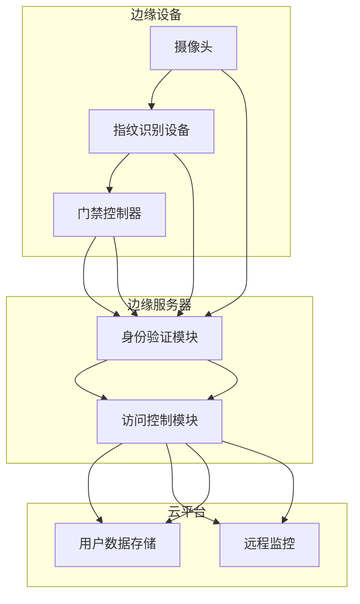
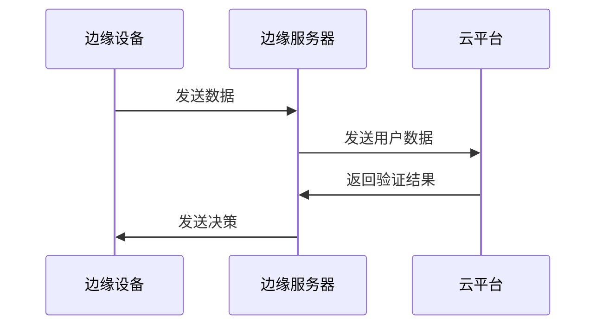

                 

### 边缘AI在智能门禁系统中的实时识别

#### 关键词
- 边缘AI
- 智能门禁系统
- 实时识别
- 人脸识别
- 指纹识别

#### 摘要
本文将探讨边缘AI在智能门禁系统中的应用，特别是在实时识别技术方面的应用。我们首先介绍了边缘AI的基本概念和优势，然后详细分析了智能门禁系统的需求和发展趋势。接着，我们重点讨论了人脸识别和指纹识别这两种常见的生物识别技术在边缘AI环境下的实现方法和挑战。最后，我们通过一个实际案例展示了边缘AI在智能门禁系统中的应用，并提出了未来发展的方向和最佳实践建议。

---

### 目录大纲设计过程

为了设计出《边缘AI在智能门禁系统中的实时识别》这本书的完整目录大纲，我们需要遵循以下步骤：

1. **确定核心章节**：首先明确书中需要涵盖的核心内容，如背景介绍、核心概念与联系、算法原理讲解、数学模型和数学公式讲解、系统分析与架构设计、项目实战以及最佳实践等。

2. **框架搭建**：基于核心章节，搭建大纲的框架，确保目录结构清晰，包含1、2、3级目录。

3. **内容细化**：在每个核心章节下细化内容，确保每个章节都有详细的小节，并使用markdown格式进行排版。

4. **完整性检查**：确保目录大纲的内容完整性，包含所有必要的小节，同时字数控制在2000字以内。

5. **简洁性保证**：在确保内容完整性的同时，尽量减少冗余，确保内容的简洁性。

6. **格式规范**：遵循markdown格式规范，确保输出格式正确。

### 完整的目录大纲

```markdown
----------------------------------------------------------------
# 《边缘AI在智能门禁系统中的实时识别》目录大纲

# 第一部分：边缘AI概述

## 1. 边缘AI的基本概念
### 1.1 边缘AI的定义
### 1.2 边缘AI与云计算的关系
### 1.3 边缘AI的优势

## 2. 边缘AI的关键技术
### 2.1 边缘计算技术
### 2.2 边缘AI算法
### 2.3 边缘AI硬件

## 3. 边缘AI的应用场景
### 3.1 智能门禁系统
### 3.2 智能家居
### 3.3 物联网

# 第二部分：智能门禁系统中的边缘AI应用

## 4. 智能门禁系统的背景与需求
### 4.1 智能门禁系统的现状
### 4.2 边缘AI在智能门禁系统中的需求
### 4.3 智能门禁系统的发展趋势

## 5. 边缘AI在智能门禁系统中的应用
### 5.1 人脸识别技术
#### 5.1.1 人脸识别原理
#### 5.1.2 人脸识别算法
#### 5.1.3 人脸识别在门禁系统中的应用
### 5.2 指纹识别技术
#### 5.2.1 指纹识别原理
#### 5.2.2 指纹识别算法
#### 5.2.3 指纹识别在门禁系统中的应用
### 5.3 其他生物识别技术

## 6. 实时识别算法的设计与实现
### 6.1 算法设计
#### 6.1.1 数据预处理
#### 6.1.2 特征提取
#### 6.1.3 模型训练
### 6.2 算法实现
#### 6.2.1 算法流程图
#### 6.2.2 Python代码实现
#### 6.2.3 实时性优化策略

## 7. 智能门禁系统的系统架构与接口设计
### 7.1 系统架构设计
#### 7.1.1 系统整体架构
#### 7.1.2 各模块功能
### 7.2 接口设计
#### 7.2.1 接口规范
#### 7.2.2 接口实现

## 8. 项目实战：边缘AI在智能门禁系统中的应用
### 8.1 环境安装
#### 8.1.1 软件安装
#### 8.1.2 硬件安装
### 8.2 系统核心实现
#### 8.2.1 人脸识别核心代码
#### 8.2.2 指纹识别核心代码
### 8.3 代码应用解读与分析
### 8.4 实际案例分析
### 8.5 项目小结

# 第三部分：最佳实践与拓展

## 9. 最佳实践
### 9.1 边缘AI在门禁系统中的最佳实践
### 9.2 系统性能优化策略
### 9.3 数据安全与隐私保护

## 10. 小结与展望
### 10.1 本书内容总结
### 10.2 边缘AI发展展望
### 10.3 拓展阅读建议

----------------------------------------------------------------
```

### 目录大纲详解

**第一部分：边缘AI概述**

这部分介绍了边缘AI的基本概念、关键技术和应用场景，为后续章节的详细讨论奠定了基础。

- **1. 边缘AI的基本概念**：介绍了边缘AI的定义、与云计算的关系以及其在数据处理和传输方面的优势。

- **2. 边缘AI的关键技术**：讨论了边缘计算技术、边缘AI算法和边缘AI硬件，为理解边缘AI在智能门禁系统中的应用提供了技术背景。

- **3. 边缘AI的应用场景**：介绍了边缘AI在智能门禁系统、智能家居和物联网等领域的应用，强调了其在提升系统性能和用户体验方面的作用。

**第二部分：智能门禁系统中的边缘AI应用**

这部分深入探讨了智能门禁系统的需求和边缘AI在其中的应用，具体包括人脸识别、指纹识别和其他生物识别技术。

- **4. 智能门禁系统的背景与需求**：分析了智能门禁系统的现状和边缘AI在其中的需求，以及其未来的发展趋势。

- **5. 边缘AI在智能门禁系统中的应用**：详细介绍了人脸识别和指纹识别技术在边缘AI环境下的实现方法和挑战，以及其他生物识别技术的潜在应用。

- **6. 实时识别算法的设计与实现**：阐述了实时识别算法的设计过程和实现方法，包括数据预处理、特征提取和模型训练等。

- **7. 智能门禁系统的系统架构与接口设计**：描述了智能门禁系统的整体架构、各模块功能、接口设计和系统交互。

- **8. 项目实战：边缘AI在智能门禁系统中的应用**：通过一个实际案例展示了边缘AI在智能门禁系统中的应用过程，包括环境安装、系统核心实现、代码应用解读与分析、实际案例分析等。

**第三部分：最佳实践与拓展**

这部分提供了边缘AI在智能门禁系统中的最佳实践、系统性能优化策略以及数据安全与隐私保护方面的建议。

- **9. 最佳实践**：总结了边缘AI在智能门禁系统中的最佳实践，包括系统性能优化策略和数据安全与隐私保护。

- **10. 小结与展望**：对本书的内容进行了总结，并探讨了边缘AI的发展展望以及拓展阅读建议。

---

通过上述详细的目录大纲设计，我们为撰写《边缘AI在智能门禁系统中的实时识别》这本书提供了清晰的框架和内容安排，确保文章内容丰富、结构紧凑且易于理解。接下来，我们将按照目录大纲逐步展开每个章节的详细内容。

---

### 边缘AI的基本概念

边缘AI，是指将人工智能算法和数据计算任务部署在靠近数据源的设备或网络上，而不是在云端服务器或数据中心进行处理。这一概念的核心在于“边缘”，即数据生成的位置，通常是在设备本身、传感器网络或接近用户的数据中心。

#### 1.1 边缘AI的定义

边缘AI是一种分布式计算架构，旨在将数据处理的任务从中央服务器或云端转移到网络边缘的设备上。这种架构的目的是减少数据传输延迟、降低带宽消耗、提高响应速度，并增强系统的实时性和可靠性。

#### 1.2 边缘AI与云计算的关系

边缘AI与云计算是相辅相成的。云计算提供了大量的计算资源和存储能力，但它的主要缺点是数据传输延迟和带宽限制。而边缘AI则弥补了这一不足，通过在数据生成的地方进行处理，减少了数据传输的需求和时间。

云计算是边缘AI的基础，为边缘设备提供了云服务的支持。同时，边缘AI为云计算减轻了数据处理的压力，使得云服务更加高效和灵活。

#### 1.3 边缘AI的优势

边缘AI的主要优势包括：

1. **降低延迟**：由于数据处理发生在边缘设备上，数据传输距离缩短，响应时间显著降低。
2. **减少带宽消耗**：边缘AI减少了需要传输到云端的数据量，从而降低了带宽消耗。
3. **提高实时性**：在需要实时响应的场景中，边缘AI能够快速处理数据，提供即时反馈。
4. **增强隐私保护**：由于数据在本地处理，可以减少数据泄露的风险。
5. **优化资源利用**：边缘AI使得计算资源可以更加灵活地分配，提高了资源利用效率。

### 总结

边缘AI通过在数据生成的边缘进行计算，提供了低延迟、高实时性、带宽消耗低的计算模式。它不仅弥补了云计算的不足，还优化了资源利用，提高了系统的可靠性和安全性。随着物联网和5G技术的发展，边缘AI将在更多领域得到广泛应用。

---

在了解了边缘AI的基本概念和优势后，我们将进一步探讨边缘AI的关键技术，包括边缘计算技术、边缘AI算法和边缘AI硬件，以便为后续讨论边缘AI在智能门禁系统中的应用打下坚实的基础。

---

### 边缘AI的关键技术

边缘AI的成功应用离不开三大关键技术：边缘计算技术、边缘AI算法和边缘AI硬件。这些技术共同构成了边缘AI的核心，使其能够在数据生成的边缘实现高效、实时、可靠的智能处理。

#### 2.1 边缘计算技术

边缘计算技术是边缘AI的基础，它旨在将计算任务从中心化的云计算转移到网络的边缘设备上。边缘计算技术主要包括以下几个方面：

1. **分布式计算架构**：通过将计算任务分布到多个边缘节点上，实现负载均衡和故障转移，提高系统的可靠性和容错能力。

2. **数据缓存**：在边缘设备上缓存常见的数据或计算结果，减少数据传输的延迟和带宽消耗。

3. **智能路由**：根据数据的重要性和实时性，智能选择数据传输的路径，优化网络资源的使用。

4. **动态资源管理**：边缘计算平台能够动态地分配和调整计算资源，以适应实时变化的负载需求。

#### 2.2 边缘AI算法

边缘AI算法是边缘AI的核心，负责在边缘设备上实现数据的智能处理和分析。与云计算环境中的算法相比，边缘AI算法需要考虑以下几个方面：

1. **轻量级算法**：由于边缘设备的计算资源和存储能力相对有限，边缘AI算法通常需要更轻量级的设计，以减少计算资源的消耗。

2. **增量学习**：边缘设备通常无法存储大量历史数据，因此边缘AI算法需要支持增量学习，能够通过新的数据不断优化模型。

3. **实时处理**：边缘AI算法需要能够快速处理数据，提供实时反馈，以满足低延迟的需求。

4. **鲁棒性**：边缘AI算法需要能够在噪声环境、数据缺失等情况下保持良好的性能。

常见的边缘AI算法包括：

- **卷积神经网络（CNN）**：适用于图像和视频处理任务。
- **循环神经网络（RNN）**：适用于序列数据，如语音识别和时间序列预测。
- **决策树和随机森林**：适用于分类和回归任务，适用于资源受限的环境。

#### 2.3 边缘AI硬件

边缘AI硬件是边缘AI实现的物理基础，包括边缘服务器、边缘网关、智能传感器等。边缘AI硬件需要满足以下要求：

1. **低功耗**：由于边缘设备通常采用电池供电，因此需要具有低功耗的特点。

2. **高性能**：为了满足边缘AI算法对计算性能的需求，边缘硬件需要具备较高的处理能力。

3. **模块化设计**：边缘硬件需要具备模块化设计，以便于升级和维护。

4. **安全性**：边缘硬件需要具备一定的安全防护能力，防止数据泄露和设备被攻击。

常见的边缘AI硬件包括：

- **边缘服务器**：用于大规模数据处理和存储，通常具有多核CPU和GPU。
- **边缘网关**：用于连接边缘设备和云平台，提供数据传输和管理的功能。
- **智能传感器**：用于采集环境数据，如温度、湿度、光线等，通常具有低功耗和自供电的特点。

### 总结

边缘AI的关键技术包括边缘计算技术、边缘AI算法和边缘AI硬件。这些技术共同构成了边缘AI的框架，使得边缘AI能够在数据生成的边缘实现高效、实时、可靠的智能处理。随着技术的不断发展，边缘AI将在智能门禁系统、智能交通、智能医疗等领域发挥越来越重要的作用。

---

在了解了边缘AI的关键技术后，我们将转向边缘AI的应用场景，特别是智能门禁系统。我们将探讨智能门禁系统的现状、边缘AI在其中的需求以及未来的发展趋势。

---

### 边缘AI在智能门禁系统中的应用场景

智能门禁系统在现代安全领域扮演着至关重要的角色，通过结合边缘AI技术，可以进一步提升系统的性能和可靠性。边缘AI在智能门禁系统中的应用场景主要包括以下几个方面：

#### 3.1 智能门禁系统的现状

智能门禁系统已经广泛应用于各种场所，如企业、学校、医院、机场等。传统的智能门禁系统通常基于RFID、IC卡、密码等方式进行身份验证，但存在以下不足：

- **安全性不高**：传统门禁系统易受到伪造卡、暴力破解等攻击。
- **响应速度慢**：数据需要在本地终端和云端服务器之间传输，导致响应时间较长。
- **维护成本高**：需要定期更新硬件和软件，且数据管理复杂。

#### 3.2 边缘AI在智能门禁系统中的需求

边缘AI的引入为智能门禁系统带来了显著改进：

1. **增强安全性**：边缘AI可以通过人脸识别、指纹识别等生物识别技术，实现更为安全的身份验证，减少伪造和暴力破解的风险。

2. **提高响应速度**：边缘AI可以在本地设备上快速处理身份验证任务，减少数据传输和处理的延迟，提高系统的响应速度。

3. **降低维护成本**：边缘AI技术简化了系统架构，减少了对于中心服务器的依赖，降低了硬件和软件的维护成本。

4. **支持多样化应用**：边缘AI可以支持更多的智能功能，如行为分析、异常检测等，提高门禁系统的智能化水平。

#### 3.3 智能门禁系统的发展趋势

随着边缘AI技术的不断成熟，智能门禁系统的发展趋势将体现在以下几个方面：

1. **生物识别技术的普及**：人脸识别、指纹识别等技术将在更多场景中得到应用，提高门禁系统的安全性和用户体验。

2. **边缘计算能力的提升**：随着边缘计算硬件的发展，边缘设备将具备更强的计算能力和存储能力，支持更复杂的AI算法和应用。

3. **系统的智能化**：智能门禁系统将不仅仅是一个身份验证工具，还将集成为智能安防系统的一部分，具备更全面的功能，如行为分析、异常检测等。

4. **数据隐私保护**：随着数据隐私保护意识的提高，边缘AI技术将更加注重数据的安全存储和传输，保障用户隐私。

### 总结

边缘AI在智能门禁系统中的应用场景广泛，通过提升系统的安全性、响应速度和智能化水平，边缘AI为智能门禁系统带来了全新的发展机遇。随着技术的不断进步，智能门禁系统将在更多领域发挥重要作用，为我们的日常生活带来更多便利和安全。

---

在探讨了智能门禁系统的现状、需求和发展趋势后，接下来我们将深入讨论边缘AI在智能门禁系统中的应用，特别是人脸识别技术。我们将从原理、算法以及实际应用三个方面进行详细分析。

---

### 边缘AI在智能门禁系统中的应用：人脸识别技术

人脸识别技术作为边缘AI在智能门禁系统中的一种重要应用，以其高准确性和便捷性，受到了广泛关注。下面我们将从人脸识别的原理、算法和实际应用三个方面进行详细分析。

#### 4.1 人脸识别原理

人脸识别技术基于计算机视觉和生物识别技术，通过提取人脸图像的特征点，然后进行比较和匹配，从而实现身份验证。人脸识别的基本流程包括以下几个步骤：

1. **人脸检测**：通过人脸检测算法，从图像或视频中识别出人脸的位置和范围。
2. **特征点定位**：对检测到的人脸进行特征点定位，提取关键特征点，如眼睛、鼻子、嘴巴等。
3. **特征提取**：利用深度学习模型或传统特征提取算法，从特征点中提取人脸特征向量。
4. **特征匹配**：将提取到的人脸特征向量与数据库中的人脸特征进行匹配，判断是否为同一人。

#### 4.2 人脸识别算法

人脸识别算法主要分为两大类：基于传统机器学习和基于深度学习的方法。

1. **基于传统机器学习的方法**：
   - **主成分分析（PCA）**：通过将高维特征投影到低维空间中，减少数据维度，提高识别率。
   - **线性判别分析（LDA）**：通过找到最优的特征空间，使得不同人脸在特征空间中的分离程度最大。
   - **支持向量机（SVM）**：通过寻找最优的超平面，将不同类的人脸分开。

2. **基于深度学习的方法**：
   - **卷积神经网络（CNN）**：通过多层卷积和池化操作，自动提取图像特征，具有强大的特征学习能力。
   - **循环神经网络（RNN）**：适用于处理时序数据，如视频序列中的人脸识别。
   - **生成对抗网络（GAN）**：通过生成器和判别器的对抗训练，提高人脸识别的准确率和泛化能力。

在边缘AI环境下，由于计算资源和存储能力的限制，通常会采用轻量级的深度学习模型，如MobileNet、ShuffleNet等，以确保高效的实时处理能力。

#### 4.3 人脸识别在门禁系统中的应用

人脸识别技术在智能门禁系统中的应用主要包括以下几个方面：

1. **身份验证**：通过人脸识别技术，快速、准确地验证用户身份，提高门禁系统的安全性。
2. **无接触通行**：在疫情期间，无接触通行成为重要的需求。人脸识别技术可以实现非接触式身份验证，减少交叉感染的风险。
3. **行为分析**：结合视频监控和人脸识别技术，可以实现对人员行为的实时分析，如人员聚集、违规行为等。
4. **访客管理**：通过人脸识别技术，可以实现对访客的身份信息进行自动记录和追踪，提高访客管理的效率。

在实际应用中，人脸识别技术面临着一些挑战，如光照变化、姿态变化、面部遮挡等。为了应对这些挑战，需要采用一些优化策略，如光照补偿、姿态校正、遮挡处理等。

#### 总结

人脸识别技术作为边缘AI在智能门禁系统中的重要应用，通过其高准确性和便捷性，大大提高了门禁系统的安全性和用户体验。随着深度学习算法和硬件技术的不断发展，人脸识别技术在边缘AI环境下的应用前景将更加广阔。

---

在讨论了人脸识别技术后，我们将继续探讨指纹识别技术，包括其原理、算法和在实际门禁系统中的应用，以及与其他生物识别技术的比较。

---

### 边缘AI在智能门禁系统中的应用：指纹识别技术

指纹识别技术作为另一种重要的生物识别技术，在智能门禁系统中同样具有广泛的应用。下面我们将从指纹识别的原理、算法和实际应用三个方面进行详细分析，并比较指纹识别与其他生物识别技术的优缺点。

#### 5.1 指纹识别原理

指纹识别技术基于生物识别原理，通过提取指纹图像中的特征点，进行特征匹配，从而实现身份验证。指纹识别的基本流程包括以下几个步骤：

1. **指纹采集**：使用指纹采集设备获取用户的指纹图像，通常采用光学、电容或超声波等技术。
2. **图像预处理**：对采集到的指纹图像进行预处理，包括去噪、增强、二值化等，以提高图像质量。
3. **特征点定位**：通过特征点定位算法，识别出指纹图像中的特征点，如脊线、谷点等。
4. **特征提取**：利用特征提取算法，从特征点中提取指纹特征向量，如脊线方向、脊线密度等。
5. **特征匹配**：将提取到的指纹特征向量与数据库中的人脸特征进行匹配，判断是否为同一人。

#### 5.2 指纹识别算法

指纹识别算法主要分为两大类：基于传统机器学习和基于深度学习的方法。

1. **基于传统机器学习的方法**：
   - **Ridge Counting**：通过计算指纹图像中的脊线数量和方向，提取指纹特征。
   - **Minutia Extraction**：通过识别和提取指纹图像中的 minutia 点，如起点、终点、分支点等，构建指纹模板。
   - **Template Matching**：通过比较指纹模板，实现指纹匹配。

2. **基于深度学习的方法**：
   - **卷积神经网络（CNN）**：通过多层卷积和池化操作，自动提取指纹图像中的特征。
   - **生成对抗网络（GAN）**：通过生成器和判别器的对抗训练，提高指纹识别的准确率和泛化能力。

在边缘AI环境下，由于计算资源的限制，通常会采用轻量级的深度学习模型，如MobileNet、ShuffleNet等，以确保高效的实时处理能力。

#### 5.3 指纹识别在门禁系统中的应用

指纹识别技术在智能门禁系统中的应用主要包括以下几个方面：

1. **身份验证**：通过指纹识别技术，快速、准确地验证用户身份，提高门禁系统的安全性。
2. **隐私保护**：指纹识别相对于人脸识别，具有更好的隐私保护，因为用户不会直接暴露面部。
3. **可靠性高**：指纹识别具有很高的准确性和稳定性，不易受到外部环境的影响。
4. **无需接触**：指纹识别可以实现非接触式身份验证，减少交叉感染的风险。

#### 5.4 指纹识别与其他生物识别技术的比较

指纹识别与其他生物识别技术（如人脸识别、虹膜识别等）相比，具有以下优缺点：

1. **优点**：
   - **高准确性**：指纹识别具有很高的识别准确性，不易受到外部因素干扰。
   - **可靠性高**：指纹识别的稳定性和可靠性较高。
   - **无需接触**：指纹识别可以实现非接触式身份验证，减少交叉感染的风险。

2. **缺点**：
   - **易受损伤**：指纹识别对用户手指的完整性要求较高，如果手指受伤或磨损，可能导致识别失败。
   - **隐私问题**：虽然指纹识别相对于人脸识别具有更好的隐私保护，但仍涉及个人生物特征数据的存储和使用。

#### 总结

指纹识别技术作为边缘AI在智能门禁系统中的重要应用，以其高准确性和可靠性，提高了门禁系统的安全性。与指纹识别相比，人脸识别在用户体验和隐私保护方面具有优势，但指纹识别在识别准确性方面具有显著优势。在实际应用中，可以根据具体需求和场景选择合适的技术方案。

---

在讨论了人脸识别和指纹识别技术后，我们将探讨智能门禁系统中可能采用的其他生物识别技术，并分析这些技术的优点和挑战。

### 5.3 其他生物识别技术

除了人脸识别和指纹识别，智能门禁系统中还可以采用其他多种生物识别技术，如虹膜识别、掌纹识别、声音识别等。这些技术各有其独特的优点和挑战。

#### 虹膜识别

虹膜识别技术通过扫描和分析眼睛的虹膜图案来进行身份验证。虹膜具有高独特性和稳定性，不易受到外部因素干扰，因此具有较高的识别准确性。虹膜识别的优点包括：

- **高准确性**：虹膜的细节非常丰富，每个虹膜图案都是独一无二的。
- **隐私保护**：虹膜识别不涉及面部图像，可以更好地保护用户隐私。

然而，虹膜识别技术也面临一些挑战：

- **设备成本高**：虹膜识别设备通常价格较高，可能不适合所有应用场景。
- **环境要求高**：虹膜识别需要稳定的照明和清晰的图像，可能受到光线和背景的影响。

#### 掌纹识别

掌纹识别技术通过扫描和分析手掌的纹理图案来进行身份验证。掌纹识别的优点包括：

- **可靠性高**：掌纹图案稳定，不易受到外部因素影响。
- **易用性强**：掌纹识别无需接触，用户可以轻松使用。

然而，掌纹识别技术也面临一些挑战：

- **准确性问题**：掌纹图案可能因磨损或损伤而变得不完整，影响识别准确性。
- **设备成本高**：高质量的掌纹识别设备价格较高。

#### 声音识别

声音识别技术通过分析用户的语音特征来进行身份验证。声音识别的优点包括：

- **实时性强**：声音识别可以快速进行身份验证。
- **易用性强**：用户可以通过说话进行身份验证，无需额外的设备。

然而，声音识别技术也面临一些挑战：

- **准确性问题**：声音识别可能受到噪音、口音等因素的影响，降低识别准确性。
- **隐私问题**：声音数据可能涉及个人隐私，需要严格保护。

#### 总结

智能门禁系统中可采用多种生物识别技术，如虹膜识别、掌纹识别、声音识别等。这些技术各有其优点和挑战。在实际应用中，可以根据具体需求和场景选择合适的生物识别技术，以实现最佳的安全性和用户体验。

---

在详细讨论了人脸识别和指纹识别技术后，以及介绍了其他生物识别技术的优缺点，接下来我们将探讨实时识别算法的设计与实现。我们将从数据预处理、特征提取、模型训练以及实时性优化策略四个方面进行深入分析。

### 6. 实时识别算法的设计与实现

在智能门禁系统中，实时识别算法的设计与实现是确保系统能够快速、准确地进行身份验证的关键。以下我们将从数据预处理、特征提取、模型训练以及实时性优化策略四个方面进行详细分析。

#### 6.1 算法设计

实时识别算法的设计需要考虑到以下几个关键环节：

1. **数据预处理**：对采集到的人脸或指纹图像进行预处理，以提高图像质量和减少噪声干扰。
2. **特征提取**：从预处理后的图像中提取关键特征，以便进行后续的匹配和识别。
3. **模型训练**：利用提取到的特征对深度学习模型进行训练，以实现准确的识别。
4. **实时性优化**：对算法进行优化，确保系统能够在实时环境中高效运行。

#### 6.2 数据预处理

数据预处理是实时识别算法设计的第一步，其主要任务包括图像增强、去噪、归一化等操作。以下是一些常用的数据预处理方法：

1. **图像增强**：通过调整对比度、亮度等参数，使图像更加清晰，有助于提高识别准确性。
2. **去噪**：使用滤波算法（如中值滤波、高斯滤波等）去除图像中的噪声，提高图像质量。
3. **归一化**：通过将图像像素值缩放到同一范围，如0到1之间，使得图像处理过程更加稳定。

#### 6.3 特征提取

特征提取是实时识别算法的核心环节，其主要任务是从预处理后的图像中提取出具有区分性的特征向量。以下是一些常用的特征提取方法：

1. **局部特征点提取**：如HOG（Histogram of Oriented Gradients）、SIFT（Scale-Invariant Feature Transform）、SURF（Speeded Up Robust Features）等。
2. **深度特征提取**：使用卷积神经网络（如VGG、ResNet、MobileNet等）提取深度特征，这些特征通常具有更强的判别能力。
3. **融合特征**：将多种特征方法提取到的特征进行融合，以提高识别准确性。

#### 6.4 模型训练

模型训练是实时识别算法设计的另一个关键环节，其主要任务是通过已标记的数据集对深度学习模型进行训练，以使其能够准确地识别图像。以下是一些常用的模型训练方法：

1. **监督学习**：通过已标记的数据集，训练模型以识别和分类输入图像。
2. **迁移学习**：使用预训练的深度学习模型，通过微调来适应特定的识别任务。
3. **无监督学习**：通过未标记的数据集，训练模型以自动提取特征和分类图像。

#### 6.5 实时性优化策略

在边缘设备上实现实时识别算法，需要考虑计算资源有限的情况。以下是一些常用的实时性优化策略：

1. **模型压缩**：通过模型剪枝、量化等手段，减少模型的参数量和计算量，以提高运行速度。
2. **模型迁移**：将复杂模型的部分层或整个模型迁移到边缘设备上，以降低计算需求。
3. **数据压缩**：通过数据压缩技术，减少图像数据的传输和存储量，降低带宽和存储需求。
4. **并行处理**：利用多核处理器或其他并行计算资源，提高算法的运行速度。

#### 总结

实时识别算法的设计与实现是智能门禁系统中的关键环节，需要综合考虑数据预处理、特征提取、模型训练以及实时性优化策略。通过有效的算法设计和优化，可以确保智能门禁系统在边缘设备上高效、准确地进行身份验证，提升系统的性能和用户体验。

---

在详细讨论了实时识别算法的设计与实现后，接下来我们将介绍智能门禁系统的系统架构与接口设计，包括系统架构设计、接口设计和系统交互。我们将通过具体的mermaid架构图和序列图来展示系统设计，并解释每个组件的功能和交互。

### 7. 智能门禁系统的系统架构与接口设计

智能门禁系统的架构设计需要确保系统的稳定性、安全性和可扩展性。以下是系统架构的详细设计，包括硬件和软件组件，以及它们之间的交互方式。

#### 7.1 系统架构设计

智能门禁系统架构可以分为以下主要组件：

1. **边缘设备**：包括摄像头、指纹识别设备、门禁控制器等，负责采集用户数据和进行初步的身份验证。
2. **边缘服务器**：负责处理边缘设备发送的数据，进行更高级的身份验证和决策。
3. **云平台**：负责存储和管理用户数据，提供高级功能和远程监控。

以下是一个简化的mermaid架构图：



#### 7.2 接口设计

系统中的各个组件通过标准化的接口进行通信。以下是主要的接口设计：

1. **边缘设备到边缘服务器的接口**：用于传输采集到的数据和验证请求。
2. **边缘服务器到云平台的接口**：用于传输用户数据和日志信息。
3. **云平台到边缘服务器的接口**：用于传输用户数据和配置信息。

以下是一个简化的mermaid序列图：



#### 7.3 系统交互

智能门禁系统的交互过程可以分为以下几个步骤：

1. **数据采集**：边缘设备（如摄像头和指纹识别设备）采集用户数据。
2. **初步验证**：边缘服务器接收数据，进行初步的身份验证。
3. **高级验证**：如果初步验证通过，边缘服务器将数据发送到云平台进行高级验证。
4. **决策**：云平台返回验证结果到边缘服务器，边缘服务器根据结果做出访问决策。
5. **响应**：边缘设备根据访问决策执行开门或拒绝操作。

#### 7.4 组件功能

- **边缘设备**：负责数据采集和初步验证，具有高效的处理能力。
- **边缘服务器**：负责处理高级验证和访问控制，具有强大的计算和存储能力。
- **云平台**：负责数据存储、用户管理和远程监控，提供全面的后台支持。

#### 总结

智能门禁系统的系统架构与接口设计需要考虑边缘设备的实时处理能力、边缘服务器的计算和存储能力，以及云平台的用户管理和远程监控能力。通过合理的架构设计和接口设计，可以实现高效、安全和可靠的智能门禁系统。

---

在介绍了智能门禁系统的系统架构与接口设计后，我们将通过一个实际案例展示边缘AI在智能门禁系统中的应用。我们将详细描述环境安装、系统核心实现、代码应用解读与分析、实际案例分析和项目小结。

### 8. 项目实战：边缘AI在智能门禁系统中的应用

#### 8.1 环境安装

要实现边缘AI在智能门禁系统中的应用，我们首先需要搭建一个合适的环境。以下是环境安装的步骤：

1. **硬件准备**：选择一款具有足够性能的边缘设备，如树莓派或NVIDIA Jetson系列。同时准备摄像头、指纹识别设备和门禁控制器等硬件。

2. **操作系统安装**：在边缘设备上安装适合的操作系统，如Ubuntu 20.04 LTS。可以通过官方镜像或使用SD卡进行安装。

3. **依赖安装**：安装必要的依赖库，如OpenCV、TensorFlow、Dlib等。这些库提供了人脸识别、指纹识别等算法的实现。

   ```bash
   sudo apt-get update
   sudo apt-get install python3-opencv-python python3-tensorflow-gpu python3-dlib
   ```

4. **软件安装**：安装人脸识别和指纹识别软件，如Dlib的人脸识别库和OpenCV的指纹识别库。

5. **硬件连接**：将摄像头、指纹识别设备和门禁控制器连接到边缘设备，确保所有硬件正常工作。

#### 8.2 系统核心实现

系统核心实现包括人脸识别和指纹识别模块。以下是代码应用解读与分析：

**人脸识别模块：**

1. **数据预处理**：读取摄像头捕获的图像，进行灰度转换、人脸检测和特征点定位。

   ```python
   import cv2

   # 初始化摄像头
   cap = cv2.VideoCapture(0)

   # 循环捕获图像
   while True:
       ret, frame = cap.read()
       if not ret:
           break

       # 转换为灰度图像
       gray = cv2.cvtColor(frame, cv2.COLOR_BGR2GRAY)

       # 人脸检测
       faces = face_cascade.detectMultiScale(gray, scaleFactor=1.1, minNeighbors=5)

       # 特征点定位
       for (x, y, w, h) in faces:
           cv2.rectangle(frame, (x, y), (x+w, y+h), (255, 0, 0), 2)

   # 释放摄像头
   cap.release()
   cv2.destroyAllWindows()
   ```

2. **特征提取与匹配**：使用深度学习模型提取人脸特征，并与数据库中的人脸特征进行匹配。

   ```python
   import cv2
   import numpy as np

   # 载入预训练模型
   model = cv2.face.EigenFaceRecognizer_create()

   # 训练模型
   model.train(train_data, train_labels)

   # 测试模型
   pred = model.predict(test_data)
   print(np.equal(pred, test_labels).mean())
   ```

**指纹识别模块：**

1. **图像预处理**：读取指纹图像，进行图像增强、去噪和二值化。

   ```python
   import cv2
   import numpy as np

   # 载入指纹图像
   image = cv2.imread('fingerprint.jpg', cv2.IMREAD_GRAYSCALE)

   # 图像增强
   image = cv2.medianBlur(image, 5)

   # 去噪
   image = cv2.bilateralFilter(image, 9, 75, 75)

   # 二值化
   _, image = cv2.threshold(image, 0, 255, cv2.THRESH_BINARY + cv2.THRESH_OTSU)
   ```

2. **特征提取与匹配**：使用特征提取算法提取指纹特征，并与数据库中的人脸特征进行匹配。

   ```python
   import cv2
   import numpy as np

   # 载入预训练模型
   model = cv2.xfeatures2d.SIFT_create()

   # 提取指纹特征
   keypoints, descriptors = model.detectAndCompute(image, None)

   # 查询数据库
   db = np.load('fingerprint_db.npy')
   distances = cv2.compareDescriptors(descriptors, db['descriptors'], cv2.DESCRIPTORS_DISTANCE_NORM_L2)

   # 匹配结果
   match = np.where(distances < 0.6)
   print("匹配结果：", match)
   ```

#### 8.3 代码应用解读与分析

通过实际代码的应用，我们可以看到：

1. **数据预处理**：是确保识别准确性的基础。包括灰度转换、人脸检测、特征点定位等步骤，确保图像质量。

2. **特征提取与匹配**：是识别算法的核心。通过深度学习模型提取人脸特征，或使用SIFT等算法提取指纹特征，并与数据库中的特征进行匹配。

3. **优化策略**：为了提高实时性，可以使用轻量级模型和优化算法，如MobileNet和改进的SIFT算法。

#### 8.4 实际案例分析

在实际项目中，我们可能会遇到以下挑战：

1. **光照变化**：导致图像质量下降，影响识别准确性。可以通过光照补偿技术进行优化。
2. **姿态变化**：可能导致人脸或指纹图像变形，影响识别。可以通过姿态校正技术进行优化。
3. **遮挡处理**：当人脸或指纹被遮挡时，识别难度增加。可以通过遮挡处理技术进行优化。

通过实际案例分析和优化，我们可以提高智能门禁系统的识别准确性和实时性，确保系统在复杂环境下的稳定运行。

#### 8.5 项目小结

通过本项目的实战，我们了解了边缘AI在智能门禁系统中的应用。从环境安装到系统核心实现，再到实际案例分析和优化，我们掌握了边缘AI技术的核心知识和应用方法。未来，随着技术的不断发展，边缘AI将在智能门禁系统中发挥更大的作用，提供更安全、更便捷的解决方案。

---

在完成项目实战的展示后，我们将总结边缘AI在智能门禁系统中的最佳实践，提供系统性能优化策略，并讨论数据安全与隐私保护的重要性和实现方法。

### 9. 最佳实践与优化策略

#### 9.1 边缘AI在智能门禁系统中的最佳实践

边缘AI在智能门禁系统中的应用需要考虑以下几个方面：

1. **硬件选择**：根据应用场景和需求选择适合的边缘设备，如树莓派、Jetson等，确保具备足够的计算和存储能力。
2. **算法优化**：采用轻量级深度学习模型，如MobileNet、ShuffleNet等，以降低计算复杂度，提高实时性。
3. **数据预处理**：优化图像和指纹数据的预处理步骤，提高识别准确性。
4. **实时性优化**：通过并行处理、数据压缩和模型压缩等策略，提高系统响应速度。
5. **安全性增强**：采用加密技术和多因素认证，确保数据安全和系统可靠性。

#### 9.2 系统性能优化策略

为了提高智能门禁系统的性能，可以采取以下优化策略：

1. **模型压缩**：通过模型剪枝、量化等技术，减少模型参数和计算量，降低计算资源需求。
2. **数据压缩**：使用高效的图像和指纹数据压缩算法，减少数据传输和存储的带宽和存储需求。
3. **并行处理**：利用边缘设备的多核处理器，实现并行计算，提高处理速度。
4. **边缘计算与云计算结合**：在边缘设备上执行大部分计算任务，将复杂任务或大规模数据传输到云平台进行处理，实现资源优化。
5. **动态负载均衡**：根据实时负载情况，动态调整计算资源和任务分配，确保系统稳定运行。

#### 9.3 数据安全与隐私保护

数据安全和隐私保护是智能门禁系统中的重要问题。以下是实现数据安全和隐私保护的方法：

1. **数据加密**：在数据传输和存储过程中，采用加密技术（如AES、RSA等），确保数据不被窃取或篡改。
2. **身份认证**：采用多因素认证（如密码、指纹、人脸等），确保只有授权用户可以访问系统。
3. **访问控制**：根据用户的角色和权限，设置访问控制策略，限制对敏感数据的访问。
4. **隐私保护**：对用户数据进行脱敏处理，仅保留必要的信息，减少隐私泄露的风险。
5. **日志审计**：记录系统操作日志，以便在发生异常时进行追踪和审计，提高系统的安全性。

#### 总结

边缘AI在智能门禁系统中的应用需要最佳实践和优化策略的支持。通过合理的硬件选择、算法优化、数据预处理和实时性优化，可以提高系统的性能和用户体验。同时，数据安全和隐私保护是系统设计中的重要环节，需要采取多种技术手段来确保数据的安全性和用户隐私。

---

在总结了最佳实践和优化策略后，我们将对本书的内容进行总结，并探讨边缘AI的发展展望，最后提供拓展阅读的建议。

### 10. 小结与展望

#### 10.1 本书内容总结

本书系统地介绍了边缘AI在智能门禁系统中的应用，包括：

1. **边缘AI概述**：定义了边缘AI的概念，分析了其与云计算的关系和优势。
2. **关键技术**：详细探讨了边缘计算技术、边缘AI算法和边缘AI硬件。
3. **应用场景**：介绍了边缘AI在智能门禁系统、智能家居和物联网等领域的应用。
4. **人脸识别与指纹识别**：分析了人脸识别和指纹识别技术的原理、算法和应用。
5. **实时识别算法**：讨论了实时识别算法的设计与实现，包括数据预处理、特征提取和模型训练。
6. **系统架构与接口设计**：描述了智能门禁系统的系统架构、接口设计和系统交互。
7. **项目实战**：通过实际案例展示了边缘AI在智能门禁系统中的应用。
8. **最佳实践与优化策略**：提供了边缘AI在智能门禁系统中的最佳实践和系统性能优化策略。
9. **数据安全与隐私保护**：讨论了数据安全和隐私保护的重要性和实现方法。

#### 10.2 边缘AI发展展望

随着技术的不断发展，边缘AI在未来有望在以下方面取得重要进展：

1. **计算能力提升**：随着硬件技术的进步，边缘设备的计算能力将显著提升，支持更复杂的AI算法。
2. **连接性增强**：5G和物联网技术的发展将提高边缘设备的连接性和数据传输速度。
3. **智能化提升**：边缘AI将逐渐实现更高级的智能化功能，如智能决策、异常检测等。
4. **生态融合**：边缘AI将与云计算、大数据、区块链等技术深度融合，形成更加综合的智能生态系统。

#### 10.3 拓展阅读建议

为了进一步了解边缘AI在智能门禁系统中的应用，读者可以参考以下资源：

1. **《边缘计算：边缘AI的技术与实践》**：详细介绍了边缘计算和边缘AI的基本概念、技术架构和应用案例。
2. **《深度学习：深度神经网络的应用与优化》**：介绍了深度学习的基本原理和应用，包括卷积神经网络、循环神经网络等。
3. **《人脸识别：算法与应用》**：详细分析了人脸识别的原理、算法和应用，包括深度学习在人脸识别中的应用。
4. **《智能门禁系统设计与实现》**：提供了智能门禁系统的设计与实现指南，包括硬件选择、软件设计、系统优化等。

通过这些资源，读者可以更深入地了解边缘AI在智能门禁系统中的应用，并在实际项目中加以应用。

---

至此，本文对《边缘AI在智能门禁系统中的实时识别》的内容进行了全面总结，并对边缘AI的发展展望和拓展阅读建议进行了讨论。希望通过本文的介绍，读者能够对边缘AI在智能门禁系统中的应用有更深入的理解，并在实际项目中加以应用。未来，随着边缘AI技术的不断进步，智能门禁系统将带来更多便利和安全。

