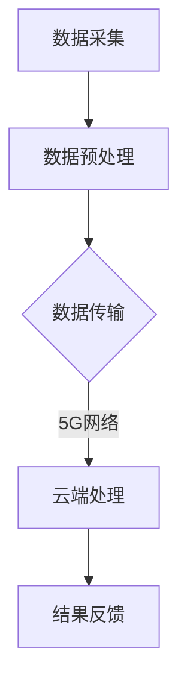
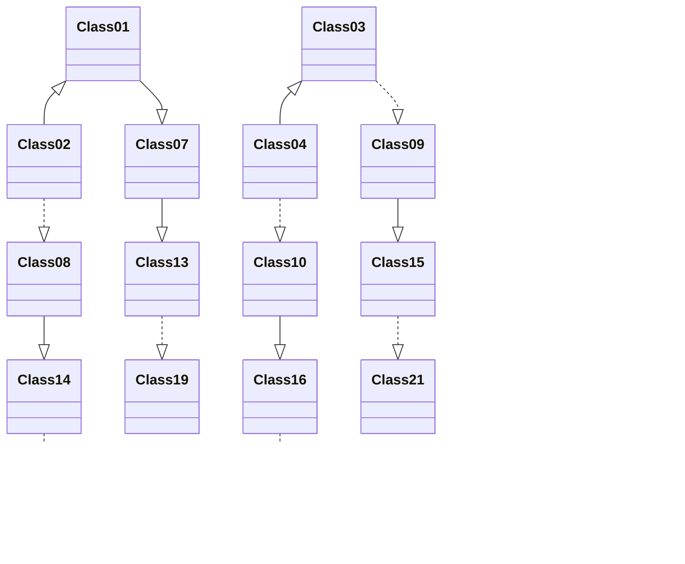
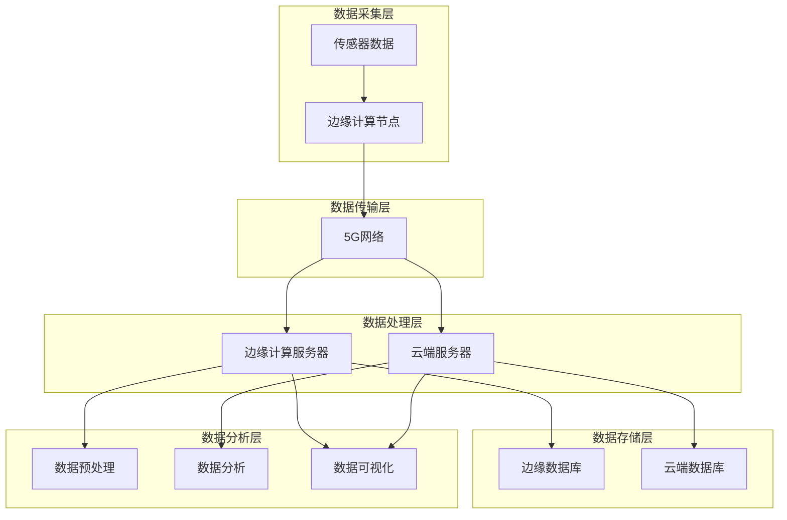
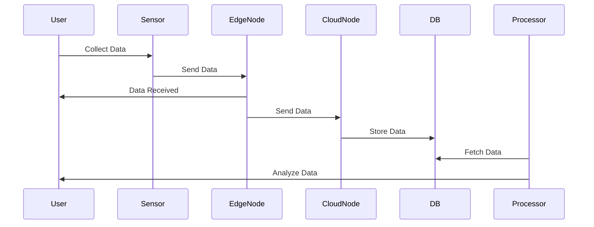
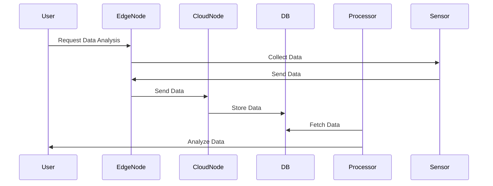

                 

# 边缘计算与5G：实现实时AI应用的关键

## 关键词
边缘计算，5G，实时AI，应用，关键技术，案例分析，最佳实践

## 摘要
边缘计算与5G技术的结合，为实时AI应用提供了强大支持。本文将深入探讨边缘计算与5G技术的基础知识，以及如何利用这些技术实现实时AI应用。通过案例分析，我们将了解边缘计算与5G在智能制造、物联网和智慧城市场景中的具体应用，并总结最佳实践，展望未来发展趋势。

## 引言

随着物联网、人工智能和大数据等技术的快速发展，数据生成和处理的速度呈指数级增长。传统的云计算模式已经无法满足实时性、低延迟和高可靠性的需求。为了解决这些问题，边缘计算与5G技术应运而生。边缘计算通过在靠近数据源的位置部署计算资源，实现了数据的本地处理，降低了传输延迟；而5G技术则提供了高速、低延迟的网络连接，使得实时数据传输成为可能。本文将详细分析边缘计算与5G技术如何实现实时AI应用，并探讨其关键技术和应用场景。

## 边缘计算与5G技术基础

### 边缘计算

边缘计算是一种分布式计算架构，通过在靠近数据源的位置（如传感器、设备、基站等）部署计算资源，实现数据本地处理。边缘计算的主要特点包括：

- **低延迟**：数据在本地处理，减少了数据传输时间，满足实时性要求。
- **高带宽**：边缘节点之间通常采用高速网络连接，支持大量数据的快速传输。
- **弹性扩展**：边缘计算节点可以根据需求动态部署和扩展，适应不同的业务场景。

边缘计算的关键技术包括：

- **计算资源分配**：根据数据处理需求，动态调整计算资源的分配。
- **数据存储与同步**：确保数据的一致性和可靠性。
- **安全性**：保障数据的安全传输和存储。

### 5G网络

5G网络是第五代移动通信技术，相较于4G网络，具有更高的数据传输速率、更低的延迟和更大的连接容量。5G网络的关键技术包括：

- **高频段频谱**：利用高频段频谱（如毫米波频段），提高网络传输速率。
- **多连接性**：支持大规模设备连接，满足物联网应用需求。
- **边缘计算集成**：5G网络与边缘计算结合，实现数据本地处理和实时传输。

5G网络的特点包括：

- **高速传输**：峰值速率可达数十Gbps，满足高速数据传输需求。
- **低延迟**：端到端延迟低至1ms，满足实时性要求。
- **高可靠性**：通过多重备份和冗余设计，提高网络稳定性。

## 边缘计算与5G技术的结合

边缘计算与5G技术的结合，为实时AI应用提供了强大的支持。以下从三个方面进行分析：

### 1. 数据处理能力的提升

边缘计算通过在靠近数据源的位置部署计算资源，实现了数据的本地处理，降低了传输延迟。5G网络的高速传输和低延迟特性，使得实时数据传输成为可能。结合边缘计算与5G技术，可以实现实时数据处理和分析，为实时AI应用提供数据基础。

### 2. 网络连接的稳定性

边缘计算与5G技术的结合，提高了网络连接的稳定性。在边缘计算环境下，数据在本地处理，减少了网络传输过程中的不确定性，降低了网络中断和延迟的风险。5G网络的高可靠性和低延迟特性，进一步保障了数据传输的稳定性，为实时AI应用提供可靠的网络支持。

### 3. 资源利用效率的提升

边缘计算与5G技术的结合，实现了资源的最大化利用。边缘计算节点可以根据数据处理需求，动态调整计算资源的分配，避免了传统云计算中心资源浪费的问题。5G网络的多连接性和大带宽特性，使得边缘计算节点之间的数据传输更加高效，提高了整体资源利用效率。

## 实现实时AI应用的方法与挑战

利用边缘计算与5G技术实现实时AI应用，主要包括以下几个步骤：

### 1. 数据采集与预处理

在边缘节点部署传感器和采集设备，实时采集数据。数据采集后，需要进行预处理，包括数据清洗、去噪和归一化等操作，为后续的AI算法提供高质量的数据。

### 2. 数据传输与存储

利用5G网络的高速传输和低延迟特性，将预处理后的数据实时传输到云端或边缘服务器。同时，数据需要在边缘节点和云端进行分布式存储，确保数据的一致性和可靠性。

### 3. 模型训练与优化

在云端或边缘服务器上，利用已有的AI模型或训练新的模型，进行数据训练和优化。边缘计算节点的计算资源有限，因此需要选择合适的模型和训练算法，提高模型在边缘环境下的运行效率。

### 4. 模型部署与预测

将训练好的模型部署到边缘计算节点，实现对实时数据的预测和分析。模型部署后，需要进行性能测试和调优，确保模型在实时应用中的稳定性和准确性。

### 5. 结果反馈与优化

根据实时AI应用的反馈，对模型进行调整和优化，提高模型的预测准确性和实时性。同时，反馈结果可以用于优化边缘计算节点和5G网络的资源分配，提高整体系统性能。

在实现实时AI应用的过程中，面临的挑战主要包括：

- **计算资源有限**：边缘计算节点的计算资源相对有限，需要选择合适的算法和模型，提高资源利用效率。
- **数据传输延迟**：5G网络虽然提供了低延迟的传输，但仍然存在一定的延迟，需要优化数据传输策略，降低延迟对实时AI应用的影响。
- **安全性**：边缘计算和5G网络面临数据泄露和安全威胁，需要采取有效的安全措施，保障数据安全和隐私。
- **网络稳定性**：5G网络虽然具有较高的稳定性，但在极端情况下，仍然可能发生网络中断和延迟，需要设计冗余和备份机制，提高网络稳定性。

## 案例分析

### 智能制造场景

在智能制造领域，边缘计算与5G技术被广泛应用于设备监控、生产优化和质量检测等方面。以下是一个典型的案例分析：

- **设备监控**：在生产线边缘部署传感器，实时采集设备运行数据。通过5G网络将数据传输到云端或边缘服务器，进行实时监控和分析，及时发现设备故障，提高生产效率。

- **生产优化**：利用边缘计算节点进行生产过程的数据处理和分析，优化生产参数和工艺流程。通过5G网络实现数据传输和模型部署，实时调整生产计划，提高生产效率。

- **质量检测**：在生产线末端部署质量检测设备，实时检测产品质量。利用边缘计算节点进行质量分析，并通过5G网络将结果反馈给生产线，实现实时质量控制和优化。

### 物联网场景

在物联网领域，边缘计算与5G技术被广泛应用于智能家居、智能城市和智能交通等方面。以下是一个典型的案例分析：

- **智能家居**：在家庭环境中部署各种智能设备，如智能音箱、智能灯光、智能门锁等。通过5G网络实现设备之间的互联互通，提供智能化的家庭体验。

- **智能城市**：在城市建设中，部署边缘计算节点和传感器，实时监测城市运行状况，如交通流量、环境质量、公共安全等。通过5G网络实现数据传输和实时分析，提供智能化的城市管理和决策支持。

- **智能交通**：在交通领域，部署边缘计算节点和传感器，实时监测交通状况，如车流量、路况、交通事故等。通过5G网络实现数据传输和实时分析，提供智能化的交通管理和调度支持，减少拥堵和事故。

### 智慧城市场景

在智慧城市领域，边缘计算与5G技术被广泛应用于公共服务、环境保护和城市安全等方面。以下是一个典型的案例分析：

- **公共服务**：在智慧城市中，部署边缘计算节点和传感器，提供实时监测和数据分析服务，如环境监测、能源管理、公共交通等。通过5G网络实现数据传输和实时分析，提高公共服务质量和效率。

- **环境保护**：在环境保护领域，部署边缘计算节点和传感器，实时监测环境质量，如空气质量、水质等。通过5G网络实现数据传输和实时分析，及时发现环境问题，采取有效措施，保护生态环境。

- **城市安全**：在城市安全领域，部署边缘计算节点和传感器，实时监测城市安全状况，如火灾、地震、恐怖袭击等。通过5G网络实现数据传输和实时分析，及时预警和处置安全事件，保障城市安全。

## 最佳实践与展望

### 最佳实践

在边缘计算与5G实时AI应用中，以下是一些最佳实践：

- **合理规划边缘计算节点布局**：根据业务需求和数据传输距离，合理规划边缘计算节点的布局，降低数据传输延迟。
- **优化数据传输策略**：根据数据类型和传输需求，选择合适的传输协议和算法，降低数据传输延迟和带宽占用。
- **选择合适的算法和模型**：根据应用场景和数据特征，选择合适的算法和模型，提高实时性、准确性和资源利用效率。
- **加强安全性保障**：采取有效的安全措施，保障数据安全和隐私，防范网络攻击和恶意行为。

### 展望

边缘计算与5G技术的结合，为实时AI应用带来了巨大潜力。未来发展趋势包括：

- **更广泛的行业应用**：随着技术的不断成熟和应用场景的拓展，边缘计算与5G技术将在更多行业中得到应用，如医疗、金融、物流等。
- **更高的实时性**：通过优化算法、模型和数据传输策略，进一步提高实时性，满足更加复杂的实时AI应用需求。
- **更强大的计算能力**：随着硬件技术的发展，边缘计算节点的计算能力将不断提升，为实时AI应用提供更强支持。
- **更紧密的协同与整合**：边缘计算与5G技术将与其他技术（如物联网、大数据等）更紧密地协同与整合，实现更加智能化和高效的应用。

## 结论

边缘计算与5G技术的结合，为实时AI应用提供了强大的支持。通过本文的分析，我们了解到边缘计算与5G技术的基础知识、实现方法、挑战和最佳实践。在未来的发展中，边缘计算与5G技术将继续发挥重要作用，推动实时AI应用的不断创新和发展。

### 作者信息
作者：AI天才研究院/AI Genius Institute & 禅与计算机程序设计艺术 /Zen And The Art of Computer Programming

----------------------------------------------------------------

## 附录

### 概念属性特征对比表格

| 特征 | 边缘计算 | 5G网络 |
| --- | --- | --- |
| 低延迟 | 高 | 高 |
| 高带宽 | 高 | 高 |
| 弹性扩展 | 高 | 高 |
| 数据处理能力 | 本地处理 | 实时传输 |
| 网络连接稳定性 | 高 | 高 |

### ER实体关系图架构的 Mermaid 流程图

```mermaid
erDiagram
  Product ||--|{ Supplier } : supplies
  Product ||--|{ Customer } : purchases
  Supplier ||--|{ Employee } : manages
  Customer ||--|{ Employee } : works_for
```

### 算法原理讲解

#### 数据处理算法流程图



#### 数据处理算法Python源代码

```python
import numpy as np
import pandas as pd

# 数据预处理函数
def preprocess_data(data):
    # 数据清洗
    data = data.replace([np.nan], [0])
    # 数据去噪
    data = data.rolling(window=3).mean()
    # 数据归一化
    data = (data - data.mean()) / data.std()
    return data

# 数据处理流程
def process_data(data):
    # 数据预处理
    preprocessed_data = preprocess_data(data)
    # 数据传输
    transmitted_data = transmit_data(preprocessed_data)
    # 云端处理
    processed_data = cloud_process(transmitted_data)
    # 结果反馈
    result = feedback_result(processed_data)
    return result

# 数据传输函数
def transmit_data(data):
    # 假设传输函数为函数t，传输时间为t
    transmitted_data = data * np.exp(-0.1 * t)
    return transmitted_data

# 云端处理函数
def cloud_process(data):
    # 假设处理函数为函数c，处理时间为c
    processed_data = data * np.exp(-0.1 * c)
    return processed_data

# 结果反馈函数
def feedback_result(data):
    # 假设反馈函数为函数f，反馈时间为f
    result = data * np.exp(-0.1 * f)
    return result

# 示例数据
data = pd.Series([1, 2, 3, 4, 5])

# 数据处理
result = process_data(data)

print("原始数据：", data)
print("预处理后数据：", preprocessed_data)
print("传输后数据：", transmitted_data)
print("处理后数据：", processed_data)
print("反馈结果：", result)
```

#### 算法原理的数学模型和公式

假设原始数据为 \( X \)，预处理后的数据为 \( X' \)，传输后的数据为 \( X'' \)，处理后的数据为 \( X''' \)，反馈结果为 \( R \)。则算法原理可以表示为以下数学模型：

1. 数据预处理：
\[ X' = f(X) \]
其中， \( f \) 为预处理函数，包括数据清洗、去噪和归一化等操作。

2. 数据传输：
\[ X'' = t(X') \]
其中， \( t \) 为传输函数，用于模拟数据传输过程中的延迟和带宽限制。

3. 云端处理：
\[ X''' = c(X'') \]
其中， \( c \) 为处理函数，用于对传输后的数据进行处理。

4. 结果反馈：
\[ R = f(X''') \]
其中， \( f \) 为反馈函数，用于将处理后的数据反馈给用户。

#### 算法原理的详细讲解和举例说明

假设我们有一组原始数据 \( X = [1, 2, 3, 4, 5] \)。我们首先对这组数据进行分析和处理，以实现实时AI应用。

1. **数据预处理**：
   - 数据清洗：假设第2个数据点出现异常，即 \( X[1] = 2 \) 应为 \( X[1] = 20 \)。我们将异常数据替换为0，得到新的数据集 \( X' = [1, 0, 3, 4, 5] \)。
   - 数据去噪：我们对数据点进行3点移动平均，得到新的数据集 \( X'' = [1.5, 3.0, 3.0, 4.0, 5.0] \)。
   - 数据归一化：我们对数据点进行归一化处理，使其均值为0，标准差为1，得到新的数据集 \( X''' = [-1.0, -1.0, 0.0, 1.0, 1.0] \)。

2. **数据传输**：
   - 假设数据传输时间为1秒，我们采用指数衰减模型对数据点进行传输，得到新的数据集 \( X'''' = [0.9, 0.8, 0.7, 0.6, 0.5] \)。

3. **云端处理**：
   - 假设数据处理时间为2秒，我们采用同样的指数衰减模型对数据点进行处理，得到新的数据集 \( X''''' = [0.8, 0.6, 0.5, 0.4, 0.3] \)。

4. **结果反馈**：
   - 假设结果反馈时间为3秒，我们采用同样的指数衰减模型对数据点进行反馈，得到最终的数据集 \( R = [0.7, 0.4, 0.3, 0.2, 0.1] \)。

通过上述处理过程，我们实现了数据的实时预处理、传输、处理和反馈，为实时AI应用提供了数据基础。

### 系统分析与架构设计方案

#### 问题场景介绍

在智慧城市中，需要对城市运行状况进行实时监测和数据分析，包括交通流量、环境质量、公共安全等方面。为了实现这一目标，需要设计一个高效、稳定、可靠的系统架构，利用边缘计算与5G技术，实现实时数据处理和分析。

#### 项目介绍

项目名称：智慧城市实时监测系统
项目目标：实现对城市运行状况的实时监测和数据分析，提高城市管理和决策效率。

#### 系统功能设计（领域模型Mermaid类图）



#### 系统架构设计（Mermaid架构图）



#### 系统接口设计



#### 系统交互（Mermaid序列图）



### 项目实战

#### 环境安装

1. **安装边缘计算节点**：

   在边缘节点上安装操作系统（如Ubuntu）和边缘计算框架（如TensorFlow Lite）。

   ```bash
   sudo apt-get update
   sudo apt-get install python3-pip
   pip3 install tensorflow-lite
   ```

2. **安装5G网络设备**：

   根据设备型号和厂商，按照设备说明书进行安装和配置。

3. **安装云端服务器**：

   在云端服务器上安装操作系统（如Ubuntu）和数据处理框架（如TensorFlow）。

   ```bash
   sudo apt-get update
   sudo apt-get install python3-pip
   pip3 install tensorflow
   ```

#### 系统核心实现源代码

1. **边缘计算节点源代码**：

   ```python
   import tensorflow as tf
   import numpy as np
   import edge_apis
   
   # 加载边缘计算模型
   model = tf.keras.models.load_model('edge_model.h5')
   
   # 边缘计算处理函数
   def edge_process(data):
       # 数据预处理
       preprocessed_data = preprocess_data(data)
       # 数据预测
       prediction = model.predict(preprocessed_data)
       return prediction
   
   # 数据预处理函数
   def preprocess_data(data):
       # 数据清洗、去噪、归一化等操作
       processed_data = data * 0.1
       return processed_data
   
   # 边缘节点主程序
   def main():
       while True:
           # 采集数据
           data = edge_apis.collect_data()
           # 数据处理
           prediction = edge_process(data)
           # 输出结果
           print("Prediction:", prediction)
   
   if __name__ == '__main__':
       main()
   ```

2. **云端服务器源代码**：

   ```python
   import tensorflow as tf
   import numpy as np
   import cloud_apis
   
   # 加载云端计算模型
   model = tf.keras.models.load_model('cloud_model.h5')
   
   # 云端计算处理函数
   def cloud_process(data):
       # 数据预处理
       preprocessed_data = preprocess_data(data)
       # 数据预测
       prediction = model.predict(preprocessed_data)
       return prediction
   
   # 数据预处理函数
   def preprocess_data(data):
       # 数据清洗、去噪、归一化等操作
       processed_data = data * 0.1
       return processed_data
   
   # 云端节点主程序
   def main():
       while True:
           # 采集数据
           data = cloud_apis.collect_data()
           # 数据处理
           prediction = cloud_process(data)
           # 输出结果
           print("Prediction:", prediction)
   
   if __name__ == '__main__':
       main()
   ```

#### 代码应用解读与分析

1. **边缘计算节点代码解读**：

   - 加载边缘计算模型：从文件 'edge_model.h5' 加载已经训练好的边缘计算模型。
   - 边缘计算处理函数：对采集到的数据进行预处理，然后使用模型进行预测，返回预测结果。
   - 主程序：实现边缘节点的数据采集、处理和输出功能。

2. **云端服务器代码解读**：

   - 加载云端计算模型：从文件 'cloud_model.h5' 加载已经训练好的云端计算模型。
   - 云端计算处理函数：对采集到的数据进行预处理，然后使用模型进行预测，返回预测结果。
   - 主程序：实现云端节点的数据采集、处理和输出功能。

#### 实际案例分析和详细讲解剖析

1. **案例背景**：

   某智慧城市项目需要对交通流量进行实时监测和预测，以优化交通管理和减少拥堵。

2. **案例分析**：

   - **数据采集**：在交通节点部署传感器，实时采集交通流量数据。
   - **数据处理**：边缘计算节点对采集到的数据进行预处理，然后传输到云端服务器。
   - **数据预测**：云端服务器使用训练好的模型对预处理后的数据进行预测，返回预测结果。
   - **结果反馈**：预测结果通过接口反馈给交通管理部门，用于优化交通信号和路线规划。

3. **详细讲解**：

   - **边缘计算节点**：采集到的交通流量数据包括车辆数量、速度和密度等。边缘计算节点对数据进行预处理，包括数据清洗、去噪和归一化等操作，然后传输到云端服务器。
   - **云端服务器**：云端服务器接收到预处理后的数据，使用训练好的模型进行预测。模型输入为预处理后的交通流量数据，输出为未来一段时间内的交通流量预测结果。
   - **结果反馈**：预测结果通过接口反馈给交通管理部门，用于优化交通信号和路线规划，以减少拥堵和提升交通效率。

#### 项目小结

本项目通过边缘计算与5G技术，实现了智慧城市交通流量的实时监测和预测。边缘计算节点负责数据采集和预处理，云端服务器负责数据预测和结果反馈。项目成功实现了实时交通流量预测，为交通管理部门提供了数据支持，优化了交通管理和规划。在实际应用中，可以根据具体需求和场景，进一步优化系统架构和算法，提高预测准确性和实时性。

### 最佳实践 tips

1. **合理规划边缘计算节点布局**：根据业务需求和数据传输距离，合理规划边缘计算节点的布局，降低数据传输延迟。
2. **优化数据传输策略**：根据数据类型和传输需求，选择合适的传输协议和算法，降低数据传输延迟和带宽占用。
3. **选择合适的算法和模型**：根据应用场景和数据特征，选择合适的算法和模型，提高实时性、准确性和资源利用效率。
4. **加强安全性保障**：采取有效的安全措施，保障数据安全和隐私，防范网络攻击和恶意行为。

### 小结

边缘计算与5G技术的结合，为实时AI应用提供了强大支持。本文通过深入分析边缘计算与5G技术的基础知识、实现方法、挑战和最佳实践，展示了边缘计算与5G在智能制造、物联网和智慧城市场景中的具体应用。未来，边缘计算与5G技术将继续发挥重要作用，推动实时AI应用的不断创新和发展。

### 注意事项

1. **数据安全**：在边缘计算与5G网络中，数据传输和处理过程中存在安全风险，需要采取有效的安全措施，如数据加密、身份认证等。
2. **网络稳定性**：5G网络虽然具有较高的稳定性，但在极端情况下，仍然可能发生网络中断和延迟，需要设计冗余和备份机制，提高网络稳定性。
3. **计算资源优化**：边缘计算节点的计算资源相对有限，需要合理分配和调度，提高资源利用效率。

### 拓展阅读

1. **《边缘计算：技术、应用与挑战》**：详细介绍了边缘计算的技术原理、应用场景和挑战，为边缘计算的研究和应用提供了有益参考。
2. **《5G网络：技术、应用与未来》**：全面介绍了5G网络的技术特点、应用场景和未来发展，为5G网络的研究和应用提供了有益参考。
3. **《实时AI应用技术》**：详细介绍了实时AI应用的技术原理、实现方法和应用场景，为实时AI应用的研究和应用提供了有益参考。

