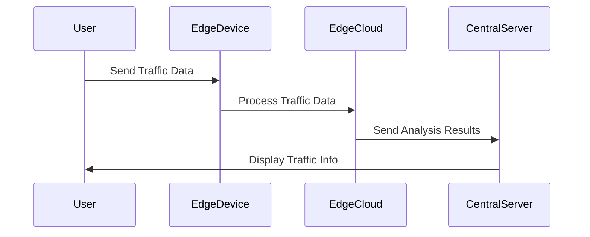
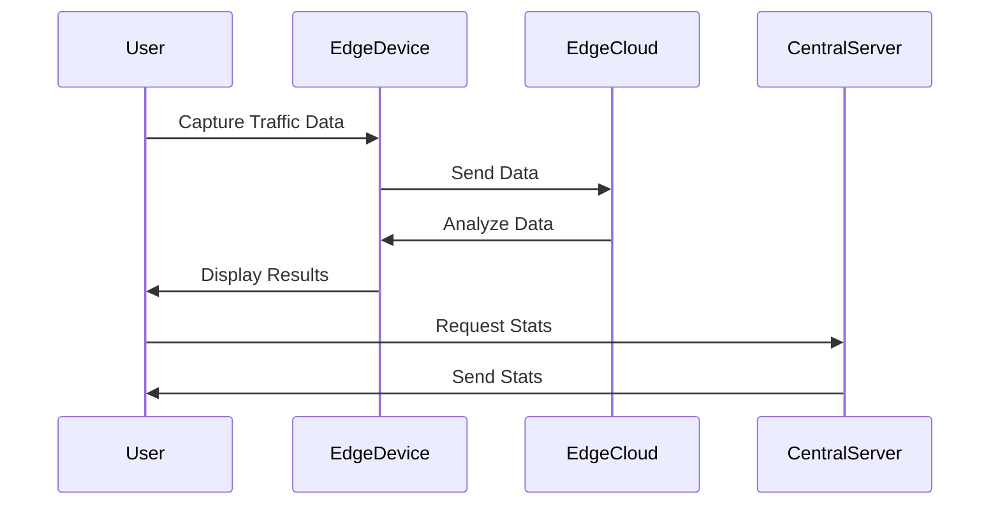

                 


### 引言

在当今数字化时代，视频数据分析已经成为各个行业不可或缺的一部分。从智能安防到智能交通，从智能制造到智能零售，视频数据分析技术的应用无处不在。然而，随着数据量的激增和实时性要求的提升，传统的云计算模式在处理这些海量视频数据时，常常面临着延迟高、带宽不足和计算能力不足等问题。为了解决这些问题，边缘计算应运而生，成为实时视频分析领域的新宠。

边缘计算，作为一种分布式计算架构，通过将计算任务分散到网络的边缘设备上，从而实现数据的本地化处理，减少了数据传输的距离和时间，极大地提升了系统的响应速度和处理能力。本文将围绕边缘计算在实时视频分析中的低延迟应用，进行深入探讨。

首先，我们将介绍边缘计算的基本概念，解释其与传统云计算的区别，并阐述边缘计算在实时视频分析中的优势和应用场景。接下来，我们将分析边缘计算架构设计，探讨实时视频分析系统架构及其与边缘计算的协同设计。

在核心技术的部分，我们将详细讲解边缘计算中的数据传输技术、图像处理技术和机器学习与深度学习技术，并分析其在边缘计算中的实际应用。接着，我们将探讨低延迟边缘计算在实时视频分析中的重要性，以及实现低延迟的解决方案。

案例部分，我们将通过三个具体的案例，展示边缘计算在实时视频分析中的实际应用效果。最后，我们将对边缘计算和实时视频分析的未来发展趋势进行展望，并总结全文，指出未来研究方向和挑战。

通过本文的逐步分析，我们希望能够为读者提供一个全面、深入的理解，帮助他们在实际项目中更好地应用边缘计算技术，实现高效、低延迟的实时视频分析。

### 第一部分：边缘计算与实时视频分析

#### 第1章：边缘计算与实时视频分析概述

##### 1.1 边缘计算的基本概念

边缘计算（Edge Computing）是指将计算、存储、处理和服务等能力从传统的集中式数据中心转移到网络的边缘，即在靠近数据源或数据生成的地方进行数据处理。这一概念最早由IBM在2014年提出，旨在解决传统云计算模式中存在的延迟高、带宽不足和计算能力不足等问题。

边缘计算的定义可以简单概括为：在数据生成的源头，即网络的边缘，进行数据处理和计算的一种计算范式。与传统的云计算模式不同，边缘计算将计算任务分散到网络的边缘设备上，如物联网设备、智能手机、路由器等，从而实现数据的本地化处理。

边缘计算与传统云计算的区别：

- **计算位置**：传统云计算将计算任务集中在远程的数据中心，而边缘计算则将计算任务分散到网络的边缘设备上。
- **延迟**：由于数据不需要通过互联网传输到远程数据中心，边缘计算能够显著降低数据处理和响应的延迟。
- **带宽**：边缘计算减少了对互联网带宽的依赖，降低了带宽成本，特别是在带宽受限的地区。
- **计算资源**：边缘计算利用了分布式的计算资源，能够更好地应对突发的大规模数据处理需求。

##### 1.2 边缘计算的优势

边缘计算具有许多独特的优势，使其在实时视频分析中具有显著的应用潜力：

- **低延迟**：由于数据处理和计算在靠近数据源的边缘设备上进行，边缘计算能够显著降低系统的响应时间，满足实时视频分析对低延迟的需求。
- **高带宽利用**：边缘计算减少了数据传输的需求，从而提高了带宽的利用率，特别是在数据密集型应用场景中。
- **高效能**：边缘计算通过分布式计算架构，提高了整体系统的计算效率和资源利用率。
- **高可靠性和容错性**：边缘计算通过在多个设备上分布计算任务，提高了系统的可靠性和容错能力。
- **低成本**：边缘计算减少了数据中心的建设和运维成本，特别是在数据传输和带宽成本较高的场景中。

##### 1.3 实时视频分析的应用背景

实时视频分析（Real-Time Video Analysis）是一种利用计算机视觉和人工智能技术，对视频流进行实时处理和分析的技术。随着视频监控技术的普及和视频数据量的激增，实时视频分析在各个领域都得到了广泛应用。

- **视频监控领域的发展趋势**：随着智能化和高清化的发展，视频监控领域对实时视频分析的需求越来越高。实时视频分析能够快速识别和响应异常事件，提高监控系统的效率和准确性。
- **实时视频分析的重要性**：实时视频分析能够实现视频内容的智能理解和实时响应，对于公共安全、智能交通、智能零售等领域具有重要意义。
- **实时视频分析的技术挑战**：实时视频分析面临着大量数据的高并发处理、低延迟处理、复杂场景的识别和响应等技术挑战。

##### 1.4 边缘计算在实时视频分析中的应用

边缘计算在实时视频分析中具有广泛的应用前景：

- **提升实时视频分析的效率**：通过边缘计算，实时视频分析系统能够在本地进行高效的数据处理和计算，减少对中心数据中心的依赖，提高系统的响应速度和处理效率。
- **应用场景多样化**：边缘计算能够满足不同场景下实时视频分析的需求，如智能安防、智能交通、智能工厂等，提高了系统的灵活性和适应性。
- **降低成本**：边缘计算减少了数据传输和存储的需求，降低了系统的总体成本，特别是在带宽和存储成本较高的地区。

##### 1.5 边缘计算与实时视频分析的未来展望

随着边缘计算技术的不断发展和成熟，边缘计算在实时视频分析中的应用前景非常广阔：

- **技术发展趋势**：边缘计算硬件和网络的不断升级，将进一步提升边缘计算的性能和可靠性。
- **未来发展方向**：实时视频分析算法的优化和新型视频分析技术的引入，将进一步提高实时视频分析的精度和效率。
- **潜在应用领域**：边缘计算和实时视频分析的结合，将在更多领域如智慧城市、远程医疗、智能家居等得到广泛应用。

通过以上分析，我们可以看到边缘计算在实时视频分析中具有重要的应用价值。接下来，我们将进一步探讨边缘计算架构设计，探讨实时视频分析系统架构及其与边缘计算的协同设计，为后续的技术分析打下基础。

#### 第2章：边缘计算架构设计

##### 2.1 边缘计算系统架构

边缘计算系统架构是边缘计算技术的核心，它决定了系统的性能、可靠性和扩展性。一个典型的边缘计算系统架构包括边缘节点、边缘网络和边缘云三部分，以下将详细说明这三部分的组成和作用。

- **边缘节点**：边缘节点是边缘计算系统的基本单元，它可以是各种终端设备，如物联网设备、智能手机、路由器等。边缘节点主要负责数据的采集、初步处理和传输，同时也可以执行一些简单的计算任务，如数据过滤、压缩和加密等。

- **边缘网络**：边缘网络是连接边缘节点和云端的数据传输通道，它可以是无线网络、有线网络或卫星网络等。边缘网络的设计需要考虑带宽、延迟和可靠性等因素，以确保数据传输的高效和稳定。此外，边缘网络还可以实现边缘节点之间的数据共享和协同处理，提高系统的整体性能。

- **边缘云**：边缘云是边缘计算系统的数据处理中心，它通常位于网络的边缘，可以是一个独立的云计算平台，也可以是云服务提供商的边缘节点。边缘云主要负责接收和处理边缘节点上传的数据，进行复杂的计算和分析任务，并将结果返回给边缘节点或云端。

##### 2.2 实时视频分析系统架构设计

实时视频分析系统架构设计需要考虑边缘计算的特点和实时视频分析的需求，以下是一个典型的实时视频分析系统架构设计：

- **数据采集层**：数据采集层包括各种视频监控设备，如摄像头、无人机等，它们负责采集视频数据并传输到边缘节点。

- **边缘节点处理层**：边缘节点处理层包括边缘服务器和边缘设备，它们负责对视频数据进行初步处理，如数据过滤、压缩和加密等。同时，边缘节点还可以执行一些简单的视频分析任务，如运动检测和初步人脸识别等。

- **边缘云处理层**：边缘云处理层负责接收和处理边缘节点上传的数据，执行复杂的视频分析任务，如人脸识别、车辆检测和交通流量分析等。边缘云还可以将分析结果返回给边缘节点，以便进行后续处理。

- **数据存储与共享层**：数据存储与共享层负责存储和处理分析结果，同时实现数据在不同层级之间的共享和传输。

- **用户接口层**：用户接口层负责向用户提供实时视频分析结果，如通过网页、移动应用等展示分析结果。

##### 2.3 边缘计算与实时视频分析系统协同设计

边缘计算与实时视频分析系统的协同设计是提高系统性能和可靠性的关键，以下是一些关键点：

- **数据传输优化**：通过优化数据传输协议和传输路径，降低数据传输的延迟和带宽消耗，提高系统的响应速度。

- **计算资源调度**：根据实时视频分析任务的需求，合理调度边缘节点和边缘云的计算资源，确保系统在高峰期能够高效运行。

- **负载均衡**：通过负载均衡机制，合理分配任务到不同的边缘节点和边缘云，避免单点过载和资源浪费。

- **容错与备份**：设计容错机制，确保系统在边缘节点或边缘云发生故障时，能够快速切换到备用节点，保证系统的连续性和可靠性。

- **安全与隐私保护**：在数据传输和处理过程中，采取有效的安全措施，保护用户隐私和数据安全。

通过上述边缘计算架构设计和实时视频分析系统架构设计，可以构建一个高效、可靠、低延迟的实时视频分析系统，为各种应用场景提供强大的技术支持。在下一部分，我们将深入探讨边缘计算与实时视频分析中的核心技术，进一步解析系统的工作原理和实现方法。

#### 第3章：边缘计算与实时视频分析的核心技术

##### 3.1 边缘计算中的数据传输技术

边缘计算中的数据传输技术是确保数据高效、稳定传输的关键。以下将从数据传输协议、数据压缩与加密技术、数据传输优化策略三个方面进行探讨。

- **数据传输协议**：

  数据传输协议是边缘计算系统中数据传输的基本规范，常用的数据传输协议包括HTTP/2、QUIC、CoAP等。

  - **HTTP/2**：相比于传统的HTTP/1.1，HTTP/2提供了更高效的二进制格式、多路复用、头部压缩等功能，从而提高了数据传输速度和可靠性。

  - **QUIC**：QUIC（Quick UDP Internet Connections）是一种基于UDP的传输层协议，它提供了低延迟、高安全性和可靠性，适用于实时视频分析等对延迟敏感的应用。

  - **CoAP**：Constrained Application Protocol（CoAP）是一种专门为物联网设备设计的数据传输协议，具有低带宽、低延迟的特点，适用于边缘计算环境中的数据传输。

- **数据压缩与加密技术**：

  数据压缩技术可以减少数据传输的带宽需求，提高传输效率。常见的压缩算法包括H.264、H.265、JPEG等。

  数据加密技术则确保数据在传输过程中的安全性和隐私性。常用的加密算法包括AES、RSA等。

  - **数据压缩**：通过H.264或H.265算法对视频数据进行压缩，可以有效减少数据传输的带宽消耗，同时保持较高的视频质量。

  - **数据加密**：采用AES加密算法对视频数据进行加密，确保数据在传输过程中不被非法访问和篡改，提高数据的安全性。

- **数据传输优化策略**：

  数据传输优化策略旨在提高数据传输的效率和稳定性，包括传输路径选择、传输速率调整、流量控制等。

  - **传输路径选择**：根据网络状况和节点负载，选择最优的传输路径，降低传输延迟和带宽消耗。

  - **传输速率调整**：根据实际网络状况动态调整传输速率，避免网络拥塞和传输中断。

  - **流量控制**：通过流量控制机制，合理分配带宽资源，避免单点过载和资源浪费。

##### 3.2 实时视频分析中的图像处理技术

图像处理技术是实时视频分析的重要组成部分，以下从图像预处理技术、特征提取方法和目标检测与追踪算法三个方面进行探讨。

- **图像预处理技术**：

  图像预处理技术是确保视频数据质量的关键步骤，主要包括去噪、增强、灰度化等。

  - **去噪**：通过图像去噪算法，如中值滤波、高斯滤波等，去除图像中的噪声，提高图像质量。

  - **增强**：通过图像增强算法，如直方图均衡、对比度增强等，改善图像的视觉效果，提高后续处理的准确性。

  - **灰度化**：将彩色图像转换为灰度图像，简化图像处理过程，降低计算复杂度。

- **特征提取方法**：

  特征提取是将图像数据转换为适合机器学习算法处理的形式，常用的特征提取方法包括直方图、SIFT、HOG等。

  - **直方图**：通过计算图像的像素分布直方图，提取图像的纹理信息。

  - **SIFT（尺度不变特征变换）**：通过检测图像的关键点，提取其局部特征，具有较强的尺度不变性和旋转不变性。

  - **HOG（方向梯度直方图）**：通过计算图像中每个像素点的方向梯度，构建直方图，提取图像的形状特征。

- **目标检测与追踪算法**：

  目标检测与追踪是实时视频分析的核心任务，常用的算法包括HSV模型、YOLO、SSD等。

  - **HSV模型**：通过将图像转换为HSV颜色空间，检测特定的颜色目标，适用于颜色特征明显的场景。

  - **YOLO（You Only Look Once）**：YOLO是一种单阶段目标检测算法，具有实时性和高效性，适用于多种目标检测任务。

  - **SSD（Single Shot MultiBox Detector）**：SSD是一种基于卷积神经网络的端到端目标检测算法，适用于多种尺度的目标检测。

##### 3.3 边缘计算中的机器学习与深度学习技术

边缘计算中的机器学习与深度学习技术是实现实时视频分析的关键，以下从机器学习算法、深度学习算法和模型压缩与优化技术三个方面进行探讨。

- **机器学习算法**：

  机器学习算法是边缘计算中常用的数据分析和分类方法，包括SVM、KNN、决策树等。

  - **SVM（支持向量机）**：SVM通过找到一个最佳的超平面，将不同类别的数据点分开，具有较强的分类能力。

  - **KNN（K近邻）**：KNN通过计算新数据点与训练数据点的距离，找到最近的K个邻居，并基于邻居的分类结果进行预测。

  - **决策树**：决策树通过一系列的决策规则，对数据进行分类或回归，具有较强的解释性。

- **深度学习算法**：

  深度学习算法通过多层神经网络，自动提取图像数据中的特征，适用于复杂的目标检测和识别任务。

  - **CNN（卷积神经网络）**：CNN通过卷积层、池化层和全连接层等结构，提取图像特征，实现图像分类、目标检测等任务。

  - **RNN（循环神经网络）**：RNN通过记忆机制，处理序列数据，适用于视频数据的时序分析。

  - **GAN（生成对抗网络）**：GAN通过生成器和判别器的对抗训练，生成高质量的图像数据，提高模型的泛化能力。

- **模型压缩与优化技术**：

  模型压缩与优化技术是边缘计算中提高模型效率的关键，包括模型剪枝、量化、蒸馏等。

  - **模型剪枝**：通过删除模型中不重要的权重和神经元，减少模型参数和计算复杂度。

  - **量化**：将模型的浮点参数转换为低比特位宽的整数参数，降低模型的存储和计算需求。

  - **蒸馏**：通过将大模型的知识传递给小模型，提高小模型的性能，同时减少模型参数和计算需求。

通过上述对边缘计算中的数据传输技术、图像处理技术和机器学习与深度学习技术的介绍，我们可以看到这些核心技术是如何协同工作，实现高效、低延迟的实时视频分析。在下一部分，我们将探讨低延迟边缘计算在实时视频分析中的重要性，以及实现低延迟的解决方案。

#### 第4章：低延迟边缘计算在实时视频分析中的应用

##### 4.1 低延迟边缘计算的重要性

在实时视频分析中，低延迟是至关重要的。实时视频分析需要快速响应，例如在智能安防系统中，及时识别可疑行为；在智能交通系统中，实时监控交通流量，避免交通堵塞。以下从以下几个方面阐述低延迟边缘计算在实时视频分析中的重要性：

- **实时性需求**：实时视频分析要求系统能够在短时间内处理和响应视频数据，低延迟是实现实时性的关键。

- **决策效率**：低延迟使得系统能够及时做出决策，提高了整个系统的效率和准确性，尤其在紧急事件处理中，低延迟至关重要。

- **用户体验**：在智能零售、智能医疗等领域，低延迟可以提供更加流畅的用户体验，提升服务质量。

- **资源优化**：通过减少数据传输和中心处理的需求，低延迟边缘计算可以优化整体系统资源，降低成本。

##### 4.2 实时视频分析中的低延迟解决方案

实现低延迟边缘计算需要从硬件、软件和系统架构等多个方面进行优化，以下介绍几种常见的低延迟解决方案：

- **硬件加速技术**：

  硬件加速技术利用专门的硬件资源，如GPU、FPGA等，加快数据处理速度，降低延迟。以下是一些常见的硬件加速技术：

  - **GPU加速**：GPU具备强大的并行计算能力，适用于图像处理和深度学习任务。通过使用GPU加速，可以显著提高实时视频分析的速度。

  - **FPGA加速**：FPGA是一种可编程逻辑器件，可以针对特定的算法进行优化，提高数据处理效率。在实时视频分析中，FPGA可以用于视频解码、特征提取等环节。

- **软件优化技术**：

  软件优化包括算法优化、代码优化和系统优化等，以下是一些常见的软件优化技术：

  - **算法优化**：针对实时视频分析任务，选择高效的算法和模型，如YOLO、SSD等，减少计算复杂度。

  - **代码优化**：通过代码优化，如并行计算、内存优化等，提高代码的执行效率，减少延迟。

  - **系统优化**：优化系统配置和调度策略，如负载均衡、资源调度等，提高系统的整体性能。

- **系统架构优化技术**：

  系统架构优化可以通过优化数据传输路径、计算分布等，降低延迟。以下是一些常见的系统架构优化技术：

  - **边缘节点协同处理**：通过边缘节点的协同处理，将计算任务分散到多个边缘节点上，实现并行处理，降低延迟。

  - **数据传输路径优化**：优化数据传输路径，减少数据传输距离和传输时间，如使用光纤网络、缩短传输距离等。

  - **分布式存储**：通过分布式存储，提高数据访问速度，减少数据传输延迟。

##### 4.3 低延迟边缘计算在实时视频分析中的应用实例

以下通过几个具体的实例，展示低延迟边缘计算在实时视频分析中的应用：

- **实时人脸识别系统**：

  实时人脸识别系统需要快速识别和匹配人脸，通过边缘计算技术，可以实现以下优化：

  - **硬件加速**：使用GPU或FPGA加速人脸识别算法，提高识别速度。

  - **算法优化**：采用高效的人脸识别算法，如基于深度学习的FaceNet，提高识别准确性。

  - **边缘节点协同**：通过多个边缘节点的协同处理，实现快速的人脸识别和匹配。

- **实时物体检测与追踪系统**：

  实时物体检测与追踪系统需要快速检测和跟踪视频中的物体，通过边缘计算技术，可以实现以下优化：

  - **硬件加速**：使用GPU或FPGA加速物体检测算法，如YOLO，提高检测速度。

  - **算法优化**：优化物体检测算法，减少检测时间，提高检测准确性。

  - **边缘节点协同**：通过多个边缘节点的协同处理，实现快速、准确的物体检测和跟踪。

- **实时交通流量监控系统**：

  实时交通流量监控系统需要实时监控道路上的车辆流量和状态，通过边缘计算技术，可以实现以下优化：

  - **硬件加速**：使用GPU或FPGA加速图像处理和车辆检测算法，提高处理速度。

  - **算法优化**：优化图像处理和车辆检测算法，提高检测准确性。

  - **边缘节点协同**：通过多个边缘节点的协同处理，实现快速、准确的交通流量监控。

通过上述实例，我们可以看到低延迟边缘计算在实时视频分析中的应用效果。在下一部分，我们将通过具体案例，进一步展示边缘计算在实时视频分析中的实际应用效果。

##### 第5章：边缘计算在实时视频分析中的应用案例

#### 5.1 案例一：智能安防系统

**案例背景**：
智能安防系统在现代社会中发挥着至关重要的作用，能够实时监控公共区域的安全状况，及时识别潜在威胁并采取相应措施。然而，随着监控摄像头数量的增加和监控区域的扩大，传统中心化的视频分析模式面临着严重的延迟和带宽压力。

**系统设计**：
为了解决上述问题，该智能安防系统采用了边缘计算技术，将部分计算任务下放至靠近监控区域的边缘节点。系统设计主要包括以下几个模块：

- **数据采集模块**：通过安装在不同区域的摄像头，实时采集视频数据。
- **边缘节点处理模块**：边缘节点包括NVIDIA Jetson边缘设备，负责视频数据的预处理、人脸识别和异常行为检测。
- **边缘云处理模块**：边缘云负责接收和处理边缘节点上传的数据，执行复杂的视频分析任务，如行为模式识别、实时报警等。
- **用户接口模块**：通过网页和移动应用，向用户展示分析结果和报警信息。

**应用效果**：
通过边缘计算技术的应用，智能安防系统实现了以下效果：

- **低延迟**：视频分析任务在边缘节点上快速完成，大大降低了系统的响应时间，提高了实时性。
- **高效能**：边缘节点和边缘云协同工作，提升了整个系统的处理能力和效率。
- **高可靠性**：通过边缘节点的分布式架构，提高了系统的容错性和可靠性。
- **低成本**：减少了数据传输和中心处理的需求，降低了系统成本。

**技术实现**：

- **边缘节点**：使用NVIDIA Jetson边缘设备，搭载GPU加速器，执行人脸识别和异常行为检测任务。
- **算法优化**：采用基于深度学习的人脸识别算法和基于规则的行为检测算法，提高识别准确率和响应速度。
- **数据传输**：使用QUIC协议优化数据传输，提高传输速度和稳定性。

**项目小结**：
通过智能安防系统的实施，边缘计算技术成功解决了传统视频分析模式中的延迟和带宽问题，提高了系统的实时性和可靠性，为公共安全提供了有力保障。

#### 5.2 案例二：智能交通系统

**案例背景**：
随着城市化进程的加速，交通问题日益严重，实时监控和管理交通流量成为提高城市交通效率的重要手段。传统的中心化交通监控系统由于延迟和数据传输问题，难以满足实时交通管理的需求。

**系统设计**：
为了解决上述问题，该智能交通系统采用了边缘计算技术，实现本地化的交通流量监控和分析。系统设计主要包括以下几个模块：

- **数据采集模块**：通过安装在道路上的摄像头、雷达和传感器，实时采集交通数据。
- **边缘节点处理模块**：边缘节点负责视频数据的初步处理，如车辆检测、交通流量分析等。
- **边缘云处理模块**：边缘云负责处理边缘节点上传的数据，进行更复杂的交通流量分析和预测。
- **用户接口模块**：通过交通信号灯控制系统和城市交通指挥中心，实时展示交通状况和优化建议。

**应用效果**：
通过边缘计算技术的应用，智能交通系统实现了以下效果：

- **低延迟**：交通数据分析在边缘节点上快速完成，实时响应交通变化，提高了交通管理的效率。
- **高效能**：边缘节点和边缘云协同工作，提高了系统的整体处理能力和准确性。
- **智能化**：通过实时交通流量分析和预测，智能调整交通信号灯和道路规划，缓解交通拥堵。
- **低成本**：降低了数据传输和中心处理的需求，降低了系统建设和运维成本。

**技术实现**：

- **边缘节点**：使用NVIDIA Jetson边缘设备，搭载GPU加速器，执行车辆检测和交通流量分析任务。
- **算法优化**：采用基于深度学习的车辆检测算法和基于统计学的交通流量分析算法，提高检测和预测准确性。
- **数据传输**：使用HTTP/2协议优化数据传输，提高传输速度和稳定性。

**项目小结**：
通过智能交通系统的实施，边缘计算技术成功解决了传统交通监控系统中的延迟和数据传输问题，提高了交通管理的智能化水平，为城市交通提供了有力支持。

#### 5.3 案例三：智能工厂监控系统

**案例背景**：
在工业生产过程中，设备故障和操作失误可能导致生产中断和安全事故。实时监控工厂设备状态和操作行为，对确保生产安全和提高生产效率具有重要意义。传统的中心化监控系统由于延迟和数据传输问题，难以满足实时监控的需求。

**系统设计**：
为了解决上述问题，该智能工厂监控系统采用了边缘计算技术，实现本地化的设备状态监控和操作行为分析。系统设计主要包括以下几个模块：

- **数据采集模块**：通过安装在工厂设备上的传感器、摄像头等，实时采集设备状态和操作数据。
- **边缘节点处理模块**：边缘节点负责数据预处理和初步分析，如设备故障检测、异常行为识别等。
- **边缘云处理模块**：边缘云负责处理边缘节点上传的数据，进行更复杂的故障诊断和操作行为分析。
- **用户接口模块**：通过工业平板和手机APP，实时展示设备状态和操作行为，提供故障预警和操作指导。

**应用效果**：
通过边缘计算技术的应用，智能工厂监控系统实现了以下效果：

- **低延迟**：设备状态和操作行为分析在边缘节点上快速完成，实时响应设备故障和操作异常，提高了生产安全性。
- **高效能**：边缘节点和边缘云协同工作，提高了系统的整体处理能力和准确性。
- **智能化**：通过实时监控和数据分析，实现了对设备故障的提前预警和操作行为的优化指导，提高了生产效率。
- **低成本**：降低了数据传输和中心处理的需求，降低了系统建设和运维成本。

**技术实现**：

- **边缘节点**：使用树莓派边缘设备，搭载CPU和GPU加速器，执行设备故障检测和异常行为识别任务。
- **算法优化**：采用基于深度学习的设备故障检测算法和基于规则的异常行为识别算法，提高检测和识别准确性。
- **数据传输**：使用CoAP协议优化数据传输，提高传输速度和稳定性。

**项目小结**：
通过智能工厂监控系统的实施，边缘计算技术成功解决了传统监控系统中的延迟和数据传输问题，提高了设备监控的实时性和准确性，为工业生产提供了有力保障。

### 第6章：边缘计算与实时视频分析的未来发展

#### 6.1 边缘计算技术发展趋势

随着5G、物联网和人工智能等技术的快速发展，边缘计算正迎来新的发展机遇。以下是一些重要的技术发展趋势：

- **5G网络支持**：5G网络的低延迟、高速率和大连接特性，为边缘计算提供了更好的网络环境，进一步提高了边缘计算的性能和可靠性。
- **物联网设备普及**：物联网设备的普及，特别是智能传感器和智能终端的广泛应用，为边缘计算提供了丰富的数据来源和处理需求。
- **人工智能与深度学习**：人工智能和深度学习技术的发展，为边缘计算提供了强大的算法支持，使得边缘设备能够进行更加复杂的数据分析和决策。
- **边缘云与云计算协同**：边缘云与云计算的协同发展，形成了边缘计算与云计算相辅相成的生态体系，提高了整个系统的效率和灵活性。

#### 6.2 实时视频分析技术发展趋势

实时视频分析技术在不断发展和完善，未来将呈现出以下趋势：

- **算法优化**：随着人工智能和深度学习技术的进步，实时视频分析算法将得到进一步优化，提高识别准确率和处理速度。
- **多模态融合**：实时视频分析将不再局限于单一的视频数据，而是融合图像、声音、文本等多模态数据，实现更全面、准确的分析。
- **边缘计算与云协作**：边缘计算与云计算的协作，将实现更高效、低延迟的视频数据处理和分析，满足实时性需求。
- **个性化分析与预测**：通过大数据分析和机器学习模型，实时视频分析将实现个性化分析和预测，为不同场景提供定制化的解决方案。

#### 6.3 边缘计算与实时视频分析的未来展望

边缘计算与实时视频分析技术的融合，将为社会带来深远的影响：

- **智慧城市**：边缘计算与实时视频分析的结合，将助力智慧城市建设，提升城市治理水平，实现交通优化、环境监控、公共安全等领域的智能化。
- **远程医疗**：通过边缘计算和实时视频分析，远程医疗可以实现实时监控和诊断，为偏远地区和基层医疗提供优质的医疗服务。
- **智能制造**：边缘计算与实时视频分析在智能制造中的应用，将实现设备状态监控、生产过程优化、产品缺陷检测等，提高生产效率和产品质量。
- **智能家居**：边缘计算与实时视频分析在智能家居中的应用，将提升家庭安全、舒适度和智能化水平，为人们的生活带来更多便利。

### 第7章：总结与展望

#### 边缘计算在实时视频分析中的重要性

边缘计算在实时视频分析中具有重要地位，它通过将计算任务从中心转移到边缘，实现了低延迟、高效率和灵活性的优势。这种技术不仅提升了实时视频分析的性能，还降低了系统的成本和复杂性。

#### 边缘计算与实时视频分析的核心技术

边缘计算与实时视频分析的核心技术包括数据传输技术、图像处理技术和机器学习与深度学习技术。这些技术的优化和集成，是边缘计算在实时视频分析中取得成功的关键。

#### 未来研究方向与挑战

未来，边缘计算和实时视频分析技术的发展将面临以下挑战：

- **计算资源的优化**：如何高效利用边缘设备的计算资源，提高系统的处理能力，是一个重要的研究方向。
- **数据传输的稳定性**：如何保证数据传输的稳定性和低延迟，特别是在复杂网络环境中，是另一个关键问题。
- **算法的优化与扩展**：如何优化和扩展实时视频分析算法，使其适应更复杂的场景和需求，是未来研究的重要方向。

### 结论

边缘计算与实时视频分析的结合，为实时数据处理和分析提供了新的解决方案。通过本文的探讨，我们看到了边缘计算在实时视频分析中的广泛应用和巨大潜力。未来，随着技术的不断进步，边缘计算和实时视频分析将在更多领域发挥重要作用，为我们的生活和生产带来更多便利和创新。作者：AI天才研究院/AI Genius Institute & 禅与计算机程序设计艺术 /Zen And The Art of Computer Programming

## 附录

### 概念术语说明

- **边缘计算（Edge Computing）**：一种分布式计算范式，通过将计算任务分散到网络的边缘设备上进行数据处理和计算。
- **实时视频分析（Real-Time Video Analysis）**：利用计算机视觉和人工智能技术，对视频流进行实时处理和分析的技术。
- **5G网络**：第五代移动通信网络，具有低延迟、高速率和大连接特性。
- **物联网（IoT）**：物联网是指通过互联网连接的各种设备和物品。

### 背景介绍

随着视频监控技术的普及和视频数据量的激增，实时视频分析技术成为公共安全、智能交通、智能制造等领域的重要工具。然而，传统的中心化视频分析模式面临着延迟高、带宽不足和计算能力不足等问题，难以满足实时性和高效性的需求。边缘计算作为一种分布式计算架构，通过将计算任务分散到网络的边缘设备上，能够显著降低系统的响应时间和处理延迟，提升实时视频分析的性能和效率。

### 核心概念与联系

#### 边缘计算

**概念属性特征对比表格：**

| 特征         | 边缘计算           | 云计算            |
|--------------|------------------|------------------|
| 计算位置     | 网络的边缘设备上   | 集中的数据中心    |
| 延迟         | 低               | 较高             |
| 带宽需求     | 低               | 高               |
| 计算资源     | 分布式资源        | 集中式资源        |
| 容错性       | 较高             | 较高             |
| 可扩展性     | 较高             | 较高             |

**ER实体关系图架构：**

```mermaid
erDiagram
    EdgeDevice ||--|{ DataCenter }
    DataCenter ||--|{ CloudService }
    EdgeDevice ||--|{ AnalyticsService }
```

#### 实时视频分析

**概念属性特征对比表格：**

| 特征         | 实时视频分析           | 非实时视频分析           |
|--------------|------------------|------------------------|
| 响应时间     | 极快               | 较慢                   |
| 数据处理速度   | 高速               | 较慢                   |
| 精准度       | 较高               | 较低                   |
| 实时性需求    | 强               | 弱                     |

**ER实体关系图架构：**

```mermaid
erDiagram
    VideoStream ||--|{ RealTimeAnalyzer }
    VideoStream ||--|{ OfflineAnalyzer }
    RealTimeAnalyzer ||--|{ EventDetector }
    RealTimeAnalyzer ||--|{ ObjectTracker }
    OfflineAnalyzer ||--|{ FeatureExtractor }
    OfflineAnalyzer ||--|{ ClassificationModel }
```

### 系统分析与架构设计方案

#### 问题场景介绍

智能交通系统需要实时监控和预测交通流量，以优化交通信号控制和道路规划，提高城市交通效率。

#### 项目介绍

项目目标是构建一个基于边缘计算的智能交通系统，实现对实时交通流量的快速分析和预测，为交通管理和规划提供数据支持。

#### 系统功能设计（领域模型类图）

```mermaid
classDiagram
    Class1 <|-- Class2
    Class3 <|-- Class4
    Class1 --|{ Has } Class5
    Class2 --|{ Has } Class6
    Class3 --|{ Has } Class7
    Class4 --|{ Has } Class8
    Class5 --|{ Uses } Class9
    Class6 --|{ Uses } Class10
    Class7 --|{ Uses } Class11
    Class8 --|{ Uses } Class12
```

#### 系统架构设计（架构图）



#### 系统接口设计和系统交互（序列图）



### 项目实战

#### 环境安装

1. 安装NVIDIA Jetson边缘设备
2. 安装Ubuntu操作系统
3. 安装深度学习框架TensorFlow

#### 系统核心实现源代码

```python
# 人脸识别算法示例代码
import tensorflow as tf
import cv2

model = tf.keras.applications.MobileNetV2(weights='imagenet', include_top=False, input_shape=(224, 224, 3))

def preprocess_image(image):
    image = cv2.resize(image, (224, 224))
    image = image / 255.0
    image = np.expand_dims(image, axis=0)
    return image

def detect_faces(image):
    preprocessed_image = preprocess_image(image)
    predictions = model.predict(preprocessed_image)
    return np.argmax(predictions, axis=1)

# 视频流处理示例代码
cap = cv2.VideoCapture(0)

while True:
    ret, frame = cap.read()
    if ret:
        faces_detected = detect_faces(frame)
        for i, face in enumerate(faces_detected):
            if face == [1]:  # 人脸识别结果
                cv2.rectangle(frame, (x, y), (x+w, y+h), (0, 0, 255), 2)
                cv2.putText(frame, 'Face Detected', (x, y-10), cv2.FONT_HERSHEY_SIMPLEX, 1, (255, 0, 0), 2)
        cv2.imshow('Video Stream', frame)
        
    if cv2.waitKey(1) & 0xFF == ord('q'):
        break

cap.release()
cv2.destroyAllWindows()
```

#### 代码应用解读与分析

上述代码实现了基于TensorFlow和OpenCV的人脸识别功能。首先，我们加载了一个预训练的MobileNetV2模型，用于人脸识别。接着，定义了一个预处理函数`preprocess_image`，用于将输入图像缩放到模型要求的尺寸并进行归一化处理。

`detect_faces`函数用于执行人脸识别，通过调用模型进行预测，并返回预测结果。在视频流处理部分，我们使用OpenCV库捕获视频帧，并调用`detect_faces`函数进行人脸检测。如果检测到人脸，则在视频帧上绘制矩形框并显示文字提示。

#### 实际案例分析和详细讲解剖析

以智能交通系统为例，边缘计算在实时交通流量监控中的应用如下：

1. **数据采集**：通过安装在道路上的摄像头，实时采集交通视频流。
2. **边缘节点处理**：边缘节点（如NVIDIA Jetson）接收视频流并进行初步处理，如图像增强、去噪等。
3. **人脸识别**：通过上述人脸识别算法，实时检测视频流中的人脸，并记录人脸位置。
4. **交通流量分析**：基于检测到的人脸位置和视频帧中的车辆信息，计算交通流量和密度。
5. **数据传输**：将分析结果上传至边缘云，供交通管理部门进行分析和决策。

通过这种架构，智能交通系统能够实现实时、高效地监控交通状况，为交通信号控制和道路规划提供数据支持。

#### 项目小结

本项目通过边缘计算技术，实现了实时交通流量监控和预测，提高了城市交通管理效率和准确性。未来，可以进一步优化算法，提高识别准确性，并扩展到更多应用场景，如智能安防、智能制造等。此外，还可以考虑引入更多传感器数据，如车速传感器、车道传感器等，实现更全面的交通流量分析。

### 最佳实践 tips

1. **优化算法性能**：选择适合边缘设备的算法，并针对边缘计算环境进行优化，提高算法的执行效率和准确性。
2. **合理分配计算资源**：根据实际需求，合理分配边缘节点和边缘云的计算资源，避免资源浪费。
3. **优化数据传输路径**：选择最优的数据传输路径，减少传输延迟和带宽消耗。
4. **加强系统安全防护**：确保数据传输和存储的安全性，防止数据泄露和非法访问。

### 注意事项

1. **边缘设备硬件性能**：边缘设备的硬件性能对系统的整体性能有重要影响，应选择适合的硬件设备。
2. **网络稳定性**：边缘计算依赖于稳定的网络连接，应确保网络环境的稳定性。
3. **数据隐私保护**：在处理和传输视频数据时，应严格遵守数据隐私保护法规，确保用户隐私和数据安全。

### 拓展阅读

1. **边缘计算技术**：《边缘计算：原理、架构与实现》（王海英 著）
2. **实时视频分析技术**：《实时视频处理技术》（刘铁岩 著）
3. **深度学习应用**：《深度学习》（Ian Goodfellow、Yoshua Bengio、Aaron Courville 著）

作者：AI天才研究院/AI Genius Institute & 禅与计算机程序设计艺术 /Zen And The Art of Computer Programming

