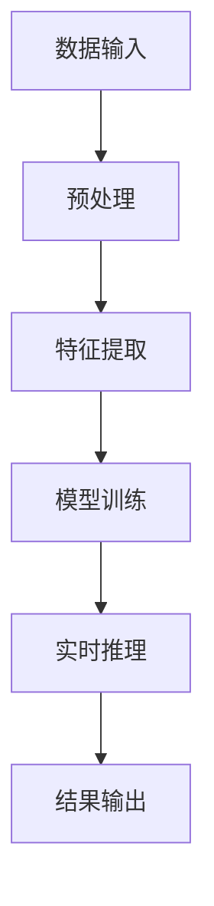
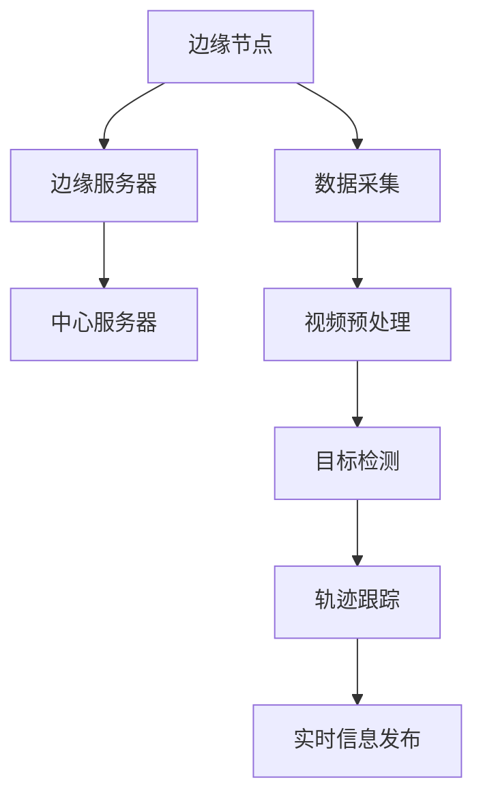
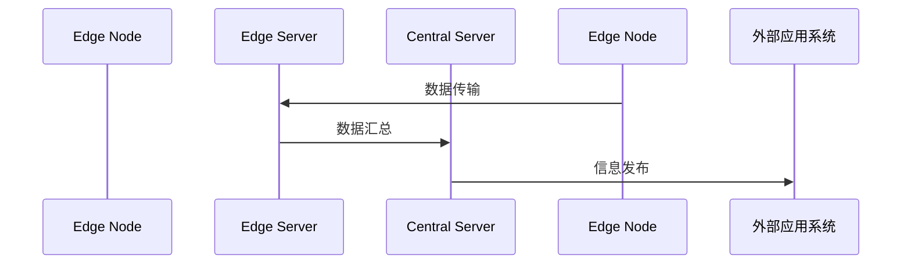

                 

### 边缘计算在实时视频分析中的应用

> 关键词：边缘计算、实时视频分析、AI应用、系统架构、算法原理

> 摘要：
边缘计算作为一种分布式计算架构，正日益受到关注，其在实时视频分析中的应用尤为引人注目。本文旨在深入探讨边缘计算在实时视频分析中的实际应用，从概念介绍、原理讲解、系统设计到项目实战，全面解析边缘计算如何赋能实时视频分析，提升数据处理效率和系统响应速度。

### 一、背景介绍

#### 1.1 边缘计算的概念

边缘计算（Edge Computing）是一种分布式计算架构，旨在将数据处理的任务从传统的集中式数据中心转移到网络的边缘节点，即靠近数据生成源的位置。这种架构的核心思想是通过优化数据处理的路径，减少数据在网络中的传输距离，从而提高数据处理的速度和效率。

#### 1.2 实时视频分析的需求

实时视频分析（Real-Time Video Analysis）是一种利用计算机视觉和机器学习技术对视频流进行实时处理和分析的技术。其主要应用场景包括安全监控、智能交通、工业自动化等。实时视频分析需要处理大量的视频数据，对系统的实时性和准确性提出了极高的要求。

#### 1.3 边缘计算在实时视频分析中的应用背景

随着物联网（IoT）和智能设备的普及，实时视频分析的需求日益增加。然而，传统的集中式计算架构已经无法满足这种需求。边缘计算以其低延迟、高带宽和强大的数据处理能力，为实时视频分析提供了新的解决方案。

### 二、核心概念与联系

#### 2.1 边缘计算的基本原理

边缘计算的基本原理是将计算任务分散到网络的边缘节点，这些节点可以是智能设备、路由器、网关等。边缘节点通过本地处理数据，减少了对中心服务器的依赖，从而降低了网络的负载，提高了系统的响应速度。

#### 2.2 实时视频分析的关键技术

实时视频分析的关键技术包括图像处理、计算机视觉和机器学习。图像处理技术用于对视频数据进行预处理，如去噪、增强等；计算机视觉技术用于实现图像中的目标检测、跟踪和识别；机器学习技术则用于训练模型，提高系统的准确性和鲁棒性。

#### 2.3 边缘计算与实时视频分析的结合点

边缘计算与实时视频分析的结合点在于其可以实现数据的本地处理，减少数据传输的延迟，从而满足实时视频分析的需求。此外，边缘计算还可以通过分布式计算的方式，提高系统的处理能力和鲁棒性。

### 三、算法原理讲解

#### 3.1 常用算法介绍

实时视频分析常用的算法包括特征提取算法、模型训练算法和实时推理算法。特征提取算法用于提取视频数据中的关键特征，如颜色、纹理、形状等；模型训练算法用于训练机器学习模型，提高系统的准确性；实时推理算法则用于在实时场景中对视频流进行预测和分析。

#### 3.2 算法流程图

以下是一个典型的实时视频分析算法流程图，展示了从数据输入到结果输出的整个过程。



#### 3.3 算法数学模型和公式

特征提取算法的数学模型可以表示为：
$$
f(x) = \sum_{i=1}^{n} w_i * x_i
$$
其中，$f(x)$表示特征向量，$w_i$表示权重，$x_i$表示特征值。

模型训练算法的数学模型是基于梯度下降法的：
$$
w_{new} = w_{old} - \alpha * \nabla_w J(w)
$$
其中，$w_{old}$表示旧权重，$w_{new}$表示新权重，$\alpha$表示学习率，$\nabla_w J(w)$表示损失函数关于权重$w$的梯度。

实时推理算法的数学模型是基于神经网络的前向传播：
$$
y = \sigma(\theta^T x)
$$
其中，$y$表示输出，$\sigma$表示激活函数，$\theta$表示权重矩阵，$x$表示输入。

#### 3.4 举例说明

以目标检测算法（如YOLO）为例，其特征提取部分使用了卷积神经网络（CNN），模型训练部分使用了反向传播算法，实时推理部分则直接对视频帧进行分类预测。

### 四、系统分析与架构设计方案

#### 4.1 系统场景介绍

以智能交通系统为例，边缘计算可以用于实时监控交通流量，通过边缘节点对视频数据进行处理，快速识别车辆和行人，提供交通实时信息。

#### 4.2 系统功能设计

系统功能包括数据采集、视频预处理、目标检测、轨迹跟踪和实时信息发布。

#### 4.3 系统架构设计

系统架构包括边缘节点、边缘服务器和中心服务器。边缘节点负责视频数据的采集和处理，边缘服务器负责数据存储和计算资源的调度，中心服务器负责数据汇总和高级分析。



#### 4.4 系统接口设计

系统接口包括边缘节点与边缘服务器之间的数据传输接口，边缘服务器与中心服务器之间的数据汇总接口，以及中心服务器与外部应用系统之间的信息交换接口。

#### 4.5 系统交互

系统交互包括边缘节点的数据采集和预处理，边缘服务器和中心服务器的数据传输和计算调度，以及实时信息发布的过程。



### 五、项目实战

#### 5.1 环境安装

安装所需的软件和工具，包括边缘计算平台（如IoT Edge）、视频处理库（如OpenCV）和机器学习框架（如TensorFlow）。

#### 5.2 系统核心实现

实现边缘节点的视频采集、预处理和目标检测功能，以及边缘服务器和中心服务器的数据传输和计算调度。

#### 5.3 代码应用解读

解析关键代码段，解释其实现原理和功能。

```python
# 边缘节点代码示例
import cv2

# 初始化视频捕捉设备
cap = cv2.VideoCapture(0)

# 循环读取视频帧
while True:
    ret, frame = cap.read()
    if not ret:
        break

    # 对视频帧进行预处理
    processed_frame = preprocess_frame(frame)

    # 使用目标检测模型进行预测
    detections = detector(processed_frame)

    # 显示检测结果
    show_detections(detections, frame)

    # 显示视频帧
    cv2.imshow('Video', frame)

    # 按下ESC键退出循环
    if cv2.waitKey(1) & 0xFF == 27:
        break

# 释放资源
cap.release()
cv2.destroyAllWindows()
```

#### 5.4 实际案例分析

通过实际案例展示边缘计算在实时视频分析中的应用效果，包括数据传输延迟、处理速度和系统准确性。

#### 5.5 项目小结

总结项目实施过程中的经验教训，提出优化建议。

### 六、最佳实践 tips

1. **注意事项**：
   - 确保边缘节点的硬件和软件环境满足系统需求。
   - 注意数据安全和隐私保护。

2. **小结**：
   - 边缘计算在实时视频分析中具有显著优势。
   - 结合实际需求，选择合适的算法和系统架构。

3. **拓展阅读**：
   - 查阅相关文献，了解最新的边缘计算和实时视频分析技术。

---

**作者：AI天才研究院/AI Genius Institute & 禅与计算机程序设计艺术 /Zen And The Art of Computer Programming**

