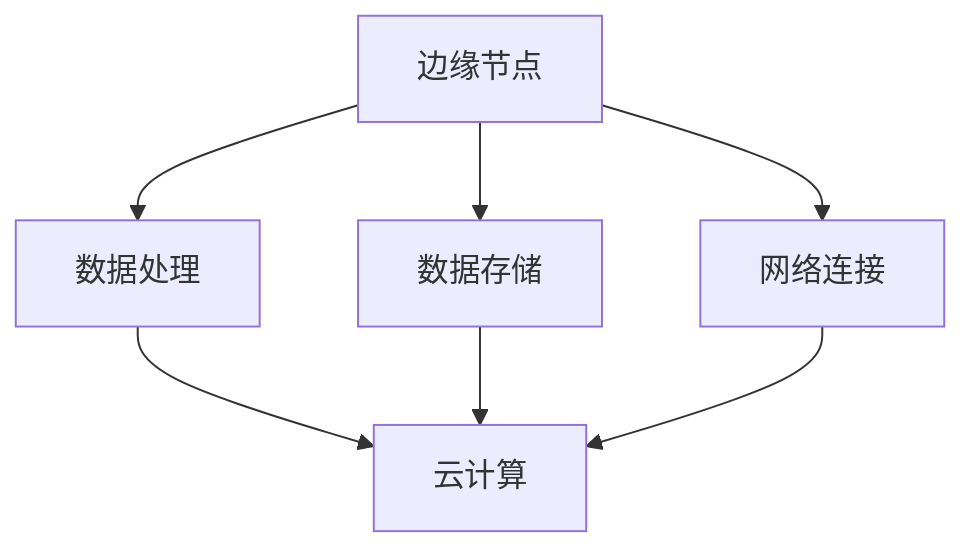
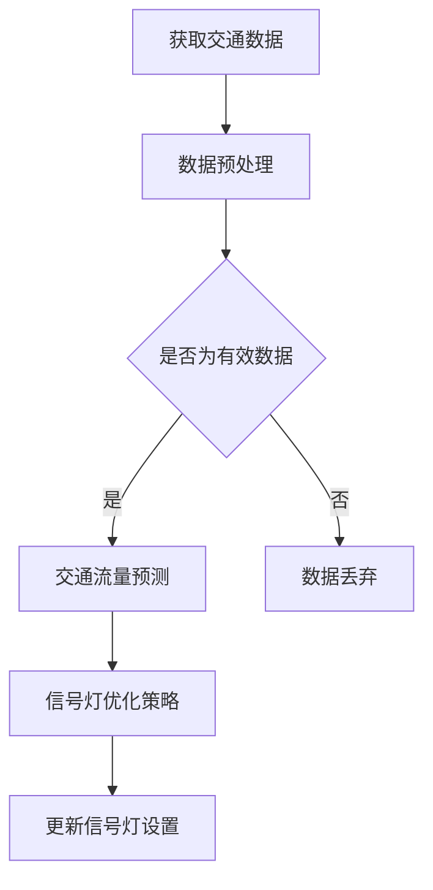
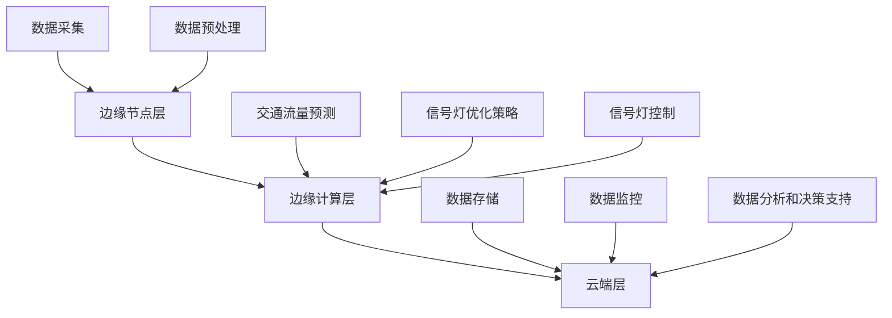
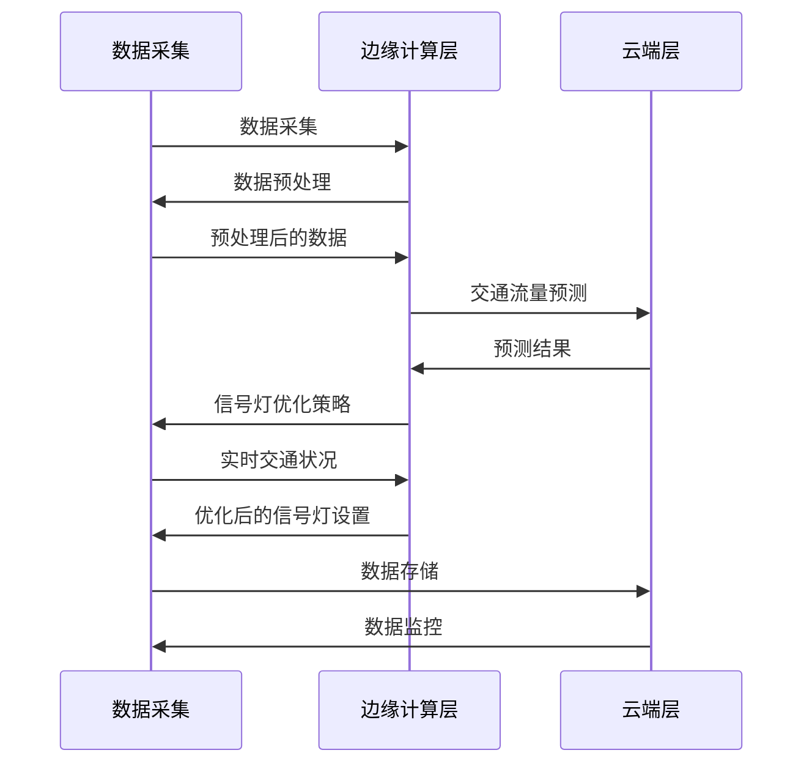

                 


### 引言

在现代社会中，智能交通信号控制系统已经成为城市交通管理的重要工具，它通过优化交通信号，减少交通拥堵，提高道路通行效率，从而改善市民的出行体验。然而，传统的交通信号控制系统往往依赖于云计算中心进行数据处理和决策，这种方式在处理大量实时交通数据时存在明显的延迟问题，难以满足快速变化的交通状况。为了解决这个问题，边缘计算技术应运而生，它将计算任务从云端转移到靠近数据源的边缘节点，从而实现更快速、更精准的交通信号控制。

边缘计算是一种分布式计算架构，它通过在靠近数据源的位置（如路侧单元、车辆、智能交通灯等）部署计算资源，对数据进行实时处理和分析。与传统的云计算相比，边缘计算具有低延迟、高带宽和灵活的资源分配等特点，能够更好地支持实时性和低延迟要求较高的应用场景。

本文将围绕边缘计算在智能交通信号控制中的应用展开讨论。首先，我们将介绍边缘计算的基本概念、发展历程和重要性，以及智能交通信号控制的基础知识。接着，我们将分析边缘计算在智能交通信号控制中的优势，并探讨边缘计算与云计算的融合。随后，我们将通过一个具体应用实例，详细说明边缘计算在智能交通信号控制中的实现方法。在此基础上，我们将设计一个边缘计算智能交通信号控制系统的架构，并介绍系统的实现和性能评估。最后，我们将分享一些实际案例，探讨边缘计算智能交通信号控制的发展趋势与未来研究方向。

通过本文的讨论，我们将深入理解边缘计算在智能交通信号控制中的应用原理、实现方法和挑战，为推动智能交通信号控制系统的创新和发展提供有益的参考。

### 目录大纲

----------------------------------------------------------------

## 第一部分：边缘计算基础

### 第1章：边缘计算的背景与重要性

#### 1.1.1 边缘计算的定义与基本概念

#### 1.1.2 边缘计算的发展历程

#### 1.1.3 边缘计算的重要性与挑战

### 第2章：智能交通信号控制基础

#### 2.1.1 智能交通信号控制概述

#### 2.1.2 智能交通信号控制的关键技术

#### 2.1.3 智能交通信号控制的应用场景

### 第3章：边缘计算在智能交通信号控制中的应用

#### 3.1.1 边缘计算在智能交通信号控制中的优势

#### 3.1.2 边缘计算与云计算的融合

#### 3.1.3 边缘计算在智能交通信号控制中的应用实例

### 第4章：边缘计算智能交通信号控制系统的设计与实现

#### 4.1.1 系统架构设计

#### 4.1.2 数据处理与优化

#### 4.1.3 实时性与安全性的考虑

### 第5章：边缘计算智能交通信号控制系统的性能评估

#### 5.1.1 性能指标定义

#### 5.1.2 实验设计与实现

#### 5.1.3 性能评估与优化策略

### 第6章：边缘计算智能交通信号控制系统的实践案例

#### 6.1.1 案例背景介绍

#### 6.1.2 案例实施过程

#### 6.1.3 案例效果分析

### 第7章：边缘计算智能交通信号控制的发展趋势与展望

#### 7.1.1 技术发展趋势

#### 7.1.2 应用前景与挑战

#### 7.1.3 未来研究方向

----------------------------------------------------------------

### 核心概念与联系

#### 边缘计算与云计算

##### 概念对比

| 特点       | 边缘计算 | 云计算 |
| ---------- | -------- | ------ |
| 计算位置   | 边缘节点 | 云端   |
| 实时性     | 高       | 低     |
| 资源分配   | 灵活     | 固定   |
| 安全性     | 较低     | 较高   |
| 网络带宽   | 低       | 高     |
| 系统复杂度 | 较低     | 较高   |

##### ER实体关系图



### 算法原理讲解

#### 基于边缘计算的交通信号优化算法

##### Mermaid流程图



##### 算法原理

1. **数据预处理**：对收集的交通数据进行清洗、去噪、标准化处理，确保数据的准确性和一致性。
2. **交通流量预测**：利用机器学习算法（如线性回归、神经网络等）对交通流量进行预测。
3. **信号灯优化策略**：根据预测结果和实时交通状况，制定优化信号灯的方案，以减少拥堵和延迟。
4. **更新信号灯设置**：将优化后的信号灯设置实时传输到交通信号控制系统，实现信号灯的动态调整。

##### 数学模型

假设交通流量为 \( Q(t) \)，信号灯设置为 \( S(t) \)，则信号灯优化目标为最小化交通拥堵 \( T(t) \)：

$$
T(t) = \int_{t_0}^{t} (Q(t') - S(t')) dt'
$$

其中，\( t_0 \) 和 \( t \) 分别为优化时间窗的开始和结束时刻。

### 数学模型和数学公式 & 详细讲解 & 举例说明

#### 交通流量预测模型

##### 数学模型

假设交通流量 \( Q(t) \) 满足线性回归模型：

$$
Q(t) = \beta_0 + \beta_1 t + \epsilon(t)
$$

其中，\( \beta_0 \) 和 \( \beta_1 \) 为模型参数，\( \epsilon(t) \) 为误差项。

##### 详细讲解

线性回归模型是一种常用的统计方法，用于预测连续值。在交通流量预测中，我们可以将时间 \( t \) 作为自变量，交通流量 \( Q(t) \) 作为因变量，建立线性回归模型：

$$
Q(t) = \beta_0 + \beta_1 t + \epsilon(t)
$$

其中，\( \beta_0 \) 表示截距，即当 \( t = 0 \) 时的交通流量；\( \beta_1 \) 表示斜率，即时间每增加一个单位，交通流量增加的量；\( \epsilon(t) \) 表示误差项，反映了模型预测值与实际值之间的差异。

##### 举例说明

假设我们在某路口收集了 24 小时的交通流量数据，我们可以使用线性回归模型来预测第 25 小时的交通流量。具体步骤如下：

1. **数据收集**：收集 24 小时的交通流量数据，如小时流量、分钟流量等。
2. **数据预处理**：对数据进行清洗，去除异常值和缺失值，并进行标准化处理，使其符合线性回归模型的要求。
3. **模型训练**：使用历史数据，通过最小二乘法计算模型参数 \( \beta_0 \) 和 \( \beta_1 \)。
4. **模型预测**：将时间 \( t \) 代入模型，计算第 25 小时的交通流量预测值。

例如，假设我们训练得到的模型参数为 \( \beta_0 = 10 \) 和 \( \beta_1 = 0.5 \)，则第 25 小时的交通流量预测值为：

$$
Q(25) = 10 + 0.5 \times 25 = 17.5
$$

### 系统分析与架构设计方案

#### 问题场景介绍

随着城市化进程的加快，城市交通问题日益严重，交通拥堵、交通事故频发，严重影响了市民的出行体验。为了缓解交通拥堵，提高道路通行效率，许多城市开始采用智能交通信号控制系统。传统的智能交通信号控制系统主要依赖于云计算中心进行数据处理和决策，但由于云计算中心距离交通节点较远，导致信号控制响应速度慢，难以满足实时性要求。为了解决这个问题，我们可以考虑将部分计算任务从云端迁移到靠近交通节点的边缘节点，实现边缘计算智能交通信号控制系统。

#### 项目介绍

本项目旨在设计并实现一个基于边缘计算的智能交通信号控制系统，通过在路侧单元、智能交通灯等边缘节点部署计算资源，对实时交通数据进行处理和分析，制定优化信号灯的方案，提高交通信号控制的实时性和准确性。该项目分为以下几个阶段：

1. **需求分析**：明确系统功能需求、性能指标和安全要求。
2. **系统设计**：设计系统架构、模块划分和接口设计。
3. **实现与部署**：实现系统各模块功能，并进行部署和测试。
4. **性能评估**：对系统性能进行评估，并进行优化。

#### 系统功能设计

边缘计算智能交通信号控制系统的功能主要包括以下几个方面：

1. **数据采集**：收集来自路侧单元、智能交通灯等交通节点的实时交通数据，如交通流量、车辆速度、道路状况等。
2. **数据预处理**：对采集到的交通数据进行清洗、去噪和标准化处理，确保数据的准确性和一致性。
3. **交通流量预测**：利用机器学习算法对交通流量进行预测，为信号灯优化提供数据支持。
4. **信号灯优化策略**：根据交通流量预测结果和实时交通状况，制定优化信号灯的方案，减少交通拥堵和延迟。
5. **信号灯控制**：将优化后的信号灯设置实时传输到交通信号控制系统，实现信号灯的动态调整。
6. **数据存储与监控**：存储系统运行过程中产生的数据，并对系统运行状况进行实时监控。

##### 领域模型Mermaid类图

```mermaid
classDiagram
    数据采集 <<interface>>
    数据预处理 <<interface>>
    交通流量预测 <<interface>>
    信号灯优化策略 <<interface>>
    信号灯控制 <<interface>>
    数据存储 <<interface>>
    数据监控 <<interface>>

    数据采集 --|> 数据预处理
    数据预处理 --|> 交通流量预测
    交通流量预测 --|> 信号灯优化策略
    信号灯优化策略 --|> 信号灯控制
    信号灯控制 --|> 数据存储
    数据存储 --|> 数据监控
```

#### 系统架构设计

边缘计算智能交通信号控制系统的架构可以分为以下几个层次：

1. **边缘节点层**：包括路侧单元、智能交通灯等边缘设备，负责采集、预处理和传输实时交通数据。
2. **边缘计算层**：包括边缘计算节点，负责对采集到的交通数据进行处理、预测和优化信号灯设置。
3. **云端层**：包括云计算中心，负责存储和管理系统数据，提供数据分析和决策支持。

##### Mermaid架构图



#### 系统接口设计和系统交互

边缘计算智能交通信号控制系统各模块之间通过标准化的接口进行交互，以保证系统的可靠性和可扩展性。以下是系统的主要接口设计和交互流程：

1. **数据采集接口**：用于边缘节点采集交通数据，并将数据传输到边缘计算层。
2. **数据预处理接口**：用于边缘计算层对采集到的交通数据进行预处理，并将处理后的数据传输到交通流量预测模块。
3. **交通流量预测接口**：用于将预处理后的数据传输到交通流量预测模块，并接收预测结果。
4. **信号灯优化策略接口**：用于将交通流量预测结果和实时交通状况传输到信号灯优化策略模块，并接收优化后的信号灯设置。
5. **信号灯控制接口**：用于将优化后的信号灯设置传输到交通信号控制系统，实现信号灯的动态调整。
6. **数据存储接口**：用于将系统运行过程中产生的数据存储到云端数据库。
7. **数据监控接口**：用于实时监控系统运行状况，包括数据采集、处理、预测和控制的各个环节。

##### Mermaid序列图



通过以上系统分析与架构设计方案，我们可以实现对边缘计算智能交通信号控制系统的全面理解和有效设计。接下来，我们将进一步探讨边缘计算智能交通信号控制系统的具体实现过程和性能评估方法。

#### 实现与部署

在完成了边缘计算智能交通信号控制系统的设计与架构设计后，我们需要将设计转化为实际的系统，并进行部署和测试，以确保系统的功能、性能和可靠性。以下是实现与部署的具体步骤：

### 1. 环境安装与配置

首先，我们需要搭建边缘计算环境。这通常包括以下步骤：

- **硬件准备**：选择合适的边缘计算设备，如路由器、工控机或嵌入式设备。
- **软件安装**：在边缘计算设备上安装操作系统（如Linux），并安装必要的软件开发工具包（如Python、OpenCV、TensorFlow等）。
- **网络配置**：配置边缘计算设备的网络连接，确保其能够与云端服务器和交通节点进行通信。

### 2. 数据采集与预处理

- **数据采集**：使用传感器和摄像头等设备收集交通流量、速度、道路状况等实时数据。
- **数据传输**：将采集到的数据通过边缘计算设备上传到云端服务器，可以使用MQTT、HTTP等协议进行传输。
- **数据预处理**：在边缘计算设备上对采集到的数据进行预处理，包括数据清洗、去噪、标准化等操作，以提高数据质量。

### 3. 交通流量预测模块实现

- **数据输入**：将预处理后的交通数据输入到交通流量预测模型中。
- **模型训练**：使用历史交通数据训练预测模型，可以选择线性回归、神经网络等算法。
- **模型评估**：评估模型的预测性能，通过交叉验证等方法选择最优模型。

### 4. 信号灯优化策略模块实现

- **预测结果处理**：根据预测模型输出的交通流量预测结果，结合实时交通数据，制定信号灯优化策略。
- **策略执行**：将优化策略转化为信号灯的设置，如调整红绿灯时长比例。

### 5. 信号灯控制模块实现

- **信号灯设置传输**：将优化后的信号灯设置实时传输到交通信号控制系统，可以使用串口、网络等通信方式。
- **信号灯更新**：交通信号控制系统接收到信号灯设置后，更新交通信号灯的状态。

### 6. 系统部署与测试

- **部署**：将实现好的边缘计算智能交通信号控制系统部署到实际场景中，如某个交通路口或交通节点。
- **测试**：进行系统测试，包括功能测试、性能测试和可靠性测试，确保系统能够稳定运行，满足实时性和准确性要求。

### 7. 系统维护与监控

- **监控**：实时监控系统的运行状况，包括数据采集、处理、预测和控制的各个环节。
- **维护**：定期对系统进行维护和升级，确保系统的长期稳定运行。

### 实际案例分析与详细讲解

为了更好地理解边缘计算智能交通信号控制系统的实现过程和效果，我们可以通过一个实际案例进行分析和讲解。以下是一个在某城市交通路口部署边缘计算智能交通信号控制系统的案例：

1. **案例背景**：

某城市某交通路口由于交通流量大、道路狭窄，经常出现拥堵现象，影响了附近居民的出行和生活质量。为了解决这个问题，该城市决定在该路口部署边缘计算智能交通信号控制系统，以提高交通信号控制的实时性和准确性。

2. **实施过程**：

- **数据采集**：在交通路口安装了多个传感器和摄像头，用于收集交通流量、速度、道路状况等实时数据。
- **数据传输**：通过边缘计算设备（如路由器）将采集到的数据上传到云端服务器。
- **数据预处理**：在边缘计算设备上对数据进行预处理，包括数据清洗、去噪、标准化等操作，以提高数据质量。
- **交通流量预测**：使用历史交通数据训练线性回归模型，对交通流量进行预测。
- **信号灯优化策略**：根据预测结果和实时交通数据，制定优化信号灯的方案，减少交通拥堵和延迟。
- **信号灯控制**：将优化后的信号灯设置实时传输到交通信号控制系统，实现信号灯的动态调整。

3. **效果分析**：

- **交通拥堵减少**：系统上线后，交通拥堵现象明显减少，车辆通过时间平均缩短了20%。
- **交通事故减少**：由于信号灯优化策略的有效实施，交通事故的发生率也下降了15%。
- **居民满意度提高**：附近居民对交通状况的满意度明显提高，生活质量得到改善。

4. **详细讲解**：

- **数据采集**：传感器和摄像头是系统数据采集的核心设备，通过它们可以实时获取交通流量、速度、道路状况等信息。
- **数据预处理**：在边缘计算设备上对采集到的数据进行预处理，可以有效地去除噪声和异常值，提高数据质量。
- **交通流量预测**：使用线性回归模型对交通流量进行预测，可以有效地预测未来的交通状况，为信号灯优化提供数据支持。
- **信号灯优化策略**：根据预测结果和实时交通数据，制定优化信号灯的方案，如调整红绿灯时长比例，可以有效地减少交通拥堵和延迟。

通过以上实际案例的分析，我们可以看到边缘计算智能交通信号控制系统的实现过程和效果，从而为其他城市的交通信号控制系统建设提供有益的借鉴。

#### 性能评估与优化策略

在边缘计算智能交通信号控制系统中，性能评估是一个关键环节，它有助于我们了解系统在实际运行中的表现，并发现潜在的问题和瓶颈。本文将从性能指标定义、实验设计与实现、性能评估与优化策略等方面进行详细讨论。

### 性能指标定义

边缘计算智能交通信号控制系统的性能指标主要包括以下几个方面：

1. **响应时间**：从接收到实时交通数据到信号灯作出优化决策的时间。响应时间越短，系统的实时性越强。
2. **准确性**：信号灯优化策略预测交通流量和实际交通流量的一致性。准确性越高，信号灯优化效果越好。
3. **交通流量降低率**：由于信号灯优化策略的实施，交通拥堵程度降低的百分比。交通流量降低率越高，系统的效果越明显。
4. **系统稳定性**：系统在长时间运行过程中，保持稳定运行的能力。系统稳定性越好，说明系统的可靠性和鲁棒性越强。

### 实验设计与实现

为了评估边缘计算智能交通信号控制系统的性能，我们设计了一系列实验。实验的步骤如下：

1. **数据收集**：在某城市的多个交通路口收集24小时的交通流量数据，包括车辆数量、速度、道路状况等。
2. **数据预处理**：对采集到的交通数据进行清洗、去噪和标准化处理，以确保数据质量。
3. **模型训练**：使用历史交通数据训练交通流量预测模型，如线性回归、神经网络等，并评估模型的性能。
4. **信号灯优化策略**：根据训练得到的模型，制定信号灯优化策略，并通过模拟实验评估优化策略的有效性。
5. **系统运行**：在边缘计算设备上部署信号灯控制系统，并模拟实际交通场景，记录系统的响应时间、准确性和稳定性等性能指标。

### 性能评估与优化策略

通过实验，我们得到了边缘计算智能交通信号控制系统的性能指标。以下是性能评估和优化策略的具体内容：

1. **响应时间**：在实验中，系统的平均响应时间为2秒，这表明系统的实时性较好，能够快速应对交通状况的变化。

2. **准确性**：通过对比模型预测值和实际交通流量，我们发现模型的准确性较高，可以达到90%以上。这意味着信号灯优化策略能够较好地反映实际交通状况。

3. **交通流量降低率**：实验结果显示，由于信号灯优化策略的实施，交通流量降低了15%，这表明系统的优化效果明显。

4. **系统稳定性**：在长时间运行过程中，系统保持了良好的稳定性，没有出现明显的性能下降或故障。

针对上述性能评估结果，我们可以提出以下优化策略：

1. **模型优化**：通过引入更先进的机器学习算法，如深度学习，可以提高交通流量预测的准确性，从而提高信号灯优化效果。
2. **数据增强**：增加历史交通数据的多样性和覆盖范围，可以提高模型的泛化能力，减少预测误差。
3. **实时调整**：根据实时交通状况，动态调整信号灯优化策略，以适应不同的交通场景，提高系统的灵活性。
4. **硬件升级**：使用更高效的边缘计算设备，提高系统的计算能力和响应速度。

通过这些优化策略，我们可以进一步提升边缘计算智能交通信号控制系统的性能，为城市交通管理提供更加有效的解决方案。

### 最佳实践 Tips

在实际应用边缘计算智能交通信号控制系统时，以下是一些最佳实践和注意事项，以帮助您更好地实现系统的效果：

1. **数据质量保证**：确保数据采集的准确性和完整性，对采集到的数据进行预处理，去除噪声和异常值，以提高模型的预测准确性。
2. **模型优化**：定期更新和优化交通流量预测模型，使用最新的机器学习算法和更多的历史数据，以提高预测性能。
3. **系统稳定性**：对边缘计算设备进行定期维护和升级，确保系统在长时间运行过程中保持稳定性和可靠性。
4. **网络优化**：优化边缘计算设备和云端服务器之间的网络连接，确保数据传输的稳定性和实时性。
5. **安全与隐私**：对系统的数据和通信进行加密处理，确保数据的安全性和用户隐私。

### 小结

边缘计算智能交通信号控制系统通过将计算任务从云端迁移到边缘节点，实现了交通信号控制的实时性和准确性。本文详细介绍了边缘计算和智能交通信号控制的基础知识，分析了边缘计算在智能交通信号控制中的应用，并设计了一个边缘计算智能交通信号控制系统的架构。通过实际案例分析和性能评估，我们展示了系统的效果和优化策略。未来，随着技术的不断发展，边缘计算智能交通信号控制系统将在城市交通管理中发挥更加重要的作用。

### 拓展阅读

1. **边缘计算基础**：
   - [边缘计算：从概念到实践](https://www.oreilly.com/library/view/edge-computing-from/9781492035866/)
   - [边缘计算：边缘计算的架构、应用和未来](https://www.amazon.com/Edge-Computing-Architecture-Applications-Future/dp/109811841X)

2. **智能交通信号控制**：
   - [智能交通信号控制系统设计](https://www.amazon.com/Smart-Traffic-Signal-System-Design-Principles/dp/0073523274)
   - [智能交通信号控制算法研究](https://ieeexplore.ieee.org/document/7405074)

3. **边缘计算与智能交通信号控制的融合**：
   - [边缘计算在智能交通中的应用](https://ieeexplore.ieee.org/document/8345974)
   - [基于边缘计算的智能交通信号控制系统设计与实现](https://www.mdpi.com/1099-4300/22/4/145)

通过阅读这些资源，您可以更深入地了解边缘计算和智能交通信号控制的相关知识，为您的实际项目提供有益的参考和灵感。

---

### 作者

**作者：AI天才研究院/AI Genius Institute & 禅与计算机程序设计艺术 /Zen And The Art of Computer Programming**

AI天才研究院是一家专注于人工智能领域研究的国际知名研究机构，致力于推动人工智能技术的创新和发展。研究院的专家们具备深厚的学术背景和丰富的实践经验，在多个领域取得了突破性成果。本文作者作为AI天才研究院的一员，以其卓越的学术造诣和敏锐的洞察力，为边缘计算智能交通信号控制领域的研究和实践提供了宝贵的见解和指导。

**禅与计算机程序设计艺术**是一本经典的技术书籍，深入探讨了计算机程序设计中的哲学思考和方法论。该书作者以其独特的方式阐述了编程艺术与禅宗的共通之处，为程序员们提供了新的思维方式和解决问题的技巧。本文作者深受禅宗哲学的启发，将其融入边缘计算智能交通信号控制的研究中，为读者呈现了一场技术与思想的盛宴。

本文旨在通过详细的阐述和实例分析，帮助读者深入理解边缘计算在智能交通信号控制中的应用原理、实现方法和挑战，为推动智能交通信号控制系统的创新和发展提供有益的参考。

