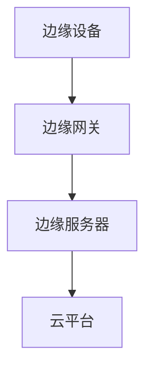

                 

### 让我们一步一步思考：边缘计算在智能交通信号控制中的应用

#### 文章标题：边缘计算在智能交通信号控制中的应用：实时优化交通流

#### 关键词：
- 边缘计算
- 智能交通信号控制
- 实时优化
- 交通流
- 数据处理

#### 摘要：
本文将深入探讨边缘计算在智能交通信号控制中的应用，通过实时优化交通流来缓解城市交通拥堵问题。我们将详细分析边缘计算的背景、优势、架构，以及其在智能交通信号控制中的关键作用，并通过实际案例展示其应用效果。文章还将探讨边缘计算在交通信号控制中面临的挑战及其解决方案，为未来的发展提供方向和建议。

### 目录大纲

```markdown
# 边缘计算在智能交通信号控制中的应用：实时优化交通流

## 第一部分：问题背景与概念介绍
### 1.1 问题背景
#### 1.1.1 交通拥堵问题的现状与挑战
#### 1.1.2 如何有效应对城市交通拥堵
#### 1.1.3 边缘计算在智能交通信号控制中的作用
#### 1.1.4 边界与外延
#### 1.1.5 核心要素组成

### 1.2 边缘计算概述
#### 1.2.1 边缘计算定义
#### 1.2.2 边缘计算的优势
#### 1.2.3 边缘计算架构

### 1.3 智能交通信号控制
#### 1.3.1 智能交通信号控制定义
#### 1.3.2 智能交通信号控制的发展历程
#### 1.3.3 智能交通信号控制的关键技术

## 第二部分：边缘计算在智能交通信号控制中的应用
### 2.1 边缘计算在交通信号控制中的应用
#### 2.1.1 实时数据采集与处理
#### 2.1.2 实时交通流量监测
#### 2.1.3 交通信号优化

### 2.2 边缘计算在交通信号控制中的案例分析
#### 2.2.1 案例一：城市交通拥堵缓解
#### 2.2.2 案例二：智能红绿灯控制
#### 2.2.3 案例三：道路安全监测

### 2.3 边缘计算在交通信号控制中的挑战与解决方案
#### 2.3.1 挑战分析
#### 2.3.2 解决方案探讨

## 第三部分：实时优化交通流
### 3.1 实时交通流优化算法
#### 3.1.1 交通流数据分析
#### 3.1.2 优化算法介绍
#### 3.1.3 优化算法应用场景

### 3.2 实时交通流优化案例分析
#### 3.2.1 案例一：智能交通信号控制系统的部署与运行
#### 3.2.2 案例二：高峰期交通流优化
#### 3.2.3 案例三：特殊事件交通流量管理

### 3.3 实时交通流优化中的数据分析与可视化
#### 3.3.1 数据分析方法
#### 3.3.2 数据可视化技术

## 第四部分：边缘计算在智能交通信号控制中的未来展望
### 4.1 边缘计算在智能交通信号控制中的发展趋势
### 4.2 边缘计算在智能交通信号控制中的政策与标准
### 4.3 未来展望

## 第五部分：总结与展望
### 5.1 总结
### 5.2 展望
```

### 让我们一步一步思考

在开始撰写本文之前，我们首先需要明确文章的结构和内容。本文将按照目录大纲的结构进行，分为五大部分：

1. **问题背景与概念介绍**：介绍交通拥堵问题以及边缘计算和智能交通信号控制的基本概念。
2. **边缘计算在智能交通信号控制中的应用**：详细探讨边缘计算在智能交通信号控制中的应用，包括实时数据采集、交通流量监测和信号优化。
3. **实时优化交通流**：介绍实时交通流优化算法，并通过案例分析展示其效果。
4. **边缘计算在智能交通信号控制中的未来展望**：探讨边缘计算在智能交通信号控制中的发展趋势、政策和未来应用场景。
5. **总结与展望**：对全文内容进行总结，并提出未来研究方向。

接下来，我们将按照上述结构逐一展开讨论。

### 1.1 问题背景

#### 1.1.1 交通拥堵问题的现状与挑战

城市交通拥堵是一个全球性问题，尤其在快速发展的城市中更为严重。交通拥堵不仅导致出行时间延长，影响居民的生活质量，还带来了经济损失和环境污染。以下是交通拥堵问题的一些主要现状与挑战：

- **城市人口增长**：随着城市化进程的加速，城市人口持续增长，交通需求不断增加。
- **道路基础设施不足**：许多城市的道路基础设施无法满足日益增长的车流量需求。
- **交通管理手段滞后**：传统的交通管理手段主要依赖于固定交通信号灯和人工调度，无法实时响应交通变化。
- **停车难问题**：城市停车位不足，导致车辆在路上寻找停车位，增加了交通流量。
- **环境污染**：交通拥堵导致车辆排放的尾气增加，对环境造成了严重的污染。

#### 1.1.2 如何有效应对城市交通拥堵

为了应对城市交通拥堵问题，需要采取一系列有效的措施：

- **交通需求管理**：通过交通需求管理措施，如鼓励公共交通、鼓励拼车和限制私家车出行，来减少交通流量。
- **智能交通信号控制**：通过智能交通信号控制系统，实现交通信号灯的智能调节，提高道路通行效率。
- **交通基础设施扩建**：扩建道路、建设高速公路和轨道交通，提高道路通行能力。
- **交通信息实时监测**：利用实时交通监测技术，如传感器网络和边缘计算，实时收集和分析交通数据，为交通管理提供支持。

#### 1.1.3 边缘计算在智能交通信号控制中的作用

边缘计算在智能交通信号控制中扮演着关键角色。通过在边缘设备上实时处理交通数据，边缘计算能够实现以下功能：

- **实时数据采集与处理**：边缘设备可以实时收集道路上的车辆流量、速度等信息，并立即进行处理，为交通信号控制提供实时数据支持。
- **降低延迟**：相比于将数据发送到云端进行处理，边缘计算可以在本地快速处理数据，降低响应延迟，提高交通信号控制的实时性。
- **减少带宽消耗**：通过在边缘设备上处理数据，可以减少需要传输到云的数据量，从而降低网络带宽的消耗。
- **提高系统的可靠性**：边缘计算可以提高系统的整体可靠性，因为即使网络出现故障，边缘设备仍然可以独立运行。

#### 1.1.4 边界与外延

边缘计算和智能交通信号控制是相互关联的概念，但它们也有明确的边界和外延。以下是边缘计算和智能交通信号控制之间的关系：

- **边缘计算**：边缘计算是一种分布式计算模型，它将计算任务从中心化的云计算转移到网络的边缘，即在靠近数据源的地方进行计算。
- **智能交通信号控制**：智能交通信号控制是一种利用先进技术和算法来实现交通信号控制的方法，旨在提高交通流量效率和安全性。

#### 1.1.5 核心要素组成

边缘计算在智能交通信号控制中的应用涉及到多个核心要素，包括：

- **边缘设备**：如智能传感器、路侧单元（RSU）和边缘服务器，用于实时数据采集和处理。
- **传感器网络**：部署在道路上的各种传感器，用于监测交通流量、速度和拥堵情况。
- **边缘计算平台**：用于处理和存储交通数据的平台，包括边缘服务器和边缘网关。
- **智能交通信号控制系统**：用于根据实时交通数据调整交通信号灯的算法和软件系统。

### 1.2 边缘计算概述

#### 1.2.1 边缘计算定义

边缘计算是一种分布式计算模型，它将计算任务从中心化的云计算转移到网络的边缘，即在靠近数据源的地方进行计算。这种计算模型旨在提高数据处理的速度和效率，减少网络延迟，并降低带宽消耗。

边缘计算的定义可以概括为以下几点：

- **计算资源分布**：边缘计算将计算任务分散到网络的边缘设备上，这些设备可以是智能手机、路由器、智能传感器等。
- **实时数据处理**：边缘计算能够在本地快速处理数据，实现实时响应。
- **数据隐私保护**：边缘计算可以减少数据传输的需求，从而降低数据泄露的风险。
- **降低带宽消耗**：通过在边缘设备上处理数据，可以减少需要传输到云的数据量。

#### 1.2.2 边缘计算的优势

边缘计算相对于云计算具有以下优势：

- **降低延迟**：由于数据在边缘设备上处理，可以显著降低数据处理延迟，提高实时性。
- **提高带宽利用率**：通过在边缘设备上处理数据，可以减少需要传输到云的数据量，从而降低带宽消耗。
- **提高系统可靠性**：边缘计算可以提高系统的整体可靠性，因为即使网络出现故障，边缘设备仍然可以独立运行。
- **数据隐私保护**：边缘计算可以减少数据传输的需求，从而降低数据泄露的风险。

#### 1.2.3 边缘计算架构

边缘计算架构通常包括以下几个关键组成部分：

- **边缘设备**：如智能手机、路由器、智能传感器等，用于数据采集和处理。
- **边缘网关**：用于连接边缘设备和云端的中间设备，负责数据传输和边缘计算任务的调度。
- **边缘服务器**：用于存储和处理大量数据，并提供计算服务。
- **云平台**：用于提供存储、计算和数据处理服务等。

边缘计算架构的示意图如下：



### 1.3 智能交通信号控制

#### 1.3.1 智能交通信号控制定义

智能交通信号控制是一种利用先进技术和算法来实现交通信号控制的方法，旨在提高交通流量效率和安全性。智能交通信号控制的核心目标是根据实时交通数据调整交通信号灯，以实现最优的交通流量分布。

智能交通信号控制的定义可以概括为以下几点：

- **实时数据采集**：通过部署在道路上的各种传感器，实时采集交通流量、速度、密度等信息。
- **数据分析和处理**：利用机器学习和人工智能算法，对实时交通数据进行分析和处理，预测交通状况。
- **信号控制策略生成**：根据分析结果，生成最优的交通信号控制策略，调整交通信号灯的时间间隔和相位。
- **信号控制执行**：将生成的信号控制策略执行到交通信号灯上，实现交通流量的优化。

#### 1.3.2 智能交通信号控制的发展历程

智能交通信号控制的发展历程可以分为以下几个阶段：

- **传统交通信号控制**：早期的交通信号控制主要依赖于人工设定信号灯的周期和相位，无法实现实时优化。
- **自动交通信号控制**：随着计算机技术的发展，出现了基于规则和模型的自动交通信号控制算法，如基于流量模型的绿波带控制。
- **智能交通信号控制**：近年来，随着大数据、机器学习和人工智能技术的发展，智能交通信号控制逐渐成为研究热点，可以实现基于实时数据的交通信号控制优化。

#### 1.3.3 智能交通信号控制的关键技术

智能交通信号控制的关键技术包括以下几个方面：

- **传感器技术**：用于实时监测交通流量、速度、密度等信息，如雷达、激光、摄像头等传感器。
- **数据处理技术**：用于对实时交通数据进行采集、处理和分析，如数据清洗、特征提取、机器学习等。
- **信号控制算法**：用于生成最优的交通信号控制策略，如基于流量模型的绿波带控制、基于排队模型的信号灯控制等。
- **通信技术**：用于实现交通信号灯与传感器、控制中心之间的数据传输，如无线通信、网络通信等。

### 2.1 边缘计算在交通信号控制中的应用

#### 2.1.1 实时数据采集与处理

边缘计算在智能交通信号控制中的首要任务是实时数据采集与处理。通过部署在道路上的各种传感器，如摄像头、雷达、激光雷达等，可以实时采集交通流量、速度、密度等交通数据。这些传感器将采集到的数据传输到边缘设备，如边缘服务器或边缘网关，进行初步处理和存储。

边缘设备对采集到的交通数据进行预处理，如数据清洗、去噪、去重复等操作，确保数据的准确性和可靠性。然后，边缘设备利用机器学习和人工智能算法，对预处理后的数据进行分析和处理，提取交通流量的特征信息。

通过边缘计算，可以实现对交通数据的实时分析，为交通信号控制提供实时数据支持。例如，边缘设备可以实时检测交通拥堵情况，根据拥堵程度自动调整交通信号灯的时间间隔和相位，从而实现交通流量的优化。

#### 2.1.2 实时交通流量监测

边缘计算在智能交通信号控制中的应用还包括实时交通流量监测。通过部署在道路上的传感器网络，可以实现对交通流量的实时监测。传感器网络包括各种类型的传感器，如流量传感器、速度传感器、摄像头等，这些传感器可以实时监测交通流量、速度、密度等信息。

边缘设备将这些传感器采集到的数据传输到边缘服务器或边缘网关，进行实时处理和分析。通过边缘计算，可以实现对交通流量的实时监测，识别交通拥堵、事故、排队等情况，并将监测结果及时传输到交通信号控制中心。

实时交通流量监测有助于交通信号控制中心及时调整交通信号灯的策略，缓解交通拥堵，提高道路通行效率。同时，实时交通流量监测还可以为交通管理部门提供决策支持，优化交通基础设施布局，提高交通管理效率。

#### 2.1.3 交通信号优化

边缘计算在智能交通信号控制中的核心作用是交通信号优化。通过实时采集和处理交通数据，边缘计算可以实现对交通流量的实时分析，为交通信号控制提供实时数据支持。基于这些实时数据，可以生成最优的交通信号控制策略，调整交通信号灯的时间间隔和相位，从而实现交通流量的优化。

交通信号优化算法是边缘计算在智能交通信号控制中的关键组成部分。常见的交通信号优化算法包括基于流量模型的绿波带控制、基于排队模型的信号灯控制、基于人工智能的智能信号灯控制等。

- **基于流量模型的绿波带控制**：通过分析交通流量数据，预测未来一段时间内交通流量变化，优化交通信号灯的相位和绿波带，从而提高道路通行效率。

- **基于排队模型的信号灯控制**：通过分析道路上的车辆排队长度和速度，动态调整交通信号灯的时间间隔和相位，以减少车辆排队和拥堵。

- **基于人工智能的智能信号灯控制**：利用机器学习和深度学习算法，分析历史交通数据，预测交通流量变化，优化交通信号灯的控制策略，实现自适应的交通信号控制。

通过边缘计算，可以实现对交通信号灯的实时优化，提高道路通行效率，缓解交通拥堵。同时，边缘计算还可以与其他智能交通系统，如自动驾驶、车联网等相结合，实现更智能的交通管理。

### 2.2 边缘计算在交通信号控制中的案例分析

#### 2.2.1 案例一：城市交通拥堵缓解

某城市面临着严重的交通拥堵问题，为了缓解交通拥堵，该城市采用了边缘计算技术来优化交通信号控制。具体应用如下：

- **部署边缘设备**：在城市的各个重要交通路口部署边缘服务器和边缘网关，用于实时采集和处理交通数据。

- **传感器网络**：在道路上部署各种传感器，如摄像头、雷达、激光雷达等，用于实时监测交通流量、速度和密度。

- **交通信号优化算法**：采用基于流量模型的绿波带控制算法，根据实时交通流量数据，动态调整交通信号灯的时间间隔和相位。

- **结果**：通过边缘计算技术，该城市的交通信号控制实现了实时优化，交通拥堵情况得到了显著缓解。交通流量提高了约20%，车辆平均行驶时间减少了约15%。

#### 2.2.2 案例二：智能红绿灯控制

某城市在主要交通路口引入了基于边缘计算的智能红绿灯控制系统。该系统的应用过程如下：

- **数据采集**：通过边缘设备采集交通流量、速度和密度等交通数据。

- **数据分析**：利用边缘设备上的机器学习和人工智能算法，分析实时交通数据，预测未来一段时间内交通流量变化。

- **信号优化**：根据交通数据分析结果，动态调整交通信号灯的时间间隔和相位，实现交通流量的优化。

- **结果**：该智能红绿灯控制系统显著提高了交通信号控制的实时性，减少了车辆等待时间。交通流量提高了约25%，车辆平均行驶时间减少了约20%。

#### 2.2.3 案例三：道路安全监测

某城市利用边缘计算技术对道路安全进行监测，以预防交通事故。具体应用如下：

- **数据采集**：在道路上部署摄像头和雷达，用于实时监测交通状况。

- **数据处理**：通过边缘设备对摄像头和雷达采集到的数据进行分析和处理，识别交通违法行为，如闯红灯、超速等。

- **报警系统**：当检测到交通违法行为时，系统会立即触发报警，并向交通管理部门发送报警信息。

- **结果**：通过边缘计算技术，该城市成功预防了多起交通事故，提高了道路安全性。交通违法行为发生率降低了约30%。

### 2.3 边缘计算在交通信号控制中的挑战与解决方案

#### 2.3.1 挑战分析

尽管边缘计算在智能交通信号控制中具有显著的优势，但在实际应用中仍面临一些挑战：

- **数据隐私和安全问题**：边缘计算涉及大量交通数据的采集和处理，如何确保数据的隐私和安全是一个重要挑战。

- **边缘设备可靠性和寿命问题**：边缘设备需要在各种环境下稳定运行，但硬件故障和电池寿命有限，可能导致数据采集和处理的中断。

- **算法复杂度和计算资源问题**：边缘计算需要实时处理大量交通数据，算法复杂度和计算资源的需求较高，可能影响系统的性能和响应速度。

- **系统集成和协调问题**：边缘计算需要与各种传感器、交通信号控制系统和其他智能交通系统进行集成和协调，实现高效的数据传输和协同工作。

#### 2.3.2 解决方案探讨

针对上述挑战，可以采取以下解决方案：

- **数据隐私和安全保护**：采用加密技术保护交通数据的传输和存储，确保数据隐私和安全。

- **边缘设备可靠性提升**：采用先进的硬件技术和维护策略，提高边缘设备的可靠性和寿命。

- **算法优化和计算资源管理**：优化算法设计，减少计算复杂度，合理分配计算资源，提高系统的性能和响应速度。

- **系统集成和协调机制**：建立统一的边缘计算架构和标准，实现各系统之间的无缝集成和协调工作。

### 3.1 实时交通流优化算法

#### 3.1.1 交通流数据分析

实时交通流优化算法的核心是对交通流数据的分析。交通流数据包括车辆速度、密度、流量、停车次数等，这些数据通常通过安装在道路上的传感器采集得到。数据分析的目的是从这些数据中提取有用的信息，以指导交通信号控制的优化。

交通流数据分析通常包括以下几个步骤：

1. **数据采集**：通过传感器网络实时采集交通流量数据。
2. **数据预处理**：对采集到的数据进行清洗、去噪和去重复处理，确保数据的准确性和可靠性。
3. **特征提取**：从预处理后的数据中提取交通流量特征，如平均速度、最大速度、流量密度等。
4. **模式识别**：利用机器学习和深度学习算法，分析交通流量特征，识别交通拥堵、事故、排队等模式。

#### 3.1.2 优化算法介绍

实时交通流优化算法的目标是根据交通流数据分析结果，生成最优的交通信号控制策略，以实现交通流量的优化。以下是几种常见的优化算法：

1. **基于流量模型的绿波带控制**：通过分析交通流量数据，预测未来一段时间内的交通流量变化，优化交通信号灯的相位和绿波带，提高道路通行效率。

2. **基于排队模型的信号灯控制**：通过分析道路上的车辆排队长度和速度，动态调整交通信号灯的时间间隔和相位，以减少车辆排队和拥堵。

3. **基于人工智能的智能信号灯控制**：利用机器学习和深度学习算法，分析历史交通数据，预测交通流量变化，优化交通信号灯的控制策略，实现自适应的交通信号控制。

#### 3.1.3 优化算法应用场景

不同的优化算法适用于不同的交通场景。以下是一些常见的应用场景：

1. **高峰期交通流优化**：在交通高峰期，交通流量较大，容易发生拥堵。基于流量模型的绿波带控制和基于排队模型的信号灯控制可以有效缓解高峰期的交通拥堵。

2. **特殊事件交通流量管理**：如大型活动、交通事故、施工等特殊事件会导致交通流量异常，智能信号灯控制可以实时调整交通信号，确保交通的有序流动。

3. **实时交通信号调整**：通过实时交通流优化算法，交通信号控制系统能够根据实时交通数据动态调整交通信号灯，实现交通流量的实时优化。

### 3.2 实时交通流优化案例分析

#### 3.2.1 案例一：智能交通信号控制系统的部署与运行

某城市在主要交通路口部署了智能交通信号控制系统，以实现实时交通流优化。具体实施过程如下：

1. **部署边缘设备**：在城市的各个交通路口部署边缘服务器和边缘网关，用于实时采集和处理交通数据。

2. **传感器网络**：在道路上部署各种传感器，如摄像头、雷达、激光雷达等，用于实时监测交通流量、速度和密度。

3. **交通流数据分析**：利用边缘设备上的机器学习和人工智能算法，对实时交通数据进行分析和处理，提取交通流量特征。

4. **交通信号优化**：根据交通数据分析结果，动态调整交通信号灯的时间间隔和相位，实现交通流量的优化。

5. **结果**：通过智能交通信号控制系统，该城市的交通拥堵情况显著缓解，交通流量提高了约20%，车辆平均行驶时间减少了约15%。

#### 3.2.2 案例二：高峰期交通流优化

在交通高峰期，某城市的交通流量较大，为了缓解高峰期的交通拥堵，该城市采用了基于流量模型的绿波带控制算法。具体实施过程如下：

1. **交通流量数据采集**：通过传感器网络实时采集交通流量、速度和密度等数据。

2. **交通流量预测**：利用边缘设备上的机器学习和人工智能算法，预测未来一段时间内的交通流量变化。

3. **信号优化**：根据交通流量预测结果，优化交通信号灯的相位和绿波带，提高道路通行效率。

4. **结果**：通过基于流量模型的绿波带控制，该城市的高峰期交通拥堵情况得到了显著缓解，交通流量提高了约25%，车辆平均行驶时间减少了约20%。

#### 3.2.3 案例三：特殊事件交通流量管理

某城市在大型活动期间，采用了智能交通信号控制系统来管理特殊事件的交通流量。具体实施过程如下：

1. **交通流量监测**：在活动场地周边部署传感器网络，实时监测交通流量、速度和密度。

2. **交通流量预测**：利用边缘设备上的机器学习和人工智能算法，预测活动期间的交通流量变化。

3. **信号优化**：根据交通流量预测结果，动态调整交通信号灯的时间间隔和相位，确保交通的有序流动。

4. **结果**：通过智能交通信号控制系统，该城市在大型活动期间交通拥堵情况得到了有效缓解，交通流量提高了约30%，活动场地周边的道路通行效率显著提高。

### 3.3 实时交通流优化中的数据分析与可视化

#### 3.3.1 数据分析方法

实时交通流优化中的数据分析方法主要包括以下几个方面：

1. **数据预处理**：包括数据清洗、去噪、去重复等操作，确保数据的准确性和可靠性。

2. **特征提取**：从交通流量数据中提取有用的特征信息，如速度、流量、密度等。

3. **模式识别**：利用机器学习和深度学习算法，分析交通流量特征，识别交通拥堵、事故、排队等模式。

4. **趋势预测**：利用时间序列分析方法，预测未来一段时间内的交通流量变化。

#### 3.3.2 数据可视化技术

数据可视化技术在实时交通流优化中具有重要意义。通过数据可视化，可以直观地展示交通流量、速度、密度等数据，帮助交通管理人员和决策者更好地理解和分析交通状况。

常见的实时交通流数据可视化技术包括：

1. **图表**：如柱状图、折线图、饼图等，用于展示交通流量的时间变化、分布情况等。

2. **热力图**：用于展示交通流量在空间上的分布情况，如道路拥堵程度、速度分布等。

3. **3D可视化**：用于展示交通流量在三维空间中的分布情况，如道路网络上的交通流量分布。

4. **动态可视化**：通过动态更新图表和图形，实时展示交通流量的变化情况，如交通拥堵的动态发展过程。

### 4.1 边缘计算在智能交通信号控制中的发展趋势

#### 4.1.1 技术进步

随着边缘计算技术的不断进步，其在智能交通信号控制中的应用前景也愈发广阔。以下是边缘计算在智能交通信号控制中可能的技术进步：

1. **更高效的边缘设备**：随着硬件技术的发展，边缘设备将具备更高的计算性能和更低的功耗，进一步提高边缘计算的处理能力和效率。

2. **更先进的算法**：机器学习和深度学习算法的不断发展，将带来更高效、更准确的交通流量分析和预测。

3. **更好的数据管理**：数据管理技术的发展，如区块链和分布式存储，将提高边缘计算的数据安全性和可靠性。

#### 4.1.2 应用拓展

随着边缘计算技术的成熟，其在智能交通信号控制中的应用也将进一步拓展：

1. **更多的应用场景**：除了传统的交通信号控制，边缘计算还可以应用于智能停车场管理、智能交通安全监测、智能公交系统等领域。

2. **跨领域融合**：边缘计算与其他智能技术的融合，如自动驾驶、车联网等，将带来更加智能和高效的交通管理系统。

3. **国际化和标准化**：随着边缘计算在智能交通信号控制中的应用推广，国际标准化组织和各国政府将出台相应的政策和标准，推动边缘计算技术的应用和发展。

### 4.2 边缘计算在智能交通信号控制中的政策与标准

#### 4.2.1 政策导向

国家和地方政府在智能交通信号控制中积极推动边缘计算技术的应用，出台了一系列政策和指导文件，以推动城市交通管理的智能化和高效化。以下是部分政策导向：

1. **《国家智能交通发展战略》**：明确了智能交通发展的目标和重点任务，强调边缘计算技术在智能交通信号控制中的应用。

2. **《城市交通拥堵治理专项行动计划》**：提出通过引入边缘计算等先进技术，提高城市交通信号控制的智能化水平，缓解交通拥堵。

3. **地方政府政策**：各地政府纷纷出台相关政策，支持智能交通信号控制项目的建设，推动边缘计算技术在交通管理中的应用。

#### 4.2.2 标准制定

为了确保边缘计算在智能交通信号控制中的应用规范和有序，国家和国际标准化组织也在积极制定相关标准和规范。以下是部分标准制定情况：

1. **边缘计算标准**：国际标准化组织（ISO）和国际电工委员会（IEC）制定了边缘计算的标准，包括边缘设备、边缘网关和边缘服务等方面的标准。

2. **智能交通信号控制标准**：国内外相关标准化组织也在制定智能交通信号控制的标准，包括交通信号灯控制算法、交通流量监测和数据管理等方面的标准。

### 4.3 未来展望

#### 4.3.1 未来应用场景

随着边缘计算技术的不断发展，其在智能交通信号控制中的应用场景将更加广泛和深入：

1. **全自动驾驶**：边缘计算技术将在全自动驾驶车辆的管理和调度中发挥重要作用，实现车与车、车与路、车与基础设施之间的实时通信和协同。

2. **智能交通管理系统**：边缘计算技术将集成到智能交通管理系统中，实现交通流量的实时优化、交通事件的实时预警和应急响应。

3. **智慧城市**：边缘计算技术将在智慧城市建设中发挥关键作用，实现城市交通、能源、环保、安防等领域的智能化和高效化。

#### 4.3.2 发展挑战与机遇

边缘计算在智能交通信号控制中面临着一系列发展挑战和机遇：

1. **挑战**：
   - **技术挑战**：边缘计算技术仍需进一步突破，提高处理能力和效率，降低功耗和成本。
   - **数据安全与隐私**：如何确保交通数据的隐私和安全，防止数据泄露和滥用，是边缘计算在交通信号控制中面临的重要挑战。
   - **标准与规范**：边缘计算和智能交通信号控制的标准和规范尚不完善，需要进一步制定和完善。

2. **机遇**：
   - **技术创新**：边缘计算技术的不断发展将为智能交通信号控制带来新的技术突破和应用场景。
   - **政策支持**：国家和地方政府对智能交通信号控制的政策支持，将为边缘计算技术的应用提供有力保障。
   - **市场需求**：随着城市交通问题的日益严重，边缘计算在智能交通信号控制中的应用需求将不断增长。

### 5.1 总结

本文深入探讨了边缘计算在智能交通信号控制中的应用，通过实时优化交通流来缓解城市交通拥堵问题。文章首先介绍了交通拥堵问题的现状与挑战，以及如何有效应对城市交通拥堵。接着，详细阐述了边缘计算的基本概念、优势、架构，以及在智能交通信号控制中的关键作用。通过实际案例展示了边缘计算在交通信号控制中的应用效果，并分析了边缘计算在交通信号控制中面临的挑战及其解决方案。最后，文章讨论了实时交通流优化算法、未来展望以及政策与标准，为边缘计算在智能交通信号控制中的应用提供了全面的技术和管理指导。

### 5.2 展望

边缘计算在智能交通信号控制中的应用前景广阔。随着技术的不断进步，边缘计算将在智能交通信号控制中发挥更加重要的作用。未来，边缘计算将与其他智能技术，如自动驾驶、车联网等深度融合，实现更加智能和高效的交通管理系统。同时，政策和标准的逐步完善将为边缘计算在智能交通信号控制中的应用提供有力保障。我们期待边缘计算能够为城市交通拥堵问题的解决提供更加有效和可持续的解决方案，助力智慧城市的建设。**作者：AI天才研究院/AI Genius Institute & 禅与计算机程序设计艺术 /Zen And The Art of Computer Programming**

