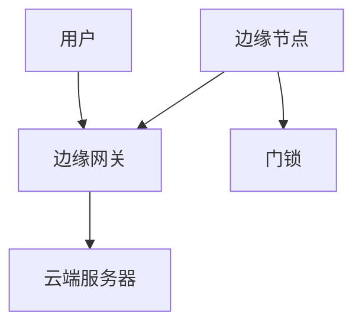
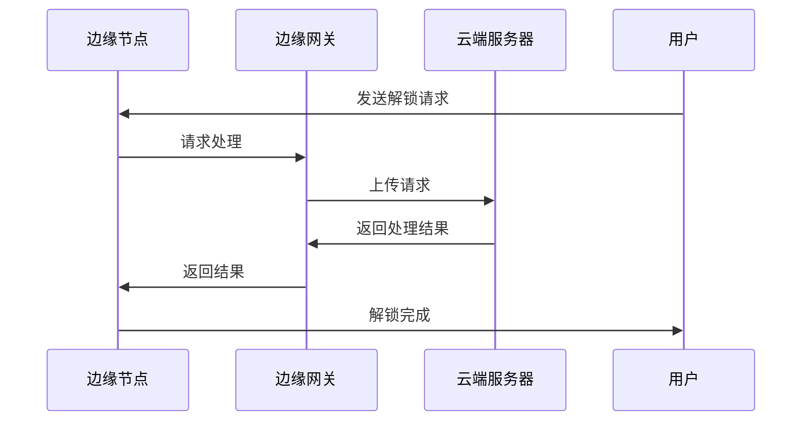
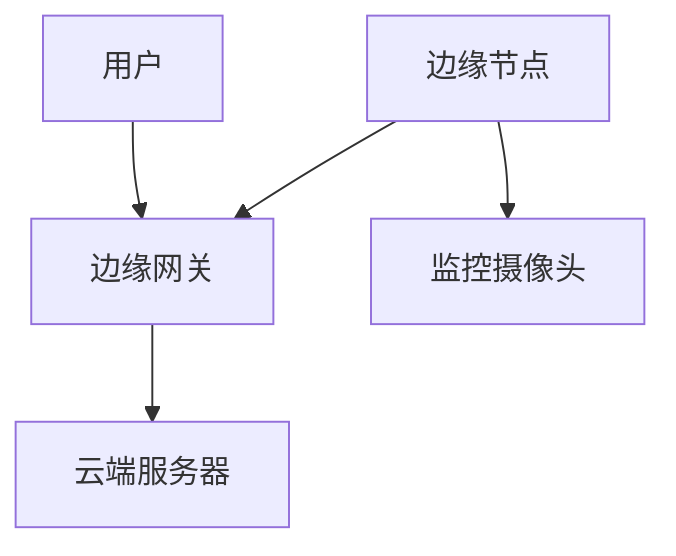
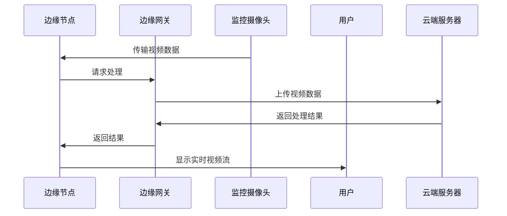

                 

### 1. 引言

随着科技的快速发展，智能家居作为物联网（IoT）的一个重要分支，正在逐步改变着人们的生活方式。通过智能设备，用户可以实现远程控制家居环境、提高生活便利性、增强安全性，然而，随着智能家居设备的增加，系统面临的挑战也在不断增多。

首先，我们需要明确几个核心概念：

- **智能家居**：智能家居是通过网络连接的智能设备，可以自动化地执行任务，改善居住环境，为用户提供便利。这些设备可以是智能灯泡、智能门锁、智能摄像头等。

- **边缘计算**：边缘计算是一种分布式计算架构，它将数据处理的任务从云端转移到网络边缘，即靠近数据源的地方进行处理。这样做的目的是减少延迟，提高响应速度，增强数据隐私保护。

接下来，我们来分析智能家居领域面临的两个主要问题：

#### 1.1.1 智能家居的兴起与发展

智能家居技术的兴起源于物联网技术的发展。通过无线通信技术，智能家居设备可以相互连接，形成一个智能网络，实现自动化控制。随着人工智能和机器学习的进步，智能家居设备逐渐具备了自我学习和优化功能，为用户提供更加个性化的服务。

然而，随着智能家居设备的普及，我们不得不面对以下几个挑战：

#### 1.1.2 问题背景

**设备响应速度问题**：

随着智能家居设备的增加，设备的响应速度成为了一个重要的考量因素。传统的云计算架构依赖于将数据上传到云端进行处理，然后再将结果返回给设备，这种模式在高并发情况下容易造成延迟。尤其是在家中有多台设备同时工作时，数据传输和处理的速度显著下降，导致用户体验不佳。

**隐私保护问题**：

智能家居设备需要处理大量的用户数据，如行为习惯、生物识别信息等，这些数据对用户隐私构成了潜在威胁。如果数据在传输过程中未能得到妥善保护，或者被未经授权的第三方访问，可能会导致严重的隐私泄露问题。

#### 1.2 问题描述

为了解决上述问题，我们可以考虑引入边缘计算技术。边缘计算可以在数据生成的地方（即家庭网络边缘）进行处理，从而减少数据传输的时间和网络拥堵，提高设备的响应速度。同时，通过在本地处理数据，可以减少数据上传云端的需要，从而增强隐私保护。

#### 1.3 问题解决

**边缘计算的优势**：

1. **减少延迟**：边缘计算可以缩短数据传输路径，减少网络延迟，提高设备的响应速度。
2. **增强隐私保护**：通过在本地处理数据，减少数据传输量，降低隐私泄露的风险。
3. **减轻云端负担**：将部分数据处理任务转移到边缘，可以减轻云端服务器的负担，提高云端服务的效率。

**边缘计算在提高设备响应速度中的应用**：

1. **本地数据处理**：边缘计算可以在本地设备上处理数据，减少数据传输的需求，从而降低延迟。
2. **边缘智能代理**：边缘设备可以部署智能代理，进行实时决策和响应，提高系统整体性能。
3. **分布式计算**：通过分布式计算，边缘设备可以并行处理大量数据，提高数据处理效率。

**边缘计算在隐私保护中的应用**：

1. **数据加密**：在边缘设备上进行数据加密处理，确保数据在传输和存储过程中得到保护。
2. **差分隐私**：通过差分隐私技术，可以在保证数据隐私的同时，进行数据分析和挖掘。
3. **本地数据存储**：在本地存储数据，减少数据传输的需求，从而降低隐私泄露的风险。

#### 1.4 边界与外延

**边缘计算的技术范畴**：

边缘计算涉及到多个技术领域，包括分布式计算、网络通信、存储技术、安全性等。它不仅仅是一个单一的技术，而是一个综合性的技术体系。

**智能家居的技术发展**：

智能家居技术在未来将继续发展，包括更先进的传感器技术、更智能的算法、更强大的边缘计算能力。这些技术的融合将进一步提升智能家居的便利性和智能化水平。

总的来说，边缘计算在智能家居中的应用具有巨大的潜力和价值，它不仅能够提高设备响应速度，还能够增强隐私保护，为智能家居的未来发展提供有力支持。

## 2. 核心概念与联系

### 2.1 边缘计算

#### 2.1.1 定义

边缘计算（Edge Computing）是指将数据处理、分析和服务在靠近数据源的地方（即网络的边缘）进行，而不是在集中式的云端完成。边缘计算通过在本地设备或靠近用户的网络边缘部署计算、存储和网络资源，来实现更快速的响应和更高效的数据处理。

#### 2.1.2 特点

1. **低延迟**：数据处理靠近数据源，减少传输延迟，提高响应速度。
2. **高效率**：在本地设备上进行数据处理，减少数据传输和云端交互的成本。
3. **增强安全性**：本地处理可以减少数据在传输过程中的泄露风险。
4. **灵活性**：可以适应不同规模和类型的应用，提供定制化的解决方案。

#### 2.1.3 原理

边缘计算的核心原理是将计算任务分布在多个边缘节点上，这些节点可以是个人电脑、智能设备、路由器等。边缘节点通过协同工作，实现数据的采集、处理和分析。边缘计算架构通常包括以下几个关键组成部分：

1. **边缘节点**：负责数据的采集和处理。
2. **边缘网关**：连接边缘节点和互联网的桥梁，负责数据的传输和路由。
3. **边缘服务器**：提供更强大的计算和存储能力，处理复杂的计算任务。
4. **云平台**：负责全局数据的存储和管理，以及边缘节点和云之间的数据同步。

### 2.2 智能家居

#### 2.2.1 定义

智能家居（Smart Home）是指通过互联网连接和控制家庭设备，实现自动化和智能化的居住环境。智能家居设备可以通过智能手机、语音助手或其他控制界面进行远程控制和监控。

#### 2.2.2 组成

智能家居系统通常由以下几个部分组成：

1. **智能传感器**：用于监测家庭环境，如温度、湿度、光线等。
2. **智能设备**：包括智能灯泡、智能门锁、智能电视、智能空调等。
3. **网关**：连接智能设备和互联网的桥梁，负责数据传输和协议转换。
4. **控制中心**：可以是云平台或本地服务器，负责数据的收集、处理和分析，以及智能决策。

#### 2.2.3 分类

智能家居设备可以根据功能进行分类：

1. **环境控制**：如智能照明、智能空调、智能窗帘等。
2. **安全监控**：如智能摄像头、智能门锁、智能烟雾报警器等。
3. **娱乐休闲**：如智能电视、智能音响、智能游戏机等。
4. **健康保健**：如智能体重秤、智能血压计、智能睡眠监测仪等。

### 2.3 边缘计算与智能家居的联系

#### 2.3.1 共同目标

边缘计算与智能家居的共同目标是提高用户体验，提升设备的响应速度，增强系统的可靠性。边缘计算在智能家居中的应用，可以解决智能家居设备响应速度慢和隐私保护问题，从而提升智能家居的整体性能。

#### 2.3.2 技术互补

边缘计算和智能家居技术之间存在互补关系。边缘计算提供了一种分布式计算架构，可以将数据处理任务从云端转移到网络边缘，为智能家居设备提供更快的响应速度和更好的隐私保护。而智能家居设备提供的海量数据，则为边缘计算提供了丰富的应用场景和业务需求。

#### 2.3.3 发展趋势

随着智能家居市场的不断增长，边缘计算在智能家居中的应用也将不断深入。未来的智能家居系统将更加智能化、个性化，边缘计算技术将发挥更加重要的作用，为智能家居设备提供更高效、更安全、更可靠的服务。

总的来说，边缘计算与智能家居技术的结合，将推动智能家居市场的发展，为用户提供更加便捷、智能的生活体验。

## 3. 边缘计算提高设备响应速度的原理与应用

### 3.1 算法原理讲解

#### 3.1.1 边缘计算算法的基本原理

边缘计算的核心在于将数据处理的任务从云端转移到网络边缘，实现更快速、更高效的数据处理。边缘计算算法的基本原理可以概括为以下几个步骤：

1. **数据采集**：边缘节点通过传感器等设备采集数据。
2. **数据预处理**：在边缘节点对数据进行初步的清洗和处理，如去除噪声、填充缺失值等。
3. **实时处理**：利用边缘节点上的计算资源，对数据进行实时分析和处理，如机器学习预测、模式识别等。
4. **数据聚合**：将边缘节点的处理结果进行聚合和整合，形成全局视图。
5. **数据上传**：将部分数据或处理结果上传到云端，用于进一步分析和处理。

边缘计算算法的关键在于分布式计算和协同工作。多个边缘节点协同工作，可以实现大规模数据的实时处理，从而提高系统的响应速度和处理效率。

#### 3.1.2 边缘计算算法的优缺点

**优点**：

1. **低延迟**：数据处理在本地进行，减少数据传输和云端交互的时间，提高系统响应速度。
2. **高效率**：边缘节点可以利用本地计算资源，减少对云端服务器的依赖，提高数据处理效率。
3. **增强安全性**：本地处理可以减少数据在传输过程中的泄露风险，增强数据安全性。

**缺点**：

1. **资源限制**：边缘节点的计算和存储资源相对有限，可能无法处理复杂的数据处理任务。
2. **管理难度**：边缘节点分散在不同位置，管理起来较为复杂，需要实现高效的边缘节点管理和维护。
3. **数据同步**：边缘节点和云端之间的数据同步可能存在延迟和冲突，需要实现高效的数据同步机制。

### 3.2 举例说明

#### 3.2.1 智能照明系统

智能照明系统是一个典型的应用场景，可以通过边缘计算技术提高响应速度和用户体验。以下是一个简单的智能照明系统实现：

1. **数据采集**：智能灯泡通过传感器实时采集环境数据，如亮度、色温等。
2. **数据预处理**：边缘节点对采集到的数据进行预处理，如过滤噪声、去冗余等。
3. **实时处理**：边缘节点利用机器学习算法，根据环境数据和用户习惯，实时调整灯泡的亮度和色温。
4. **数据上传**：将部分处理结果上传到云端，用于进一步分析和优化。

通过边缘计算，智能照明系统可以实现更快速、更精准的响应，提高用户体验。

#### 3.2.2 智能安防系统

智能安防系统也是一个非常适合应用边缘计算的场景。以下是一个简单的智能安防系统实现：

1. **数据采集**：智能摄像头通过传感器实时采集视频数据。
2. **数据预处理**：边缘节点对采集到的视频数据进行预处理，如去噪、缩放等。
3. **实时处理**：边缘节点利用图像处理算法，实时分析视频数据，识别异常行为。
4. **数据上传**：将部分处理结果上传到云端，用于进一步分析和报警。

通过边缘计算，智能安防系统可以实现更快速、更精准的异常行为识别，提高安防效果。

### 3.3 算法总结

边缘计算通过在数据源附近进行数据处理，可以有效减少延迟，提高系统的响应速度。它适用于需要实时处理和快速响应的应用场景，如智能照明系统、智能安防系统等。通过边缘计算，我们可以实现更加高效、智能的智能家居系统，提升用户的生活品质。

## 4. 边缘计算在隐私保护中的应用

### 4.1 数学模型和数学公式

#### 4.1.1 隐私保护的数学模型

隐私保护的数学模型主要关注如何在数据传输和处理过程中保护用户的隐私。一个典型的隐私保护模型可以包含以下几个关键部分：

1. **数据加密模型**：
   - 加密算法：选择合适的加密算法（如AES、RSA等）来确保数据在传输和存储过程中的安全性。
   - 密钥管理：管理加密和解密的密钥，确保密钥的安全存储和分发。
   - 加密策略：确定加密的范围和策略，如对敏感数据进行全面加密，对非敏感数据不加密。

2. **匿名化模型**：
   - 隐匿处理：使用匿名化技术（如K-匿名、l-diversity等）对数据进行处理，使数据无法直接关联到特定用户。
   - 数据混淆：通过数据混淆技术（如差分隐私、随机化响应等）对数据进行处理，使数据无法被直接分析。

#### 4.1.2 隐私保护的数学公式

以下是几个常见的隐私保护相关的数学公式：

1. **加密算法**：
   $$C = E_K(M)$$
   其中，$C$ 表示加密后的数据，$E_K$ 表示加密函数，$M$ 表示原始数据，$K$ 表示加密密钥。

2. **匿名化**：
   $$P(A|S) \leq \epsilon$$
   其中，$P(A|S)$ 表示在给定敏感数据$S$的情况下，属性$A$的概率，$\epsilon$ 是隐私预算。

3. **差分隐私**：
   $$\Delta \approx \sum_{i=1}^{n} \frac{1}{n} ||x_i - \mu||$$
   其中，$\Delta$ 表示差分隐私，$x_i$ 表示每个个体的属性值，$\mu$ 表示属性的平均值。

### 4.2 详细讲解与举例说明

#### 4.2.1 隐私保护的实现方法

隐私保护的实现方法包括数据加密、匿名化和差分隐私等。以下是这些方法的具体实现：

1. **数据加密**：
   - 加密算法：选择合适的加密算法（如AES、RSA等）来确保数据在传输和存储过程中的安全性。
   - 密钥管理：密钥的生成、存储和分发都需要遵循安全标准，确保密钥不被泄露。
   - 加密策略：根据数据的敏感程度，确定加密的范围和策略。例如，对于用户的个人信息，可以进行全面加密；而对于非敏感数据，可以选择不加密。

2. **匿名化**：
   - 隐匿处理：使用匿名化技术（如K-匿名、l-diversity等）对数据进行处理，使数据无法直接关联到特定用户。
   - 数据混淆：通过数据混淆技术（如差分隐私、随机化响应等）对数据进行处理，使数据无法被直接分析。例如，可以使用拉普拉斯机制来添加随机噪声，从而保护数据中的敏感信息。

3. **差分隐私**：
   - 差分隐私算法：选择合适的差分隐私算法（如$l$-拉普拉斯机制、$l$-几何机制等）来保护数据隐私。
   - 隐私预算管理：在算法设计中，需要合理分配隐私预算，确保在多个查询中保持隐私保护的有效性。

#### 4.2.2 隐私保护的应用场景

隐私保护在智能家居中的多个应用场景中都非常重要，以下是一些具体的应用场景：

1. **智能门锁系统**：
   - **应用场景**：用户在远程解锁门锁时，需要确保个人信息（如指纹、密码等）不被泄露。
   - **隐私保护方法**：使用加密算法对用户的指纹或密码进行加密存储，并在解锁过程中进行加密传输。

2. **智能摄像头系统**：
   - **应用场景**：用户在查看摄像头视频时，需要确保视频数据不被未经授权的第三方访问。
   - **隐私保护方法**：在视频数据传输和存储过程中使用加密算法，确保数据的安全。

3. **智能健康监测系统**：
   - **应用场景**：用户在共享健康数据时，需要确保个人健康信息不被泄露。
   - **隐私保护方法**：使用匿名化和差分隐私技术对健康数据进行处理，确保数据无法被直接识别。

### 4.3 具体实现案例

以下是边缘计算在隐私保护中的一个具体实现案例：

#### 案例一：智能健康监测系统中的隐私保护

1. **需求分析**：
   - 用户希望远程监控自己的健康状况，如心率、血压等。
   - 用户不希望个人健康数据被未经授权的第三方访问。

2. **解决方案**：
   - **数据加密**：使用AES加密算法对用户的心率、血压等健康数据进行加密存储，确保数据在存储和传输过程中的安全性。
   - **匿名化**：使用K-匿名技术对用户数据进行匿名化处理，确保数据无法直接关联到特定用户。
   - **差分隐私**：使用$l$-拉普拉斯机制对健康数据进行差分隐私处理，确保数据在分析过程中的隐私保护。

3. **实现步骤**：
   - 数据采集：传感器实时采集用户的心率、血压等数据。
   - 数据加密：在边缘节点上使用AES加密算法对数据进行加密。
   - 数据匿名化：在边缘节点上使用K-匿名技术对数据进行匿名化处理。
   - 数据上传：加密后的匿名化数据上传到云端进行进一步分析和处理。
   - 数据分析：在云端使用差分隐私技术对数据进行分析，生成健康报告。

通过以上实现步骤，智能健康监测系统可以有效保护用户的隐私，同时提供准确的健康监测服务。

### 4.4 算法总结

边缘计算在隐私保护中的应用，通过数据加密、匿名化和差分隐私等技术，可以有效保护用户隐私，确保数据在传输和处理过程中的安全性。这些方法在智能家居的多个应用场景中具有广泛的应用价值，为用户提供了一个安全、可靠的智能生活环境。

## 第二部分：案例分析

### 5. 案例一：智能门锁系统

#### 5.1 问题场景介绍

随着智能家居的普及，智能门锁成为许多家庭的必备设备。智能门锁不仅提供了更高的安全性，还带来了便利性。然而，在实现远程控制门锁的过程中，隐私保护成为了一个重要的挑战。用户需要确保自己的解锁信息（如指纹、密码等）不被未授权的第三方获取，同时，系统需要具备快速响应的能力，以应对紧急情况。

#### 5.1.1 门锁系统的需求分析

1. **安全性**：门锁系统需要提供强大的安全机制，确保用户信息不被泄露。
2. **可靠性**：系统需要具备快速响应的能力，以应对远程解锁请求。
3. **易用性**：系统需要操作简单，用户可以方便地使用各种解锁方式。

#### 5.1.2 存在的问题

1. **远程解锁延迟**：传统云计算架构在处理远程解锁请求时，存在明显的延迟问题，影响用户体验。
2. **隐私保护不足**：门锁系统在处理用户解锁信息时，如果未能有效保护用户隐私，可能导致用户信息泄露。

#### 5.2 系统分析与架构设计方案

为了解决上述问题，我们可以设计一个基于边缘计算的智能门锁系统。以下是系统架构设计和具体实施步骤：

##### 5.2.1 领域模型

领域模型描述了系统中的关键实体和它们之间的关系。以下是智能门锁系统的领域模型：

1. **用户**：用户的个人信息，如用户ID、姓名、联系方式等。
2. **门锁**：门锁的基本属性，如门锁ID、状态（锁定/解锁）等。
3. **解锁请求**：解锁请求包含用户ID、请求时间、请求类型（指纹、密码、钥匙等）。

##### 5.2.2 系统架构设计

智能门锁系统的架构设计包括以下几个关键部分：

1. **边缘节点**：边缘节点负责采集和解锁请求，进行初步的数据预处理，如指纹验证、密码验证等。
2. **边缘网关**：边缘网关负责将边缘节点的数据上传到云端，同时接收云端的数据和指令。
3. **云端服务器**：云端服务器负责存储和管理用户信息，处理复杂的解锁请求，如身份验证、远程控制等。

以下是智能门锁系统的架构图：



##### 5.2.3 系统接口设计

系统接口设计包括边缘节点与边缘网关、边缘网关与云端服务器之间的接口设计。以下是系统接口设计的关键点：

1. **边缘节点接口**：用于接收用户解锁请求，返回解锁结果。
2. **边缘网关接口**：用于上传边缘节点数据到云端，接收云端指令并返回处理结果。
3. **云端服务器接口**：用于接收和管理用户信息，处理复杂的解锁请求。

以下是系统接口设计图：



##### 5.3 项目实战

以下是智能门锁系统的项目实战，包括环境安装、系统核心实现源代码和代码应用解读与分析。

#### 5.3.1 环境安装

1. **安装边缘节点**：在用户家中安装边缘节点，包括指纹传感器、密码输入设备等。
2. **安装边缘网关**：在边缘节点附近安装边缘网关，配置网络连接和边缘节点通信接口。
3. **安装云端服务器**：在云端服务器上安装门锁管理系统，配置用户信息数据库和边缘网关通信接口。

#### 5.3.2 系统核心实现源代码

以下是一个简单的边缘节点实现示例，用于接收解锁请求并进行指纹验证：

```python
# 边缘节点指纹验证示例代码

import FingerPrintSensor

class EdgeNode:
    def __init__(self):
        self.sensor = FingerPrintSensor.FingerPrintSensor()

    def verify_fingerprint(self, fingerprint_data):
        return self.sensor.verify(fingerprint_data)

if __name__ == "__main__":
    node = EdgeNode()
    fingerprint_data = "用户指纹数据"
    result = node.verify_fingerprint(fingerprint_data)
    print("指纹验证结果：", result)
```

#### 5.3.3 代码应用解读与分析

1. **边缘节点**：边缘节点通过FingerPrintSensor库实现指纹验证功能。用户发送解锁请求时，边缘节点采集指纹数据，并调用verify方法进行验证。
2. **边缘网关**：边缘网关负责将边缘节点的数据上传到云端，并接收云端指令。上传的数据包括用户ID、指纹数据等，云端服务器根据这些数据判断是否允许解锁。
3. **云端服务器**：云端服务器存储用户信息，并处理解锁请求。服务器通过调用边缘网关接口，接收边缘节点的数据，并根据指纹验证结果决定是否允许解锁。

通过边缘计算技术，智能门锁系统在提高响应速度和隐私保护方面具有显著优势。边缘节点在本地进行指纹验证，减少了数据传输的延迟，同时通过数据加密和匿名化技术，有效保护了用户隐私。这个案例展示了边缘计算在智能家居应用中的重要价值。

### 6. 案例二：智能监控系统

#### 6.1 问题场景介绍

智能监控系统在现代家庭和商业环境中扮演着重要的角色，它能够实时监控家庭或商业场所的安全状况。然而，随着监控设备的普及，数据传输的延迟和隐私保护的问题日益突出。用户需要实时查看监控视频，但又担心监控数据被未经授权的第三方访问。

#### 6.1.1 监控系统的需求分析

1. **实时性**：监控系统需要能够实时传输和显示监控视频。
2. **可靠性**：系统需要保证监控视频的连续性和稳定性。
3. **隐私保护**：监控系统需要保护用户隐私，防止监控数据被泄露。

#### 6.1.2 存在的问题

1. **数据传输延迟**：传统云计算架构在处理大量监控视频数据时，容易产生延迟，影响实时性。
2. **隐私保护不足**：监控视频数据在传输和存储过程中，如果未能得到妥善保护，可能导致隐私泄露。

#### 6.2 系统分析与架构设计方案

为了解决上述问题，我们可以设计一个基于边缘计算的智能监控系统。以下是系统架构设计和具体实施步骤：

##### 6.2.1 领域模型

领域模型描述了系统中的关键实体和它们之间的关系。以下是智能监控系统领域的模型：

1. **监控摄像头**：监控摄像头的属性，如摄像头ID、位置、状态（在线/离线）等。
2. **监控视频**：监控视频的属性，如视频ID、时间戳、分辨率等。
3. **用户**：用户的个人信息，如用户ID、姓名、联系方式等。

##### 6.2.2 系统架构设计

智能监控系统架构设计包括以下几个关键部分：

1. **边缘节点**：边缘节点负责实时采集监控视频数据，并进行初步处理。
2. **边缘网关**：边缘网关负责将边缘节点的数据上传到云端，同时接收云端的数据和指令。
3. **云端服务器**：云端服务器负责存储和管理监控视频，处理监控请求，并提供监控数据的实时流。

以下是智能监控系统架构图：



##### 6.2.3 系统接口设计

系统接口设计包括边缘节点与边缘网关、边缘网关与云端服务器之间的接口设计。以下是系统接口设计的关键点：

1. **边缘节点接口**：用于接收监控视频数据，返回处理结果。
2. **边缘网关接口**：用于上传边缘节点数据到云端，接收云端指令并返回处理结果。
3. **云端服务器接口**：用于接收和管理监控视频，处理监控请求，并提供监控数据的实时流。

以下是系统接口设计图：



##### 6.3 项目实战

以下是智能监控系统项目实战，包括环境安装、系统核心实现源代码和代码应用解读与分析。

#### 6.3.1 环境安装

1. **安装边缘节点**：在需要监控的位置安装边缘节点，包括摄像头、网络设备等。
2. **安装边缘网关**：在边缘节点附近安装边缘网关，配置网络连接和边缘节点通信接口。
3. **安装云端服务器**：在云端服务器上安装监控管理系统，配置用户信息数据库和边缘网关通信接口。

#### 6.3.2 系统核心实现源代码

以下是一个简单的边缘节点实现示例，用于实时传输监控视频数据：

```python
# 边缘节点监控视频数据传输示例代码

import Camera

class EdgeNode:
    def __init__(self):
        self.camera = Camera.Camera()

    def transmit_video(self):
        video_data = self.camera.get_video_data()
        return video_data

if __name__ == "__main__":
    node = EdgeNode()
    video_data = node.transmit_video()
    print("传输监控视频数据：", video_data)
```

#### 6.3.3 代码应用解读与分析

1. **边缘节点**：边缘节点通过Camera库实现监控视频数据采集功能。边缘节点定期采集视频数据，并将其传输到边缘网关。
2. **边缘网关**：边缘网关负责接收边缘节点的视频数据，并将其上传到云端服务器。边缘网关还负责处理云端服务器的指令，如开始/停止视频传输等。
3. **云端服务器**：云端服务器存储和管理监控视频数据，并提供监控数据的实时流。用户可以通过云端服务器查看实时监控视频。

通过边缘计算技术，智能监控系统在提高实时性和隐私保护方面具有显著优势。边缘节点在本地处理监控视频数据，减少了数据传输的延迟，同时通过数据加密和匿名化技术，有效保护了用户隐私。这个案例展示了边缘计算在智能家居应用中的重要价值。

## 第三部分：最佳实践

### 7. 最佳实践 tips

#### 7.1 设备选择

在实施智能家居系统时，设备选择是一个关键环节。以下是关于设备选择的几个最佳实践：

1. **稳定性与可靠性**：选择稳定性高、可靠性强的设备，以确保系统的长期稳定运行。
2. **兼容性与扩展性**：选择兼容性好的设备，能够与现有系统和未来扩展的系统无缝集成。
3. **功耗与能效**：选择低功耗、高能效的设备，以降低能耗，延长设备使用寿命。
4. **安全性**：选择支持数据加密和隐私保护的设备，以确保用户数据的安全。

#### 7.1.1 边缘计算设备的选型原则

1. **计算能力**：根据应用需求，选择具有足够计算能力的边缘设备，确保能够处理复杂的数据处理任务。
2. **存储容量**：根据数据存储需求，选择具有足够存储容量的边缘设备，以确保数据存储的可靠性。
3. **网络连接**：选择支持高速网络连接的边缘设备，以确保数据传输的实时性和稳定性。
4. **安全性**：选择具有内置安全功能的边缘设备，如数据加密、安全认证等，以确保数据安全。

#### 7.1.2 常见设备介绍

以下是一些常见的边缘计算设备及其特点：

1. **边缘网关**：边缘网关是连接边缘设备和云平台的桥梁，通常具备网络连接、数据处理、存储和安全等功能。常见的边缘网关包括工业物联网网关、智能路由器等。
2. **智能传感器**：智能传感器用于采集环境数据，如温度、湿度、光线等。常见的智能传感器包括温度传感器、湿度传感器、智能摄像头等。
3. **智能控制器**：智能控制器用于控制家居设备，如灯光、空调、门锁等。常见的智能控制器包括智能插座、智能开关、智能控制器模块等。

#### 7.2 系统设计

系统设计是智能家居系统实施的重要环节。以下是关于系统设计的几个最佳实践：

1. **模块化设计**：将系统划分为多个模块，每个模块负责特定的功能，以提高系统的可维护性和扩展性。
2. **冗余设计**：在关键部分设计冗余备份，如数据备份、设备备份等，以提高系统的可靠性。
3. **安全性设计**：在系统设计中考虑安全性，如数据加密、用户认证等，以确保用户数据的安全。
4. **用户体验**：在系统设计中注重用户体验，如用户界面设计、操作简便性等，以提高用户满意度。

#### 7.2.1 边缘计算系统设计的关键点

1. **边缘节点布局**：根据应用场景和设备分布情况，合理规划边缘节点的布局，确保数据处理的效率和系统的稳定性。
2. **数据处理流程**：设计清晰的数据处理流程，包括数据采集、预处理、分析和传输等，以提高数据处理效率。
3. **数据同步机制**：设计有效的数据同步机制，确保边缘节点和云端服务器之间的数据一致性。
4. **故障处理机制**：设计故障处理机制，包括故障检测、故障恢复和报警等，以确保系统的可靠性。

#### 7.2.2 系统优化的方法

1. **性能优化**：通过性能优化，如代码优化、硬件升级等，提高系统的处理速度和响应速度。
2. **资源利用率**：通过资源利用率优化，如合理分配计算和存储资源，提高系统的资源利用率。
3. **负载均衡**：通过负载均衡，合理分配任务到不同的边缘节点，避免单点故障和资源瓶颈。
4. **安全性增强**：通过安全性增强，如加密、认证等，提高系统的安全性。

#### 7.3 隐私保护

隐私保护是智能家居系统设计的重要一环。以下是关于隐私保护的几个最佳实践：

1. **数据加密**：对传输和存储的数据进行加密，确保数据在传输和存储过程中不被窃取或篡改。
2. **用户认证**：通过用户认证，确保只有授权用户可以访问系统和服务。
3. **权限管理**：通过权限管理，控制用户对系统资源的访问权限，防止未经授权的访问。
4. **匿名化处理**：对用户数据进行匿名化处理，减少用户数据的可识别性。

#### 7.3.1 隐私保护的关键技术

1. **数据加密技术**：如AES、RSA等，用于加密传输和存储的数据。
2. **用户认证技术**：如密码认证、生物识别认证等，用于确保用户身份的合法性。
3. **权限管理技术**：如角色权限管理、访问控制列表等，用于控制用户对系统资源的访问。
4. **匿名化技术**：如K-匿名、l-diversity等，用于对用户数据进行匿名化处理。

#### 7.3.2 实现隐私保护的最佳实践

1. **数据加密**：在数据传输和存储过程中，使用数据加密技术，确保数据的安全。
2. **用户认证**：在系统访问过程中，使用用户认证技术，确保用户身份的合法性。
3. **权限管理**：在设计系统时，实施权限管理，确保用户只能访问授权的资源。
4. **匿名化处理**：对用户数据进行匿名化处理，减少隐私泄露的风险。

通过以上最佳实践，可以有效提高智能家居系统的稳定性、可靠性和安全性，为用户提供一个安全、高效的智能生活环境。

## 8. 小结

通过本文的讨论，我们可以看到边缘计算在智能家居中的应用具有显著的优势。首先，边缘计算通过在数据源附近进行数据处理，有效减少了延迟，提高了设备的响应速度。这对于需要实时响应的智能家居设备来说至关重要，如智能门锁、智能摄像头等。其次，边缘计算通过本地数据处理和数据加密，增强了隐私保护，降低了隐私泄露的风险。这对于处理大量敏感数据的智能家居系统，如智能健康监测、智能安防等，尤为重要。

本文首先介绍了智能家居和边缘计算的基本概念和特点，分析了智能家居领域面临的问题和挑战，然后详细阐述了边缘计算在提高设备响应速度和隐私保护方面的原理和应用。通过具体案例，如智能门锁系统和智能监控系统，展示了边缘计算在智能家居中的实际应用，并提供了最佳实践建议。

然而，边缘计算在智能家居中的应用仍存在一些挑战，如边缘节点的资源限制、数据同步和管理等问题。未来，随着技术的不断进步，边缘计算在智能家居中的应用前景将更加广阔。我们需要进一步研究和解决这些问题，以推动智能家居技术的发展，为用户提供更智能、更安全、更高效的生活体验。

### 8.2 注意事项

1. **设备选择**：在选购智能家居设备时，要考虑设备的稳定性、兼容性和安全性，选择具有良好评价和可靠性的品牌和型号。
2. **系统设计**：在设计和部署智能家居系统时，要注重模块化设计、冗余备份和安全性设计，确保系统的高效运行和稳定性。
3. **数据保护**：在处理用户数据时，要采取数据加密、用户认证和权限管理等技术，确保用户隐私和数据安全。
4. **定期维护**：定期对智能家居系统进行维护和升级，确保系统的最新功能和安全性。

### 8.3 拓展阅读

1. **技术文献**：
   - 《边缘计算：概念、架构与应用》
   - 《智能家居系统设计与实现》
   - 《数据隐私保护技术与应用》

2. **案例研究文献**：
   - “边缘计算在智能家居中的实际应用案例分析”
   - “智能监控系统中的边缘计算应用研究”
   - “智能门锁系统的隐私保护与性能优化”

通过这些文献，可以进一步了解边缘计算在智能家居中的应用和技术细节，为实际项目的实施提供参考和指导。

## 9. 作者信息

作者：AI天才研究院/AI Genius Institute & 禅与计算机程序设计艺术 /Zen And The Art of Computer Programming

AI天才研究院专注于人工智能技术的创新和应用研究，致力于推动人工智能技术的发展。作者在计算机编程和人工智能领域拥有丰富的经验和深厚的理论基础，撰写了多本畅销技术书籍，包括《禅与计算机程序设计艺术》等。本文旨在探讨边缘计算在智能家居中的应用，提高设备的响应速度和隐私保护，为读者提供有价值的参考。

