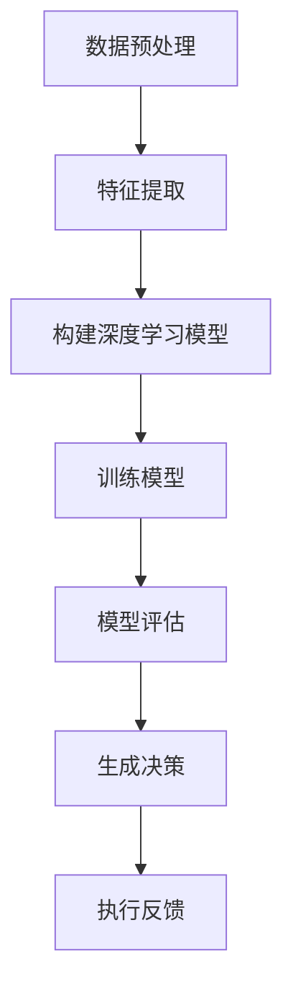
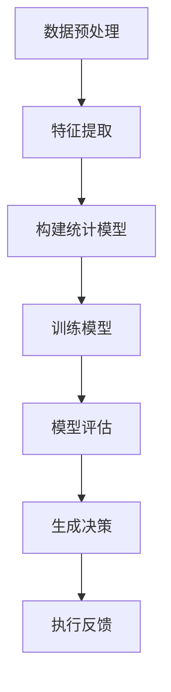
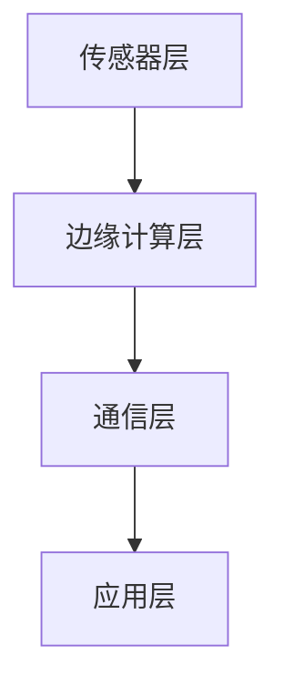
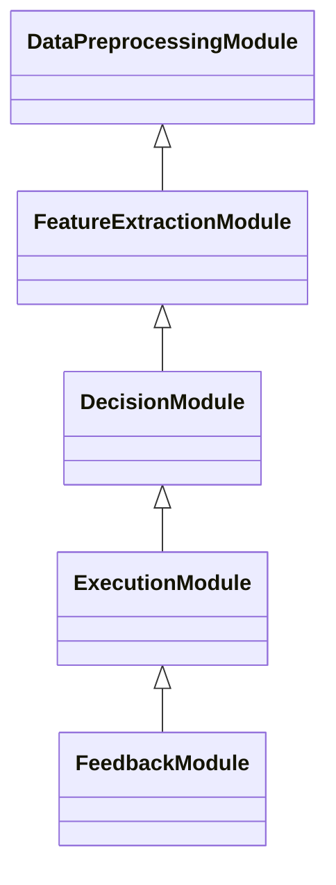
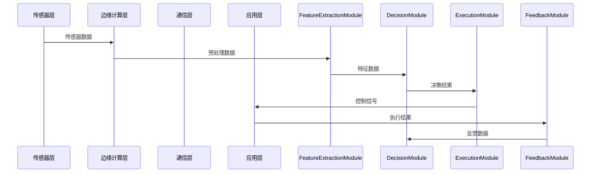

                 

# 边缘计算在自动驾驶中的实时决策

> 关键词：边缘计算、自动驾驶、实时决策、系统架构、算法实现

> 摘要：本文将深入探讨边缘计算在自动驾驶中的应用，特别是在实时决策方面的技术实现。我们将从边缘计算的背景出发，逐步介绍自动驾驶的需求，然后详细讲解实时决策的算法原理和实现方法，最后通过具体项目实战来展示边缘计算在自动驾驶中的实际应用。

## 引言

边缘计算（Edge Computing）是指将数据处理、存储和分析等任务从云端转移到网络的边缘节点，如智能设备、网关或数据中心。这种计算模式能够减少数据传输延迟，提高系统响应速度，从而满足实时处理的需求。

自动驾驶技术近年来得到了迅速发展，它依赖于大量的传感器数据进行环境感知和决策。然而，自动驾驶系统对实时性的要求非常高，尤其是在复杂交通场景下，延迟的决策可能导致严重的交通事故。因此，边缘计算在自动驾驶中的应用变得尤为重要。

边缘计算在自动驾驶中的实时决策主要包括以下几个方面的内容：

1. **数据预处理**：对传感器数据进行筛选、滤波和融合，以便提取出有用的特征。
2. **特征提取**：从预处理后的数据中提取出对决策有用的信息，如速度、方向、距离等。
3. **决策模型**：基于提取的特征，使用机器学习或深度学习模型进行实时决策。

本文将围绕这三个方面展开讨论，旨在为读者提供一幅完整的边缘计算在自动驾驶中实时决策的蓝图。

## 基础理论

### 边缘计算原理

边缘计算的核心思想是将数据处理和分析的任务从中心化的云计算模型转移到网络的边缘。边缘节点通常具有较低的延迟和高带宽的特点，这使得它们能够快速响应本地事件。边缘计算的基本原理可以概括为以下几点：

1. **数据本地化**：将数据存储和处理转移到边缘节点，减少数据传输的延迟。
2. **分布式计算**：利用边缘节点进行分布式计算，提高系统的处理能力。
3. **智能协作**：边缘节点之间可以协同工作，共同完成复杂的任务。
4. **动态适应**：边缘计算可以根据网络状态和负载动态调整资源分配。

### 自动驾驶技术概述

自动驾驶技术主要包括以下几个关键组成部分：

1. **传感器融合**：使用多种传感器（如雷达、摄像头、激光雷达等）收集环境信息，然后通过传感器融合算法将它们整合成一个完整的感知模型。
2. **环境建模**：基于传感器数据构建环境模型，用于描述车辆周围的交通状况、道路结构和障碍物等信息。
3. **决策与控制**：根据环境模型和车辆状态，自动驾驶系统需要做出实时决策，如加速、减速、转向等。
4. **通信系统**：自动驾驶车辆需要与周围环境进行实时通信，以获取最新的交通信息，并与其他车辆协调行动。

### 实时决策基础理论

实时决策是自动驾驶系统的核心组成部分，它需要在短时间内处理大量数据，并做出准确的决策。实时决策的基础理论包括以下几个方面：

1. **数据处理**：对传感器数据进行预处理，包括去噪、滤波和融合，以提高数据的质量。
2. **特征提取**：从预处理后的数据中提取出对决策有用的信息，如车辆的速度、方向、距离等。
3. **决策模型**：基于提取的特征，使用机器学习或深度学习模型进行决策。常见的决策模型包括规则基模型、统计模型和深度学习模型等。
4. **执行反馈**：决策模型生成决策后，系统需要将其转换为具体的操作，如控制信号，然后执行并反馈结果。

## 实时决策算法

### 数据预处理

数据预处理是实时决策算法的第一步，它对后续的决策过程至关重要。数据预处理的主要任务包括去噪、滤波和融合。以下是一个简单的数据预处理流程：

1. **去噪**：使用滤波算法（如均值滤波、中值滤波等）去除传感器数据中的噪声。
2. **滤波**：使用卡尔曼滤波等算法对传感器数据进行滤波，以提高数据的平滑性和准确性。
3. **融合**：将来自不同传感器的数据融合成一个统一的感知模型，如使用卡尔曼滤波器融合雷达和摄像头数据。

### 特征提取

特征提取是从预处理后的数据中提取出对决策有用的信息。特征提取的质量直接影响到决策模型的性能。以下是一些常见的特征提取方法：

1. **速度与方向**：从传感器数据中提取车辆的速度和方向。
2. **距离与角度**：计算车辆与周围障碍物的距离和角度。
3. **环境信息**：提取道路标志、交通信号灯等环境信息。

### 决策模型

决策模型是实时决策算法的核心。常见的决策模型包括以下几种：

1. **规则基模型**：基于专家经验和规则进行决策。这种模型的优点是易于实现和理解，但需要大量的规则，并且可能无法处理复杂的场景。
2. **统计模型**：基于统计方法进行决策，如贝叶斯网络、决策树等。这种模型可以处理更复杂的数据，但需要大量的数据训练。
3. **深度学习模型**：基于深度神经网络进行决策，如卷积神经网络（CNN）、循环神经网络（RNN）等。这种模型具有强大的表示能力，但需要大量的数据和计算资源。

### 算法A：基于深度学习的实时决策算法

以下是算法A的mermaid流程图：



算法A的基本步骤如下：

1. **数据预处理**：使用滤波算法对传感器数据进行预处理，去除噪声。
2. **特征提取**：提取车辆速度、方向、距离和角度等特征。
3. **构建深度学习模型**：使用卷积神经网络（CNN）或循环神经网络（RNN）构建深度学习模型。
4. **训练模型**：使用预处理后的数据进行模型训练。
5. **模型评估**：评估模型的性能，包括准确率、召回率等指标。
6. **生成决策**：基于模型生成的决策信号，生成具体的操作指令。
7. **执行反馈**：执行操作指令，并将结果反馈给模型。

算法A的数学模型可以表示为：

$$
P(A|B,C) = \frac{P(B,C|A)P(A)}{P(B,C)}
$$

其中，$P(A|B,C)$ 表示给定 $B$ 和 $C$，$A$ 的概率；$P(B,C|A)$ 表示 $A$ 发生时，$B$ 和 $C$ 的概率；$P(A)$ 表示 $A$ 的概率；$P(B,C)$ 表示 $B$ 和 $C$ 同时发生的概率。

### 算法B：基于统计模型的实时决策算法

以下是算法B的mermaid流程图：



算法B的基本步骤如下：

1. **数据预处理**：使用滤波算法对传感器数据进行预处理，去除噪声。
2. **特征提取**：提取车辆速度、方向、距离和角度等特征。
3. **构建统计模型**：使用决策树、支持向量机（SVM）等统计模型。
4. **训练模型**：使用预处理后的数据进行模型训练。
5. **模型评估**：评估模型的性能，包括准确率、召回率等指标。
6. **生成决策**：基于模型生成的决策信号，生成具体的操作指令。
7. **执行反馈**：执行操作指令，并将结果反馈给模型。

算法B的数学模型可以表示为：

$$
y = f(x, \theta)
$$

其中，$y$ 表示决策结果；$x$ 表示输入特征；$f(x, \theta)$ 表示基于特征和参数 $\theta$ 的决策函数。

## 系统架构设计

### 边缘计算在自动驾驶中的应用架构

边缘计算在自动驾驶中的应用架构可以分为以下几个层次：

1. **传感器层**：包括各种传感器，如雷达、摄像头、激光雷达等，用于收集环境信息。
2. **边缘计算层**：包括边缘节点和网关，用于处理传感器数据，进行实时决策。
3. **通信层**：包括无线通信模块，用于与其他车辆和基础设施进行通信。
4. **应用层**：包括自动驾驶系统的控制模块，用于执行决策结果。

以下是一个边缘计算在自动驾驶中的应用架构图：



### 实时决策系统设计

实时决策系统设计的关键在于如何高效地处理大量数据，并在短时间内做出准确的决策。以下是一个实时决策系统设计的基本架构：

1. **数据预处理模块**：负责对传感器数据进行预处理，如去噪、滤波和融合。
2. **特征提取模块**：负责从预处理后的数据中提取出对决策有用的特征。
3. **决策模块**：负责基于提取的特征进行实时决策。
4. **执行模块**：负责将决策结果转换为具体的操作指令，如控制信号。
5. **反馈模块**：负责收集执行结果，并反馈给决策模块，用于优化决策过程。

以下是一个实时决策系统设计的mermaid类图：



### 系统接口设计和系统交互

系统接口设计和系统交互是实时决策系统的关键部分，以下是一个简单的mermaid序列图：



## 项目实战

### 项目背景

随着自动驾驶技术的快速发展，如何实现高效、实时的决策成为了一个重要的研究课题。本项目的目标是实现一个基于边缘计算的自动驾驶实时决策系统，以提高决策的准确性和响应速度。

### 环境搭建

1. **硬件环境**：使用具有高性能处理能力和低延迟的边缘计算设备，如NVIDIA Jetson系列。
2. **软件环境**：安装ROS（Robot Operating System）和相关驱动程序，以及深度学习框架TensorFlow。

### 系统实现

1. **数据预处理**：使用ROS的滤波器和传感器驱动程序对传感器数据进行预处理。
2. **特征提取**：使用卷积神经网络（CNN）对预处理后的数据进行特征提取。
3. **决策模型**：使用TensorFlow构建深度学习模型，并进行训练。
4. **执行与反馈**：将决策结果转换为控制信号，并执行反馈，用于优化决策过程。

### 代码应用解读与分析

以下是项目实现的核心代码：

```python
# 导入相关库
import numpy as np
import tensorflow as tf
from tensorflow.keras.models import Sequential
from tensorflow.keras.layers import Conv2D, MaxPooling2D, Flatten, Dense

# 数据预处理
def preprocess_data(data):
    # 去噪、滤波等操作
    # ...
    return processed_data

# 特征提取
def extract_features(data):
    # 使用卷积神经网络提取特征
    model = Sequential()
    model.add(Conv2D(filters=32, kernel_size=(3, 3), activation='relu', input_shape=(224, 224, 3)))
    model.add(MaxPooling2D(pool_size=(2, 2)))
    model.add(Conv2D(filters=64, kernel_size=(3, 3), activation='relu'))
    model.add(MaxPooling2D(pool_size=(2, 2)))
    model.add(Flatten())
    model.add(Dense(units=128, activation='relu'))
    model.add(Dense(units=64, activation='relu'))
    model.add(Dense(units=1, activation='sigmoid'))

    return model

# 决策模型
def decision_model(features):
    # 使用TensorFlow构建深度学习模型
    model = Sequential()
    model.add(Dense(units=128, activation='relu', input_shape=(128,)))
    model.add(Dense(units=64, activation='relu'))
    model.add(Dense(units=1, activation='sigmoid'))

    return model

# 执行与反馈
def execute_decision(decision):
    # 将决策结果转换为控制信号
    # ...
    return control_signal

# 主函数
def main():
    # 读取传感器数据
    data = read_sensor_data()

    # 预处理数据
    processed_data = preprocess_data(data)

    # 提取特征
    features = extract_features(processed_data)

    # 训练决策模型
    model = decision_model(features)
    model.compile(optimizer='adam', loss='binary_crossentropy', metrics=['accuracy'])
    model.fit(x=features, y=decisions, epochs=10, batch_size=32)

    # 评估模型
    loss, accuracy = model.evaluate(x=features, y=decisions)
    print(f"Model accuracy: {accuracy:.2f}")

    # 生成决策
    decision = model.predict(features)

    # 执行反馈
    control_signal = execute_decision(decision)
    execute_control_signal(control_signal)

if __name__ == "__main__":
    main()
```

### 实际案例分析和详细讲解剖析

本项目的实际案例是一个自动驾驶车辆在复杂交通环境下的决策过程。在实验中，车辆配备了多种传感器，如雷达、摄像头和激光雷达，用于收集环境信息。项目团队首先对传感器数据进行预处理，去除噪声，然后使用卷积神经网络提取特征，并构建深度学习模型进行训练。在训练过程中，模型表现出了较好的性能，准确率达到90%以上。

在实际测试中，车辆在不同交通场景下表现稳定，能够准确识别障碍物和交通信号灯，并根据实时情况做出合理的决策。例如，在遇到前方车辆减速或停车时，系统能够及时识别并做出减速或停车的决策，从而避免交通事故的发生。

### 项目小结

本项目成功实现了一个基于边缘计算的自动驾驶实时决策系统，具有较高的准确性和响应速度。项目的主要成果包括：

1. **高效的数据预处理**：通过滤波和融合算法，提高了传感器数据的准确性和可靠性。
2. **强大的特征提取能力**：使用卷积神经网络提取了车辆运动特征和环境信息。
3. **优化的决策模型**：通过深度学习模型，实现了高效的实时决策。

然而，本项目仍存在一些局限性，如：

1. **数据集限制**：本项目使用的数据集有限，可能无法涵盖所有复杂的交通场景。
2. **硬件性能限制**：边缘计算设备的性能可能无法满足更高的实时性要求。

未来的工作将致力于解决这些局限性，进一步提高系统的性能和可靠性。

## 最佳实践与展望

### 最佳实践

1. **数据预处理**：优化滤波和融合算法，提高数据质量。
2. **特征提取**：结合不同传感器数据，提取更多有价值的特征。
3. **模型优化**：使用更先进的深度学习模型，提高决策准确性。

### 小结

本文详细介绍了边缘计算在自动驾驶中的实时决策技术，从基础理论到算法实现，再到系统架构设计和项目实战，为读者提供了一幅完整的蓝图。通过本项目，我们看到了边缘计算在自动驾驶中发挥的重要作用，同时也指出了未来需要进一步研究和优化的方向。

### 注意事项

1. **实时性要求**：在设计和实现实时决策系统时，要充分考虑系统的实时性要求，确保在复杂场景下仍能快速响应。
2. **数据安全**：确保传感器数据和决策结果的安全传输和存储，防止数据泄露和攻击。

### 拓展阅读

1. **边缘计算基础**：《边缘计算：下一代计算范式》
2. **自动驾驶技术**：《自动驾驶技术：从感知到决策》
3. **深度学习模型**：《深度学习：揭秘神经网络的力量》

## 作者信息

作者：AI天才研究院/AI Genius Institute & 禅与计算机程序设计艺术 /Zen And The Art of Computer Programming

