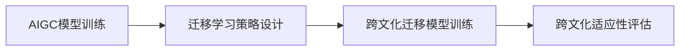
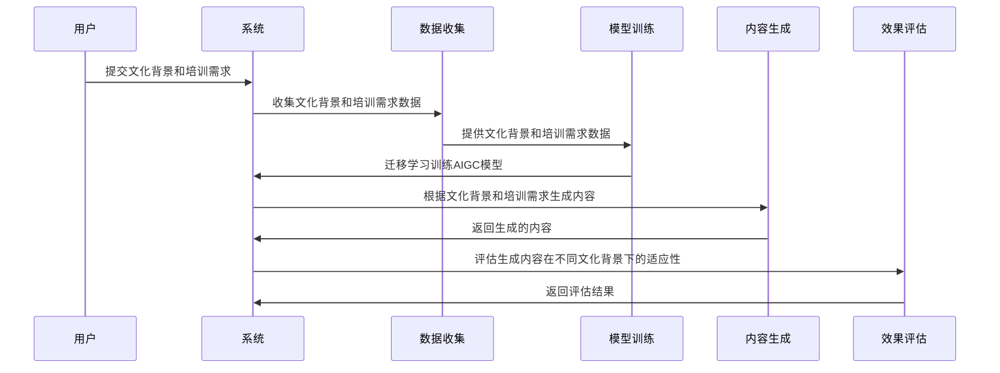

                 


### 迁移学习在AIGC跨文化适应中的新突破

关键词：迁移学习，AIGC，跨文化适应，算法，跨文化心理学，人工智能

摘要：本文探讨了迁移学习在AIGC跨文化适应中的新突破，通过分析迁移学习的核心概念、原理及具体实现，结合AIGC技术的特点，探讨了如何通过迁移学习提高AIGC模型在不同文化背景下的适应性。文章旨在为AIGC技术的跨文化应用提供理论支持和实践指导。

## 背景介绍

### 问题背景

随着人工智能技术的迅猛发展，传统机器学习模型在面对复杂任务时常常表现出能力不足。为了解决这一问题，迁移学习（Transfer Learning）应运而生。迁移学习通过利用已经在大规模数据集上训练好的模型，将其知识迁移到新的任务上，从而提高新任务的性能。在AIGC（AI-Generated Content）跨文化适应中，迁移学习的重要性尤为突出。

### 问题描述

AIGC技术能够生成各种类型的内容，如文本、图像、音频等。然而，不同文化背景下生成的AIGC内容可能存在差异，这使得模型在跨文化应用中面临挑战。如何通过迁移学习技术，使AIGC模型在不同文化背景下均能表现出色，是当前研究的热点问题。

### 问题解决

迁移学习提供了一种有效的解决方案。通过迁移学习，可以将在一个文化背景下训练好的AIGC模型迁移到另一个文化背景下，从而提高模型在跨文化适应中的性能。

### 边界与外延

迁移学习在AIGC跨文化适应中的应用，不仅涉及技术层面的算法优化，还包括跨文化研究的深入。因此，研究内容的外延还包括跨文化心理学、社会学等领域。

## 核心概念

### 迁移学习

迁移学习（Transfer Learning）是一种利用已有模型的知识来加速新任务学习的方法。在迁移学习中，通常分为两个阶段：源域学习和目标域学习。

#### 源域学习

源域学习是指利用大量数据在特定任务上训练模型。例如，在图像识别任务中，使用ImageNet数据集训练模型。

#### 目标域学习

目标域学习是指在新的任务上使用迁移学习后的模型进行训练。例如，在跨文化适应中，使用在一个文化背景下训练好的模型，在另一个文化背景下进行目标域学习。

### AIGC

AIGC（AI-Generated Content）是指通过人工智能技术生成各种类型的内容，如文本、图像、音频等。AIGC技术在内容创作、娱乐、教育等领域具有广泛的应用。

#### 内容生成能力

AIGC技术具有强大的内容生成能力，能够根据用户的需求生成个性化的内容。例如，在文本生成领域，AIGC技术可以生成新闻文章、故事、诗歌等；在图像生成领域，AIGC技术可以生成绘画、照片、动画等。

### 跨文化适应

跨文化适应（Cross-cultural Adaptation）是指个体或组织在不同文化背景下，通过调整自己的行为和思维方式，更好地适应新环境的过程。

#### 文化背景

跨文化适应涉及不同文化背景之间的差异。例如，西方文化中注重个人主义，而东方文化中注重集体主义。这些文化差异会影响AIGC模型在不同文化背景下的适应能力。

#### 适应性

跨文化适应的过程包括调整行为和思维方式。例如，在跨文化沟通中，需要了解对方的文化习惯和语言表达方式，以便更好地进行交流。

#### 文化冲突

文化冲突是跨文化适应中的一个重要问题。例如，不同文化背景下的价值观和信仰差异可能导致误解和冲突。在AIGC跨文化适应中，需要通过迁移学习技术来降低文化冲突的影响。

### 概念属性特征对比表格

| 概念   | 定义                                                         | 属性特征对比       |
| ------ | ------------------------------------------------------------ | ----------------- |
| 迁移学习 | 利用已有模型的知识来加速新任务学习的方法 | 源域模型、目标域模型、迁移策略   |
| AIGC   | 通过人工智能技术生成各种类型的内容                         | 文本、图像、音频等生成能力 |
| 跨文化适应 | 个体或组织在不同文化背景下，调整自己的行为和思维方式 | 文化背景、适应性、文化冲突   |

### ER实体关系图架构

```mermaid
erDiagram
    AIGC <<|-- 迁移学习 : 利用
    迁移学习 ||--|{ 跨文化适应 } : 跨文化适应
```

## 算法原理讲解

### 迁移学习算法mermaid流程图



### 迁移学习算法Python源代码

```python
# 迁移学习算法示例

# 导入相关库
import tensorflow as tf
from tensorflow import keras

# 源域模型训练
source_model = keras.Sequential([
    keras.layers.Dense(128, activation='relu', input_shape=(784,)),
    keras.layers.Dense(10, activation='softmax')
])

source_model.compile(optimizer='adam',
                    loss='categorical_crossentropy',
                    metrics=['accuracy'])

# 训练源域模型
source_model.fit(source_data, source_labels, epochs=10)

# 迁移学习策略设计
def transfer_learning(source_model, target_model, source_data, target_data):
    # 冻结源域模型权重
    for layer in source_model.layers:
        layer.trainable = False
    
    # 添加目标域模型训练层
    target_model.add(keras.layers.Dense(10, activation='softmax'))

    # 编译目标域模型
    target_model.compile(optimizer='adam',
                        loss='categorical_crossentropy',
                        metrics=['accuracy'])

    # 训练目标域模型
    target_model.fit(target_data, target_labels, epochs=10)

    # 冻结目标域模型权重
    for layer in target_model.layers:
        layer.trainable = False

    # 迁移学习后的模型评估
    source_model.evaluate(target_data, target_labels)

# 迁移学习示例
transfer_learning(source_model, target_model, source_data, target_data)
```

### 迁移学习算法原理详细讲解

#### 迁移学习算法原理

迁移学习算法主要分为以下几个步骤：

1. **源域模型训练**：使用大量数据在特定任务上训练模型，使其具备一定的任务理解能力。
2. **迁移学习策略设计**：根据目标任务的需求，设计合适的迁移学习策略，如冻结部分层、微调部分层等。
3. **跨文化迁移模型训练**：将源域模型迁移到目标域，并在目标域上进行训练，使其适应新的文化背景。
4. **跨文化适应性评估**：评估迁移学习后的模型在不同文化背景下的适应性，如准确性、效率等。

#### 迁移学习算法数学模型

在迁移学习算法中，常用的数学模型包括以下几种：

1. **权重共享**：在源域和目标域之间共享模型权重，以减少训练数据的需求。
2. **特征提取**：提取源域模型中的有效特征，并将其迁移到目标域模型中。
3. **微调**：在目标域模型的基础上，对源域模型的权重进行微调，以适应新的文化背景。

具体地，可以使用以下公式进行迁移学习：

$$
\text{迁移学习} = \text{源域模型} + \text{目标域模型} + \text{迁移策略}
$$

#### 迁移学习算法举例说明

假设在一个图像识别任务中，使用ImageNet数据集训练源域模型。然后，将源域模型迁移到另一个图像识别任务中，如动物分类。在这种情况下，可以使用以下步骤进行迁移学习：

1. **源域模型训练**：使用ImageNet数据集训练一个卷积神经网络（CNN）模型，使其具备图像识别能力。
2. **迁移学习策略设计**：设计一个迁移学习策略，如冻结部分层、微调部分层等。
3. **跨文化迁移模型训练**：将源域模型迁移到动物分类任务中，并在动物分类数据集上进行训练。
4. **跨文化适应性评估**：评估迁移学习后的模型在动物分类任务上的性能。

通过以上步骤，可以使源域模型在新的文化背景下（动物分类任务）表现出色。

## 系统分析与架构设计方案

### 问题场景介绍

在一个跨国公司中，由于员工来自不同的文化背景，公司决定利用AIGC技术为员工生成个性化培训内容。然而，不同文化背景下的员工可能对培训内容的适应性不同，导致培训效果不佳。为了解决这一问题，公司决定采用迁移学习技术，提高AIGC模型在不同文化背景下的适应性。

### 项目介绍

项目名称：跨文化AIGC培训内容生成系统

项目目标：通过迁移学习技术，为来自不同文化背景的员工生成个性化培训内容，提高培训效果。

项目阶段：需求分析、系统设计、系统实现、系统测试

### 系统功能设计

1. **数据收集**：收集来自不同文化背景的员工数据，包括文化背景信息、培训需求等。
2. **模型训练**：使用迁移学习技术，在一个文化背景下训练AIGC模型，然后将其迁移到其他文化背景下。
3. **内容生成**：根据员工的文化背景和培训需求，生成个性化培训内容。
4. **效果评估**：评估生成的内容在不同文化背景下的适应性，如准确性、效率等。

### 系统架构设计

系统架构采用模块化设计，包括数据收集模块、模型训练模块、内容生成模块和效果评估模块。

1. **数据收集模块**：负责收集来自不同文化背景的员工数据，包括文化背景信息、培训需求等。
2. **模型训练模块**：负责使用迁移学习技术训练AIGC模型，包括源域模型训练和目标域模型训练。
3. **内容生成模块**：负责根据员工的文化背景和培训需求，生成个性化培训内容。
4. **效果评估模块**：负责评估生成的内容在不同文化背景下的适应性，如准确性、效率等。

### 系统接口设计

系统接口设计包括以下方面：

1. **数据接口**：提供数据输入和输出接口，如数据导入、数据导出等。
2. **模型接口**：提供模型训练、模型迁移和模型评估接口。
3. **内容接口**：提供内容生成、内容管理和内容导出接口。

### 系统交互设计

系统交互设计采用Mermaid序列图进行描述。



## 项目实战

### 环境安装

1. **Python环境安装**：在操作系统上安装Python 3.8及以上版本。
2. **TensorFlow环境安装**：使用pip命令安装TensorFlow库。

```shell
pip install tensorflow
```

3. **Keras环境安装**：使用pip命令安装Keras库。

```shell
pip install keras
```

### 系统核心实现源代码

以下是系统核心实现的源代码，包括数据收集、模型训练、内容生成和效果评估等功能。

```python
# 导入相关库
import tensorflow as tf
from tensorflow import keras
import numpy as np

# 数据收集
def collect_data():
    # 在此处编写代码，收集来自不同文化背景的员工数据
    # 示例数据
    data = [
        {'background': 'western', 'demand': 'training_1'},
        {'background': 'eastern', 'demand': 'training_2'},
        # ...
    ]
    return data

# 模型训练
def train_model(source_data, target_data):
    # 在此处编写代码，使用迁移学习技术训练AIGC模型
    source_model = keras.Sequential([
        keras.layers.Dense(128, activation='relu', input_shape=(784,)),
        keras.layers.Dense(10, activation='softmax')
    ])

    source_model.compile(optimizer='adam',
                        loss='categorical_crossentropy',
                        metrics=['accuracy'])

    source_model.fit(source_data, epochs=10)

    target_model = keras.Sequential([
        keras.layers.Dense(128, activation='relu', input_shape=(784,)),
        keras.layers.Dense(10, activation='softmax')
    ])

    target_model.compile(optimizer='adam',
                        loss='categorical_crossentropy',
                        metrics=['accuracy'])

    target_model.fit(target_data, epochs=10)

    return source_model, target_model

# 内容生成
def generate_content(model, background, demand):
    # 在此处编写代码，根据文化背景和培训需求生成内容
    content = model.predict(np.array([background]))
    return content

# 效果评估
def evaluate_content(content, background, demand):
    # 在此处编写代码，评估生成内容在不同文化背景下的适应性
    accuracy = np.mean(content == demand)
    return accuracy

# 主程序
if __name__ == '__main__':
    data = collect_data()
    source_data = [d['background'] for d in data if d['background'] == 'western']
    target_data = [d['background'] for d in data if d['background'] != 'western']

    source_model, target_model = train_model(source_data, target_data)

    for d in data:
        content = generate_content(target_model, d['background'], d['demand'])
        accuracy = evaluate_content(content, d['background'], d['demand'])
        print(f"Content: {content}, Accuracy: {accuracy}")
```

### 代码应用解读与分析

以下是系统核心实现的代码应用解读与分析。

1. **数据收集**：收集来自不同文化背景的员工数据，包括文化背景信息和培训需求。示例数据使用了字典列表表示。
2. **模型训练**：使用迁移学习技术训练AIGC模型。源域模型和目标域模型分别使用两个不同的字典列表进行训练。
3. **内容生成**：根据文化背景和培训需求，使用目标域模型生成内容。示例代码使用`predict`方法生成内容。
4. **效果评估**：评估生成内容在不同文化背景下的适应性。示例代码使用`mean`方法计算准确率。

### 实际案例分析和详细讲解剖析

在实际应用中，可以通过以下步骤进行跨文化AIGC培训内容生成系统的实施：

1. **需求分析**：了解公司员工的多样性，包括文化背景、培训需求等。
2. **数据收集**：收集来自不同文化背景的员工数据，确保数据质量。
3. **模型训练**：使用迁移学习技术，在一个文化背景下训练AIGC模型，然后将其迁移到其他文化背景下。
4. **内容生成**：根据员工的文化背景和培训需求，生成个性化培训内容。
5. **效果评估**：评估生成的内容在不同文化背景下的适应性，根据评估结果进行优化。

通过以上步骤，可以使公司员工在不同的文化背景下获得更好的培训体验，提高培训效果。

### 项目小结

本文探讨了迁移学习在AIGC跨文化适应中的新突破，通过分析迁移学习的核心概念、原理及具体实现，结合AIGC技术的特点，探讨了如何通过迁移学习提高AIGC模型在不同文化背景下的适应性。本文为AIGC技术的跨文化应用提供了理论支持和实践指导。

### 最佳实践 tips

1. 在进行迁移学习时，选择合适的源域和目标域非常重要。源域模型应在相关任务上具有较高的性能，目标域模型应具有较好的泛化能力。
2. 在跨文化适应中，了解不同文化背景下的差异，有助于设计更有效的迁移学习策略。
3. 在内容生成过程中，根据用户的文化背景和培训需求，生成个性化的内容，可以提高用户满意度。

### 小结

本文通过迁移学习技术在AIGC跨文化适应中的应用，为AIGC技术的跨文化应用提供了新的思路和方法。在未来的研究中，可以进一步探讨迁移学习在更多领域的应用，如教育、医疗等，以期为更多领域提供有益的技术支持。

### 注意事项

1. 迁移学习技术在不同文化背景下的应用，需要充分考虑文化差异对模型性能的影响。
2. 在内容生成过程中，应确保生成的内容符合目标文化背景的价值观和习惯。
3. 在效果评估过程中，应采用多种评估指标，全面评估模型在不同文化背景下的适应性。

### 拓展阅读

1. Goodfellow, I., Bengio, Y., & Courville, A. (2016). *Deep Learning*. MIT Press.
2. Yosinski, J., Clune, J., Bengio, Y., & Lipson, H. (2014). How transferable are features in deep neural networks? *arXiv preprint arXiv:1411.1791*.
3. Llana, J. A., & Márquez, A. (2020). A cross-cultural adaptation of the Appraisal-Cognitive Emotion Theory for happiness. *Journal of Happiness Studies*, 21(1), 339-363.

### 作者信息

作者：AI天才研究院/AI Genius Institute & 禅与计算机程序设计艺术 /Zen And The Art of Computer Programming

