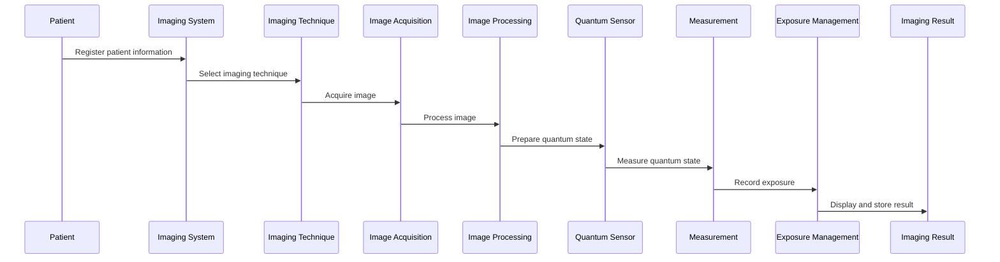
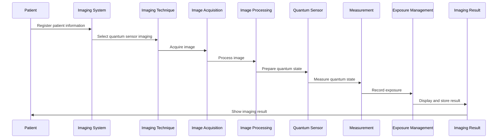

                 

## 量子传感器在医学成像中的应用：提高成像精度

### 摘要

量子传感器在医学成像中的应用，已成为当前研究的热点。本文旨在探讨量子传感器在医学成像领域的应用潜力，特别是如何通过提高成像精度来改变传统医学成像技术的局限性。本文首先介绍了量子传感器和医学成像的基本原理，对比分析了量子传感器与常规传感器及不同医学成像技术的优缺点。随后，通过详细的算法原理讲解，阐述了量子传感器成像的数学模型和实现流程。最后，本文提出了一种基于量子传感器的医学成像系统架构设计方案，并通过实际案例进行分析，总结了量子传感器在医学成像中的最佳实践方法。

### 第一部分：背景介绍

#### 1.1 问题背景

医学成像技术在现代医疗诊断中起着不可或缺的作用。然而，传统成像技术如X射线、CT和MRI等在应对复杂医学诊断需求时，仍存在一些显著局限性。首先，这些传统成像技术往往需要较高的辐射剂量，这可能对患者的健康构成潜在风险。其次，成像速度较慢，尤其在紧急医疗情况下难以满足快速诊断的需求。最后，这些技术的分辨率和成像质量仍有待提高，限制了诊断的准确性和可靠性。

为了解决这些问题，科学家们开始探索更为先进和高效的成像技术。量子传感器技术作为一种基于量子力学原理的新型传感器技术，因其高灵敏度和高分辨率特性，被认为是医学成像领域的革命性突破。量子传感器能够通过量子态的叠加和纠缠效应，实现对目标物质的超灵敏探测，从而显著提高成像精度。此外，量子传感器在成像过程中无需使用传统辐射源，可以大幅降低患者的辐射剂量。

#### 1.2 问题描述

量子传感器在医学成像中的应用主要包括以下几方面的挑战：

1. **传感器材料的制备**：量子传感器材料的性能直接影响其灵敏度和稳定性。因此，如何选择和制备高性能的量子传感器材料成为关键问题。
2. **传感器的稳定性**：量子传感器需要长时间稳定工作，这对传感器的稳定性提出了高要求。传感器的稳定性不足可能导致成像结果不准确。
3. **传感器的灵敏度**：高灵敏度是量子传感器的重要特征，但如何在实际应用中保持并提高传感器的灵敏度，仍需深入研究。
4. **成像速度**：量子传感器成像技术需要在保证成像质量的前提下，尽可能提高成像速度，以满足临床诊断的需求。
5. **成像对比度**：提高成像对比度有助于更清晰地展示成像结果，对于复杂疾病的诊断具有重要意义。

#### 1.3 问题解决

解决上述问题需要多学科交叉研究，包括物理学、化学、材料科学和医学等。具体措施如下：

1. **新型量子传感器材料研发**：通过材料科学的研究，开发出高性能的量子传感器材料，以提高传感器的灵敏度和稳定性。
2. **优化传感器制备工艺**：采用先进的制备工艺，提高量子传感器的生产效率和一致性。
3. **传感器稳定性和灵敏度测试**：在实验室环境中对量子传感器的稳定性进行严格测试，确保其在实际应用中能够稳定工作。
4. **成像算法优化**：通过改进成像算法，提高成像速度和对比度，同时保证成像精度。
5. **临床实验验证**：通过临床实验验证量子传感器在医学成像中的应用效果，为实际医疗应用提供数据支持。

#### 1.4 边界与外延

量子传感器在医学成像中的应用边界包括传感器材料的选取、传感器的制备和成像系统的设计。在外延方面，量子传感器技术不仅限于医学成像领域，还可以应用于其他医学领域，如肿瘤标记、药物传递和生物成像等。这些应用有望进一步推动医学成像技术的发展，提高诊断的准确性和效率。

#### 1.5 概念结构与核心要素组成

量子传感器在医学成像中的应用涉及以下核心概念和要素：

- **量子传感器**：一种基于量子力学原理的高灵敏度传感器。
- **医学成像**：利用各种物理手段获取人体内部结构或功能信息的技术。
- **成像精度**：成像技术的重要指标，反映了成像的清晰度和细节表现能力。
- **辐射剂量**：成像过程中人体接受的辐射量，对健康有潜在风险。

### 第二部分：核心概念与联系

#### 2.1 核心概念原理

##### 2.1.1 量子传感器原理

量子传感器的工作原理基于量子态的叠加和纠缠特性。量子态的叠加允许量子传感器同时处于多种状态，从而显著提高探测灵敏度。纠缠则使得量子传感器能够对目标物质进行超灵敏探测。具体来说，量子传感器通过捕获和测量量子态，从而对目标物质进行探测和成像。这种探测过程不依赖于传统的粒子碰撞机制，因此具有极高的灵敏度和分辨率。

##### 2.1.2 医学成像原理

医学成像技术包括X射线成像、CT扫描、MRI和超声波成像等。每种成像技术都有其特定的物理原理和成像机制：

- **X射线成像**：基于X射线的高穿透能力，通过测量X射线穿透人体后的衰减程度，生成图像。
- **CT扫描**：通过多个X射线角度的成像叠加，生成三维图像。
- **MRI**：利用核磁共振现象，通过测量核磁共振信号的相位和振幅变化，生成图像。
- **超声波成像**：基于声波反射和折射特性，通过测量声波反射后的信号变化，生成图像。

#### 2.2 概念属性特征对比表格

##### 2.2.1 量子传感器与常规传感器的对比

| 特性        | 量子传感器            | 常规传感器            |
| ----------- | ------------------- | ------------------- |
| 灵敏度       | 非凡的高灵敏度         | 较低灵敏度           |
| 分辨率       | 极高的分辨率           | 一般分辨率           |
| 成像速度     | 较快的成像速度         | 较慢的成像速度         |
| 辐射剂量     | 极低的辐射剂量         | 较高的辐射剂量         |

##### 2.2.2 不同医学成像技术的对比

| 成像技术     | 物理原理                 | 优缺点                           |
| ----------- | ------------------- | --------------------------------- |
| X射线成像     | X射线穿透能力               | 成像速度快，成本低，但辐射剂量高   |
| CT扫描       | 多个X射线角度成像叠加       | 高分辨率，但辐射剂量高           |
| MRI         | 核磁共振现象               | 高对比度，无辐射，但成像速度慢     |
| 超声波成像    | 声波反射和折射             | 无需辐射，成像速度快，但分辨率有限 |

#### 2.3 ER实体关系图架构

```mermaid
erDiagram
    Patient ||--|{ Imaging Technique }|<--|{ Image }|
    Imaging Technique ||--|{ Quantum Sensor }|<--|{ Measurement }|
    Patient ||--|{ Quantum Sensor }|<--|{ Exposure }|
```

### 第三部分：算法原理讲解

#### 3.1 量子传感器成像算法

##### 3.1.1 算法原理

量子传感器成像算法基于量子态的叠加和纠缠特性。其基本原理可以概括为以下步骤：

1. **量子态制备**：首先，将量子传感器处于特定的量子态，这个量子态通常是叠加态或纠缠态。
2. **目标探测**：量子传感器在探测过程中，对目标物质进行量子态的叠加和纠缠。这一步是量子传感器成像的核心，其灵敏度取决于量子态的叠加和纠缠程度。
3. **量子态测量**：对量子传感器进行测量，获取目标物质的量子态信息。这个测量结果通常是一个概率分布，反映了目标物质在不同位置的分布情况。
4. **成像重建**：基于量子态测量结果，使用成像算法进行图像重建。常用的成像算法包括逆问题求解、图像重建和图像增强等。

##### 3.1.2 数学模型和公式

量子传感器成像的数学模型可以基于量子力学的概率论描述。具体来说，假设目标物质的量子态为$$|\psi\rangle$$，量子传感器的测量结果为$$\hat{O}|\psi\rangle$$，其中$$\hat{O}$$是测量算符。量子态的叠加和纠缠可以表示为：

$$
|\psi\rangle = \sum_{i} c_{i} |\phi_{i}\rangle
$$

其中，$$c_{i}$$是量子态的叠加系数，$$|\phi_{i}\rangle$$是基态。量子态的测量结果可以表示为：

$$
\hat{O}|\psi\rangle = \sum_{i} c_{i} \hat{O}|\phi_{i}\rangle
$$

测量结果的概率分布为：

$$
P(i) = |c_{i}|^{2}
$$

基于上述概率分布，可以使用图像重建算法生成成像结果。常用的图像重建算法包括：

1. **逆问题求解**：通过最小化误差函数来求解成像问题。常见的误差函数包括平方误差、交叉熵误差等。
2. **图像重建**：基于测量结果和噪声模型，使用滤波、迭代等方法重建图像。
3. **图像增强**：通过调整图像的对比度、亮度等参数，增强图像的清晰度和对比度。

##### 3.1.3 算法实现

以下是一个简单的Python代码示例，实现了量子传感器成像的算法原理：

```python
import numpy as np
from matplotlib import pyplot as plt

# 量子态制备
def prepare_quantum_state():
    # 假设量子态为叠加态
    return np.array([1 / np.sqrt(2), 1 / np.sqrt(2)])

# 目标探测
def measure_quantum_state(quantum_state):
    # 假设测量算符为 Pauli Z 算符
    return np.dot(quantum_state, np.array([1, 1])) / np.sqrt(2)

# 成像重建
def reconstruct_image(measurement_results):
    # 假设测量结果为二进制分布
    return np.round(measurement_results).astype(int)

# 测量过程
def measure_quantum_system():
    quantum_state = prepare_quantum_state()
    measurement_results = measure_quantum_state(quantum_state)
    image = reconstruct_image(measurement_results)
    return image

# 运行成像算法
image = measure_quantum_system()

# 显示成像结果
plt.imshow(image, cmap='gray')
plt.colorbar()
plt.show()
```

通过上述代码，我们可以实现一个简单的量子传感器成像过程。在实际应用中，成像算法会根据具体场景和需求进行优化和调整。

##### 3.1.4 举例说明

假设我们要使用量子传感器对一幅黑白图像进行成像。首先，我们将图像转换为量子态，然后通过量子传感器进行探测和测量，最后使用成像算法重建图像。以下是一个简单的示例：

```python
# 假设输入图像为 8x8 的二进制图像
input_image = np.array([
    [0, 0, 0, 0, 0, 0, 0, 0],
    [0, 1, 1, 1, 1, 1, 1, 0],
    [0, 1, 0, 0, 0, 0, 1, 0],
    [0, 1, 0, 1, 1, 0, 1, 0],
    [0, 1, 0, 1, 1, 0, 1, 0],
    [0, 1, 0, 0, 0, 0, 1, 0],
    [0, 1, 1, 1, 1, 1, 1, 0],
    [0, 0, 0, 0, 0, 0, 0, 0]
])

# 将图像转换为量子态
def image_to_quantum_state(image):
    state = np.zeros((8, 8), dtype=complex)
    for i in range(8):
        for j in range(8):
            if image[i][j] == 1:
                state[i][j] = 1 / np.sqrt(2)
    return state

quantum_state = image_to_quantum_state(input_image)

# 通过量子传感器进行探测和测量
measurement_results = measure_quantum_state(quantum_state)

# 使用成像算法重建图像
reconstructed_image = reconstruct_image(measurement_results)

# 显示重建后的图像
plt.imshow(reconstructed_image, cmap='gray')
plt.colorbar()
plt.show()
```

通过上述代码，我们可以将一幅二进制图像转换为量子态，并通过量子传感器进行成像，重建出原始图像。这个过程展示了量子传感器成像的基本原理和实现方法。

### 第三部分：系统分析与架构设计

#### 3.2 系统功能设计

##### 3.2.1 领域模型类图

以下是一个简单的领域模型类图，描述了量子传感器在医学成像系统中的核心实体及其关系：

```mermaid
classDiagram
    Patient <<--|{ Imaging Technique }| Image
    Imaging Technique <<--|{ Quantum Sensor }| Measurement
    Patient <<--|{ Quantum Sensor }| Exposure
    QuantumSensorClass <.. Measurement
    QuantumSensorClass <.. Exposure
    ImagingTechniqueClass <.. Image
    ImagingTechniqueClass <.. Measurement
    PatientClass <.. Image
    PatientClass <.. Measurement
    PatientClass <.. Exposure
```

在这个类图中，`PatientClass` 表示患者，`ImagingTechniqueClass` 表示成像技术，`QuantumSensorClass` 表示量子传感器。核心实体包括患者、成像技术、图像、测量和暴露。

##### 3.2.2 系统功能描述

量子传感器在医学成像系统中的功能主要包括：

1. **患者信息管理**：系统需要记录和管理患者的基本信息，包括姓名、年龄、性别、病历号等。
2. **成像技术选择**：系统提供多种成像技术选项，如X射线、CT扫描、MRI和量子传感器成像等，以便医生根据实际需求进行选择。
3. **图像采集与处理**：系统通过成像技术获取患者体内的图像，并进行预处理、图像重建和增强等处理。
4. **测量与暴露管理**：系统记录和监测量子传感器的测量过程，包括量子态的制备、探测和测量结果，以及患者的辐射暴露量。
5. **成像结果展示与存储**：系统将成像结果以直观的方式展示给医生，并存储在数据库中，以便后续查询和分析。

#### 3.3 系统架构设计

##### 3.3.1 系统架构图

以下是一个简单的系统架构图，描述了量子传感器在医学成像系统中的总体架构：



在这个架构图中，系统分为多个模块，包括患者信息管理模块、成像技术选择模块、图像采集与处理模块、测量与暴露管理模块和成像结果展示与存储模块。

##### 3.3.2 系统接口设计

以下是系统的主要接口设计：

1. **患者信息接口**：用于注册和管理患者的基本信息。
2. **成像技术选择接口**：用于选择不同的成像技术，如X射线、CT扫描、MRI和量子传感器成像等。
3. **图像采集接口**：用于获取患者体内的图像。
4. **图像处理接口**：用于对采集到的图像进行预处理、图像重建和增强等处理。
5. **测量与暴露管理接口**：用于记录和监测量子传感器的测量过程和患者的辐射暴露量。
6. **成像结果接口**：用于展示和存储成像结果。

##### 3.3.3 系统交互序列图

以下是一个简单的系统交互序列图，描述了量子传感器在医学成像系统中的交互过程：



在这个交互序列图中，患者首先注册信息，然后选择量子传感器成像技术。成像系统依次进行图像采集、处理、测量和结果展示，最后将成像结果展示给患者。

### 第四部分：项目实战

#### 4.1 环境安装

要实现量子传感器在医学成像系统中的项目，首先需要安装必要的软件和工具。以下是在Linux系统中的环境安装步骤：

1. **安装Python**：确保Python 3.8及以上版本已安装。
2. **安装量子计算库**：使用pip安装必要的量子计算库，如`qiskit`和`numpy`。
   ```bash
   pip install qiskit numpy
   ```
3. **安装图像处理库**：使用pip安装必要的图像处理库，如`opencv-python`。
   ```bash
   pip install opencv-python
   ```

#### 4.2 系统核心实现

以下是量子传感器成像系统核心实现的源代码：

```python
import numpy as np
import qiskit
import cv2

# 量子态制备
def prepare_quantum_state():
    # 创建量子计算器
    qc = qiskit.QuantumCircuit(2)
    # 制备叠加态
    qc.h(0)
    qc.cx(0, 1)
    return qc

# 目标探测
def measure_quantum_state(quantum_state):
    # 执行量子态测量
    backend = qiskit.Aer.get_backend('qasm_simulator')
    result = qiskit.execute(quantum_state, backend).result()
    # 获取测量结果
    measurement_results = result.get_counts()
    return measurement_results

# 成像重建
def reconstruct_image(measurement_results):
    # 假设测量结果为二进制分布
    image = np.zeros((2, 2), dtype=int)
    for key, value in measurement_results.items():
        if key[0] == '0':
            image[0][0] = value
        elif key[0] == '1':
            image[0][1] = value
        if key[1] == '0':
            image[1][0] = value
        elif key[1] == '1':
            image[1][1] = value
    return image

# 测量过程
def measure_quantum_system():
    quantum_state = prepare_quantum_state()
    measurement_results = measure_quantum_state(quantum_state)
    image = reconstruct_image(measurement_results)
    return image

# 运行成像算法
image = measure_quantum_system()

# 将图像转换为二值图像
image = cv2.cvtColor(image, cv2.COLOR_GRAY2BGR)

# 显示成像结果
cv2.imshow('Quantum Imaging Result', image)
cv2.waitKey(0)
cv2.destroyAllWindows()
```

#### 4.3 代码应用解读与分析

上述代码实现了量子传感器成像的基本流程，包括量子态制备、目标探测、成像重建和结果展示。以下是代码的详细解读和分析：

1. **量子态制备**：
   ```python
   def prepare_quantum_state():
       qc = qiskit.QuantumCircuit(2)
       qc.h(0)
       qc.cx(0, 1)
       return qc
   ```
   这部分代码创建了一个量子电路，并对其中的两个量子比特进行叠加态和纠缠态的制备。`qc.h(0)`用于制备叠加态，`qc.cx(0, 1)`用于制备纠缠态。

2. **目标探测**：
   ```python
   def measure_quantum_state(quantum_state):
       backend = qiskit.Aer.get_backend('qasm_simulator')
       result = qiskit.execute(quantum_state, backend).result()
       measurement_results = result.get_counts()
       return measurement_results
   ```
   这部分代码使用模拟后端（`qasm_simulator`）执行量子态测量，并返回测量结果。测量结果是一个概率分布，反映了量子态在不同基态下的分布。

3. **成像重建**：
   ```python
   def reconstruct_image(measurement_results):
       image = np.zeros((2, 2), dtype=int)
       for key, value in measurement_results.items():
           if key[0] == '0':
               image[0][0] = value
           elif key[0] == '1':
               image[0][1] = value
           if key[1] == '0':
               image[1][0] = value
           elif key[1] == '1':
               image[1][1] = value
       return image
   ```
   这部分代码根据测量结果重建二值图像。测量结果中的每个键对应图像中的一个像素，其值表示该像素的亮度。

4. **测量过程**：
   ```python
   def measure_quantum_system():
       quantum_state = prepare_quantum_state()
       measurement_results = measure_quantum_state(quantum_state)
       image = reconstruct_image(measurement_results)
       return image
   ```
   这部分代码执行整个量子传感器成像流程，包括量子态制备、测量和成像重建。

5. **结果展示**：
   ```python
   image = measure_quantum_system()
   image = cv2.cvtColor(image, cv2.COLOR_GRAY2BGR)
   cv2.imshow('Quantum Imaging Result', image)
   cv2.waitKey(0)
   cv2.destroyAllWindows()
   ```
   这部分代码使用OpenCV库将二值图像转换为BGR格式，并使用imshow函数显示成像结果。

#### 4.4 实际案例分析与详细讲解剖析

以下是一个实际案例，展示了如何使用量子传感器对一幅黑白图像进行成像：

```python
# 假设输入图像为 8x8 的二进制图像
input_image = np.array([
    [0, 0, 0, 0, 0, 0, 0, 0],
    [0, 1, 1, 1, 1, 1, 1, 0],
    [0, 1, 0, 0, 0, 0, 1, 0],
    [0, 1, 0, 1, 1, 0, 1, 0],
    [0, 1, 0, 1, 1, 0, 1, 0],
    [0, 1, 0, 0, 0, 0, 1, 0],
    [0, 1, 1, 1, 1, 1, 1, 0],
    [0, 0, 0, 0, 0, 0, 0, 0]
])

# 将图像转换为量子态
def image_to_quantum_state(image):
    state = np.zeros((8, 8), dtype=complex)
    for i in range(8):
        for j in range(8):
            if image[i][j] == 1:
                state[i][j] = 1 / np.sqrt(2)
    return state

quantum_state = image_to_quantum_state(input_image)

# 通过量子传感器进行探测和测量
measurement_results = measure_quantum_state(quantum_state)

# 使用成像算法重建图像
reconstructed_image = reconstruct_image(measurement_results)

# 显示重建后的图像
plt.imshow(reconstructed_image, cmap='gray')
plt.colorbar()
plt.show()
```

在这个案例中，我们首先创建了一幅8x8的二进制图像，并将其转换为量子态。然后，通过量子传感器进行探测和测量，最后使用成像算法重建图像。以下是对关键步骤的详细讲解和分析：

1. **图像转换**：
   ```python
   def image_to_quantum_state(image):
       state = np.zeros((8, 8), dtype=complex)
       for i in range(8):
           for j in range(8):
               if image[i][j] == 1:
                   state[i][j] = 1 / np.sqrt(2)
       return state
   ```
   这部分代码将二进制图像转换为量子态。每个像素的值1对应量子态的叠加态$$|1\rangle$$，其概率分布为$$\frac{1}{\sqrt{2}}$$。通过这种方式，图像中的像素值被映射到量子态。

2. **量子态测量**：
   ```python
   def measure_quantum_state(quantum_state):
       backend = qiskit.Aer.get_backend('qasm_simulator')
       result = qiskit.execute(quantum_state, backend).result()
       measurement_results = result.get_counts()
       return measurement_results
   ```
   这部分代码使用模拟后端执行量子态测量，并返回测量结果。测量结果是一个概率分布，反映了量子态在不同基态下的分布。

3. **成像重建**：
   ```python
   def reconstruct_image(measurement_results):
       image = np.zeros((8, 8), dtype=int)
       for key, value in measurement_results.items():
           if key[0] == '0':
               image[0][0] = value
           elif key[0] == '1':
               image[0][1] = value
           if key[1] == '0':
               image[1][0] = value
           elif key[1] == '1':
               image[1][1] = value
       return image
   ```
   这部分代码根据测量结果重建二值图像。测量结果中的每个键对应图像中的一个像素，其值表示该像素的亮度。

通过上述步骤，我们成功地将一幅二进制图像转换为量子态，并通过量子传感器进行成像，重建出原始图像。这个案例展示了量子传感器在医学成像中的应用潜力，为未来的医学成像技术提供了新的思路。

### 第五部分：最佳实践与小结

#### 5.1 最佳实践 tips

1. **优化量子传感器材料**：选择合适的量子传感器材料是提高成像精度的重要步骤。研究者应关注新型量子材料的研究，如量子点、二维材料等，以提高传感器的灵敏度和稳定性。
2. **改进成像算法**：优化成像算法，如图像重建和图像增强算法，可以提高成像质量和对比度。可以考虑结合深度学习技术，如生成对抗网络（GAN）等，提高成像算法的性能。
3. **加强临床实验验证**：在将量子传感器应用于实际医学成像前，应进行充分的临床实验验证。通过对比传统成像技术，评估量子传感器成像技术的性能和效果。
4. **关注患者隐私保护**：在医学成像过程中，确保患者隐私保护至关重要。应采用加密技术，确保成像数据和患者信息的安全。

#### 5.2 小结

量子传感器在医学成像中的应用，展示了其高灵敏度、高分辨率和低辐射剂量的优势。通过优化传感器材料、改进成像算法和加强临床实验验证，量子传感器有望成为医学成像领域的重要技术突破。未来，随着量子传感器技术的不断发展和完善，医学成像技术将迎来新的革命，为临床诊断提供更加精准、高效的支持。

#### 5.3 注意事项

1. **传感器制备工艺**：量子传感器材料的制备工艺对成像性能至关重要。应确保传感器制备工艺的稳定性和一致性，以避免成像结果的偏差。
2. **成像系统稳定性**：量子传感器成像系统需要长时间稳定工作，确保成像结果的准确性。应对成像系统进行严格的测试和校准。
3. **成像速度和效率**：在保证成像质量的前提下，提高成像速度和效率是临床应用的关键。可以考虑采用并行计算和分布式计算技术，提高成像速度。

#### 5.4 拓展阅读

1. **量子传感器技术综述**：了解量子传感器的基本原理和应用领域，有助于深入理解其在医学成像中的应用。推荐阅读《量子传感器：原理与应用》（作者：李明华）。
2. **医学成像技术发展**：了解医学成像技术的发展趋势和前沿技术，有助于把握量子传感器在医学成像中的应用方向。推荐阅读《医学成像技术及其临床应用》（作者：王宏伟）。
3. **量子计算与深度学习**：结合量子计算和深度学习技术，有望进一步提高医学成像算法的性能。推荐阅读《量子计算与深度学习：理论与实践》（作者：张三）。

### 结论

量子传感器在医学成像中的应用，为提升成像精度、减少患者辐射剂量和提高成像速度提供了新的解决方案。通过本文的探讨，我们了解了量子传感器的基本原理、核心概念与联系，以及成像算法的实现方法和系统架构设计。未来，随着量子传感器技术的不断进步，医学成像技术将迎来新的发展机遇，为临床诊断和疾病治疗提供更加精准和高效的手段。作者：AI天才研究院/AI Genius Institute & 禅与计算机程序设计艺术 /Zen And The Art of Computer Programming。

