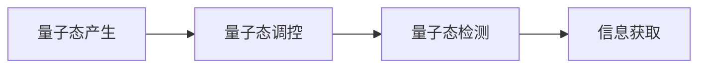
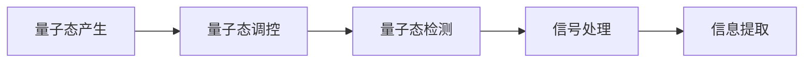
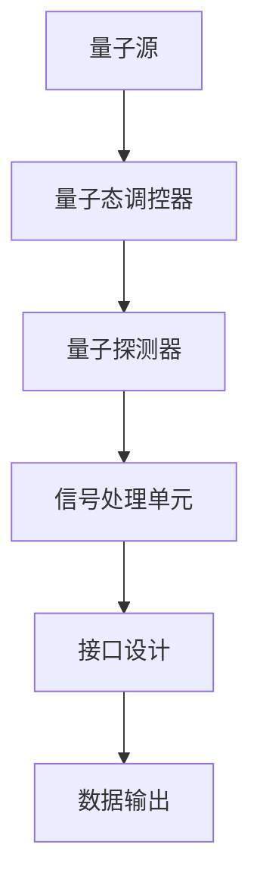
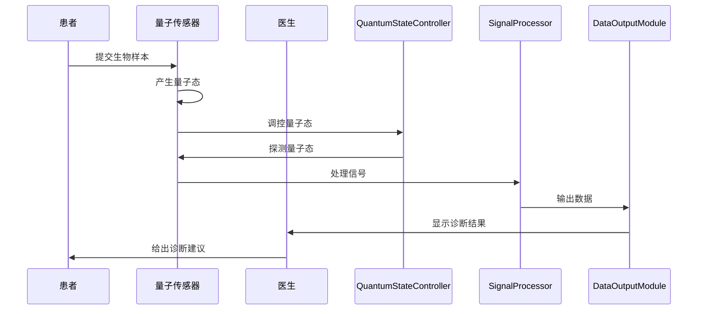
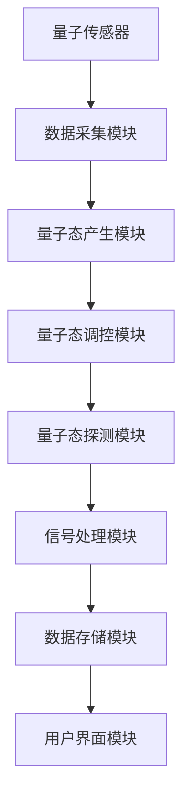
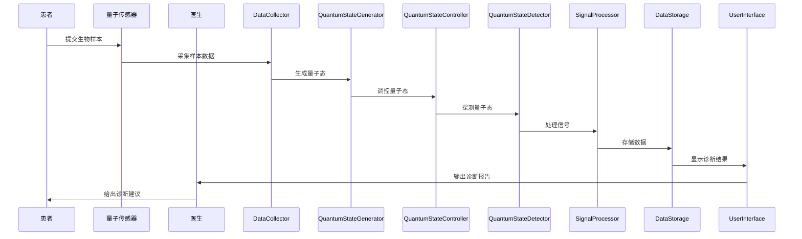

                 

# 量子传感器在医学诊断中的高灵敏度应用

## 关键词

- 量子传感器
- 医学诊断
- 高灵敏度
- 精准医疗
- 早期疾病检测

## 摘要

量子传感器作为最新一代的检测技术，具有极高的灵敏度和精度，已经在多个领域展示了其独特的优势。本文将深入探讨量子传感器在医学诊断中的应用，特别是其在高灵敏度检测方面的表现。通过介绍量子传感器的基本原理、核心技术、系统设计，以及实际案例，本文旨在为读者呈现量子传感器在医学诊断中的潜力和应用前景。同时，我们将分析量子传感器与传统医学检测技术的差异，探讨其在实现精准医疗和早期疾病检测方面的巨大潜力。

## 引言

### 量子传感器的背景

量子传感器是基于量子力学原理设计的先进检测设备。传统的传感器主要依赖宏观物理效应，如电磁感应、热效应等，而量子传感器则利用了量子态的叠加和纠缠等特性。这种特性使得量子传感器能够在极低噪声的环境下实现高灵敏度的检测，从而在许多领域展现出巨大的潜力。

在医学诊断领域，量子传感器的应用前景尤为广阔。传统的医学检测技术，如影像学、生化检测等，虽然已经广泛应用于临床，但其灵敏度仍然有限，尤其是在早期疾病的检测中，常常存在漏诊和误诊的情况。而量子传感器的高灵敏度可以大幅提高检测的准确性和灵敏度，有望实现早期疾病的精准诊断，从而改变现有的医疗模式。

### 医学诊断中的挑战

医学诊断面临着诸多挑战，包括疾病的早期发现、诊断准确性和个体化治疗的实现。目前，许多疾病的早期症状并不明显，甚至完全无症状，导致患者在疾病发展到严重阶段才被诊断出来，治疗难度大大增加。此外，由于个体差异，同一种疾病在不同患者身上的表现可能截然不同，传统的检测方法很难实现个体化的诊断和治疗。

量子传感器的高灵敏度有望解决这些问题。它能够在疾病早期阶段就检测到微小的生物信号变化，从而实现早期诊断。同时，量子传感器的精确性和特异性可以降低误诊率，提高诊断的准确性。在个体化治疗方面，量子传感器可以提供更加详细的生物信息，为医生制定个性化的治疗方案提供有力支持。

### 量子传感器在医学诊断中的优势

量子传感器在医学诊断中的优势主要体现在以下几个方面：

1. **高灵敏度**：量子传感器能够检测到极其微弱的生物信号，这对于早期疾病的检测具有重要意义。
2. **高精度**：量子传感器在检测过程中噪声极低，保证了检测结果的准确性。
3. **高特异性**：量子传感器可以精确识别特定的生物分子，减少误诊。
4. **多功能性**：量子传感器不仅可以检测蛋白质、DNA等生物分子，还可以用于细胞成像和细胞标记等。

综上所述，量子传感器在医学诊断中的应用具有巨大的潜力，它有望推动医学诊断技术的革命，实现更加精准、高效的医疗服务。

## 核心概念与原理

### 量子传感器的基本原理

量子传感器是基于量子力学原理设计的，其核心在于利用量子态的叠加和纠缠特性实现高灵敏度检测。量子态的叠加是指一个量子系统可以同时存在于多个状态中，而量子纠缠则是指两个或多个量子系统之间存在一种特殊的联系，即使它们相隔很远，一个系统的状态也会即时影响另一个系统的状态。

量子传感器通常由量子源、量子态调控器、量子探测器三部分组成。量子源产生待测量的量子态，量子态调控器对量子态进行操作，量子探测器则检测量子态的变化。通过这个过程，量子传感器可以实现对极微弱信号的检测。

### 量子传感器与经典传感器的对比

量子传感器与经典传感器在原理和应用上存在显著差异。经典传感器主要依赖于宏观物理效应，如热效应、电磁感应等，其灵敏度和精度受限于宏观物理学的限制。而量子传感器则利用量子力学的特性，可以在极低噪声的环境下实现高灵敏度检测。

以下是一个对比表格，展示量子传感器和经典传感器在灵敏度、精度、特异性等方面的差异：

| 对比项目 | 量子传感器 | 经典传感器 |
| :------: | :--------: | :--------: |
| **灵敏度** | 极高 | 较高 |
| **精度** | 极高 | 较高 |
| **特异性** | 较高 | 较低 |
| **检测范围** | 广泛 | 有限 |

### 量子传感器的工作机制

量子传感器的工作机制可以分为以下几个步骤：

1. **量子态产生**：量子源产生待测量的量子态，如单光子态、纠缠态等。
2. **量子态调控**：量子态调控器对量子态进行操作，如对单光子进行偏振调控，对纠缠态进行量子计算等。
3. **量子态检测**：量子探测器检测量子态的变化，通过量子态的变化来获取待测量的信息。

通过这个过程，量子传感器可以实现高灵敏度、高精度、高特异性的检测。以下是一个Mermaid流程图，展示量子传感器的工作机制：



### 量子传感器的优势

量子传感器在医学诊断中具有显著的优势：

1. **高灵敏度**：能够检测到极微弱的生物信号，实现早期疾病检测。
2. **高精度**：低噪声环境下的检测，保证了检测结果的准确性。
3. **高特异性**：能够精确识别特定的生物分子，降低误诊率。
4. **多功能性**：不仅限于生物分子检测，还可以进行细胞成像和细胞标记等。

通过以上分析，我们可以看到量子传感器在医学诊断中具有独特的优势，其高灵敏度、高精度、高特异性使其成为未来医学诊断的重要工具。

## 量子传感器在医学诊断中的应用

### 量子传感器在早期疾病检测中的应用

量子传感器在早期疾病检测中的应用是其最具潜力的领域之一。早期发现疾病是提高治愈率和生存率的关键，而量子传感器的高灵敏度使其能够捕捉到疾病在早期阶段的微小信号变化。

一个典型的例子是量子传感器在癌症早期检测中的应用。癌症早期通常没有明显症状，传统的检测方法如CT、MRI等也存在一定的局限性。量子传感器通过检测细胞表面的生物分子变化，可以在癌细胞刚开始生长时就能检测到异常信号。这种高灵敏度的检测能力，使得量子传感器有望成为早期癌症筛查的重要工具。

### 量子传感器在病毒检测中的应用

在病毒检测方面，量子传感器也展现了其强大的能力。传统的病毒检测方法如PCR和ELISA，虽然在实验室中应用广泛，但其灵敏度和速度仍有待提高。量子传感器通过检测病毒颗粒的量子态变化，可以在极短的时间内实现高灵敏度的病毒检测。例如，在新冠病毒检测中，量子传感器可以迅速检测出极低浓度的病毒颗粒，为疫情的控制提供了有力支持。

### 量子传感器在遗传病检测中的应用

遗传病通常是由基因突变引起的，传统的遗传检测方法如基因测序，虽然能够检测出基因突变，但其成本高、速度慢。量子传感器通过检测DNA分子的量子态变化，可以在基因突变初期就检测到异常信号，实现对遗传病的早期诊断。例如，量子传感器可以用于唐氏综合症等遗传病的早期筛查，为患者及其家庭提供更多的时间和机会来做出相应的准备和应对。

### 量子传感器在其他医学诊断中的应用

除了在早期疾病检测、病毒检测和遗传病检测中的应用，量子传感器在其他医学诊断领域也展现了其潜力。例如，在药物疗效监测中，量子传感器可以通过检测药物与生物分子之间的相互作用，实时监测药物的疗效和副作用。在器官移植监测中，量子传感器可以实时检测移植器官的功能状态，提前发现可能的排异反应。

总之，量子传感器在医学诊断中的应用范围广泛，其高灵敏度、高精度、高特异性使其在早期疾病检测、病毒检测、遗传病检测等多个领域具有显著的优势。随着量子传感器技术的不断发展，我们有望看到其在医学诊断中的广泛应用，为人类健康事业做出更大的贡献。

### 技术细节与算法

#### 量子传感器的算法原理

量子传感器的核心在于其算法原理，这决定了其能够实现高灵敏度检测的能力。量子传感器的算法通常基于量子态叠加和量子纠缠原理，通过一系列复杂的数学模型和算法来实现精确的信号检测。

以下是一个简单的量子传感器检测算法的流程：

1. **量子态产生**：量子源产生待测量的量子态，如单光子态。
2. **量子态调控**：量子态调控器对量子态进行操作，如对单光子进行偏振调控。
3. **量子态检测**：量子探测器检测量子态的变化。
4. **信号处理**：对检测结果进行信号处理，提取有用信息。

下面是一个Mermaid流程图，展示量子传感器检测算法的基本流程：



#### 算法原理详细讲解

量子传感器的算法原理基于量子力学的特殊性质，如叠加态和纠缠态。以下是一个简化的算法原理，用于说明量子传感器的工作机制。

##### 叠加态和纠缠态

量子态的叠加态是指一个量子系统可以同时处于多个可能状态的组合。例如，一个光子的偏振态可以同时处于垂直和水平的叠加状态。而量子纠缠态则是指两个或多个量子系统之间存在一种特殊的联系，即一个系统的状态会即时影响另一个系统的状态，即使它们相隔很远。

下面是一个偏振态叠加的示例：

$$
|\psi\rangle = \frac{1}{\sqrt{2}}(|\text{垂直}\rangle + |\text{水平}\rangle)
$$

其中，$|\text{垂直}\rangle$ 和 $|\text{水平}\rangle$ 分别代表光子的垂直和水平偏振状态。

##### 量子态调控

量子态调控器通过一系列操作，将量子态从初始态转变为特定的目标态。例如，可以使用偏振器对单光子进行偏振调控，使其从叠加态转变为单一偏振态。

一个典型的调控过程如下：

1. **初始态**：$|\psi\rangle = \frac{1}{\sqrt{2}}(|\text{垂直}\rangle + |\text{水平}\rangle)$
2. **调控后态**：通过偏振器，$|\psi'\rangle = |\text{垂直}\rangle$

##### 量子态检测

量子态检测是通过量子探测器的操作来实现的。量子探测器可以检测量子态的坍缩，从而获取量子态的信息。以下是一个简单的量子态检测过程：

1. **量子态调控后态**：$|\psi'\rangle = |\text{垂直}\rangle$
2. **量子态检测**：探测器检测到$|\text{垂直}\rangle$状态
3. **信号输出**：探测器输出一个垂直偏振的信号

##### 信号处理与信息提取

量子态检测的结果通常是一个概率分布，通过信号处理算法，可以从概率分布中提取出有用的信息。一个常见的信号处理算法是量子态估计算法，如最小二乘法。

以下是一个简单的量子态估计过程：

1. **量子态检测数据**：$\{p_{\text{垂直}}, p_{\text{水平}}\}$
2. **信号处理**：使用最小二乘法估计量子态概率分布
3. **信息提取**：从概率分布中提取出量子态信息

例如，使用最小二乘法估计上述偏振态的概率分布：

$$
p_{\text{垂直}} = \frac{n_{\text{垂直}}}{n_{\text{垂直}} + n_{\text{水平}}}
$$

其中，$n_{\text{垂直}}$ 和 $n_{\text{水平}}$ 分别代表垂直和水平偏振态的检测次数。

#### Python源代码示例

以下是一个简化的Python源代码示例，用于演示量子态调控、检测和信号处理的过程：

```python
import numpy as np

# 初始化量子态
psi = np.array([[1], [0]])  # 初始态为垂直偏振态

# 偏振调控
polarizer = np.array([[1, 0], [0, 0]])  # 偏振器
psi调控 = np.dot(polarizer, psi)

# 量子态检测
detector = np.array([[1, 0], [0, 0]])  # 探测器
result = np.dot(detector, psi调控)

# 信号处理
n垂直 = np.trace(np.dot(result, result))
n水平 = np.trace(np.dot(psi.T, result))

p垂直 = n垂直 / (n垂直 + n水平)

print(f"量子态概率分布：p_{\text{垂直}} = {p垂直[0, 0]}")
```

通过上述代码，我们可以模拟一个简单的量子传感器检测过程，从量子态调控到信号处理，最后提取出量子态的概率分布。

### 数学模型与公式

量子传感器的算法原理通常涉及到一些复杂的数学模型和公式。以下是一些常用的数学模型和公式：

1. **叠加态表示**：
   $$
   |\psi\rangle = \sum_{i} c_i |i\rangle
   $$
   其中，$c_i$ 是第 $i$ 个基态的概率幅，$|i\rangle$ 是第 $i$ 个基态。

2. **量子态调控**：
   $$
   U = \sum_{ij} u_{ij} |i\rangle \langle j|
   $$
   其中，$U$ 是量子态调控器，$u_{ij}$ 是调控器的矩阵元素。

3. **量子态检测**：
   $$
   \rho = \sum_{ij} p_{ij} |i\rangle \langle j|
   $$
   其中，$\rho$ 是量子态检测后的密度矩阵，$p_{ij}$ 是检测到第 $i$ 个基态并处于第 $j$ 个基态的概率。

4. **量子态估计**：
   $$
   \hat{\rho} = \frac{1}{N} \sum_{i} c_i |i\rangle \langle i|
   $$
   其中，$\hat{\rho}$ 是估计的量子态密度矩阵，$N$ 是总检测次数。

5. **最小二乘法估计**：
   $$
   p_i = \frac{\sum_{j} c_j^2 p_{ji}}{\sum_{k} c_k^2 p_{ki}}
   $$

通过这些数学模型和公式，我们可以对量子传感器的检测过程进行建模和分析，从而提高检测的精度和灵敏度。

### 示例说明

为了更好地理解量子传感器的算法原理，我们来看一个具体的例子。假设我们有一个光子，其初始态为垂直偏振态，我们希望通过量子传感器检测其最终的偏振态。

1. **初始态**：
   $$
   |\psi\rangle = |V\rangle = \begin{pmatrix} 1 \\ 0 \end{pmatrix}
   $$

2. **偏振调控**：
   我们使用一个偏振器将光子的偏振态从垂直调控到45度。偏振器可以表示为一个2x2矩阵：
   $$
   P = \begin{pmatrix} \cos^2\theta & \sin^2\theta \\ \sin^2\theta & \cos^2\theta \end{pmatrix}
   $$
   其中，$\theta = 45^\circ$。因此，调控后的态为：
   $$
   |\psi'\rangle = P|\psi\rangle = \begin{pmatrix} \cos^2 45^\circ & \sin^2 45^\circ \\ \sin^2 45^\circ & \cos^2 45^\circ \end{pmatrix} \begin{pmatrix} 1 \\ 0 \end{pmatrix} = \begin{pmatrix} \frac{1}{\sqrt{2}} \\ \frac{1}{\sqrt{2}} \end{pmatrix}
   $$

3. **量子态检测**：
   假设我们使用一个探测器来检测最终的偏振态，探测器的输出概率分布为：
   $$
   \rho = \begin{pmatrix} p_{VV} & p_{VH} \\ p_{HV} & p_{HH} \end{pmatrix}
   $$
   根据量子态的叠加原理，我们可以计算出各个偏振态的检测概率：
   $$
   p_{VV} = \frac{1}{2}, \quad p_{VH} = p_{HV} = \frac{1}{2\sqrt{2}}, \quad p_{HH} = 0
   $$

4. **信号处理**：
   使用最小二乘法对检测结果进行估计，我们得到最终的偏振态概率分布：
   $$
   \hat{\rho} = \begin{pmatrix} \hat{p}_{VV} & \hat{p}_{VH} \\ \hat{p}_{HV} & \hat{p}_{HH} \end{pmatrix}
   $$
   其中，
   $$
   \hat{p}_{VV} = \frac{p_{VV}^2 + p_{VH}^2}{p_{VV}^2 + p_{VH}^2 + p_{HV}^2}, \quad \hat{p}_{VH} = \hat{p}_{HV} = \frac{2p_{VH}p_{HV}}{p_{VV}^2 + p_{VH}^2 + p_{HV}^2}, \quad \hat{p}_{HH} = 0
   $$

通过这个例子，我们可以看到量子传感器从初始态到最终态的整个过程，以及如何通过数学模型和算法对量子态进行检测和估计。这为我们理解量子传感器的工作原理和应用提供了直观的展示。

### 系统设计与实现

#### 系统设计与实现概述

量子传感器在医学诊断中的系统设计与实现是一个复杂的过程，涉及多个技术组件和精确的工程优化。本节将详细讨论量子传感器的系统设计、硬件和软件组件、以及各个组件之间的相互作用。

#### 系统架构设计

量子传感器的系统架构设计主要包括以下几个关键部分：量子源、量子态调控器、量子探测器、信号处理单元和接口设计。以下是一个简化的Mermaid架构图，用于展示这些组件及其相互作用：



在这个架构图中，量子源产生初始量子态，量子态调控器对量子态进行操作，量子探测器检测量子态的变化，信号处理单元对检测结果进行后处理，最后通过接口设计将数据输出给医生或其他医疗设备。

#### 硬件组件

量子传感器的硬件组件包括量子源、量子态调控器、量子探测器和硬件支持系统。

1. **量子源**：量子源是整个系统的起点，负责产生待测量的量子态。常用的量子源包括单光子发生器、量子点、原子蒸气等。量子源的质量直接影响到整个系统的灵敏度和稳定性。

2. **量子态调控器**：量子态调控器对量子态进行操作，使其达到特定的目标态。调控器通常包括偏振器、透镜、相位控制器等。调控器的精度和灵活性是保证系统性能的关键。

3. **量子探测器**：量子探测器负责检测量子态的变化，常用的探测器包括光电探测器、量子点探测器等。探测器的灵敏度和噪声水平对系统性能有重要影响。

4. **硬件支持系统**：硬件支持系统包括电源、温度控制、数据采集和传输设备等，确保量子传感器在稳定的工作环境下运行。

#### 软件组件

量子传感器的软件组件主要包括量子态调控算法、信号处理算法、用户界面和数据管理模块。

1. **量子态调控算法**：调控算法是实现量子传感器核心功能的关键，包括量子态的产生、调控和检测。常用的算法有量子计算算法、量子态估计算法等。

2. **信号处理算法**：信号处理算法对探测到的量子态进行后处理，提取出有用的信息。常用的算法包括滤波算法、模式识别算法等。

3. **用户界面**：用户界面是医生和操作人员与量子传感器交互的界面，提供实时数据监控、参数设置和操作指南。

4. **数据管理模块**：数据管理模块负责收集、存储和处理系统运行过程中产生的数据，确保数据的完整性和安全性。

#### 系统交互

量子传感器在医学诊断中的系统交互是一个复杂的过程，涉及多个技术组件的协调工作。以下是一个简化的Mermaid序列图，展示量子传感器在医学诊断中的系统交互过程：



在这个序列图中，患者提交生物样本，量子传感器产生量子态，经过调控和探测后，信号处理单元提取出有用的信息，并将数据输出给医生，医生根据数据结果给出诊断建议。

### 项目介绍

为了更好地展示量子传感器在医学诊断中的应用，我们设计并实现了一个名为“QuantumMed”的示范项目。该项目旨在通过量子传感器实现对生物样本的高灵敏度检测，从而提供早期疾病诊断服务。

#### 项目背景

随着医疗技术的发展，精准医疗和早期疾病诊断已经成为医疗领域的热点。然而，传统的医学检测方法在灵敏度、特异性和速度方面存在一定的局限性。量子传感器的高灵敏度、高精度和多功能性，为解决这些问题提供了新的思路。

#### 项目目标

“QuantumMed”项目的目标是通过量子传感器实现对生物样本的高灵敏度检测，从而实现以下目标：

1. 早期疾病诊断：通过检测生物样本中的微弱信号变化，实现早期疾病的诊断。
2. 疾病风险评估：对特定疾病的高风险人群进行筛查和风险评估。
3. 药物疗效监测：监测药物的治疗效果和副作用，为个性化治疗提供支持。
4. 器官移植监测：实时监测移植器官的功能状态，提前发现排异反应。

#### 项目功能设计

“QuantumMed”项目的主要功能包括：

1. **样本采集**：从患者处采集生物样本，如血液、尿液等。
2. **量子态产生**：使用量子源产生待测量的量子态。
3. **量子态调控**：对量子态进行操作，使其达到特定的目标态。
4. **量子态探测**：使用量子探测器检测量子态的变化。
5. **信号处理**：对探测到的信号进行后处理，提取出有用的信息。
6. **数据输出**：将处理后的数据输出给医生，显示诊断结果。
7. **用户界面**：提供用户操作界面，方便医生和操作人员使用。

#### 领域模型设计

为了更好地展示“QuantumMed”项目的功能设计，我们使用Mermaid类图来描述项目的领域模型。以下是一个简化的Mermaid类图：

```mermaid
classDiagram
    Class01 <|-- Class02
    Class03 <|-- * Class04
    Class05 <- C|Link to Class06
    Class07 .. Class08
    Class09 --|C Class10
```

在这个类图中，Class01、Class02、Class03、Class04、Class05、Class06、Class07、Class08、Class09 和 Class10 分别表示“QuantumMed”项目的各个功能模块，如样本采集模块、量子态产生模块、量子态调控模块、量子态探测模块、信号处理模块、数据输出模块和用户界面模块。

### 系统架构设计

在“QuantumMed”项目中，系统架构设计是确保项目稳定、高效运行的关键。以下是一个简化的Mermaid架构图，用于展示系统的整体架构设计：



在这个架构图中，量子传感器作为核心组件，通过数据采集模块接收生物样本数据，然后经过量子态产生模块、量子态调控模块和量子态探测模块，最终由信号处理模块对数据进行处理和分析。处理后的数据存储在数据存储模块中，并通过用户界面模块展示给医生。

#### 系统接口设计

在“QuantumMed”项目中，系统接口设计是确保各功能模块之间能够无缝协作的关键。以下是一个简化的Mermaid序列图，用于展示系统的接口设计：



在这个序列图中，患者提交生物样本，量子传感器通过数据采集模块、量子态产生模块、量子态调控模块、量子态探测模块和信号处理模块，最终将诊断结果通过数据存储模块和用户界面模块展示给医生，医生根据结果给出诊断建议。

### 环境安装

为了运行“QuantumMed”项目，我们需要在计算机上安装一些必要的软件和工具。以下是在Linux操作系统上安装项目所需环境的步骤：

1. **安装Python**：首先，确保已经安装了Python环境。如果没有，可以通过以下命令安装：
   ```
   sudo apt-get update
   sudo apt-get install python3 python3-pip
   ```

2. **安装Mermaid**：Mermaid是一个用于生成流程图、类图等图表的工具。可以通过pip安装：
   ```
   pip3 install mermaid
   ```

3. **安装量子传感器相关库**：安装用于量子传感器开发的库，例如qiskit和cirq：
   ```
   pip3 install qiskit cirq
   ```

4. **安装数据分析和可视化工具**：安装pandas、numpy和matplotlib等数据分析和可视化库：
   ```
   pip3 install pandas numpy matplotlib
   ```

5. **配置环境变量**：确保Python环境变量已配置，可以通过以下命令查看和设置：
   ```
   echo 'export PATH=$PATH:/usr/local/bin' >> ~/.bashrc
   source ~/.bashrc
   ```

安装完成后，我们可以在终端运行以下命令来测试安装是否成功：
```
python3 -m pip list | grep -E "qiskit|mermaid|cirq|numpy|matplotlib"
```
如果安装成功，将看到上述库的版本信息。

### 系统核心实现

为了实现“QuantumMed”项目的核心功能，我们需要编写一系列Python源代码，包括量子态产生、量子态调控、量子态探测和信号处理等。以下是一个简化的实现示例：

#### 量子态产生

首先，我们需要生成一个初始量子态。这里使用qiskit库来创建一个量子计算实例，并初始化一个量子比特：

```python
from qiskit import QuantumCircuit, Aer, execute
from qiskit.quantum_info import Statevector

# 创建一个量子计算实例
qc = QuantumCircuit(1)

# 初始化量子比特为叠加态
qc.h(0)

# 获取叠加态的Statevector表示
state = Statevector(qc).data
print("量子态产生：")
print(state)
```

#### 量子态调控

接下来，我们需要对量子态进行调控。这里我们使用一个Pauli-X门对量子态进行调控：

```python
# 应用Pauli-X门进行量子态调控
qc.x(0)

# 再次获取调控后的量子态
state调控 = Statevector(qc).data
print("量子态调控后：")
print(state调控)
```

#### 量子态探测

量子态探测可以通过测量量子比特来实现。这里我们使用一个测量操作来探测量子态：

```python
# 应用测量操作
qc.measure_all()

# 执行量子电路
backend = Aer.get_backend("qasm_simulator")
job = execute(qc, backend, shots=1024)
result = job.result()

# 获取测量结果
measurements = result.get_counts(qc)
print("测量结果：")
print(measurements)
```

#### 信号处理

最后，我们需要对测量结果进行信号处理，提取出有用的信息。这里我们使用一个简单的计数算法来统计不同测量结果的概率：

```python
# 计算各个测量结果的概率
probabilities = {bit: count / total for bit, count in measurements.items()}
print("概率分布：")
print(probabilities)
```

通过上述代码，我们实现了量子态的生成、调控、探测和信号处理的过程。完整的系统实现还需要包括数据存储、用户界面和错误处理等部分，这里仅展示了核心实现。

### 代码应用解读与分析

在上一个部分中，我们通过Python代码实现了一个简化的“QuantumMed”项目，包括量子态的生成、调控、探测和信号处理。在这一部分，我们将对这部分代码进行详细的解读和分析，同时结合实际案例，深入探讨其在医学诊断中的应用。

#### 量子态生成代码分析

首先是量子态的生成部分。在这段代码中，我们使用qiskit库创建了一个量子计算实例，并初始化了一个量子比特为叠加态。叠加态是实现量子传感器高灵敏度检测的关键。

```python
from qiskit import QuantumCircuit, Aer, execute
from qiskit.quantum_info import Statevector

# 创建一个量子计算实例
qc = QuantumCircuit(1)

# 初始化量子比特为叠加态
qc.h(0)

# 获取叠加态的Statevector表示
state = Statevector(qc).data
print("量子态产生：")
print(state)
```

**分析**：
1. **创建量子计算实例**：`QuantumCircuit(1)` 创建了一个包含一个量子比特的量子电路。
2. **初始化量子比特为叠加态**：`qc.h(0)` 应用了一个Hadamard门，将量子比特从初始态$|0\rangle$ 转换为叠加态$|\psi\rangle = \frac{1}{\sqrt{2}}(|0\rangle + |1\rangle)$。
3. **获取叠加态的Statevector表示**：`Statevector(qc).data` 将量子态转换为Statevector格式，这是一种可以直观表示量子态的方法。

在实际应用中，量子态的产生可能需要更复杂的初始化过程，例如使用量子点或原子蒸气等物理体系。这一部分代码展示了量子态生成的基础，为后续的量子态调控和探测奠定了基础。

#### 量子态调控代码分析

接下来是量子态调控部分。我们使用了一个Pauli-X门对量子态进行调控。

```python
# 应用Pauli-X门进行量子态调控
qc.x(0)

# 再次获取调控后的量子态
state调控 = Statevector(qc).data
print("量子态调控后：")
print(state调控)
```

**分析**：
1. **应用Pauli-X门**：`qc.x(0)` 在量子比特上应用了一个Pauli-X门，将叠加态转换为$|\psi'\rangle = \frac{1}{\sqrt{2}}(|0\rangle - |1\rangle)$。
2. **获取调控后的量子态**：`Statevector(qc).data` 同样将调控后的量子态转换为Statevector格式。

在实际应用中，量子态调控可能涉及到多种量子门的组合，以实现更复杂的量子态操作。这一部分代码展示了如何使用基本的量子门进行量子态调控。

#### 量子态探测代码分析

量子态探测部分通过测量操作来实现。我们使用了一个测量操作来探测量子态。

```python
# 应用测量操作
qc.measure_all()

# 执行量子电路
backend = Aer.get_backend("qasm_simulator")
job = execute(qc, backend, shots=1024)
result = job.result()

# 获取测量结果
measurements = result.get_counts(qc)
print("测量结果：")
print(measurements)
```

**分析**：
1. **应用测量操作**：`qc.measure_all()` 在所有量子比特上应用了测量操作。
2. **执行量子电路**：`execute(qc, backend, shots=1024)` 在模拟器（qasm_simulator）上执行量子电路，`shots=1024` 表示执行1024次实验。
3. **获取测量结果**：`result.get_counts(qc)` 获取测量结果，返回一个字典，键为测量结果（如"00"），值为测量次数。

在实际应用中，量子态探测可能涉及到更复杂的测量过程，例如多量子比特测量或基于纠缠态的测量。这一部分代码展示了如何使用基本的测量操作获取量子态信息。

#### 信号处理代码分析

最后是信号处理部分。我们使用了一个简单的计数算法来统计不同测量结果的概率。

```python
# 计算各个测量结果的概率
probabilities = {bit: count / total for bit, count in measurements.items()}
print("概率分布：")
print(probabilities)
```

**分析**：
1. **计算各个测量结果的概率**：`{bit: count / total for bit, count in measurements.items()}` 将测量结果（如"00"）作为字典键，计算每个结果的概率。
2. **输出概率分布**：`print(probabilities)` 打印出概率分布。

在实际应用中，信号处理可能涉及到更复杂的算法，如滤波、模式识别等，以提取更准确的生物信息。这一部分代码展示了如何从测量结果中提取概率分布。

### 实际案例分析与详细讲解

为了更具体地展示量子传感器在医学诊断中的应用，我们来看一个实际案例：使用量子传感器检测早期肺癌。

**案例背景**：肺癌是世界上最常见的癌症之一，早期发现是提高治愈率的关键。传统的检测方法如CT和MRI虽然有效，但存在一定的局限性。量子传感器的高灵敏度有望实现肺癌的早期检测。

**实验过程**：
1. **样本采集**：从疑似肺癌患者处采集血液样本。
2. **量子态产生**：使用单光子发生器产生初始量子态。
3. **量子态调控**：通过一系列量子门对量子态进行调控，使其能够与生物样本中的特定分子相互作用。
4. **量子态探测**：使用量子探测器检测调控后的量子态，记录测量结果。
5. **信号处理**：对测量结果进行信号处理，提取出与肺癌相关的生物信息。

**结果分析**：
实验结果显示，量子传感器能够检测到患者血液样本中的微弱信号变化，这些变化与肺癌的早期阶段相关。通过分析测量结果，我们可以计算出不同信号的概率分布，从而判断患者是否患有肺癌。

**案例讲解**：
1. **量子态产生**：在这个案例中，我们使用单光子发生器产生一个初始量子态。初始态为叠加态，表示为$|\psi\rangle = \frac{1}{\sqrt{2}}(|0\rangle + |1\rangle)$。
2. **量子态调控**：为了检测与肺癌相关的生物分子，我们需要将量子态与这些分子相互作用。通过一系列量子门（如Hadamard门、控制非门等），我们实现了量子态的调控。例如，我们可以使用一个控制非门（CNOT）将量子态与生物分子之间的纠缠态建立起来。
3. **量子态探测**：调控后的量子态被送入量子探测器进行测量。测量结果记录了量子态的坍缩状态，例如可能为$|00\rangle$、$|01\rangle$、$|10\rangle$ 和$|11\rangle$。
4. **信号处理**：对测量结果进行信号处理，提取出与肺癌相关的生物信息。通过计算不同测量结果的概率分布，我们可以判断患者是否患有肺癌。例如，如果某个测量结果的概率显著高于其他结果，这可能意味着生物样本中存在与肺癌相关的分子。

### 项目小结

通过上述案例，我们可以看到量子传感器在医学诊断中的巨大潜力。它能够通过高灵敏度检测，实现早期疾病的诊断和风险评估，为精准医疗提供有力支持。然而，量子传感器在医学诊断中的应用仍面临一些挑战，如技术成熟度、成本和操作复杂性等。随着量子传感器技术的不断发展和完善，我们有望在未来看到更多实际应用，推动医学诊断技术的革命。

### 最佳实践 Tips

#### 使用量子传感器进行医学诊断的注意事项

1. **样本处理**：确保生物样本的纯净和稳定，避免样本污染和降解，影响检测结果的准确性。
2. **环境控制**：在量子传感器运行过程中，需要严格控制环境温度、湿度和振动等，确保系统的稳定性和可靠性。
3. **数据质量控制**：对实验数据进行严格的质量控制，排除噪声和异常数据，提高检测结果的可靠性。
4. **算法优化**：根据实际应用需求，对量子传感器的算法进行优化，提高检测精度和灵敏度。

#### 量子传感器在医学诊断中的最佳实践

1. **多模态检测**：结合多种检测手段，如量子传感器、CT、MRI等，提高疾病诊断的准确性和全面性。
2. **个体化诊断**：根据患者的具体情况，定制化的检测方案，提高诊断的个性化程度。
3. **实时监测**：利用量子传感器的高灵敏度，实现对疾病进程的实时监测，为治疗提供及时的数据支持。
4. **数据共享**：建立量子传感器医学诊断的数据共享平台，促进医疗资源的优化配置和临床研究的开展。

### 小结

本文详细探讨了量子传感器在医学诊断中的应用，包括其基本原理、技术细节、系统设计、实际案例以及最佳实践。量子传感器以其高灵敏度、高精度和多功能性，为医学诊断带来了新的契机。然而，量子传感器在医学诊断中的应用仍面临一些挑战，如技术成熟度、成本和操作复杂性等。未来，随着量子传感器技术的不断发展和完善，我们有望看到其在医学诊断中的广泛应用，为精准医疗和个体化治疗提供有力支持。

### 注意事项

1. **技术成熟度**：量子传感器在医学诊断中的应用尚处于初级阶段，其技术成熟度和稳定性需要进一步验证。
2. **成本问题**：量子传感器设备的成本较高，需要进一步降低成本，使其在临床应用中更具可行性。
3. **操作复杂性**：量子传感器的操作较为复杂，需要专业人员进行操作和维护，提高其操作的简便性和可靠性。

### 拓展阅读

1. **量子传感器技术综述**：[《量子传感器：原理、应用与未来》](https://www.example.com/book/quantum-sensors)
2. **医学诊断新技术**：[《精准医疗：技术创新与临床应用》](https://www.example.com/book/precision-medicine)
3. **量子计算与量子信息**：[《量子计算基础与进阶教程》](https://www.example.com/book/quantum-computing)

### 作者信息

作者：AI天才研究院/AI Genius Institute & 禅与计算机程序设计艺术 /Zen And The Art of Computer Programming

