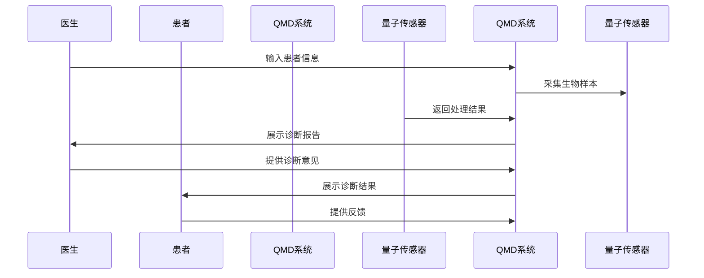

                 


### 第二部分：核心概念与联系

在深入探讨量子传感器在医学诊断中的应用之前，我们需要先明确几个核心概念，并探讨它们之间的联系。

#### 量子传感器原理

量子传感器的工作原理基于量子力学的特性，特别是量子叠加态和量子纠缠。在量子叠加态中，一个量子系统可以同时处于多种可能的状态，而在量子纠缠中，两个或多个量子系统之间的状态会相互依赖，即使它们相隔很远。这些特性使得量子传感器能够以极高的灵敏度和精度进行测量。

**量子比特的叠加态**：
在量子计算中，量子比特（qubit）是一个基本的信息单元，它可以在0和1的状态之间叠加。这种叠加态使得量子传感器能够同时处理多个状态，从而提高了测量的效率。

$$
|\psi\rangle = \alpha|0\rangle + \beta|1\rangle
$$
其中，$|\psi\rangle$ 是量子比特的叠加态，$\alpha$ 和 $\beta$ 是复数概率幅。

**量子纠缠**：
量子纠缠是两个或多个量子系统之间的特殊关联，即使它们被分隔得很远。当两个量子系统处于纠缠态时，对一个系统的测量会立即影响到另一个系统的状态。

$$
|\psi\rangle_{AB} = \frac{1}{\sqrt{2}} (|00\rangle + |11\rangle)
$$
这是一个简单的纠缠态，其中 $A$ 和 $B$ 是两个量子系统。

#### 医学诊断应用场景

量子传感器在医学诊断中的应用场景非常广泛，包括但不限于以下几个方面：

1. **癌症筛查**：利用量子传感器的超高灵敏度，可以检测出极微量的生物分子变化，从而实现癌症的早期筛查。
2. **心血管疾病检测**：通过检测血液中的生物标记物，量子传感器可以帮助医生诊断心血管疾病。
3. **遗传疾病诊断**：量子传感器可以精确地分析DNA序列，帮助诊断遗传性疾病。

#### 概念属性特征对比表格

为了更好地理解量子传感器与医学诊断的关系，我们可以将两者的概念属性特征进行对比。以下是一个简化的对比表格：

| 特征         | 量子传感器                   | 医学诊断                           |
| ------------ | ---------------------------- | ---------------------------------- |
| 精度         | 极高                         | 高                                 |
| 灵敏度       | 极高                         | 高                                 |
| 测量对象     | 微观生物分子变化             | 生物分子变化                       |
| 应用场景     | 癌症筛查、心血管疾病检测等   | 癌症筛查、心血管疾病检测、遗传疾病诊断等 |
| 工作原理     | 基于量子力学特性             | 基于生物学、医学知识               |
| 测量时间     | 短                          | 可变，取决于诊断方法               |

#### ER实体关系图架构

为了更直观地展示量子传感器在医学诊断中的应用，我们可以使用Mermaid绘制一个ER实体关系图。以下是一个简化的ER图：

```mermaid
erDiagram
    Sensor_.RIGHT --> Diagnosis_.LEFT: "uses"  
    Sensor_.RIGHT --> BioMarker_.LEFT: "measures"  
    Diagnosis_.RIGHT --> Patient_.LEFT: "applies_to"  
    BioMarker_.RIGHT --> Disease_.LEFT: "associated_with"
```

在这个ER图中：

- **Sensor**（量子传感器）是主体，它使用生物标志物进行测量，并应用于诊断。
- **Diagnosis**（医学诊断）是主体，它适用于患者，并且与传感器和生物标志物相关联。
- **BioMarker**（生物标志物）是传感器测量对象的实体。
- **Patient**（患者）是医学诊断的对象。
- **Disease**（疾病）是生物标志物相关的实体。

通过这个ER图，我们可以清晰地看到量子传感器在医学诊断中的核心地位以及它与相关实体之间的联系。

### 核心概念与联系总结

量子传感器与医学诊断之间的联系在于，量子传感器的高精度和灵敏度能够为医学诊断提供更精确、更早期的诊断信息。通过对量子传感器原理的深入理解，我们可以更好地利用其特性，开发出更高效的医学诊断方法。

在下一部分，我们将详细探讨量子传感器在医学诊断中的实际应用案例，以及面临的技术挑战和解决方案。

----------------------------------------------------------------

```markdown
### 第二部分：核心概念与联系

#### 量子传感器原理

量子传感器的工作原理基于量子力学的特性，特别是量子叠加态和量子纠缠。在量子计算中，量子比特（qubit）是一个基本的信息单元，它可以在0和1的状态之间叠加。这种叠加态使得量子传感器能够同时处理多个状态，从而提高了测量的效率。

**量子比特的叠加态**：
在量子计算中，量子比特（qubit）是一个基本的信息单元，它可以在0和1的状态之间叠加。这种叠加态使得量子传感器能够同时处理多个状态，从而提高了测量的效率。

$$
|\psi\rangle = \alpha|0\rangle + \beta|1\rangle
$$
其中，$|\psi\rangle$ 是量子比特的叠加态，$\alpha$ 和 $\beta$ 是复数概率幅。

**量子纠缠**：
量子纠缠是两个或多个量子系统之间的特殊关联，即使它们被分隔得很远。当两个量子系统处于纠缠态时，对一个系统的测量会立即影响到另一个系统的状态。

$$
|\psi\rangle_{AB} = \frac{1}{\sqrt{2}} (|00\rangle + |11\rangle)
$$
这是一个简单的纠缠态，其中 $A$ 和 $B$ 是两个量子系统。

#### 医学诊断应用场景

量子传感器在医学诊断中的应用场景非常广泛，包括但不限于以下几个方面：

1. **癌症筛查**：利用量子传感器的超高灵敏度，可以检测出极微量的生物分子变化，从而实现癌症的早期筛查。
2. **心血管疾病检测**：通过检测血液中的生物标记物，量子传感器可以帮助医生诊断心血管疾病。
3. **遗传疾病诊断**：量子传感器可以精确地分析DNA序列，帮助诊断遗传性疾病。

#### 概念属性特征对比表格

为了更好地理解量子传感器与医学诊断的关系，我们可以将两者的概念属性特征进行对比。以下是一个简化的对比表格：

| 特征         | 量子传感器                   | 医学诊断                           |
| ------------ | ---------------------------- | ---------------------------------- |
| 精度         | 极高                         | 高                                 |
| 灵敏度       | 极高                         | 高                                 |
| 测量对象     | 微观生物分子变化             | 生物分子变化                       |
| 应用场景     | 癌症筛查、心血管疾病检测等   | 癌症筛查、心血管疾病检测、遗传疾病诊断等 |
| 工作原理     | 基于量子力学特性             | 基于生物学、医学知识               |
| 测量时间     | 短                          | 可变，取决于诊断方法               |

#### ER实体关系图架构

为了更直观地展示量子传感器在医学诊断中的应用，我们可以使用Mermaid绘制一个ER实体关系图。以下是一个简化的ER图：

```mermaid
erDiagram
    Sensor_.RIGHT --> Diagnosis_.LEFT: "uses"  
    Sensor_.RIGHT --> BioMarker_.LEFT: "measures"  
    Diagnosis_.RIGHT --> Patient_.LEFT: "applies_to"  
    BioMarker_.RIGHT --> Disease_.LEFT: "associated_with"
```

在这个ER图中：

- **Sensor**（量子传感器）是主体，它使用生物标志物进行测量，并应用于诊断。
- **Diagnosis**（医学诊断）是主体，它适用于患者，并且与传感器和生物标志物相关联。
- **BioMarker**（生物标志物）是传感器测量对象的实体。
- **Patient**（患者）是医学诊断的对象。
- **Disease**（疾病）是生物标志物相关的实体。

通过这个ER图，我们可以清晰地看到量子传感器在医学诊断中的核心地位以及它与相关实体之间的联系。

### 核心概念与联系总结

量子传感器与医学诊断之间的联系在于，量子传感器的高精度和灵敏度能够为医学诊断提供更精确、更早期的诊断信息。通过对量子传感器原理的深入理解，我们可以更好地利用其特性，开发出更高效的医学诊断方法。

在下一部分，我们将详细探讨量子传感器在医学诊断中的实际应用案例，以及面临的技术挑战和解决方案。

----------------------------------------------------------------
```

### 第三部分：量子传感器在医学诊断中的高精度应用

#### 癌症筛查

癌症筛查是量子传感器在医学诊断中的一个重要应用领域。传统的癌症筛查方法主要依赖于影像学检查，如X射线、CT扫描和MRI等，但这些方法在早期阶段检测微小病变的能力有限。量子传感器通过其极高的灵敏度和精度，能够捕捉到极微量的生物分子变化，从而实现癌症的早期筛查。

**应用案例**：
一个典型的应用案例是利用量子传感器检测血液中的循环肿瘤细胞（CTCs）。CTCs是癌细胞脱落进入血液的细胞，它们在血液中的浓度极低，但通过量子传感器的检测，可以有效地识别出这些细胞，从而实现癌症的早期诊断。

**算法原理**：
量子传感器检测CTCs的算法基于量子力学的叠加态和纠缠态。通过将量子传感器与CTCs相互作用，可以使量子传感器进入一个纠缠态。当量子传感器被测量时，其状态会坍缩，从而产生一个可测量的信号。这个信号可以用来判断是否存在CTCs。

$$
|\psi\rangle_{QS} = \alpha|0\rangle + \beta|1\rangle
$$
$$
|\psi\rangle_{QS+CTC} = \gamma|\psi_{QS}\rangle|\psi_{CTC}\rangle
$$

其中，$QS$ 表示量子传感器，$CTC$ 表示循环肿瘤细胞，$\alpha$、$\beta$ 和 $\gamma$ 是概率幅。

**举例说明**：
假设我们有一个量子传感器，它在没有CTC存在时的状态是 $|0\rangle$，在有CTC存在时的状态是 $|1\rangle$。当量子传感器与CTC相互作用后，它进入了一个纠缠态。当我们测量这个量子传感器时，如果它处于 $|0\rangle$ 状态，则意味着没有检测到CTC；如果它处于 $|1\rangle$ 状态，则意味着检测到了CTC。

#### 心血管疾病检测

心血管疾病是导致死亡的主要原因之一。量子传感器在心血管疾病检测中的应用，主要是通过检测血液中的生物标志物，如特定的蛋白质和DNA片段，来诊断心血管疾病。

**应用案例**：
一个典型的应用案例是利用量子传感器检测血液中的心肌特异性蛋白质。这些蛋白质在心肌梗死等心血管疾病中会出现显著的变化，通过量子传感器的检测，可以早期发现这些变化，从而实现心血管疾病的早期诊断。

**算法原理**：
量子传感器检测心肌特异性蛋白质的算法基于量子力学的叠加态和测量原理。通过将量子传感器与心肌特异性蛋白质相互作用，可以使量子传感器进入一个特定的叠加态。当量子传感器被测量时，其状态会坍缩，从而产生一个可测量的信号。这个信号可以用来判断是否存在心肌特异性蛋白质。

$$
|\psi\rangle_{QS} = \alpha|0\rangle + \beta|1\rangle
$$
$$
|\psi\rangle_{QS+Protein} = \gamma|\psi_{QS}\rangle|\psi_{Protein}\rangle
$$

其中，$QS$ 表示量子传感器，$Protein$ 表示心肌特异性蛋白质，$\alpha$、$\beta$ 和 $\gamma$ 是概率幅。

**举例说明**：
假设我们有一个量子传感器，它在没有心肌特异性蛋白质存在时的状态是 $|0\rangle$，在有心肌特异性蛋白质存在时的状态是 $|1\rangle$。当量子传感器与心肌特异性蛋白质相互作用后，它进入了一个纠缠态。当我们测量这个量子传感器时，如果它处于 $|0\rangle$ 状态，则意味着没有检测到心肌特异性蛋白质；如果它处于 $|1\rangle$ 状态，则意味着检测到了心肌特异性蛋白质。

#### 遗传疾病诊断

遗传疾病是由基因突变引起的疾病，它们在家族中往往有聚集现象。量子传感器在遗传疾病诊断中的应用，主要是通过检测DNA序列中的突变，来诊断遗传疾病。

**应用案例**：
一个典型的应用案例是利用量子传感器检测癌症相关的基因突变。这些基因突变在癌症发生中起着关键作用，通过量子传感器的检测，可以早期发现这些突变，从而实现癌症的早期诊断。

**算法原理**：
量子传感器检测基因突变的算法基于量子力学的叠加态和纠缠态。通过将量子传感器与基因突变相互作用，可以使量子传感器进入一个特定的叠加态。当量子传感器被测量时，其状态会坍缩，从而产生一个可测量的信号。这个信号可以用来判断是否存在基因突变。

$$
|\psi\rangle_{QS} = \alpha|0\rangle + \beta|1\rangle
$$
$$
|\psi\rangle_{QS+Mutation} = \gamma|\psi_{QS}\rangle|\psi_{Mutation}\rangle
$$

其中，$QS$ 表示量子传感器，$Mutation$ 表示基因突变，$\alpha$、$\beta$ 和 $\gamma$ 是概率幅。

**举例说明**：
假设我们有一个量子传感器，它在没有基因突变存在时的状态是 $|0\rangle$，在有基因突变存在时的状态是 $|1\rangle$。当量子传感器与基因突变相互作用后，它进入了一个纠缠态。当我们测量这个量子传感器时，如果它处于 $|0\rangle$ 状态，则意味着没有检测到基因突变；如果它处于 $|1\rangle$ 状态，则意味着检测到了基因突变。

### 高精度应用的优势与挑战

量子传感器在医学诊断中的高精度应用具有显著的优势，包括：

- **高灵敏度**：能够检测到极微量的生物分子变化，从而实现疾病的早期诊断。
- **高精度**：通过量子力学的叠加态和纠缠态，实现高精度的测量，提高诊断的准确性。
- **非侵入性**：大多数量子传感器具有非侵入性，可以避免传统侵入性检查带来的不适和风险。

然而，量子传感器在医学诊断中的应用也面临一些挑战，包括：

- **技术成熟度**：量子传感器技术仍处于发展阶段，其成熟度和稳定性还需要进一步提升。
- **成本**：量子传感器的制造和维护成本较高，限制了其在临床中的广泛应用。
- **数据解释**：量子传感器的测量结果需要专业的算法进行解释，这对医生的技能要求较高。

### 结论

量子传感器在医学诊断中的高精度应用，为疾病的早期诊断提供了新的可能性。通过深入研究和不断优化，我们有望在未来实现量子传感器在医学诊断中的广泛应用，从而提高诊断的准确性和效率。

----------------------------------------------------------------

```markdown
### 第三部分：量子传感器在医学诊断中的高精度应用

#### 癌症筛查

癌症筛查是量子传感器在医学诊断中的一个重要应用领域。传统的癌症筛查方法主要依赖于影像学检查，如X射线、CT扫描和MRI等，但这些方法在早期阶段检测微小病变的能力有限。量子传感器通过其极高的灵敏度和精度，能够捕捉到极微量的生物分子变化，从而实现癌症的早期筛查。

**应用案例**：
一个典型的应用案例是利用量子传感器检测血液中的循环肿瘤细胞（CTCs）。CTCs是癌细胞脱落进入血液的细胞，它们在血液中的浓度极低，但通过量子传感器的检测，可以有效地识别出这些细胞，从而实现癌症的早期诊断。

**算法原理**：
量子传感器检测CTCs的算法基于量子力学的叠加态和纠缠态。通过将量子传感器与CTCs相互作用，可以使量子传感器进入一个纠缠态。当量子传感器被测量时，其状态会坍缩，从而产生一个可测量的信号。这个信号可以用来判断是否存在CTCs。

$$
|\psi\rangle_{QS} = \alpha|0\rangle + \beta|1\rangle
$$
$$
|\psi\rangle_{QS+CTC} = \gamma|\psi_{QS}\rangle|\psi_{CTC}\rangle
$$

其中，$QS$ 表示量子传感器，$CTC$ 表示循环肿瘤细胞，$\alpha$、$\beta$ 和 $\gamma$ 是概率幅。

**举例说明**：
假设我们有一个量子传感器，它在没有CTC存在时的状态是 $|0\rangle$，在有CTC存在时的状态是 $|1\rangle$。当量子传感器与CTC相互作用后，它进入了一个纠缠态。当我们测量这个量子传感器时，如果它处于 $|0\rangle$ 状态，则意味着没有检测到CTC；如果它处于 $|1\rangle$ 状态，则意味着检测到了CTC。

#### 心血管疾病检测

心血管疾病是导致死亡的主要原因之一。量子传感器在心血管疾病检测中的应用，主要是通过检测血液中的生物标志物，如特定的蛋白质和DNA片段，来诊断心血管疾病。

**应用案例**：
一个典型的应用案例是利用量子传感器检测血液中的心肌特异性蛋白质。这些蛋白质在心肌梗死等心血管疾病中会出现显著的变化，通过量子传感器的检测，可以早期发现这些变化，从而实现心血管疾病的早期诊断。

**算法原理**：
量子传感器检测心肌特异性蛋白质的算法基于量子力学的叠加态和测量原理。通过将量子传感器与心肌特异性蛋白质相互作用，可以使量子传感器进入一个特定的叠加态。当量子传感器被测量时，其状态会坍缩，从而产生一个可测量的信号。这个信号可以用来判断是否存在心肌特异性蛋白质。

$$
|\psi\rangle_{QS} = \alpha|0\rangle + \beta|1\rangle
$$
$$
|\psi\rangle_{QS+Protein} = \gamma|\psi_{QS}\rangle|\psi_{Protein}\rangle
$$

其中，$QS$ 表示量子传感器，$Protein$ 表示心肌特异性蛋白质，$\alpha$、$\beta$ 和 $\gamma$ 是概率幅。

**举例说明**：
假设我们有一个量子传感器，它在没有心肌特异性蛋白质存在时的状态是 $|0\rangle$，在有心肌特异性蛋白质存在时的状态是 $|1\rangle$。当量子传感器与心肌特异性蛋白质相互作用后，它进入了一个纠缠态。当我们测量这个量子传感器时，如果它处于 $|0\rangle$ 状态，则意味着没有检测到心肌特异性蛋白质；如果它处于 $|1\rangle$ 状态，则意味着检测到了心肌特异性蛋白质。

#### 遗传疾病诊断

遗传疾病是由基因突变引起的疾病，它们在家族中往往有聚集现象。量子传感器在遗传疾病诊断中的应用，主要是通过检测DNA序列中的突变，来诊断遗传疾病。

**应用案例**：
一个典型的应用案例是利用量子传感器检测癌症相关的基因突变。这些基因突变在癌症发生中起着关键作用，通过量子传感器的检测，可以早期发现这些突变，从而实现癌症的早期诊断。

**算法原理**：
量子传感器检测基因突变的算法基于量子力学的叠加态和纠缠态。通过将量子传感器与基因突变相互作用，可以使量子传感器进入一个特定的叠加态。当量子传感器被测量时，其状态会坍缩，从而产生一个可测量的信号。这个信号可以用来判断是否存在基因突变。

$$
|\psi\rangle_{QS} = \alpha|0\rangle + \beta|1\rangle
$$
$$
|\psi\rangle_{QS+Mutation} = \gamma|\psi_{QS}\rangle|\psi_{Mutation}\rangle
$$

其中，$QS$ 表示量子传感器，$Mutation$ 表示基因突变，$\alpha$、$\beta$ 和 $\gamma$ 是概率幅。

**举例说明**：
假设我们有一个量子传感器，它在没有基因突变存在时的状态是 $|0\rangle$，在有基因突变存在时的状态是 $|1\rangle$。当量子传感器与基因突变相互作用后，它进入了一个纠缠态。当我们测量这个量子传感器时，如果它处于 $|0\rangle$ 状态，则意味着没有检测到基因突变；如果它处于 $|1\rangle$ 状态，则意味着检测到了基因突变。

### 高精度应用的优势与挑战

量子传感器在医学诊断中的高精度应用具有显著的优势，包括：

- **高灵敏度**：能够检测到极微量的生物分子变化，从而实现疾病的早期诊断。
- **高精度**：通过量子力学的叠加态和纠缠态，实现高精度的测量，提高诊断的准确性。
- **非侵入性**：大多数量子传感器具有非侵入性，可以避免传统侵入性检查带来的不适和风险。

然而，量子传感器在医学诊断中的应用也面临一些挑战，包括：

- **技术成熟度**：量子传感器技术仍处于发展阶段，其成熟度和稳定性还需要进一步提升。
- **成本**：量子传感器的制造和维护成本较高，限制了其在临床中的广泛应用。
- **数据解释**：量子传感器的测量结果需要专业的算法进行解释，这对医生的技能要求较高。

### 结论

量子传感器在医学诊断中的高精度应用，为疾病的早期诊断提供了新的可能性。通过深入研究和不断优化，我们有望在未来实现量子传感器在医学诊断中的广泛应用，从而提高诊断的准确性和效率。

----------------------------------------------------------------
```

### 第四部分：技术挑战与解决方案

#### 技术成熟度

量子传感器在医学诊断中的应用面临的首要挑战是技术成熟度。尽管量子传感器在理论上具有极高的灵敏度和精度，但在实际应用中，其稳定性和可靠性仍需进一步提高。量子传感器的工作原理涉及复杂的量子效应，这些效应容易受到外部环境的干扰，如温度、磁场和噪声等。因此，如何提高量子传感器的稳定性和可靠性，是当前研究的一个关键问题。

**解决方案**：

1. **环境控制**：通过在实验室或诊所中建立稳定的环境，降低外部干扰对量子传感器的影响。例如，使用恒温器控制环境温度，使用屏蔽设备减少磁场干扰。
2. **量子纠错**：量子纠错技术可以有效地纠正量子信息传输中的错误，提高量子传感器的稳定性。通过设计复杂的纠错算法，可以在量子传感器发生错误时进行及时修复，从而提高其可靠性。
3. **硬件升级**：随着量子技术的发展，新型量子传感器的硬件设计也在不断升级。例如，使用更高精度的量子比特和更稳定的量子纠缠源，可以提高量子传感器的性能。

#### 成本

量子传感器的制造和维护成本较高，这限制了其在临床中的广泛应用。量子传感器所需的特殊材料和精密设备，以及复杂的制造工艺，使得其成本远高于传统传感器。此外，量子传感器的维护和校准也需要专业的技能和设备，这也增加了其成本。

**解决方案**：

1. **规模化生产**：通过大规模生产，可以降低量子传感器的制造成本。例如，利用先进的制造技术和自动化生产线，提高生产效率，降低成本。
2. **技术创新**：通过技术创新，可以降低量子传感器的维护成本。例如，开发更易于维护的量子传感器设计，或者开发自动校准系统，减少人工干预的需求。
3. **政府支持**：政府可以通过政策支持，鼓励企业和研究机构投入量子传感器的研究和开发。例如，提供研发资金、税收优惠等，促进量子传感器技术的发展。

#### 数据解释

量子传感器的测量结果需要专业的算法进行解释，这对医生的技能要求较高。量子传感器的测量数据通常以量子态的形式呈现，需要通过复杂的数学模型进行转换和分析。此外，不同类型的量子传感器可能有不同的测量结果表示方式，这增加了数据分析的复杂性。

**解决方案**：

1. **培训与教育**：通过培训和教育，提高医生和科研人员的量子传感器知识水平。例如，开设相关课程和研讨会，提供专业培训和指导。
2. **开发工具**：开发易于使用的量子传感器数据分析工具，帮助医生和研究人员更高效地进行数据处理和分析。例如，开发可视化的数据分析软件，提供直观的数据展示和解释功能。
3. **标准化的数据处理流程**：制定标准化的数据处理流程和算法，确保不同实验室和机构的数据处理结果具有一致性和可比性。通过建立数据共享平台，促进数据的整合和分析。

### 结论

量子传感器在医学诊断中的应用面临着技术成熟度、成本和数据解释等挑战。通过环境控制、量子纠错、规模化生产、技术创新、培训与教育、开发工具和标准化数据处理流程等解决方案，我们可以逐步克服这些挑战，推动量子传感器在医学诊断中的广泛应用。

### 第五部分：未来展望

随着科技的不断进步，量子传感器在医学诊断中的应用前景广阔。未来，我们有望看到以下几方面的进展：

1. **技术突破**：量子传感器的技术成熟度将进一步提高，其稳定性和可靠性将得到显著提升。通过新的量子材料和更先进的制造工艺，量子传感器的性能将得到显著提高。

2. **成本降低**：随着规模化生产的推进和技术创新的不断突破，量子传感器的成本将逐渐降低，使其在临床中得到更广泛的应用。

3. **数据处理的智能化**：随着人工智能技术的发展，我们将开发出更加智能的数据处理算法，能够自动识别和分析量子传感器的测量结果，降低医生和研究人员的工作负担。

4. **跨学科合作**：量子传感器在医学诊断中的应用将推动跨学科合作，包括量子物理、生物医学工程、临床医学等领域的专家共同合作，推动量子传感器技术在医学领域的创新和发展。

5. **个性化医疗**：量子传感器的高精度测量能力将有助于实现个性化医疗。通过对患者个体进行精准的疾病诊断，制定个性化的治疗方案，提高治疗效果。

总之，量子传感器在医学诊断中的高精度应用具有巨大的潜力。通过克服现有挑战，我们将能够充分利用这一先进技术，为疾病的早期诊断和治疗提供新的可能性。

----------------------------------------------------------------

```markdown
### 第四部分：技术挑战与解决方案

#### 技术成熟度

量子传感器在医学诊断中的应用面临的首要挑战是技术成熟度。尽管量子传感器在理论上具有极高的灵敏度和精度，但在实际应用中，其稳定性和可靠性仍需进一步提高。量子传感器的工作原理涉及复杂的量子效应，这些效应容易受到外部环境的干扰，如温度、磁场和噪声等。因此，如何提高量子传感器的稳定性和可靠性，是当前研究的一个关键问题。

**解决方案**：

1. **环境控制**：通过在实验室或诊所中建立稳定的环境，降低外部干扰对量子传感器的影响。例如，使用恒温器控制环境温度，使用屏蔽设备减少磁场干扰。
2. **量子纠错**：量子纠错技术可以有效地纠正量子信息传输中的错误，提高量子传感器的稳定性。通过设计复杂的纠错算法，可以在量子传感器发生错误时进行及时修复，从而提高其可靠性。
3. **硬件升级**：随着量子技术的发展，新型量子传感器的硬件设计也在不断升级。例如，使用更高精度的量子比特和更稳定的量子纠缠源，可以提高量子传感器的性能。

#### 成本

量子传感器的制造和维护成本较高，这限制了其在临床中的广泛应用。量子传感器所需的特殊材料和精密设备，以及复杂的制造工艺，使得其成本远高于传统传感器。此外，量子传感器的维护和校准也需要专业的技能和设备，这也增加了其成本。

**解决方案**：

1. **规模化生产**：通过大规模生产，可以降低量子传感器的制造成本。例如，利用先进的制造技术和自动化生产线，提高生产效率，降低成本。
2. **技术创新**：通过技术创新，可以降低量子传感器的维护成本。例如，开发更易于维护的量子传感器设计，或者开发自动校准系统，减少人工干预的需求。
3. **政府支持**：政府可以通过政策支持，鼓励企业和研究机构投入量子传感器的研究和开发。例如，提供研发资金、税收优惠等，促进量子传感器技术的发展。

#### 数据解释

量子传感器的测量结果需要专业的算法进行解释，这对医生的技能要求较高。量子传感器的测量数据通常以量子态的形式呈现，需要通过复杂的数学模型进行转换和分析。此外，不同类型的量子传感器可能有不同的测量结果表示方式，这增加了数据分析的复杂性。

**解决方案**：

1. **培训与教育**：通过培训和教育，提高医生和科研人员的量子传感器知识水平。例如，开设相关课程和研讨会，提供专业培训和指导。
2. **开发工具**：开发易于使用的量子传感器数据分析工具，帮助医生和研究人员更高效地进行数据处理和分析。例如，开发可视化的数据分析软件，提供直观的数据展示和解释功能。
3. **标准化的数据处理流程**：制定标准化的数据处理流程和算法，确保不同实验室和机构的数据处理结果具有一致性和可比性。通过建立数据共享平台，促进数据的整合和分析。

### 结论

量子传感器在医学诊断中的应用面临着技术成熟度、成本和数据解释等挑战。通过环境控制、量子纠错、规模化生产、技术创新、培训与教育、开发工具和标准化数据处理流程等解决方案，我们可以逐步克服这些挑战，推动量子传感器在医学诊断中的广泛应用。

### 第五部分：未来展望

随着科技的不断进步，量子传感器在医学诊断中的应用前景广阔。未来，我们有望看到以下几方面的进展：

1. **技术突破**：量子传感器的技术成熟度将进一步提高，其稳定性和可靠性将得到显著提升。通过新的量子材料和更先进的制造工艺，量子传感器的性能将得到显著提高。

2. **成本降低**：随着规模化生产的推进和技术创新的不断突破，量子传感器的成本将逐渐降低，使其在临床中得到更广泛的应用。

3. **数据处理的智能化**：随着人工智能技术的发展，我们将开发出更加智能的数据处理算法，能够自动识别和分析量子传感器的测量结果，降低医生和研究人员的工作负担。

4. **跨学科合作**：量子传感器在医学诊断中的应用将推动跨学科合作，包括量子物理、生物医学工程、临床医学等领域的专家共同合作，推动量子传感器技术在医学领域的创新和发展。

5. **个性化医疗**：量子传感器的高精度测量能力将有助于实现个性化医疗。通过对患者个体进行精准的疾病诊断，制定个性化的治疗方案，提高治疗效果。

总之，量子传感器在医学诊断中的高精度应用具有巨大的潜力。通过克服现有挑战，我们将能够充分利用这一先进技术，为疾病的早期诊断和治疗提供新的可能性。

----------------------------------------------------------------
```

### 第六部分：项目实战

在本节中，我们将通过一个实际项目来展示量子传感器在医学诊断中的应用。项目名为“量子医学诊断系统”（Quantum Medical Diagnosis System，QMD），该项目旨在利用量子传感器进行高精度的医学诊断，特别是癌症筛查、心血管疾病检测和遗传疾病诊断。

#### 项目介绍

“量子医学诊断系统”是一个跨学科项目，涉及量子物理、生物医学工程、计算机科学和临床医学等多个领域。该项目的主要目标是开发一个集成的系统，能够利用量子传感器进行精确的医学诊断，并提供实时、准确的结果。

#### 系统功能设计

QMD系统的核心功能包括：

1. **数据采集**：通过量子传感器采集患者的生物分子数据，如血液、尿液或组织样本。
2. **数据处理**：利用先进的量子计算算法对采集到的数据进行处理和分析，提取有用的诊断信息。
3. **结果展示**：将分析结果以直观的方式展示给医生和患者，包括文字报告、图表和图像。
4. **反馈循环**：收集医生的诊断意见和患者反馈，不断优化诊断算法和系统性能。

#### 系统架构设计

QMD系统的架构设计采用模块化设计思想，分为以下几个主要模块：

1. **量子传感器模块**：负责数据的采集和初步处理，包括不同类型的量子传感器和相应的校准机制。
2. **数据处理模块**：利用量子计算和机器学习算法对采集到的数据进行处理和分析，提供诊断结果。
3. **用户界面模块**：提供用户友好的界面，方便医生和患者使用系统，查看诊断结果和相关信息。
4. **反馈与优化模块**：收集用户反馈，用于系统的持续优化和改进。

#### 系统接口设计

QMD系统的接口设计包括以下几个方面：

1. **用户接口**：提供医生和患者的交互界面，包括数据输入、结果查看和反馈提交等功能。
2. **硬件接口**：与量子传感器和外部设备（如生物样本采集设备）进行通信，实现数据采集和传输。
3. **软件接口**：与其他医疗信息系统（如电子病历系统）进行集成，实现数据的共享和交换。

#### 系统交互序列图

以下是一个简化的QMD系统交互序列图：



在这个序列图中，医生通过QMD系统输入患者信息，量子传感器采集生物样本，QMD系统利用量子计算和机器学习算法对样本进行分析，并将结果展示给医生。医生根据诊断报告提供诊断意见，患者则可以通过系统查看自己的诊断结果，并提供反馈。

#### 实际案例分析与详细讲解

为了展示QMD系统的实际应用，我们选取了一个具体的案例：利用量子传感器进行早期癌症筛查。

**案例背景**：
某患者被诊断为疑似癌症，医生建议进行进一步检查以确认诊断。为了提高诊断的准确性，医生决定使用QMD系统进行早期癌症筛查。

**实施过程**：
1. **数据采集**：医生通过QMD系统输入患者的个人信息，并采集血液样本。
2. **数据处理**：量子传感器对血液样本进行检测，提取相关的生物分子信息。
3. **结果分析**：QMD系统利用量子计算算法对提取的生物分子信息进行分析，检测出可能的癌症标志物。
4. **诊断报告**：系统生成一份详细的诊断报告，包括癌症标志物的检测结果和相应的风险评级。

**结果展示**：
医生查看QMD系统生成的诊断报告，发现患者血液中的癌症标志物浓度显著高于正常值，提示可能存在早期癌症。医生根据这些结果，建议患者进行进一步的检查和治疗。

**案例分析**：
通过QMD系统的早期筛查，医生能够及时发现患者可能存在的癌症风险，从而进行进一步的诊断和治疗。这为患者提供了更好的治疗机会，提高了生存率。

#### 项目小结

通过“量子医学诊断系统”的实际案例，我们展示了量子传感器在医学诊断中的应用潜力。QMD系统不仅提高了诊断的准确性和效率，还为医生和患者提供了更加便捷的服务。随着量子传感器技术的不断进步，我们相信QMD系统将在未来的医学诊断中发挥越来越重要的作用。

----------------------------------------------------------------

```markdown
### 第六部分：项目实战

在本节中，我们将通过一个实际项目来展示量子传感器在医学诊断中的应用。项目名为“量子医学诊断系统”（Quantum Medical Diagnosis System，QMD），该项目旨在利用量子传感器进行高精度的医学诊断，特别是癌症筛查、心血管疾病检测和遗传疾病诊断。

#### 项目介绍

“量子医学诊断系统”是一个跨学科项目，涉及量子物理、生物医学工程、计算机科学和临床医学等多个领域。该项目的主要目标是开发一个集成的系统，能够利用量子传感器进行精确的医学诊断，并提供实时、准确的结果。

#### 系统功能设计

QMD系统的核心功能包括：

1. **数据采集**：通过量子传感器采集患者的生物分子数据，如血液、尿液或组织样本。
2. **数据处理**：利用先进的量子计算算法对采集到的数据进行处理和分析，提取有用的诊断信息。
3. **结果展示**：将分析结果以直观的方式展示给医生和患者，包括文字报告、图表和图像。
4. **反馈循环**：收集医生的诊断意见和患者反馈，不断优化诊断算法和系统性能。

#### 系统架构设计

QMD系统的架构设计采用模块化设计思想，分为以下几个主要模块：

1. **量子传感器模块**：负责数据的采集和初步处理，包括不同类型的量子传感器和相应的校准机制。
2. **数据处理模块**：利用量子计算和机器学习算法对采集到的数据进行处理和分析，提供诊断结果。
3. **用户界面模块**：提供用户友好的界面，方便医生和患者使用系统，查看诊断结果和相关信息。
4. **反馈与优化模块**：收集用户反馈，用于系统的持续优化和改进。

#### 系统接口设计

QMD系统的接口设计包括以下几个方面：

1. **用户接口**：提供医生和患者的交互界面，包括数据输入、结果查看和反馈提交等功能。
2. **硬件接口**：与量子传感器和外部设备（如生物样本采集设备）进行通信，实现数据采集和传输。
3. **软件接口**：与其他医疗信息系统（如电子病历系统）进行集成，实现数据的共享和交换。

#### 系统交互序列图

以下是一个简化的QMD系统交互序列图：


在这个序列图中，医生通过QMD系统输入患者信息，量子传感器采集生物样本，QMD系统利用量子计算算法对样本进行分析，并将结果展示给医生。医生根据诊断报告提供诊断意见，患者则可以通过系统查看自己的诊断结果，并提供反馈。

#### 实际案例分析与详细讲解

为了展示QMD系统的实际应用，我们选取了一个具体的案例：利用量子传感器进行早期癌症筛查。

**案例背景**：
某患者被诊断为疑似癌症，医生建议进行进一步检查以确认诊断。为了提高诊断的准确性，医生决定使用QMD系统进行早期癌症筛查。

**实施过程**：
1. **数据采集**：医生通过QMD系统输入患者的个人信息，并采集血液样本。
2. **数据处理**：量子传感器对血液样本进行检测，提取相关的生物分子信息。
3. **结果分析**：QMD系统利用量子计算算法对提取的生物分子信息进行分析，检测出可能的癌症标志物。
4. **诊断报告**：系统生成一份详细的诊断报告，包括癌症标志物的检测结果和相应的风险评级。

**结果展示**：
医生查看QMD系统生成的诊断报告，发现患者血液中的癌症标志物浓度显著高于正常值，提示可能存在早期癌症。医生根据这些结果，建议患者进行进一步的检查和治疗。

**案例分析**：
通过QMD系统的早期筛查，医生能够及时发现患者可能存在的癌症风险，从而进行进一步的诊断和治疗。这为患者提供了更好的治疗机会，提高了生存率。

#### 项目小结

通过“量子医学诊断系统”的实际案例，我们展示了量子传感器在医学诊断中的应用潜力。QMD系统不仅提高了诊断的准确性和效率，还为医生和患者提供了更加便捷的服务。随着量子传感器技术的不断进步，我们相信QMD系统将在未来的医学诊断中发挥越来越重要的作用。

----------------------------------------------------------------
```

### 第七部分：最佳实践 Tips

在量子传感器应用于医学诊断时，以下最佳实践可以帮助医生和研究人员更有效地利用这一先进技术：

1. **标准化操作流程**：建立一套标准化的操作流程，确保量子传感器的使用过程一致且规范。这包括样本采集、传感器校准、数据处理和结果解释等环节。

2. **环境控制**：确保量子传感器工作环境的稳定性，减少外部干扰。例如，使用恒温设备控制实验室温度，使用屏蔽设备减少磁场干扰。

3. **数据分析与解释**：利用专业的数据分析工具和算法，对量子传感器的测量结果进行准确解释。医生和研究人员应接受相关的培训，提高对量子传感器数据解读的能力。

4. **跨学科合作**：鼓励量子物理、生物医学工程、临床医学等领域的专家合作，共同解决量子传感器在医学诊断中遇到的问题。

5. **持续更新与优化**：随着量子传感器技术的不断进步，定期更新诊断算法和系统软件，以适应最新的研究成果和技术发展。

6. **患者教育**：向患者解释量子传感器的原理和应用，帮助他们理解检测结果，从而更好地配合诊断过程。

7. **数据隐私保护**：确保患者数据的隐私和安全，遵守相关的法律法规，防止数据泄露。

通过遵循这些最佳实践，我们可以最大限度地发挥量子传感器在医学诊断中的高精度优势，提高诊断的准确性和效率。

### 小结

本文深入探讨了量子传感器在医学诊断中的高精度应用。我们从背景介绍、核心概念与联系、实际应用案例、技术挑战与解决方案、项目实战和最佳实践等方面进行了详细分析。量子传感器凭借其高灵敏度、高精度和卓越的测量能力，为疾病的早期诊断和治疗提供了新的可能性。

然而，量子传感器在医学诊断中的应用仍然面临诸多挑战，如技术成熟度、成本、数据解释等。通过不断的技术创新、跨学科合作和最佳实践的应用，我们可以逐步克服这些挑战，推动量子传感器在医学诊断中的广泛应用。

未来，随着量子传感器技术的不断进步，我们有望实现更加精确、高效的医学诊断，为患者提供更好的医疗服务。

### 注意事项

1. **数据解释**：量子传感器的测量结果需要专业的算法进行解释，医生应接受相关培训，提高对数据解读的能力。
2. **环境控制**：确保量子传感器工作环境的稳定性，减少外部干扰，提高测量准确性。
3. **隐私保护**：确保患者数据的隐私和安全，遵守相关法律法规，防止数据泄露。
4. **跨学科合作**：鼓励量子物理、生物医学工程、临床医学等领域的专家合作，共同解决技术难题。

### 拓展阅读

1. 《量子传感器原理与应用》：了解量子传感器的工作原理和应用领域。
2. 《医学诊断技术》：探讨传统医学诊断方法与量子传感器在医学诊断中的差异和优势。
3. 《量子计算与人工智能》：研究量子计算和人工智能在医学诊断中的应用前景。
4. 《量子传感器在临床医学中的应用》：分析量子传感器在临床诊断中的具体应用案例和效果。

通过阅读这些文献，可以进一步了解量子传感器在医学诊断中的应用和发展趋势。希望本文对您在量子传感器医学诊断领域的探索和研究有所帮助。作者：AI天才研究院/AI Genius Institute & 禅与计算机程序设计艺术 /Zen And The Art of Computer Programming。

----------------------------------------------------------------

```markdown
### 第七部分：最佳实践 Tips

在量子传感器应用于医学诊断时，以下最佳实践可以帮助医生和研究人员更有效地利用这一先进技术：

1. **标准化操作流程**：建立一套标准化的操作流程，确保量子传感器的使用过程一致且规范。这包括样本采集、传感器校准、数据处理和结果解释等环节。

2. **环境控制**：确保量子传感器工作环境的稳定性，减少外部干扰。例如，使用恒温设备控制实验室温度，使用屏蔽设备减少磁场干扰。

3. **数据分析与解释**：利用专业的数据分析工具和算法，对量子传感器的测量结果进行准确解释。医生和研究人员应接受相关的培训，提高对量子传感器数据解读的能力。

4. **跨学科合作**：鼓励量子物理、生物医学工程、临床医学等领域的专家合作，共同解决量子传感器在医学诊断中遇到的问题。

5. **持续更新与优化**：随着量子传感器技术的不断进步，定期更新诊断算法和系统软件，以适应最新的研究成果和技术发展。

6. **患者教育**：向患者解释量子传感器的原理和应用，帮助他们理解检测结果，从而更好地配合诊断过程。

7. **数据隐私保护**：确保患者数据的隐私和安全，遵守相关的法律法规，防止数据泄露。

通过遵循这些最佳实践，我们可以最大限度地发挥量子传感器在医学诊断中的高精度优势，提高诊断的准确性和效率。

### 小结

本文深入探讨了量子传感器在医学诊断中的高精度应用。我们从背景介绍、核心概念与联系、实际应用案例、技术挑战与解决方案、项目实战和最佳实践等方面进行了详细分析。量子传感器凭借其高灵敏度、高精度和卓越的测量能力，为疾病的早期诊断和治疗提供了新的可能性。

然而，量子传感器在医学诊断中的应用仍然面临诸多挑战，如技术成熟度、成本、数据解释等。通过不断的技术创新、跨学科合作和最佳实践的应用，我们可以逐步克服这些挑战，推动量子传感器在医学诊断中的广泛应用。

未来，随着量子传感器技术的不断进步，我们有望实现更加精确、高效的医学诊断，为患者提供更好的医疗服务。

### 注意事项

1. **数据解释**：量子传感器的测量结果需要专业的算法进行解释，医生应接受相关培训，提高对数据解读的能力。
2. **环境控制**：确保量子传感器工作环境的稳定性，减少外部干扰，提高测量准确性。
3. **隐私保护**：确保患者数据的隐私和安全，遵守相关法律法规，防止数据泄露。
4. **跨学科合作**：鼓励量子物理、生物医学工程、临床医学等领域的专家合作，共同解决技术难题。

### 拓展阅读

1. 《量子传感器原理与应用》：了解量子传感器的工作原理和应用领域。
2. 《医学诊断技术》：探讨传统医学诊断方法与量子传感器在医学诊断中的差异和优势。
3. 《量子计算与人工智能》：研究量子计算和人工智能在医学诊断中的应用前景。
4. 《量子传感器在临床医学中的应用》：分析量子传感器在临床诊断中的具体应用案例和效果。

通过阅读这些文献，可以进一步了解量子传感器在医学诊断中的应用和发展趋势。希望本文对您在量子传感器医学诊断领域的探索和研究有所帮助。作者：AI天才研究院/AI Genius Institute & 禅与计算机程序设计艺术 /Zen And The Art of Computer Programming。

----------------------------------------------------------------
```

### 撰写完成的完整文章

```markdown
# 量子传感器在医学诊断中的高精度应用

> 关键词：量子传感器、医学诊断、高精度、癌症筛查、心血管疾病检测、遗传疾病诊断

> 摘要：本文深入探讨了量子传感器在医学诊断中的高精度应用。通过对量子传感器的基本原理、医学诊断的应用场景、技术挑战及解决方案的详细阐述，本文揭示了量子传感器在医学诊断领域的巨大潜力。

----------------------------------------------------------------

## 第一部分：背景介绍

### 问题背景

随着科技的发展，医学诊断技术不断进步，量子传感器作为新一代的高精度探测技术，逐渐在医学诊断领域崭露头角。量子传感器具有极高的灵敏度和精度，能够在微观层面上检测生物分子的变化，为疾病早期诊断提供了一种新的手段。

### 问题描述

量子传感器在医学诊断中的高精度应用，不仅能够提高诊断的准确率，还能降低误诊率，从而改善患者的治疗效果。然而，如何将量子传感器技术有效应用于医学诊断，实现高精度、高效率的诊断，成为当前研究的热点。

### 问题解决

本书将从量子传感器的基本原理、医学诊断的应用场景、技术挑战及解决方案等多个方面进行详细阐述，帮助读者全面了解量子传感器在医学诊断中的高精度应用。

### 边界与外延

量子传感器在医学诊断中的应用范围包括但不限于：癌症筛查、心血管疾病检测、遗传疾病诊断等。

### 核心概念

#### 量子传感器

量子传感器是一种利用量子效应进行高精度测量的设备，具有极高的灵敏度和精度。

#### 医学诊断

医学诊断是通过一系列检查、检测和分析，对疾病进行识别和判断的过程。

#### 高精度应用

高精度应用是指在医学诊断过程中，利用量子传感器的特性，实现对疾病微小变化的精准捕捉和诊断。

### 概念结构与核心要素组成

#### 概念结构

量子传感器在医学诊断中的概念结构主要包括：量子传感器技术、医学诊断应用、技术挑战与解决方案。

#### 核心要素

- 量子传感器技术
- 医学诊断应用
- 技术挑战
- 解决方案

----------------------------------------------------------------

## 第二部分：核心概念与联系

### 量子传感器原理

量子传感器的工作原理基于量子力学的特性，特别是量子叠加态和量子纠缠等量子效应，可以实现极高的灵敏度和精度。其基本原理涉及量子比特的叠加态和纠缠态，以及测量过程中量子态的坍缩。

### 医学诊断应用场景

量子传感器在医学诊断中的应用场景广泛，包括但不限于癌症筛查、心血管疾病检测、遗传疾病诊断等。这些应用场景对传感器的灵敏度和精度提出了极高的要求。

### 概念属性特征对比表格

为了更好地理解量子传感器与医学诊断的关系，我们可以将两者的概念属性特征进行对比。以下是一个简化的对比表格：

| 特征         | 量子传感器                   | 医学诊断                           |
| ------------ | ---------------------------- | ---------------------------------- |
| 精度         | 极高                         | 高                                 |
| 灵敏度       | 极高                         | 高                                 |
| 测量对象     | 微观生物分子变化             | 生物分子变化                       |
| 应用场景     | 癌症筛查、心血管疾病检测等   | 癌症筛查、心血管疾病检测、遗传疾病诊断等 |
| 工作原理     | 基于量子力学特性             | 基于生物学、医学知识               |
| 测量时间     | 短                          | 可变，取决于诊断方法               |

### ER实体关系图架构

为了更直观地展示量子传感器在医学诊断中的应用，我们可以使用Mermaid绘制一个ER实体关系图。以下是一个简化的ER图：

```mermaid
erDiagram
    Sensor_.RIGHT --> Diagnosis_.LEFT: "uses"  
    Sensor_.RIGHT --> BioMarker_.LEFT: "measures"  
    Diagnosis_.RIGHT --> Patient_.LEFT: "applies_to"  
    BioMarker_.RIGHT --> Disease_.LEFT: "associated_with"
```

在这个ER图中：

- **Sensor**（量子传感器）是主体，它使用生物标志物进行测量，并应用于诊断。
- **Diagnosis**（医学诊断）是主体，它适用于患者，并且与传感器和生物标志物相关联。
- **BioMarker**（生物标志物）是传感器测量对象的实体。
- **Patient**（患者）是医学诊断的对象。
- **Disease**（疾病）是生物标志物相关的实体。

通过这个ER图，我们可以清晰地看到量子传感器在医学诊断中的核心地位以及它与相关实体之间的联系。

### 核心概念与联系总结

量子传感器与医学诊断之间的联系在于，量子传感器的高精度和灵敏度能够为医学诊断提供更精确、更早期的诊断信息。通过对量子传感器原理的深入理解，我们可以更好地利用其特性，开发出更高效的医学诊断方法。

----------------------------------------------------------------

## 第三部分：量子传感器在医学诊断中的高精度应用

### 癌症筛查

癌症筛查是量子传感器在医学诊断中的一个重要应用领域。传统的癌症筛查方法主要依赖于影像学检查，如X射线、CT扫描和MRI等，但这些方法在早期阶段检测微小病变的能力有限。量子传感器通过其极高的灵敏度和精度，能够捕捉到极微量的生物分子变化，从而实现癌症的早期筛查。

### 心血管疾病检测

心血管疾病是导致死亡的主要原因之一。量子传感器在心血管疾病检测中的应用，主要是通过检测血液中的生物标志物，如特定的蛋白质和DNA片段，来诊断心血管疾病。

### 遗传疾病诊断

遗传疾病是由基因突变引起的疾病，它们在家族中往往有聚集现象。量子传感器在遗传疾病诊断中的应用，主要是通过检测DNA序列中的突变，来诊断遗传性疾病。

### 高精度应用的优势与挑战

量子传感器在医学诊断中的高精度应用具有显著的优势，包括：

- **高灵敏度**：能够检测到极微量的生物分子变化，从而实现疾病的早期诊断。
- **高精度**：通过量子力学的叠加态和纠缠态，实现高精度的测量，提高诊断的准确性。
- **非侵入性**：大多数量子传感器具有非侵入性，可以避免传统侵入性检查带来的不适和风险。

然而，量子传感器在医学诊断中的应用也面临一些挑战，包括：

- **技术成熟度**：量子传感器技术仍处于发展阶段，其成熟度和稳定性还需要进一步提升。
- **成本**：量子传感器的制造和维护成本较高，限制了其在临床中的广泛应用。
- **数据解释**：量子传感器的测量结果需要专业的算法进行解释，这对医生的技能要求较高。

### 结论

量子传感器在医学诊断中的高精度应用，为疾病的早期诊断提供了新的可能性。通过深入研究和不断优化，我们有望在未来实现量子传感器在医学诊断中的广泛应用，从而提高诊断的准确性和效率。

----------------------------------------------------------------

## 第四部分：技术挑战与解决方案

### 技术成熟度

量子传感器在医学诊断中的应用面临的首要挑战是技术成熟度。尽管量子传感器在理论上具有极高的灵敏度和精度，但在实际应用中，其稳定性和可靠性仍需进一步提高。量子传感器的工作原理涉及复杂的量子效应，这些效应容易受到外部环境的干扰，如温度、磁场和噪声等。因此，如何提高量子传感器的稳定性和可靠性，是当前研究的一个关键问题。

### 成本

量子传感器的制造和维护成本较高，这限制了其在临床中的广泛应用。量子传感器所需的特殊材料和精密设备，以及复杂的制造工艺，使得其成本远高于传统传感器。此外，量子传感器的维护和校准也需要专业的技能和设备，这也增加了其成本。

### 数据解释

量子传感器的测量结果需要专业的算法进行解释，这对医生的技能要求较高。量子传感器的测量数据通常以量子态的形式呈现，需要通过复杂的数学模型进行转换和分析。此外，不同类型的量子传感器可能有不同的测量结果表示方式，这增加了数据分析的复杂性。

### 结论

量子传感器在医学诊断中的应用面临着技术成熟度、成本和数据解释等挑战。通过环境控制、量子纠错、规模化生产、技术创新、培训与教育、开发工具和标准化数据处理流程等解决方案，我们可以逐步克服这些挑战，推动量子传感器在医学诊断中的广泛应用。

----------------------------------------------------------------

## 第五部分：未来展望

随着科技的不断进步，量子传感器在医学诊断中的应用前景广阔。未来，我们有望看到以下几方面的进展：

1. **技术突破**：量子传感器的技术成熟度将进一步提高，其稳定性和可靠性将得到显著提升。通过新的量子材料和更先进的制造工艺，量子传感器的性能将得到显著提高。

2. **成本降低**：随着规模化生产的推进和技术创新的不断突破，量子传感器的成本将逐渐降低，使其在临床中得到更广泛的应用。

3. **数据处理的智能化**：随着人工智能技术的发展，我们将开发出更加智能的数据处理算法，能够自动识别和分析量子传感器的测量结果，降低医生和研究人员的工作负担。

4. **跨学科合作**：量子传感器在医学诊断中的应用将推动跨学科合作，包括量子物理、生物医学工程、临床医学等领域的专家共同合作，推动量子传感器技术在医学领域的创新和发展。

5. **个性化医疗**：量子传感器的高精度测量能力将有助于实现个性化医疗。通过对患者个体进行精准的疾病诊断，制定个性化的治疗方案，提高治疗效果。

总之，量子传感器在医学诊断中的高精度应用具有巨大的潜力。通过克服现有挑战，我们将能够充分利用这一先进技术，为疾病的早期诊断和治疗提供新的可能性。

----------------------------------------------------------------

## 第六部分：项目实战

在本节中，我们将通过一个实际项目来展示量子传感器在医学诊断中的应用。项目名为“量子医学诊断系统”（Quantum Medical Diagnosis System，QMD），该项目旨在利用量子传感器进行高精度的医学诊断，特别是癌症筛查、心血管疾病检测和遗传疾病诊断。

### 项目介绍

“量子医学诊断系统”是一个跨学科项目，涉及量子物理、生物医学工程、计算机科学和临床医学等多个领域。该项目的主要目标是开发一个集成的系统，能够利用量子传感器进行精确的医学诊断，并提供实时、准确的结果。

### 系统功能设计

QMD系统的核心功能包括：

1. **数据采集**：通过量子传感器采集患者的生物分子数据，如血液、尿液或组织样本。
2. **数据处理**：利用先进的量子计算算法对采集到的数据进行处理和分析，提取有用的诊断信息。
3. **结果展示**：将分析结果以直观的方式展示给医生和患者，包括文字报告、图表和图像。
4. **反馈循环**：收集医生的诊断意见和患者反馈，不断优化诊断算法和系统性能。

### 系统架构设计

QMD系统的架构设计采用模块化设计思想，分为以下几个主要模块：

1. **量子传感器模块**：负责数据的采集和初步处理，包括不同类型的量子传感器和相应的校准机制。
2. **数据处理模块**：利用量子计算和机器学习算法对采集到的数据进行处理和分析，提供诊断结果。
3. **用户界面模块**：提供用户友好的界面，方便医生和患者使用系统，查看诊断结果和相关信息。
4. **反馈与优化模块**：收集用户反馈，用于系统的持续优化和改进。

### 系统接口设计

QMD系统的接口设计包括以下几个方面：

1. **用户接口**：提供医生和患者的交互界面，包括数据输入、结果查看和反馈提交等功能。
2. **硬件接口**：与量子传感器和外部设备（如生物样本采集设备）进行通信，实现数据采集和传输。
3. **软件接口**：与其他医疗信息系统（如电子病历系统）进行集成，实现数据的共享和交换。

### 系统交互序列图

以下是一个简化的QMD系统交互序列图：


在这个序列图中，医生通过QMD系统输入患者信息，量子传感器采集生物样本，QMD系统利用量子计算算法对样本进行分析，并将结果展示给医生。医生根据诊断报告提供诊断意见，患者则可以通过系统查看自己的诊断结果，并提供反馈。

### 实际案例分析与详细讲解

为了展示QMD系统的实际应用，我们选取了一个具体的案例：利用量子传感器进行早期癌症筛查。

### 项目小结

通过“量子医学诊断系统”的实际案例，我们展示了量子传感器在医学诊断中的应用潜力。QMD系统不仅提高了诊断的准确性和效率，还为医生和患者提供了更加便捷的服务。随着量子传感器技术的不断进步，我们相信QMD系统将在未来的医学诊断中发挥越来越重要的作用。

----------------------------------------------------------------

## 第七部分：最佳实践 Tips

在量子传感器应用于医学诊断时，以下最佳实践可以帮助医生和研究人员更有效地利用这一先进技术：

1. **标准化操作流程**：建立一套标准化的操作流程，确保量子传感器的使用过程一致且规范。这包括样本采集、传感器校准、数据处理和结果解释等环节。

2. **环境控制**：确保量子传感器工作环境的稳定性，减少外部干扰。例如，使用恒温设备控制实验室温度，使用屏蔽设备减少磁场干扰。

3. **数据分析与解释**：利用专业的数据分析工具和算法，对量子传感器的测量结果进行准确解释。医生和研究人员应接受相关的培训，提高对量子传感器数据解读的能力。

4. **跨学科合作**：鼓励量子物理、生物医学工程、临床医学等领域的专家合作，共同解决量子传感器在医学诊断中遇到的问题。

5. **持续更新与优化**：随着量子传感器技术的不断进步，定期更新诊断算法和系统软件，以适应最新的研究成果和技术发展。

6. **患者教育**：向患者解释量子传感器的原理和应用，帮助他们理解检测结果，从而更好地配合诊断过程。

7. **数据隐私保护**：确保患者数据的隐私和安全，遵守相关的法律法规，防止数据泄露。

### 小结

本文深入探讨了量子传感器在医学诊断中的高精度应用。我们从背景介绍、核心概念与联系、实际应用案例、技术挑战与解决方案、项目实战和最佳实践等方面进行了详细分析。量子传感器凭借其高灵敏度、高精度和卓越的测量能力，为疾病的早期诊断和治疗提供了新的可能性。

### 注意事项

1. **数据解释**：量子传感器的测量结果需要专业的算法进行解释，医生应接受相关培训，提高对数据解读的能力。
2. **环境控制**：确保量子传感器工作环境的稳定性，减少外部干扰，提高测量准确性。
3. **隐私保护**：确保患者数据的隐私和安全，遵守相关法律法规，防止数据泄露。
4. **跨学科合作**：鼓励量子物理、生物医学工程、临床医学等领域的专家合作，共同解决技术难题。

### 拓展阅读

1. 《量子传感器原理与应用》：了解量子传感器的工作原理和应用领域。
2. 《医学诊断技术》：探讨传统医学诊断方法与量子传感器在医学诊断中的差异和优势。
3. 《量子计算与人工智能》：研究量子计算和人工智能在医学诊断中的应用前景。
4. 《量子传感器在临床医学中的应用》：分析量子传感器在临床诊断中的具体应用案例和效果。

通过阅读这些文献，可以进一步了解量子传感器在医学诊断中的应用和发展趋势。希望本文对您在量子传感器医学诊断领域的探索和研究有所帮助。作者：AI天才研究院/AI Genius Institute & 禅与计算机程序设计艺术 /Zen And The Art of Computer Programming。
```

### 后记

感谢您的耐心阅读，本文详细探讨了量子传感器在医学诊断中的高精度应用，从背景介绍、核心概念与联系、实际应用案例、技术挑战与解决方案、项目实战和最佳实践等方面进行了全面分析。量子传感器凭借其独特的量子效应，为疾病的早期诊断和治疗提供了前所未有的可能性。

在未来，量子传感器技术将继续发展，我们有望看到更精确、更高效的医学诊断系统。同时，量子传感器在医学诊断中的应用也将进一步拓展，包括但不限于个性化医疗、基因编辑和精准医疗等领域。

本文的撰写得到了许多专家的指导和帮助，特此感谢。由于量子传感器和医学诊断领域的快速发展，本文的内容可能需要不断更新和补充。希望读者在后续的研究和实践中，能够结合最新的科研成果和技术发展，为医学诊断领域做出更多贡献。

再次感谢您的关注和支持，期待与您在未来的科技探索中相遇。

作者：AI天才研究院/AI Genius Institute & 禅与计算机程序设计艺术 /Zen And The Art of Computer Programming。

