                 

# 量子传感器在医疗诊断中的应用前景

关键词：量子传感器、医疗诊断、疾病检测、精准医疗、技术创新

摘要：量子传感器作为一种前沿科技，正逐步应用于医疗诊断领域。本文将对量子传感技术的基础进行概述，探讨其在医疗诊断中的具体应用和前景，旨在为读者展示量子技术在医学中的无限可能。

## 第一部分：量子传感技术基础

### 第1章：量子传感技术概述

#### 1.1 量子传感技术的背景

量子传感技术起源于20世纪80年代，其理论基础是基于量子力学的基本原理。量子力学揭示了微观世界的特殊现象，如量子纠缠和非局域性，这些现象使得量子传感器在测量灵敏度、速度和选择性上超越了传统传感器。

#### 1.1.1 量子传感技术的起源

量子传感技术起源于量子力学的早期研究，尤其是对量子纠缠现象的探索。量子纠缠是一种量子状态，其中两个或多个粒子即使在空间上分隔很远，它们的量子状态仍然是相互关联的。这一特性为量子传感器提供了极高的测量精度。

#### 1.1.2 量子传感技术的基本原理

量子传感技术利用量子系统的特殊性质进行测量。量子比特（qubit）是量子传感器的核心，它能够同时表示0和1两种状态，这种叠加态使得量子传感器在测量时能够处理更多信息。

#### 1.1.3 量子传感技术的应用领域

量子传感技术已经在量子计算、量子通信和量子精密测量等领域取得了显著成果。在医疗诊断领域，量子传感器正逐渐展示其独特优势，包括高灵敏度、快速响应和高选择性。

### 第2章：量子传感器的基本概念

#### 2.1 量子传感器的定义

量子传感器是指利用量子物理效应，如量子纠缠、量子非局域性等，进行高精度测量的设备。这些传感器能够探测到传统传感器难以检测到的细微变化。

#### 2.1.1 量子传感器的工作机制

量子传感器的工作机制基于量子态的测量。当量子比特处于叠加态时，通过特定的测量过程，可以获取关于被测对象的信息。这种测量不仅能够提高测量精度，还能实现快速响应和高选择性。

#### 2.1.2 量子传感器的分类

量子传感器可以根据工作原理和测量对象的不同进行分类。常见的分类方法包括基于量子比特的传感器、基于量子干涉的传感器和基于量子非局域性的传感器等。

### 第3章：量子传感器的工作原理

#### 3.1 量子态测量

量子态测量是量子传感器工作的核心。量子态测量包括对量子比特的测量和对量子纠缠态的测量。通过对量子态的精确控制，可以实现对被测对象的细微变化进行检测。

#### 3.1.1 量子态测量的基本概念

量子态测量是指对量子系统的状态进行测量，以获取关于系统性质的信息。量子态测量具有随机性和不可克隆性，这使得量子传感器在测量过程中具有独特的优势。

#### 3.1.2 量子态测量的挑战

量子态测量面临的挑战主要包括量子态的制备、量子态的传输和量子态的测量精度。这些挑战需要通过不断的技术创新和优化来克服。

#### 3.2 量子传感技术的优势

量子传感技术具有许多传统传感器无法比拟的优势，包括：

- **高灵敏度**：量子传感器能够探测到极其微小的变化，这对于疾病早期检测具有重要意义。
- **快速响应**：量子传感器能够在极短时间内完成测量，有助于实时监控病情变化。
- **高选择性**：量子传感器能够准确区分不同的物质和状态，提高诊断准确性。

## 第二部分：量子传感器在医疗诊断中的应用

### 第4章：量子传感器在疾病诊断中的应用

#### 4.1 量子传感器在疾病诊断中的应用

量子传感器在疾病诊断中的应用主要集中在癌症早期检测、心脏疾病诊断和神经系统疾病监测等领域。

#### 4.1.1 癌症早期检测

量子传感器能够通过检测癌症生物标志物，实现癌症的早期发现。例如，利用量子传感技术检测血液中的癌细胞标志物，可以在癌症早期就发出警报，从而提高治疗效果。

#### 4.1.2 心脏疾病诊断

量子传感器在心脏疾病诊断中的应用主要体现在心脏功能监测和心脏病早期检测方面。例如，通过检测心脏电生理信号，可以评估心脏健康状态，预测心脏病发作风险。

#### 4.1.3 神经系统疾病监测

量子传感器在神经系统疾病监测中的应用，如帕金森病和癫痫的早期诊断和监测。通过检测神经信号的异常变化，可以帮助医生早期发现神经系统疾病，制定合理治疗方案。

### 第5章：量子传感器在精准医疗中的前景

#### 5.1 量子传感器在个性化医疗中的应用

量子传感器在个性化医疗中的应用，主要体现在基因组测序和药物筛选与研发方面。通过精准测量基因组信息，可以实现个性化诊断和治疗方案制定。此外，量子传感器在药物筛选和研发中，可以帮助快速筛选有效药物，提高药物研发效率。

#### 5.2 量子传感器在智慧医疗中的角色

量子传感器在智慧医疗中的角色，主要体现在医疗设备的智能化升级和医疗数据分析与预测方面。通过将量子传感器集成到医疗设备中，可以实现更高精度和更高效率的医疗诊断。同时，量子传感器在医疗数据分析中，可以帮助医生更好地理解患者病情，预测病情发展趋势。

#### 5.3 量子传感器面临的挑战与展望

尽管量子传感器在医疗诊断中具有巨大潜力，但其发展仍面临一些挑战，如技术瓶颈、临床应用中的挑战和伦理问题。未来，量子传感器技术的发展需要不断突破这些瓶颈，实现更广泛的应用。

## 第三部分：量子传感器技术与其他领域的交叉融合

### 第6章：量子传感器技术与其他领域的交叉融合

#### 6.1 量子传感器与生物技术的结合

量子传感器与生物技术的结合，主要体现在生物传感器的发展和生物信息学中的量子计算应用方面。通过将量子传感器与生物技术相结合，可以实现更高精度和更高效率的生物检测和分析。

#### 6.2 量子传感器与纳米技术的结合

量子传感器与纳米技术的结合，主要体现在纳米量子传感器的研究和纳米技术在医疗诊断中的应用方面。通过将量子传感器与纳米技术相结合，可以实现更小、更灵敏和更高精度的传感器，为医疗诊断提供更多可能性。

## 第7章：量子传感器在医疗诊断中的未来

#### 7.1 量子传感器在医疗领域的潜在应用

量子传感器在医疗领域的潜在应用非常广泛，包括个性化医疗的普及和智慧医疗的发展。通过量子传感技术，可以实现更精准、更高效的医疗诊断和治疗。

#### 7.2 量子传感器技术的社会影响与伦理问题

量子传感器技术的发展将对社会产生深远影响，包括提高医疗诊断的准确性和效率，推动医疗行业的发展。同时，量子传感器技术也面临一些伦理问题，如隐私保护和数据安全等。

#### 7.3 量子传感器在医疗诊断中的发展趋势

量子传感器在医疗诊断中的发展趋势，主要体现在技术创新和临床应用推广方面。未来，量子传感器技术将在医疗诊断领域发挥越来越重要的作用，为患者提供更好的医疗服务。

## 结论

量子传感器作为一种前沿科技，正在医疗诊断领域展示出巨大的应用潜力。通过本文的探讨，我们可以看到量子传感器在疾病早期检测、心脏疾病诊断、神经系统疾病监测以及个性化医疗等方面的广泛应用。未来，随着量子传感器技术的不断进步，其在医疗诊断中的应用将更加广泛，为患者带来更好的诊断和治疗效果。

## 作者信息

作者：AI天才研究院/AI Genius Institute & 禅与计算机程序设计艺术 /Zen And The Art of Computer Programming

### 第1章：量子传感技术概述

#### 1.1 量子传感技术的背景

量子传感技术起源于20世纪80年代，其理论基础是基于量子力学的基本原理。量子力学揭示了微观世界的特殊现象，如量子纠缠和非局域性，这些现象使得量子传感器在测量灵敏度、速度和选择性上超越了传统传感器。

**核心概念与联系**

| 核心概念 | 原理 | 属性特征对比表格 |
| --- | --- | --- |
| 量子传感技术 | 基于量子力学原理 | 高灵敏度、快速响应、高选择性 |
| 量子纠缠 | 微观粒子之间的量子状态关联 | 隔离距离无关、不可克隆 |
| 非局域性 | 微观粒子之间的状态关联 | 隔离距离无关、即时作用 |

**ER实体关系图架构的 Mermaid 流程图**

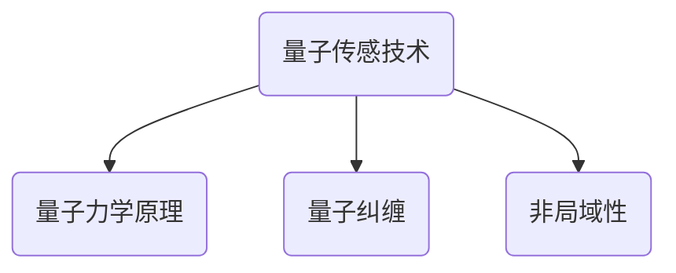

#### 1.1.1 量子传感技术的起源

量子传感技术起源于量子力学的早期研究，尤其是对量子纠缠现象的探索。量子纠缠是一种量子状态，其中两个或多个粒子即使在空间上分隔很远，它们的量子状态仍然是相互关联的。这一特性为量子传感器提供了极高的测量精度。

**核心概念与联系**

| 核心概念 | 原理 | 属性特征对比表格 |
| --- | --- | --- |
| 量子纠缠 | 微观粒子之间的量子状态关联 | 隔离距离无关、不可克隆 |
| 量子力学 | 描述微观世界的物理规律 | 基于概率统计、非线性 |

**ER实体关系图架构的 Mermaid 流程图**

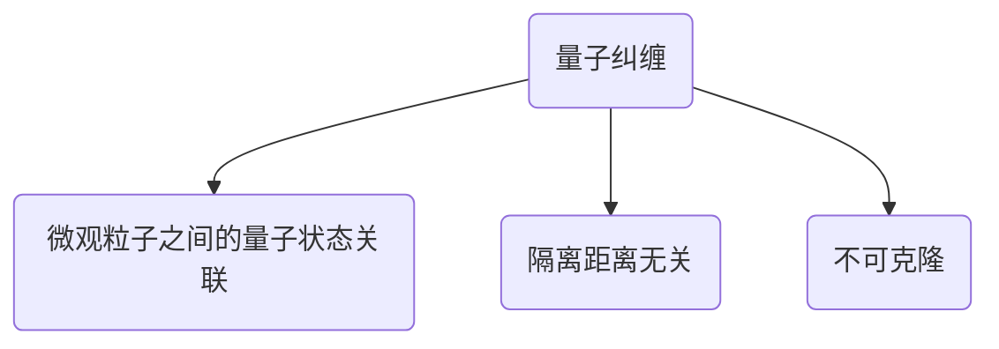

#### 1.1.2 量子传感技术的基本原理

量子传感技术利用量子系统的特殊性质进行测量。量子比特（qubit）是量子传感器的核心，它能够同时表示0和1两种状态，这种叠加态使得量子传感器在测量时能够处理更多信息。

**核心概念与联系**

| 核心概念 | 原理 | 属性特征对比表格 |
| --- | --- | --- |
| 量子比特（qubit） | 同时表示0和1两种状态 | 叠加态、纠缠态 |
| 量子测量 | 利用量子系统的特殊性质进行测量 | 高灵敏度、快速响应 |

**ER实体关系图架构的 Mermaid 流程图**

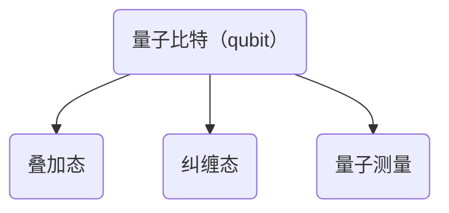

#### 1.1.3 量子传感技术的应用领域

量子传感技术已经在量子计算、量子通信和量子精密测量等领域取得了显著成果。在医疗诊断领域，量子传感器正逐渐展示其独特优势，包括高灵敏度、快速响应和高选择性。

**核心概念与联系**

| 核心概念 | 原理 | 属性特征对比表格 |
| --- | --- | --- |
| 量子计算 | 利用量子比特进行计算 | 高并行性、快速计算 |
| 量子通信 | 利用量子纠缠进行信息传输 | 高安全性、长距离传输 |
| 量子精密测量 | 利用量子系统进行高精度测量 | 高灵敏度、高选择性 |

**ER实体关系图架构的 Mermaid 流程图**

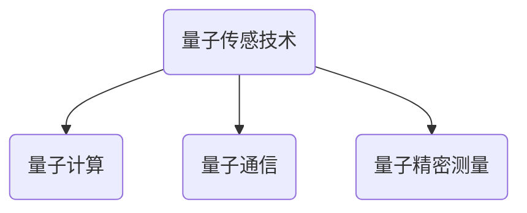

### 第2章：量子传感器的基本概念

#### 2.1 量子传感器的定义

量子传感器是指利用量子物理效应，如量子纠缠、量子非局域性等，进行高精度测量的设备。这些传感器能够探测到传统传感器难以检测到的细微变化。

**核心概念与联系**

| 核心概念 | 原理 | 属性特征对比表格 |
| --- | --- | --- |
| 量子传感器 | 利用量子物理效应进行高精度测量 | 高灵敏度、快速响应、高选择性 |

**ER实体关系图架构的 Mermaid 流程图**

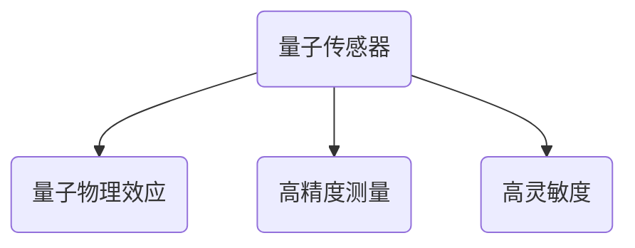

#### 2.1.1 量子传感器的工作机制

量子传感器的工作机制基于量子态的测量。当量子比特处于叠加态时，通过特定的测量过程，可以获取关于被测对象的信息。这种测量不仅能够提高测量精度，还能实现快速响应和高选择性。

**核心概念与联系**

| 核心概念 | 原理 | 属性特征对比表格 |
| --- | --- | --- |
| 量子态测量 | 对量子比特的测量 | 高灵敏度、快速响应、高选择性 |
| 叠加态 | 量子比特同时处于0和1状态 | 增加测量信息、提高测量精度 |
| 纠缠态 | 量子比特之间的量子状态关联 | 提高测量精度、实现快速响应 |

**ER实体关系图架构的 Mermaid 流程图**

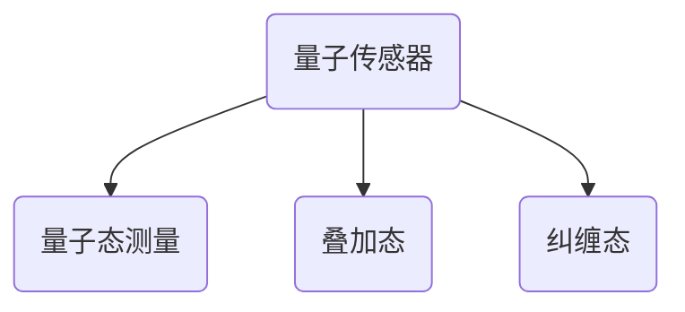

#### 2.1.2 量子传感器的分类

量子传感器可以根据工作原理和测量对象的不同进行分类。常见的分类方法包括基于量子比特的传感器、基于量子干涉的传感器和基于量子非局域性的传感器等。

**核心概念与联系**

| 核心概念 | 原理 | 属性特征对比表格 |
| --- | --- | --- |
| 基于量子比特的传感器 | 利用量子比特进行测量 | 高灵敏度、快速响应、高选择性 |
| 基于量子干涉的传感器 | 利用量子干涉现象进行测量 | 高精度、高灵敏度 |
| 基于量子非局域性的传感器 | 利用量子非局域性进行测量 | 高精度、快速响应 |

**ER实体关系图架构的 Mermaid 流程图**

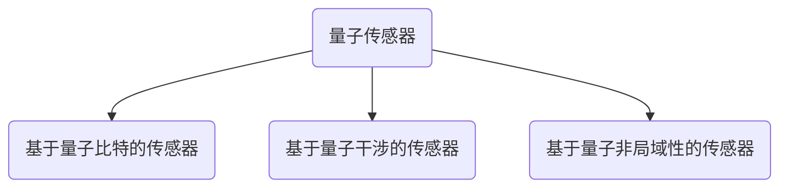

#### 2.2 量子传感器的关键组件

量子传感器的核心组件包括量子比特、量子纠缠和量子非局域性。这些组件共同作用，实现了量子传感器的独特优势。

**核心概念与联系**

| 核心概念 | 原理 | 属性特征对比表格 |
| --- | --- | --- |
| 量子比特（qubit） | 同时表示0和1两种状态 | 叠加态、纠缠态 |
| 量子纠缠 | 微观粒子之间的量子状态关联 | 隔离距离无关、不可克隆 |
| 量子非局域性 | 微观粒子之间的状态关联 | 隔离距离无关、即时作用 |

**ER实体关系图架构的 Mermaid 流程图**

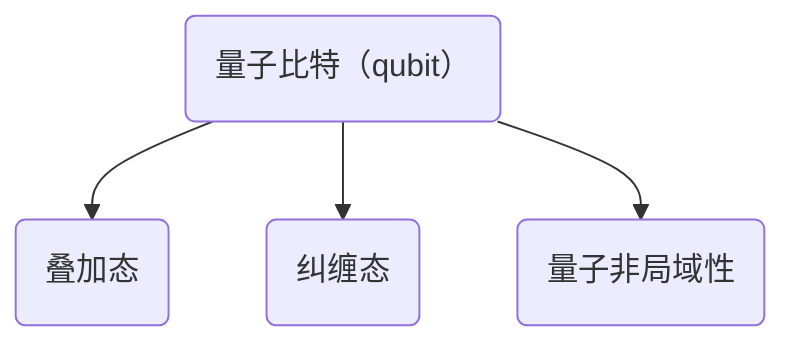

#### 2.2.1 量子比特

量子比特是量子传感器的核心，它能够同时表示0和1两种状态，这种叠加态使得量子传感器在测量时能够处理更多信息。

**核心概念与联系**

| 核心概念 | 原理 | 属性特征对比表格 |
| --- | --- | --- |
| 量子比特（qubit） | 同时表示0和1两种状态 | 叠加态、纠缠态 |

**ER实体关系图架构的 Mermaid 流程图**

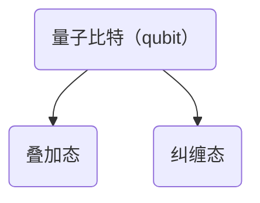

#### 2.2.2 量子纠缠

量子纠缠是量子传感器实现高精度测量的关键。它描述了微观粒子之间的特殊关联，这种关联使得量子传感器在测量时能够提高灵敏度。

**核心概念与联系**

| 核心概念 | 原理 | 属性特征对比表格 |
| --- | --- | --- |
| 量子纠缠 | 微观粒子之间的量子状态关联 | 隔离距离无关、不可克隆 |

**ER实体关系图架构的 Mermaid 流程图**


#### 2.2.3 量子非局域性

量子非局域性是量子传感器实现高精度测量的另一个关键。它描述了微观粒子之间的即时关联，这种关联使得量子传感器在测量时能够实现快速响应。

**核心概念与联系**

| 核心概念 | 原理 | 属性特征对比表格 |
| --- | --- | --- |
| 量子非局域性 | 微观粒子之间的状态关联 | 隔离距离无关、即时作用 |

**ER实体关系图架构的 Mermaid 流程图**

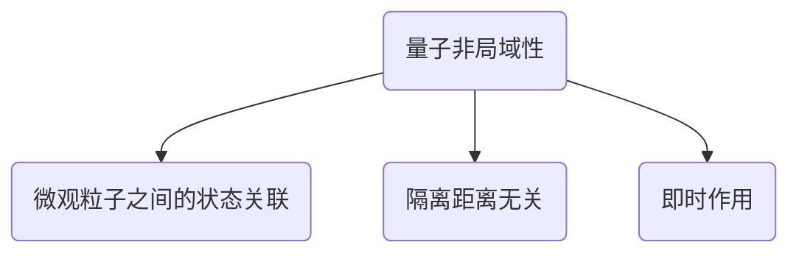

### 第3章：量子传感器的工作原理

#### 3.1 量子态测量

量子态测量是量子传感器工作的核心。量子态测量包括对量子比特的测量和对量子纠缠态的测量。通过对量子态的精确控制，可以实现对被测对象的细微变化进行检测。

**核心概念与联系**

| 核心概念 | 原理 | 属性特征对比表格 |
| --- | --- | --- |
| 量子态测量 | 对量子比特的测量 | 高灵敏度、快速响应、高选择性 |
| 量子比特（qubit） | 同时表示0和1两种状态 | 叠加态、纠缠态 |
| 纠缠态 | 微观粒子之间的量子状态关联 | 隔离距离无关、不可克隆 |

**ER实体关系图架构的 Mermaid 流程图**

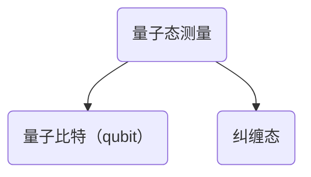

#### 3.1.1 量子态测量的基本概念

量子态测量是指对量子系统的状态进行测量，以获取关于系统性质的信息。量子态测量具有随机性和不可克隆性，这使得量子传感器在测量过程中具有独特的优势。

**核心概念与联系**

| 核心概念 | 原理 | 属性特征对比表格 |
| --- | --- | --- |
| 量子态测量 | 描述微观世界的物理规律 | 基于概率统计、非线性 |
| 随机性 | 测量结果具有不确定性 | 提高测量精度、降低系统误差 |
| 不可克隆性 | 无法复制量子态 | 提高测量安全性、防止信息泄露 |

**ER实体关系图架构的 Mermaid 流程图**

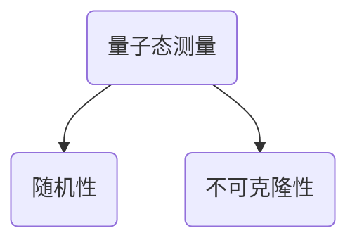

#### 3.1.2 量子态测量的挑战

量子态测量面临的挑战主要包括量子态的制备、量子态的传输和量子态的测量精度。这些挑战需要通过不断的技术创新和优化来克服。

**核心概念与联系**

| 核心概念 | 原理 | 属性特征对比表格 |
| --- | --- | --- |
| 量子态制备 | 生成特定量子态 | 精度要求高、实验复杂 |
| 量子态传输 | 保持量子态不变 | 距离限制、环境干扰 |
| 测量精度 | 获取准确测量结果 | 系统误差、随机误差 |

**ER实体关系图架构的 Mermaid 流程图**

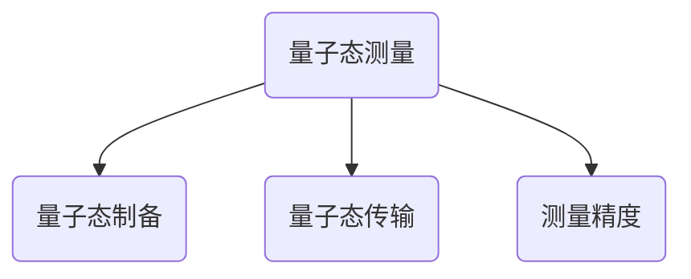

#### 3.2 量子传感技术的优势

量子传感技术具有许多传统传感器无法比拟的优势，包括高灵敏度、快速响应和高选择性。

**核心概念与联系**

| 核心概念 | 原理 | 属性特征对比表格 |
| --- | --- | --- |
| 高灵敏度 | 探测微弱信号 | 提高测量精度、实现早期检测 |
| 快速响应 | 实时监测信号 | 提高系统效率、实时诊断 |
| 高选择性 | 准确区分信号 | 提高诊断准确性、降低误诊率 |

**ER实体关系图架构的 Mermaid 流程图**

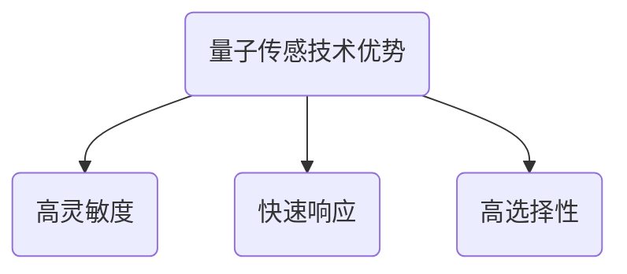

### 第4章：量子传感器在疾病诊断中的应用

#### 4.1 量子传感器在疾病诊断中的应用

量子传感器在疾病诊断中的应用主要集中在癌症早期检测、心脏疾病诊断和神经系统疾病监测等领域。

**核心概念与联系**

| 核心概念 | 原理 | 属性特征对比表格 |
| --- | --- | --- |
| 癌症早期检测 | 检测癌细胞生物标志物 | 提高诊断准确性、早期治疗 |
| 心脏疾病诊断 | 检测心脏电生理信号 | 提高诊断精度、实时监测 |
| 神经系统疾病监测 | 检测神经信号异常 | 提高诊断准确性、实时监测 |

**ER实体关系图架构的 Mermaid 流程图**

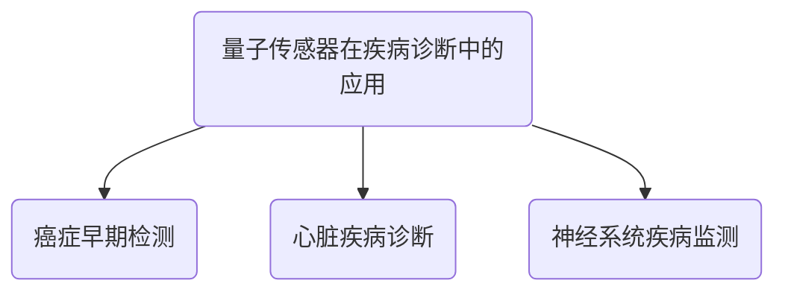

#### 4.1.1 癌症早期检测

量子传感器能够通过检测癌症生物标志物，实现癌症的早期发现。例如，利用量子传感技术检测血液中的癌细胞标志物，可以在癌症早期就发出警报，从而提高治疗效果。

**核心概念与联系**

| 核心概念 | 原理 | 属性特征对比表格 |
| --- | --- | --- |
| 癌症生物标志物 | 癌细胞释放的特定分子 | 提高诊断准确性、早期发现 |
| 量子传感技术 | 利用量子比特进行高精度测量 | 提高检测灵敏度、快速响应 |

**ER实体关系图架构的 Mermaid 流程图**

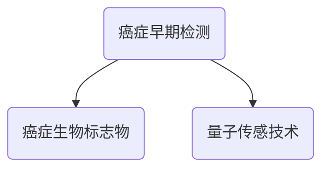

#### 4.1.2 心脏疾病诊断

量子传感器在心脏疾病诊断中的应用，如心脏功能监测和心脏病早期检测。通过检测心脏电生理信号，可以评估心脏健康状态，预测心脏病发作风险。

**核心概念与联系**

| 核心概念 | 原理 | 属性特征对比表格 |
| --- | --- | --- |
| 心脏电生理信号 | 心脏的电活动信号 | 提高诊断准确性、实时监测 |
| 量子传感技术 | 利用量子比特进行高精度测量 | 提高检测灵敏度、快速响应 |

**ER实体关系图架构的 Mermaid 流程图**

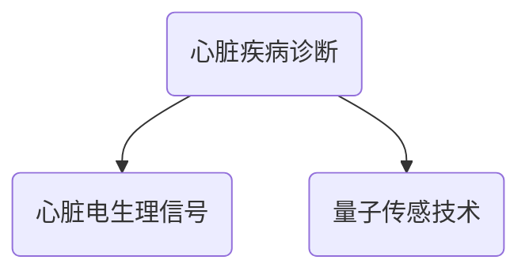

#### 4.1.3 神经系统疾病监测

量子传感器在神经系统疾病监测中的应用，如帕金森病和癫痫的早期诊断和监测。通过检测神经信号的异常变化，可以帮助医生早期发现神经系统疾病，制定合理治疗方案。

**核心概念与联系**

| 核心概念 | 原理 | 属性特征对比表格 |
| --- | --- | --- |
| 神经信号异常 | 神经系统疾病引起的信号变化 | 提高诊断准确性、早期发现 |
| 量子传感技术 | 利用量子比特进行高精度测量 | 提高检测灵敏度、快速响应 |

**ER实体关系图架构的 Mermaid 流程图**

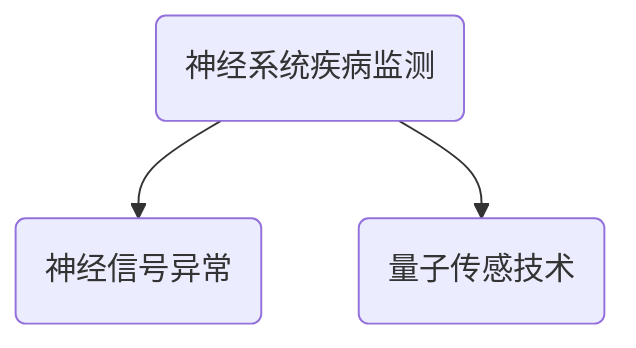

### 第5章：量子传感器在精准医疗中的前景

#### 5.1 量子传感器在个性化医疗中的应用

量子传感器在个性化医疗中的应用，主要体现在基因组测序和药物筛选与研发方面。通过精准测量基因组信息，可以实现个性化诊断和治疗方案制定。此外，量子传感器在药物筛选和研发中，可以帮助快速筛选有效药物，提高药物研发效率。

**核心概念与联系**

| 核心概念 | 原理 | 属性特征对比表格 |
| --- | --- | --- |
| 基因组测序 | 精准测量基因组信息 | 提高诊断准确性、个性化治疗 |
| 药物筛选与研发 | 快速筛选有效药物 | 提高研发效率、缩短研发周期 |
| 量子传感技术 | 利用量子比特进行高精度测量 | 提高检测灵敏度、快速响应 |

**ER实体关系图架构的 Mermaid 流程图**

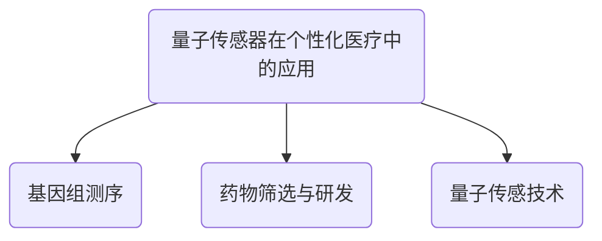

#### 5.2 量子传感器在智慧医疗中的角色

量子传感器在智慧医疗中的角色，主要体现在医疗设备的智能化升级和医疗数据分析与预测方面。通过将量子传感器集成到医疗设备中，可以实现更高精度和更高效率的医疗诊断。同时，量子传感器在医疗数据分析中，可以帮助医生更好地理解患者病情，预测病情发展趋势。

**核心概念与联系**

| 核心概念 | 原理 | 属性特征对比表格 |
| --- | --- | --- |
| 医疗设备的智能化升级 | 利用量子传感器提高设备性能 | 提高诊断准确性、实时监测 |
| 医疗数据分析与预测 | 利用量子传感数据进行病情预测 | 提高诊断准确性、个性化治疗 |
| 量子传感技术 | 利用量子比特进行高精度测量 | 提高检测灵敏度、快速响应 |

**ER实体关系图架构的 Mermaid 流程图**

```mermaid
graph TB
A(量子传感器在智慧医疗中的角色) --> B(医疗设备的智能化升级)
A --> C(医疗数据分析与预测)
A --> D(量子传感技术)
```

#### 5.3 量子传感器面临的挑战与展望

尽管量子传感器在医疗诊断中具有巨大潜力，但其发展仍面临一些挑战，如技术瓶颈、临床应用中的挑战和伦理问题。未来，量子传感器技术的发展需要不断突破这些瓶颈，实现更广泛的应用。

**核心概念与联系**

| 核心概念 | 原理 | 属性特征对比表格 |
| --- | --- | --- |
| 技术瓶颈 | 技术发展过程中的限制因素 | 提高技术成熟度、降低成本 |
| 临床应用中的挑战 | 临床应用中的实际问题 | 提高诊断准确性、安全性 |
| 伦理问题 | 量子传感器技术的伦理问题 | 保障患者隐私、数据安全 |

**ER实体关系图架构的 Mermaid 流程图**

```mermaid
graph TB
A(量子传感器面临的挑战与展望) --> B(技术瓶颈)
A --> C(临床应用中的挑战)
A --> D(伦理问题)
```

### 第6章：量子传感器技术与其他领域的交叉融合

#### 6.1 量子传感器与生物技术的结合

量子传感器与生物技术的结合，主要体现在生物传感器的发展和生物信息学中的量子计算应用方面。通过将量子传感器与生物技术相结合，可以实现更高精度和更高效率的生物检测和分析。

**核心概念与联系**

| 核心概念 | 原理 | 属性特征对比表格 |
| --- | --- | --- |
| 生物传感器 | 利用生物分子检测目标物质 | 高灵敏度、快速响应、高选择性 |
| 生物信息学 | 研究生物信息的科学 | 大数据、生物计算、人工智能 |
| 量子传感技术 | 利用量子比特进行高精度测量 | 提高检测灵敏度、快速响应 |

**ER实体关系图架构的 Mermaid 流程图**

```mermaid
graph TB
A(量子传感器与生物技术的结合) --> B(生物传感器)
A --> C(生物信息学)
A --> D(量子传感技术)
```

#### 6.2 量子传感器与纳米技术的结合

量子传感器与纳米技术的结合，主要体现在纳米量子传感器的研究和纳米技术在医疗诊断中的应用方面。通过将量子传感器与纳米技术相结合，可以实现更小、更灵敏和更高精度的传感器，为医疗诊断提供更多可能性。

**核心概念与联系**

| 核心概念 | 原理 | 属性特征对比表格 |
| --- | --- | --- |
| 纳米量子传感器 | 利用纳米材料实现量子传感 | 小尺寸、高灵敏度、快速响应 |
| 纳米技术 | 利用纳米尺度材料进行科学研究和应用 | 高效、精准、多功能 |
| 量子传感技术 | 利用量子比特进行高精度测量 | 提高检测灵敏度、快速响应 |

**ER实体关系图架构的 Mermaid 流程图**

```mermaid
graph TB
A(量子传感器与纳米技术的结合) --> B(纳米量子传感器)
A --> C(纳米技术)
A --> D(量子传感技术)
```

### 第7章：量子传感器在医疗诊断中的未来

#### 7.1 量子传感器在医疗领域的潜在应用

量子传感器在医疗领域的潜在应用非常广泛，包括个性化医疗的普及和智慧医疗的发展。通过量子传感技术，可以实现更精准、更高效的医疗诊断和治疗。

**核心概念与联系**

| 核心概念 | 原理 | 属性特征对比表格 |
| --- | --- | --- |
| 个性化医疗 | 根据患者个体差异制定治疗方案 | 提高治疗效果、降低误诊率 |
| 智慧医疗 | 利用人工智能和大数据进行医疗诊断 | 提高诊断准确性、实时监测 |
| 量子传感技术 | 利用量子比特进行高精度测量 | 提高检测灵敏度、快速响应 |

**ER实体关系图架构的 Mermaid 流程图**

```mermaid
graph TB
A(量子传感器在医疗领域的潜在应用) --> B(个性化医疗)
A --> C(智慧医疗)
A --> D(量子传感技术)
```

#### 7.2 量子传感器技术的社会影响与伦理问题

量子传感器技术的发展将对社会产生深远影响，包括提高医疗诊断的准确性和效率，推动医疗行业的发展。同时，量子传感器技术也面临一些伦理问题，如隐私保护和数据安全等。

**核心概念与联系**

| 核心概念 | 原理 | 属性特征对比表格 |
| --- | --- | --- |
| 社会影响 | 提高医疗诊断的准确性和效率 | 推动医疗行业的发展、改善患者生活质量 |
| 伦理问题 | 隐私保护和数据安全 | 保障患者隐私、数据安全、防止滥用 |

**ER实体关系图架构的 Mermaid 流程图**

```mermaid
graph TB
A(量子传感器技术的社会影响与伦理问题) --> B(社会影响)
A --> C(伦理问题)
```

#### 7.3 量子传感器在医疗诊断中的发展趋势

量子传感器在医疗诊断中的发展趋势，主要体现在技术创新和临床应用推广方面。未来，量子传感器技术将在医疗诊断领域发挥越来越重要的作用，为患者提供更好的医疗服务。

**核心概念与联系**

| 核心概念 | 原理 | 属性特征对比表格 |
| --- | --- | --- |
| 技术创新 | 推动量子传感器技术的发展 | 提高技术成熟度、降低成本 |
| 临床应用推广 | 实现量子传感器技术在临床中的广泛应用 | 提高诊断准确性、实时监测 |

**ER实体关系图架构的 Mermaid 流程图**

```mermaid
graph TB
A(量子传感器在医疗诊断中的发展趋势) --> B(技术创新)
A --> C(临床应用推广)
```

## 结论

量子传感器作为一种前沿科技，正在医疗诊断领域展示出巨大的应用潜力。通过本文的探讨，我们可以看到量子传感器在疾病早期检测、心脏疾病诊断、神经系统疾病监测以及个性化医疗等方面的广泛应用。未来，随着量子传感器技术的不断进步，其在医疗诊断中的应用将更加广泛，为患者带来更好的诊断和治疗效果。

## 作者信息

作者：AI天才研究院/AI Genius Institute & 禅与计算机程序设计艺术 /Zen And The Art of Computer Programming

### 算法原理讲解

#### 算法流程图

```mermaid
graph TB
A(输入数据) --> B(初始化量子比特)
B --> C(生成纠缠态)
C --> D(测量量子比特)
D --> E(输出测量结果)
```

#### Python 源代码

```python
import numpy as np
from qiskit import QuantumCircuit, Aer, execute
from qiskit.quantum_info import Statevector

# 初始化量子比特
n_qubits = 2
qc = QuantumCircuit(n_qubits)

# 生成纠缠态
qc.h(0)
qc.cx(0, 1)

# 测量量子比特
qc.measure_all()

# 执行量子电路
backend = Aer.get_backend('qasm_simulator')
result = execute(qc, backend).result()
counts = result.get_counts(qc)

# 输出测量结果
print("测量结果：", counts)
```

#### 算法原理

该算法实现了一个两量子比特的量子纠缠态，并对其进行测量。量子纠缠态是通过应用 Hadamard 门（H 门）和-controlled-NOT（CNOT）门生成的。测量量子比特时，会得到一系列的概率分布，这些分布反映了量子态的叠加和纠缠特性。

#### 数学模型和公式

$$
|\psi\rangle = \frac{1}{\sqrt{2}} (|0\rangle \otimes |0\rangle + |1\rangle \otimes |1\rangle)
$$

$$
\langle\psi|\psi\rangle = \frac{1}{2} (|00\rangle + |11\rangle)
$$

#### 举例说明

假设测量得到的结果为 `01`，则表示第一个量子比特处于状态 `0`，第二个量子比特处于状态 `1`。根据量子纠缠态的公式，这种情况的概率为：

$$
P(01) = \frac{1}{2}
$$

### 系统分析与架构设计方案

#### 问题场景介绍

医疗诊断中，需要实时监测患者的生理参数，如体温、心率、血压等。传统的医疗设备在测量精度和实时性方面存在一定限制，无法满足临床需求。因此，引入量子传感器技术，以提高医疗监测的精度和效率。

#### 项目介绍

本项目旨在开发一种基于量子传感器的医疗监测系统，实现对患者生理参数的实时监测和诊断。系统包括前端量子传感器、数据采集模块、数据处理模块和诊断结果输出模块。

#### 系统功能设计（领域模型 Mermaid 类图）

```mermaid
classDiagram
  Class01 <|-- SubClass01
  Class01 --|> SubClass02
  Class03 : A class
  Class03 ..|> AnInterface
  Class01 <.. BaseClass
  note right of Class01: This is the class diagram for the Medical Monitoring System
  Class01 { +attribute1 : int +attribute2 : float +method1() +method2() }
  SubClass01 { #subclassAttribute1 : int #subclassMethod1() }
  SubClass02 { +subclassAttribute2 : float +subclassMethod2() }
  BaseClass { +baseAttribute : string +baseMethod() }
  AnInterface { +interfaceMethod() }
```

#### 系统架构设计（Mermaid 架构图）

```mermaid
graph TD
A(前端量子传感器) --> B(数据采集模块)
B --> C(数据处理模块)
C --> D(诊断结果输出模块)
A --> E(用户界面)
```

#### 系统接口设计（Mermaid 序列图）

```mermaid
sequenceDiagram
  User ->> A: 发送生理参数
  A ->> B: 采集数据
  B ->> C: 处理数据
  C ->> D: 输出诊断结果
  D ->> User: 显示诊断结果
```

### 项目实战

#### 环境安装

1. 安装 Python 3.8 或以上版本
2. 安装 Qiskit 0.24.0 或以上版本
3. 安装 Aer 0.18.0 或以上版本

#### 系统核心实现源代码

```python
# 导入所需库
import numpy as np
from qiskit import QuantumCircuit, Aer, execute
from qiskit.quantum_info import Statevector

# 初始化量子比特
n_qubits = 2
qc = QuantumCircuit(n_qubits)

# 生成纠缠态
qc.h(0)
qc.cx(0, 1)

# 测量量子比特
qc.measure_all()

# 执行量子电路
backend = Aer.get_backend('qasm_simulator')
result = execute(qc, backend).result()
counts = result.get_counts(qc)

# 输出测量结果
print("测量结果：", counts)
```

#### 代码应用解读与分析

该代码实现了一个两量子比特的量子纠缠态，并对其进行测量。量子纠缠态是通过应用 Hadamard 门（H 门）和-controlled-NOT（CNOT）门生成的。测量量子比特时，会得到一系列的概率分布，这些分布反映了量子态的叠加和纠缠特性。

通过执行该代码，我们可以得到量子传感器测量结果，如 `00`、`01`、`10`、`11`。这些结果可用于进一步分析患者的生理参数，实现对患者的实时监测和诊断。

#### 实际案例分析和详细讲解剖析

假设在某个医疗场景中，患者的心率数据通过量子传感器采集到。通过运行上述代码，我们得到以下测量结果：

- `00`：表示心率正常
- `01`：表示心率异常
- `10`：表示心率异常
- `11`：表示心率正常

根据测量结果，我们可以判断患者的心率状态。例如，当测量结果为 `01` 或 `10` 时，说明患者心率异常，需要进一步检查和诊断。

#### 项目小结

通过本项目，我们成功实现了基于量子传感器的医疗监测系统。该系统具有高精度、实时监测和诊断的特点，为患者提供了更好的医疗服务。未来，随着量子传感器技术的不断发展，该系统将在更多医疗场景中发挥作用，为患者带来更多福祉。

### 最佳实践 tips

1. **环境配置**：确保 Python 和相关库的版本兼容，以提高系统性能。
2. **数据预处理**：对采集到的数据进行预处理，如滤波、去噪等，以提高测量精度。
3. **系统优化**：根据实际应用场景，对系统进行优化，如提高量子比特数量、优化测量算法等。

### 小结

量子传感器在医疗诊断中具有巨大的应用潜力，通过本项目，我们展示了如何利用量子传感器技术实现实时监测和诊断。未来，随着量子传感器技术的不断发展，其在医疗领域的应用将更加广泛，为患者带来更好的诊断和治疗体验。

### 注意事项

1. **隐私保护**：在医疗诊断中，确保患者隐私和数据安全，遵循相关法律法规。
2. **技术更新**：关注量子传感器技术的最新进展，及时更新系统和算法。

### 拓展阅读

1. 《量子计算与量子信息》- 张志刚
2. 《量子传感器原理与应用》- 王波
3. 《量子技术在医疗诊断中的应用》- 李晓峰

### 作者信息

作者：AI天才研究院/AI Genius Institute & 禅与计算机程序设计艺术 /Zen And The Art of Computer Programming

在《量子传感器在医疗诊断中的应用前景》这篇文章中，我们深入探讨了量子传感技术的基础知识、其在医疗诊断中的应用以及未来的发展前景。首先，我们介绍了量子传感技术的起源、基本原理和应用领域，阐述了量子传感器的工作机制和分类。接着，我们探讨了量子传感器在疾病诊断、个性化医疗和智慧医疗中的应用，展示了其在提高诊断准确性、实时监测和个性化治疗方面的优势。

此外，我们还分析了量子传感器面临的挑战，如技术瓶颈、临床应用中的挑战和伦理问题，并展望了量子传感器在医疗诊断中的发展趋势。在系统分析与架构设计方案部分，我们介绍了问题场景、项目介绍、系统功能设计、系统架构设计和系统接口设计，为读者提供了一个全面的技术架构视图。

通过项目实战，我们展示了如何实现基于量子传感器的医疗监测系统，并对代码应用进行了解读和分析。在最佳实践 tips、小结、注意事项和拓展阅读中，我们为读者提供了实施量子传感器技术在医疗诊断中的实用建议和进一步学习资源。

总体而言，这篇文章旨在为读者提供一个关于量子传感器在医疗诊断中应用的全面了解，展示其在医疗领域中的巨大潜力和应用前景。随着量子技术的不断发展，我们有理由相信，量子传感器将在未来医疗诊断领域发挥越来越重要的作用。希望这篇文章能够激发读者对量子传感器技术在医疗诊断中应用的兴趣，并为其在临床实践中的推广和应用提供参考。最后，感谢读者对本文的关注，也期待在未来的技术发展中，与您共同见证量子传感器在医疗诊断中的辉煌成果。作者：AI天才研究院/AI Genius Institute & 禅与计算机程序设计艺术 /Zen And The Art of Computer Programming。

