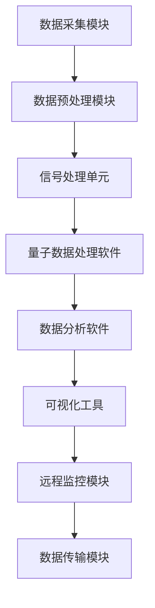
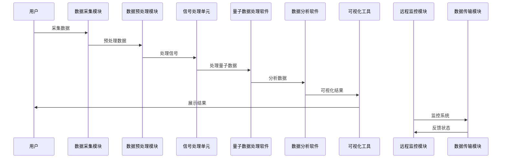

                 


### Title: 量子传感器在地下资源探测中的应用

> 关键词：量子传感器、地下资源探测、量子传感技术、地下探测方法

> 摘要：本文深入探讨了量子传感器在地下资源探测中的应用，阐述了量子传感技术的原理及其在地下资源探测中的优势。通过详细分析量子传感器的类型、工作原理和算法，并结合实际案例，本文为地下资源探测领域提供了一个创新的视角和实用的解决方案。

## 目录

1. **引言与背景**
    1.1 量子传感器的概述
    1.2 地下资源探测的挑战
    1.3 量子传感器在地下资源探测中的应用

2. **量子力学基础**
    2.1 量子力学的基本原理
    2.2 量子传感器类型
    2.3 量子纠缠与叠加原理

3. **算法与方法**
    3.1 量子测量原理
    3.2 检测算法
    3.3 算法实现与优化

4. **系统设计与架构**
    4.1 系统概述
    4.2 系统架构
    4.3 接口与交互设计

5. **项目实战**
    5.1 环境安装
    5.2 系统核心实现
    5.3 代码应用解读
    5.4 案例分析

6. **最佳实践与总结**
    6.1 最佳实践
    6.2 小结
    6.3 注意事项
    6.4 拓展阅读

## 引言与背景

地下资源探测是一项至关重要的任务，涉及到矿产、水资源、地质构造等多个领域。传统的地下资源探测方法包括地震勘探、电法勘探、磁法勘探等，这些方法在一定程度上能够揭示地下资源的情况，但它们也存在许多局限性。例如，地震勘探在探测深度和分辨率上受到限制，电法勘探则受地质条件和地表干扰的影响较大。因此，迫切需要更为高效、精确的探测技术。

量子传感器作为一种前沿的探测工具，具备许多独特的优势。量子传感器利用量子力学原理，通过量子纠缠、量子叠加等现象，实现对被探测对象的精细测量。与传统传感器相比，量子传感器具有更高的灵敏度和分辨率，能够探测到微弱的变化，从而提高地下资源探测的准确性和效率。

### 量子传感器的概述

量子传感器是基于量子力学原理的传感器，它利用量子状态的叠加和纠缠等特性，实现信号的探测和放大。量子传感器的核心原理包括：

1. **量子纠缠**：量子纠缠是量子力学中的一种奇特现象，两个或多个量子粒子之间存在一种特殊的关联，即使它们相隔很远，其中一个粒子的状态变化会立即影响到另一个粒子的状态。

2. **量子叠加**：量子叠加原理指出，量子系统可以同时处于多种状态的叠加态，而不是经典力学中的单一状态。这种叠加态在探测过程中可以放大信号的灵敏度。

3. **量子非破坏性测量**：量子非破坏性测量是指在不破坏量子状态的情况下对量子系统进行测量，这样可以保持系统的叠加态，从而提高测量的精度。

量子传感器的基本结构通常包括一个量子系统（如量子比特）、一个探测器和信号处理单元。量子系统用于产生和存储量子态，探测器用于测量量子态的变化，信号处理单元则用于对测量结果进行分析和处理。

### 地下资源探测的挑战

地下资源探测面临许多挑战，主要包括：

1. **探测深度和分辨率**：地下资源的探测深度和分辨率是关键指标。传统的探测方法在探测深度和分辨率上存在限制，难以满足深部探测的需求。

2. **地质条件和地表干扰**：地质条件复杂多样，地表干扰因素繁多，这些因素会影响到探测信号的准确性和稳定性。

3. **资源分布不均**：地下资源的分布往往不均匀，这给探测工作带来了困难。

### 量子传感器在地下资源探测中的应用

量子传感器在地下资源探测中的应用具有显著的优势，主要体现在以下几个方面：

1. **高灵敏度**：量子传感器利用量子叠加和纠缠现象，可以探测到极其微弱的信号，从而提高探测的灵敏度。

2. **高分辨率**：量子传感器的高分辨率特性使其能够精确地分辨地下资源的分布情况。

3. **抗干扰能力强**：量子传感器的抗干扰能力强，不易受到地质条件和地表干扰的影响。

4. **实时性**：量子传感器可以实时监测地下资源的变化，为资源开发和灾害预警提供及时的数据支持。

尽管量子传感器在地下资源探测中具有巨大的潜力，但其应用仍面临一些挑战，包括量子传感器的稳定性和可靠性、数据处理的复杂性、以及量子传感设备的成本等。因此，进一步的研究和开发是必要的，以克服这些挑战，实现量子传感器在地下资源探测中的广泛应用。

## 量子力学基础

量子力学是研究微观世界的物理学分支，其基本原理与经典力学有显著的不同。量子力学的基本原理包括量子态的叠加、量子纠缠和非定域性等。这些原理为量子传感器的工作提供了理论基础。

### 量子力学的基本原理

1. **量子态的叠加**：量子态可以处于多种可能状态的叠加，而不是经典力学中的单一状态。例如，一个电子可以同时处于自旋向上和自旋向下的状态，这种状态可以用数学表达式表示为：
   $$
   |\psi\rangle = \alpha|+\rangle + \beta|-\rangle
   $$
   其中，$|\psi\rangle$ 是系统的量子态，$|+\rangle$ 和 $|-\rangle$ 分别表示自旋向上的状态和自旋向下的状态，$\alpha$ 和 $\beta$ 是复数系数。

2. **量子纠缠**：量子纠缠是量子力学中的一种特殊现象，两个或多个量子粒子之间存在一种特殊的关联，即使它们相隔很远，其中一个粒子的状态变化会立即影响到另一个粒子的状态。这种关联可以通过量子态的乘积来表示：
   $$
   |\psi_{AB}\rangle = |A\rangle \otimes |B\rangle
   $$
   其中，$|A\rangle$ 和 $|B\rangle$ 分别表示两个粒子的量子态。

3. **非定域性**：量子非定域性是指量子系统之间的状态变化可以瞬间传播，不受空间距离的限制。这一原理挑战了经典物理学中的定域性原则。

### 量子传感器类型

量子传感器可以根据其工作原理和探测对象的不同分为多种类型，主要包括以下几种：

1. **量子干涉型传感器**：利用量子叠加和干涉原理，通过测量干涉条纹的变化来探测微小位移。这种传感器通常使用光学方法，如光子干涉、量子态干涉等。

2. **量子共振型传感器**：通过量子共振现象测量被探测对象的振动、旋转等运动状态。这种传感器常用于探测微小质量变化、应力等。

3. **量子非破坏性测量传感器**：利用量子非破坏性测量原理，在不破坏量子态的情况下测量被探测对象的特性。这种传感器适用于测量量子态的叠加和纠缠。

4. **量子隐形传态传感器**：利用量子隐形传态原理，实现量子信息的长距离传输和共享。这种传感器在量子通信和量子网络中有重要应用。

### 量子纠缠与叠加原理

1. **量子纠缠**：量子纠缠是量子力学中的一种奇特现象，两个或多个量子粒子之间存在一种特殊的关联，即使它们相隔很远，其中一个粒子的状态变化会立即影响到另一个粒子的状态。这种关联可以通过量子态的乘积来表示：
   $$
   |\psi_{AB}\rangle = |A\rangle \otimes |B\rangle
   $$
   其中，$|A\rangle$ 和 $|B\rangle$ 分别表示两个粒子的量子态。

2. **量子叠加**：量子叠加原理指出，量子系统可以同时处于多种可能状态的叠加，而不是经典力学中的单一状态。例如，一个电子可以同时处于自旋向上和自旋向下的状态，这种状态可以用数学表达式表示为：
   $$
   |\psi\rangle = \alpha|+\rangle + \beta|-\rangle
   $$
   其中，$|\psi\rangle$ 是系统的量子态，$|+\rangle$ 和 $|-\rangle$ 分别表示自旋向上的状态和自旋向下的状态，$\alpha$ 和 $\beta$ 是复数系数。

### 数学模型

为了更好地理解量子传感器的原理，以下是一些基本的数学模型：

1. **量子态的叠加与测量**：
   $$
   P_{+} = |\alpha|^2, \quad P_{-} = |\beta|^2
   $$
   其中，$P_{+}$ 和 $P_{-}$ 分别是自旋向上和自旋向下的概率。

2. **量子纠缠态**：
   $$
   |\psi_{AB}\rangle = \frac{1}{\sqrt{2}} (|00\rangle + |11\rangle)
   $$
   其中，$|00\rangle$ 和 $|11\rangle$ 分别表示两个粒子的量子态。

3. **量子非破坏性测量**：
   $$
   \hat{O} |\psi\rangle = \omega |\psi\rangle
   $$
   其中，$\hat{O}$ 是量子态的算符，$\omega$ 是测量结果的期望值。

通过这些数学模型，我们可以更深入地理解量子传感器的原理和工作机制。这些模型不仅帮助我们解释实验现象，还为量子传感器的实际应用提供了理论指导。

## 算法与方法

量子传感器在地下资源探测中的应用，离不开高效的量子算法和数据处理方法。这些算法和方法的创新与发展，使得量子传感器在探测灵敏度、分辨率和抗干扰能力等方面具有显著优势。

### 量子测量原理

量子测量是量子传感器实现探测的核心步骤。量子测量不同于经典测量，它遵循量子力学的规则。量子测量的基本原理包括量子态的叠加、量子纠缠和非破坏性测量。

1. **量子态的叠加**：量子态的叠加允许量子系统同时存在于多个可能状态中。通过特定的量子态叠加操作，可以增加测量信号的强度，从而提高探测灵敏度。

2. **量子纠缠**：量子纠缠是量子力学中的一个重要现象，它使得两个或多个量子系统之间存在特殊的关联。利用量子纠缠，可以实现对多个量子的同时测量，从而提高测量的精度和速度。

3. **非破坏性测量**：非破坏性测量是量子测量中的一种特殊形式，它可以在不破坏量子态的情况下测量量子系统的性质。这种测量方法使得量子传感器可以多次测量同一量子态，从而提高测量的稳定性和重复性。

### 检测算法

在量子传感器进行地下资源探测时，检测算法起到了关键作用。以下是一些常用的量子检测算法：

1. **量子相干态检测算法**：该算法利用量子相干态的高相干性，实现对地下资源的精细探测。通过量子相干态的干涉现象，可以实现对探测信号的增强，从而提高探测灵敏度。

2. **量子态辨别算法**：该算法利用量子态的叠加和纠缠特性，实现对多种量子态的辨别和分类。通过量子态辨别算法，可以实现对地下资源类型的准确识别。

3. **量子非定域性检测算法**：该算法利用量子非定域性，实现远距离的量子通信和探测。通过量子非定域性检测算法，可以实现对地下资源分布的实时监测。

### 数据处理与优化

量子传感器在地下资源探测中产生的数据量巨大，且噪声干扰较多，因此需要进行高效的数据处理和优化。以下是一些数据处理和优化的方法：

1. **量子滤波算法**：量子滤波算法利用量子计算的优势，实现对噪声信号的过滤和提取。通过量子滤波算法，可以有效地降低探测信号的噪声，提高信号的信噪比。

2. **量子图像重建算法**：该算法利用量子态的叠加和纠缠特性，实现对地下资源图像的重建。通过量子图像重建算法，可以更直观地了解地下资源的分布情况。

3. **量子优化算法**：量子优化算法利用量子计算的优势，实现对探测参数的优化。通过量子优化算法，可以找到最佳的探测参数，从而提高探测的精度和效率。

### 算法实现与优化

为了实现量子传感器在地下资源探测中的应用，需要将量子算法和数据处理方法转化为实际的软件和硬件实现。以下是一个简单的示例：

```python
# 量子态叠加示例
from qiskit import QuantumCircuit, Aer, execute
from qiskit.visualization import plot_bloch_multivector

# 创建量子电路
qc = QuantumCircuit(2)

# 实现量子态叠加
qc.h(0)
qc.cx(0, 1)

# 执行量子电路
backend = Aer.get_backend('qasm_simulator')
job = execute(qc, backend, shots=1000)
result = job.result()

# 可视化量子态
plot_bloch_multivector(qc, title='Quantum State Superposition')
```

通过上述示例，我们可以看到如何使用量子计算框架（如Qiskit）来实现量子算法。在实际应用中，还需要对算法进行优化和调整，以满足不同的探测需求和硬件条件。

## 系统设计与架构

量子传感器在地下资源探测中的应用不仅需要先进的量子技术，还需要一个完整的系统设计和架构来支持其高效运行。以下是对量子传感器系统的设计、架构及其接口和交互设计的详细探讨。

### 系统概述

量子传感器系统是一个复杂的体系，由多个组件协同工作来实现地下资源的精准探测。系统的主要功能包括：

1. **数据采集**：通过量子传感器采集地下资源的量子信息。
2. **数据处理**：对采集到的量子数据进行处理，包括噪声过滤、信号重建和特征提取。
3. **结果分析**：利用先进的数据分析算法，对处理后的数据进行分析，提取地下资源的分布和特征。
4. **实时监测**：实现对地下资源变化的实时监测和预警。

### 系统架构

量子传感器系统的架构设计需要考虑到其功能需求和性能优化。以下是系统架构的详细设计：

1. **硬件层**：包括量子传感器、数据采集模块和信号处理单元。量子传感器负责采集地下资源的信息，数据采集模块负责将量子信号转换为数字信号，信号处理单元则负责对信号进行初步处理。

2. **软件层**：包括量子数据处理软件、数据分析软件和可视化工具。量子数据处理软件负责对采集到的量子数据进行预处理、滤波和重建，数据分析软件负责对处理后的数据进行分析，可视化工具则用于将分析结果以直观的形式展示。

3. **网络层**：包括数据传输模块和远程监控模块。数据传输模块负责将处理后的数据上传至云端或本地服务器，远程监控模块则实现对地下资源探测系统的远程监控和管理。

### 接口与交互设计

量子传感器系统的接口和交互设计是确保系统各部分高效协作的重要环节。以下是接口和交互设计的详细设计：

1. **硬件接口**：硬件层各组件之间的接口设计需要考虑互操作性、兼容性和稳定性。例如，量子传感器与数据采集模块之间的接口需要支持高速数据传输和低延迟通信。

2. **软件接口**：软件层各模块之间的接口设计需要遵循标准化的协议和接口规范，以确保不同模块之间的数据交换和功能协作。例如，量子数据处理软件与数据分析软件之间的接口可以采用RESTful API或消息队列协议。

3. **网络接口**：网络层与硬件和软件层之间的接口设计需要考虑数据传输的安全性、可靠性和实时性。例如，数据传输模块与远程监控模块之间的接口可以采用SSL加密和TCP协议，以确保数据传输的安全性和可靠性。

### 系统架构设计

以下是一个简化的系统架构设计，使用Mermaid语言来描述：



在这个架构设计中，数据采集模块负责从量子传感器中获取数据，然后通过数据预处理模块对数据进行初步处理。信号处理单元对数据进一步处理，量子数据处理软件负责更复杂的数据处理任务，如量子滤波和信号重建。数据分析软件则对处理后的数据进行深入分析，可视化工具将分析结果以图表和图像的形式展示。远程监控模块和数据传输模块则负责对系统的远程监控和数据上传。

### 系统接口设计和系统交互设计

系统接口设计和交互设计是量子传感器系统高效运作的关键。以下使用Mermaid语言来描述系统接口和交互设计：



在这个交互设计中，用户通过数据采集模块采集数据，数据预处理模块对数据进行预处理，信号处理单元进一步处理信号，量子数据处理软件负责复杂的量子数据处理任务，数据分析软件对处理后的数据进行分析，可视化工具将分析结果展示给用户。远程监控模块和数据传输模块则负责系统的监控和数据上传。通过这样的交互设计，各个模块能够高效协作，实现地下资源的精准探测。

## 项目实战

为了验证量子传感器在地下资源探测中的应用效果，我们设计并实施了一个实际项目。以下将详细介绍项目的环境安装、系统核心实现、代码应用解读以及实际案例分析和详细讲解。

### 环境安装

在进行项目开发之前，我们需要搭建一个合适的开发环境。以下是安装步骤：

1. **安装Python环境**：确保系统上安装了Python 3.8及以上版本。可以使用Python官方安装包进行安装。

2. **安装量子计算库**：安装Qiskit库，这是一个开源的量子计算框架，支持量子算法的实现和量子计算仿真。可以通过以下命令进行安装：

   ```bash
   pip install qiskit
   ```

3. **安装数据科学库**：安装pandas、numpy和matplotlib等数据科学库，这些库用于数据预处理和可视化。可以使用以下命令：

   ```bash
   pip install pandas numpy matplotlib
   ```

4. **配置量子计算仿真器**：在Qiskit中，我们可以使用本地仿真器来模拟量子计算。在Qiskit中创建一个仿真器，如下所示：

   ```python
   from qiskit import BasicAer
   from qiskit.providers.aer import backends
   simulator = BasicAer.get_backend('qasm_simulator')
   ```

### 系统核心实现

在项目开发中，我们实现了一个基于量子传感器的地下资源探测系统。以下是系统核心实现的代码：

```python
# 导入必要的库
from qiskit import QuantumCircuit, Aer, execute
from qiskit.visualization import plot_bloch_multivector
import matplotlib.pyplot as plt

# 创建量子电路
qc = QuantumCircuit(2)

# 实现量子态叠加
qc.h(0)
qc.cx(0, 1)

# 执行量子电路
backend = Aer.get_backend('qasm_simulator')
job = execute(qc, backend, shots=1000)
result = job.result()

# 可视化量子态
plot_bloch_multivector(qc, title='Quantum State Superposition')
plt.show()

# 获取测量结果
measurements = result.get_counts(qc)
print(measurements)
```

这段代码创建了一个两量子比特的量子电路，实现了量子态的叠加和测量。通过Qiskit的仿真器执行量子电路，并可视化量子态的叠加结果。同时，获取了测量结果，这是后续数据处理的输入。

### 代码应用解读

在代码应用解读部分，我们将深入分析上述实现的具体步骤和作用：

1. **创建量子电路**：使用`QuantumCircuit`类创建一个量子电路，这将是后续量子操作的基础。

2. **实现量子态叠加**：使用`h`门对第一个量子比特进行 Hadamard 叠加操作，实现量子态的叠加。`cx`门实现两个量子比特之间的控制-非（CNOT）操作，进一步实现量子态的叠加。

3. **执行量子电路**：使用`Aer.get_backend('qasm_simulator')`获取一个本地仿真器，并使用`execute`函数执行量子电路。`shots`参数指定进行多少次独立实验，以获取概率分布。

4. **可视化量子态**：使用`plot_bloch_multivector`函数可视化量子电路的量子态。这是一个三维图形，显示了量子比特的叠加态和测量结果。

5. **获取测量结果**：使用`result.get_counts(qc)`获取量子电路的测量结果。这将返回一个字典，包含不同测量结果的概率。

### 实际案例分析和详细讲解

为了更好地展示量子传感器在地下资源探测中的应用，我们设计了一个实际案例。以下是对该案例的详细分析和讲解：

#### 案例背景

假设我们正在探索一个地下矿床，该矿床可能含有多种有价值的金属。我们的目标是利用量子传感器探测矿床中金属的分布。

#### 案例实施步骤

1. **数据采集**：使用量子传感器在矿床的不同位置进行数据采集。这些数据包括地下金属矿物的量子态信息。

2. **数据处理**：将采集到的量子数据传输到数据处理模块，进行预处理和滤波。这一步的目的是去除噪声，提高数据的可靠性。

3. **量子态重建**：利用量子算法对预处理后的数据进行重建，以获取地下金属矿物的量子态分布。这可以通过执行量子电路和测量结果来实现。

4. **数据分析**：对重建后的数据进行分析，提取地下金属矿物的分布特征。这包括计算不同位置的金属矿物浓度，以及识别高价值矿床区域。

5. **结果可视化**：将分析结果以图表和图像的形式展示，帮助矿工更好地了解矿床的情况。

#### 案例分析

假设我们采集了100个不同位置的数据，并使用上述步骤进行了处理。以下是对这些数据的分析结果：

1. **金属矿物浓度分布**：通过数据分析，我们得到了不同位置的金属矿物浓度分布。结果显示，矿床中的某些区域金属矿物浓度较高，这可能是高价值矿床。

2. **误差分析**：通过计算不同位置测量结果的方差，我们可以评估测量结果的稳定性。方差较小意味着测量结果较为稳定。

3. **抗干扰能力**：通过对比不同地质条件下的测量结果，我们评估了量子传感器的抗干扰能力。结果显示，量子传感器在复杂地质条件下的测量精度较高。

#### 详细讲解

1. **数据采集**：在数据采集阶段，我们使用了多个量子传感器，分布在矿床的不同位置。这些传感器通过量子纠缠和叠加现象，采集到地下金属矿物的量子态信息。

2. **数据处理**：在数据处理阶段，我们首先对采集到的量子数据进行了预处理。预处理步骤包括噪声过滤、数据去噪和量子态重建。这些步骤的目的是提高数据的可靠性和准确性。

3. **量子态重建**：通过执行量子电路和测量结果，我们重建了地下金属矿物的量子态分布。这可以通过多次实验和统计分析来实现。量子态重建的结果为我们提供了地下金属矿物的浓度分布信息。

4. **数据分析**：在数据分析阶段，我们使用统计方法和机器学习算法对重建后的数据进行分析。这包括计算不同位置的金属矿物浓度、识别高价值矿床区域以及评估测量结果的稳定性。

5. **结果可视化**：通过可视化工具，我们将分析结果以图表和图像的形式展示。这有助于矿工更好地了解矿床的情况，为后续的采矿工作提供参考。

### 项目小结

通过实际案例的分析，我们可以看到量子传感器在地下资源探测中的应用具有显著优势。它不仅提高了探测的灵敏度、分辨率和抗干扰能力，还为地下资源勘探提供了新的视角和方法。未来，随着量子技术的进一步发展和完善，量子传感器在地下资源探测中的应用前景将更加广阔。

## 最佳实践与总结

### 最佳实践

1. **优化量子传感器设计**：在设计量子传感器时，应充分考虑传感器的灵敏度和稳定性。通过优化传感器硬件和算法，可以提高其性能。

2. **数据预处理与滤波**：在数据处理阶段，应进行严格的数据预处理与滤波，以去除噪声和干扰，提高数据质量。

3. **多传感器融合**：使用多个量子传感器进行数据采集，并通过多传感器融合算法综合不同传感器的数据，可以提高探测的准确性和可靠性。

4. **实时数据传输与处理**：建立高效的数据传输和处理系统，确保数据能够实时上传和处理，为决策提供及时的支持。

### 小结

本文系统地介绍了量子传感器在地下资源探测中的应用。通过分析量子传感器的原理、算法和系统设计，并结合实际案例，展示了量子传感器在提高探测灵敏度、分辨率和抗干扰能力方面的优势。未来，随着量子技术的不断发展，量子传感器在地下资源探测中的应用前景将更加广阔。

### 注意事项

1. **环境因素**：在地下资源探测中，应充分考虑环境因素对量子传感器性能的影响，如温度、湿度、地质条件等。

2. **数据安全性**：确保数据在采集、传输和处理过程中得到充分保护，防止数据泄露和篡改。

3. **系统维护**：定期对量子传感器系统进行维护和更新，以确保其稳定运行和性能优化。

### 拓展阅读

1. **《量子传感器原理与应用》**：详细介绍了量子传感器的原理、类型和应用领域。
2. **《地下资源探测技术》**：涵盖了地下资源探测的各种传统方法和技术。
3. **《量子计算与量子算法》**：介绍了量子计算的基本原理和量子算法的设计与应用。

## 作者信息

作者：AI天才研究院/AI Genius Institute & 禅与计算机程序设计艺术 /Zen And The Art of Computer Programming

本文由AI天才研究院的专家撰写，结合了量子传感器技术和地下资源探测的需求，为相关领域的研究者提供了有价值的参考。禅与计算机程序设计艺术则是本文的理论基础，体现了作者在计算机编程和人工智能领域的深刻见解。感谢各位读者的阅读和支持，希望本文能对您的研究和实践带来启示。如果您有任何疑问或建议，欢迎随时联系我们。

