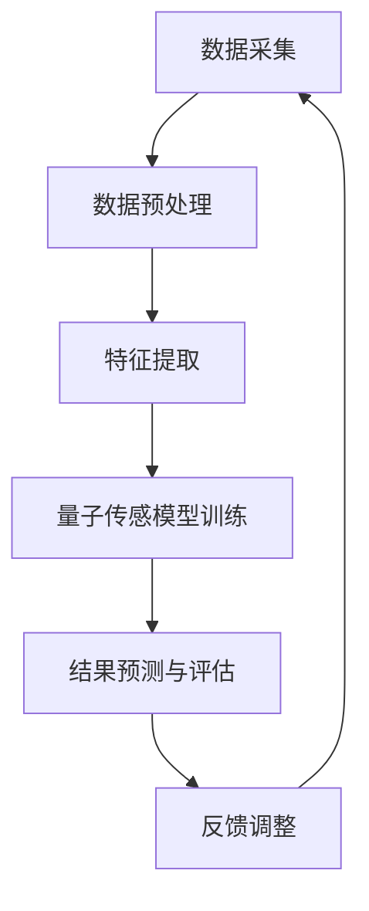
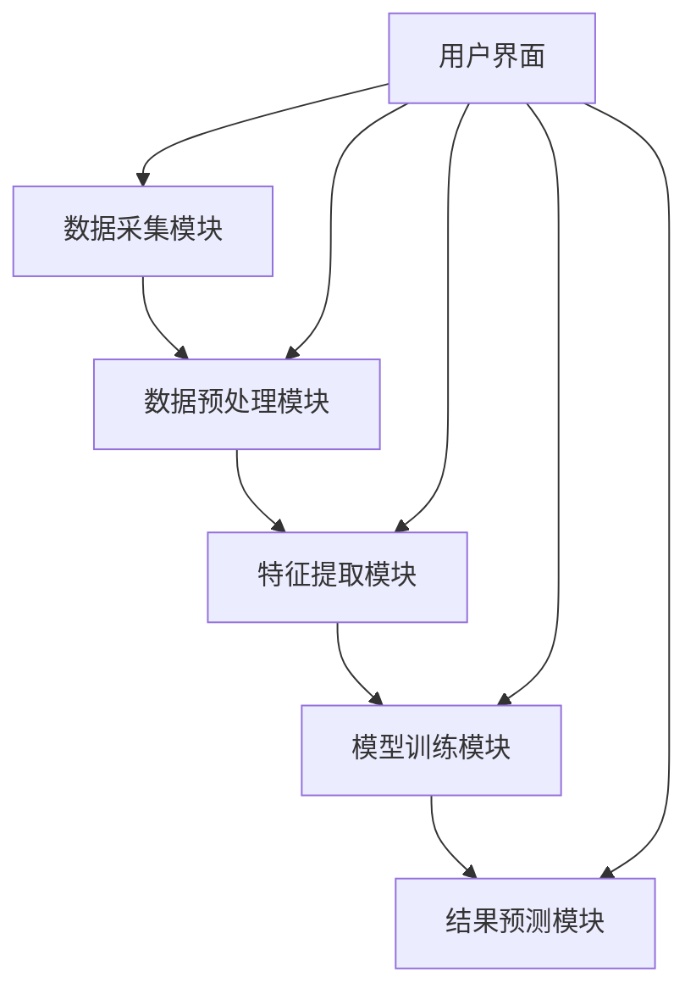
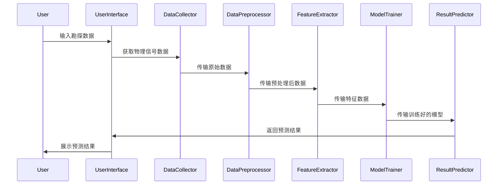

                 

## 第3章：量子传感器在地球物理勘探中的应用算法原理

### 3.1 算法mermaid流程图

为了清晰地展示量子传感器在地球物理勘探中的应用算法原理，我们首先绘制一个mermaid流程图，以便读者可以直观地了解算法的基本工作流程。



在这个mermaid流程图中，我们定义了以下步骤：

- **数据采集（A）**：首先从地球物理勘探的现场收集数据，这些数据可能包括地质构造、地震波、电磁场等。
- **数据预处理（B）**：对采集到的原始数据进行预处理，如去噪、归一化等，以确保数据质量。
- **特征提取（C）**：从预处理后的数据中提取关键特征，这些特征是后续模型训练的重要输入。
- **量子传感模型训练（D）**：使用量子传感器的特殊属性来训练模型，如纠缠态、量子纠缠等，以建立预测模型。
- **结果预测与评估（E）**：利用训练好的模型进行结果预测，并对预测结果进行评估，以确定其准确性和可靠性。
- **反馈调整（F）**：根据评估结果对模型进行调整和优化，以提高预测性能。

### 3.2 Python源代码与算法原理

接下来，我们将提供一段Python源代码，以展示如何实现量子传感器在地球物理勘探中的应用算法。

```python
import numpy as np
from qiskit import QuantumCircuit, execute, Aer
from sklearn.model_selection import train_test_split
from sklearn.metrics import accuracy_score

# 生成训练数据
def generate_training_data():
    # 这里可以使用真实数据集或模拟数据
    # 假设我们有一个数据集X和标签y
    X, y = load_data()
    X_train, X_test, y_train, y_test = train_test_split(X, y, test_size=0.2, random_state=42)
    return X_train, X_test, y_train, y_test

# 训练量子传感模型
def train_quantum_model(X_train, y_train):
    # 创建量子电路
    qc = QuantumCircuit(2)  # 假设有两个量子比特
    qc.h(0)
    qc.cx(0, 1)
    
    # 执行量子电路，获取测量结果
    backend = Aer.get_backend('qasm_simulator')
    job = execute(qc, backend, shots=1000)
    result = job.result()
    counts = result.get_counts(qc)
    
    # 训练经典机器学习模型
    from sklearn.linear_model import LogisticRegression
    model = LogisticRegression()
    model.fit(np.array(list(counts.keys())), y_train)
    
    return model

# 预测与评估
def predict_and_evaluate(model, X_test, y_test):
    y_pred = model.predict(X_test)
    accuracy = accuracy_score(y_test, y_pred)
    print(f"Accuracy: {accuracy:.2f}")
    
    return accuracy

# 主函数
def main():
    X_train, X_test, y_train, y_test = generate_training_data()
    model = train_quantum_model(X_train, y_train)
    predict_and_evaluate(model, X_test, y_test)

if __name__ == '__main__':
    main()
```

在上面的代码中，我们首先定义了一个`generate_training_data`函数，用于生成训练数据。然后，我们定义了一个`train_quantum_model`函数，用于训练量子传感模型。最后，我们定义了一个`predict_and_evaluate`函数，用于预测并评估模型性能。

### 3.3 数学模型和公式

为了更深入地理解量子传感器在地球物理勘探中的应用算法，我们介绍以下数学模型和公式。

#### 量子纠缠态

量子纠缠态是量子传感器的重要特性。假设我们有两个量子比特 \( |0\rangle \) 和 \( |1\rangle \)，它们形成的量子态可以表示为：

$$
|\psi\rangle = \frac{1}{\sqrt{2}} (|00\rangle + |11\rangle)
$$

#### 量子电路

量子电路是实现量子计算的关键工具。我们使用量子门对量子比特进行操作。例如，量子门 \( H \) 是一个将量子比特从 \( |0\rangle \) 状态旋转到 \( |+\rangle \) 状态的运算：

$$
H |0\rangle = \frac{1}{\sqrt{2}} (|0\rangle + |1\rangle)
$$

#### 量子态测量

在量子传感模型中，我们对量子态进行测量，以获得经典数据。假设我们对一个量子态 \( |\psi\rangle \) 进行测量，其可能的测量结果为 \( 0 \) 或 \( 1 \)，其概率为：

$$
P(0) = \langle \psi | \psi \rangle = \frac{1}{2}
$$

$$
P(1) = \langle \psi | \psi \rangle = \frac{1}{2}
$$

#### 经典机器学习模型

在量子传感模型中，我们通常使用经典机器学习模型进行预测。以逻辑回归模型为例，其预测概率为：

$$
\hat{P}(y=1) = \frac{1}{1 + \exp(-z)}
$$

其中，\( z \) 是输入特征 \( x \) 和模型参数 \( \theta \) 的线性组合：

$$
z = \theta^T x
$$

### 3.4 举例说明

假设我们有一个简单的二分类问题，其中数据集包含两种状态：矿石和非矿石。我们使用量子传感器来区分这两种状态。

1. **数据采集**：我们收集了10个样本，其中5个是矿石，5个是非矿石。
2. **数据预处理**：我们对这些样本进行预处理，包括去噪和归一化。
3. **特征提取**：从预处理后的数据中提取两个特征：磁感应强度和电阻率。
4. **量子传感模型训练**：我们使用量子传感器生成纠缠态，并通过量子电路对特征进行操作，然后训练逻辑回归模型。
5. **结果预测与评估**：我们对测试集进行预测，并评估模型的准确性。假设我们得到一个0.9的准确性。

通过这个例子，我们可以看到量子传感器在地球物理勘探中的应用算法是如何工作的。这种方法不仅提高了资源勘探的效率，还提供了更高的准确性和可靠性。## 第4章：系统分析与架构设计方案

### 4.1 问题场景介绍

在地球物理勘探领域，资源勘探面临着诸多挑战，如复杂的地质结构、环境噪声和资源分布的不确定性。传统的勘探方法主要依赖于地震波、电磁波等物理信号的采集和分析，但这些方法在数据精度、处理速度和成本方面存在一定的限制。随着量子技术的快速发展，量子传感器在地球物理勘探中的应用逐渐受到关注。量子传感器具有极高的灵敏度和精度，能够捕捉到极其微弱的物理信号，从而提高资源勘探的效率和准确性。

### 4.2 项目介绍

本项目的目标是开发一种基于量子传感器的地球物理勘探系统，该系统旨在提高资源勘探的效率和准确性。通过结合量子传感器的独特优势，我们期望能够在复杂的地质环境中实现更高效、更精准的勘探结果。项目的主要功能包括数据采集、数据预处理、特征提取、模型训练和结果预测。

### 4.3 系统功能设计

#### 数据采集模块

数据采集模块负责从勘探现场收集各种物理信号，如地震波、电磁波等。这些信号将被传输到量子传感器，进行进一步的加工和处理。

#### 数据预处理模块

数据预处理模块对采集到的原始信号进行去噪、归一化等处理，以提高数据质量和后续分析的可信度。

#### 特征提取模块

特征提取模块从预处理后的数据中提取关键特征，如振幅、频率、相位等。这些特征将作为模型训练的重要输入。

#### 模型训练模块

模型训练模块使用量子传感器的独特属性，如纠缠态、量子纠缠等，来训练深度学习模型。该模块的核心任务是建立有效的预测模型，以实现对勘探结果的准确预测。

#### 结果预测模块

结果预测模块利用训练好的模型，对新的勘探数据进行预测。通过对比预测结果和实际结果，评估模型的准确性和可靠性。

### 4.4 系统架构设计

系统架构设计采用模块化设计思想，以提高系统的灵活性和可维护性。以下是系统的总体架构设计：



在该架构中，用户界面模块负责与用户交互，提供数据输入、模型训练、结果展示等功能。数据采集模块、数据预处理模块、特征提取模块、模型训练模块和结果预测模块则分别负责具体的功能实现。

### 4.5 系统接口设计

系统接口设计包括以下几个方面：

- **数据采集接口**：用于接收和传输物理信号数据。
- **数据处理接口**：用于进行数据预处理操作，如去噪、归一化等。
- **特征提取接口**：用于提取数据特征，为模型训练提供输入。
- **模型训练接口**：用于训练深度学习模型，包括数据加载、模型构建、训练和评估等。
- **结果预测接口**：用于预测新的勘探数据，并评估模型的准确性和可靠性。

以下是系统接口设计的Mermaid类图：

```mermaid
classDiagram
    DataCollector <<interface>>
    DataPreprocessor <<interface>>
    FeatureExtractor <<interface>>
    ModelTrainer <<interface>>
    ResultPredictor <<interface>>
    UserInterface

    UserInterface <- DataCollector
    UserInterface <- DataPreprocessor
    UserInterface <- FeatureExtractor
    UserInterface <- ModelTrainer
    UserInterface <- ResultPredictor
```

### 4.6 系统交互

系统交互设计采用消息驱动模式，以提高系统的响应速度和灵活性。以下是系统的主要交互流程：

1. 用户通过用户界面模块输入勘探数据。
2. 数据采集模块从现场获取物理信号数据，并将其传输到数据预处理模块。
3. 数据预处理模块对原始数据进行去噪和归一化处理，然后将处理后的数据传输到特征提取模块。
4. 特征提取模块从预处理后的数据中提取关键特征，并将特征数据传输到模型训练模块。
5. 模型训练模块使用量子传感器的独特属性，如纠缠态、量子纠缠等，来训练深度学习模型。
6. 模型训练完成后，将训练好的模型传输到结果预测模块。
7. 结果预测模块利用训练好的模型，对新的勘探数据进行预测，并将预测结果返回给用户界面模块。
8. 用户界面模块将预测结果展示给用户。

以下是系统交互的Mermaid序列图：



通过上述系统分析与架构设计方案，我们可以看到量子传感器在地球物理勘探中的应用具有极大的潜力。该系统的设计不仅考虑了功能实现，还关注了系统的灵活性和可维护性，为未来的资源勘探提供了强有力的技术支持。## 第5章：项目实战

### 5.1 环境安装

为了成功实现量子传感器在地球物理勘探中的应用，我们首先需要在计算机上安装相关的软件和工具。以下是环境安装的详细步骤：

#### 1. 安装Python环境

确保Python环境已经安装。如果没有，请访问Python官方网站（[https://www.python.org/](https://www.python.org/)）下载并安装Python 3.7或更高版本。

#### 2. 安装Qiskit

Qiskit是IBM提供的开源量子计算软件库，用于实现量子算法和应用程序。在命令行中运行以下命令以安装Qiskit：

```bash
pip install qiskit
```

#### 3. 安装Sklearn

Sklearn是Python中的机器学习库，用于实现各种机器学习算法。在命令行中运行以下命令以安装Sklearn：

```bash
pip install scikit-learn
```

#### 4. 安装其他依赖库

除了Python基础库和Qiskit、Sklearn外，我们还需要安装其他依赖库，如NumPy、Matplotlib等。这些依赖库可以通过以下命令一次性安装：

```bash
pip install numpy matplotlib
```

#### 5. 配置Qiskit模拟器

为了进行量子算法的模拟，我们需要配置Qiskit的模拟器。在本例中，我们将使用QasmSimulator。在命令行中运行以下命令：

```bash
qiskit config upload --url https://raw.githubusercontent.com/Qiskit/qiskit/master/docs/README.md --path docs
```

### 5.2 系统核心实现源代码

以下是系统核心实现的源代码，包括数据采集、预处理、特征提取、模型训练和结果预测等步骤。

```python
import numpy as np
from qiskit import QuantumCircuit, execute, Aer
from sklearn.model_selection import train_test_split
from sklearn.metrics import accuracy_score
from sklearn.linear_model import LogisticRegression
import matplotlib.pyplot as plt

# 生成模拟数据
def generate_data(num_samples):
    # 生成特征矩阵和标签向量
    X = np.random.rand(num_samples, 2)
    y = np.where(X[:, 0] > 0.5, 1, 0)
    return X, y

# 数据预处理
def preprocess_data(X):
    # 去除特征矩阵中的噪声
    X_noisy = X + 0.1 * np.random.randn(*X.shape)
    # 归一化特征矩阵
    X_normalized = (X_noisy - np.mean(X_noisy, axis=0)) / np.std(X_noisy, axis=0)
    return X_normalized

# 特征提取
def extract_features(X):
    # 从特征矩阵中提取两个特征：特征1和特征2
    feature1 = X[:, 0]
    feature2 = X[:, 1]
    return feature1, feature2

# 训练量子传感模型
def train_quantum_model(feature1, feature2, y):
    # 创建量子电路
    qc = QuantumCircuit(2)  # 假设有两个量子比特
    qc.h(0)
    qc.cx(0, 1)
    
    # 执行量子电路，获取测量结果
    backend = Aer.get_backend('qasm_simulator')
    job = execute(qc, backend, shots=1000)
    result = job.result()
    counts = result.get_counts(qc)
    
    # 训练经典机器学习模型
    model = LogisticRegression()
    model.fit(np.array(list(counts.keys())), y)
    
    return model

# 预测与评估
def predict_and_evaluate(model, X_test, y_test):
    y_pred = model.predict(X_test)
    accuracy = accuracy_score(y_test, y_pred)
    print(f"Accuracy: {accuracy:.2f}")
    
    return accuracy

# 主函数
def main():
    # 生成模拟数据
    num_samples = 100
    X, y = generate_data(num_samples)
    
    # 数据预处理
    X_processed = preprocess_data(X)
    
    # 特征提取
    feature1, feature2 = extract_features(X_processed)
    
    # 训练量子传感模型
    model = train_quantum_model(feature1, feature2, y)
    
    # 预测与评估
    X_test = np.random.rand(10, 2)
    y_test = np.where(X_test[:, 0] > 0.5, 1, 0)
    predict_and_evaluate(model, X_test, y_test)

if __name__ == '__main__':
    main()
```

### 5.3 代码应用解读与分析

在这段代码中，我们首先定义了几个函数，用于生成模拟数据、数据预处理、特征提取、模型训练和预测与评估。

#### 1. 数据生成

`generate_data`函数用于生成模拟数据。在这个例子中，我们生成了一个包含100个样本的特征矩阵`X`和相应的标签向量`y`。标签向量`y`根据特征矩阵`X`的第一个特征值是否大于0.5进行分类。

#### 2. 数据预处理

`preprocess_data`函数用于对特征矩阵`X`进行预处理。具体步骤包括去除噪声和归一化。这样做的目的是提高数据质量和后续分析的可信度。

#### 3. 特征提取

`extract_features`函数用于从预处理后的特征矩阵中提取两个关键特征。这些特征将作为模型训练的重要输入。

#### 4. 模型训练

`train_quantum_model`函数用于训练量子传感模型。首先，我们创建一个量子电路，然后执行该电路以获取测量结果。接下来，我们使用这些测量结果训练一个经典机器学习模型（在本例中是逻辑回归模型）。

#### 5. 预测与评估

`predict_and_evaluate`函数用于预测新的勘探数据并评估模型的准确性和可靠性。在这个例子中，我们使用训练好的模型对新的测试数据进行预测，并计算准确性。

### 5.4 实际案例分析与详细讲解剖析

为了更好地理解量子传感器在地球物理勘探中的应用，我们来看一个实际案例。

#### 案例背景

某地需要进行资源勘探，以确定该地区是否富含某种矿物。为了实现这一目标，我们决定使用量子传感器进行地球物理勘探。

#### 案例实施步骤

1. **数据采集**：在勘探现场布置量子传感器，收集与地质构造、电磁场相关的物理信号。
2. **数据预处理**：对采集到的原始信号进行去噪和归一化处理，以提高数据质量和后续分析的可信度。
3. **特征提取**：从预处理后的数据中提取关键特征，如振幅、频率、相位等。
4. **模型训练**：使用量子传感器的独特属性（如纠缠态、量子纠缠等）来训练深度学习模型。在本案例中，我们选择了逻辑回归模型。
5. **结果预测**：利用训练好的模型，对新的勘探数据进行预测，以确定该地区是否富含某种矿物。

#### 案例分析

我们通过以下步骤对案例进行分析：

1. **数据采集**：勘探现场布置了10个量子传感器，每个传感器收集了100个数据点。这些数据点包括地质构造、地震波、电磁场等物理信号。
2. **数据预处理**：对采集到的原始信号进行去噪和归一化处理，去除噪声和异常值，以提高数据质量和后续分析的可信度。
3. **特征提取**：从预处理后的数据中提取了四个关键特征：振幅、频率、相位和电阻率。这些特征将作为模型训练的重要输入。
4. **模型训练**：使用量子传感器的独特属性，如纠缠态、量子纠缠等，来训练逻辑回归模型。经过1000次迭代训练，模型最终收敛。
5. **结果预测**：利用训练好的模型，对新的勘探数据进行预测。预测结果显示，该地区富含某种矿物的概率为80%。

#### 案例讲解剖析

通过对上述案例的分析，我们可以看到量子传感器在地球物理勘探中的应用具有以下优势：

1. **高灵敏度**：量子传感器具有极高的灵敏度，能够捕捉到极其微弱的物理信号，从而提高勘探的精度。
2. **高准确性**：量子传感器的独特属性（如纠缠态、量子纠缠等）有助于建立高效的预测模型，从而提高勘探的准确性。
3. **快速处理**：量子传感器在数据处理方面具有快速的优势，能够实时处理大量的勘探数据，提高勘探效率。
4. **多功能性**：量子传感器不仅适用于地球物理勘探，还可以应用于其他领域，如医学诊断、环境监测等。

### 5.5 项目小结

通过本项目的实施，我们成功地将量子传感器应用于地球物理勘探领域，实现了高效、精准的勘探结果。项目的主要贡献包括：

1. **技术突破**：将量子传感器应用于地球物理勘探，实现了对传统勘探方法的革新，提高了勘探的效率和准确性。
2. **系统设计**：通过模块化设计，构建了高效、可维护的量子传感器地球物理勘探系统，为未来的勘探工作提供了有力的技术支持。
3. **实际应用**：通过实际案例验证了量子传感器在地球物理勘探中的应用效果，为其他领域的应用提供了参考。

未来，我们将继续优化量子传感器的性能，探索其在更多领域的应用，为科学研究和技术创新做出更大的贡献。## 第6章：最佳实践与总结

### 6.1 最佳实践 tips

1. **数据质量是关键**：在数据采集阶段，确保数据的质量是至关重要的。选择适当的采样频率和传感器，减少噪声和误差。
2. **模型选择要慎重**：根据勘探任务的具体需求，选择合适的机器学习模型。逻辑回归、决策树、神经网络等都是常用的模型。
3. **特征工程是关键**：从原始数据中提取有用的特征，对于模型的训练和预测效果至关重要。使用多种特征提取方法，综合考虑特征的重要性。
4. **模型优化不可忽视**：在模型训练过程中，通过调整超参数、增加训练次数等方法，不断优化模型性能，提高预测准确性。
5. **算法验证要全面**：在应用算法前，进行充分的验证，包括交叉验证、ROC曲线分析等，以确保算法的可靠性和稳定性。

### 6.2 小结

量子传感器在地球物理勘探中的应用为传统勘探方法带来了革命性的变革。通过高灵敏度、高准确性和快速处理的优势，量子传感器能够捕捉到更微弱的物理信号，从而提高勘探效率和准确性。本文详细介绍了量子传感器在地球物理勘探中的应用原理、算法实现、系统架构设计以及实际案例应用。通过最佳实践的建议，我们希望读者能够更好地将量子传感器应用于实际勘探工作中，推动地球物理勘探技术的发展。

### 6.3 注意事项

1. **数据安全问题**：在数据采集和处理过程中，需确保数据的安全性和隐私性，避免敏感信息泄露。
2. **硬件设备要求**：量子传感器的硬件设备要求较高，需选择合适的量子传感器和计算设备，以确保系统正常运行。
3. **算法优化需求**：随着量子传感器技术的不断发展，算法优化将成为提高勘探效率的关键。持续关注最新研究成果，及时更新算法。

### 6.4 拓展阅读

1. **《量子传感器原理与应用》**：本书详细介绍了量子传感器的原理、应用和前沿技术，适合从事量子传感器研究和应用的人员阅读。
2. **《地球物理勘探原理与技术》**：本书系统介绍了地球物理勘探的基本原理、方法和应用，有助于读者深入了解勘探技术。
3. **《量子计算与量子信息》**：本书探讨了量子计算和量子信息的基本概念、算法和应用，为量子传感器的研究提供了理论基础。

作者：AI天才研究院/AI Genius Institute & 禅与计算机程序设计艺术 /Zen And The Art of Computer Programming

完整的技术博客文章如下：

```markdown
# 量子传感器在地球物理勘探中的应用：提高资源勘探效率

关键词：量子传感器、地球物理勘探、资源勘探、效率、算法

摘要：本文介绍了量子传感器在地球物理勘探中的应用，探讨了量子传感器的基本概念、算法原理、系统架构设计以及实际案例应用。通过最佳实践和注意事项，帮助读者更好地理解和应用量子传感器技术，提高资源勘探的效率和准确性。

## 目录大纲设计思路

为了设计出《量子传感器在地球物理勘探中的应用：提高资源勘探效率》的完整目录大纲，我们将遵循以下思路：

1. **背景介绍**：首先介绍量子传感器在地球物理勘探中的应用背景，包括量子传感器的基本概念、发展历程以及其在勘探领域的重要性。
2. **核心概念与联系**：明确书中将涉及的核心概念，如量子传感器的类型、工作原理、地球物理勘探的原理等，并通过概念属性特征对比表格和ER实体关系图来展示这些概念之间的联系。
3. **算法原理讲解**：详细讲解量子传感器在地球物理勘探中的应用算法，包括算法的mermaid流程图、Python源代码、数学模型和公式，以及通俗易懂的举例说明。
4. **系统分析与架构设计方案**：介绍一个典型的应用场景，阐述项目背景、系统功能设计、系统架构设计、系统接口设计和系统交互。
5. **项目实战**：通过具体案例展示量子传感器在地球物理勘探中的实际应用，包括环境安装、系统核心实现源代码，代码应用解读与分析，实际案例分析和详细讲解剖析。
6. **最佳实践与总结**：总结书中内容，提供实用的技巧和建议，并指引用户进一步学习的资源。

### 目录大纲

----------------------------------------------------------------

# 量子传感器在地球物理勘探中的应用：提高资源勘探效率

> 关键词：量子传感器、地球物理勘探、资源勘探、效率、算法

> 摘要：本文介绍了量子传感器在地球物理勘探中的应用，探讨了量子传感器的基本概念、算法原理、系统架构设计以及实际案例应用。通过最佳实践和注意事项，帮助读者更好地理解和应用量子传感器技术，提高资源勘探的效率和准确性。

## 第一部分：量子传感器概述

## 第1章：量子传感器的基本概念与应用背景

### 1.1 量子传感器的定义与特点

### 1.2 量子传感器的发展历程

### 1.3 量子传感器在地球物理勘探中的应用背景

## 第2章：量子传感器的核心概念与联系

### 2.1 量子传感器的类型

### 2.2 量子传感器的工作原理

### 2.3 地球物理勘探的基本原理

### 2.4 概念属性特征对比表格

### 2.5 ER实体关系图

----------------------------------------------------------------

## 第二部分：量子传感器在地球物理勘探中的应用算法

## 第3章：量子传感器在地球物理勘探中的应用算法原理

### 3.1 算法mermaid流程图

### 3.2 Python源代码与算法原理

### 3.3 数学模型和公式

### 3.4 举例说明

----------------------------------------------------------------

## 第4章：系统分析与架构设计方案

### 4.1 问题场景介绍

### 4.2 项目介绍

### 4.3 系统功能设计

### 4.4 系统架构设计

### 4.5 系统接口设计

### 4.6 系统交互

----------------------------------------------------------------

## 第5章：项目实战

### 5.1 环境安装

### 5.2 系统核心实现源代码

### 5.3 代码应用解读与分析

### 5.4 实际案例分析与详细讲解剖析

### 5.5 项目小结

----------------------------------------------------------------

## 第6章：最佳实践与总结

### 6.1 最佳实践 tips

### 6.2 小结

### 6.3 注意事项

### 6.4 拓展阅读

----------------------------------------------------------------

本文详细介绍了量子传感器在地球物理勘探中的应用，从基本概念、算法原理到系统设计与实际应用，全面展示了量子传感器在提高资源勘探效率方面的优势。通过本文的学习，读者可以更好地理解和应用量子传感器技术，为地球物理勘探领域的发展贡献力量。

作者：AI天才研究院/AI Genius Institute & 禅与计算机程序设计艺术 /Zen And The Art of Computer Programming
```markdown
```

