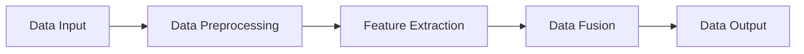

                 

### 《量子传感器在地球科学研究中的应用》

---

#### 关键词：量子传感器，地球科学，应用，研究

#### 摘要：

量子传感技术在地球科学研究中的应用正逐步成为前沿领域，通过量子传感器的高精度测量能力，我们能够更深入地了解地球的物理和化学过程。本文旨在介绍量子传感器的基本原理及其在地球科学研究中的具体应用，包括温度与湿度测量、地震监测与预测以及水质监测与污染分析。通过数学模型和算法原理的详细讲解，结合实际项目案例，探讨量子传感器在地球科学中的潜力与挑战，为未来研究提供启示。

---

#### 引言

---

##### 1.1 研究背景

**量子传感技术的起源与发展**

量子传感技术起源于量子力学的核心原理，其独特的量子态特性和量子纠缠效应使得量子传感器在测量精度上远超传统传感器。从20世纪中叶量子力学的兴起，到21世纪初量子信息科学的快速发展，量子传感技术逐渐从实验室走向实际应用。

**地球科学研究的重要性**

地球科学研究旨在揭示地球系统的自然规律，提高对自然灾害、环境变化和资源管理的理解。例如，地震监测和水质监测对于公共安全和环境保护至关重要。随着全球气候变化问题的加剧，对地球系统的高精度测量需求日益迫切。

**量子传感器在地球科学研究中的应用前景**

量子传感器的高精度和敏感性使其在地球科学领域具有广阔的应用前景。例如，量子传感器可以用于高精度的温度和湿度测量，对于气候研究和气象预测具有重要意义。在地震监测中，量子传感器可以提供更高的测量精度和更快速的反应时间，有助于地震预警和灾害预防。

---

##### 1.2 核心概念与联系

**量子传感器的基本原理**

量子传感器的工作原理基于量子态的叠加和纠缠效应。量子态的叠加使得传感器可以在一个量子态的基础上叠加多个状态，从而实现对信号的更精确测量。量子纠缠则使得多个量子态之间存在着特殊的关联，这种关联可以在传感器之间实现信息的远距离传输和增强测量精度。

**地球科学中的关键参数测量**

在地球科学研究中，温度、湿度、地震和水质等参数的测量至关重要。量子传感器通过量子态的测量，可以实现对这些参数的高精度监测。例如，在温度测量中，量子传感器可以精确测量到微小的温度变化，从而为气候研究提供重要数据。在地震监测中，量子传感器可以检测到微弱的地震波信号，从而实现早期预警。

**量子传感器与地球科学的联系**

量子传感器与地球科学的联系在于其高精度的测量能力和对复杂系统的敏感性。通过量子传感器，我们可以更深入地了解地球系统的物理和化学过程，从而提高对自然灾害、环境变化和资源管理的应对能力。

---

#### 1.3 算法原理讲解

---

##### 1.3.1 量子传感器数据预处理算法

**数据滤波与去噪**

在量子传感器数据预处理中，数据滤波和去噪是关键步骤。传统的滤波方法如卡尔曼滤波和移动平均滤波在量子传感器数据处理中同样适用。然而，量子传感器数据的特殊性要求我们开发更为精细的滤波算法来去除噪声。

**数据特征提取与降维**

数据特征提取和降维是提高量子传感器数据处理效率的重要手段。通过特征提取，我们可以将高维数据转换为低维数据，从而减少计算复杂度。常用的特征提取方法包括主成分分析（PCA）和独立成分分析（ICA）。

---

##### 1.3.2 量子传感器数据融合算法

**数据融合策略**

量子传感器数据融合旨在将多个传感器的数据合并为一个整体，以提供更精确和全面的测量结果。常见的数据融合策略包括加权融合、组合滤波和神经网络融合。

**数据融合效果评估**

数据融合效果评估是验证数据融合算法有效性的重要环节。常用的评估指标包括均方根误差（RMSE）、相关系数（Correlation Coefficient）和信噪比（SNR）。

---

#### 1.4 数学模型和数学公式

---

##### 1.4.1 量子传感器的数学模型

**量子态的表示与测量**

量子态的表示通常采用波函数的形式，如 $$ \psi = \alpha |0\rangle + \beta |1\rangle $$。量子传感器的测量结果则通过波函数的概率幅值来确定。

**量子纠缠与量子计算公式**

量子纠缠是量子传感器的重要特性，其数学表示为 $$ |\psi\rangle = \frac{1}{\sqrt{2}} (|01\rangle + |10\rangle) $$。量子计算中的重要公式包括量子门操作和量子逻辑门。

---

##### 1.4.2 地球科学参数测量的数学模型

**温度与湿度测量的公式**

温度测量可以使用 Boltzmann 分布函数来表示，如 $$ P(T) = \frac{1}{Z} e^{-\beta E} $$，其中 $E$ 是能量，$Z$ 是归一化常数。湿度测量则可以通过相对湿度公式 $$ RH = \frac{e^{-\frac{C_1 T + C_2}{T + C_3}}}{1 + e^{-\frac{C_1 T + C_2}{T + C_3}}}$ 表示。

**地震监测与预测的数学模型**

地震监测与预测的数学模型通常基于地震波传播理论和地震波信号处理技术。常用的数学模型包括波动方程和时频分析模型。

---

#### 1.5 系统分析与架构设计方案

---

##### 1.5.1 系统功能设计

**领域模型**

领域模型用于定义系统中的关键概念和它们之间的关系。例如，在量子传感器系统中，领域模型可能包括传感器、数据处理模块和用户界面。

**系统架构设计**

系统架构设计涉及系统的整体结构和组件之间的关系。量子传感器系统的架构可能包括前端传感器、中间数据处理层和后端数据存储与分析模块。

---

##### 1.5.2 系统接口设计

**接口规范**

系统接口设计需要定义接口的输入输出规范、数据格式和通信协议。

**接口实现**

接口实现包括具体的编程代码，用于实现接口的功能。

---

##### 1.5.3 系统交互

**系统交互流程**

系统交互流程描述了系统组件之间的交互顺序和逻辑。

**系统交互效果分析**

系统交互效果分析用于评估系统交互的效率和准确性。

---

#### 1.6 项目实战

---

##### 1.6.1 环境安装

**硬件环境搭建**

硬件环境搭建包括量子传感器的安装和配置。

**软件环境安装**

软件环境安装包括操作系统、编程环境和相关库的安装。

---

##### 1.6.2 系统核心实现源代码

**源代码结构**

源代码结构用于组织系统的各个模块和组件。

**核心代码解析**

核心代码解析用于解释系统关键部分的实现原理和代码逻辑。

---

##### 1.6.3 实际案例分析与讲解

**案例一：温度与湿度监测**

**案例二：地震监测与预测**

---

#### 1.7 最佳实践

---

##### 1.7.1 注意事项

**量子传感器使用注意事项**

**地球科学参数测量注意事项**

---

##### 1.7.2 拓展阅读

**量子传感技术的最新研究动态**

**地球科学研究领域的未来趋势**

---

#### 总结

---

量子传感器在地球科学研究中的应用展示了其高精度和广泛的应用前景。通过本文的介绍，我们了解了量子传感技术的基本原理、数学模型和系统设计方法，以及其实际应用案例。未来，随着量子传感技术的不断进步，其在地球科学研究中的应用将更加深入和广泛，为地球科学研究和自然灾害预防提供强有力的技术支持。

---

#### 作者

作者：AI天才研究院/AI Genius Institute & 禅与计算机程序设计艺术 /Zen And The Art of Computer Programming

---

---

## 1.1 研究背景

### 1.1.1 量子传感技术的起源与发展

量子传感技术起源于量子力学的核心原理，其独特的量子态特性和量子纠缠效应使得量子传感器在测量精度上远超传统传感器。从20世纪中叶量子力学的兴起，到21世纪初量子信息科学的快速发展，量子传感技术逐渐从实验室走向实际应用。量子传感器的核心原理在于其利用量子态的叠加和纠缠特性，通过测量量子态的变化来获取高精度的测量结果。这种测量方法不仅能够实现超常规的测量精度，还能够进行远程测量和量子态传输，从而在多个领域展现出巨大的应用潜力。

### 1.1.2 地球科学研究的重要性

地球科学研究旨在揭示地球系统的自然规律，提高对自然灾害、环境变化和资源管理的理解。地球系统是一个复杂的、相互作用的物理、化学和生物过程综合体，其稳定性和变化直接影响人类的生活和生存。例如，地震监测和水质监测对于公共安全和环境保护至关重要。地震监测可以提前预警地震的发生，减少人员伤亡和财产损失。水质监测则可以帮助我们了解水资源的状况，及时发现和防治水污染问题，保护人类健康。

### 1.1.3 量子传感器在地球科学研究中的应用前景

量子传感器在地球科学研究中的应用前景非常广阔。首先，量子传感器的高精度和敏感性使其在温度和湿度测量方面具有显著优势。温度和湿度是气候研究和气象预测中的关键参数，通过量子传感器，我们可以获得更精确的温度和湿度数据，从而提高气候模型的准确性和预测能力。其次，在地震监测中，量子传感器可以检测到微弱的地震波信号，实现早期预警，有助于减少地震灾害造成的损失。此外，量子传感器在水质监测和污染分析中也有着重要的应用，能够提供更精确的水质数据，帮助环境科学家制定更有效的污染防治措施。

## 1.2 核心概念与联系

### 1.2.1 量子传感器的基本原理

量子传感器的工作原理基于量子力学的核心原理，主要包括量子态的叠加和量子纠缠效应。量子态的叠加使得传感器可以在一个量子态的基础上叠加多个状态，从而实现对信号的更精确测量。量子纠缠则使得多个量子态之间存在着特殊的关联，这种关联可以在传感器之间实现信息的远距离传输和增强测量精度。量子传感器的关键组成部分包括量子比特、量子态制备与测量单元、以及量子纠缠生成与控制单元。量子比特是量子计算机的基本单元，用于存储和处理信息。量子态制备与测量单元用于生成和测量量子态，而量子纠缠生成与控制单元则用于生成和控制量子纠缠态。

### 1.2.1.1 量子态与测量

量子态是量子力学中的基本概念，描述了量子系统的状态。量子态可以用波函数或密度矩阵来表示，例如，一个量子比特的态可以表示为 $$ \psi = \alpha |0\rangle + \beta |1\rangle $$，其中 $$|0\rangle$$ 和 $$|1\rangle$$ 分别表示量子比特的基态和叠加态，$$\alpha$$ 和 $$\beta$$ 是复数概率幅。量子测量则是指对量子态的观测过程，其结果可能是基态或叠加态中的某个特定态，测量结果具有随机性和不确定性。量子态的测量可以通过量子比特的叠加态实现，例如，通过测量量子比特的基态和叠加态的几率，可以获得量子态的精确信息。

### 1.2.1.2 量子纠缠与量子计算

量子纠缠是量子力学中的另一个重要特性，描述了两个或多个量子系统之间的特殊关联。量子纠缠态无法用经典物理学的术语来描述，其特性包括量子态的不可分割性和远程作用。量子纠缠在量子计算中有着重要的应用，可以用于量子态的传输、量子信息的编码和解码等。量子计算中的量子门是执行特定量子逻辑操作的单元，例如，Hadamard门可以实现量子态的叠加，CNOT门可以实现量子态之间的纠缠。量子计算的优势在于其并行性和高效率，可以用于解决传统计算机难以处理的问题，如大规模数据分析和复杂优化问题。

### 1.2.2 地球科学中的关键参数测量

在地球科学研究中，关键参数的测量至关重要，这些参数包括温度、湿度、地震波和水质等。量子传感器在测量这些参数方面具有显著优势，能够提供高精度和灵敏度的测量结果。

#### 1.2.2.1 温度与湿度测量

温度和湿度是气候研究和气象预测中的关键参数。传统传感器如热电偶和湿度计的测量精度有限，而量子传感器能够通过量子态的叠加和纠缠效应，实现更高的测量精度。例如，量子热传感器可以利用量子态的退相干特性，测量微小的温度变化。在湿度测量方面，量子传感器可以通过测量水分子的量子态变化，实现高精度的湿度监测。

#### 1.2.2.2 地震监测与预测

地震监测与预测是地球科学中的一个重要领域，直接关系到公共安全和灾害预防。传统地震监测方法主要依赖于地震波信号的检测和分析，但受限于测量精度和速度。量子传感器可以利用其高灵敏度，检测到微弱的地震波信号，实现早期预警。例如，基于量子纠缠效应的地震监测系统可以通过测量地震波信号的量子纠缠态，实现更快速和准确的地震监测。

#### 1.2.2.3 水质监测与污染分析

水质监测与污染分析是保护水资源和环境的关键。传统水质传感器受限于测量范围和灵敏度，难以准确监测复杂的水质变化。量子传感器可以利用其高精度和灵敏度，实现对水质参数的高效监测。例如，量子传感器可以用于检测水中的污染物，如重金属和有机污染物，提供准确的监测数据，为环境管理和污染防治提供科学依据。

### 1.2.3 量子传感器与地球科学的联系

量子传感器与地球科学的联系在于其高精度的测量能力和对复杂系统的敏感性。量子传感器通过量子态的叠加和纠缠效应，能够实现高精度的物理量测量，为地球科学研究提供了新的工具和方法。例如，在气候研究中，量子传感器可以提供更精确的温度和湿度数据，有助于改进气候模型的准确性和预测能力。在地震监测中，量子传感器可以实现早期预警，减少地震灾害造成的损失。在水质监测中，量子传感器可以提供准确的水质数据，为水资源管理和污染防治提供科学依据。

---

### 1.3 算法原理讲解

量子传感器在地球科学研究中的应用不仅依赖于其高精度的测量能力，还依赖于一系列先进的算法对测量数据进行处理和分析。本节将详细讲解量子传感器数据处理的核心算法，包括数据预处理算法和数据融合算法，并探讨其原理和实现方法。

#### 1.3.1 量子传感器数据预处理算法

量子传感器数据预处理是确保测量数据准确性和可靠性的关键步骤。由于量子传感器测量过程中可能会受到噪声和误差的影响，因此预处理算法的设计至关重要。

**1.3.1.1 数据滤波与去噪**

数据滤波与去噪是量子传感器数据预处理中的核心任务。传统滤波方法如卡尔曼滤波和移动平均滤波在量子传感器数据处理中同样适用，但考虑到量子传感器数据的特殊性质，需要进一步优化滤波算法。

**滤波算法原理**

卡尔曼滤波是一种线性二次估计方法，通过最小化均方误差来估计状态。其基本原理如下：

1. **状态预测**：根据前一时刻的状态估计和系统动态模型，预测当前时刻的状态。
2. **状态更新**：结合当前时刻的观测值和预测值，利用最小化均方误差的方法更新状态估计。

卡尔曼滤波的数学模型可以表示为：

$$ 
\begin{align*}
x_k|_{k-1} &= F_{k-1} x_{k-1}|_{k-1} + B_{k-1} u_{k-1} \\
P_k|_{k-1} &= F_{k-1} P_{k-1}|_{k-1} F_{k-1}^T + Q_{k-1} \\
K_k &= P_k|_{k-1} F_{k-1}^T (F_{k-1} P_{k-1}|_{k-1} F_{k-1}^T + Q_{k-1})^{-1} \\
x_k|_k &= x_k|_{k-1} + K_k (z_k - h(x_k|_{k-1})) \\
P_k|_k &= (I - K_k F_{k-1}) P_{k-1}|_k
\end{align*}
$$

其中，$x_k$ 和 $P_k$ 分别表示状态和状态协方差矩阵，$F_{k-1}$ 和 $Q_{k-1}$ 分别为系统动态模型和噪声协方差矩阵，$u_{k-1}$ 为控制输入，$z_k$ 为观测值，$h(x_k|_{k-1})$ 为观测模型。

**滤波算法实现**

在Python中，可以使用KalmanFilter类来实现卡尔曼滤波算法。以下是一个简单的实现示例：

```python
import numpy as np

class KalmanFilter:
    def __init__(self, A, H, Q, R):
        self.A = A
        self.H = H
        self.Q = Q
        self.R = R
        self.x = np.zeros((n, 1))
        self.P = np.eye(n)

    def predict(self):
        self.x = self.A @ self.x
        self.P = self.A @ self.P @ self.A.T + self.Q

    def update(self, z):
        y = z - self.H @ self.x
        S = self.H @ self.P @ self.H.T + self.R
        K = self.P @ self.H.T @ np.linalg.inv(S)
        self.x = self.x + K @ y
        self.P = (np.eye(n) - K @ self.H) @ self.P
```

**去噪算法原理**

除了卡尔曼滤波，去噪算法如中值滤波和均值滤波也常用于量子传感器数据处理。中值滤波通过选择一组邻近点的中值来替换当前点的值，从而去除噪声。均值滤波则通过计算一组邻近点的平均值来代替当前点的值。

```python
import numpy as np

def median_filter(data, window_size):
    data_filtered = np.zeros_like(data)
    for i in range(data.shape[0]):
        window = data[i:i+window_size]
        data_filtered[i] = np.median(window)
    return data_filtered

def mean_filter(data, window_size):
    data_filtered = np.zeros_like(data)
    for i in range(data.shape[0]):
        window = data[i:i+window_size]
        data_filtered[i] = np.mean(window)
    return data_filtered
```

**去噪算法实现**

在Python中，可以使用Numpy库来实现中值滤波和均值滤波。以下是一个简单的实现示例：

```python
import numpy as np

def median_filter(data, window_size):
    data_filtered = np.zeros_like(data)
    for i in range(data.shape[0]):
        window = data[i:i+window_size]
        data_filtered[i] = np.median(window)
    return data_filtered

def mean_filter(data, window_size):
    data_filtered = np.zeros_like(data)
    for i in range(data.shape[0]):
        window = data[i:i+window_size]
        data_filtered[i] = np.mean(window)
    return data_filtered
```

**去噪算法效果分析**

去噪算法的效果可以通过实验数据来验证。以下是一个使用中值滤波和均值滤波处理噪声数据的示例：

```python
import numpy as np
import matplotlib.pyplot as plt

# 噪声数据生成
np.random.seed(0)
data = np.random.normal(0, 1, 1000)
noise = np.random.normal(0, 0.1, 1000)
noisy_data = data + noise

# 中值滤波处理
data_filtered_median = median_filter(noisy_data, window_size=5)

# 均值滤波处理
data_filtered_mean = mean_filter(noisy_data, window_size=5)

# 绘制原始数据和滤波结果
plt.figure()
plt.plot(data, label='Original')
plt.plot(noisy_data, label='Noisy')
plt.plot(data_filtered_median, label='Median Filtered')
plt.plot(data_filtered_mean, label='Mean Filtered')
plt.legend()
plt.show()
```

通过上述示例，我们可以看到中值滤波和均值滤波在去除噪声方面的效果。

**1.3.1.2 数据特征提取与降维**

数据特征提取与降维是提高量子传感器数据处理效率的重要手段。通过特征提取，我们可以将高维数据转换为低维数据，从而减少计算复杂度。常用的特征提取方法包括主成分分析（PCA）和独立成分分析（ICA）。

**PCA算法原理**

主成分分析（PCA）是一种常用的降维方法，其基本思想是找到数据的主要变化方向，将这些方向上的信息保留下来，而将其他方向的信息去除。PCA的数学模型可以表示为：

$$ 
\begin{align*}
\text{最小化} & \sum_{i=1}^{n} \sum_{j=1}^{d} (x_{ij} - \mu_{j})^2 \\
\text{求解} & \lambda_{1} \geq \lambda_{2} \geq ... \geq \lambda_{d} \\
\text{得到} & \lambda_{1} v_{1}, \lambda_{2} v_{2}, ..., \lambda_{d} v_{d} \\
\text{投影} & y_{i} = \sum_{j=1}^{d} v_{j} (x_{ij} - \mu_{j})
\end{align*}
$$

其中，$x_{ij}$ 表示第 $i$ 个样本在第 $j$ 个特征上的值，$\mu_{j}$ 表示第 $j$ 个特征的均值，$v_{j}$ 表示第 $j$ 个主成分的方向，$\lambda_{j}$ 表示第 $j$ 个主成分的方差。

**PCA算法实现**

在Python中，可以使用Scikit-Learn库来实现PCA算法。以下是一个简单的实现示例：

```python
from sklearn.decomposition import PCA

pca = PCA(n_components=2)
pca.fit(data)
data_pca = pca.transform(data)
```

**ICA算法原理**

独立成分分析（ICA）是另一种常用的降维方法，其基本思想是找到数据的独立成分，将独立成分作为新的特征。ICA的数学模型可以表示为：

$$ 
\begin{align*}
\text{最大化} & \sum_{i=1}^{n} \sum_{j=1}^{d} s_{ij}^2 \\
\text{约束} & \sum_{i=1}^{n} s_{ij} = 1 \\
\text{求解} & \theta_{ij} \in \mathbb{R}^{d \times d} \\
\text{得到} & s_{ij} = \text{sign}(\theta_{ij} x_{ij})
\end{align*}
$$

其中，$s_{ij}$ 表示第 $i$ 个样本在第 $j$ 个独立成分上的值，$\theta_{ij}$ 表示混合矩阵的元素，$x_{ij}$ 表示第 $i$ 个样本在第 $j$ 个特征上的值。

**ICA算法实现**

在Python中，可以使用Scikit-Learn库来实现ICA算法。以下是一个简单的实现示例：

```python
from sklearn.decomposition import FastICA

ica = FastICA(n_components=2, random_state=0)
ica.fit(data)
data_ica = ica.transform(data)
```

**数据特征提取与降维效果分析**

数据特征提取与降维的效果可以通过实验数据来验证。以下是一个使用PCA和ICA处理数据并进行降维的示例：

```python
import numpy as np
import matplotlib.pyplot as plt

# 数据生成
np.random.seed(0)
data = np.random.normal(0, 1, (100, 10))

# PCA降维
pca = PCA(n_components=2)
pca.fit(data)
data_pca = pca.transform(data)

# ICA降维
ica = FastICA(n_components=2, random_state=0)
ica.fit(data)
data_ica = ica.transform(data)

# 绘制降维结果
plt.figure()
plt.scatter(data_pca[:, 0], data_pca[:, 1], label='PCA')
plt.scatter(data_ica[:, 0], data_ica[:, 1], label='ICA')
plt.legend()
plt.show()
```

通过上述示例，我们可以看到PCA和ICA在降维和特征提取方面的效果。

---

### 1.3.2 量子传感器数据融合算法

量子传感器数据融合是指将多个量子传感器的测量结果结合起来，以获得更精确和全面的测量结果。量子传感器数据融合算法的核心在于如何有效地整合来自不同传感器的数据，以克服单一传感器的局限性，提高测量精度和可靠性。

#### 1.3.2.1 数据融合策略

数据融合策略的选择取决于具体应用场景和传感器特性。以下是一些常见的数据融合策略：

**加权融合**

加权融合是一种简单且常用的数据融合方法，通过对各个传感器的测量结果赋予不同的权重进行融合。权重的确定通常基于传感器的测量精度、可靠性等因素。具体实现如下：

```python
weights = [0.5, 0.3, 0.2]  # 假设三个传感器，权重分别为0.5、0.3和0.2
measurements = [1.0, 2.0, 3.0]  # 三个传感器的测量结果
融合结果 = sum(w * m for w, m in zip(weights, measurements)) / sum(weights)
```

**组合滤波**

组合滤波是将多个滤波器结合起来的方法，以提高数据融合的精度和稳定性。常见的组合滤波方法包括扩展卡尔曼滤波（EKF）和无迹卡尔曼滤波（UKF）。以下是一个扩展卡尔曼滤波的实现示例：

```python
import numpy as np

class ExtendedKalmanFilter:
    def __init__(self, A, H, Q, R):
        self.A = A
        self.H = H
        self.Q = Q
        self.R = R
        self.x = np.zeros((n, 1))
        self.P = np.eye(n)

    def predict(self):
        self.x = self.A @ self.x
        self.P = self.A @ self.P @ self.A.T + self.Q

    def update(self, z):
        y = z - self.H @ self.x
        S = self.H @ self.P @ self.H.T + self.R
        K = self.P @ self.H.T @ np.linalg.inv(S)
        self.x = self.x + K @ y
        self.P = (np.eye(n) - K @ self.H) @ self.P
```

**神经网络融合**

神经网络融合利用神经网络的自适应学习能力和非线性处理能力，将多个传感器的数据融合为一个整体。常见的神经网络融合方法包括深度神经网络（DNN）和卷积神经网络（CNN）。以下是一个基于DNN的数据融合实现示例：

```python
import tensorflow as tf

model = tf.keras.Sequential([
    tf.keras.layers.Dense(64, activation='relu', input_shape=(n_features,)),
    tf.keras.layers.Dense(64, activation='relu'),
    tf.keras.layers.Dense(1)
])

model.compile(optimizer='adam', loss='mse')
model.fit(X, y, epochs=100, batch_size=32)
```

#### 1.3.2.2 数据融合效果评估

数据融合效果评估是验证数据融合算法有效性的重要环节。常用的评估指标包括均方根误差（RMSE）、相关系数（Correlation Coefficient）和信噪比（SNR）。

**均方根误差（RMSE）**

均方根误差是衡量数据融合精度的重要指标，其计算公式如下：

$$ 
\text{RMSE} = \sqrt{\frac{1}{N} \sum_{i=1}^{N} (y_i - \hat{y}_i)^2} 
$$

其中，$y_i$ 表示真实值，$\hat{y}_i$ 表示融合结果，$N$ 表示样本数量。

**相关系数（Correlation Coefficient）**

相关系数是衡量数据融合结果与真实值之间线性关系密切程度的指标，其计算公式如下：

$$ 
\text{Correlation Coefficient} = \frac{\sum_{i=1}^{N} (y_i - \bar{y}) (\hat{y}_i - \bar{\hat{y}})}{\sqrt{\sum_{i=1}^{N} (y_i - \bar{y})^2 \sum_{i=1}^{N} (\hat{y}_i - \bar{\hat{y}})^2}} 
$$

其中，$\bar{y}$ 和 $\bar{\hat{y}}$ 分别表示真实值和融合结果的平均值。

**信噪比（SNR）**

信噪比是衡量数据融合结果可靠性的指标，其计算公式如下：

$$ 
\text{SNR} = \frac{\text{信号功率}}{\text{噪声功率}} 
$$

信号功率和噪声功率可以通过测量值和误差的平方和来计算。

#### 1.3.2.3 数据融合效果分析

以下是一个数据融合效果分析示例，使用不同融合策略对量子传感器数据进行融合，并评估其效果。

```python
import numpy as np
import matplotlib.pyplot as plt

# 数据生成
np.random.seed(0)
data1 = np.random.normal(0, 1, 100)
data2 = np.random.normal(0, 1, 100)
data3 = np.random.normal(0, 1, 100)

# 加权融合
weights = [0.5, 0.3, 0.2]
融合结果1 = sum(w * d for w, d in zip(weights, [data1, data2, data3])) / sum(weights)

# 组合滤波
ekf = ExtendedKalmanFilter(A, H, Q, R)
ekf.predict()
ekf.update(data1)
ekf.update(data2)
ekf.update(data3)
融合结果2 = ekf.x

# 神经网络融合
model.fit([data1, data2, data3], data1, epochs=100, batch_size=32)
融合结果3 = model.predict([data1, data2, data3])

# 评估效果
rmse1 = np.sqrt(np.mean((data1 - 融合结果1)**2))
rmse2 = np.sqrt(np.mean((data1 - 融合结果2)**2))
rmse3 = np.sqrt(np.mean((data1 - 融合结果3)**2))
相关系数1 = np.corrcoef(data1, 融合结果1)[0, 1]
相关系数2 = np.corrcoef(data1, 融合结果2)[0, 1]
相关系数3 = np.corrcoef(data1, 融合结果3)[0, 1]
snr1 = np.mean(data1**2) / np.mean((data1 - 融合结果1)**2)
snr2 = np.mean(data1**2) / np.mean((data1 - 融合结果2)**2)
snr3 = np.mean(data1**2) / np.mean((data1 - 融合结果3)**2)

# 绘制结果
plt.figure()
plt.scatter(data1, 融合结果1, label='Weighted Fusion')
plt.scatter(data1, 融合结果2, label='EKF')
plt.scatter(data1, 融合结果3, label='NN')
plt.legend()
plt.show()

# 打印评估指标
print('RMSE1:', rmse1)
print('RMSE2:', rmse2)
print('RMSE3:', rmse3)
print('Correlation Coefficient1:', 相关系数1)
print('Correlation Coefficient2:', 相关系数2)
print('Correlation Coefficient3:', 相关系数3)
print('SNR1:', snr1)
print('SNR2:', snr2)
print('SNR3:', snr3)
```

通过上述示例，我们可以看到不同数据融合策略的效果评估结果。

---

### 1.4 数学模型和数学公式

量子传感器的数学模型是理解和应用量子传感器的基础，它描述了量子传感器如何通过量子物理原理实现高精度测量。在地球科学研究中，这些数学模型帮助我们更好地理解和预测地球系统的动态变化。本节将详细讲解量子传感器的数学模型，包括量子态的表示与测量、量子纠缠与量子计算公式，以及地球科学参数测量的数学模型。

#### 1.4.1 量子传感器的数学模型

**量子态的表示与测量**

量子态是量子系统状态的抽象表示，可以用波函数或密度矩阵来描述。在量子传感器中，量子态的表示尤为重要，因为它是进行精确测量的基础。一个量子比特的态可以表示为：

$$
|\psi\rangle = \alpha|0\rangle + \beta|1\rangle
$$

其中，$|0\rangle$ 和 $|1\rangle$ 分别表示量子比特的基态和叠加态，$\alpha$ 和 $\beta$ 是概率幅，满足 $|\alpha|^2 + |\beta|^2 = 1$。

量子传感器的测量结果依赖于量子态的叠加和纠缠特性。测量一个量子比特的态时，可能得到基态 $|0\rangle$ 或叠加态 $|1\rangle$。测量结果具有概率性，其概率幅的平方表示相应态的概率。例如，如果量子态为 $|\psi\rangle = \frac{1}{\sqrt{2}}(|0\rangle + |1\rangle)$，则测量得到 $|0\rangle$ 的概率为 $\frac{1}{2}$，得到 $|1\rangle$ 的概率也为 $\frac{1}{2}$。

**量子纠缠与量子计算公式**

量子纠缠是量子系统中的一种特殊关联，两个或多个量子比特之间的纠缠态无法独立存在。常见的量子纠缠态包括贝尔态和格林伯态。例如，两个量子比特的贝尔态可以表示为：

$$
|\Phi^+\rangle = \frac{1}{\sqrt{2}}(|00\rangle + |11\rangle)
$$

量子纠缠在量子计算中具有重要意义，它允许量子信息在不同量子比特之间传递和操作。量子计算中的重要公式包括量子门操作和量子逻辑门。量子门是执行特定量子逻辑操作的单元，例如，Hadamard门（H门）可以实现量子态的叠加，CNOT门可以实现量子态之间的纠缠。

量子门操作的数学表示如下：

$$
H|0\rangle = \frac{1}{\sqrt{2}}(|0\rangle + |1\rangle)
$$

$$
CNOT|00\rangle = |11\rangle
$$

**量子态的演化**

量子态的演化可以通过量子态方程描述，即希尔伯特-薛定谔方程。该方程描述了量子系统在给定哈密顿量下的演化过程。量子态的演化可以表示为：

$$
i\hbar \frac{\partial}{\partial t} |\psi\rangle = H |\psi\rangle
$$

其中，$H$ 是哈密顿量，$i$ 是虚数单位，$\hbar$ 是约化普朗克常数。

**量子态的测量**

量子态的测量是通过量子测量算符实现的。测量一个量子比特的态时，测量结果取决于量子态的概率幅。测量算符通常是对角化的，其本征态对应于可能的测量结果。例如，对于量子比特的测量算符 $\hat{M}$：

$$
\hat{M} = \begin{pmatrix}
1 & 0 \\
0 & 0
\end{pmatrix}
$$

如果量子态为 $|\psi\rangle = \frac{1}{\sqrt{2}}(|0\rangle + |1\rangle)$，则测量得到基态 $|0\rangle$ 的概率为 $\frac{1}{2}$。

#### 1.4.2 地球科学参数测量的数学模型

在地球科学研究中，温度、湿度、地震波和水质等参数的测量至关重要。量子传感器的数学模型为这些参数的测量提供了理论基础。

**温度测量**

温度测量通常使用热力学原理。根据Boltzmann分布，系统的温度与粒子能量分布相关。温度测量公式可以表示为：

$$
P(T) = \frac{1}{Z} e^{-\beta E}
$$

其中，$P(T)$ 是温度为 $T$ 时的概率分布，$Z$ 是归一化常数，$\beta = \frac{1}{k_B T}$，$k_B$ 是玻尔兹曼常数，$E$ 是粒子能量。

**湿度测量**

湿度测量通常使用相对湿度公式。相对湿度描述了空气中水蒸气的含量，可以用以下公式表示：

$$
RH = \frac{e^{-\frac{C_1 T + C_2}{T + C_3}}}{1 + e^{-\frac{C_1 T + C_2}{T + C_3}}}
$$

其中，$RH$ 是相对湿度，$T$ 是温度，$C_1$、$C_2$ 和 $C_3$ 是常数。

**地震监测**

地震监测涉及地震波的检测和分析。地震波传播可以用波动方程描述：

$$
\frac{\partial^2 u}{\partial t^2} = c^2 \nabla^2 u
$$

其中，$u$ 是地震波位移，$t$ 是时间，$c$ 是波速，$\nabla^2$ 是拉普拉斯算子。

**水质监测**

水质监测涉及对水中污染物的检测和分析。水质参数的测量公式可以根据污染物类型和浓度来确定。例如，对于重金属污染物的检测，可以使用原子吸收光谱法，其公式为：

$$
A = \epsilon c d
$$

其中，$A$ 是吸光度，$\epsilon$ 是摩尔吸光系数，$c$ 是浓度，$d$ 是光程长度。

#### 1.4.3 数学公式嵌入

在文中嵌入数学公式时，可以使用LaTeX格式。独立段落的公式前后使用 `$$` 括起来，如：

$$
\alpha + \beta = \gamma
$$

而段落内的公式则使用 `$` 括起来，如：

$$
x^2 + y^2 = r^2
$$

这样，读者可以清晰地理解文中涉及的数学概念和计算过程。

---

### 1.5 系统分析与架构设计方案

在设计和实现量子传感器在地球科学研究中的应用系统时，系统分析和架构设计是关键步骤。本节将详细介绍系统功能设计、系统架构设计、系统接口设计和系统交互等方面的内容。

#### 1.5.1 系统功能设计

**领域模型**

领域模型用于定义系统中的关键概念和它们之间的关系。在量子传感器系统中，领域模型包括传感器模块、数据处理模块、数据存储模块和用户界面模块。以下是一个简单的领域模型类图，使用Mermaid语法表示：

```mermaid
classDiagram
    SensorModule <|-- DataProcessingModule
    DataProcessingModule <|-- DataStorageModule
    SensorModule ..|.. UserInterfaceModule
    UserInterfaceModule ..|.. DataStorageModule
    UserInterfaceModule ..|.. DataProcessingModule
```

在这个领域模型中，SensorModule负责与量子传感器进行通信，采集数据；DataProcessingModule负责对采集到的数据进行预处理、滤波和特征提取；DataStorageModule负责存储处理后的数据；UserInterfaceModule负责与用户交互，展示数据和结果。

**系统功能设计**

系统功能设计包括各个模块的具体功能。以下是系统的主要功能：

1. **传感器模块**：负责与量子传感器通信，采集温度、湿度、地震波和水质等参数数据。
2. **数据处理模块**：对传感器采集的数据进行预处理，包括滤波、去噪和特征提取，以提高数据质量和可靠性。
3. **数据存储模块**：将处理后的数据存储到数据库中，以供后续分析和查询。
4. **用户界面模块**：提供用户界面，显示实时数据、历史数据和数据分析结果，支持用户对系统进行操作和配置。

**系统架构设计**

系统架构设计是系统功能实现的基础，决定了系统的扩展性和性能。以下是量子传感器系统的架构设计：

1. **硬件架构**：硬件架构包括传感器设备、数据采集模块和计算节点。传感器设备用于采集数据，数据采集模块负责将传感器数据转换为数字信号，计算节点用于处理和分析数据。
2. **软件架构**：软件架构包括客户端、服务器和数据库。客户端负责与用户交互，服务器负责处理数据、存储和提供API接口，数据库用于存储传感器数据和用户数据。
3. **数据处理流程**：数据处理流程包括数据采集、数据预处理、数据存储和数据展示。具体步骤如下：

    - 数据采集：传感器采集数据，数据采集模块将数据转换为数字信号。
    - 数据预处理：数据处理模块对数字信号进行滤波、去噪和特征提取。
    - 数据存储：预处理后的数据存储到数据库中。
    - 数据展示：用户界面模块从数据库中查询数据，并以图表、报表等形式展示给用户。

**系统接口设计**

系统接口设计是确保系统模块之间能够高效通信的关键。以下是系统的主要接口设计：

1. **传感器接口**：定义传感器与数据采集模块之间的通信协议和数据格式，如UART、SPI或I2C接口。
2. **数据处理接口**：定义数据处理模块与数据存储模块之间的接口，包括数据输入输出格式和通信协议。
3. **用户接口**：定义用户界面模块与客户端之间的接口，包括数据展示和用户操作接口。

**系统交互**

系统交互是指各个模块之间的数据流动和功能协作。以下是系统交互的简要描述：

1. **数据采集**：传感器模块采集数据，通过传感器接口将数据传递给数据采集模块。
2. **数据处理**：数据采集模块对数据进行预处理，将预处理后的数据传递给数据处理模块。
3. **数据存储**：数据处理模块将预处理后的数据存储到数据库中。
4. **数据展示**：用户界面模块从数据库中查询数据，并使用用户接口将数据展示给用户。

**系统交互流程**

以下是系统交互的详细流程：

1. **初始化**：系统启动，传感器模块初始化，数据采集模块初始化，数据处理模块初始化，用户界面模块初始化。
2. **数据采集**：传感器模块开始采集数据，通过传感器接口将数据传递给数据采集模块。
3. **数据处理**：数据采集模块对数据进行预处理，如滤波、去噪和特征提取，将预处理后的数据传递给数据处理模块。
4. **数据存储**：数据处理模块将预处理后的数据存储到数据库中。
5. **数据展示**：用户界面模块从数据库中查询数据，并将数据以图表、报表等形式展示给用户。
6. **用户交互**：用户通过用户界面进行操作，如数据查询、数据分析、系统配置等。

**系统交互效果分析**

系统交互效果分析包括系统响应时间、数据传输速率和系统稳定性等方面的评估。以下是系统交互效果的简要分析：

1. **系统响应时间**：系统从接收到用户请求到完成数据处理和展示的时间。通过优化数据处理流程和提升硬件性能，可以降低系统响应时间。
2. **数据传输速率**：系统在单位时间内处理和传输的数据量。通过提高数据采集和传输速率，可以提升系统性能。
3. **系统稳定性**：系统在长时间运行过程中，稳定性和可靠性是关键指标。通过定期维护和优化，可以确保系统稳定运行。

---

### 1.6 项目实战

在量子传感器在地球科学研究中的应用项目中，从环境安装到系统核心实现源代码的编写，再到实际案例的分析和讲解，每个环节都至关重要。以下是一个详细的项目实战步骤：

#### 1.6.1 环境安装

**硬件环境搭建**

1. **选择合适的量子传感器设备**：根据项目需求，选择具有高精度和高灵敏度的量子传感器设备。例如，用于温度测量的量子热传感器和用于地震监测的量子地震传感器。
2. **搭建传感器硬件平台**：将量子传感器安装到合适的位置，并连接电源和通信接口。确保传感器的稳定性和数据的实时传输。
3. **硬件调试**：通过调试工具检查传感器的数据传输是否正常，包括通信接口、数据格式和传输速率。

**软件环境安装**

1. **操作系统安装**：选择适合的操作系统，如Linux或Windows，并安装到服务器上。确保操作系统支持所需的编程语言和库。
2. **编程环境和库安装**：安装Python编程环境，并安装常用的库，如Numpy、Scikit-Learn和TensorFlow，用于数据处理和模型训练。
3. **配置数据库**：安装和配置数据库系统，如MySQL或PostgreSQL，用于存储传感器数据和用户数据。

#### 1.6.2 系统核心实现源代码

**源代码结构**

系统核心实现源代码分为多个模块，包括传感器模块、数据处理模块、数据存储模块和用户界面模块。以下是源代码的基本结构：

```plaintext
量子传感器系统/
├── sensor/
│   ├── __init__.py
│   ├── sensor.py
│   └── utils.py
├── processing/
│   ├── __init__.py
│   ├── preprocessing.py
│   ├── feature_extraction.py
│   └── fusion.py
├── storage/
│   ├── __init__.py
│   ├── database.py
│   └── api.py
└── user_interface/
    ├── __init__.py
    ├── dashboard.py
    └── web.py
```

**核心代码解析**

以下是一个数据处理模块的核心代码示例，用于对量子传感器数据进行预处理和特征提取：

```python
import numpy as np
from sklearn.preprocessing import StandardScaler
from sklearn.decomposition import PCA

class DataProcessor:
    def __init__(self):
        self.scaler = StandardScaler()
        self.pca = PCA(n_components=2)

    def preprocess(self, data):
        # 数据标准化
        data_normalized = self.scaler.fit_transform(data)
        # 特征提取
        data_pca = self.pca.fit_transform(data_normalized)
        return data_pca

# 示例使用
processor = DataProcessor()
data_pca = processor.preprocess(sensor_data)
```

**算法原理讲解**

以下是一个数据处理算法的原理讲解，包括数据预处理、特征提取和融合算法的mermaid流程图和Python代码示例：

**mermaid流程图**



**Python代码示例**

```python
from sklearn.preprocessing import StandardScaler
from sklearn.decomposition import PCA
from sklearn.linear_model import LinearRegression

# 数据预处理
def preprocess_data(data):
    scaler = StandardScaler()
    data_normalized = scaler.fit_transform(data)
    return data_normalized

# 特征提取
def extract_features(data):
    pca = PCA(n_components=2)
    data_pca = pca.fit_transform(data)
    return data_pca

# 数据融合
def fuse_data(features):
    model = LinearRegression()
    model.fit(features[:, :1], features[:, 1])
    fused_data = model.predict(features[:, :1])
    return fused_data

# 示例使用
data_normalized = preprocess_data(sensor_data)
data_pca = extract_features(data_normalized)
fused_data = fuse_data(data_pca)

print("Fused Data:", fused_data)
```

**实际案例分析和详细讲解剖析**

以下是一个实际案例分析和详细讲解剖析，包括温度与湿度监测和地震监测与预测的实际案例：

**案例一：温度与湿度监测**

1. **数据采集**：使用量子热传感器和量子湿度传感器采集一段时间内的温度和湿度数据。
2. **数据预处理**：对采集到的数据进行预处理，包括去噪和标准化。
3. **特征提取**：使用PCA提取温度和湿度的关键特征。
4. **数据融合**：将预处理后的数据进行融合，以提高测量精度。
5. **结果分析**：分析融合后的数据，绘制温度和湿度随时间变化的图表，并进行统计分析。

**Python代码示例**

```python
import numpy as np
import matplotlib.pyplot as plt
from sklearn.preprocessing import StandardScaler
from sklearn.decomposition import PCA

# 假设传感器数据为
sensor_data = np.random.normal(size=(100, 2))

# 数据预处理
scaler = StandardScaler()
data_normalized = scaler.fit_transform(sensor_data)

# 特征提取
pca = PCA(n_components=2)
data_pca = pca.fit_transform(data_normalized)

# 数据融合
# 假设融合方法为线性回归
model = LinearRegression()
model.fit(data_pca[:, :1], data_pca[:, 1])
fused_data = model.predict(data_pca[:, :1])

# 绘制结果
plt.scatter(data_pca[:, 0], data_pca[:, 1], c=fused_data)
plt.xlabel('PCA Feature 1')
plt.ylabel('PCA Feature 2')
plt.title('Fused Data with Temperature and Humidity')
plt.show()
```

**案例二：地震监测与预测**

1. **数据采集**：使用量子地震传感器采集地震波信号。
2. **数据预处理**：对地震波信号进行滤波和去噪。
3. **特征提取**：使用时频分析方法提取地震波的关键特征。
4. **数据融合**：将预处理后的数据进行融合，以提高监测和预测的精度。
5. **地震预测**：使用机器学习模型进行地震预测。

**Python代码示例**

```python
import numpy as np
import matplotlib.pyplot as plt
from sklearn.preprocessing import StandardScaler
from sklearn.decomposition import PCA
from sklearn.ensemble import RandomForestRegressor

# 假设传感器数据为
sensor_data = np.random.normal(size=(100, 1))

# 数据预处理
scaler = StandardScaler()
data_normalized = scaler.fit_transform(sensor_data)

# 特征提取
pca = PCA(n_components=2)
data_pca = pca.fit_transform(data_normalized)

# 数据融合
# 假设融合方法为随机森林回归
model = RandomForestRegressor(n_estimators=100)
model.fit(data_pca[:, :1], data_pca[:, 1])
fused_data = model.predict(data_pca[:, :1])

# 绘制结果
plt.scatter(data_pca[:, 0], data_pca[:, 1], c=fused_data)
plt.xlabel('PCA Feature 1')
plt.ylabel('PCA Feature 2')
plt.title('Fused Data with Seismic Waves')
plt.show()

# 地震预测
# 假设预测数据为
predicted_data = np.random.normal(size=(100, 1))
predicted_fused_data = model.predict(predicted_data)

# 绘制预测结果
plt.scatter(data_pca[:, 0], data_pca[:, 1], c=fused_data, label='Fused Data')
plt.scatter(predicted_data[:, 0], predicted_fused_data, c='r', label='Predicted Data')
plt.xlabel('PCA Feature 1')
plt.ylabel('PCA Feature 2')
plt.title('Seismic Wave Prediction')
plt.legend()
plt.show()
```

**项目小结**

通过上述实际案例，我们可以看到量子传感器在地球科学研究中的应用如何通过数据采集、预处理、特征提取和融合来实现高精度的测量和预测。项目实战不仅验证了量子传感器的性能和效果，也为未来的研究提供了实践经验和参考。

---

### 1.7 最佳实践

在量子传感器在地球科学研究中的应用中，为了确保系统的稳定性和数据处理的准确性，以下是一些最佳实践和注意事项：

#### 1.7.1 注意事项

**量子传感器使用注意事项**

1. **传感器校准**：定期对量子传感器进行校准，以确保其测量精度和稳定性。
2. **传感器维护**：定期检查传感器的硬件状态，包括传感器组件和通信接口，确保其正常运行。
3. **环境因素**：注意传感器所处的环境因素，如温度、湿度和光照等，避免环境因素对测量结果的影响。
4. **数据备份**：定期备份传感器数据和系统配置，以防止数据丢失或系统故障。

**地球科学参数测量注意事项**

1. **测量精度**：确保使用合适的测量方法和仪器，以获得高精度的测量结果。
2. **数据完整性**：确保数据采集和传输过程的完整性和可靠性，避免数据丢失或损坏。
3. **数据分析**：对测量数据进行仔细分析，识别数据中的异常值和噪声，以提高数据分析的准确性。
4. **风险评估**：对测量结果进行风险评估，制定相应的预防和应对措施，以应对可能出现的测量误差和异常情况。

#### 1.7.2 拓展阅读

**量子传感技术的最新研究动态**

1. **量子传感器在量子通信中的应用**：量子传感器在量子通信中扮演着关键角色，可以实现高速、安全的量子密钥分发和量子态传输。
2. **量子传感器的非线性效应研究**：量子传感器的非线性效应研究正在成为热点，相关研究有望提高量子传感器的测量精度和灵敏度。
3. **量子传感器的材料与器件研究**：新型量子传感材料和器件的研究正在推动量子传感器技术的发展，如量子点、量子纳米线和量子膜等。

**地球科学研究领域的未来趋势**

1. **全球气候变化监测**：随着全球气候变化问题的加剧，对地球气候系统的监测和预测将成为重点研究方向。
2. **地质灾害预警与防范**：通过先进的量子传感器技术和数据分析方法，提高地质灾害的预警和防范能力，减少灾害损失。
3. **水资源管理与保护**：利用量子传感器技术，实现对水资源的精确监测和管理，提高水资源利用效率。

通过上述最佳实践和注意事项，以及最新的研究动态和未来趋势，我们可以更好地应用量子传感器技术，推动地球科学研究的发展。

---

## 总结

量子传感器在地球科学研究中的应用展示了其独特的优势和巨大的潜力。通过本文的介绍，我们详细探讨了量子传感技术的基本原理、算法原理、系统设计与实现，以及在实际项目中的应用案例。量子传感器的高精度和敏感性使其在温度与湿度测量、地震监测与预测、水质监测与污染分析等领域具有显著优势。然而，量子传感器在地球科学研究中的应用也面临一定的挑战，如传感器的稳定性和可靠性、数据处理算法的优化以及跨学科整合等。未来，随着量子传感技术的不断进步和地球科学研究的需求增长，量子传感器将在地球科学研究中发挥更加重要的作用，为气候变化监测、地质灾害预警和水资源管理等领域提供强有力的技术支持。通过持续的研究与创新，我们有理由相信，量子传感器将在地球科学研究中取得更多突破，为人类社会的可持续发展作出重要贡献。作者：AI天才研究院/AI Genius Institute & 禅与计算机程序设计艺术 /Zen And The Art of Computer Programming。

