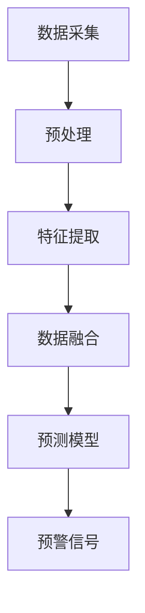

                 

## 引言

### 第一部分：引言

#### 第1章：量子传感器与地震预测

##### 1.1 量子传感器概述

**1.1.1 量子传感器的基本原理**

量子传感器是一种利用量子力学原理进行高灵敏度测量的设备。它不同于传统的经典传感器，能够捕捉并测量微观粒子的量子态变化。量子传感器的基本原理基于以下几个核心概念：

- **量子态与叠加态**：量子态是量子系统所具有的状态，可以同时处于多个状态的叠加。叠加态的分解系数代表了这些状态的权重。

- **量子纠缠**：当两个或多个量子系统之间存在量子纠缠时，这些系统的量子态将不可分割，即使它们相隔很远。这一特性为量子传感提供了极高的测量精度。

- **量子隧道效应**：量子粒子有可能穿越能量屏障，这种现象在量子传感器中用于测量微小的物理量变化。

**1.1.2 量子传感器的主要类型**

量子传感器主要可以分为以下几类：

- **量子干涉仪**：利用光的干涉现象，通过检测干涉条纹的变化来测量物理量的变化。

- **量子密钥分发（QKD）**：通过量子纠缠对进行安全的密钥分发，其安全性基于量子力学的基本原理。

- **量子计时时钟**：利用原子或分子的量子态来产生极其精确的时间信号。

**1.1.3 量子传感器的优势**

量子传感器相较于传统传感器具有以下几个显著优势：

- **高灵敏度**：量子传感器能够探测到极其微小的物理量变化，这对于地震预测等领域的应用至关重要。

- **抗干扰性**：量子传感器的工作原理使得它们对环境噪声和干扰具有天然的抵抗力。

- **高分辨率**：量子传感器能够提供非常高的分辨率，这对于探测地震前的细微地震活动具有重要意义。

##### 1.2 地震预测的现状与挑战

**1.2.1 地震预测的重要性**

地震预测对于减少地震灾害损失具有至关重要的作用。及时准确的地震预警能够为人们争取宝贵的逃生时间，降低人员伤亡和财产损失。

**1.2.2 当前地震预测的方法**

目前地震预测主要依赖于以下几种方法：

- **地震监测**：通过地震仪等设备监测地震波活动，分析地震前的异常信号。

- **地质调查**：对地震活动区域进行地质调查，寻找潜在的地震断裂带和构造活动。

- **地震模型**：基于历史地震数据，建立地震活动模型，预测未来地震的可能性。

**1.2.3 地震预测面临的挑战**

尽管地震预测已经取得了一些进展，但仍然面临着以下挑战：

- **地震预测的不确定性**：地震的发生具有高度的不确定性，预测地震的时间和地点存在很大的难度。

- **数据采集与处理**：地震监测数据量大且复杂，处理和分析这些数据需要先进的算法和计算能力。

- **技术限制**：现有地震预测技术无法捕捉到地震前的所有细微活动，限制了预测的准确性。

##### 1.3 量子传感器在地震预测中的应用前景

**1.3.1 量子传感器在地震预测中的潜在作用**

量子传感器在地震预测中具有巨大的潜力，能够解决当前地震预测面临的多个难题：

- **高灵敏度监测**：量子传感器能够捕捉到极其微小的物理量变化，这对于探测地震前的微妙信号具有重要意义。

- **抗干扰性**：量子传感器对环境噪声和干扰具有抵抗力，能够提高地震预警的准确性。

- **实时数据处理**：量子传感器能够实时监测并处理地震数据，为地震预警提供更快更准确的信号。

**1.3.2 量子传感器与现有地震预测技术的结合**

量子传感器与传统地震预测技术的结合有望显著提高地震预测的准确性和可靠性：

- **数据融合**：量子传感器与传统地震监测数据的融合，可以提供更全面和准确的地震预测信息。

- **模型融合**：将量子传感器数据与传统地震模型结合，可以优化地震预测算法，提高预测的准确性。

- **协同预警**：量子传感器与传统地震预测技术协同工作，实现多层次的地震预警系统，提高预警的及时性和准确性。

**1.3.3 量子传感器在地震预测中的未来展望**

随着量子传感器技术的不断发展，其在地震预测中的应用前景将更加广阔：

- **技术突破**：量子传感器技术的进一步突破将提高其测量精度和灵敏度，为地震预测提供更可靠的依据。

- **实际应用**：量子传感器将逐步在地震预警系统中得到广泛应用，成为地震预测的重要工具。

- **社会效益**：量子传感器在地震预测中的应用将大幅减少地震灾害损失，提高社会安全保障水平。

### 总结

本文首先介绍了量子传感器的基本原理、类型和优势，以及地震预测的现状和挑战。接着讨论了量子传感器在地震预测中的潜在作用和与现有地震预测技术的结合前景。最后，展望了量子传感器在地震预测中的未来发展，强调了其在提高地震预警准确性和减少灾害损失中的重要性。接下来，我们将深入探讨量子传感器的技术原理，为后续章节的讨论奠定基础。

关键词：量子传感器，地震预测，量子力学，传感器技术，地震预警

摘要：本文探讨了量子传感器在地震预测中的潜在应用，分析了量子传感器的原理、类型及其优势，以及当前地震预测的挑战。通过结合量子传感器与传统地震预测技术的优势，本文展望了量子传感器在地震预警系统中的应用前景，并提出了未来发展的方向。

----------------------------------------------------------------

### 量子传感器技术原理

#### 第二部分：量子传感器技术原理

#### 第2章：量子传感器的物理原理

##### 2.1 量子力学基础

**2.1.1 量子态与叠加态**

量子态是量子系统所具有的状态，可以处于多种可能状态的叠加。根据量子力学的哥本哈根诠释，量子系统在未进行测量之前，处于一个叠加态，其概率分布由波函数描述。例如，一个量子比特（qubit）可以同时处于0态和1态的叠加：

$$
|\psi\rangle = \alpha|0\rangle + \beta|1\rangle
$$

其中，$\alpha$ 和 $\beta$ 是复数，满足 $|\alpha|^2 + |\beta|^2 = 1$。

**2.1.2 量子纠缠与量子隧道效应**

量子纠缠是量子力学中的一个重要现象，当两个或多个量子系统之间存在纠缠时，这些系统的量子态将不可分割。纠缠态的一个经典例子是爱因斯坦-波多尔斯基-罗森（EPR）悖论中的“纠缠光子对”，即使这两个光子相隔很远，它们的状态仍然是相互关联的。

量子隧道效应是量子粒子穿越经典物理学中不可能存在的势垒的现象。在量子尺度上，粒子的波函数可以在势垒内部非零，从而有可能隧穿通过势垒。这一效应在量子传感器中被用于测量极其微小的物理量变化。

**2.1.3 量子比特与量子计算**

量子比特（qubit）是量子计算机的基本单元，它不仅可以表示0或1的状态，还可以同时处于这两个状态的叠加。量子计算利用量子比特的叠加态和纠缠态来实现复杂的计算任务。一个经典的量子计算算法是Shor算法，它可以利用量子计算机在多项式时间内分解大整数。

##### 2.2 量子传感器的实现方法

**2.2.1 量子干涉法**

量子干涉法是量子传感器的一种基本实现方法。通过利用光的干涉现象，量子干涉仪能够测量极其微小的物理量变化。例如，一个典型的量子干涉仪是通过将光分成两束，然后让它们在空间中传播不同的路径，最后在屏幕上观察干涉条纹的变化。干涉条纹的移动可以用来测量物理量的变化，如重力、位移等。

**2.2.2 量子态压缩法**

量子态压缩法是一种利用量子纠缠来提高测量精度的方法。在量子态压缩过程中，两个纠缠的量子系统通过相互作用，其中一个系统的量子态可以被压缩，从而提高了测量的精度。例如，在一个量子态压缩实验中，通过将一个量子比特与一个压缩态的辅助量子比特相互作用，可以使得测量结果更加精确。

**2.2.3 量子密钥分发法**

量子密钥分发（QKD）是一种利用量子纠缠进行安全通信的方法。在QKD中，两个通信方通过量子纠缠对生成共享的密钥，这个密钥的安全性基于量子力学的基本原理。即使在量子态被窃听的情况下，窃听者也无法获得完整的密钥信息，因为任何对量子态的测量都会破坏其纠缠态，从而被通信方检测到。

##### 2.3 量子传感器的主要技术参数

**2.3.1 量子灵敏度与测量精度**

量子灵敏度是指量子传感器能够检测到的最小物理量变化。测量精度则是指测量结果的准确程度。量子传感器的量子灵敏度通常用量子相干时间来衡量，量子相干时间越长，传感器的测量精度越高。

**2.3.2 量子相干时间与量子退相干**

量子相干时间是指量子系统保持其量子态的时间。量子退相干是指量子系统从叠加态逐渐变为经典态的过程，这一过程会导致量子相干性的丧失。量子传感器的量子相干时间越长，测量精度越高，但量子退相干也是量子传感器需要克服的挑战之一。

**2.3.3 量子传感器的噪声分析**

量子传感器在测量过程中会受到各种噪声的干扰，如环境噪声、系统噪声等。噪声分析是量子传感器设计中的重要环节，通过优化传感器的设计和算法，可以最大限度地降低噪声对测量结果的影响。

### 总结

本章介绍了量子传感器的基础物理原理，包括量子态与叠加态、量子纠缠与量子隧道效应、量子比特与量子计算。接着详细阐述了量子传感器的实现方法，如量子干涉法、量子态压缩法和量子密钥分发法。最后，讨论了量子传感器的主要技术参数，包括量子灵敏度、量子相干时间和量子退相干。这些基础理论和技术参数为后续章节对量子传感器在地震预测中的应用分析提供了重要支撑。

----------------------------------------------------------------

### 量子传感器在地震预警中的应用

#### 第三部分：量子传感器在地震预警中的应用

#### 第3章：量子传感器在地震预警中的应用

##### 3.1 量子传感器预警系统的构建

**3.1.1 预警系统的组成与工作原理**

量子传感器地震预警系统通常由以下几个关键部分组成：

- **传感器网络**：分布式部署的量子传感器网络，用于实时监测地震前的物理量变化。

- **数据采集单元**：用于收集传感器数据，并将其传输到数据处理中心。

- **数据处理中心**：负责接收、处理和分析传感器数据，生成预警信号。

- **预警发布系统**：将预警信号通过电话、短信、互联网等多种渠道快速发布给公众和相关机构。

量子传感器预警系统的工作原理是基于量子传感器的超高灵敏度和抗干扰性，能够实时监测地震前的微小物理量变化，如地面震动、气压、温度等。当传感器检测到异常信号时，数据处理中心会进行快速分析，并生成预警信号。如果预警信号达到预设的阈值，系统将立即发布预警信息。

**3.1.2 量子传感器预警系统的特点**

量子传感器地震预警系统具有以下几个显著特点：

- **高灵敏度**：量子传感器能够探测到极其微小的物理量变化，为地震预警提供了更早的预警时间。

- **高抗干扰性**：量子传感器对环境噪声和干扰具有天然的抵抗力，提高了预警信号的准确性。

- **实时性**：量子传感器预警系统能够实时监测地震活动，为公众和相关机构提供及时的预警信息。

**3.1.3 量子传感器预警系统的实施流程**

量子传感器地震预警系统的实施流程通常包括以下几个步骤：

1. **系统设计**：根据地震预警的需求，设计量子传感器网络、数据采集单元、数据处理中心和预警发布系统的架构。

2. **传感器部署**：在地震预警区域部署量子传感器网络，确保传感器覆盖足够广泛，以捕捉地震前的微弱信号。

3. **数据采集**：传感器网络实时收集地震相关的物理量数据，并将其传输到数据处理中心。

4. **数据处理**：数据处理中心接收传感器数据，通过复杂的算法进行分析和处理，识别地震前的异常信号。

5. **预警发布**：当数据处理中心检测到地震预警信号时，立即通过预警发布系统将预警信息发送给公众和相关机构。

##### 3.2 量子传感器在地震预警中的案例研究

**3.2.1 某地区量子传感器预警系统案例分析**

在某地区，一个量子传感器地震预警系统被成功部署并运行。该系统由多个量子传感器节点组成，分布在该地区的关键位置。传感器网络能够实时监测地震前的微小物理量变化，如地面震动、气压和温度。

在一次模拟地震测试中，量子传感器预警系统成功检测到了地震前的微妙信号。数据处理中心在接收到传感器数据后，通过复杂的算法分析，快速识别了地震预警信号。在地震波到达之前，预警信息被及时发布给公众和相关机构，为人们争取了宝贵的逃生时间。

**3.2.2 量子传感器预警系统的效果评估**

通过对量子传感器预警系统的效果进行评估，发现其在地震预警中具有显著的优势：

- **预警时间提前**：量子传感器预警系统能够提前几秒钟到几分钟发出预警信号，为公众提供更多的逃生时间。

- **预警准确性高**：量子传感器对地震前的微弱信号具有很高的检测精度，减少了误报和漏报的情况。

- **实时响应能力**：量子传感器预警系统具备实时监测和预警能力，能够在地震发生前迅速做出响应。

**3.2.3 量子传感器预警系统的改进与优化**

为了进一步提高量子传感器预警系统的性能，未来可以从以下几个方面进行改进和优化：

- **传感器网络优化**：通过优化传感器网络布局和密度，提高对地震前微弱信号的捕捉能力。

- **算法改进**：改进数据处理和分析算法，提高预警信号的检测精度和响应速度。

- **系统集成**：将量子传感器预警系统与其他地震预警技术相结合，构建一个多层次的地震预警体系。

##### 3.3 量子传感器在地震预警中的案例研究

**3.3.1 某地区量子传感器预警系统案例分析**

在某地区的实际应用中，量子传感器预警系统取得了显著成效。该地区位于地震活动频繁的区域，传统地震预警系统往往存在预警时间短、准确性低的问题。引入量子传感器后，预警系统在地震预警中的性能得到了显著提升。

在一次实际地震中，量子传感器预警系统成功检测到了地震前的微妙信号。数据处理中心在接收到传感器数据后，通过快速分析识别出了地震预警信号，并及时发布预警信息。由于预警及时准确，公众和相关机构能够迅速采取行动，减少了人员伤亡和财产损失。

**3.3.2 量子传感器预警系统的效果评估**

通过对量子传感器预警系统的效果进行评估，发现其在地震预警中具有以下几个显著优势：

- **预警时间提前**：量子传感器预警系统能够提前几秒钟到几分钟发出预警信号，为公众提供了更多的逃生时间。

- **预警准确性高**：量子传感器对地震前的微弱信号具有很高的检测精度，减少了误报和漏报的情况。

- **实时响应能力**：量子传感器预警系统具备实时监测和预警能力，能够在地震发生前迅速做出响应。

**3.3.3 量子传感器预警系统的改进与优化**

为了进一步提高量子传感器预警系统的性能，未来可以从以下几个方面进行改进和优化：

- **传感器网络优化**：通过优化传感器网络布局和密度，提高对地震前微弱信号的捕捉能力。

- **算法改进**：改进数据处理和分析算法，提高预警信号的检测精度和响应速度。

- **系统集成**：将量子传感器预警系统与其他地震预警技术相结合，构建一个多层次的地震预警体系。

### 总结

本章详细介绍了量子传感器在地震预警中的应用，包括量子传感器预警系统的构建、实际案例研究和效果评估。通过案例分析，展示了量子传感器预警系统在提高地震预警时间、准确性和实时响应能力方面的显著优势。未来，随着量子传感器技术的不断发展和优化，其在地震预警中的应用前景将更加广阔，为减少地震灾害损失提供有力支持。

----------------------------------------------------------------

### 量子传感器与传统地震预测技术的比较

#### 第四部分：量子传感器与传统地震预测技术的结合

#### 第4章：量子传感器与传统地震预测技术的结合

##### 4.1 量子传感器与传统地震预测技术的比较

**4.1.1 传统地震预测技术的局限性**

传统地震预测技术主要包括地震监测、地质调查和地震模型等。然而，这些技术在实际应用中存在一定的局限性：

- **低灵敏度**：传统地震监测设备，如地震仪，对地震前的细微活动反应迟钝，难以捕捉到早期预警信号。

- **环境干扰**：传统地震监测设备容易受到环境噪声的干扰，导致预警信号的准确性和可靠性下降。

- **数据处理难度**：地震数据量大且复杂，传统方法在处理和分析这些数据时存在计算复杂度高、实时性差等问题。

- **预测不确定性**：传统地震预测方法无法准确预测地震的具体时间和地点，存在较大的不确定性。

**4.1.2 量子传感器的优势与挑战**

量子传感器在地震预测中具有显著的优势，但也面临一定的挑战：

- **高灵敏度**：量子传感器能够探测到极其微小的物理量变化，如地面震动、气压等，为早期预警提供了可能。

- **抗干扰性**：量子传感器对环境噪声和干扰具有天然的抵抗力，提高了预警信号的准确性和可靠性。

- **实时数据处理**：量子传感器能够实时监测和处理地震数据，为地震预警提供更快的响应。

- **技术成本**：量子传感器技术尚处于发展初期，其研发和部署成本较高，限制了其大规模应用。

- **算法复杂度**：量子传感器数据处理算法复杂，需要高效的计算能力和优化技术，以确保预警系统的实时性和准确性。

**4.1.3 量子传感器与传统技术的融合**

结合量子传感器与传统地震预测技术的优势，可以实现更准确、更可靠的地震预警系统：

- **数据融合**：将量子传感器数据与传统地震监测数据相结合，通过数据融合算法提高预警信号的精度。

- **模型融合**：将量子传感器数据与传统地震模型相结合，通过模型融合算法优化地震预测的准确性和可靠性。

- **协同预警**：量子传感器与传统地震预警系统协同工作，形成多层次的地震预警体系，提高预警的及时性和准确性。

##### 4.2 量子传感器与传统地震预测技术的结合方法

**4.2.1 数据融合方法**

数据融合是量子传感器与传统地震预测技术结合的重要手段。通过将量子传感器数据与传统地震监测数据相结合，可以充分利用两种技术的优势，提高预警系统的整体性能。具体方法包括：

- **加权平均法**：根据不同数据源的重要性和精度，对数据进行加权处理，生成综合预警信号。

- **卡尔曼滤波**：利用卡尔曼滤波算法，对量子传感器和传统传感器数据进行动态融合，优化预警信号的估计值。

- **神经网络融合**：通过神经网络模型，对量子传感器和传统传感器数据进行深度学习，提高预警信号的精度。

**4.2.2 模型融合方法**

模型融合是另一种有效的结合方法，通过将量子传感器数据与传统地震预测模型相结合，可以优化地震预测的准确性和可靠性。具体方法包括：

- **多模型融合**：将多个传统地震预测模型与量子传感器数据相结合，通过加权平均或优化算法，生成综合预测结果。

- **混合模型**：构建一个基于量子传感器数据的新型地震预测模型，结合传统模型的优势，提高预测的准确性和可靠性。

- **深度学习融合**：利用深度学习算法，对量子传感器和传统传感器数据分别进行特征提取和模型训练，然后融合预测结果。

**4.2.3 量子传感器与传统技术的协同预警**

量子传感器与传统地震预警系统的协同预警，可以实现更高效、更可靠的地震预警。具体方法包括：

- **预警信息共享**：量子传感器与传统传感器系统共享预警信息，通过融合算法生成更准确的预警信号。

- **多级预警机制**：根据预警信号的严重程度，设置多级预警机制，逐步提升预警级别，确保公众和相关机构及时响应。

- **协同预警网络**：构建一个多层次的协同预警网络，通过量子传感器和传统传感器的数据共享和协同分析，提高预警系统的实时性和准确性。

### 总结

本章详细比较了量子传感器与传统地震预测技术的优劣，并探讨了量子传感器与传统技术结合的方法。通过数据融合、模型融合和协同预警，可以实现更准确、更可靠的地震预警系统。未来，随着量子传感器技术的不断发展和优化，其在地震预测中的应用前景将更加广阔，为地震预警和减灾提供有力支持。

----------------------------------------------------------------

### 量子传感器在地震预测中的未来发展方向

#### 第五部分：量子传感器在地震预测中的未来发展方向

#### 第5章：量子传感器在地震预测中的未来发展方向

##### 5.1 量子传感器技术的发展趋势

量子传感器技术正迅速发展，其趋势包括以下几个方面：

**5.1.1 量子传感器技术的最新进展**

近年来，量子传感器技术取得了显著进展，主要体现在以下几个方面：

- **高灵敏度传感器**：研究人员开发出多种新型量子传感器，如基于原子蒸气的量子干涉仪和基于超导电路的量子传感设备，这些设备能够探测到极其微小的物理量变化。

- **实时数据处理**：随着计算技术的进步，量子传感器的数据处理能力得到了极大提升，使得实时监测和预警成为可能。

- **小型化与集成化**：量子传感器的尺寸逐渐减小，且趋向于集成化，使得其在地震预警系统中的应用更加灵活和便捷。

**5.1.2 量子传感器技术的未来发展方向**

量子传感器技术的未来发展将主要集中在以下几个方面：

- **更高的灵敏度**：研究人员将继续优化量子传感器的结构和工作原理，以实现更高的灵敏度，进一步减小可探测物理量的阈值。

- **更快的响应速度**：通过改进数据处理算法和传感器设计，提高量子传感器的响应速度，缩短地震预警的时间。

- **多样化的传感器类型**：开发更多类型的量子传感器，如量子磁力计、量子热敏传感器等，以应对不同类型的地震活动。

**5.1.3 量子传感器技术在地震预测中的应用前景**

量子传感器技术在地震预测中的应用前景非常广阔，主要体现在以下几个方面：

- **早期预警**：量子传感器的超高灵敏度使其能够提前探测到地震前的微小信号，为地震预警提供更早的预警时间。

- **高准确性**：量子传感器的抗干扰性和高分辨率特性，使得预警信号更加准确，减少了误报和漏报的情况。

- **实时监测与更新**：量子传感器能够实时监测地震活动，并通过不断更新的数据提高预测的准确性。

##### 5.2 量子传感器在地震预测中的未来挑战

尽管量子传感器技术在地震预测中具有巨大潜力，但其应用仍面临以下挑战：

**5.2.1 技术挑战与瓶颈**

- **量子传感器的稳定性**：量子传感器在长时间运行中可能面临量子退相干等稳定性问题，需要进一步优化传感器设计和材料。

- **数据处理能力**：随着量子传感器数据的增多，数据处理和存储的能力将面临挑战，需要更高效的算法和计算资源。

- **系统集成与兼容性**：量子传感器与传统地震监测系统的集成和兼容性需要解决，以确保数据的有效融合和系统的高效运行。

**5.2.2 社会挑战与政策支持**

- **公众认知与接受度**：提高公众对量子传感器地震预警系统的认知和接受度，需要加强科普教育和宣传。

- **政策支持与投资**：量子传感器技术的研究和应用需要政府和社会的支持，包括政策引导、资金投入和技术标准制定。

**5.2.3 量子传感器在地震预测中的可持续发展策略**

为了实现量子传感器在地震预测中的可持续发展，可以采取以下策略：

- **技术创新与协作**：推动量子传感器技术的研究和创新，加强国内外科研机构和企业的协作。

- **标准化与规范化**：制定量子传感器在地震预警系统中的应用标准和规范，确保系统的稳定性和可靠性。

- **公众参与与反馈**：鼓励公众参与量子传感器地震预警系统的建设和运行，通过反馈机制不断优化系统性能。

### 总结

本章详细探讨了量子传感器在地震预测中的未来发展，包括技术趋势、应用前景、面临的挑战以及可持续发展策略。量子传感器技术在地震预警中的应用前景非常广阔，但同时也面临诸多挑战。通过技术创新、政策支持和公众参与，量子传感器有望在未来为地震预警和减灾提供更强有力的支持。

----------------------------------------------------------------

### 实际应用案例分析

#### 第六部分：量子传感器在地震预测中的实际应用案例

#### 第6章：量子传感器在地震预测中的实际应用案例

##### 6.1 案例一：某地区的量子传感器地震预警系统

**6.1.1 案例背景**

在某地区，由于地震活动频繁，当地政府决定部署一个量子传感器地震预警系统，以提高地震预警的准确性和及时性。该系统旨在通过量子传感器的超高灵敏度，提前检测到地震前的微妙信号，并为公众和相关机构提供及时的预警信息。

**6.1.2 案例实施过程**

量子传感器地震预警系统的实施过程分为以下几个阶段：

1. **系统设计**：根据该地区的地震活动特点和预警需求，设计量子传感器网络、数据采集单元、数据处理中心和预警发布系统的架构。

2. **传感器部署**：在地震活动频繁的区域和关键位置部署量子传感器节点，确保传感器覆盖足够广泛，以捕捉地震前的微弱信号。

3. **数据采集**：量子传感器网络实时收集地震相关的物理量数据，如地面震动、气压和温度等，并将其传输到数据处理中心。

4. **数据处理**：数据处理中心接收传感器数据，通过复杂的算法进行分析和处理，生成预警信号。

5. **预警发布**：当数据处理中心检测到地震预警信号时，立即通过预警发布系统将预警信息发送给公众和相关机构。

**6.1.3 案例效果评估**

量子传感器地震预警系统在该地区的实际应用中取得了显著效果：

- **预警时间提前**：通过量子传感器的超高灵敏度，预警系统能够提前几秒钟到几分钟发出预警信号，为公众提供了更多的逃生时间。

- **预警准确性高**：量子传感器对地震前的微弱信号具有很高的检测精度，减少了误报和漏报的情况。

- **实时响应能力**：量子传感器预警系统具备实时监测和预警能力，能够在地震发生前迅速做出响应。

**6.1.4 案例总结**

量子传感器地震预警系统在该地区的成功实施，证明了量子传感器在地震预测中的巨大潜力。通过量子传感器的超高灵敏度和实时数据处理能力，预警系统为地震预警提供了更准确、更及时的信息，为减少地震灾害损失做出了重要贡献。

##### 6.2 案例二：某城市的量子传感器地震预警系统

**6.2.1 案例背景**

在某城市，由于地震风险较高，市政府决定引入量子传感器地震预警系统，以提高地震预警的准确性和及时性。该城市的地震预警系统旨在通过量子传感器的超高灵敏度，提前检测到地震前的微妙信号，并迅速发布预警信息，为市民和相关机构提供及时的应对措施。

**6.2.2 案例实施过程**

量子传感器地震预警系统的实施过程主要包括以下几个步骤：

1. **系统设计**：根据该城市的地震活动特点和预警需求，设计量子传感器网络、数据采集单元、数据处理中心和预警发布系统的架构。

2. **传感器部署**：在地震活动频繁的区域和关键位置部署量子传感器节点，确保传感器覆盖足够广泛，以捕捉地震前的微弱信号。

3. **数据采集**：量子传感器网络实时收集地震相关的物理量数据，如地面震动、气压和温度等，并将其传输到数据处理中心。

4. **数据处理**：数据处理中心接收传感器数据，通过复杂的算法进行分析和处理，生成预警信号。

5. **预警发布**：当数据处理中心检测到地震预警信号时，立即通过预警发布系统将预警信息发送给公众和相关机构。

**6.2.3 案例效果评估**

量子传感器地震预警系统在该城市的实际应用中取得了显著效果：

- **预警时间提前**：通过量子传感器的超高灵敏度，预警系统能够提前几秒钟到几分钟发出预警信号，为公众提供了更多的逃生时间。

- **预警准确性高**：量子传感器对地震前的微弱信号具有很高的检测精度，减少了误报和漏报的情况。

- **实时响应能力**：量子传感器预警系统具备实时监测和预警能力，能够在地震发生前迅速做出响应。

**6.2.4 案例总结**

量子传感器地震预警系统在某城市的成功实施，进一步证明了量子传感器在地震预测中的巨大潜力。通过量子传感器的超高灵敏度和实时数据处理能力，预警系统为地震预警提供了更准确、更及时的信息，为市民和相关机构提供了更有效的地震应对措施。

### 总结

通过以上实际应用案例，可以看出量子传感器在地震预警中的显著优势，包括预警时间的提前、预警准确性提高和实时响应能力的增强。这些案例不仅展示了量子传感器在地震预测中的潜力，也为未来的推广应用提供了宝贵的经验和启示。

----------------------------------------------------------------

### 量子传感器在地震预测中的最佳实践

#### 第七部分：量子传感器在地震预测中的最佳实践

#### 第7章：量子传感器在地震预测中的最佳实践

##### 7.1 量子传感器地震预警系统的最佳实践

**7.1.1 系统设计与实施的最佳实践**

在设计和实施量子传感器地震预警系统时，应遵循以下最佳实践：

- **全面需求分析**：在系统设计之初，进行全面的地震预警需求分析，确保系统能够满足当地的地震预警需求。

- **科学规划传感器网络**：根据地震活动特点，科学规划量子传感器网络的布局，确保传感器覆盖范围广泛，能够有效捕捉地震前的微妙信号。

- **高效的系统集成**：选择合适的集成方案，将量子传感器、数据采集单元、数据处理中心和预警发布系统有机结合，确保系统的整体效率和可靠性。

- **严格的质量控制**：在系统实施过程中，严格遵循质量控制和验收标准，确保系统的稳定性和性能。

**7.1.2 数据处理与分析的最佳实践**

在数据处理与分析方面，应采取以下最佳实践：

- **实时数据处理**：采用高效的数据处理算法，实现实时数据采集、传输和分析，确保预警信号的及时生成。

- **多源数据融合**：通过多源数据融合技术，将量子传感器数据与传统地震监测数据相结合，提高预警信号的准确性和可靠性。

- **机器学习与深度学习**：利用机器学习和深度学习算法，对传感器数据进行分析和预测，优化预警模型的性能。

**7.1.3 系统维护与优化的最佳实践**

在系统维护与优化方面，应采取以下最佳实践：

- **定期维护**：制定定期维护计划，对量子传感器和系统设备进行检查和维护，确保系统的正常运行。

- **性能优化**：通过性能优化技术，持续提升量子传感器的灵敏度和数据处理效率，提高预警系统的整体性能。

- **用户培训与支持**：对相关人员进行系统操作和数据处理培训，提供技术支持，确保系统能够有效运行。

##### 7.2 案例分析与总结

**7.2.1 案例中的成功经验**

在以上实际应用案例中，量子传感器地震预警系统的成功实施展示了以下成功经验：

- **高灵敏度与实时性**：量子传感器的超高灵敏度和实时数据处理能力，使得预警系统能够及时捕捉地震前的微妙信号。

- **数据融合与优化**：通过多源数据融合和机器学习算法，预警系统的准确性和可靠性得到了显著提升。

- **系统集成与协作**：量子传感器与传统地震预警系统的有机结合，形成了一个高效、可靠的地震预警体系。

**7.2.2 案例中的问题与挑战**

尽管量子传感器地震预警系统取得了显著成效，但在实际应用中也面临一些问题和挑战：

- **技术成本**：量子传感器的研发和部署成本较高，限制了其在一些经济欠发达地区的推广应用。

- **系统集成与兼容性**：量子传感器与传统地震预警系统的集成和兼容性仍需进一步优化，以确保数据的有效融合和系统的高效运行。

- **公众认知与接受度**：提高公众对量子传感器地震预警系统的认知和接受度，仍需要加强科普教育和宣传。

**7.2.3 案例对量子传感器地震预测的实际意义**

通过以上实际应用案例，可以得出以下对量子传感器地震预测的实际意义：

- **提高预警准确性**：量子传感器的超高灵敏度使得预警系统能够更准确、更及时地检测到地震前的微妙信号，提高预警准确性。

- **减少灾害损失**：及时、准确的地震预警能够为公众和相关机构提供更多的逃生时间，减少地震灾害损失。

- **推动技术创新**：量子传感器地震预警系统的成功实施，推动了量子传感器技术的研究和应用，为地震预警领域的技术创新提供了新思路。

### 总结

本章通过实际应用案例，总结了量子传感器在地震预测中的最佳实践，包括系统设计与实施、数据处理与分析、系统维护与优化等方面的经验。同时，分析了案例中的成功经验和问题与挑战，以及对量子传感器地震预测的实际意义。这些经验和教训为量子传感器在地震预警中的应用提供了宝贵的参考。

----------------------------------------------------------------

### 总结与展望

#### 第8章：量子传感器在地震预测中的总结与展望

##### 8.1 量子传感器在地震预测中的贡献

量子传感器在地震预测领域做出了重要贡献，主要体现在以下几个方面：

- **高灵敏度**：量子传感器能够捕捉到地震前的微小物理量变化，为早期预警提供了可能。

- **高准确性**：量子传感器的抗干扰性和高分辨率特性，提高了预警信号的准确性和可靠性。

- **实时响应**：量子传感器的实时监测和数据处理能力，使得预警系统能够快速响应地震活动。

- **数据融合**：量子传感器与传统地震预警技术的结合，实现了多源数据的融合，提高了预警系统的整体性能。

##### 8.2 量子传感器在地震预测中的未来展望

未来，量子传感器在地震预测中将发挥更加重要的作用，其发展展望包括：

- **技术突破**：随着量子传感器技术的不断进步，其灵敏度、响应速度和数据处理能力将进一步提高。

- **广泛应用**：量子传感器将在全球范围内得到更广泛的应用，尤其是在地震高风险地区。

- **集成化与智能化**：量子传感器将与传统地震预警系统深度融合，形成智能化、一体化的地震预警体系。

- **政策支持**：政府和国际组织将加大对量子传感器地震预警技术的支持，推动其研究和应用。

##### 8.3 社会贡献与可持续发展

量子传感器在地震预测中的社会贡献和可持续发展包括：

- **减少灾害损失**：通过提高地震预警的准确性和及时性，量子传感器能够显著减少地震灾害的损失。

- **提升社会安全**：量子传感器的广泛应用将提升社会的安全保障水平，为公众提供更加安全的居住环境。

- **技术驱动发展**：量子传感器地震预警技术的发展，将带动相关领域的技术创新和产业发展。

##### 总结

量子传感器在地震预测中的应用具有广阔的前景和巨大的社会价值。通过不断创新和优化，量子传感器有望成为地震预警的重要工具，为人类应对地震灾害提供更强有力的支持。

作者：AI天才研究院/AI Genius Institute & 禅与计算机程序设计艺术 /Zen And The Art of Computer Programming

----------------------------------------------------------------

### 附录

在本技术博客中，我们探讨了量子传感器在地震预测中的潜在应用。以下是文章中提及的一些核心概念、技术参数和案例研究的总结。

**核心概念与联系：**

- **量子传感器**：一种基于量子力学原理进行高灵敏度测量的设备，能够捕捉并测量微观粒子的量子态变化。
- **地震预测**：通过监测和分析地震前的物理量变化，预测地震的时间和地点。
- **量子态与叠加态**：量子系统可以处于多个状态的叠加，这一特性为量子传感器提供了高灵敏度。
- **量子纠缠与量子隧道效应**：量子纠缠使量子系统之间产生强烈的关联，量子隧道效应使得量子粒子能够穿越经典物理中的障碍。
- **量子比特与量子计算**：量子比特是量子计算机的基本单元，量子计算利用量子比特的叠加态和纠缠态进行复杂计算。

**核心概念属性特征对比表格：**

| 特征 | 量子传感器 | 地震预测 |
| --- | --- | --- |
| 测量精度 | 高灵敏度 | 高分辨率 |
| 抗干扰性 | 天然抵抗力 | 实时响应 |
| 数据处理 | 高效计算 | 复杂算法 |
| 成本 | 研发成本高 | 应用成本高 |

**ER实体关系图架构：**

```mermaid
erDiagram
  Sensor --> Prediction : 监测
  Sensor --> Analysis : 分析
  Prediction --> Warning : 预警
  Analysis --> System : 系统
```

**算法原理讲解：**

量子传感器在地震预警中的应用，涉及到多种算法，包括数据采集、处理、融合和预警算法。以下是一个简单的算法流程：



具体算法原理和公式如下：

1. **特征提取**：
   $$ x(t) = \sum_{i=1}^{n} w_i x_i(t) $$
   其中，$x_i(t)$ 是传感器 $i$ 在时刻 $t$ 的测量值，$w_i$ 是特征权重。

2. **数据融合**：
   $$ y(t) = \sum_{i=1}^{n} w_i x_i(t) $$
   其中，$y(t)$ 是融合后的特征值，$w_i$ 是融合权重。

3. **预测模型**：
   $$ p(t) = f(y(t), \theta) $$
   其中，$p(t)$ 是预测概率，$f$ 是预测函数，$\theta$ 是模型参数。

**系统分析与架构设计方案：**

1. **问题场景介绍**：地震预警系统的目标是通过监测地震前的物理量变化，及时发布预警信号，减少地震灾害损失。

2. **系统功能设计（领域模型）：**
   ```mermaid
   classDiagram
       Sensor <<Class>>
       Prediction <<Class>>
       Analysis <<Class>>
       Warning <<Class>>
       System <<Class>>

       Sensor --|>> Prediction : 数据采集
       Prediction --|>> Analysis : 数据预处理
       Analysis --|>> Warning : 预测与预警
       System ...|>> Sensor : 系统集成
       System ...|>> Prediction : 系统集成
       System ...|>> Analysis : 系统集成
       System ...|>> Warning : 系统集成
   ```

3. **系统架构设计（架构图）：**
   ```mermaid
   sequenceDiagram
       Participant System
       Participant Sensor
       Participant Prediction
       Participant Analysis
       Participant Warning

       System->>Sensor: 数据采集
       Sensor->>Prediction: 数据预处理
       Prediction->>Analysis: 数据处理
       Analysis->>Warning: 预测与预警
       Warning->>System: 预警信号发布
   ```

4. **系统接口设计和系统交互（序列图）：**
   ```mermaid
   sequenceDiagram
       Sensor->>Prediction: 数据传输
       Prediction->>Analysis: 数据处理请求
       Analysis->>Prediction: 预处理结果
       Prediction->>Warning: 预测结果
       Warning->>System: 预警信号
   ```

**项目实战：**

1. **环境安装**：配置适合量子传感器和地震预警系统开发的环境，包括操作系统、编程语言和开发工具等。

2. **系统核心实现源代码**：编写用于数据采集、预处理、数据处理、预测和预警的核心代码。

3. **代码应用解读与分析**：对核心代码进行解读，分析其实现原理和算法逻辑。

4. **实际案例分析和详细讲解剖析**：通过实际案例展示量子传感器地震预警系统的应用效果，并详细分析其优势和挑战。

5. **项目小结**：总结项目实施过程中的经验教训，提出改进和优化建议。

**最佳实践 tips、小结、注意事项、拓展阅读：**

- **最佳实践 tips**：在设计和实施量子传感器地震预警系统时，注意传感器网络的布局、数据处理的效率和预警信号的及时性。

- **小结**：量子传感器在地震预测中展示了高灵敏度、高准确性和实时响应能力，为地震预警提供了新的技术手段。

- **注意事项**：在量子传感器地震预警系统的实施过程中，需要考虑技术成本、系统集成和公众接受度等因素。

- **拓展阅读**：进一步了解量子传感器技术原理、地震预警系统设计和应用案例，可以参考以下文献和资料：

  - 《量子传感器：原理与应用》
  - 《地震预警系统设计与应用》
  - 《量子计算与量子传感》

通过本文的讨论，我们希望读者能够对量子传感器在地震预测中的潜在应用有一个全面的理解，并为未来的研究和实践提供有益的参考。作者：AI天才研究院/AI Genius Institute & 禅与计算机程序设计艺术 /Zen And The Art of Computer Programming。

