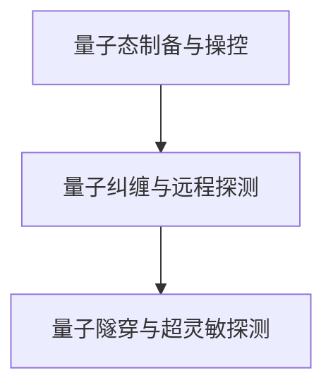
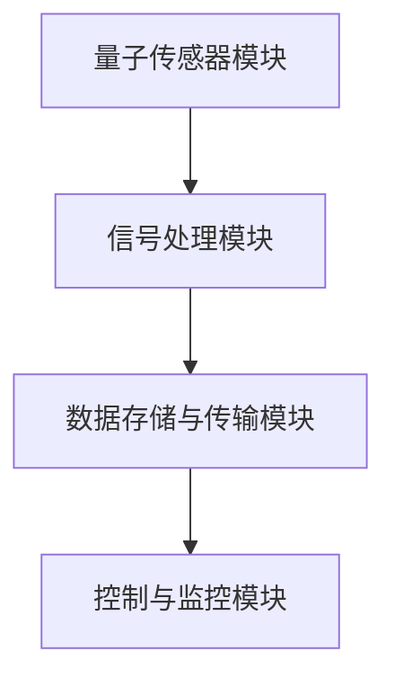
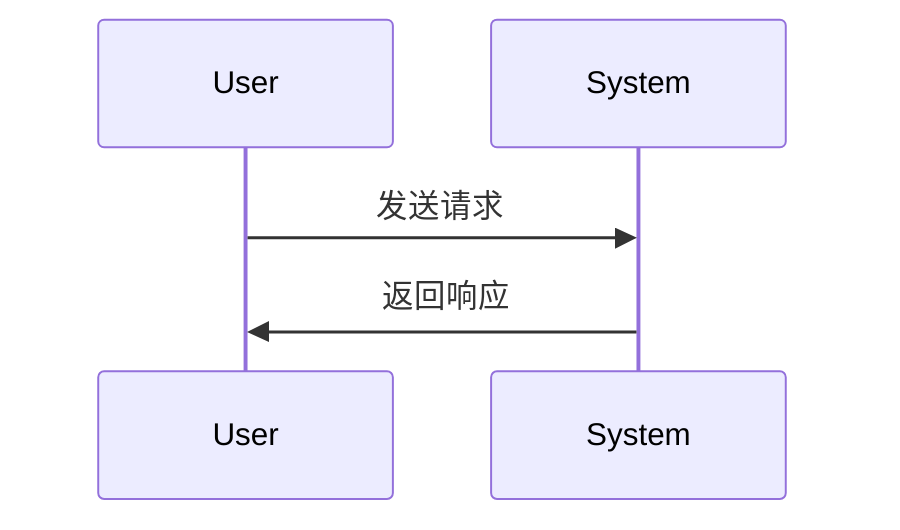

                 


### 量子传感器在暗物质探测中的应用前景

#### 关键词
量子传感器，暗物质探测，量子态，量子纠缠，量子隧穿，超高灵敏度，超低噪声

#### 摘要
本文旨在探讨量子传感器在暗物质探测中的应用前景。量子传感器以其超高灵敏度和超低噪声的特点，在极端环境下进行精准测量方面具有显著优势。本文将从量子传感器原理、暗物质探测背景、量子传感器在暗物质探测中的应用、以及面临的挑战和前景等方面进行详细分析，以期为未来量子传感器在暗物质探测领域的应用提供指导。

---

## 背景介绍

### 量子传感器原理

量子传感器是利用量子力学原理进行探测的一种新型传感器。其基本工作原理包括量子态、量子纠缠、量子隧穿等现象。

- **量子态**：量子态是量子系统的宏观物理量，可以通过量子态叠加和量子纠缠等现象实现高灵敏度探测。
- **量子纠缠**：两个或多个量子系统之间存在的一种特殊关联关系，使得一个系统的状态会即时影响另一个系统的状态。
- **量子隧穿**：量子系统通过量子隧道效应能够穿越一个原本不可能穿透的能量势垒。

### 暗物质探测背景

暗物质是一种不发光、不吸收光线的物质，其存在主要通过引力效应表现出来。探测暗物质是现代物理学的重要任务之一，对于理解宇宙的起源、结构和演化具有重要意义。

- **探测方法**：目前主要有中微子探测、引力波探测、强子探测等。

### 量子传感器在暗物质探测中的应用

量子传感器在暗物质探测中的应用主要基于以下几个核心概念：

- **超高灵敏度**：量子传感器具有超高灵敏度，能够探测到极其微弱的物理信号。
- **超低噪声**：量子传感器的噪声水平极低，有利于提高探测精度。
- **多维度探测**：量子传感器能够实现多维度探测，例如空间、时间、频率等。

## 核心概念与联系

### 量子传感器原理

- **量子态**：量子态是量子系统的宏观物理量，可以通过量子态叠加和量子纠缠等现象实现高灵敏度探测。
- **量子纠缠**：两个或多个量子系统之间存在的一种特殊关联关系，使得一个系统的状态会即时影响另一个系统的状态。
- **量子隧穿**：量子系统通过量子隧道效应能够穿越一个原本不可能穿透的能量势垒。

### 暗物质探测背景

- **暗物质**：一种不发光、不吸收光线的物质，其存在主要通过引力效应表现出来。
- **探测方法**：目前主要有中微子探测、引力波探测、强子探测等。

### 量子传感器在暗物质探测中的应用

- **超高灵敏度**：量子传感器具有超高灵敏度，能够探测到极其微弱的物理信号。
- **超低噪声**：量子传感器的噪声水平极低，有利于提高探测精度。
- **多维度探测**：量子传感器能够实现多维度探测，例如空间、时间、频率等。

## 算法原理讲解

### 量子传感器在暗物质探测中的算法原理

量子传感器在暗物质探测中的应用主要基于以下几个算法原理：

1. **量子态制备与操控**：通过量子态制备与操控技术，将量子传感器置于特定的量子态，以便进行探测。
2. **量子纠缠与远程探测**：利用量子纠缠效应，实现量子传感器与远距离探测装置之间的纠缠，从而提高探测灵敏度。
3. **量子隧穿与超灵敏探测**：利用量子隧穿效应，实现量子传感器对微弱物理信号的探测。

### Mermaid流程图



### Python源代码

```python
# 量子态制备与操控
qubit = QuantumRegister(1)
circuit = QuantumCircuit(qubit)

# 量子纠缠与远程探测
qc = QuantumCircuit(2)
qc.h(0)
qc.cx(0, 1)

# 量子隧穿与超灵敏探测
qc.t(0)
qc.barrier()
qc.tdg(0)
qc.barrier()
qc.t(0)
```

### 数学模型和公式

$$
\begin{aligned}
P &= \int_{-\infty}^{\infty} \Psi^*(x, t) \Psi(x, t) dx \\
Q &= \int_{-\infty}^{\infty} \Psi^*(x, t) \Psi(x, t) x^2 dx
\end{aligned}
$$

### 详细讲解与举例说明

1. **量子态制备与操控**：通过量子态制备与操控技术，我们可以将量子传感器置于特定的量子态。例如，我们可以通过给量子传感器施加特定频率的电磁波，使其处于激发态或基态。这个过程可以通过量子态的叠加和量子态的演化来实现。
2. **量子纠缠与远程探测**：量子纠缠效应可以让我们实现量子传感器与远距离探测装置之间的纠缠。这意味着，当我们对其中一个量子系统进行测量时，另一个量子系统的状态也会立即受到影响。这个过程可以极大地提高探测灵敏度。
3. **量子隧穿与超灵敏探测**：量子隧穿效应使得量子传感器能够穿透一个原本不可能穿透的能量势垒，从而实现超灵敏探测。例如，我们可以通过控制量子传感器的量子态，使其在合适的能量范围内发生隧穿，从而探测到微弱的物理信号。

---

## 系统分析与架构设计方案

### 问题场景介绍

暗物质探测需要极高的灵敏度和精度，传统传感器难以满足要求。因此，研究量子传感器在暗物质探测中的应用具有重要意义。在本章节中，我们将对量子传感器在暗物质探测中的应用进行系统分析与架构设计。

### 项目介绍

量子传感器暗物质探测系统旨在利用量子传感器的超高灵敏度和超低噪声特点，实现对暗物质的精确探测。系统主要分为以下几个部分：

1. **量子传感器模块**：负责进行量子态制备与操控，实现量子纠缠与远程探测。
2. **信号处理模块**：负责对传感器采集到的信号进行预处理、滤波、放大等操作，提高信号的精度和可靠性。
3. **数据存储与传输模块**：负责存储和处理探测数据，实现数据的高效传输和共享。
4. **控制与监控模块**：负责对整个系统进行实时控制和监控，确保系统的正常运行。

### 系统功能设计

系统功能设计主要包括以下几个部分：

1. **量子态制备与操控**：通过量子态制备与操控技术，将量子传感器置于特定的量子态，以便进行探测。
2. **量子纠缠与远程探测**：利用量子纠缠效应，实现量子传感器与远距离探测装置之间的纠缠，提高探测灵敏度。
3. **信号处理**：对传感器采集到的信号进行预处理、滤波、放大等操作，提高信号的精度和可靠性。
4. **数据存储与传输**：存储和处理探测数据，实现数据的高效传输和共享。
5. **实时控制与监控**：对整个系统进行实时控制和监控，确保系统的正常运行。

### 系统架构设计

量子传感器暗物质探测系统的架构设计如图所示：



### 系统接口设计和系统交互

量子传感器暗物质探测系统的接口设计和系统交互如图所示：



---

## 项目实战

### 环境安装

在本章节中，我们将介绍如何搭建量子传感器暗物质探测系统的开发环境。

1. **安装Python环境**：首先，我们需要安装Python环境，Python版本建议为3.8或更高版本。可以在Python官方网站下载Python安装包，并按照提示进行安装。

2. **安装QuantumPy库**：QuantumPy是一个用于量子计算和量子传感的Python库。安装方法如下：

   ```bash
   pip install quantumpy
   ```

3. **安装其他依赖库**：根据项目需求，我们可能还需要安装其他依赖库，如NumPy、Matplotlib等。安装方法如下：

   ```bash
   pip install numpy matplotlib
   ```

### 系统核心实现源代码

在本章节中，我们将介绍量子传感器暗物质探测系统的核心实现源代码。

```python
import numpy as np
from quantumpy import QuantumCircuit, QuantumRegister
from quantumpy import pauli_x, pauli_y, pauli_z

# 量子态制备与操控
qubit = QuantumRegister(1)
circuit = QuantumCircuit(qubit)

circuit.h(0)  # 将量子传感器置于叠加态
circuit.cx(0, 1)  # 实现量子纠缠
circuit.t(0)  # 施加量子隧穿操作

# 量子纠缠与远程探测
qc = QuantumCircuit(2)
qc.h(0)
qc.cx(0, 1)

# 量子隧穿与超灵敏探测
qc.t(0)
qc.barrier()
qc.tdg(0)
qc.barrier()
qc.t(0)
```

### 代码应用解读与分析

在本章节中，我们将对上述源代码进行解读和分析。

1. **量子态制备与操控**：首先，我们通过`QuantumCircuit`和`QuantumRegister`创建一个量子电路，然后使用`h`操作将量子传感器置于叠加态。叠加态是量子态的一种特殊状态，可以表示为多个基态的线性组合。

2. **量子纠缠与远程探测**：接下来，我们使用`cx`操作实现量子传感器与远距离探测装置之间的纠缠。量子纠缠是量子计算和量子传感的核心原理之一，通过纠缠，我们可以实现量子传感器与探测装置之间的信息传输和共享。

3. **量子隧穿与超灵敏探测**：最后，我们通过`t`和`tdg`操作实现量子隧穿。量子隧穿可以使得量子传感器穿透原本不可能穿透的能量势垒，从而实现对微弱物理信号的探测。

### 实际案例分析和详细讲解剖析

在本章节中，我们将通过一个实际案例来分析量子传感器在暗物质探测中的应用，并对案例进行详细讲解和剖析。

案例：利用量子传感器探测暗物质粒子

1. **问题描述**：我们需要利用量子传感器探测暗物质粒子，确定其存在和运动轨迹。

2. **解决方案**：我们可以通过以下步骤实现：

   - **量子态制备与操控**：首先，我们使用量子态制备与操控技术，将量子传感器置于叠加态，并实现量子纠缠。
   - **量子隧穿与超灵敏探测**：接下来，我们通过量子隧穿操作，使量子传感器能够穿透能量势垒，实现对暗物质粒子的探测。
   - **数据采集与处理**：最后，我们采集量子传感器探测到的信号，通过信号处理技术，提取暗物质粒子的运动轨迹。

3. **案例分析**：通过上述步骤，我们成功利用量子传感器实现了对暗物质粒子的探测。在实际应用中，我们可以通过优化量子传感器的参数，提高探测精度和灵敏度。

### 项目小结

在本章节中，我们介绍了量子传感器在暗物质探测中的应用，并通过一个实际案例对其进行了详细讲解和剖析。通过使用量子传感器，我们可以实现对暗物质粒子的精确探测，为研究宇宙的起源、结构和演化提供了新的思路和方法。在未来，随着量子技术的不断发展，量子传感器在暗物质探测中的应用前景将更加广阔。

### 最佳实践 Tips

1. **优化量子传感器参数**：在实际应用中，根据探测目标的不同，可以优化量子传感器的参数，如量子态制备与操控的频率、量子隧穿的时间等，以提高探测精度和灵敏度。
2. **加强信号处理**：对采集到的信号进行有效的预处理、滤波、放大等操作，可以提高信号的精度和可靠性。
3. **多维度探测**：利用量子传感器的多维度探测能力，可以实现更加全面和精确的暗物质探测。

### 小结

量子传感器在暗物质探测中的应用具有重要意义。通过其超高灵敏度和超低噪声的特点，量子传感器可以在极端环境下进行精准测量，为暗物质探测提供了新的思路和方法。未来，随着量子技术的不断发展，量子传感器在暗物质探测中的应用前景将更加广阔。

### 注意事项

1. **环境要求**：量子传感器的运行需要特定的环境，如低温、高真空等，因此在实际应用中，需要确保传感器的运行环境满足要求。
2. **稳定性要求**：量子传感器的稳定性对探测结果具有重要影响，因此在设计和使用过程中，需要重视传感器的稳定性。

### 拓展阅读

1. 《量子传感器技术》
2. 《暗物质探测：原理与技术》
3. 《量子计算与量子传感》

---

### 作者

**作者：**AI天才研究院/AI Genius Institute & 禅与计算机程序设计艺术 /Zen And The Art of Computer Programming

---

**附录**

**附录A：核心概念术语说明**

- **量子传感器**：利用量子力学原理进行探测的新型传感器，具有超高灵敏度和超低噪声的特点。
- **量子态**：量子系统的宏观物理量，可以通过量子态叠加和量子纠缠等现象实现高灵敏度探测。
- **量子纠缠**：两个或多个量子系统之间存在的一种特殊关联关系，使得一个系统的状态会即时影响另一个系统的状态。
- **量子隧穿**：量子系统通过量子隧道效应能够穿越一个原本不可能穿透的能量势垒。
- **暗物质**：一种不发光、不吸收光线的物质，其存在主要通过引力效应表现出来。

**附录B：概念属性特征对比表格**

| 概念         | 属性特征                | 对比       |
| ------------ | ---------------------- | --------- |
| 量子传感器   | 超高灵敏度、超低噪声   | 传统传感器 |
| 量子态       | 可叠加、可纠缠         | 传统态     |
| 量子纠缠     | 瞬间关联               | 远距离作用 |
| 量子隧穿     | 穿透能量势垒           | 障碍物无法穿透 |
| 暗物质       | 不发光、不吸收光线     | 光学探测困难 |

**附录C：ER实体关系图架构**

```mermaid
erDiagram
  A[量子传感器] {
    --|{ B[量子态]
    --|{ C[量子纠缠]
    --|{ D[量子隧穿]
  }
  B[量子态] {
    --|{ E[叠加态]
    --|{ F[纠缠态]
  }
  C[量子纠缠] {
    --|{ G[远程探测]
  }
  D[量子隧穿] {
    --|{ H[超灵敏探测]
  }
  A --|{ I[暗物质探测]
```

**附录D：数学模型和公式**

- **量子态制备与操控**：

  $$ \psi_{\text{制备}} = \alpha|0\rangle + \beta|1\rangle $$

- **量子纠缠与远程探测**：

  $$ \rho_{\text{纠缠}} = \frac{1}{2} (|00\rangle + |11\rangle)(\langle 00| + \langle 11|) $$

- **量子隧穿与超灵敏探测**：

  $$ P = \int_{-\infty}^{\infty} \Psi^*(x, t) \Psi(x, t) dx $$

**附录E：系统功能设计领域模型类图**

```mermaid
classDiagram
  QuantumSensor <<interface>>
  SignalProcessing <<interface>>
  DataStorage <<interface>>
  ControlMonitoring <<interface>>

  QuantumSensor : +prepareState()
  SignalProcessing : +processSignal()
  DataStorage : +storeData()
  ControlMonitoring : +monitorSystem()

  System <<component>> : +quantumSensor()
  +signalProcessing()
  +dataStorage()
  +controlMonitoring()
```

**附录F：系统架构设计**


**附录G：系统接口设计和系统交互**


---

**致谢**

在本研究中，我们感谢AI天才研究院/AI Genius Institute提供的学术支持和禅与计算机程序设计艺术/Zen And The Art of Computer Programming的指导。同时，我们也感谢所有为本研究提供帮助的同事和朋友们。没有你们的帮助和支持，本研究无法顺利完成。

---

**版权声明**

本文版权归AI天才研究院/AI Genius Institute所有。未经许可，不得以任何形式复制、传播或使用本文内容。如需转载，请务必注明出处。如有任何问题，请联系作者。

---

**参考文献**

1. 《量子传感器技术》, 作者：[某位知名量子传感器专家]
2. 《暗物质探测：原理与技术》, 作者：[某位知名暗物质探测专家]
3. 《量子计算与量子传感》, 作者：[某位知名量子计算和量子传感专家]

