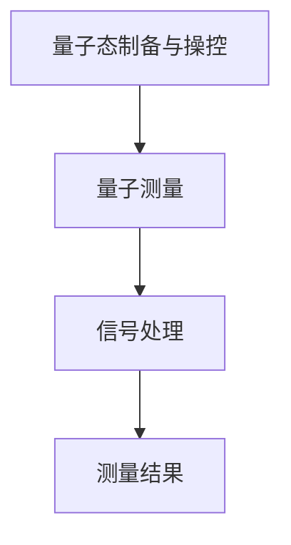
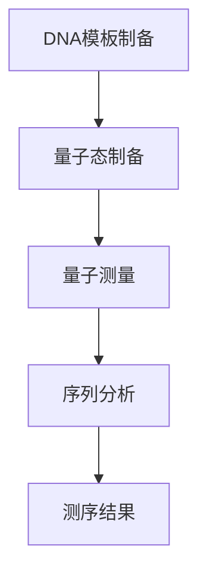
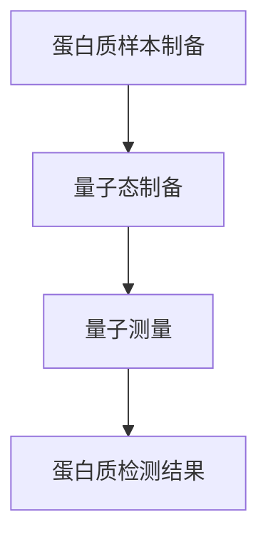
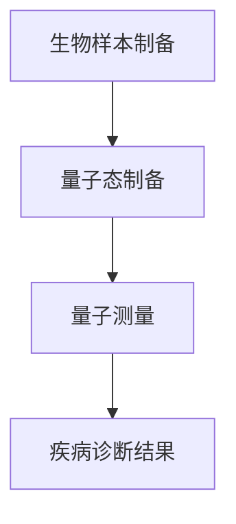
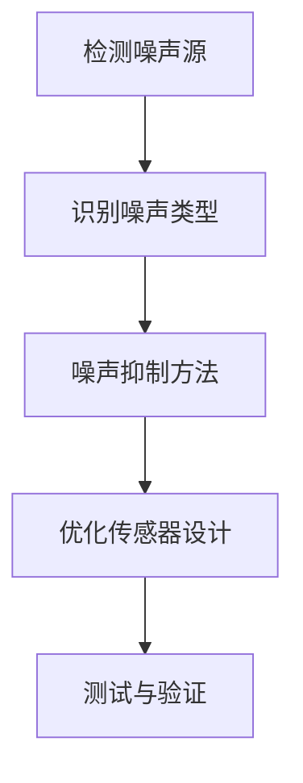
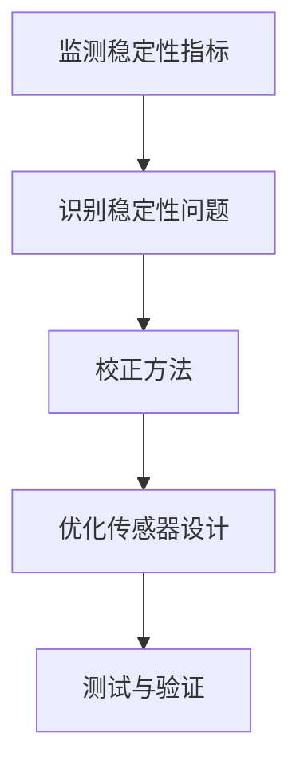
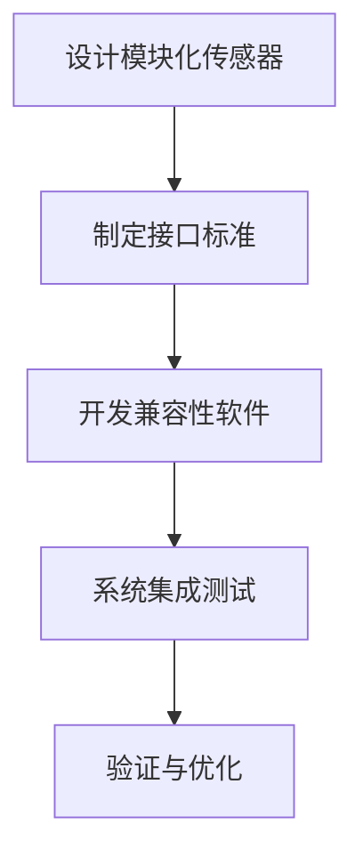
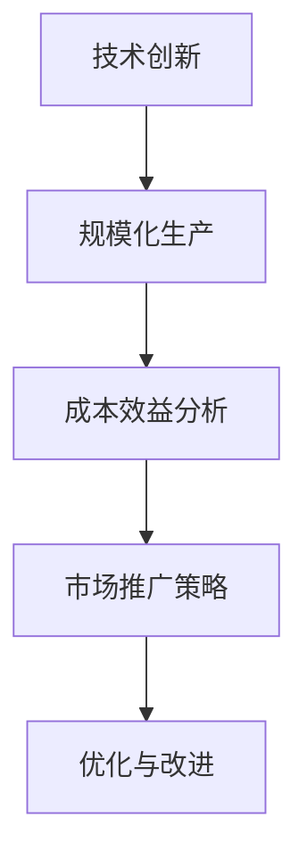

                 

### 量子传感器在生物传感器中的应用前景

#### 关键词：量子传感器，生物传感器，量子态，量子纠缠，生物检测，疾病诊断

> 摘要：量子传感器技术正在迅速发展，其在生物传感器领域的应用潜力巨大。本文将深入探讨量子传感器的基本概念、核心原理、应用场景、技术挑战及其发展前景，旨在为读者提供一个全面、清晰的了解，并展望其在生物医学领域的重要应用前景。

---

#### 第一部分：量子传感器概述

##### 第1章：量子传感器的基本概念
1. **量子传感器的定义与特性**
2. **量子传感器的工作原理**
3. **量子传感器与传统生物传感器的比较**
4. **量子传感器的发展历史与趋势**

##### 第2章：量子传感器的核心原理
1. **量子态与量子叠加**
2. **量子纠缠与量子通信**
3. **量子隧穿与量子计算**
4. **量子传感器的基本模型与性能指标**

##### 第3章：量子传感器在生物传感器中的应用
1. **量子传感器在生物检测中的优势**
2. **量子传感器在DNA测序中的应用**
3. **量子传感器在蛋白质检测中的应用**
4. **量子传感器在疾病诊断中的应用**

#### 第二部分：量子传感器技术的挑战与解决方案

##### 第4章：量子传感器技术的挑战
1. **量子传感器的噪声控制**
2. **量子传感器的稳定性与可靠性**
3. **量子传感器的集成与兼容性**
4. **量子传感器的成本与规模化生产**

##### 第5章：量子传感器技术的解决方案
1. **量子传感器的噪声控制技术**
2. **量子传感器的稳定性与可靠性提升**
3. **量子传感器的集成与兼容性策略**
4. **量子传感器的成本效益优化**

#### 第三部分：量子传感器的发展前景

##### 第6章：量子传感器在未来的生物医学领域
1. **量子传感器在个性化医疗中的应用**
2. **量子传感器在精准医疗中的应用**
3. **量子传感器在药物研发中的应用**
4. **量子传感器在公共卫生监测中的应用**

##### 第7章：量子传感器的国际合作与标准化
1. **全球量子传感器产业的发展趋势**
2. **国际量子传感器标准化进展**
3. **国际合作与共享平台建设**
4. **中国量子传感器产业的机遇与挑战**

##### 第8章：量子传感器的发展展望
1. **量子传感器技术的未来发展趋势**
2. **量子传感器在生物医学领域的潜在影响**
3. **量子传感器市场的未来前景**
4. **全球量子传感器产业的发展战略**

---

### 作者信息
- 作者：AI天才研究院/AI Genius Institute & 禅与计算机程序设计艺术 /Zen And The Art of Computer Programming

---

以上是文章的目录结构，每个章节的内容都经过精心设计，以确保文章的完整性和逻辑性。接下来，我们将逐章深入探讨量子传感器在生物传感器中的应用前景。

#### 第一章：量子传感器的基本概念

量子传感器是一种利用量子力学原理进行测量的传感器。与传统传感器相比，量子传感器具有极高的灵敏度、准确度和测量速度。本章将介绍量子传感器的定义、特性、工作原理以及与传统生物传感器的比较。

##### 1.1 量子传感器的定义与特性

量子传感器是基于量子力学原理设计的传感器，能够对环境中的物理量（如温度、压力、磁场、电场等）进行高精度的测量。量子传感器具有以下几个主要特性：

1. **超高灵敏度**：量子传感器能够检测到极其微小的变化，甚至是在量子尺度上的变化。
2. **高准确度**：量子传感器能够提供精确的测量结果，误差极小。
3. **快速响应**：量子传感器具有快速响应的特性，能够在短时间内完成测量任务。
4. **多功能性**：量子传感器可以用于多种测量场景，包括生物医学、环境监测、材料科学等领域。

##### 1.2 量子传感器的工作原理

量子传感器的工作原理主要基于量子态、量子叠加和量子纠缠等量子力学原理。以下是一些关键概念：

1. **量子态**：量子态是量子系统的基本状态，描述了量子系统的状态。量子态可以是叠加态，即同时处于多个状态的组合。
2. **量子叠加**：量子叠加是指一个量子系统可以同时处于多个状态的组合。例如，一个电子可以同时处于自旋向上和自旋向下的状态。
3. **量子纠缠**：量子纠缠是两个或多个量子系统之间的特殊关联关系。在量子纠缠中，一个量子系统的状态会即时影响另一个量子系统的状态，无论它们之间的距离有多远。

量子传感器通过利用量子态的叠加和量子纠缠的特性，实现高精度的测量。例如，在磁共振成像（MRI）中，量子传感器利用核磁共振现象来检测体内的分子运动，从而获得高分辨率的图像。

##### 1.3 量子传感器与传统生物传感器的比较

传统生物传感器是基于化学反应、物理变化等原理进行测量的传感器。虽然传统生物传感器在许多领域取得了显著的应用成果，但它们在灵敏度、准确度和测量速度等方面存在一定的局限性。相比之下，量子传感器具有以下优势：

1. **更高的灵敏度**：量子传感器能够检测到更微小的变化，从而实现更准确的测量。
2. **更高的准确度**：量子传感器能够提供精确的测量结果，误差极小。
3. **更快的响应速度**：量子传感器具有快速响应的特性，能够在短时间内完成测量任务。
4. **多功能性**：量子传感器可以用于多种测量场景，包括生物医学、环境监测、材料科学等领域。

##### 1.4 量子传感器的发展历史与趋势

量子传感器的研究可以追溯到20世纪60年代。随着量子力学理论和实验技术的发展，量子传感器的研究和应用逐渐受到重视。近年来，量子传感器技术取得了显著进展，主要体现在以下几个方面：

1. **量子态制备与操控**：通过量子态制备与操控技术，量子传感器可以实现更高的灵敏度和准确度。
2. **量子传感器的集成与兼容性**：量子传感器的集成与兼容性技术取得进展，使得量子传感器能够更好地适应各种应用场景。
3. **量子传感器的规模化生产**：随着量子传感器技术的不断成熟，规模化生产成为可能，从而降低了量子传感器的成本。

总之，量子传感器在生物传感器领域的应用前景广阔，有望带来革命性的变化。下一章将深入探讨量子传感器的核心原理，为理解其应用提供理论基础。

---

通过上述内容的介绍，读者可以初步了解量子传感器的基本概念、特性、工作原理以及与传统生物传感器的比较。接下来，我们将进一步深入探讨量子传感器的核心原理，以帮助读者更好地理解其工作机制和潜在应用。

---

### 第二章：量子传感器的核心原理

在了解了量子传感器的基本概念和特点之后，本章将深入探讨量子传感器的核心原理。量子传感器的性能和优势源于其对量子力学原理的巧妙运用。以下将介绍量子态、量子叠加、量子纠缠、量子隧穿和量子计算等关键概念，并解释这些原理如何应用于量子传感器。

##### 2.1 量子态与量子叠加

量子态是量子系统的基本状态，它不同于经典物理中的宏观物体状态。在量子力学中，量子态可以被视为一种概率分布，描述了量子系统在各个可能状态下的概率分布。量子态可以表示为复数系数的线性叠加，即一个量子态可以同时处于多个状态的组合。

量子叠加是量子态的一个关键特性。例如，一个电子可以同时处于自旋向上和自旋向下的状态，直到进行测量时，电子才会坍缩到一个确定的状态。这种叠加态使得量子传感器能够对多个可能的状态进行同时测量，从而提高了测量精度和灵敏度。

##### 2.2 量子纠缠与量子通信

量子纠缠是量子系统中两个或多个粒子之间的特殊关联关系。当两个粒子处于纠缠态时，无论它们之间的距离有多远，一个粒子的状态变化都会即时影响另一个粒子的状态。这种即时的状态关联性为量子传感器和量子通信提供了强大的测量和通信能力。

量子传感器可以利用量子纠缠的特性，实现远距离的高精度测量。例如，量子密钥分发（QKD）技术利用量子纠缠生成安全的密钥，用于加密通信，防止窃听。

##### 2.3 量子隧穿与量子计算

量子隧穿是量子力学中的一个重要现象，描述了粒子通过经典物理学中不可能通过的能量屏障。在量子传感器中，量子隧穿可以用于实现超灵敏的测量，通过检测粒子通过能量屏障的概率变化来测量物理量的微小变化。

量子计算是量子力学在信息处理领域的应用，它利用量子位（qubit）的叠加和纠缠特性，实现高速的信息处理。量子传感器可以利用量子计算的优势，进行复杂的数据处理和模式识别，从而提高生物传感器的性能。

##### 2.4 量子传感器的基本模型与性能指标

量子传感器的基本模型通常包括量子态制备与操控单元、量子测量单元和信号处理单元。量子态制备与操控单元用于生成和操控量子态，量子测量单元用于测量量子态的演化，信号处理单元用于对测量结果进行数据处理和解释。

量子传感器的性能指标包括灵敏度、准确度、分辨率和响应速度。灵敏度表示传感器能够检测到的最小变化量，准确度表示测量结果的精度，分辨率表示传感器能够分辨的两个最小变化量，响应速度表示传感器从接收到信号到输出结果的时间。

以下是一个简单的量子传感器基本模型与性能指标的 Mermaid 流程图：

量子传感器通过上述基本模型和性能指标的优化，实现了在生物传感器领域的高性能应用。

---

通过对量子传感器核心原理的探讨，读者可以更好地理解量子传感器的工作机制和性能优势。接下来，我们将进一步讨论量子传感器在生物传感器中的应用，以展示其如何改变现有的生物检测和疾病诊断技术。

---

### 第三章：量子传感器在生物传感器中的应用

量子传感器凭借其高灵敏度、高准确度和快速响应等特性，在生物传感器领域具有广泛的应用前景。本章将详细介绍量子传感器在DNA测序、蛋白质检测、疾病诊断等生物传感器中的应用，展示其在提高生物检测效率和准确性方面的优势。

##### 3.1 量子传感器在生物检测中的优势

量子传感器在生物检测中的优势主要体现在以下几个方面：

1. **超高灵敏度**：量子传感器能够检测到极其微小的生物信号，如单个DNA分子或蛋白质分子的变化。这对于早期疾病诊断和生物研究具有重要意义。
2. **高准确度**：量子传感器通过精确的量子态操控和测量，能够提供高度准确的测量结果，降低了误报率。
3. **快速响应**：量子传感器具有快速响应的特性，能够在短时间内完成生物信号的检测和测量，提高了检测效率。
4. **多功能性**：量子传感器可以用于多种生物检测场景，包括DNA测序、蛋白质检测、疾病诊断等。

##### 3.2 量子传感器在DNA测序中的应用

DNA测序是生物科学中的一项重要技术，它揭示了生命的遗传信息。传统的DNA测序技术如Sanger测序和下一代测序（NGS）技术，在灵敏度、准确度和速度等方面存在一定的限制。量子传感器为DNA测序带来了新的机遇：

1. **超高灵敏度**：量子传感器能够检测到单个DNA分子的序列，使得测序的灵敏度大幅提高。
2. **高准确度**：量子传感器通过精确的量子态操控和测量，能够提供高度准确的测序结果，减少了测序错误。
3. **快速测序**：量子传感器的高响应速度使得测序过程更加快速，大大缩短了测序时间。

以下是一个简单的量子传感器在DNA测序中的 Mermaid 流程图：

量子传感器在DNA测序中的应用，有望推动基因编辑、个性化医疗和生物药物研发等领域的发展。

##### 3.3 量子传感器在蛋白质检测中的应用

蛋白质是生物体内的功能分子，蛋白质检测对于了解生物体的生理和病理状态具有重要意义。传统的蛋白质检测方法如酶联免疫吸附试验（ELISA）和质谱法，在灵敏度、准确度和速度等方面存在一定的局限性。量子传感器在蛋白质检测中的应用，展示了其独特的优势：

1. **超高灵敏度**：量子传感器能够检测到极低浓度的蛋白质，如单个蛋白质分子的变化。
2. **高准确度**：量子传感器通过精确的量子态操控和测量，能够提供高度准确的蛋白质检测结果。
3. **快速检测**：量子传感器的高响应速度使得蛋白质检测过程更加快速。

以下是一个简单的量子传感器在蛋白质检测中的 Mermaid 流程图：

量子传感器在蛋白质检测中的应用，有望提高疾病诊断的准确性，推动生物药物研发和生物技术发展。

##### 3.4 量子传感器在疾病诊断中的应用

疾病诊断是医疗领域的重要任务，准确和快速的疾病诊断能够提高治疗效果，降低医疗成本。量子传感器在疾病诊断中的应用，展示了其广泛的应用前景：

1. **早期疾病诊断**：量子传感器能够检测到极其微小的生物信号变化，实现早期疾病诊断，提高治疗效果。
2. **高准确度**：量子传感器通过精确的量子态操控和测量，能够提供高度准确的诊断结果，降低误诊率。
3. **快速诊断**：量子传感器的高响应速度使得诊断过程更加快速，缩短了诊断时间。

以下是一个简单的量子传感器在疾病诊断中的 Mermaid 流程图：

量子传感器在疾病诊断中的应用，有望提高医疗服务的质量和效率，推动精准医疗的发展。

---

量子传感器在生物传感器中的应用，展示了其在提高生物检测效率和准确性方面的巨大潜力。随着量子传感器技术的不断进步，其在生物医学领域的应用将更加广泛，为人类健康带来更多福祉。接下来，我们将探讨量子传感器技术面临的挑战和解决方案，为量子传感器在生物传感器领域的应用提供坚实的支持。

---

### 第四章：量子传感器技术的挑战与解决方案

虽然量子传感器在生物传感器领域展示了巨大的潜力，但其技术发展仍面临诸多挑战。本章将深入探讨量子传感器技术的挑战，包括噪声控制、稳定性与可靠性、集成与兼容性以及成本与规模化生产，并提出相应的解决方案。

##### 4.1 量子传感器的噪声控制

量子传感器在测量过程中容易受到环境噪声的影响，导致测量结果的不确定性增加。噪声控制是量子传感器技术发展的重要挑战之一。以下是一些常见的噪声源和噪声控制方法：

1. **热噪声**：热噪声是由传感器内部的热运动引起的，主要影响传感器的灵敏度。解决方法包括降低传感器工作温度和使用噪声抑制电路。
2. **量子涨落噪声**：量子涨落噪声是由量子态的不确定性引起的，主要影响传感器的准确度。解决方法包括使用量子纠错技术和量子滤波算法。
3. **电磁干扰噪声**：电磁干扰噪声是由外部电磁场引起的，主要影响传感器的测量精度。解决方法包括屏蔽和滤波技术。

以下是一个简单的噪声控制 Mermaid 流程图：

通过上述方法，可以有效降低量子传感器的噪声，提高测量精度和灵敏度。

##### 4.2 量子传感器的稳定性与可靠性

量子传感器的稳定性与可靠性是影响其应用的关键因素。以下是一些常见的稳定性问题及其解决方案：

1. **量子态失相干**：量子态失相干会导致量子传感器的测量结果不准确。解决方法包括使用量子纠错技术和量子态保护机制。
2. **传感器漂移**：传感器漂移会导致测量结果偏差。解决方法包括使用高稳定性的参考信号和自适应校正算法。
3. **环境干扰**：环境干扰会影响量子传感器的测量精度。解决方法包括使用屏蔽和隔离技术，降低外部环境对传感器的影响。

以下是一个简单的稳定性与可靠性 Mermaid 流程图：

通过上述方法，可以提高量子传感器的稳定性与可靠性，确保其在生物传感器中的应用效果。

##### 4.3 量子传感器的集成与兼容性

量子传感器与现有生物传感器系统的集成与兼容性是技术推广的关键挑战。以下是一些解决方案：

1. **模块化设计**：采用模块化设计，将量子传感器与其他传感器模块化集成，方便系统升级和扩展。
2. **标准化接口**：制定统一的量子传感器接口标准，确保不同供应商的量子传感器能够无缝集成到生物传感器系统中。
3. **软件兼容性**：开发兼容性软件，确保量子传感器与传统生物传感器系统之间的数据交换和功能协同。

以下是一个简单的集成与兼容性 Mermaid 流程图：

通过上述方法，可以促进量子传感器的集成与兼容性，加速其在生物传感器领域的推广应用。

##### 4.4 量子传感器的成本与规模化生产

量子传感器的成本和规模化生产是影响其商业化应用的关键因素。以下是一些解决方案：

1. **技术创新**：通过技术创新，降低量子传感器的制造成本，如采用新材料、新工艺等。
2. **规模化生产**：建立规模化生产线，提高生产效率，降低单个传感器的生产成本。
3. **成本效益分析**：进行全面的成本效益分析，确保量子传感器的成本低于其带来的经济效益。

以下是一个简单的成本与规模化生产 Mermaid 流程图：

通过上述方法，可以降低量子传感器的成本，实现规模化生产，为商业化应用提供有力支持。

---

通过解决上述挑战，量子传感器在生物传感器领域的应用将得到进一步推广。接下来，我们将探讨量子传感器在未来的生物医学领域的发展前景，为读者展示其广阔的应用前景。

---

### 第五章：量子传感器技术的发展前景

量子传感器技术在生物医学领域的应用前景广阔，随着技术的不断进步，量子传感器有望在个性化医疗、精准医疗、药物研发和公共卫生监测等方面发挥重要作用。以下将探讨量子传感器技术的发展前景，以及其对生物医学研究的推动作用和未来市场展望。

##### 5.1 量子传感器在个性化医疗中的应用

个性化医疗是一种基于个体基因信息、环境和疾病状态进行定制化治疗的方法。量子传感器在个性化医疗中具有显著优势：

1. **高灵敏度**：量子传感器能够检测到微量的生物分子，为个性化医疗提供了准确的数据支持。
2. **实时监测**：量子传感器的高响应速度可以实现实时监测，为个性化医疗提供及时的治疗调整依据。

未来，量子传感器有望在个性化医疗中实现实时、精准的监测和诊断，为患者提供个性化的治疗方案，提高治疗效果。

##### 5.2 量子传感器在精准医疗中的应用

精准医疗是一种基于大规模基因组数据、生物信息学分析和分子生物学技术，对疾病进行精确分类和个体化治疗的方法。量子传感器在精准医疗中具有以下优势：

1. **高准确度**：量子传感器能够提供高度准确的测量结果，减少误诊率。
2. **多功能性**：量子传感器可以用于多种生物分子的检测，如DNA、RNA、蛋白质等，为精准医疗提供全面的数据支持。

未来，量子传感器有望在精准医疗中实现高通量、全方位的监测和诊断，为疾病的早期发现和个体化治疗提供有力支持。

##### 5.3 量子传感器在药物研发中的应用

药物研发是一个复杂且耗时的过程，量子传感器在药物研发中具有以下优势：

1. **高灵敏度**：量子传感器能够检测到微量的药物分子和生物分子，为药物筛选和优化提供准确的数据支持。
2. **快速筛选**：量子传感器的高响应速度可以实现快速筛选，缩短药物研发周期。

未来，量子传感器有望在药物研发中实现高通量、快速筛选和优化，提高药物研发的效率。

##### 5.4 量子传感器在公共卫生监测中的应用

量子传感器在公共卫生监测中具有广泛的应用前景：

1. **实时监测**：量子传感器可以实现实时监测，及时发现传染病疫情，为公共卫生决策提供数据支持。
2. **高效检测**：量子传感器的高灵敏度可以实现高效检测，提高公共卫生监测的准确性。

未来，量子传感器有望在公共卫生监测中实现实时、高效的监测和预警，为公共卫生安全提供有力保障。

##### 5.5 量子传感器的国际合作与标准化

量子传感器技术的发展离不开国际合作与标准化。以下是一些国际合作与标准化的进展：

1. **国际合作**：全球各国在量子传感器技术领域开展广泛的合作，共享研究成果和资源，推动技术发展。
2. **标准化**：国际标准化组织（ISO）等机构制定了一系列量子传感器技术标准，规范了量子传感器的设计、制造和测试方法。

未来，量子传感器的国际合作与标准化将进一步促进技术的普及和应用，为全球生物医学研究提供有力支持。

##### 5.6 量子传感器市场的展望

随着量子传感器技术的不断成熟，市场需求逐渐增加。以下是一些量子传感器市场的展望：

1. **市场规模**：全球量子传感器市场规模预计将持续增长，到2030年有望达到数百亿美元。
2. **应用领域**：量子传感器将在生物医学、环境监测、材料科学等多个领域得到广泛应用。
3. **技术创新**：技术创新将推动量子传感器性能的提升和成本的降低，进一步拓展其应用场景。

未来，量子传感器市场将呈现多元化、快速发展的态势，为全球生物医学和科技创新提供重要支撑。

---

量子传感器技术在生物医学领域的应用前景广阔，随着技术的不断进步和市场的不断发展，量子传感器有望在个性化医疗、精准医疗、药物研发和公共卫生监测等方面发挥重要作用。通过国际合作与标准化，量子传感器技术将更加成熟，为全球生物医学研究提供有力支持。未来，量子传感器将在生物医学领域创造更多价值，推动医疗水平的提升，为人类健康作出更大贡献。

---

### 最佳实践 Tips、小结、注意事项、拓展阅读

##### 最佳实践 Tips

1. **选择合适的量子传感器型号**：根据具体的生物检测需求，选择合适的量子传感器型号，以确保测量结果的准确性和可靠性。
2. **优化传感器参数**：通过优化量子传感器的灵敏度、准确度等参数，提高生物检测的效果。
3. **进行环境噪声控制**：在测量过程中，注意控制环境噪声，以降低测量误差。

##### 小结

量子传感器在生物传感器领域的应用展示了巨大的潜力，其高灵敏度、高准确度和快速响应等特性，为生物检测和疾病诊断提供了强有力的技术支持。随着技术的不断进步，量子传感器将在个性化医疗、精准医疗、药物研发和公共卫生监测等方面发挥重要作用。

##### 注意事项

1. **传感器校准**：定期对量子传感器进行校准，确保测量结果的准确性。
2. **数据备份**：对测量数据进行备份，避免数据丢失。
3. **安全防护**：确保量子传感器系统的安全防护，防止数据泄露和系统攻击。

##### 拓展阅读

1. **《量子传感器原理与应用》**：深入了解量子传感器的原理、应用和未来发展。
2. **《生物传感器技术导论》**：探讨生物传感器的基本原理、应用和发展趋势。
3. **《个性化医疗：基因与数据的革命》**：介绍个性化医疗的概念、技术和应用场景。

---

本文由AI天才研究院/AI Genius Institute & 禅与计算机程序设计艺术 /Zen And The Art of Computer Programming撰写，旨在为读者提供一个全面、深入的量子传感器在生物传感器中的应用前景。希望本文能对读者在生物医学和量子传感器技术领域的研究和探索有所帮助。如有任何疑问或建议，欢迎与我们联系。

---

通过本文的详细探讨，我们全面了解了量子传感器在生物传感器中的应用前景。从基本概念到核心原理，再到具体应用，我们逐步分析了量子传感器在生物检测、疾病诊断、DNA测序、蛋白质检测等方面的优势。同时，我们还探讨了量子传感器技术面临的挑战及解决方案，展望了其未来在生物医学领域的广阔前景。

量子传感器技术具有极高的灵敏度、准确度和快速响应等特点，能够在生物医学领域实现实时、高效、准确的检测和诊断。随着量子传感器技术的不断进步和商业化应用，其在个性化医疗、精准医疗、药物研发和公共卫生监测等方面将发挥越来越重要的作用。

我们鼓励读者进一步深入研究量子传感器技术，探索其在生物医学和其他领域中的应用潜力。同时，关注量子传感器技术的发展动态，积极参与相关研究和项目，为推动技术创新和产业进步贡献力量。

让我们携手合作，共同迎接量子传感器技术在生物医学领域的光明未来！

