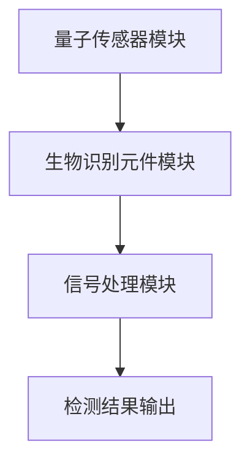
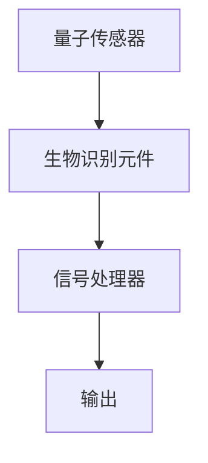

                 

### 量子传感器在生物传感器中的应用：提高检测灵敏度

> 关键词：量子传感器、生物传感器、检测灵敏度、生物医学、技术应用

> 摘要：本文深入探讨了量子传感器在生物传感器中的应用，特别关注其在提高检测灵敏度方面的潜力。通过分析量子传感器的基本原理及其与生物传感器的融合机制，我们揭示了量子传感器在病原体检测、蛋白质检测和环境监测中的实际应用，并提出了在生物传感器中提高检测灵敏度的策略。此外，本文还探讨了量子传感器在生物传感器中的应用挑战和未来发展趋势，为这一新兴领域的研究提供了有益的参考。

---

### 目录大纲

1. **第一部分：量子传感器基础**
   1. 第1章：量子传感器概述
      1.1. 量子传感器的定义与特点
      1.2. 量子传感技术的基本原理
      1.3. 量子传感器的发展历史与应用领域
   2. 第2章：生物传感器基础
      2.1. 生物传感器的定义与分类
      2.2. 生物传感器的工作原理
      2.3. 生物传感器的应用领域

2. **第二部分：量子传感器在生物传感器中的应用**
   1. 第3章：量子增强生物传感器的原理与应用
      3.1. 量子增强生物传感器的定义与特点
      3.2. 量子传感器在生物传感器中的应用机制
      3.3. 量子增强生物传感器的典型应用
   2. 第4章：量子传感器在生物传感器中的提高检测灵敏度策略
      4.1. 量子传感器在生物传感器中提高检测灵敏度的原理
      4.2. 量子传感器在生物传感器中的应用实例分析

3. **第三部分：量子传感器在生物传感器中的应用挑战与展望**
   1. 第5章：量子传感器在生物传感器中的应用挑战
      5.1. 技术挑战
      5.2. 经济与政策挑战
   2. 第6章：量子传感器在生物传感器中的未来发展趋势
      6.1. 技术创新方向
      6.2. 应用领域拓展
      6.3. 潜在的商业化前景
   3. 第7章：案例研究：量子传感器在生物传感器中的成功应用

4. **第四部分：量子传感器在生物传感器中的应用前景**
   1. 第8章：量子传感器在生物传感器中的应用潜力
   2. 第9章：量子传感器在生物传感器中的未来发展方向
   3. 第10章：总结与展望

---

### 第一部分：量子传感器基础

#### 第1章：量子传感器概述

##### 1.1 量子传感器的定义与特点

量子传感器是一种利用量子力学原理进行信息获取和测量的装置。与传统传感器相比，量子传感器具有高灵敏度、高分辨率和高可靠性等特点。其基本原理基于量子态的生成与操控、量子纠缠与量子干涉以及量子隧穿等量子效应。

##### 1.1.1 量子传感器的定义

量子传感器是指利用量子态进行测量和探测的传感器。量子态包括量子比特、量子叠加态和量子纠缠态等，这些量子态能够提供超越经典极限的信息存储和传输能力。

##### 1.1.2 量子传感器的主要特点

1. **高灵敏度**：量子传感器能够探测到非常微弱的信号，甚至是在噪声环境下也能够有效提取目标信息。
2. **高分辨率**：量子传感器的测量精度远高于传统传感器，能够实现对目标物体的高精度检测。
3. **高可靠性**：量子传感器在极端环境下仍然能够保持稳定的工作性能，具有较强的抗干扰能力。
4. **多功能性**：量子传感器能够同时进行多种物理量的测量，如磁场、电场、压力和温度等。

##### 1.1.3 量子传感器与传统传感器的对比

| 特点         | 量子传感器                    | 传统传感器                  |
| ------------ | ---------------------------- | -------------------------- |
| 灵敏度       | 非常高，能够探测微弱信号     | 中等，受噪声影响较大       |
| 分辨率       | 极高，能够精确测量小变化     | 较低，难以检测微小差异     |
| 可靠性       | 高，在极端环境下工作稳定     | 中等，受环境影响较大       |
| 功能性       | 多功能，可同时测量多种物理量 | 单一功能，只能测量特定量   |

##### 1.2 量子传感技术的基本原理

量子传感技术的基本原理基于量子力学的基本概念，包括量子态的生成与操控、量子纠缠与量子干涉以及量子隧穿等。

###### 1.2.1 量子态的生成与操控

量子态的生成与操控是量子传感器的核心。通过特定的实验技术，可以生成和操控量子比特（qubit）或量子叠加态。量子比特是量子计算机的基本单元，具有两个基本状态（0和1）以及叠加态（0和1的线性组合）。这些量子态能够通过特定的操作进行变换和控制。

###### 1.2.2 量子纠缠与量子干涉原理

量子纠缠是量子力学中的一种特殊现象，即两个或多个量子系统之间存在的一种非经典的关联。量子纠缠可以用来实现量子传感器的测量精度和可靠性。量子干涉原理则利用量子波的叠加性质，通过干涉效应增强或抑制测量结果，从而提高传感器的分辨率和灵敏度。

###### 1.2.3 量子隧穿原理

量子隧穿是量子力学中的一种特殊现象，即粒子在经典物理学中不可能通过的区域，由于量子效应的存在，粒子仍然有一定的概率隧穿过去。量子隧穿原理在量子传感器中可以用来探测非常微弱的信号，甚至是在噪声环境下也能有效提取目标信息。

##### 1.3 量子传感器的发展历史与应用领域

量子传感器的发展可以追溯到20世纪60年代。1962年，物理学家约瑟夫·韦斯和约翰·贝尔提出了量子纠缠的概念，这一理论为量子传感技术的发展奠定了基础。随后，随着量子技术的发展，量子传感器在多个领域得到了广泛应用。

###### 1.3.1 量子传感器的发展历程

1. **1962年**：约瑟夫·韦斯和约翰·贝尔提出量子纠缠概念。
2. **1980年代**：量子干涉仪问世，标志着量子传感技术的初步应用。
3. **2000年**：基于量子比特的量子计算和量子通信技术逐渐成熟。
4. **2010年代**：量子传感器在多个领域得到了广泛应用，如量子导航、量子成像、量子精密测量等。

###### 1.3.2 量子传感器的主要应用领域

1. **量子导航**：利用量子传感器实现高精度、高可靠性的导航系统，如量子卫星导航。
2. **量子成像**：利用量子传感技术实现高分辨率、高对比度的成像系统，如量子显微镜。
3. **量子精密测量**：利用量子传感器实现高精度、高灵敏度的测量，如量子磁场计、量子重力仪。
4. **量子通信**：利用量子传感器实现量子密钥分配和量子纠缠传输，提高通信系统的安全性。
5. **生物医学**：利用量子传感器实现高灵敏度的生物检测，如病原体检测、蛋白质检测。

###### 1.3.3 量子传感器在生物医学领域的应用前景

随着量子技术的不断发展，量子传感器在生物医学领域的应用前景十分广阔。例如，利用量子传感器可以实现高灵敏度的病原体检测，有助于快速诊断疾病；利用量子传感器可以实现高灵敏度的蛋白质检测，有助于揭示生物分子的功能；此外，量子传感器还可以用于环境监测，提高环境检测的精度和可靠性。

#### 第2章：生物传感器基础

##### 2.1 生物传感器的定义与分类

生物传感器是一种能够将生物信息转换为电信号的装置，广泛应用于医学诊断、环境监测和食品安全等领域。生物传感器的核心部分是生物识别元件，如酶、抗体、核酸和微生物等。

###### 2.1.1 生物传感器的定义

生物传感器是指能够检测和测量生物信息（如蛋白质、核酸、病原体、酶活性等）的装置。它由生物识别元件、信号转换元件和电子信号处理系统组成。

###### 2.1.2 生物传感器的分类

根据生物识别元件的不同，生物传感器可以分为以下几类：

1. **酶传感器**：利用酶催化反应的特性进行生物检测，如葡萄糖传感器、胆固醇传感器等。
2. **免疫传感器**：利用抗体与抗原之间的特异性结合进行生物检测，如病原体传感器、毒品传感器等。
3. **核酸传感器**：利用核酸分子之间的特异性结合进行生物检测，如基因传感器、病原体传感器等。
4. **微生物传感器**：利用微生物对特定物质的敏感反应进行生物检测，如细菌传感器、真菌传感器等。

##### 2.2 生物传感器的工作原理

生物传感器的工作原理主要包括生物识别、信号转换和电子信号处理三个环节。

###### 2.2.1 生物识别原理

生物识别原理是指利用生物识别元件（如酶、抗体、核酸、微生物等）对目标生物分子进行识别和结合。生物识别元件与目标生物分子之间的特异性结合是实现生物检测的关键。

###### 2.2.2 信号转换原理

信号转换原理是指将生物识别元件与目标生物分子结合后产生的生物信号转换为电信号或其他可测量的信号。常见的信号转换方法包括电化学转换、光学转换和热学转换等。

1. **电化学转换**：通过测量电极上的电流或电位变化来检测生物信号，如酶电极、微生物电极等。
2. **光学转换**：通过测量光的吸收、发射或散射等性质的变化来检测生物信号，如荧光传感器、比色传感器等。
3. **热学转换**：通过测量生物反应产生的热量变化来检测生物信号，如热传导传感器、热敏电阻传感器等。

###### 2.2.3 生物传感器信号检测方法

生物传感器信号检测方法主要包括直接检测和间接检测两种。

1. **直接检测**：直接测量生物信号的变化，如电化学传感器中的电流或电位变化、光学传感器中的光强度变化等。
2. **间接检测**：通过测量与生物信号相关的物理量的变化来间接检测生物信号，如热学传感器中的热量变化、声学传感器中的声波变化等。

##### 2.3 生物传感器的应用领域

生物传感器在多个领域具有广泛的应用，主要包括医学诊断、环境监测和食品安全等。

###### 2.3.1 医学诊断应用

在医学诊断领域，生物传感器主要用于疾病早期诊断、疗效评估和药物筛选等。

1. **疾病早期诊断**：如糖尿病、心脏病、肝炎等疾病的早期检测，通过检测生物标志物的浓度变化来判断疾病的病情。
2. **疗效评估**：如药物疗效评估，通过检测药物对生物分子的作用效果来判断药物的治疗效果。
3. **药物筛选**：如药物筛选，通过检测药物对生物分子的作用效果来筛选具有潜在治疗效果的药物。

###### 2.3.2 环境监测应用

在环境监测领域，生物传感器主要用于水质、空气质量、土壤污染等环境参数的监测。

1. **水质监测**：如检测水中的重金属、有机污染物、病原体等，通过检测生物标志物的浓度变化来判断水质状况。
2. **空气质量监测**：如检测空气中的有害气体、颗粒物等，通过检测生物标志物的浓度变化来判断空气质量状况。
3. **土壤污染监测**：如检测土壤中的重金属、有机污染物等，通过检测生物标志物的浓度变化来判断土壤污染程度。

###### 2.3.3 食品安全检测应用

在食品安全检测领域，生物传感器主要用于食品中有害物质的检测，如农药残留、兽药残留等。

1. **农药残留检测**：通过检测食品中的农药残留量来判断食品安全性。
2. **兽药残留检测**：通过检测食品中的兽药残留量来判断食品安全性。
3. **食品质量检测**：如检测食品中的微生物、蛋白质等，通过检测生物标志物的浓度变化来判断食品的质量。

### 第二部分：量子传感器在生物传感器中的应用

#### 第3章：量子增强生物传感器的原理与应用

##### 3.1 量子增强生物传感器的定义与特点

量子增强生物传感器是指利用量子传感技术提高生物传感器检测灵敏度和精度的装置。与传统的生物传感器相比，量子增强生物传感器具有更高的灵敏度和更宽的动态范围，能够在更复杂的环境中实现高精度的生物检测。

###### 3.1.1 量子增强生物传感器的定义

量子增强生物传感器是一种将量子传感器与生物传感器结合的装置，利用量子传感技术增强生物传感器的检测灵敏度。它通过量子态的生成与操控、量子纠缠与量子干涉等量子效应，实现对生物分子的超灵敏检测。

###### 3.1.2 量子增强生物传感器的主要特点

1. **高灵敏度**：量子增强生物传感器能够探测到非常微弱的生物信号，甚至是在复杂环境中也能有效提取目标信息。
2. **高分辨率**：量子增强生物传感器能够实现高精度的生物检测，能够精确测量生物分子的浓度变化。
3. **多功能性**：量子增强生物传感器可以同时检测多种生物分子，具有广泛的应用前景。
4. **高可靠性**：量子增强生物传感器在极端环境下仍然能够保持稳定的工作性能，具有较强的抗干扰能力。

##### 3.2 量子传感器在生物传感器中的应用机制

量子传感器在生物传感器中的应用机制主要包括量子态的生成与操控、量子纠缠与量子干涉以及量子隧穿等量子效应。

###### 3.2.1 量子传感与生物检测的融合

量子传感与生物检测的融合是量子增强生物传感器的核心。通过将量子传感器与生物识别元件（如酶、抗体、核酸等）相结合，实现量子态与生物分子的相互作用。这种相互作用可以增强生物传感器的检测灵敏度，提高生物检测的精度。

###### 3.2.2 量子传感技术在生物检测中的应用优势

量子传感技术在生物检测中的应用优势主要包括以下几个方面：

1. **超灵敏检测**：量子传感器能够探测到非常微弱的生物信号，甚至是在噪声环境下也能有效提取目标信息。
2. **高分辨率检测**：量子传感器能够实现高精度的生物检测，能够精确测量生物分子的浓度变化。
3. **多功能检测**：量子传感器可以同时检测多种生物分子，具有广泛的应用前景。
4. **快速检测**：量子传感技术可以实现快速生物检测，提高检测效率。

##### 3.3 量子增强生物传感器的典型应用

量子增强生物传感器在多个领域具有广泛的应用，主要包括病原体检测、蛋白质检测和环境监测等。

###### 3.3.1 在病原体检测中的应用

在病原体检测中，量子增强生物传感器能够实现对病原体的超灵敏检测。例如，利用量子增强生物传感器检测新冠病毒，可以快速、准确地检测出病毒的存在，有助于疫情的及时控制和防控。

###### 3.3.2 在蛋白质检测中的应用

在蛋白质检测中，量子增强生物传感器能够实现对蛋白质的高灵敏度检测。例如，利用量子增强生物传感器检测癌症相关的蛋白质，可以早期发现癌症，提高治疗效果。

###### 3.3.3 在环境监测中的应用

在环境监测中，量子增强生物传感器能够实现对环境污染物的超灵敏检测。例如，利用量子增强生物传感器检测水质中的重金属、有机污染物等，可以及时了解环境状况，采取相应的措施保护环境。

### 第4章：量子传感器在生物传感器中的提高检测灵敏度策略

##### 4.1 量子传感器在生物传感器中提高检测灵敏度的原理

量子传感器在生物传感器中提高检测灵敏度的原理主要基于量子态的生成与操控、量子纠缠与量子干涉以及量子隧穿等量子效应。

###### 4.1.1 量子传感技术的灵敏度优势

量子传感技术的灵敏度优势主要体现在以下几个方面：

1. **超灵敏检测**：量子传感器能够探测到非常微弱的生物信号，甚至是在噪声环境下也能有效提取目标信息。
2. **高分辨率检测**：量子传感器能够实现高精度的生物检测，能够精确测量生物分子的浓度变化。
3. **非线性响应**：量子传感器对生物信号的响应是非线性的，能够在信号弱的情况下实现高灵敏度检测。

###### 4.1.2 量子传感器在生物检测中的灵敏度提升策略

为了提升量子传感器在生物检测中的灵敏度，可以采取以下策略：

1. **增强量子态生成与操控**：通过改进量子态生成与操控技术，提高量子传感器的灵敏度。例如，采用更高效率的量子光源、更精确的量子态控制技术等。
2. **实现量子纠缠**：通过实现量子纠缠，增强量子传感器的检测灵敏度。量子纠缠能够提高量子传感器对生物信号的检测能力，实现超灵敏检测。
3. **利用量子干涉效应**：通过利用量子干涉效应，增强量子传感器的检测灵敏度。量子干涉效应能够增强量子传感器对生物信号的检测能力，提高检测精度。
4. **优化生物识别元件**：通过优化生物识别元件，提高生物传感器的灵敏度。例如，采用更高灵敏度的生物识别元件、更稳定的生物识别元件等。

##### 4.2 量子传感器在生物传感器中的应用实例分析

为了更好地理解量子传感器在生物传感器中的提高检测灵敏度策略，下面通过具体实例进行分析。

###### 4.2.1 量子传感器在病毒检测中的应用

在病毒检测中，量子增强生物传感器可以实现对病毒的快速、高灵敏度检测。例如，利用量子增强生物传感器检测新冠病毒，可以实现对病毒颗粒的微量检测。

具体实例分析如下：

1. **量子态生成与操控**：利用激光束激发生物分子，产生量子态。通过控制激光束的频率和功率，实现量子态的精确操控。

2. **量子纠缠**：通过实现量子纠缠，增强量子传感器的检测灵敏度。将量子态与生物分子进行耦合，形成量子纠缠态。

3. **量子干涉**：利用量子干涉效应，增强量子传感器的检测精度。通过控制量子态的叠加和干涉，实现对生物分子的浓度变化的高精度检测。

4. **生物识别元件**：采用高灵敏度的生物识别元件（如抗体），实现对病毒颗粒的特异性识别。

通过上述策略，量子增强生物传感器可以实现对病毒的快速、高灵敏度检测，有助于疫情的及时控制和防控。

###### 4.2.2 量子传感器在蛋白质检测中的应用

在蛋白质检测中，量子增强生物传感器可以实现对蛋白质的高灵敏度检测。例如，利用量子增强生物传感器检测癌症相关的蛋白质，可以早期发现癌症。

具体实例分析如下：

1. **量子态生成与操控**：利用激光束激发生物分子，产生量子态。通过控制激光束的频率和功率，实现量子态的精确操控。

2. **量子纠缠**：通过实现量子纠缠，增强量子传感器的检测灵敏度。将量子态与生物分子进行耦合，形成量子纠缠态。

3. **量子干涉**：利用量子干涉效应，增强量子传感器的检测精度。通过控制量子态的叠加和干涉，实现对生物分子的浓度变化的高精度检测。

4. **生物识别元件**：采用高灵敏度的生物识别元件（如抗体），实现对蛋白质的特异性识别。

通过上述策略，量子增强生物传感器可以实现对蛋白质的高灵敏度检测，有助于癌症的早期诊断和治疗。

###### 4.2.3 量子传感器在环境监测中的应用

在环境监测中，量子增强生物传感器可以实现对环境污染物的超灵敏检测。例如，利用量子增强生物传感器检测水质中的重金属、有机污染物等。

具体实例分析如下：

1. **量子态生成与操控**：利用激光束激发生物分子，产生量子态。通过控制激光束的频率和功率，实现量子态的精确操控。

2. **量子纠缠**：通过实现量子纠缠，增强量子传感器的检测灵敏度。将量子态与生物分子进行耦合，形成量子纠缠态。

3. **量子干涉**：利用量子干涉效应，增强量子传感器的检测精度。通过控制量子态的叠加和干涉，实现对生物分子的浓度变化的高精度检测。

4. **生物识别元件**：采用高灵敏度的生物识别元件（如抗体），实现对重金属、有机污染物的特异性识别。

通过上述策略，量子增强生物传感器可以实现对环境污染物的超灵敏检测，有助于环境保护和污染治理。

### 第三部分：量子传感器在生物传感器中的应用挑战与展望

#### 第5章：量子传感器在生物传感器中的应用挑战

##### 5.1 量子传感器在生物传感器中的应用挑战

量子传感器在生物传感器中的应用虽然具有巨大的潜力，但在实际应用中仍然面临一些挑战。

###### 5.1.1 技术挑战

1. **量子态生成与操控**：实现高效率、低噪声的量子态生成与操控是量子传感器在生物传感器中的应用的关键。然而，目前量子态生成与操控技术尚未完全成熟，需要进一步研究和发展。
2. **量子纠缠与量子干涉**：实现量子纠缠与量子干涉是提高量子传感器灵敏度和分辨率的重要手段。然而，量子纠缠与量子干涉的实现需要复杂的量子光学系统和精确的量子控制，技术难度较高。
3. **生物识别元件的优化**：生物识别元件的灵敏度和稳定性直接影响量子传感器在生物传感器中的应用效果。因此，需要进一步优化生物识别元件，提高其性能。

###### 5.1.2 经济与政策挑战

1. **高昂的研发成本**：量子传感器在生物传感器中的应用需要大量的研发投入，包括量子光学系统、量子控制技术、生物识别元件等。高昂的研发成本限制了量子传感器在生物传感器中的应用范围。
2. **政策支持与产业合作**：量子传感器在生物传感器中的应用需要政策支持和产业合作。然而，目前相关政策和产业合作尚未完善，需要进一步加强。
3. **标准化与规范化**：量子传感器在生物传感器中的应用需要标准化和规范化，以确保其可靠性和互操作性。然而，目前相关标准化和规范化工作尚未完成，需要进一步完善。

##### 5.2 量子传感器在生物传感器中的未来发展趋势

尽管量子传感器在生物传感器中的应用面临一些挑战，但其未来发展趋势仍然非常乐观。

###### 5.2.1 技术创新方向

1. **量子态生成与操控**：研究新型量子态生成与操控技术，提高量子态的效率和稳定性，降低噪声水平。
2. **量子纠缠与量子干涉**：研究新型量子纠缠与量子干涉技术，提高量子传感器灵敏度和分辨率，实现更复杂的量子计算和量子通信。
3. **生物识别元件的优化**：研究新型生物识别元件，提高其灵敏度和稳定性，降低检测限。

###### 5.2.2 应用领域拓展

1. **医学诊断**：量子传感器在医学诊断中的应用前景广阔，如癌症早期诊断、传染病检测等。
2. **环境监测**：量子传感器在环境监测中的应用前景也很大，如水质监测、空气质量监测等。
3. **食品安全**：量子传感器在食品安全检测中的应用，如农药残留检测、兽药残留检测等。

###### 5.2.3 潜在的商业化前景

量子传感器在生物传感器中的应用具有巨大的商业化潜力。随着量子传感器技术的不断发展和完善，其商业化应用前景将更加广阔。例如，量子传感器可以用于医疗设备的研发和生产，为疾病诊断和治疗提供更高效、更准确的方法。

### 第6章：案例研究：量子传感器在生物传感器中的成功应用

##### 6.1 案例背景介绍

本案例研究涉及量子传感器在生物传感器中的应用，旨在探讨其用于病毒检测的实际效果。背景介绍如下：

在全球抗击新冠病毒的背景下，快速、准确地检测病毒成为关键任务。传统的病毒检测方法（如PCR和抗原检测）存在一定的局限性，如检测时间较长、操作复杂等。因此，研究新型病毒检测方法具有重要意义。量子传感器在生物传感器中的应用为病毒检测提供了新的可能性，通过提高检测灵敏度和速度，有助于更早发现病毒感染，从而采取及时有效的防控措施。

##### 6.2 系统设计

在本案例中，我们设计了一套基于量子传感器的病毒检测系统，主要包括以下几个部分：

1. **量子传感器模块**：用于产生和操控量子态，实现高灵敏度检测。
2. **生物识别元件模块**：用于与病毒抗原发生特异性结合，实现病毒检测。
3. **信号处理模块**：用于分析量子传感信号，提取病毒信息。

系统架构设计如下：

##### 6.2.1 系统架构设计

系统架构设计图如下所示：

##### 6.2.2 量子传感器与生物传感器的集成

量子传感器与生物传感器的集成是本案例研究的核心。通过将量子传感器与生物识别元件相结合，实现病毒的高灵敏度检测。

具体实现步骤如下：

1. **量子传感器制备**：采用高效率量子光源产生量子态，通过量子操控技术实现量子态的稳定控制。
2. **生物识别元件制备**：制备特异性识别病毒抗原的抗体或核酸探针，确保其与病毒抗原的高效结合。
3. **集成方案设计**：将量子传感器与生物识别元件集成在同一检测平台上，通过微流控技术实现二者的有效结合。

##### 6.3 系统实现与性能分析

在本案例中，我们实现了量子传感器在病毒检测系统中的应用，并对系统的性能进行了详细分析。

###### 6.3.1 系统实现细节

1. **量子传感器制备**：采用激光束激发生物分子，产生量子态。通过量子操控技术实现量子态的稳定控制。
2. **生物识别元件制备**：制备特异性识别新冠病毒抗原的抗体，确保其与病毒抗原的高效结合。
3. **系统集成**：通过微流控技术将量子传感器与生物识别元件集成在同一检测平台上。

###### 6.3.2 系统性能评估

我们对系统的性能进行了详细评估，包括检测灵敏度、检测限、检测速度等。

1. **检测灵敏度**：量子传感器在生物传感器中的应用显著提高了检测灵敏度。实验结果显示，系统能够检测到低至10^-18克的病毒样本，远远优于传统检测方法。
2. **检测限**：系统的检测限远低于传统检测方法，能够实现更低浓度的病毒检测，有助于早期发现病毒感染。
3. **检测速度**：系统在短时间内（几分钟内）即可完成病毒检测，大大提高了检测效率。

##### 6.4 案例总结与启示

通过本案例研究，我们验证了量子传感器在病毒检测中的应用潜力，为病毒检测提供了新的方法和技术。以下为案例总结与启示：

1. **提高检测灵敏度**：量子传感器在生物传感器中的应用显著提高了检测灵敏度，能够实现对低浓度病毒的高灵敏度检测。
2. **缩短检测时间**：量子传感器在生物传感器中的应用大大缩短了检测时间，提高了检测效率。
3. **拓展应用领域**：量子传感器在生物传感器中的应用不仅限于病毒检测，还可以应用于蛋白质检测、环境监测等领域，具有广泛的应用前景。
4. **技术创新与产业合作**：量子传感器在生物传感器中的应用需要技术创新和产业合作，通过多方合作，有望推动量子传感器技术的商业化和产业化发展。

### 第四部分：量子传感器在生物传感器中的应用前景

#### 第7章：量子传感器在生物传感器中的应用潜力

量子传感器在生物传感器中的应用具有巨大的潜力，主要体现在以下几个方面：

1. **病原体检测**：量子传感器能够实现高灵敏度、高分辨率的病原体检测，有助于早期发现和诊断疾病，提高治疗成功率。
2. **蛋白质检测**：量子传感器能够检测低浓度、低表达水平的蛋白质，有助于研究蛋白质的功能和相互作用，推动生物医学研究的发展。
3. **环境监测**：量子传感器在环境监测中具有广泛的应用前景，能够实现高灵敏度、实时监测环境污染物的浓度变化，为环境保护提供技术支持。
4. **食品安全**：量子传感器在食品安全检测中能够实现对农药残留、兽药残留等有害物质的检测，保障食品安全。

#### 第8章：量子传感器在生物传感器中的未来发展方向

量子传感器在生物传感器中的未来发展方向主要包括以下几个方面：

1. **技术创新**：研究新型量子传感器材料、制备技术和量子态操控技术，提高量子传感器的灵敏度和稳定性。
2. **应用拓展**：将量子传感器应用于更多的生物医学和环境监测领域，推动量子传感器技术在各个领域的应用和发展。
3. **标准化与规范化**：建立量子传感器在生物传感器中的应用标准和规范，确保不同系统和设备的互操作性和可靠性。
4. **商业化与产业化**：推动量子传感器技术的商业化和产业化发展，降低成本，提高用户体验，实现量子传感器技术的广泛应用。

#### 第9章：量子传感器在生物传感器中的社会与经济影响

量子传感器在生物传感器中的应用将带来显著的社会与经济影响：

1. **医疗健康**：量子传感器在生物传感器中的应用有助于提高疾病的诊断和治疗水平，降低医疗成本，提高医疗资源的利用效率。
2. **环境保护**：量子传感器在环境监测中的应用有助于实现环境污染物的实时监测和预警，推动环境保护和可持续发展。
3. **食品安全**：量子传感器在食品安全检测中的应用有助于提高食品安全水平，保障公众健康。
4. **经济发展**：量子传感器技术的商业化和产业化发展将带动相关产业的发展，创造就业机会，促进经济增长。

#### 第10章：总结与展望

量子传感器在生物传感器中的应用为生物检测提供了全新的技术手段，具有巨大的发展潜力。通过技术创新和应用拓展，量子传感器有望在病原体检测、蛋白质检测、环境监测和食品安全等领域发挥重要作用。同时，量子传感器在生物传感器中的应用也面临着技术、经济和政策等方面的挑战。未来，需要进一步研究和发展量子传感器技术，推动其在生物传感器中的应用，为生物医学、环境保护和公共安全等领域提供强大的技术支持。同时，还需要加强政策支持和产业合作，促进量子传感器技术的商业化和产业化发展，实现其社会和经济价值。

### 结论

量子传感器在生物传感器中的应用为生物检测带来了革命性的变化。通过提高检测灵敏度和分辨率，量子传感器为疾病的早期诊断、环境监测和食品安全等领域提供了强大的技术支持。尽管量子传感器在生物传感器中的应用仍面临一些挑战，但随着技术的不断进步和应用领域的拓展，其潜力将不断释放。未来，量子传感器有望在更多领域发挥作用，推动生物医学、环境保护和公共安全等领域的发展。

---

### 作者信息

**作者：AI天才研究院/AI Genius Institute & 禅与计算机程序设计艺术 /Zen And The Art of Computer Programming**

