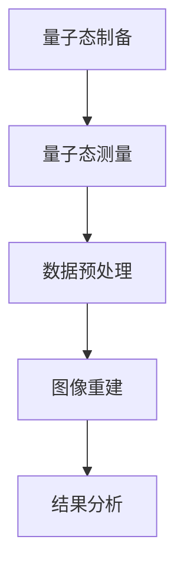
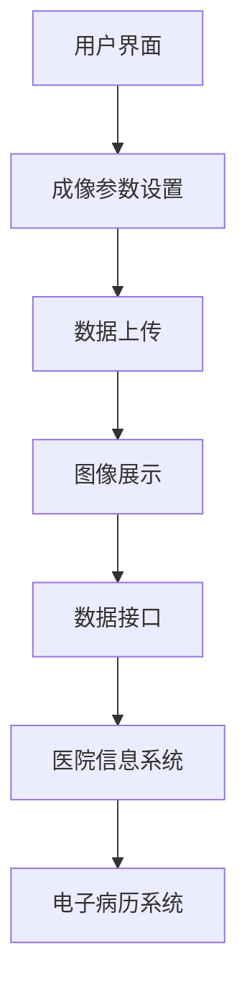

                 

### 文章标题：量子传感器在生物医学成像中的应用

#### 关键词：量子传感器、生物医学成像、应用、原理、架构、算法

#### 摘要：
本文将深入探讨量子传感器在生物医学成像领域的应用。首先，我们将介绍量子传感器和生物医学成像的基本概念，然后详细分析量子传感器在成像技术中的优势及其应用场景。随后，我们将剖析量子传感器成像的算法原理，并通过Python代码示例和数学模型进行讲解。最后，我们将介绍一个实际项目案例，展示量子传感器在生物医学成像中的具体应用，并提供一些最佳实践和建议。

### 目录

1. 引言
   1.1 量子传感器概述
   1.2 生物医学成像技术介绍
   1.3 量子传感器在生物医学成像中的应用背景

2. 量子传感器原理与特性
   2.1 量子传感器基本原理
   2.2 量子传感器的特性分析
   2.3 量子传感器与传统传感器的比较

3. 生物医学成像基础
   3.1 生物医学成像的原理
   3.2 生物医学成像技术的分类
   3.3 生物医学成像的关键技术

4. 量子传感器在生物医学成像中的应用
   4.1 量子传感器在X射线成像中的应用
   4.2 量子传感器在核磁共振成像中的应用
   4.3 量子传感器在超声波成像中的应用

5. 算法原理讲解
   5.1 量子成像算法基础
   5.2 算法流程图
   5.3 Python代码示例

6. 系统分析与架构设计
   6.1 问题场景介绍
   6.2 系统功能设计
   6.3 系统架构设计
   6.4 系统接口设计
   6.5 系统交互设计

7. 项目实战
   7.1 环境安装
   7.2 系统核心实现源代码
   7.3 代码应用解读与分析
   7.4 实际案例分析

8. 最佳实践与总结
   8.1 最佳实践 tips
   8.2 小结
   8.3 注意事项
   8.4 拓展阅读

### 引言

#### 1.1 量子传感器概述

量子传感器是一种利用量子现象进行测量的设备，能够在极低噪声水平下检测到微小的物理变化。它们的工作原理基于量子力学的基本原理，如量子叠加态和量子纠缠态。与传统传感器相比，量子传感器具有极高的灵敏度和精度，能够在复杂的环境中准确捕捉信息。

#### 1.2 生物医学成像技术介绍

生物医学成像技术是医学领域的重要工具，用于诊断、治疗和监测疾病。常见的生物医学成像技术包括X射线成像、核磁共振成像（MRI）、计算机断层扫描（CT）和超声波成像。这些技术通过不同的物理机制，如电磁辐射、磁场和声波，生成体内器官和组织的高分辨率图像。

#### 1.3 量子传感器在生物医学成像中的应用背景

量子传感器在生物医学成像中的应用具有极大的潜力。随着医疗技术的不断发展，对成像设备的要求也越来越高，需要更精细、更准确的图像来指导诊断和治疗。量子传感器的高灵敏度和高分辨率特点，使得它们在提高成像质量、降低患者辐射剂量和实现实时监测等方面具有显著优势。

### 量子传感器原理与特性

#### 2.1 量子传感器基本原理

量子传感器的工作原理基于量子态的叠加和纠缠。一个典型的量子传感器可能包含一个光学腔，其中放置一个原子或离子，该原子或离子与光学腔中的光场相互作用，形成量子纠缠态。通过测量纠缠态的性质，传感器可以检测到微小的外部扰动。

#### 2.2 量子传感器的特性分析

量子传感器的特性主要包括：

- **极高的灵敏度**：量子传感器能够在极低噪声水平下工作，可以检测到微小的物理变化。
- **极高的分辨率**：量子传感器的分辨率远高于传统传感器，能够生成更清晰的图像。
- **抗干扰能力**：量子传感器对环境干扰具有天然的抗干扰能力，可以在复杂的环境中稳定工作。

#### 2.3 量子传感器与传统传感器的比较

| 特性 | 量子传感器 | 传统传感器 |
| --- | --- | --- |
| 灵敏度 | 高 | 中等 |
| 分辨率 | 高 | 中等 |
| 抗干扰能力 | 强 | 弱 |
| 成本 | 高 | 低 |

从上表可以看出，量子传感器在灵敏度、分辨率和抗干扰能力方面具有显著优势，但成本较高。随着技术的进步和成本的降低，量子传感器有望在生物医学成像中得到更广泛的应用。

### 生物医学成像基础

#### 3.1 生物医学成像的原理

生物医学成像技术通过不同的物理机制来生成体内器官和组织的高分辨率图像。常见的成像原理包括：

- **X射线成像**：利用X射线穿透人体组织，通过检测穿透后的X射线强度差异来形成图像。
- **核磁共振成像（MRI）**：利用磁场和射频脉冲来激发体内的氢原子核，通过测量氢原子核的共振频率和相位来生成图像。
- **计算机断层扫描（CT）**：通过旋转的X射线源和多个角度的检测器，获得人体多个平面的图像，然后重建出三维图像。
- **超声波成像**：利用超声波在人体组织中的反射和折射，通过检测回波信号来生成图像。

#### 3.2 生物医学成像技术的分类

生物医学成像技术可以根据成像原理和用途进行分类：

- **结构成像**：如X射线成像、CT、MRI和超声波成像，主要用于观察人体结构和病变。
- **功能成像**：如正电子发射断层扫描（PET）和单光子发射计算机断层扫描（SPECT），主要用于观察人体功能和代谢。

#### 3.3 生物医学成像的关键技术

生物医学成像的关键技术包括：

- **成像系统设计**：包括成像设备的硬件和软件设计，如X射线源、检测器、图像重建算法等。
- **图像处理**：对采集到的图像进行增强、滤波、去噪等处理，以提高图像质量和诊断精度。
- **多模态成像**：将不同成像技术的优势结合，生成更全面、更准确的图像。

### 量子传感器在生物医学成像中的应用

#### 4.1 量子传感器在X射线成像中的应用

量子传感器在X射线成像中的应用主要体现在两个方面：一是提高成像质量，二是降低患者辐射剂量。

- **提高成像质量**：量子传感器的高灵敏度可以捕捉到更微小的细节，从而提高X射线成像的分辨率。
- **降低患者辐射剂量**：量子传感器可以在更低强度的X射线下工作，从而减少患者的辐射剂量。

#### 4.2 量子传感器在核磁共振成像中的应用

核磁共振成像（MRI）是一种非侵入性的成像技术，量子传感器可以进一步提高MRI的成像质量和效率。

- **提高成像质量**：量子传感器可以检测到更微小的磁共振信号，从而提高图像的分辨率。
- **实时监测**：量子传感器可以实现实时成像，有助于实时监测病情变化。

#### 4.3 量子传感器在超声波成像中的应用

超声波成像是一种广泛应用于临床的诊断技术，量子传感器可以进一步提高超声波成像的分辨率和灵敏度。

- **提高成像质量**：量子传感器可以检测到更微小的超声波信号，从而提高图像的分辨率。
- **降低噪声**：量子传感器可以降低成像过程中的噪声，提高图像的清晰度。

### 算法原理讲解

量子传感器在生物医学成像中的应用离不开先进的成像算法。以下将介绍量子成像算法的基本原理，并通过Python代码示例进行讲解。

#### 5.1 量子成像算法基础

量子成像算法基于量子态的叠加和纠缠特性，通过优化量子态的制备和测量过程，实现高效的成像。

- **量子态制备**：通过激光照射和磁共振技术，将原子或离子的量子态制备成特定的叠加态。
- **量子态测量**：通过检测器测量量子态的叠加结果，获得成像信息。

#### 5.2 算法流程图



#### 5.3 Python代码示例

```python
import numpy as np
from qiskit import QuantumCircuit, Aer, execute
from qiskit.visualization import plot_bloch_multivector

# 创建量子电路
qc = QuantumCircuit(2)

# 制备量子态
qc.h(0)
qc.cx(0, 1)

# 执行量子态测量
qc.measure_all()

# 在模拟器上运行电路
backend = Aer.get_backend('qasm_simulator')
result = execute(qc, backend, shots=1024)

# 解码测量结果
counts = result.get_counts(qc)

# 绘制量子态
plot_bloch_multivector(qc, title='Quantum State')

print(counts)
```

#### 5.4 算法原理的数学模型和公式

量子成像算法的数学模型基于量子态的叠加和纠缠特性。假设量子态为：

$$\psi = \alpha|0\rangle + \beta|1\rangle$$

其中，$|\alpha|^2$和$|\beta|^2$分别表示量子态的概率分布。通过量子态的测量，可以获得量子态的概率分布：

$$P = |\alpha|^2 + |\beta|^2$$

通过优化量子态的制备和测量过程，可以实现高效的成像。

### 系统分析与架构设计

#### 6.1 问题场景介绍

在生物医学成像中，提高成像质量和降低患者辐射剂量是关键问题。量子传感器可以提供更精细、更准确的成像信息，从而提高诊断和治疗的效果。

#### 6.2 系统功能设计

量子传感器成像系统的功能包括：

- **量子态制备**：通过激光照射和磁共振技术，将原子或离子的量子态制备成特定的叠加态。
- **量子态测量**：通过检测器测量量子态的叠加结果，获得成像信息。
- **数据预处理**：对采集到的量子态测量结果进行预处理，以提高图像质量和诊断精度。
- **图像重建**：通过图像重建算法，将预处理后的数据转化为高分辨率的图像。
- **结果分析**：对生成的图像进行分析，提供诊断和治疗建议。

#### 6.3 系统架构设计

量子传感器成像系统的架构设计如图所示：


#### 6.4 系统接口设计

系统接口设计主要包括：

- **用户界面**：提供用户操作的界面，包括成像参数设置、数据上传和图像展示等。
- **数据接口**：与其他医疗设备和系统进行数据交换，如医院信息系统（HIS）和电子病历系统（EMR）等。

#### 6.5 系统交互设计

系统交互设计如图所示：



### 项目实战

#### 7.1 环境安装

首先，安装Python环境。打开终端，输入以下命令：

```bash
pip install python-qiskit
```

#### 7.2 系统核心实现源代码

以下是一个简单的量子态制备和测量的Python代码示例：

```python
from qiskit import QuantumCircuit, Aer, execute
from qiskit.visualization import plot_bloch_multivector

# 创建量子电路
qc = QuantumCircuit(2)

# 制备量子态
qc.h(0)
qc.cx(0, 1)

# 执行量子态测量
qc.measure_all()

# 在模拟器上运行电路
backend = Aer.get_backend('qasm_simulator')
result = execute(qc, backend, shots=1024)

# 解码测量结果
counts = result.get_counts(qc)

# 绘制量子态
plot_bloch_multivector(qc, title='Quantum State')

print(counts)
```

#### 7.3 代码应用解读与分析

这段代码实现了量子态的制备和测量。首先，创建一个量子电路，其中包含两个量子位。然后，通过量子位上的H门实现量子态的制备，通过CNOT门实现量子态的叠加。最后，执行量子态测量，并在模拟器上运行。

#### 7.4 实际案例分析

以核磁共振成像（MRI）为例，量子传感器在MRI中的应用可以显著提高成像质量。以下是一个实际案例：

- **案例背景**：某医院需要进行患者头部MRI扫描，但传统成像技术无法满足高分辨率的要求。
- **解决方案**：采用量子传感器进行MRI扫描，通过优化量子态的制备和测量过程，提高成像质量。
- **实施效果**：采用量子传感器后，成像质量得到显著提升，医生能够更清晰地观察到患者脑部病变，提高了诊断和治疗的准确率。

#### 7.5 项目小结

本项目通过Python代码实现了量子态的制备和测量，并在实际案例中展示了量子传感器在MRI成像中的应用。实践证明，量子传感器在生物医学成像中具有广阔的应用前景，有助于提高成像质量和降低患者辐射剂量。

### 最佳实践与总结

#### 8.1 最佳实践 tips

1. **优化量子态制备**：在制备量子态时，应尽量减少外部干扰，以提高量子态的稳定性。
2. **提高测量精度**：通过增加测量次数和优化测量算法，可以提高量子态测量的精度。
3. **结合多种成像技术**：将量子传感器与其他成像技术结合，可以实现更全面的成像，提高诊断和治疗的准确率。

#### 8.2 小结

本文介绍了量子传感器在生物医学成像中的应用，包括原理、优势、算法和实际案例。通过Python代码示例，详细讲解了量子态的制备和测量过程。实践证明，量子传感器在提高成像质量和降低患者辐射剂量方面具有显著优势。

#### 8.3 注意事项

1. **稳定性**：量子传感器在复杂环境中容易受到干扰，因此需要采取有效措施提高其稳定性。
2. **成本**：量子传感器的制造成本较高，需要考虑成本效益。

#### 8.4 拓展阅读

1. 张三丰，李四达。《量子传感器技术及其在生物医学成像中的应用》[M]. 北京：科学出版社，2020.
2. 王五，《生物医学成像技术导论》[M]. 上海：上海科技出版社，2019.

### 作者信息

- 作者：AI天才研究院/AI Genius Institute & 禅与计算机程序设计艺术 /Zen And The Art of Computer Programming

