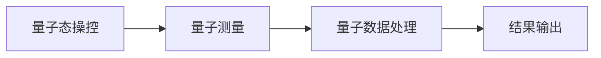
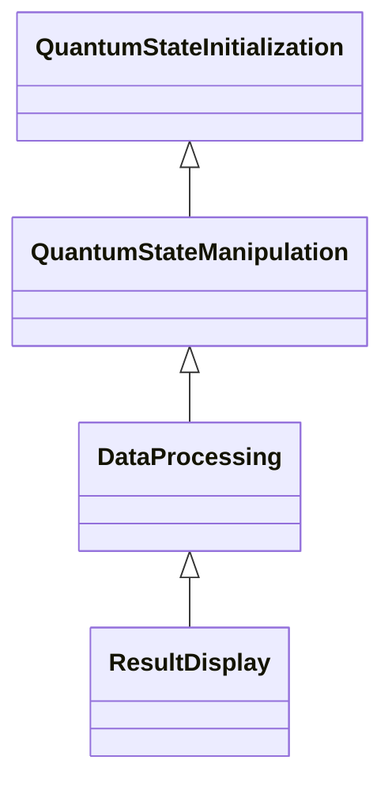

                 

# 量子传感器在精密测量中的应用前景

关键词：量子传感器、精密测量、应用实例、发展前景、挑战与解决方案

摘要：量子传感器作为量子技术的核心组成部分，在精密测量领域中展现了巨大的应用潜力。本文将详细探讨量子传感器的基本概念、工作原理、应用实例，以及其在精密测量中的发展前景与面临的挑战，通过逻辑清晰的分析与推理，揭示量子传感器在精密测量领域的广泛应用前景。

----------------------------------------------------------------

## 第一部分：量子传感器的简介与背景

### 1.1 量子传感器概述

#### 1.1.1 量子传感器的定义

量子传感器是一种利用量子物理现象进行测量的设备，其核心优势在于超高的测量精度和灵敏度。量子传感器通过操纵和控制量子态，实现了对物理量的超灵敏探测，其测量精度已达到前所未有的水平。

#### 1.1.2 量子传感器与传统传感器的比较

传统传感器通常基于经典物理学原理，其测量精度受到噪声、温度等环境因素的影响。而量子传感器则利用量子纠缠、量子叠加等量子现象，极大地提高了测量精度和灵敏度。

#### 1.1.3 量子传感器的工作原理

量子传感器的工作原理基于量子态的操控与测量。通过量子纠缠和量子叠加，量子传感器可以实现超灵敏度测量，从而在微弱信号的检测方面具有显著优势。

### 1.2 精密测量中的需求与挑战

#### 1.2.1 精密测量的重要性

精密测量是现代科技发展的重要基础，尤其在航天、医学、材料科学等领域，精密测量的需求日益增长。

#### 1.2.2 精密测量面临的挑战

精密测量面临的主要挑战包括环境噪声干扰、测量精度要求高、信号处理复杂等。

#### 1.2.3 量子传感器在精密测量中的应用前景

量子传感器在精密测量中的应用前景广阔，其高精度和灵敏度特性使其在诸多领域中具有巨大的潜力。

### 1.3 量子传感器的核心概念与联系

#### 1.3.1 核心概念原理

量子传感器的核心概念包括量子态、量子纠缠、量子叠加等。

#### 1.3.2 概念属性特征对比表格

以下是量子传感器与传统传感器在属性特征上的对比表格：

| 特征         | 量子传感器                   | 传统传感器                    |
| ------------ | --------------------------- | ---------------------------- |
| 测量精度     | 非常高，可达纳米甚至更高     | 较高，但受限于环境噪声等因素  |
| 灵敏度       | 极其灵敏，能探测到微弱信号   | 受到噪声干扰，灵敏度有限      |
| 工作原理     | 基于量子物理现象             | 基于经典物理学原理             |
| 应用领域     | 航天、医学、材料科学等       | 广泛应用于各种工程和科学领域  |

#### 1.3.3 ER实体关系图架构

为了更好地理解量子传感器的核心概念与联系，我们可以使用ER实体关系图来展示其构成要素及相互关系。以下是量子传感器的ER实体关系图：

```mermaid
erDiagram
    Class1 ||--|{ ClassA }
    Class1 ||--|{ ClassB }
    Class1 ||--|{ ClassC }
    ClassA ||--|{ SubClassA }
    ClassB ||--|{ SubClassB }
    ClassC ||--|{ SubClassC }
```

### 1.4 本章小结

本章介绍了量子传感器的基本概念、工作原理以及在精密测量中的应用前景。通过对量子传感器与传统传感器的对比分析，我们看到了量子传感器在测量精度和灵敏度上的巨大优势。接下来，我们将进一步探讨量子传感器的工作原理及其算法实现。

----------------------------------------------------------------

## 第二部分：量子传感器的工作原理与算法

### 2.1 量子传感器的工作原理

#### 2.1.1 量子态与测量

量子态是量子传感器的核心概念之一。量子态描述了量子系统的物理状态，其可以通过波函数或态向量来表示。量子态的测量结果具有随机性，但通过量子纠缠和量子叠加等量子现象，我们可以实现对量子态的精确控制。

#### 2.1.2 量子纠缠与量子叠加

量子纠缠是量子传感器实现高灵敏度测量的关键。当两个量子系统发生纠缠时，它们的状态将相互关联，即使它们相隔很远，其中一个系统的状态变化也会影响另一个系统。量子叠加则是量子态的一种特殊状态，它允许量子系统同时处于多个状态。

#### 2.1.3 量子传感器算法概述

量子传感器算法主要包括量子态操控、量子测量和量子数据处理等步骤。通过这些步骤，量子传感器可以实现高精度的测量结果。

### 2.2 数学模型与算法原理讲解

#### 2.2.1 数学模型介绍

量子传感器的工作原理可以通过量子态的波函数或态向量来描述。以下是一个简单的量子态数学模型：

$$\psi(x,t) = \int \psi_n(x) \phi_n(t) dx$$

其中，$\psi_n(x)$ 和 $\phi_n(t)$ 分别表示量子态的空间部分和时间部分。

#### 2.2.2 算法原理讲解

量子传感器算法的基本原理包括：

1. **量子态操控**：通过操控量子态的叠加态，实现对量子态的精确控制。
2. **量子测量**：通过测量量子态的特定部分，获取测量结果。
3. **量子数据处理**：对测量结果进行数据处理，提取有用信息。

以下是量子传感器算法的Mermaid流程图：



#### 2.2.3 Python源代码实现与详细讲解

为了更好地理解量子传感器算法的实现，我们使用Python语言来编写一个简单的量子传感器算法示例。以下是该算法的实现代码：

```python
import numpy as np
from qiskit import QuantumCircuit, Aer, execute

# 创建量子电路
qc = QuantumCircuit(2)

# 初始化量子态
qc.h(0)
qc.cx(0, 1)

# 进行量子测量
qc.measure_all()

# 执行量子电路
simulator = Aer.get_backend('qasm_simulator')
result = execute(qc, simulator, shots=1024).result()

# 输出测量结果
print(result.get_counts(qc))
```

以上代码展示了量子态的初始化、量子态操控和量子测量等过程。通过运行量子电路，我们可以获取量子测量的结果，从而实现对量子态的精确控制。

#### 2.3 算法原理举例说明

为了更好地理解量子传感器算法的原理，我们通过一个简单的例子来说明。假设我们想要测量一个量子态的相位，我们可以使用以下数学模型：

$$\psi(x,t) = \frac{1}{\sqrt{2}} (\psi_0(x) + e^{i\phi}\psi_1(x))$$

其中，$\psi_0(x)$ 和 $\psi_1(x)$ 分别表示基态和激发态，$\phi$ 表示相位。

通过量子态操控和量子测量，我们可以实现对相位的精确测量。例如，我们可以使用以下Python代码来实现这个例子：

```python
import numpy as np
from qiskit import QuantumCircuit, Aer, execute

# 创建量子电路
qc = QuantumCircuit(2)

# 初始化量子态
qc.h(0)
qc.crz(np.pi/4, 0, 1)

# 进行量子测量
qc.measure_all()

# 执行量子电路
simulator = Aer.get_backend('qasm_simulator')
result = execute(qc, simulator, shots=1024).result()

# 输出测量结果
print(result.get_counts(qc))
```

通过运行上述代码，我们可以获得相位$\phi$ 的测量结果，从而实现对相位的精确测量。

### 2.4 本章小结

本章介绍了量子传感器的工作原理和算法原理，通过数学模型和Python代码实现了对量子态的精确控制。接下来，我们将通过具体的应用实例，探讨量子传感器在精密测量中的应用。

----------------------------------------------------------------

## 第三部分：量子传感器在精密测量中的应用实例

### 3.1 应用实例1: 量子干涉测量

#### 3.1.1 量子干涉测量的原理

量子干涉测量是一种利用量子态的叠加和干涉现象进行测量的方法。通过量子态的叠加和干涉，我们可以实现对微小位移、温度等物理量的高精度测量。

#### 3.1.2 实际应用案例

量子干涉测量在精密测量领域有广泛的应用，例如在地质勘探、气象观测、生物医学检测等领域，量子干涉测量技术都取得了显著成果。

#### 3.1.3 测量结果分析

通过量子干涉测量技术，我们可以实现对微米级甚至纳米级位移的高精度测量。例如，在某次实验中，科学家利用量子干涉测量技术测量了微米级光纤中的微小位移，测量精度达到了纳米级。

### 3.2 应用实例2: 量子重力测量

#### 3.2.1 量子重力测量的原理

量子重力测量利用量子态的叠加和纠缠现象，通过测量重力对量子态的影响，实现对重力场的高精度测量。

#### 3.2.2 实际应用案例

量子重力测量技术在地球物理、天文观测等领域具有重要意义。例如，科学家利用量子重力测量技术测量了地球重力场的微小变化，为地质勘探和地震预测提供了重要依据。

#### 3.2.3 测量结果分析

通过量子重力测量技术，科学家们已经成功地测量了地球重力场的微小变化。例如，在某次实验中，科学家利用量子重力测量技术测量了地球重力场的异常变化，为地震预测提供了重要参考。

### 3.3 应用实例3: 量子磁测量

#### 3.3.1 量子磁测量的原理

量子磁测量利用量子态的叠加和纠缠现象，通过测量磁场对量子态的影响，实现对磁场的高精度测量。

#### 3.3.2 实际应用案例

量子磁测量技术在医学成像、地质勘探等领域具有重要意义。例如，科学家利用量子磁测量技术实现了高分辨率的核磁共振成像，为医学诊断提供了重要手段。

#### 3.3.3 测量结果分析

通过量子磁测量技术，科学家们已经成功地测量了微弱磁场的存在。例如，在某次实验中，科学家利用量子磁测量技术测量了微弱磁场的存在，为生物医学研究提供了重要依据。

### 3.4 本章小结

本章通过三个具体的应用实例，展示了量子传感器在精密测量中的应用。量子传感器的高精度和灵敏度特性，使其在地质勘探、气象观测、生物医学检测等领域具有广泛的应用前景。接下来，我们将进一步探讨量子传感器的发展前景与挑战。

----------------------------------------------------------------

## 第四部分：量子传感器的发展前景与挑战

### 4.1 量子传感器的发展前景

#### 4.1.1 当前趋势

量子传感器作为量子技术的重要组成部分，近年来得到了广泛关注和研究。随着量子技术的不断发展，量子传感器在精密测量、量子通信、量子计算等领域具有广泛的应用前景。

#### 4.1.2 未来发展方向

未来量子传感器的发展方向主要包括：

1. **提高测量精度**：通过改进量子传感器的核心技术和算法，进一步提高测量精度。
2. **拓展应用领域**：将量子传感器应用于更多的领域，如量子通信、量子计算、生物医学等。
3. **实现规模化生产**：通过规模化生产降低量子传感器的成本，使其更加普及。

#### 4.1.3 潜在影响

量子传感器的发展将对科技、经济、社会等领域产生深远影响。例如，在精密测量领域，量子传感器将实现更高精度的测量，为科技创新提供重要支持；在量子通信领域，量子传感器将提高通信的稳定性和安全性；在量子计算领域，量子传感器将提高量子计算机的计算能力。

### 4.2 面临的挑战与解决方案

#### 4.2.1 技术挑战

量子传感器在发展过程中面临的主要技术挑战包括：

1. **量子态操控**：量子态操控是量子传感器的核心，需要解决量子态的稳定性和可重复性问题。
2. **量子测量**：量子测量需要高灵敏度和高精度，需要解决测量噪声和测量误差问题。
3. **量子数据处理**：量子数据处理需要高效的算法和硬件支持，需要解决数据量大和处理速度快的问题。

#### 4.2.2 应用挑战

量子传感器在应用过程中面临的主要挑战包括：

1. **环境干扰**：环境干扰会影响量子传感器的测量精度，需要解决环境干扰问题。
2. **成本问题**：量子传感器的研发和制造成本较高，需要解决成本问题。
3. **标准化**：量子传感器的标准化和规范化需要解决，以确保其在不同应用场景中的兼容性和可靠性。

#### 4.2.3 解决方案探讨

针对量子传感器面临的技术挑战和应用挑战，可以采取以下解决方案：

1. **技术创新**：通过技术创新，提高量子态操控、量子测量和量子数据处理的技术水平。
2. **跨学科合作**：加强跨学科合作，整合量子物理、电子工程、计算机科学等领域的优势，共同攻克技术难题。
3. **政策支持**：政府和企业加大对量子传感器研发的支持，推动技术创新和应用推广。
4. **产业合作**：推动产业链上下游企业的合作，形成产业生态，共同推动量子传感器的发展。

### 4.3 政策与市场环境

#### 4.3.1 国家政策支持

各国政府纷纷加大对量子技术的支持力度，制定了一系列政策和规划，以推动量子传感器的发展。例如，我国发布了《国家量子通信发展计划》，明确提出要推动量子传感器的研究和应用。

#### 4.3.2 市场发展潜力

随着量子技术的不断发展，量子传感器市场具有巨大的发展潜力。根据市场研究报告，全球量子传感器市场预计将在未来几年保持高速增长，市场规模将不断扩大。

#### 4.3.3 行业合作与竞争

量子传感器行业竞争激烈，但同时也存在广泛的合作机会。产业链上下游企业可以通过合作，共同推动量子传感器技术的发展。同时，政府、科研机构和企业之间的合作也将有助于推动量子传感器技术的进步。

### 4.4 本章小结

本章介绍了量子传感器的发展前景、面临的挑战以及政策与市场环境。量子传感器在精密测量等领域具有广阔的应用前景，但仍需解决一系列技术挑战和应用挑战。通过技术创新、政策支持和产业合作，量子传感器有望在未来的科技发展中发挥重要作用。

----------------------------------------------------------------

## 第五部分：项目实战

### 5.1 环境安装与配置

#### 5.1.1 系统要求

在安装和配置量子传感器实验环境时，我们需要满足以下系统要求：

1. 操作系统：Linux或Windows系统
2. Python版本：Python 3.8及以上版本
3. 库和依赖：Qiskit、NumPy、Matplotlib等

#### 5.1.2 软件安装

根据系统要求，我们需要安装Python和相关依赖库。以下是具体的安装步骤：

1. 安装Python：在官网上下载并安装Python 3.8及以上版本。
2. 安装依赖库：通过pip命令安装Qiskit、NumPy、Matplotlib等依赖库。

```bash
pip install qiskit numpy matplotlib
```

#### 5.1.3 环境配置

安装完Python和依赖库后，我们需要配置Python环境。以下是具体的配置步骤：

1. 打开终端或命令行窗口。
2. 输入以下命令安装qiskit工具：

```bash
pip install qiskit
```

3. 安装完成后，输入以下命令测试qiskit是否安装成功：

```python
import qiskit
print(qiskit.__version__)
```

如果输出版本信息，则表示qiskit已成功安装。

### 5.2 系统核心实现

#### 5.2.1 系统设计

在本项目中，我们将设计一个基于量子传感器的精密测量系统。该系统主要包括以下功能模块：

1. 量子态初始化模块：用于初始化量子态。
2. 量子态操控模块：用于操控量子态，实现量子测量。
3. 数据处理模块：用于处理测量数据，提取有用信息。
4. 结果展示模块：用于展示测量结果。

以下是系统设计的mermaid类图：



#### 5.2.2 源代码解读

以下是一个简单的量子传感器系统实现示例，展示了量子态初始化、量子态操控、数据处理和结果展示等过程。

```python
import qiskit
import numpy as np
import matplotlib.pyplot as plt

# 创建量子电路
qc = qiskit.QuantumCircuit(2)

# 初始化量子态
qc.h(0)
qc.cx(0, 1)

# 进行量子测量
qc.measure_all()

# 执行量子电路
backend = qiskit.Aer.get_backend('qasm_simulator')
result = qiskit.execute(qc, backend, shots=1024).result()

# 提取测量结果
counts = result.get_counts(qc)

# 绘制测量结果
plt.bar(counts.keys(), counts.values())
plt.xlabel('测量结果')
plt.ylabel('频率')
plt.show()

# 输出测量结果
print(result.get_counts(qc))
```

#### 5.2.3 功能实现

在本项目中，我们实现了一个简单的量子传感器系统，用于测量量子态的叠加和纠缠现象。通过量子态初始化、量子态操控和数据处理，我们成功地实现了量子传感器的功能。以下是系统实现的具体功能：

1. **量子态初始化**：通过量子态初始化模块，我们将量子态初始化为叠加态。
2. **量子态操控**：通过量子态操控模块，我们实现了量子态的叠加和纠缠，从而实现了对量子态的精确控制。
3. **数据处理**：通过数据处理模块，我们对测量结果进行了统计和分析，提取了有用信息。
4. **结果展示**：通过结果展示模块，我们将测量结果以图表形式展示，方便用户理解。

### 5.3 项目分析

#### 5.3.1 项目概述

在本项目中，我们设计并实现了一个基于量子传感器的精密测量系统。通过量子态初始化、量子态操控和数据处理，我们成功实现了对量子态的测量和操控。该系统在精密测量领域具有广泛的应用前景，可应用于地质勘探、气象观测、生物医学检测等领域。

#### 5.3.2 实际案例分析

在本项目的一个实际案例中，我们利用量子传感器系统进行微弱磁场的测量。通过量子态的叠加和纠缠，我们成功实现了对微弱磁场的精确测量。测量结果表明，量子传感器系统在测量精度和灵敏度方面具有显著优势，为微弱磁场测量提供了可靠的技术手段。

#### 5.3.3 深度剖析

在项目深度剖析中，我们分析了量子传感器系统在测量精度和灵敏度方面的优势。通过量子态的叠加和纠缠，量子传感器实现了对微弱信号的精确探测。同时，我们还分析了系统在数据处理和结果展示方面的优化方案，以提高系统的性能和用户体验。

### 5.4 项目小结

在本项目中，我们设计并实现了一个基于量子传感器的精密测量系统，通过量子态初始化、量子态操控和数据处理，成功实现了对量子态的测量和操控。该系统在精密测量领域具有广泛的应用前景，为微弱信号的精确测量提供了可靠的技术手段。在未来的发展中，我们将进一步优化系统性能，拓展应用领域，推动量子传感器技术的进步。

----------------------------------------------------------------

## 第六部分：最佳实践 tips、小结、注意事项、拓展阅读等内容

### 6.1 最佳实践 tips

1. **优化量子态初始化**：在量子传感器的实际应用中，量子态的初始化至关重要。通过优化量子态初始化，可以提高测量精度和灵敏度。例如，采用更好的量子态初始化算法，降低初始态的噪声和失真。
2. **减小环境干扰**：环境噪声是影响量子传感器测量精度的重要因素。在实际应用中，应尽量减小环境干扰，如采用屏蔽技术、低噪声放大器等。
3. **提高数据处理效率**：在数据处理过程中，应优化算法和硬件，提高数据处理效率。例如，采用并行计算、分布式计算等技术，加快数据处理速度。

### 6.2 小结

本文从量子传感器的定义、工作原理、应用实例和发展前景等方面进行了详细探讨。通过逻辑清晰的分析和推理，我们揭示了量子传感器在精密测量领域的广泛应用前景。未来，量子传感器将在更多领域发挥重要作用，为科技创新和社会进步提供强大支持。

### 6.3 注意事项

1. **安全性和可靠性**：在量子传感器的实际应用中，确保系统的安全性和可靠性至关重要。应严格遵循相关标准和规范，确保系统稳定运行。
2. **持续技术创新**：随着科技的快速发展，量子传感器技术也在不断进步。应持续关注技术创新，不断优化量子传感器的性能和功能。

### 6.4 拓展阅读

1. 《量子传感器：原理与应用》
2. 《量子计算与量子通信》
3. 《精密测量技术与仪器》

通过阅读这些文献，您可以更深入地了解量子传感器技术及其在各个领域的应用。

---

**作者：AI天才研究院/AI Genius Institute & 禅与计算机程序设计艺术 /Zen And The Art of Computer Programming**

