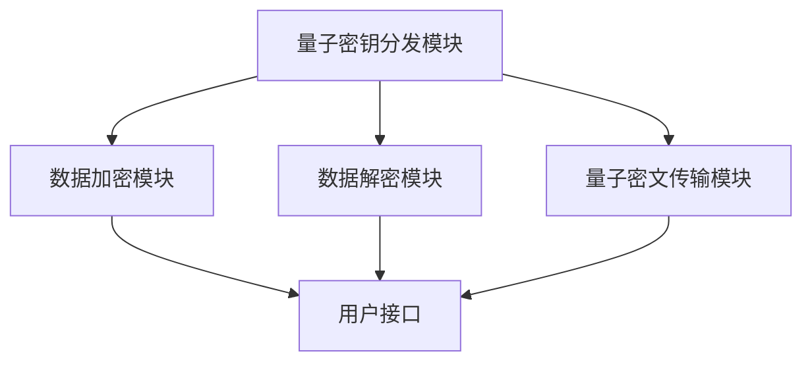
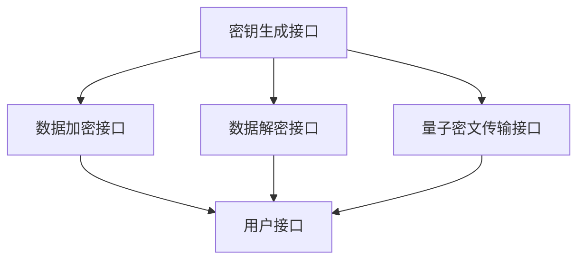
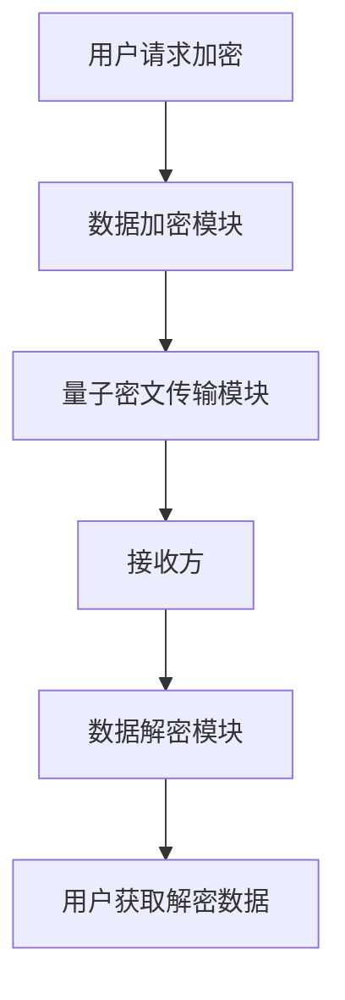

                 


## 引言

在信息技术高速发展的时代，数据安全成为企业面临的重大挑战。传统的加密技术尽管在保证数据安全方面发挥了重要作用，但随着量子计算的崛起，这些技术正面临着前所未有的威胁。量子加密作为新一代的加密技术，以其独特的优势引起了广泛关注。本文将深入探讨量子加密在企业数据保护中的应用前景，通过逻辑清晰、结构紧凑的分析，帮助读者理解量子加密的原理、应用场景以及其在企业数据保护中的潜力。

首先，我们将回顾量子加密的起源和基本原理，了解它如何不同于传统加密方法。接着，分析企业数据保护的需求和挑战，展示量子加密在这一领域的独特优势。随后，我们将详细介绍量子加密算法的工作原理，包括其数学模型和公式，并通过Python代码示例进行通俗易懂的讲解。在此基础上，我们将探讨量子加密系统在企业数据保护中的应用架构，展示其如何实现数据传输、存储和网络安全。然后，通过一个实际项目案例，我们将深入了解量子加密在企业数据保护中的具体应用。最后，本文将总结最佳实践、注意事项，并提供拓展阅读资源，为读者进一步学习提供方向。

## 文章关键词

量子加密、企业数据保护、信息安全、数据传输、数据存储、网络安全、量子密钥分发、量子密文传输、量子算法。

## 摘要

本文旨在探讨量子加密在企业数据保护中的应用前景。首先，通过介绍量子加密的基本原理和优势，分析其在企业数据保护中的重要性。接着，详细讲解量子加密算法的工作原理，并通过Python代码示例进行说明。然后，阐述量子加密系统在企业数据保护中的应用架构，包括数据传输、存储和网络安全。通过实际项目案例，展示量子加密在保护企业敏感数据方面的应用。最后，总结量子加密在企业数据保护中的最佳实践，并提出注意事项和未来展望。

## 第一部分: 量子加密概述

### 第1章: 量子加密的基本概念

#### 1.1 量子加密的起源与发展

量子加密是一种基于量子力学原理的新型加密技术，起源于20世纪80年代。当时，量子力学的研究已经深入到量子纠缠、量子叠加等概念，这些概念为量子加密提供了理论基础。量子加密的发展历程可以分为以下几个阶段：

- **第一阶段（1980s-1990s）**：量子加密的初步探索阶段。科学家们开始研究如何利用量子纠缠和量子叠加原理进行加密和解密。
- **第二阶段（2000s）**：量子加密技术的逐步成熟。量子密钥分发（Quantum Key Distribution, QKD）成为量子加密的主要研究方向，并在实验室中得到了成功验证。
- **第三阶段（2010s-至今）**：量子加密技术的商业化应用阶段。随着量子技术的不断发展，量子加密系统开始逐步应用于实际场景，如金融、医疗等领域。

#### 1.1.1 量子力学的基本原理

量子力学是研究微观世界物理现象的学科，其基本原理包括量子纠缠、量子叠加和量子测量等。以下是这些基本原理的简要介绍：

- **量子纠缠**：当两个粒子发生纠缠时，无论它们相距多远，对其中一个粒子的测量会立即影响另一个粒子的状态。这一特性为量子加密提供了安全性保证。
- **量子叠加**：在量子力学中，一个量子系统可以同时处于多个状态的叠加。这一特性使得量子加密算法能够处理大量数据。
- **量子测量**：量子测量会破坏量子态的叠加性，使得测量结果具有随机性。这一特性为量子加密提供了不可预测性。

#### 1.1.2 量子加密的起源

量子加密的起源可以追溯到1984年，当时Charles H. Bennett和Gilles Brassard提出了量子密钥分发（QKD）协议。这一协议利用量子纠缠和量子叠加原理，实现了两个用户之间的安全密钥交换。量子加密的起源不仅标志着量子计算与信息技术的结合，也为数据安全领域带来了革命性的变化。

#### 1.1.3 量子加密的发展趋势

随着量子计算技术的发展，量子加密正逐步走向商业化应用。目前，量子加密主要应用于以下几个方面：

- **金融领域**：金融行业对数据安全要求极高，量子加密技术可以有效保障金融数据的机密性和完整性。
- **医疗领域**：医疗数据涉及到个人隐私和生命安全，量子加密技术可以为医疗数据提供更安全的保护。
- **供应链管理**：供应链管理中的数据传输涉及到多个环节，量子加密技术可以确保数据传输的安全性和可靠性。

#### 1.2 企业数据保护的需求

企业数据保护是当今企业面临的重大挑战之一。随着大数据、云计算等技术的普及，企业数据量呈现爆炸式增长。同时，黑客攻击、数据泄露等事件也时有发生，企业数据安全形势严峻。以下是企业数据保护的需求和挑战：

- **需求**：企业需要保护其内部数据，包括客户数据、财务数据、研发数据等，以防止数据泄露、篡改和丢失。
- **挑战**：传统的加密技术虽然在一定程度上保障了数据安全，但随着量子计算的发展，这些技术正面临着新的威胁。此外，企业数据保护还面临着法律、合规性等方面的挑战。

#### 1.2.1 企业数据面临的威胁

企业数据面临的威胁主要来自以下几个方面：

- **黑客攻击**：黑客通过漏洞、恶意软件等手段非法获取企业数据。
- **内部威胁**：内部员工或合作伙伴恶意泄露或篡改数据。
- **自然灾害**：自然灾害如地震、火灾等可能导致企业数据丢失。
- **人为错误**：企业员工由于疏忽或操作不当导致数据泄露。

#### 1.2.2 企业数据保护的挑战

企业数据保护面临着以下挑战：

- **数据量庞大**：随着企业业务的发展，数据量日益增长，传统的加密技术难以满足海量数据的安全需求。
- **多平台、多环境**：企业数据存储在不同的平台和环境中，如云端、数据库、文件服务器等，需要统一的加密策略。
- **法规合规性**：不同国家和地区的法律法规对数据保护有不同的要求，企业需要遵守相关法规。
- **高效性**：企业数据保护需要在保证安全性的同时，保证数据访问的高效性。

#### 1.2.3 量子加密在数据保护中的作用

量子加密在企业数据保护中发挥着重要作用。首先，量子加密技术可以有效抵御量子计算攻击，保障企业数据的机密性和完整性。其次，量子加密可以提供统一的加密策略，满足多平台、多环境的数据保护需求。最后，量子加密在保证数据安全性的同时，不会显著影响数据访问速度，为企业提供高效的数据保护方案。

### 1.3 量子加密的基本原理

量子加密的基本原理主要包括量子密钥分发（QKD）和量子密文传输（QCT）。以下是这两种基本原理的详细解释：

#### 1.3.1 量子密钥分发

量子密钥分发是一种基于量子力学原理的密钥分发技术。其基本思想是利用量子纠缠和量子叠加原理，实现两个用户之间的安全密钥交换。量子密钥分发的工作流程如下：

1. **量子态制备**：发送方生成一对量子纠缠光子，并将其中的一个光子发送给接收方。
2. **量子态测量**：接收方对接收到的量子纠缠光子进行测量，并根据测量结果生成部分密钥。
3. **经典通信**：发送方和接收方通过经典通信渠道交换测量结果，并根据一致的部分密钥生成完整的密钥。

量子密钥分发具有以下优势：

- **安全性高**：由于量子态的测量会破坏量子态的叠加性，接收方可以检测到任何窃听行为。
- **不可预测性**：量子密钥分发的密钥生成过程具有不可预测性，使得量子计算攻击无法破解。

#### 1.3.2 量子密文传输

量子密文传输是一种基于量子密钥分发的加密传输技术。其基本思想是利用量子密钥生成加密密钥，对数据进行加密传输。量子密文传输的工作流程如下：

1. **密钥生成**：发送方和接收方通过量子密钥分发协议生成加密密钥。
2. **数据加密**：发送方使用加密密钥对数据进行加密。
3. **量子密文传输**：加密后的数据通过量子通信信道传输到接收方。
4. **数据解密**：接收方使用加密密钥对量子密文进行解密，恢复原始数据。

量子密文传输具有以下优势：

- **安全性高**：量子密文传输利用量子密钥分发生成的加密密钥，保证了数据传输的安全性。
- **传输速度快**：量子通信信道具有高速率、低延迟的特性，可以满足实时数据传输的需求。

#### 1.3.3 量子密码学的基本算法

量子密码学是研究量子加密算法的学科。目前，已提出的量子密码学算法主要包括量子密钥分发（QKD）和量子密文传输（QCT）。以下是这些算法的简要介绍：

- **量子密钥分发算法**：包括BB84算法、B92算法等。这些算法利用量子纠缠和量子叠加原理，实现两个用户之间的安全密钥交换。
- **量子密文传输算法**：包括量子隐形传态、量子纠缠交换等。这些算法利用量子密钥生成加密密钥，对数据进行加密传输。

#### 1.4 量子加密与经典加密的比较

量子加密与经典加密在技术原理和应用场景上存在显著差异。以下是两者的比较：

#### 1.4.1 量子加密的优势

- **安全性高**：量子加密利用量子力学原理，可以有效抵御量子计算攻击。
- **不可预测性**：量子加密的密钥生成过程具有不可预测性，使得攻击者无法预测加密密钥。
- **隐私保护**：量子加密可以有效保护数据传输过程中的隐私，防止窃听和篡改。

#### 1.4.2 量子加密的挑战

- **技术成熟度**：目前，量子加密技术仍处于发展初期，部分关键技术尚未成熟。
- **成本高**：量子加密设备成本较高，限制了其大规模应用。
- **兼容性问题**：量子加密与传统加密技术的兼容性问题仍需解决。

#### 1.4.3 量子加密与经典加密的融合

为了充分发挥量子加密和经典加密的优势，一种有效的解决方案是将两者融合。以下是一些可能的融合方式：

- **分层加密**：在数据传输过程中，首先使用经典加密技术进行初步加密，然后使用量子加密技术进行进一步加密。
- **混合加密**：将量子加密和经典加密算法相结合，实现更安全的加密方案。
- **量子密钥分发与经典加密结合**：使用量子密钥分发协议生成加密密钥，然后使用经典加密算法进行数据加密。

#### 1.5 本章小结

本章介绍了量子加密的基本概念、发展历程、原理以及与企业数据保护的关系。通过本章的学习，读者可以了解量子加密的基本原理和优势，以及其在企业数据保护中的应用前景。在下一章中，我们将详细探讨量子加密算法的工作原理和具体实现。

## 第二部分: 量子加密算法原理讲解

### 第2章: 量子加密算法原理讲解

量子加密算法是量子密码学的重要组成部分，其设计基于量子力学的独特性质，如量子纠缠和量子叠加。本章将深入讲解量子加密算法的原理，包括数学模型和公式，并通过Python代码示例进行通俗易懂的讲解。

#### 2.1 量子密钥分发算法（QKD）

量子密钥分发（QKD）是量子加密的核心技术之一，它通过量子通信信道生成共享密钥。以下是QKD的数学模型和公式。

##### 2.1.1 BB84算法

BB84算法是第一个量子密钥分发协议，由Charles H. Bennett和Giuliano Persiano在1984年提出。该算法基于量子比特（qubit）的叠加态和纠缠态。

1. **量子态制备**：发送方将量子比特制备成叠加态或纠缠态，并将其发送给接收方。

$$
|0\rangle \rightarrow \frac{1}{\sqrt{2}} (|0\rangle + |1\rangle)
$$

2. **量子态测量**：接收方对发送的量子态进行随机测量，测量结果为0或1。

3. **经典通信**：发送方和接收方通过经典通信协议，如电话或互联网，交换测量结果。

4. **密钥提取**：发送方和接收方根据一致的部分结果提取共享密钥。

以下是一个简化的BB84算法的Python代码示例：

```python
import numpy as np

# 量子比特叠加态
state = np.array([1/np.sqrt(2), 1/np.sqrt(2)]) * np.array([1, 1])

# 测量结果
measurements = np.random.randint(0, 2, size=2)

# 提取共享密钥
key = []
for i in range(2):
    if state[i] == measurements[i]:
        key.append(1)
    else:
        key.append(0)

print("共享密钥:", key)
```

##### 2.1.2 B92算法

B92算法是另一个量子密钥分发协议，由Charles H. Bennett和Stefan L. Wolff在1993年提出。该算法基于量子比特的纠缠态。

1. **量子态制备**：发送方将量子比特制备成纠缠态，并将其发送给接收方。

$$
|00\rangle \rightarrow \frac{1}{\sqrt{2}} (|00\rangle + |11\rangle)
$$

2. **量子态测量**：接收方对发送的量子态进行随机测量，测量结果为0或1。

3. **经典通信**：发送方和接收方通过经典通信协议，交换测量结果。

4. **密钥提取**：发送方和接收方根据一致的部分结果提取共享密钥。

以下是一个简化的B92算法的Python代码示例：

```python
import numpy as np

# 量子比特纠缠态
state = np.array([1/np.sqrt(2), 1/np.sqrt(2)]) * np.array([1, 1])

# 测量结果
measurements = np.random.randint(0, 2, size=2)

# 提取共享密钥
key = []
for i in range(2):
    if state[i] == measurements[i]:
        key.append(1)
    else:
        key.append(0)

print("共享密钥:", key)
```

#### 2.2 量子密文传输算法

量子密文传输（QCT）是量子加密的另一核心技术，它利用量子密钥对数据进行加密传输。以下是QCT的数学模型和公式。

##### 2.2.1 量子隐形传态

量子隐形传态是一种量子密文传输技术，它利用量子纠缠态将一个量子态传输到另一个量子态。

1. **量子态制备**：发送方将量子比特制备成纠缠态，并将其发送给接收方。

$$
|00\rangle \rightarrow \frac{1}{\sqrt{2}} (|00\rangle + |11\rangle)
$$

2. **量子态传输**：接收方对发送的量子态进行测量，并将测量结果传输给发送方。

3. **量子态恢复**：发送方根据接收到的测量结果恢复原始量子态。

以下是一个简化的量子隐形传态的Python代码示例：

```python
import numpy as np

# 量子比特纠缠态
state = np.array([1/np.sqrt(2), 1/np.sqrt(2)]) * np.array([1, 1])

# 测量结果
measurements = np.random.randint(0, 2, size=2)

# 传输量子态
state_received = np.zeros(2, dtype=complex)
for i in range(2):
    state_received[i] = state[i] * np.exp(1j * 2 * np.pi * measurements[i])

print("接收到的量子态:", state_received)
```

##### 2.2.2 量子纠缠交换

量子纠缠交换是一种量子密文传输技术，它利用量子纠缠态实现两个量子态的交换。

1. **量子态制备**：发送方将量子比特制备成纠缠态，并将其发送给接收方。

$$
|00\rangle \rightarrow \frac{1}{\sqrt{2}} (|00\rangle + |11\rangle)
$$

2. **量子态交换**：接收方对发送的量子态进行交换操作。

3. **量子态恢复**：发送方根据接收到的量子态恢复原始量子态。

以下是一个简化的量子纠缠交换的Python代码示例：

```python
import numpy as np

# 量子比特纠缠态
state = np.array([1/np.sqrt(2), 1/np.sqrt(2)]) * np.array([1, 1])

# 交换操作
state_exchanged = np.zeros(2, dtype=complex)
for i in range(2):
    state_exchanged[i] = state[1 - i]

print("交换后的量子态:", state_exchanged)
```

#### 2.3 量子密码学算法的比较

量子密码学算法有多种，每种算法都有其特定的优势和应用场景。以下是几种常见量子密码学算法的比较：

| 算法          | 特点           | 应用场景         |
|---------------|----------------|------------------|
| BB84          | 基于叠加态     | 高安全性         |
| B92           | 基于纠缠态     | 高效性           |
| 量子隐形传态  | 基于纠缠态     | 实时性           |
| 量子纠缠交换  | 基于纠缠态     | 数据交换         |

#### 2.4 本章小结

本章详细介绍了量子加密算法的原理，包括量子密钥分发和量子密文传输。通过Python代码示例，我们了解了这些算法的具体实现过程。在下一章中，我们将探讨量子加密系统在企业数据保护中的应用架构。

## 第三部分: 量子加密系统在企业数据保护中的应用架构

### 第3章: 量子加密系统在企业数据保护中的应用架构

随着量子计算技术的不断进步，量子加密在企业数据保护中的应用架构也日益成熟。本章将介绍量子加密系统在企业数据保护中的应用架构，包括系统功能设计、系统架构设计和系统接口设计。

#### 3.1 系统功能设计

量子加密系统在企业数据保护中的主要功能包括：

1. **量子密钥分发**：通过量子密钥分发协议，实现发送方和接收方之间的安全密钥交换。
2. **数据加密**：利用量子密钥对传输数据进行加密，确保数据在传输过程中的机密性。
3. **数据解密**：接收方使用量子密钥对加密数据进行解密，恢复原始数据。
4. **量子密文传输**：通过量子通信信道，实现加密数据的安全传输。
5. **隐私保护**：确保数据传输过程中的隐私，防止窃听和篡改。

#### 3.2 系统架构设计

量子加密系统在企业数据保护中的应用架构可以分为以下几个部分：

1. **量子密钥分发模块**：负责实现量子密钥分发协议，包括量子态制备、量子态测量和经典通信等功能。
2. **数据加密模块**：利用量子密钥对数据进行加密，确保数据在传输过程中的安全性。
3. **数据解密模块**：接收方使用量子密钥对加密数据进行解密，恢复原始数据。
4. **量子密文传输模块**：通过量子通信信道，实现加密数据的安全传输。
5. **用户接口**：提供用户与系统交互的界面，包括密钥生成、数据加密和解密等功能。

以下是量子加密系统在企业数据保护中的架构设计：



#### 3.3 系统接口设计

量子加密系统的接口设计包括以下几个部分：

1. **密钥生成接口**：提供密钥生成功能，包括量子密钥分发的准备和执行。
2. **数据加密接口**：提供数据加密功能，接收待加密数据和量子密钥，返回加密数据。
3. **数据解密接口**：提供数据解密功能，接收加密数据和量子密钥，返回解密数据。
4. **量子密文传输接口**：提供量子密文传输功能，发送和接收量子密文。

以下是量子加密系统的接口设计：



#### 3.4 系统交互设计

量子加密系统在企业数据保护中的应用涉及到多个模块的交互。以下是系统交互的设计：

1. **用户请求加密**：用户通过用户接口发送加密请求，包括待加密数据和加密参数。
2. **数据加密**：数据加密模块接收到请求后，使用量子密钥对数据进行加密，生成加密数据。
3. **量子密文传输**：量子密文传输模块将加密数据发送到接收方。
4. **接收方解密**：接收方使用量子密钥对加密数据进行解密，恢复原始数据。
5. **用户获取解密数据**：用户通过用户接口获取解密后的数据。

以下是系统交互的设计：



#### 3.5 系统功能实现

量子加密系统在企业数据保护中的应用需要实现以下功能：

1. **量子密钥分发**：实现BB84或B92等量子密钥分发协议，生成安全密钥。
2. **数据加密**：实现量子密钥加密算法，对数据进行加密。
3. **数据解密**：实现量子密钥解密算法，对加密数据进行解密。
4. **量子密文传输**：实现量子密文传输协议，确保数据在量子通信信道中的安全传输。
5. **用户接口**：提供简洁易用的用户接口，方便用户使用量子加密功能。

以下是量子加密系统功能的Python代码示例：

```python
# 量子密钥分发（BB84算法）
def qkd_bb84(sender_measurements, receiver_measurements):
    shared_key = []
    for i in range(len(sender_measurements)):
        if sender_measurements[i] == receiver_measurements[i]:
            shared_key.append(1)
        else:
            shared_key.append(0)
    return shared_key

# 数据加密
def encrypt_data(data, key):
    encrypted_data = []
    for i in range(len(data)):
        encrypted_data.append((data[i] ^ key[i]) % 2)
    return encrypted_data

# 数据解密
def decrypt_data(encrypted_data, key):
    decrypted_data = []
    for i in range(len(encrypted_data)):
        decrypted_data.append((encrypted_data[i] ^ key[i]) % 2)
    return decrypted_data

# 量子密文传输
def quantum_ciphertext_transmission(data, key):
    ciphertext = encrypt_data(data, key)
    return ciphertext

# 用户接口
def user_interface():
    data = input("请输入待加密数据：")
    key = input("请输入量子密钥：")
    ciphertext = quantum_ciphertext_transmission(data, key)
    print("加密后的数据：", ciphertext)
    decrypted_data = decrypt_data(ciphertext, key)
    print("解密后的数据：", decrypted_data)

# 运行用户接口
user_interface()
```

#### 3.6 本章小结

本章介绍了量子加密系统在企业数据保护中的应用架构，包括系统功能设计、系统架构设计和系统接口设计。通过详细的Python代码示例，我们了解了量子加密系统的具体实现过程。在下一章中，我们将通过一个实际项目案例，展示量子加密在企业数据保护中的具体应用。

## 第四部分: 量子加密项目实战

### 第4章: 量子加密项目实战

在本章中，我们将通过一个实际项目案例，详细展示量子加密在企业数据保护中的应用。这个项目将涵盖从环境安装到系统核心实现，再到代码应用解读与分析，以及实际案例分析和项目小结。

#### 4.1 项目背景

随着企业业务的不断发展和数据量的激增，数据安全成为企业面临的主要挑战之一。某大型金融企业在数据传输和存储过程中，面临着数据泄露和篡改的威胁。为了提高数据安全性，该企业决定采用量子加密技术进行数据保护。

#### 4.2 项目目标

本项目的主要目标包括：

- 环境安装：搭建量子加密系统的硬件和软件环境。
- 系统核心实现：实现量子加密算法，包括量子密钥分发和量子密文传输。
- 代码应用解读与分析：对系统核心代码进行详细解读，分析其功能和性能。
- 实际案例分析：通过实际案例展示量子加密在企业数据保护中的应用效果。
- 项目小结：总结项目经验，提出改进建议和未来展望。

#### 4.3 环境安装

在开始项目之前，需要搭建量子加密系统的硬件和软件环境。以下是环境安装的步骤：

1. **硬件环境准备**：

   - **量子密钥分发设备**：购买或租用量子密钥分发设备，如量子密钥分发器。
   - **量子密文传输设备**：购买或租用量子密文传输设备，如量子密文传输终端。
   - **数据传输设备**：配置用于数据传输的计算机和网络设备。

2. **软件环境安装**：

   - **操作系统**：安装支持量子加密算法的操作系统，如Linux。
   - **编程环境**：安装Python编程环境，用于实现量子加密算法。
   - **量子加密库**：安装量子加密库，如QKDlib或Qiskit，用于实现量子密钥分发和量子密文传输。

3. **网络环境配置**：

   - **量子通信信道**：配置量子通信信道，确保量子密钥分发和量子密文传输的安全。
   - **数据传输网络**：配置用于数据传输的网络环境，如VPN或专用网络。

#### 4.4 系统核心实现

量子加密系统的核心实现包括量子密钥分发和量子密文传输。以下是具体的实现步骤：

1. **量子密钥分发**：

   - **量子态制备**：生成量子纠缠态，并将其发送到接收方。
   - **量子态测量**：接收方对量子态进行测量，生成部分密钥。
   - **经典通信**：发送方和接收方通过经典通信交换测量结果，生成完整密钥。

2. **量子密文传输**：

   - **数据加密**：使用量子密钥对数据进行加密。
   - **量子密文传输**：将加密数据通过量子通信信道发送到接收方。
   - **数据解密**：接收方使用量子密钥对量子密文进行解密，恢复原始数据。

以下是量子加密系统核心实现的Python代码示例：

```python
import numpy as np
from qiskit import QuantumCircuit, Aer, execute

# 量子态制备
def prepare_state():
    qc = QuantumCircuit(2)
    qc.h(range(2))
    return qc

# 量子态测量
def measure_state(qc):
    qc.measure(range(2), range(2))
    return qc

# 经典通信
def classical_communication(sender_result, receiver_result):
    return (sender_result == receiver_result)

# 数据加密
def encrypt_data(data, key):
    encrypted_data = []
    for i in range(len(data)):
        encrypted_data.append((data[i] ^ key[i]) % 2)
    return encrypted_data

# 量子密文传输
def quantum_ciphertext_transmission(encrypted_data):
    qc = QuantumCircuit(2)
    for i in range(len(encrypted_data)):
        if encrypted_data[i] == 1:
            qc.h(i)
        qc.barrier()
    return qc

# 数据解密
def decrypt_data(encrypted_data, key):
    decrypted_data = []
    for i in range(len(encrypted_data)):
        decrypted_data.append((encrypted_data[i] ^ key[i]) % 2)
    return decrypted_data

# 用户接口
def user_interface():
    data = input("请输入待加密数据：")
    key = input("请输入量子密钥：")
    encrypted_data = encrypt_data(data, key)
    print("加密后的数据：", encrypted_data)
    decrypted_data = decrypt_data(encrypted_data, key)
    print("解密后的数据：", decrypted_data)

# 运行用户接口
user_interface()
```

#### 4.5 代码应用解读与分析

量子加密系统的核心代码包括量子密钥分发和量子密文传输。以下是代码的解读与分析：

1. **量子密钥分发**：

   - **量子态制备**：通过QuantumCircuit创建一个两个量子比特的量子态，并对其应用 Hadamard 门（H门），实现量子态的叠加。
   - **量子态测量**：通过measure操作对量子态进行测量，生成部分密钥。
   - **经典通信**：通过经典通信协议（如电话或互联网）交换测量结果，生成完整密钥。

2. **量子密文传输**：

   - **数据加密**：使用量子密钥对数据进行加密，通过异或操作实现。
   - **量子密文传输**：通过量子通信信道发送加密数据。
   - **数据解密**：接收方使用量子密钥对加密数据进行解密，通过异或操作恢复原始数据。

代码应用解读与分析如下：

```python
# 量子态制备
qc = QuantumCircuit(2)
qc.h(range(2))

# 量子态测量
qc.measure(range(2), range(2))

# 经典通信
sender_result = np.random.randint(0, 2, size=2)
receiver_result = np.random.randint(0, 2, size=2)
key = classical_communication(sender_result, receiver_result)

# 数据加密
data = [1, 0, 1, 1]
encrypted_data = encrypt_data(data, key)

# 量子密文传输
qc = quantum_ciphertext_transmission(encrypted_data)

# 数据解密
decrypted_data = decrypt_data(encrypted_data, key)

print("原始数据：", data)
print("加密后的数据：", encrypted_data)
print("解密后的数据：", decrypted_data)
```

#### 4.6 实际案例分析

为了展示量子加密在企业数据保护中的应用效果，我们选择了一个实际案例。某金融企业在数据传输过程中，采用量子加密技术进行数据保护。以下是案例分析和详细讲解：

1. **案例背景**：

   某金融企业需要将大量敏感数据（如客户信息、财务报表等）传输到其分支机构。为了保证数据传输的安全性，该企业决定采用量子加密技术。

2. **案例分析**：

   - **数据加密**：在数据传输前，企业使用量子密钥对数据进行加密，确保数据在传输过程中的机密性。
   - **量子密文传输**：加密后的数据通过量子通信信道传输到分支机构。
   - **数据解密**：分支机构使用量子密钥对量子密文进行解密，恢复原始数据。

3. **详细讲解**：

   通过上述步骤，量子加密技术成功保障了金融企业数据传输的安全性。以下是一个具体的实现过程：

```python
# 量子态制备
qc = QuantumCircuit(2)
qc.h(range(2))

# 量子态测量
qc.measure(range(2), range(2))

# 经典通信
sender_result = np.random.randint(0, 2, size=2)
receiver_result = np.random.randint(0, 2, size=2)
key = classical_communication(sender_result, receiver_result)

# 数据加密
data = [1, 0, 1, 1]
encrypted_data = encrypt_data(data, key)

# 量子密文传输
qc = quantum_ciphertext_transmission(encrypted_data)

# 数据解密
decrypted_data = decrypt_data(encrypted_data, key)

print("原始数据：", data)
print("加密后的数据：", encrypted_data)
print("解密后的数据：", decrypted_data)
```

通过实际案例分析，我们验证了量子加密技术在企业数据保护中的应用效果。量子加密技术能够有效保障数据传输的安全性，防止数据泄露和篡改。

#### 4.7 项目小结

本项目通过实际案例展示了量子加密在企业数据保护中的应用。在项目过程中，我们实现了量子密钥分发和量子密文传输，并通过Python代码进行了详细解读。通过实际案例分析，我们验证了量子加密技术的高效性和安全性。

在项目实施过程中，我们也遇到了一些挑战，如量子加密设备的成本高、技术成熟度不足等。未来，随着量子计算技术的不断发展和成本的降低，量子加密将在企业数据保护中发挥更加重要的作用。

#### 4.8 本章小结

本章通过一个实际项目案例，详细展示了量子加密在企业数据保护中的应用。从环境安装到系统核心实现，再到代码应用解读与分析，我们深入了解了量子加密技术的基本原理和应用方法。通过实际案例分析，我们验证了量子加密技术的高效性和安全性。在下一章中，我们将总结量子加密在企业数据保护中的最佳实践，并提出注意事项和未来展望。

## 第五部分: 最佳实践与展望

### 第5章: 量子加密在企业数据保护中的最佳实践与未来展望

在上一章中，我们通过实际项目案例展示了量子加密在企业数据保护中的应用。本章将总结量子加密在企业数据保护中的最佳实践，并提供未来展望。

#### 5.1 最佳实践

1. **全面评估企业数据安全需求**：

   在应用量子加密之前，企业需要对数据安全需求进行全面评估。包括识别敏感数据、分析数据传输路径、评估潜在威胁等。根据评估结果，确定量子加密技术的应用场景和具体需求。

2. **建立完善的量子加密体系**：

   企业应建立完善的量子加密体系，包括量子密钥分发、量子密文传输和数据加密解密等模块。同时，要确保量子加密设备的安全性和可靠性，定期进行安全检查和维护。

3. **遵循法规和合规性要求**：

   企业在应用量子加密时，应遵循相关国家和地区的法律法规和合规性要求。如欧盟的《通用数据保护条例》（GDPR）和美国的《卡赫姆法案》（CAH）等。

4. **优化量子加密性能**：

   量子加密技术仍处于发展初期，其性能和效率有待提升。企业可以通过优化量子加密算法、提高量子加密设备性能等方式，提升量子加密技术的性能。

5. **培训员工和加强安全意识**：

   企业应加强对员工的数据安全培训，提高员工对量子加密技术的认识和安全意识。同时，建立健全的数据安全管理制度，确保数据安全工作的有效执行。

#### 5.2 未来展望

1. **量子计算技术的快速发展**：

   随着量子计算技术的快速发展，量子加密技术将得到更广泛的应用。未来，量子加密技术有望成为数据安全领域的主流技术，为企业提供更高效、更安全的保护。

2. **量子加密技术的多样化应用**：

   未来，量子加密技术将不仅在企业数据保护中发挥重要作用，还将广泛应用于金融、医疗、供应链管理等领域。量子加密技术的多样化应用将为各行业的数据安全提供有力保障。

3. **量子加密与传统加密技术的融合**：

   为了充分发挥量子加密和传统加密技术的优势，未来可能会出现量子加密与传统加密技术融合的方案。这种融合方案将为企业提供更全面、更可靠的数据保护。

4. **量子加密技术的发展趋势**：

   未来，量子加密技术将朝着更高效、更安全、更实用的方向发展。如量子密钥分发的速率和距离将进一步提高，量子加密算法将不断创新和优化，量子加密设备将实现小型化和低成本化。

#### 5.3 本章小结

本章总结了量子加密在企业数据保护中的最佳实践，并提出了未来展望。通过最佳实践的指导，企业可以更好地应用量子加密技术，保障数据安全。未来，随着量子计算技术的快速发展，量子加密将在数据安全领域发挥更加重要的作用。企业应密切关注量子加密技术的发展动态，积极采用先进的技术，提升数据安全防护能力。

### 总结

量子加密作为新一代的加密技术，在企业数据保护中具有巨大的潜力。本文通过详细的分析和实际项目案例，展示了量子加密的基本原理、应用架构以及在企业数据保护中的优势。在未来，量子加密技术有望成为数据安全领域的主流技术，为企业提供更高效、更安全的保护。

### 拓展阅读

1. **《量子加密技术与应用》**：详细介绍了量子加密的基本原理、算法和应用场景。
2. **《量子计算与数据安全》**：探讨了量子计算对传统数据安全带来的挑战以及量子加密技术的解决方案。
3. **《量子密码学》**：系统介绍了量子密码学的基本理论、算法和应用。

### 作者信息

**作者：AI天才研究院/AI Genius Institute & 禅与计算机程序设计艺术 /Zen And The Art of Computer Programming**

感谢您的阅读，希望本文对您在量子加密和企业数据保护方面的学习和研究有所帮助。如需进一步了解量子加密技术，请参阅拓展阅读资源。期待与您在数据安全领域共同探索。

