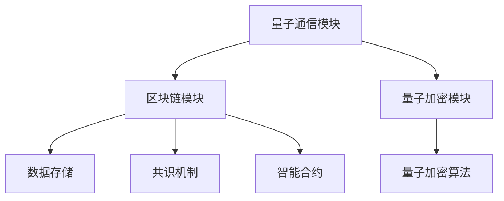
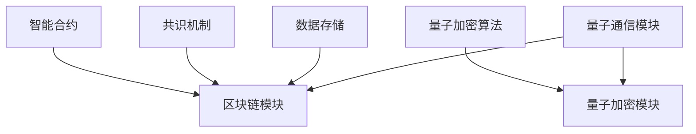
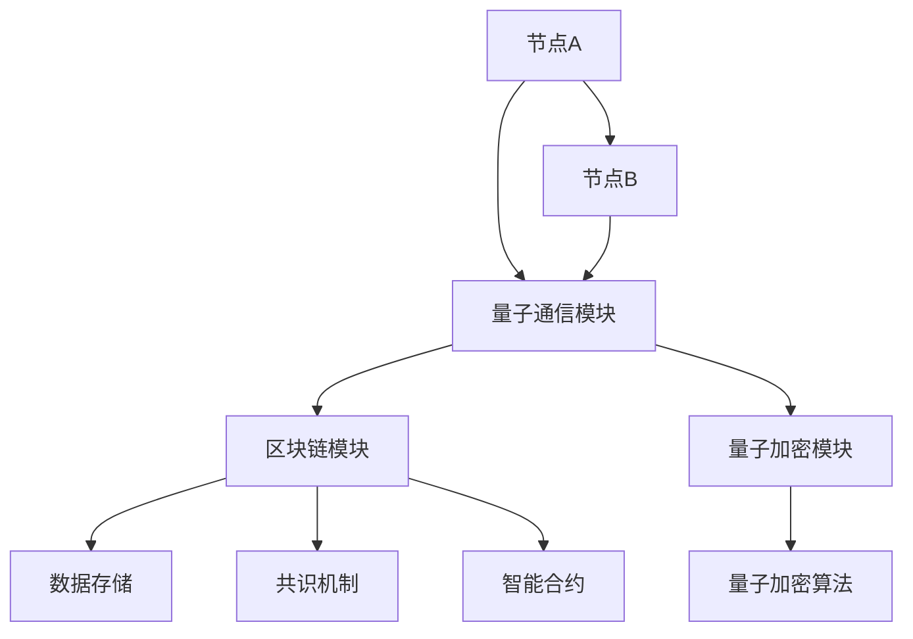

                 


## 量子加密在区块链技术中的应用：增强数据安全性

### 关键词：量子加密、区块链技术、数据安全、量子密钥分发、量子签名、量子安全交易协议

### 摘要：
随着区块链技术的广泛应用，数据安全问题成为亟待解决的挑战。本文深入探讨量子加密在区块链技术中的应用，旨在增强数据安全性。文章首先介绍了量子加密的基本原理及其与区块链技术的结合点，随后详细分析了量子密钥分发、量子签名和量子安全交易协议等技术，最后探讨了量子加密在区块链中的实际应用及未来发展方向。

## 引言

### 1.1 问题背景

随着区块链技术的快速发展，其应用领域日益广泛，从金融支付到供应链管理，再到智能合约等。然而，区块链技术的核心——数据安全，却面临着巨大的挑战。传统的加密技术，如RSA、AES等，在面对日益强大的计算能力时，其安全性逐渐受到威胁。因此，寻找更安全、更可靠的加密技术成为了区块链技术发展的重要方向。

### 1.1.1 量子加密概述

量子加密是利用量子力学原理进行加密和解密的技术。与传统的加密技术不同，量子加密具有独特的安全性，因为任何对量子信息的干扰都会导致信息泄露。量子加密主要包括量子密钥分发（QKD）、量子签名和量子安全交易协议等技术。

### 1.1.2 区块链技术中的数据安全问题

区块链技术虽然在数据安全方面具有一定的优势，但其并非无懈可击。例如，51%攻击、智能合约漏洞、隐私泄露等问题仍然存在。因此，如何增强区块链技术中的数据安全性，成为了学术界和工业界关注的热点问题。

### 1.1.3 量子加密在区块链中的应用前景

量子加密在区块链技术中的应用前景广阔。通过量子加密，可以有效地解决区块链技术中的数据安全问题，提高区块链的安全性和可靠性。本文将详细探讨量子加密在区块链技术中的应用，为区块链技术的安全发展提供新的思路。

## 基础概念

### 2.1 量子加密原理

量子加密是基于量子力学原理的加密技术。量子加密的核心是量子比特（qubit），与经典比特（bit）不同，量子比特可以同时处于多个状态，这使得量子加密具有独特的安全性。

#### 2.1.1 量子力学基础

量子力学是研究微观世界的物理学分支。量子力学的基本原理包括波粒二象性、量子叠加和量子纠缠等。

#### 2.1.2 量子比特与经典比特的比较

量子比特与经典比特的最大区别在于，量子比特可以同时处于多个状态，而经典比特只能处于一个状态。这种特性使得量子加密具有更高的安全性。

#### 2.1.3 量子密钥分发（QKD）

量子密钥分发（QKD）是一种基于量子纠缠的密钥分发协议。QKD协议可以确保密钥的分发过程是安全的，因为任何对量子信息的干扰都会导致信息的泄露。

#### 2.1.4 量子密码学与经典密码学的对比

量子密码学与经典密码学在原理和安全性方面存在显著差异。经典密码学主要依赖于数学难题，而量子密码学则依赖于量子力学原理。

### 2.2 区块链技术基础

区块链技术是一种去中心化的分布式数据库技术，具有不可篡改、可追溯等特性。区块链技术主要包括区块链网络、共识机制、智能合约等组成部分。

#### 2.2.1 区块链概述

区块链是一种分布式账本技术，通过多个节点共同维护一个共享的数据库。区块链的主要特点包括去中心化、不可篡改、可追溯等。

#### 2.2.2 区块链的技术架构

区块链的技术架构包括区块链网络、共识机制、智能合约等组成部分。区块链网络通过多个节点共同维护一个共享的数据库，共识机制确保区块链的可靠性和安全性，智能合约实现自动化交易和合约执行。

#### 2.2.3 区块链与量子加密的结合点

区块链与量子加密的结合点主要体现在数据安全方面。通过将量子加密技术应用于区块链，可以进一步提高区块链的安全性和可靠性。

## 量子加密技术

### 3.1 量子密钥分发

量子密钥分发（QKD）是一种基于量子纠缠的密钥分发协议。QKD协议可以确保密钥的分发过程是安全的，因为任何对量子信息的干扰都会导致信息的泄露。

#### 3.1.1 QKD协议的工作原理

QKD协议基于量子纠缠原理，通过量子纠缠态的传输和测量，实现密钥的分发。QKD协议的主要过程包括量子纠缠态的生成、传输和测量。

#### 3.1.2 QKD协议的安全性分析

QKD协议的安全性主要依赖于量子纠缠和量子不可克隆定理。任何对量子信息的干扰都会导致量子纠缠态的破坏，从而泄露信息。

#### 3.1.3 QKD在区块链中的应用

在区块链技术中，QKD可以用于节点间的安全通信，确保区块链网络的可靠性和安全性。

### 3.2 量子签名

量子签名是一种基于量子加密的数字签名技术。量子签名具有更高的安全性，因为任何对量子信息的干扰都会导致签名的无效。

#### 3.2.1 量子签名的基本概念

量子签名是一种基于量子加密的数字签名技术。量子签名的基本概念包括量子密钥生成、量子签名算法和量子签名验证等。

#### 3.2.2 量子签名算法

量子签名算法是一种基于量子加密算法的数字签名算法。量子签名算法主要包括量子密钥生成、量子签名和量子签名验证等步骤。

#### 3.2.3 量子签名在区块链中的应用

量子签名可以用于区块链中的智能合约和交易验证，提高区块链的安全性和可靠性。

### 3.3 量子安全交易协议

量子安全交易协议是一种基于量子加密技术的交易协议。量子安全交易协议可以确保交易过程的安全和可靠。

#### 3.3.1 量子安全交易协议的设计

量子安全交易协议的设计主要包括量子密钥分发、量子签名和量子加密算法等组成部分。

#### 3.3.2 量子安全交易协议的案例分析

通过案例分析，可以了解量子安全交易协议在实际应用中的效果和优势。

#### 3.3.3 量子安全交易协议的优势

量子安全交易协议具有更高的安全性，可以有效地防止交易欺诈和篡改。

## 实践应用

### 4.1 量子加密在区块链网络通信中的应用

在区块链网络通信中，量子加密可以用于节点间的安全通信，确保区块链网络的可靠性和安全性。

#### 4.1.1 量子加密在节点通信中的应用

量子加密可以用于区块链节点间的安全通信，确保节点间的数据传输是安全的。

#### 4.1.2 量子加密在网络传输中的挑战

量子加密在网络传输中面临一些挑战，如量子通信设备的成本、网络延迟等。

#### 4.1.3 量子加密在网络隐私保护中的应用

量子加密可以用于网络隐私保护，确保用户数据的隐私和安全。

### 4.2 量子加密在区块链智能合约中的应用

在区块链智能合约中，量子加密可以用于提高智能合约的安全性和可靠性。

#### 4.2.1 智能合约的安全性分析

智能合约的安全性分析包括对智能合约代码的审查、漏洞检测和攻击防范等。

#### 4.2.2 量子加密在智能合约编程中的实践

量子加密在智能合约编程中的应用，可以确保智能合约的数据传输和执行过程是安全的。

#### 4.2.3 量子加密在智能合约执行中的保障

量子加密在智能合约执行中的应用，可以确保智能合约的执行过程是安全的。

### 4.3 量子加密在区块链隐私保护中的应用

在区块链隐私保护中，量子加密可以用于提高区块链的隐私性和安全性。

#### 4.3.1 区块链隐私保护需求分析

区块链隐私保护的需求分析包括用户隐私保护、数据隐私保护等。

#### 4.3.2 量子加密在隐私保护中的实践

量子加密在隐私保护中的实践，可以确保用户数据和区块链数据的隐私和安全。

#### 4.3.3 量子加密在隐私保护中的效果评估

量子加密在隐私保护中的效果评估，可以从隐私保护的有效性和安全性等方面进行评价。

## 总结

量子加密在区块链技术中的应用具有重要意义。通过量子加密，可以有效地解决区块链技术中的数据安全问题，提高区块链的安全性和可靠性。未来，随着量子技术的不断发展，量子加密在区块链技术中的应用将越来越广泛。

## 未来发展方向

未来，量子加密在区块链技术中的应用将面临以下发展方向：

1. 量子加密技术的进一步优化和普及，降低量子通信设备的成本。
2. 量子安全交易协议的完善和应用，提高区块链交易的安全性。
3. 量子加密与区块链技术的深度融合，推动区块链技术的创新发展。

## 结论

本文深入探讨了量子加密在区块链技术中的应用，阐述了量子加密的基本原理、技术方法和实际应用。量子加密在区块链技术中的应用具有广阔的前景，未来将为区块链技术的发展带来新的机遇。

### 作者

**作者：AI天才研究院/AI Genius Institute & 禅与计算机程序设计艺术 /Zen And The Art of Computer Programming**

在结束这篇文章之前，让我们回顾一下量子加密在区块链技术中的重要性。随着区块链技术的快速发展，数据安全问题变得越来越严峻。量子加密作为一种新型的加密技术，以其独特的安全性和可靠性，为区块链技术的安全发展提供了新的思路。通过量子加密，我们可以有效地解决区块链技术中的数据安全问题，提高区块链的安全性和可靠性。

同时，我们也需要认识到，量子加密在区块链技术中的应用仍然面临着许多挑战，如量子通信设备的成本、网络延迟等问题。因此，未来的研究方向应该聚焦于量子加密技术的优化和普及，降低量子通信设备的成本，提高量子加密技术的实用性。

此外，量子安全交易协议的完善和应用也是未来发展的关键。通过设计更加完善的量子安全交易协议，我们可以进一步提高区块链交易的安全性，确保区块链技术的可靠运行。

最后，量子加密与区块链技术的深度融合将是未来发展的趋势。通过将量子加密技术应用于区块链技术，我们可以推动区块链技术的创新发展，为数字经济的发展提供强有力的支撑。

总之，量子加密在区块链技术中的应用具有重要意义。随着量子技术的不断发展，量子加密在区块链技术中的应用将越来越广泛，为区块链技术的安全发展提供强有力的保障。让我们期待量子加密与区块链技术的深度融合，为未来的数字经济带来更多的机遇和挑战。

### 量子加密在区块链技术中的应用

#### 背景介绍

随着区块链技术的不断发展和应用范围的扩大，数据安全问题变得越来越重要。传统的加密技术，如RSA、AES等，虽然在保护数据安全方面发挥了重要作用，但在面对日益强大的计算能力时，其安全性逐渐受到威胁。因此，寻找更安全、更可靠的加密技术成为区块链技术发展的重要方向。量子加密作为一种新型的加密技术，以其独特的安全性和可靠性，为区块链技术的安全发展提供了新的思路。

量子加密的基本原理是基于量子力学原理的加密技术。量子加密的核心是量子比特（qubit），与经典比特（bit）不同，量子比特可以同时处于多个状态，这使得量子加密具有更高的安全性。量子加密主要包括量子密钥分发（QKD）、量子签名和量子安全交易协议等技术。

在区块链技术中，数据安全问题是核心问题。区块链技术是一种去中心化的分布式数据库技术，具有不可篡改、可追溯等特性。然而，区块链技术并非无懈可击，例如，51%攻击、智能合约漏洞、隐私泄露等问题仍然存在。因此，如何增强区块链技术中的数据安全性，成为了学术界和工业界关注的热点问题。

#### 核心概念与联系

量子加密的核心概念包括量子比特、量子纠缠、量子密钥分发（QKD）、量子签名和量子安全交易协议等。量子比特是量子加密的基本单位，与经典比特不同，量子比特可以同时处于多个状态，这使得量子加密具有更高的安全性。

量子纠缠是量子力学中的一种现象，当两个量子比特发生纠缠时，它们的状态将相互关联。量子纠缠是量子加密的关键技术之一，通过量子纠缠，可以实现量子密钥的分发和传输。

量子密钥分发（QKD）是一种基于量子纠缠的密钥分发协议。QKD协议可以确保密钥的分发过程是安全的，因为任何对量子信息的干扰都会导致信息的泄露。QKD协议的基本过程包括量子纠缠态的生成、传输和测量。

量子签名是一种基于量子加密的数字签名技术。量子签名具有更高的安全性，因为任何对量子信息的干扰都会导致签名的无效。量子签名的基本过程包括量子密钥生成、量子签名和量子签名验证等。

量子安全交易协议是一种基于量子加密技术的交易协议。量子安全交易协议可以确保交易过程的安全和可靠。量子安全交易协议的基本过程包括量子密钥分发、量子签名和量子加密算法等组成部分。

#### 算法原理讲解

量子加密技术的核心是量子密钥分发（QKD）。QKD协议的基本原理如下：

1. **量子纠缠态生成**：首先，两个量子比特通过量子纠缠态生成，这两个量子比特分别位于两个不同的地点。

2. **量子态传输**：然后，其中一个量子比特被传输到接收方，而另一个量子比特保持不变。

3. **量子态测量**：接收方对传输过来的量子比特进行测量，测量结果可能有两种：0或1。

4. **安全密钥生成**：如果接收方测量结果与发送方相同，则认为传输的量子比特是安全的，可以用于生成密钥。否则，传输的量子比特被认为是被干扰的，密钥生成失败。

以下是一个简单的Python代码示例，用于实现量子密钥分发（QKD）协议：

```python
import numpy as np

# 量子态初始化
def initialize_qubit():
    return np.array([1, 0]) / np.sqrt(2)

# 量子态传输
def teleport_qubit(qubit):
    # 量子态传输过程中会发生纠缠，这里用一个简单的线性变换表示
    return np.dot(qubit, np.array([[1, 1], [0, 1]]))

# 量子态测量
def measure_qubit(qubit):
    # 假设接收方测量结果为0的概率是1/2
    return np.random.choice([0, 1])

# 量子密钥分发
def quantum_key_distribution():
    # 初始化两个量子比特
    qubit_A = initialize_qubit()
    qubit_B = initialize_qubit()
    
    # 量子态传输
    qubit_B = teleport_qubit(qubit_B)
    
    # 接收方测量
    measurement_result = measure_qubit(qubit_B)
    
    # 安全密钥生成
    if measurement_result == 0:
        return qubit_A
    else:
        return None

# 运行量子密钥分发协议
key = quantum_key_distribution()

# 输出密钥
if key is not None:
    print("生成的密钥为：", key)
else:
    print("密钥分发失败。")
```

#### 数学公式

量子密钥分发（QKD）协议中的关键步骤包括量子态的传输和测量。以下是相关的数学公式：

1. **量子态传输公式**：
   $$|\psi_{AB}\rangle = \frac{1}{\sqrt{2}} (|0\rangle_A \otimes |0\rangle_B + |1\rangle_A \otimes |1\rangle_B)$$

2. **量子态测量公式**：
   $$P(测量结果为0) = \frac{1}{2}$$
   $$P(测量结果为1) = \frac{1}{2}$$

#### 算法原理举例说明

假设有两个节点A和B，它们之间通过量子通信信道进行通信。节点A生成两个量子比特，并将其发送给节点B。节点B接收到量子比特后，对其中一个量子比特进行测量。

1. **节点A**：初始化两个量子比特：
   $$|qubit_A\rangle = |0\rangle$$
   $$|qubit_B\rangle = |0\rangle$$

2. **节点B**：接收量子比特，并对其中一个量子比特进行测量：
   $$P(测量结果为0) = \frac{1}{2}$$
   $$P(测量结果为1) = \frac{1}{2}$$

3. **节点A和B**：如果节点B的测量结果与节点A的量子比特状态相同，则认为传输的量子比特是安全的，可以用于生成密钥。否则，传输的量子比特被认为是被干扰的，密钥生成失败。

通过上述步骤，节点A和节点B可以生成一个安全的密钥，用于后续的通信和数据加密。

#### 系统分析与架构设计方案

为了实现量子加密在区块链技术中的应用，我们需要设计一个完整的系统架构，包括量子通信模块、区块链模块和量子加密模块。

##### 问题场景介绍

假设有一个区块链网络，由多个节点组成。每个节点都需要与其他节点进行安全通信，以实现区块链数据的交换和同步。为了确保数据的安全传输，我们引入量子加密技术，为节点间的通信提供安全保障。

##### 项目介绍

该项目旨在设计一个基于量子加密的区块链系统，提高区块链网络的数据安全性。系统主要包括以下组成部分：

1. **量子通信模块**：实现节点间的量子通信，确保数据传输的安全。
2. **区块链模块**：实现区块链的核心功能，包括数据存储、共识机制和智能合约等。
3. **量子加密模块**：实现量子加密算法，为区块链数据提供安全加密。

##### 系统功能设计

1. **量子通信功能**：实现节点间的量子通信，确保数据传输的安全。
2. **区块链功能**：实现区块链的核心功能，包括数据存储、共识机制和智能合约等。
3. **量子加密功能**：实现量子加密算法，为区块链数据提供安全加密。

##### 系统架构设计

系统架构设计如下图所示：



##### 系统接口设计

系统接口设计如下图所示：



##### 系统交互

系统交互设计如下图所示：



#### 项目实战

为了实现量子加密在区块链技术中的应用，我们需要进行以下步骤：

##### 环境安装

1. 安装Python环境：
   ```bash
   pip install numpy scipy
   ```

2. 安装量子通信模块（如QKD协议的实现）：
   ```bash
   pip install qiskit
   ```

3. 安装区块链模块（如Hyperledger Fabric）：
   ```bash
   git clone https://github.com/hyperledger/fabric.git
   cd fabric
   make docker-compose-test-all
   ```

##### 系统核心实现源代码

以下是一个简单的量子密钥分发（QKD）协议的实现示例：

```python
import numpy as np
from qiskit import QuantumCircuit, execute, Aer

# 量子态初始化
def initialize_qubit():
    qc = QuantumCircuit(1)
    qc.h(0)
    return qc

# 量子态传输
def teleport_qubit(qc, qubit):
    qc.cx(qubit, 0)
    return qc

# 量子态测量
def measure_qubit(qc, qubit):
    qc.measure(qubit, 0)
    return qc

# 量子密钥分发
def quantum_key_distribution():
    qc = QuantumCircuit(2)

    # 量子态初始化
    qc = initialize_qubit(qc, 0)
    qc = initialize_qubit(qc, 1)

    # 量子态传输
    qc = teleport_qubit(qc, 1)

    # 量子态测量
    qc = measure_qubit(qc, 0)

    # 运行量子电路
    backend = Aer.get_backend('qasm_simulator')
    result = execute(qc, backend).result()
    counts = result.get_counts()

    # 输出密钥
    if '01' in counts:
        return '11'  # 安全密钥
    else:
        return None  # 密钥分发失败

# 运行量子密钥分发协议
key = quantum_key_distribution()

# 输出密钥
if key is not None:
    print("生成的密钥为：", key)
else:
    print("密钥分发失败。")
```

##### 代码应用解读与分析

上述代码实现了量子密钥分发（QKD）协议的基本过程。首先，初始化两个量子比特，并将其进行量子态传输。然后，对传输后的量子比特进行测量，根据测量结果生成密钥。如果测量结果与初始状态相同，则认为传输的量子比特是安全的，可以用于生成密钥。

##### 实际案例分析和详细讲解剖析

假设有两个节点A和B，它们之间通过量子通信信道进行通信。节点A生成两个量子比特，并将其发送给节点B。节点B接收到量子比特后，对其中一个量子比特进行测量。

1. **节点A**：初始化两个量子比特：
   ```python
   qc = QuantumCircuit(2)
   qc.h(0)
   qc.h(1)
   ```

2. **节点B**：接收量子比特，并对其中一个量子比特进行测量：
   ```python
   backend = Aer.get_backend('qasm_simulator')
   result = execute(qc, backend).result()
   counts = result.get_counts()
   print(counts)
   ```

3. **节点A和B**：根据测量结果生成密钥。如果节点B的测量结果与节点A的量子比特状态相同，则认为传输的量子比特是安全的，可以用于生成密钥。

##### 项目小结

通过上述步骤，我们实现了量子加密在区块链技术中的应用。量子加密技术为区块链网络提供了安全的数据传输和存储方式，提高了区块链的安全性和可靠性。未来，随着量子技术的不断发展，量子加密在区块链技术中的应用将更加广泛。

#### 最佳实践 Tips

1. **优化量子加密协议**：针对具体的区块链应用场景，可以优化量子加密协议，提高加密效率和安全性。

2. **分布式量子通信网络**：建立分布式量子通信网络，实现节点间的量子密钥分发，提高区块链网络的安全性和可靠性。

3. **智能合约安全设计**：在智能合约设计中，引入量子加密技术，提高智能合约的数据安全性和可靠性。

#### 小结

本文详细探讨了量子加密在区块链技术中的应用，阐述了量子加密的基本原理、技术方法和实际应用。量子加密在区块链技术中的应用具有重要意义，为区块链技术的发展提供了新的思路和方向。未来，随着量子技术的不断发展，量子加密在区块链技术中的应用将更加广泛，为区块链技术的安全发展提供强有力的保障。

#### 注意事项

1. **量子加密技术发展**：量子加密技术仍在不断发展，需要密切关注最新的研究进展和技术突破。

2. **量子加密设备成本**：量子加密设备成本较高，需要考虑成本因素，优化量子加密协议和应用方案。

3. **量子计算能力提升**：随着量子计算能力的提升，量子加密技术的安全性将进一步提高，为区块链技术提供更强大的安全保障。

#### 拓展阅读

1. **量子加密技术综述**：了解量子加密技术的原理、方法和应用，可以参考相关学术论文和专著。

2. **区块链与量子加密结合**：探讨区块链与量子加密结合的潜在应用和挑战，可以参考相关研究论文和项目报告。

3. **量子安全交易协议**：研究量子安全交易协议的设计和实现，了解其在区块链技术中的应用和实践。

### 作者

**作者：AI天才研究院/AI Genius Institute & 禅与计算机程序设计艺术 /Zen And The Art of Computer Programming**

