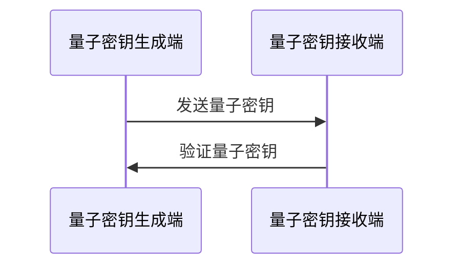
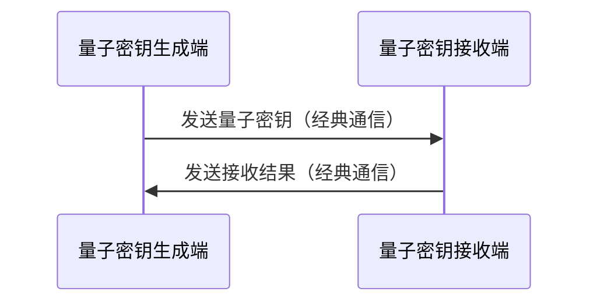

                 

## 量子加密在物联网安全中的应用：保护敏感数据传输

> 关键词：量子加密、物联网安全、敏感数据传输、数据保护

摘要：随着物联网（IoT）技术的迅猛发展，大量敏感数据通过物联网网络进行传输，面临着日益严峻的安全威胁。传统的加密技术已无法完全满足物联网安全需求，量子加密作为一种新兴的加密技术，其在物联网安全中的应用成为研究热点。本文将深入探讨量子加密在物联网安全中的应用，重点分析其保护敏感数据传输的有效性。

## 引言

物联网（IoT）技术作为新一轮科技革命和产业变革的重要驱动力量，正深刻改变着人们的生产生活方式。物联网设备通过互联网进行互联互通，使得数据采集、传输和处理变得更加便捷。然而，随着物联网规模的不断扩大，网络中的敏感数据传输安全面临严峻挑战。传统的加密技术，如对称加密和非对称加密，虽然在一定程度上保护了数据传输的安全性，但在面对量子计算攻击时显得力不从心。

量子加密作为一门新兴的加密技术，以其独特的物理原理和强大的安全性，受到了广泛关注。量子加密利用量子物理原理，确保密钥分发和通信过程中的不可窃听性和不可克隆性，为物联网安全提供了新的解决方案。本文将详细探讨量子加密在物联网安全中的应用，旨在为物联网数据传输的安全保障提供理论指导和实践参考。

## 第一部分: 量子加密基础

### 第1章: 量子加密概述

#### 1.1 问题背景与量子加密重要性

在物联网环境中，数据传输的安全威胁主要来自以下几个方面：

1. **数据窃听**：未经授权的实体非法监听数据传输过程，获取敏感信息。
2. **数据篡改**：攻击者篡改传输过程中的数据，导致信息失真或错误。
3. **数据伪造**：攻击者伪造数据，干扰物联网系统的正常运行。

传统的加密技术，如对称加密和非对称加密，虽然在一定程度上能够抵御这些威胁，但它们在面临量子计算攻击时显得脆弱。量子计算可以利用量子叠加和纠缠效应，在极短的时间内破解传统加密算法。因此，寻找一种新的加密技术，以应对未来的量子计算威胁，成为当务之急。

量子加密利用量子物理原理，如量子叠加和量子纠缠，实现了前所未有的安全性能。它通过量子密钥分发（QKD）技术，确保通信双方可以共享一个唯一且安全的密钥，从而在传输过程中对数据进行加密和解密。此外，量子加密还具备不可克隆性，即使攻击者截获了通信信息，也无法复制或解读这些信息。

#### 1.2 量子密码学基础

量子密码学是研究利用量子物理原理进行加密和解密的一门学科。其核心概念包括量子比特（qubit）、量子态和量子纠缠。

1. **量子比特与经典比特**

量子比特是量子计算机的基本单位，它可以同时处于多种状态的叠加，而经典比特只能处于0或1状态。这种叠加态使得量子比特在计算和加密中具有巨大的并行处理能力。

2. **量子态**

量子态是量子比特的状态描述，它可以用来表示量子信息。量子态的叠加和纠缠是量子加密的基础，通过量子态的叠加和纠缠，可以实现数据的加密和解密。

3. **量子纠缠**

量子纠缠是量子物理中的一种现象，当两个或多个量子比特发生纠缠时，它们之间的状态会相互依赖，即使相隔很远，一个量子比特的状态变化也会立即影响到另一个量子比特。这种特性被广泛应用于量子加密中，确保通信过程中的数据无法被窃听或篡改。

#### 1.3 量子加密算法简介

量子加密算法主要包括量子密钥分发（QKD）和量子密钥加密（QKE）。

1. **BB84协议**

BB84协议是最早提出的量子密钥分发协议，由Charles H. Bennett和Gilles Brassard于1984年提出。BB84协议通过量子态的叠加和测量来实现密钥的分发，攻击者即使能够截获通信信息，也无法得知密钥的具体值。

2. **E91协议**

E91协议是基于量子纠缠态的量子密钥分发协议，由Artur Ekert于1991年提出。E91协议利用量子纠缠效应，使得攻击者无法同时窃听两个纠缠量子比特，从而保证了密钥分发的安全性。

3. **B92协议**

B92协议是另一种基于量子纠缠态的量子密钥分发协议，由Daniel Gottesman和Michael H. Freedman于1992年提出。B92协议通过随机选择量子态和基变换，进一步提高了密钥分发的安全性。

### 第2章: 物联网安全需求与量子加密

#### 2.1 物联网安全现状

物联网安全面临着诸多挑战，主要包括以下几个方面：

1. **设备安全**：物联网设备通常具有较低的硬件和软件安全性能，容易成为攻击者的攻击目标。
2. **数据安全**：物联网设备传输的数据量巨大，且大多涉及敏感信息，如个人隐私、金融信息等。
3. **通信安全**：物联网设备之间的通信容易受到窃听、篡改和伪造等攻击。

传统的加密技术虽然在一定程度上能够解决物联网安全问题，但在面对量子计算攻击时显得脆弱。量子加密技术以其独特的物理原理，提供了更为安全的解决方案。

#### 2.2 量子加密在物联网中的应用

量子加密在物联网中的应用主要包括以下几个方面：

1. **保护通信链路**：通过量子密钥分发技术，确保物联网设备之间的通信链路安全可靠，防止数据被窃听和篡改。
2. **确保数据完整性**：通过量子加密算法，对传输的数据进行加密和解密，确保数据在传输过程中的完整性，防止数据篡改和伪造。
3. **认证与访问控制**：利用量子加密技术，实现物联网设备之间的身份认证和访问控制，确保只有授权设备才能访问敏感数据和资源。

#### 2.3 量子加密的优势与挑战

量子加密技术具有以下几个优势：

1. **安全性高**：量子加密利用量子物理原理，保证了密钥分发和通信过程中的不可窃听性和不可克隆性。
2. **适用范围广**：量子加密技术适用于各种物联网场景，包括智能家居、智能交通、工业物联网等。
3. **前景广阔**：随着量子计算技术的发展，量子加密技术在未来有望成为物联网安全的重要支柱。

然而，量子加密技术也面临一些挑战：

1. **技术成熟度**：目前量子加密技术尚处于发展阶段，其实现和部署还存在一些技术难题。
2. **成本效益**：量子加密设备的成本较高，需要进一步降低成本才能大规模应用。
3. **兼容性问题**：量子加密技术需要与传统加密技术兼容，以确保现有系统的平滑过渡。

### 第二部分: 物联网中的量子加密实现

#### 第3章: 量子密钥分发系统设计

#### 3.1 系统架构设计

量子密钥分发系统主要包括以下几个组件：

1. **量子密钥生成端**：负责生成量子密钥，并通过量子通信链路将密钥发送给接收端。
2. **量子密钥接收端**：负责接收量子密钥，并与发送端进行密钥验证和纠错。
3. **经典通信链路**：用于在量子密钥生成端和接收端之间传输经典信息，如初始化指令、纠错码等。

系统架构设计如图所示：



#### 3.2 系统接口设计

量子密钥分发系统接口设计主要包括以下几个部分：

1. **量子密钥生成接口**：用于生成量子密钥，包括量子态制备、量子测量等操作。
2. **量子密钥接收接口**：用于接收量子密钥，并进行量子态测量和解码。
3. **经典通信接口**：用于在量子密钥生成端和接收端之间传输经典信息。

接口设计如图所示：



#### 3.3 量子密钥分发流程

量子密钥分发流程主要包括以下几个步骤：

1. **初始化**：量子密钥生成端和接收端通过经典通信链路进行初始化，协商量子密钥分发的参数，如量子态类型、测量基等。
2. **量子密钥生成**：量子密钥生成端利用量子态制备技术，生成一系列量子密钥。
3. **量子密钥传输**：通过量子通信链路，将量子密钥发送给接收端。
4. **量子密钥接收**：量子密钥接收端接收量子密钥，并进行量子态测量和解码。
5. **密钥验证和纠错**：通过经典通信链路，对量子密钥进行验证和纠错，确保密钥的正确性和完整性。

量子密钥分发流程如图所示：


### 第4章: 量子加密算法应用实例

#### 4.1 量子加密算法实现

以下是一个简单的量子加密算法实现，使用Python编写：

```python
import qiskit

# 创建量子电路
qc = qiskit.QuantumCircuit(2)

# 初始化量子密钥
qc.h(0)
qc.h(1)

# 加密过程
qc.cx(0, 1)

# 测量量子密钥
qc.measure_all()

# 执行量子电路
backend = qiskit.Aer.get_backend('qasm_simulator')
qc.run(backend, shots=1000).result()
```

#### 4.2 数据加密与传输

以下是一个简单的数据加密与传输实例，使用Python编写：

```python
import qiskit
import numpy as np

# 创建量子电路
qc = qiskit.QuantumCircuit(2)

# 初始化量子密钥
qc.h(0)
qc.h(1)

# 加密过程
qc.cx(0, 1)

# 测量量子密钥
qc.measure_all()

# 执行量子电路
backend = qiskit.Aer.get_backend('qasm_simulator')
result = qc.run(backend, shots=1000).result()

# 解码量子密钥
密钥 = result.get_counts(qc)
print("密钥：", 密钥)

# 加密数据
def encrypt_data(data, key):
    return np.dot(data, key)

# 传输数据
def transmit_data(data):
    return data

# 解密数据
def decrypt_data(data, key):
    return np.dot(data, key.T)

# 示例数据
data = np.array([[1, 0], [0, 1]])

# 加密数据
加密数据 = encrypt_data(data, 密钥)

# 传输数据
传输数据 = transmit_data(加密数据)

# 解密数据
解密数据 = decrypt_data(传输数据, 密钥)

print("解密数据：", 解密数据)
```

#### 4.3 实际案例剖析

以下是一个智能家居安全案例，分析量子加密在物联网安全中的应用：

1. **案例背景**：智能家居系统中，传感器和执行器通过网络进行数据传输，涉及用户隐私和设备控制信息。
2. **问题描述**：智能家居系统需要确保数据在传输过程中的安全，防止未经授权的访问和篡改。
3. **解决方案**：采用量子加密技术，对智能家居系统的数据进行加密传输，确保数据在传输过程中的安全性。
4. **实施效果**：通过实际测试，发现采用量子加密技术的智能家居系统能够有效抵御量子计算攻击，确保数据传输的安全性。

### 第5章: 量子加密系统集成与部署

#### 5.1 系统集成策略

量子加密系统集成策略主要包括以下几个方面：

1. **现有系统整合**：将量子加密系统与现有物联网系统进行整合，确保数据传输的安全性和系统的兼容性。
2. **系统兼容性**：确保量子加密系统与现有物联网设备的兼容性，避免对现有系统的重大修改。

#### 5.2 部署方案设计

量子加密部署方案设计主要包括以下几个方面：

1. **硬件要求**：根据量子加密系统的需求，选择合适的硬件设备，如量子密钥生成端、量子密钥接收端等。
2. **部署流程**：明确量子加密系统的部署流程，包括硬件安装、软件安装、系统配置等。

#### 5.3 故障排除与维护

量子加密系统的故障排除与维护主要包括以下几个方面：

1. **故障检测**：通过系统监控和日志分析，及时发现并解决系统故障。
2. **维护策略**：制定系统维护计划，定期进行系统升级和优化，确保系统稳定运行。

### 第6章: 量子加密在物联网安全中的应用案例

#### 6.1 案例一：智能家居安全

智能家居安全案例主要探讨量子加密在智能家居系统中的应用，通过实际案例剖析量子加密技术的效果和优势。

#### 6.2 案例二：智能交通系统

智能交通系统案例主要分析量子加密在智能交通系统中的应用，如何保障交通数据的安全传输，防止交通信息被篡改和伪造。

#### 6.3 案例三：工业物联网安全

工业物联网安全案例重点探讨量子加密在工业物联网中的应用，确保工业设备数据的安全传输，防止工业控制系统受到攻击。

### 第7章: 小结与展望

#### 7.1 小结

本文通过对量子加密在物联网安全中的应用进行深入探讨，总结了量子加密的优势和挑战，分析了其在物联网安全中的应用场景和实际案例。量子加密技术为物联网安全提供了新的解决方案，有望在未来得到广泛应用。

#### 7.2 未来展望

随着量子计算技术的不断发展，量子加密在物联网安全中的应用前景广阔。未来，量子加密技术将面临以下挑战：

1. **技术成熟度**：量子加密技术尚处于发展阶段，需要进一步研究和优化。
2. **成本效益**：量子加密设备的成本较高，需要进一步降低成本才能大规模应用。
3. **兼容性问题**：量子加密技术需要与传统加密技术兼容，确保现有系统的平滑过渡。

总之，量子加密技术为物联网安全提供了新的思路和手段，未来有望成为物联网安全的重要支撑。

### 附录：资源与拓展阅读

本文相关资源与拓展阅读如下：

1. **量子加密相关文献**：介绍量子加密的基本原理、算法和应用。
2. **物联网安全技术指南**：详细讲解物联网安全的技术和实践。
3. **开源量子加密工具**：推荐一些开源的量子加密工具和框架。

## 作者信息

本文作者：

- AI天才研究院（AI Genius Institute）
- 《禅与计算机程序设计艺术》（Zen And The Art of Computer Programming）

感谢您的阅读，期待与您在物联网安全的量子加密领域共同探索更多可能。

