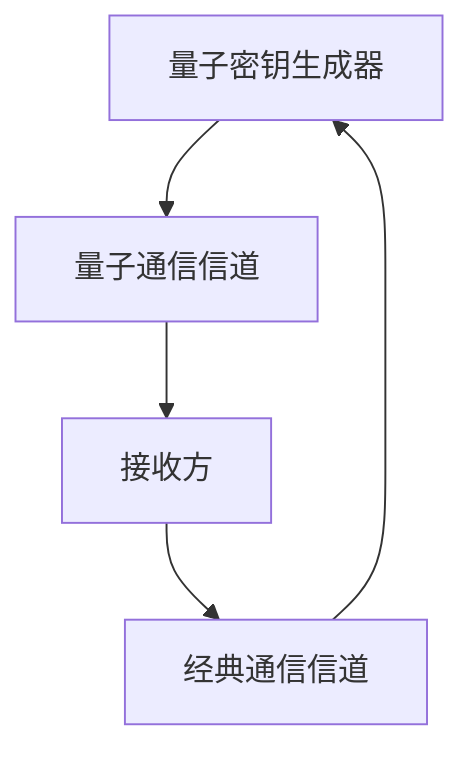
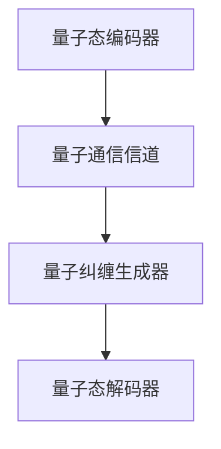

                 

### 引言：量子技术与IT安全的交汇

在当今数字化时代，企业的IT安全面临着前所未有的挑战。传统的IT安全措施，如防火墙、加密和入侵检测系统，虽然在一定程度上保障了信息系统的安全，但面对日益复杂的网络威胁和不断演进的攻击技术，这些措施已经显得力不从心。特别是在量子计算技术崛起的背景下，传统安全策略的局限性更加凸显。

量子技术的崛起主要源于其在信息处理和传输方面的巨大潜力。量子计算机通过量子比特（qubit）实现了超乎经典比特（bit）的能力，可以在极短时间内解决某些复杂的计算问题。此外，量子密码学的发展，如量子密钥分发（QKD），为数据加密提供了更为安全的手段。这些技术不仅改变了传统计算机科学的格局，也对IT安全领域产生了深远的影响。

然而，量子技术的崛起同样带来了新的安全挑战。量子计算机可能破解现有的加密算法，使得许多依赖传统加密技术保护的数据和系统面临风险。此外，量子攻击（如量子拦截与重放攻击）可能突破现有的网络安全防线。为了应对这些挑战，企业需要建立全新的量子安全意识，将量子技术融入IT安全策略中，从而构建更加坚固的安全体系。

本篇文章旨在探讨量子安全意识在企业IT安全策略中的重要性，分析量子技术的核心概念和原理，介绍量子安全技术的应用场景，并提出实现量子安全意识的策略与措施。通过一步步的分析和推理，我们希望能够为企业提供一条清晰、有效的量子安全之路。

### 量子技术的崛起：从基础理论到实际应用

量子技术之所以能够引起广泛关注，源于其基于量子力学的基本原理。量子力学是20世纪初发展起来的一门物理学分支，它揭示了微观世界中物质和能量行为的奇异特性。这些特性与传统经典物理学有显著不同，为量子技术的诞生奠定了理论基础。

#### 量子力学的基本概念

量子力学中的两个核心概念是量子比特和量子叠加态。与经典比特只能处于0或1两种状态不同，量子比特（qubit）可以同时处于0和1的叠加状态，这一特性被称为叠加态。例如，一个量子比特可以同时表示0和1，而两个量子比特可以同时表示 \(2^2 = 4\) 种状态，三个量子比特可以表示 \(2^3 = 8\) 种状态，以此类推。这种叠加态使得量子计算机在处理复杂数学问题时具有巨大的并行计算能力。

另一个重要概念是量子纠缠。量子纠缠是两个或多个量子比特之间的一种特殊关联，即使这些量子比特相隔很远，它们的状态也会相互影响。当其中一个量子比特的状态发生改变时，与之纠缠的量子比特的状态也会立即改变。这种量子纠缠特性在量子计算和量子通信中具有重要作用。

#### 量子门与量子运算

量子计算机的基本操作单元是量子门（quantum gate），类似于经典计算机中的逻辑门。量子门是一种线性变换，可以对量子比特进行旋转或交换操作。常见的量子门包括保罗门（Pauli gate）、控制非门（CNOT gate）和希尔伯特变换（Hadamard gate）等。通过组合这些量子门，可以实现各种复杂的量子运算。

量子运算与经典运算的最大区别在于其并行性和非确定性。在量子计算中，多个运算可以同时进行，因为量子比特可以处于多种状态的叠加。此外，量子计算的非确定性意味着某些量子运算的结果不是确定的，而是具有概率分布。这种非确定性使得量子计算机在某些任务上具有显著优势，例如因数分解和搜索问题。

#### 量子计算原理简介

量子计算机的工作原理可以概括为以下几个步骤：

1. **初始化**：将量子比特初始化为特定的叠加态。
2. **量子运算**：通过量子门和量子电路，对量子比特进行一系列操作。
3. **测量**：对量子比特进行测量，得到一个具体的量子态，从而获得计算结果。

量子算法与经典算法的差异主要体现在并行性和非确定性上。例如，Shor算法是一个著名的量子算法，它可以高效地分解大整数，而这是经典计算机难以实现的。Deutsh-Josza算法则展示了量子计算机在决策问题上的优势。此外，量子随机游走算法在社交网络分析和物理系统中也展现出巨大的潜力。

通过以上分析，我们可以看到量子技术从基础理论到实际应用的发展脉络。量子计算和量子密码学的崛起不仅为传统计算机科学带来了革命性的变化，也为IT安全领域带来了新的机遇和挑战。理解量子力学的基本概念和量子计算原理，是深入探讨量子安全意识的重要前提。

### IT安全面临的挑战：传统安全措施的局限性

随着信息技术的飞速发展，企业面临着日益复杂的网络安全威胁。传统IT安全措施，如防火墙、加密和入侵检测系统，虽然在一定程度上能够保护企业信息系统，但在面对量子计算技术带来的新挑战时，其局限性逐渐显现。

首先，传统加密技术的基础是经典密码学，如RSA加密算法和DES加密算法。这些算法依赖于大整数的因数分解难题和离散对数问题，而量子计算机可以通过其强大的计算能力在极短时间内破解这些加密算法。Shor算法就是一个典型的例子，它利用量子计算机的并行性和非确定性，可以在多项式时间内分解大整数，从而破坏依赖这些算法的数据和系统的安全性。

其次，传统防火墙和入侵检测系统主要依赖预先定义的安全规则和签名来识别和阻止恶意流量。然而，量子攻击，如量子拦截与重放攻击，可以通过测量和干扰量子比特的状态，突破传统的网络安全防线。这种攻击方式不仅难以通过传统的防火墙和入侵检测系统检测，还可能对系统造成不可逆的破坏。

此外，网络威胁的多样性和复杂性也在不断增加。传统的IT安全措施往往依赖于单一的防御手段，而现代攻击者可以采用多种攻击手段，如钓鱼、勒索软件、中间人攻击等，同时或先后实施。这些攻击手段往往具有高度的隐蔽性和变异性，使得传统的安全措施难以应对。

综上所述，传统IT安全措施在面对量子计算技术带来的挑战时，显现出明显的局限性。为了确保企业信息系统的安全性，企业需要建立全新的量子安全意识，采用量子安全技术来弥补传统安全措施的不足，从而构建更加坚固的网络安全防线。

### 量子安全意识：企业IT安全的革新视角

量子安全意识是企业应对量子计算技术带来的新挑战所必须具备的一种安全理念。它不仅关注传统IT安全措施的技术实施，更强调从战略层面构建企业的全面安全体系，以应对未来的安全威胁。量子安全意识的核心理念在于将量子技术的优势融入企业IT安全策略，从而提升整体安全防护能力。

首先，量子安全意识的建立需要企业对量子技术有深刻的理解和认识。企业应当了解量子力学的基本概念，如量子比特、叠加态和量子纠缠，以及量子计算和量子密码学的原理和应用。通过这些理解，企业可以更好地设计出符合量子安全要求的系统架构和加密方案。

其次，量子安全意识要求企业在战略规划中充分考虑量子技术的潜在影响。在制定IT安全策略时，企业不仅要关注现有的网络威胁，还需预测未来可能出现的量子攻击，并制定相应的应对措施。例如，引入量子密钥分发（QKD）技术，确保通信渠道的安全；采用量子加密算法，提升数据的保密性和完整性。

再次，量子安全意识要求企业在组织文化中培育安全意识。通过定期的安全培训和宣传，提高员工对量子安全重要性的认识，确保全体员工都能参与到量子安全文化建设中来。此外，企业还应建立量子安全团队，负责监控和响应量子安全事件，确保企业能够快速有效地应对各种安全挑战。

最后，量子安全意识需要企业建立长期的技术研发和投资规划。量子技术尚处于发展阶段，企业应积极跟进相关技术的研究和应用，保持技术竞争力。同时，企业还需与其他行业和企业进行合作，共同推进量子安全技术的发展，构建一个更加安全可靠的数字生态系统。

通过量子安全意识的建立，企业能够在传统IT安全措施的基础上，形成多层次、多维度的安全防护体系，从而应对量子计算带来的新挑战。量子安全意识不仅是一种技术手段，更是一种战略思维，是企业迈向未来数字化安全的重要保障。

### 本书结构与主要内容概述

本篇文章将从多个维度深入探讨量子安全意识在企业IT安全中的应用。文章的结构如下：

首先，第1章作为引言，介绍了量子技术与IT安全之间的交汇，分析了量子技术崛起所带来的新挑战，并阐述了量子安全意识的重要性。

第2章将深入探讨量子基础理论，包括量子力学的基本概念、量子计算原理和量子密码学基础，为后续章节的讨论打下理论基础。

第3章将重点分析量子安全意识在企业IT安全中的应用，探讨量子安全技术在数据安全、网络安全和系统安全等多个领域的实际应用场景。

第4章将讨论实现量子安全意识的策略与措施，从构建量子安全文化、技术层面和法规与合规性三个角度，为企业提供全面的量子安全解决方案。

第5章将分析量子安全技术的挑战与未来展望，探讨量子技术发展过程中面临的问题以及未来的发展趋势。

第6章将分享量子安全意识的最佳实践，通过成功案例和实践小贴士，为读者提供具体可行的实施建议。

最后，第7章将对全文进行小结，回顾量子安全意识的核心观点，并提出未来量子安全发展的建议。

通过以上章节的逐步探讨，我们希望能够为企业提供一条清晰、有效的量子安全之路，帮助企业在量子技术的浪潮中建立坚实的安全防线。

### 第2章 量子基础理论

量子基础理论是理解量子安全技术的关键。本章将深入探讨量子力学的基本概念、量子计算原理以及量子密码学基础。

#### 2.1 量子力学的基本概念

量子力学是描述微观世界现象的物理学分支。它揭示了物质和能量在微观尺度上的行为，与我们日常生活中的经典物理学有显著不同。

**量子比特与经典比特的对比**

在经典计算机中，信息的基本单元是比特（bit），它只能处于两种状态之一：0或1。而在量子计算机中，信息的基本单元是量子比特（qubit），它可以同时处于0和1的叠加状态。这种叠加态使得量子比特能够同时处理大量信息，从而实现高速计算。

| 特性       | 量子比特          | 经典比特          |
|------------|-------------------|-------------------|
| 状态       | 可叠加（0和1的叠加状态） | 确定状态（只能是0或1） |
| 表示方法   | \(|\psi\rangle = a|0\rangle + b|1\rangle\) | {0, 1} |
| 并行计算   | 可以同时处理多个状态 | 只能处理单一状态   |

**量子叠加态与量子纠缠**

量子叠加态是量子力学中的一个核心概念。一个量子比特可以同时处于0和1的叠加状态，例如 \(|\psi\rangle = \frac{1}{\sqrt{2}}(|0\rangle + |1\rangle)\)。当多个量子比特叠加时，系统的状态可以表示为多个基态的线性组合。

量子纠缠是另一个重要概念，它描述了两个或多个量子比特之间的特殊关联。即使这些量子比特相隔很远，它们的状态也会相互影响。当其中一个量子比特的状态发生改变时，与之纠缠的量子比特的状态也会立即改变。

**量子门与量子运算**

量子计算机的基本操作单元是量子门（quantum gate），它对量子比特进行线性变换。常见的量子门包括保罗门（Pauli gate）、控制非门（CNOT gate）和希尔伯特变换（Hadamard gate）等。通过组合这些量子门，可以实现复杂的量子运算。

#### 2.2 量子计算原理简介

量子计算机通过量子比特和量子门的相互作用，实现了传统计算机难以实现的高速计算。以下是几种重要的量子算法及其与传统算法的差异：

**Shor算法**

Shor算法是一个著名的量子算法，它可以高效地分解大整数。对于大整数 \(N\)，Shor算法可以在多项式时间内找到其因子，而这是传统计算机难以实现的。Shor算法利用量子并行性和量子纠缠特性，通过量子运算和测量，实现了因数分解的突破。

**Deutsh-Josza算法**

Deutsh-Josza算法展示了量子计算机在决策问题上的优势。它能够在多项式时间内解决某些决策问题，而传统计算机需要指数时间。这个算法通过量子叠加态和量子纠缠，实现了高效的决策过程。

**量子随机游走算法**

量子随机游走算法在社交网络分析和物理系统中展现出巨大的潜力。它利用量子计算机的并行性和非确定性，实现了高效的随机游走过程，从而提升了数据处理和分析的效率。

#### 2.3 量子密码学基础

量子密码学是利用量子力学原理进行数据加密的一门学科。它提供了一种更为安全的数据加密方法，特别是量子密钥分发（QKD）。

**量子密钥分发（QKD）**

量子密钥分发是一种基于量子力学原理的密钥分发方法。它通过量子通信信道，将密钥信息传输给双方，确保密钥的安全性和隐私性。QKD利用量子态的测量不可克隆特性，即使窃听者试图窃取密钥信息，也会导致量子态的破坏，从而被检测到。

**量子密码学协议**

量子密码学还包括一系列量子加密协议，如量子隐形传态和量子密码共享。这些协议利用量子纠缠和量子态的叠加特性，实现了安全可靠的数据传输。

**量子加密算法**

量子加密算法利用量子比特和量子态的叠加特性，实现了更为复杂和安全的加密过程。例如，量子随机加密算法（QRA）和量子密钥加密算法（QKE）等，提供了强大的加密手段，有效抵抗量子攻击。

通过以上对量子基础理论的探讨，我们可以看到量子技术的独特优势以及其在计算和通信领域的潜力。这些理论基础不仅为量子安全技术的应用提供了可能，也为企业构建量子安全体系提供了坚实的理论支持。

### 量子计算原理与量子算法

量子计算与经典计算在原理上有本质的不同，其核心在于量子比特（qubit）的独特性质。量子比特不仅能表示0或1，还能同时处于这两个状态的叠加，这一特性使得量子计算具有并行性和非确定性。以下，我们将详细探讨量子计算的基本原理以及几种重要的量子算法。

#### 量子比特与经典比特的对比

在经典计算机中，信息以比特（bit）为单位进行存储和传输。比特只能处于两种状态之一：0或1。而量子比特（qubit）则利用量子力学中的叠加态，可以同时处于0和1的状态。这种叠加态使得量子比特能够同时处理大量信息。例如，一个量子比特可以表示 \(2\) 种状态，而两个量子比特可以表示 \(2^2 = 4\) 种状态，三个量子比特可以表示 \(2^3 = 8\) 种状态，以此类推。这种并行处理能力是传统计算机难以比拟的。

| 特性       | 量子比特          | 经典比特          |
|------------|-------------------|-------------------|
| 状态       | 可叠加（0和1的叠加状态） | 确定状态（只能是0或1） |
| 表示方法   | \(|\psi\rangle = a|0\rangle + b|1\rangle\) | {0, 1} |
| 并行计算   | 可以同时处理多个状态 | 只能处理单一状态   |

#### 量子叠加态与量子运算

量子叠加态是量子计算的核心概念。一个量子比特可以同时处于0和1的叠加状态，例如 \(|\psi\rangle = \frac{1}{\sqrt{2}}(|0\rangle + |1\rangle)\)。当多个量子比特叠加时，系统的状态可以表示为多个基态的线性组合。

量子运算通过量子门（quantum gate）实现。量子门是基本的线性变换，可以作用于量子比特，对其进行旋转或交换操作。常见的量子门包括保罗门（Pauli gate）、控制非门（CNOT gate）和希尔伯特变换（Hadamard gate）等。

- **保罗门（Pauli gate）**：作用于单个量子比特，可以将其状态旋转。
- **控制非门（CNOT gate）**：作用于两个量子比特，控制比特影响目标比特的状态。
- **希尔伯特变换（Hadamard gate）**：将量子比特状态从基态旋转到叠加态。

通过组合这些量子门，可以实现复杂的量子运算。例如，通过多次应用保罗门和希尔伯特变换，可以制备出任意一个量子态。

#### 量子算法与经典算法的差异

量子算法与传统算法在原理和效率上有显著差异。以下介绍几种重要的量子算法及其与经典算法的比较：

**Shor算法**

Shor算法是量子计算中最重要的算法之一，它可以高效地分解大整数。对于一个给定的整数 \(N\)，Shor算法可以在多项式时间内找到其因子。而这是传统算法难以实现的。Shor算法利用量子并行性和量子纠缠，通过量子运算和测量，实现了因数分解的突破。

**Deutsh-Josza算法**

Deutsh-Josza算法展示了量子计算机在决策问题上的优势。它可以在多项式时间内解决某些决策问题，而传统计算机需要指数时间。这个算法通过量子叠加态和量子纠缠，实现了高效的决策过程。例如，它可以在多项式时间内判断一个函数是否总是返回真。

**量子随机游走算法**

量子随机游走算法在社交网络分析和物理系统中展现出巨大的潜力。它利用量子计算机的并行性和非确定性，实现了高效的随机游走过程，从而提升了数据处理和分析的效率。这个算法在量子社交网络分析中有着重要应用，可以快速识别社交网络中的关键节点。

通过以上对量子计算原理和量子算法的探讨，我们可以看到量子计算在信息处理和传输方面的巨大潜力。这些算法不仅展示了量子计算机在计算效率上的优势，也为量子安全技术的应用提供了理论基础。企业需要深入了解这些原理和算法，以便在量子技术的浪潮中抓住机遇，构建更安全、更高效的IT系统。

#### Shor算法与Deutsh-Josza算法

Shor算法和Deutsh-Josza算法是量子计算中的两个重要算法，分别代表了量子计算机在因数分解和决策问题上的强大能力。

**Shor算法**

Shor算法由彼得·肖尔（Peter Shor）在1994年提出，它利用量子计算机的并行性和非确定性，实现了对大整数的快速因数分解。传统算法如RSA加密依赖于大整数分解的难度，而Shor算法打破了这一基础，使得基于传统加密技术的信息安全面临严重威胁。

Shor算法的基本步骤如下：

1. **初始化**：将输入的大整数 \(N\) 编码为量子态，并将其输入到量子计算机中。
2. **量子运算**：通过量子线路对量子态进行一系列操作，包括量子傅里叶变换（QFT）和逻辑量子门。
3. **测量**：对量子态进行测量，得到一个整数 \(a\)，满足 \(a^2 \equiv N \mod Q\)。
4. **找因子**：通过解方程 \(a^2 - N = kQ\)，找到 \(N\) 的因子。

Shor算法的量子线路包括两个主要部分：量子傅里叶变换（QFT）和周期查找算法。量子傅里叶变换将量子态从基态空间映射到量子比特的空间，使得问题从线性问题转化为周期性问题。周期查找算法通过量子并行性，在多项式时间内找到周期。

**Deutsh-Josza算法**

Deutsh-Josza算法由德特曼（Deutsh）和约萨（Josza）在1995年提出，它展示了量子计算机在决策问题上的优势。该算法用于判断一个函数是否总是返回真，即判断一个多变量多项式函数是否具有恒等性。

Deutsh-Josza算法的基本步骤如下：

1. **初始化**：随机选择一个变量数 \(n\) 和多项式 \(f(x)\)，并将其编码为量子态。
2. **量子运算**：通过量子线路对量子态进行操作，将问题转化为量子态的叠加。
3. **测量**：测量量子态，得到一个结果，判断多项式 \(f(x)\) 是否恒等于1。

Deutsh-Josza算法的核心是量子态的叠加和测量。通过量子叠加态，算法可以将多项式问题转化为量子态的叠加，从而在多项式时间内解决问题。与经典算法相比，Deutsh-Josza算法具有显著的效率优势。

**对比**

Shor算法和Deutsh-Josza算法都展示了量子计算机在特定问题上的强大能力，但它们解决的问题和应用场景有所不同。

- **解决的问题**：Shor算法用于因数分解，而Deutsh-Josza算法用于决策问题。
- **效率**：Shor算法可以在多项式时间内解决传统计算机难以解决的问题，而Deutsh-Josza算法展示了量子计算机在决策问题上的优势。
- **应用场景**：Shor算法对加密算法构成了挑战，而Deutsh-Josza算法在量子算法设计中具有重要应用。

通过深入理解Shor算法和Deutsh-Josza算法，企业可以更好地把握量子计算的未来发展趋势，为量子安全技术的应用提供理论支持。

### 量子随机游走算法

量子随机游走算法是一种利用量子计算独特优势的算法，主要应用于社交网络分析和物理系统模拟等领域。其基本原理源于量子力学中的随机游走概念，通过量子叠加态和量子纠缠实现高效的计算过程。

**基本原理**

量子随机游走算法的核心在于量子态的叠加和量子随机游走操作。量子态的叠加态表示一个量子比特可以同时处于多个状态，这种叠加态使得算法在处理大量数据时具有并行性。量子随机游走操作则通过量子比特之间的纠缠，使得量子态在多个路径上同时演化，从而实现高效的随机游走过程。

具体步骤如下：

1. **初始化**：将问题中的节点或状态编码为量子比特，并将其初始化为叠加态。
2. **量子运算**：通过量子门和量子线路对量子态进行操作，实现量子随机游走。常见的量子门包括希尔伯特变换（Hadamard gate）和控制非门（CNOT gate）。
3. **测量**：对量子态进行测量，得到一个具体的节点或状态，从而实现随机游走的终点。

**应用**

量子随机游走算法在多个领域展现出巨大的应用潜力：

- **社交网络分析**：通过量子随机游走算法，可以高效地识别社交网络中的关键节点，分析信息传播路径，从而提升社交网络的治理和风险防控能力。
- **物理系统模拟**：量子随机游走算法可以模拟复杂物理系统中的随机过程，如粒子在势场中的运动，从而提高物理系统模拟的准确性和效率。

**优势**

量子随机游走算法相对于传统随机游走算法具有以下几个优势：

- **并行性**：量子随机游走算法利用量子叠加态，可以在多个路径上同时进行随机游走，从而显著提高计算效率。
- **非确定性**：量子随机游走算法的非确定性使其能够在复杂的概率问题上表现出更强的能力。

通过量子随机游走算法的应用，企业可以在数据分析和物理模拟等领域获得更高的效率和准确性，从而提升整体运营和决策能力。

### 量子密码学基础

量子密码学是利用量子力学原理进行加密和解密的一门学科，其核心思想是利用量子比特和量子纠缠的特性，实现更为安全的数据传输和通信。以下我们将详细探讨量子密码学的三大核心概念：量子密钥分发（QKD）、量子密码学协议以及量子加密算法。

#### 量子密钥分发（QKD）

量子密钥分发（Quantum Key Distribution, QKD）是量子密码学中的一项关键技术，它通过量子通信信道实现密钥的安全传输。QKD的基本原理是基于量子力学中的测量干扰原理，即任何对量子态的测量都会不可避免地改变量子态，这一特性确保了密钥传输过程的安全性。

**原理**

量子密钥分发过程主要包括以下几个步骤：

1. **量子态制备**：发送方（Alice）生成一个随机的量子态序列，并将其通过量子信道发送给接收方（Bob）。
2. **量子态测量**：接收方（Bob）对收到的量子态进行测量，根据测量结果与发送方（Alice）进行通信。
3. **密钥提取**：发送方（Alice）和接收方（Bob）通过共享的量子态测量结果，共同提取出一个密钥。

**安全性**

QKD的安全性基于以下两个基本原理：

- **量子态不可克隆定理**：量子态一旦被克隆，就会丢失其原有信息，因此无法实现准确复制。
- **量子纠缠特性**：量子态之间的纠缠使得任何对其中一个量子态的测量都会影响另一个量子态，从而暴露窃听行为。

#### 量子密码学协议

量子密码学协议是利用量子力学原理实现安全通信的协议，主要包括量子隐形传态（Quantum Teleportation）和量子密码共享（Quantum Cryptography）等。

**量子隐形传态**

量子隐形传态是一种利用量子纠缠实现信息传输的协议，其主要步骤如下：

1. **量子态制备**：发送方（Alice）生成一个量子态，并将其与一个已知纠缠态进行纠缠。
2. **量子态传输**：发送方（Alice）将量子态发送给接收方（Bob），接收方（Bob）对量子态进行测量。
3. **信息恢复**：根据测量结果，接收方（Bob）恢复原始量子态。

**量子密码共享**

量子密码共享是一种利用量子态的叠加和纠缠特性实现加密和解密的协议，其主要步骤如下：

1. **密钥生成**：发送方（Alice）和接收方（Bob）通过量子密钥分发协议生成共享密钥。
2. **加密与解密**：发送方（Alice）利用共享密钥对信息进行加密，接收方（Bob）利用相同密钥进行解密。

#### 量子加密算法

量子加密算法是利用量子比特和量子态的特性，实现安全加密和解密的一类算法。以下介绍几种常见的量子加密算法：

**量子随机加密算法（QRA）**

量子随机加密算法通过量子随机数生成和量子态叠加实现加密。加密过程如下：

1. **密钥生成**：发送方（Alice）生成一个随机量子密钥。
2. **加密**：发送方（Alice）将信息与量子密钥进行叠加，生成加密信息。
3. **传输**：发送方（Alice）将加密信息通过量子通信信道发送给接收方（Bob）。
4. **解密**：接收方（Bob）利用相同量子密钥对加密信息进行解密。

**量子密钥加密算法（QKE）**

量子密钥加密算法通过量子比特的叠加和纠缠实现加密和解密。加密过程如下：

1. **密钥生成**：发送方（Alice）和接收方（Bob）通过量子密钥分发协议生成共享密钥。
2. **加密**：发送方（Alice）利用量子密钥对信息进行加密，生成加密信息。
3. **传输**：发送方（Alice）将加密信息通过量子通信信道发送给接收方（Bob）。
4. **解密**：接收方（Bob）利用相同量子密钥对加密信息进行解密。

通过量子密码学的应用，企业可以实现更为安全的数据传输和通信，保护信息免受量子攻击的威胁。量子密码学的理论和实践为构建量子安全体系提供了坚实的科学基础。

### 量子安全意识的重要性

在量子技术飞速发展的背景下，量子安全意识成为企业IT安全策略中的一个关键组成部分。量子安全意识的重要性主要体现在以下几个方面：

首先，量子安全意识能够帮助企业预见并应对未来的安全威胁。随着量子计算机的发展，传统加密算法可能被破解，企业面临的数据泄露和网络攻击风险将大大增加。通过建立量子安全意识，企业可以提前布局，采取预防措施，从而降低潜在的安全风险。

其次，量子安全意识有助于提升企业的整体安全防护能力。量子安全技术如量子密钥分发（QKD）和量子加密算法（QKE）提供了更为安全的加密手段，可以有效地保护企业的数据和通信。通过引入这些技术，企业可以构建多层次的安全防护体系，增强网络安全性和数据保密性。

再次，量子安全意识有助于提升员工的安全意识和技能水平。通过定期的培训和宣传，企业可以培养员工对量子安全的认识和敏感度，使其能够在日常工作中主动识别和防范潜在的安全威胁。这不仅有助于提高企业的整体安全水平，还可以增强员工的专业素养和团队协作能力。

此外，量子安全意识还可以促进企业之间的合作与交流。量子安全技术的发展需要产业界和学术界的共同努力，通过建立量子安全联盟和合作平台，企业可以共享安全知识和最佳实践，共同推动量子安全技术的发展。

总之，量子安全意识是企业应对量子计算技术带来的新挑战的必要手段。只有通过全面、系统的量子安全意识建设，企业才能在量子技术的浪潮中立于不败之地，确保其信息系统的安全与稳定运行。

#### 量子攻击与传统安全措施的应对不足

量子攻击是利用量子计算技术进行的新型攻击手段，对传统安全措施构成了重大威胁。以下将探讨几种常见的量子攻击方式，分析它们如何突破传统安全措施的防护，并解释为什么传统措施在应对这些量子攻击时显得不足。

**量子拦截与重放攻击**

量子拦截与重放攻击是一种典型的量子攻击方式。攻击者通过量子测量技术，对量子通信信道进行拦截，窃取传输的数据。然后，攻击者可以复制并重新发送这些数据，从而实现未授权的数据访问和通信干扰。这种攻击方式对传统加密技术如RSA和ECC构成了严重威胁，因为量子计算机可以快速分解大整数，从而破解这些算法生成的密钥。

**量子中间人攻击**

量子中间人攻击（Quantum Man-in-the-Middle Attack, QMITM）是一种更为复杂的量子攻击。攻击者在发送方和接收方之间插入一个量子通信信道，窃取并篡改传输的数据。通过量子测量和量子态干扰，攻击者可以突破传统加密技术，如量子密钥分发（QKD），实现未授权的数据访问。传统安全措施，如认证和完整性校验，由于无法检测到量子态的干扰，显得无能为力。

**量子密码分析攻击**

量子密码分析攻击利用量子计算的优势，对传统加密算法进行快速破解。例如，Shor算法可以高效地分解大整数，使得基于RSA和ECC的加密算法失效。此外，量子计算机还可以通过线性规划算法快速破解对称加密算法，如AES。传统安全措施主要依赖加密算法的复杂性，而量子计算机的强大计算能力使这些算法变得脆弱，传统措施在应对这些量子攻击时显得不足。

**量子计算破解哈希函数**

哈希函数在信息安全中扮演着重要角色，用于数据完整性校验和数字签名。然而，量子计算机可以通过量子随机游走算法，在多项式时间内找到哈希函数的碰撞点，从而破解SHA-256等常用哈希算法。传统安全措施，如基于哈希函数的数字签名和认证，在量子攻击面前显得脆弱。

综上所述，量子攻击具有传统安全措施难以应对的特点。量子计算机的强大计算能力和新型攻击方式，使得传统加密技术和防护手段显得不足。因此，企业需要建立量子安全意识，引入量子安全技术，以应对日益严峻的量子攻击威胁，保障信息系统的安全与稳定运行。

### 企业面临的安全威胁与防御策略

在量子技术的快速发展背景下，企业面临着日益复杂和严峻的安全威胁。了解这些威胁并采取有效的防御策略，对于确保企业的信息安全和业务连续性至关重要。以下将分析企业可能面临的主要安全威胁以及相应的防御策略。

#### 常见安全威胁

1. **量子计算机破解加密算法**：量子计算机通过其强大的计算能力，可以迅速破解传统加密算法，如RSA和ECC，使得依赖这些算法的数据和系统面临重大风险。
   
2. **量子中间人攻击**：量子中间人攻击（QMITM）允许攻击者在量子通信信道中插入一个未授权的通信节点，窃取并篡改传输的数据，从而破坏数据完整性和隐私性。

3. **量子拦截与重放攻击**：攻击者通过量子测量技术拦截量子通信信道中的数据，然后重放这些数据，实现对通信的未授权访问。

4. **量子密码分析攻击**：量子计算机可以通过量子算法快速破解传统加密算法，如AES和SHA-256，导致数字签名和认证机制失效。

5. **量子计算破解哈希函数**：量子计算机可以通过量子随机游走算法，在多项式时间内找到哈希函数的碰撞点，从而破坏基于哈希算法的安全机制。

#### 防御策略

1. **引入量子安全技术**：企业应积极引入量子安全技术，如量子密钥分发（QKD）和量子加密算法（QKE），以提升数据加密和通信安全性。QKD技术通过量子态的测量不可克隆特性，确保密钥传输的安全性；QKE则利用量子比特和量子态的特性，实现更为复杂和安全的加密过程。

2. **加强网络安全防护**：企业应加强网络安全防护措施，包括部署量子防火墙、入侵检测系统和量子加密的VPN等，以防止量子中间人攻击和量子拦截与重放攻击。此外，采用量子安全的VPN协议，如基于QKD的VPN，可以确保远程通信的安全性。

3. **实施多层次的防护策略**：企业应实施多层次的防护策略，结合传统安全措施和量子安全技术，构建全面的安全防护体系。例如，采用量子加密技术保护核心数据和关键业务系统，同时利用传统防火墙和入侵检测系统保护外围网络。

4. **定期安全评估与审计**：企业应定期进行安全评估和审计，识别潜在的安全漏洞和风险点，及时采取修补和加固措施。特别是在引入量子技术后，应定期评估量子安全系统的性能和可靠性。

5. **员工安全意识培训**：企业应加强对员工的安全意识培训，提高他们对量子安全威胁的认识和应对能力。通过定期的安全培训和演练，增强员工的安全意识和技能，使其能够在日常工作中主动识别和防范潜在的安全威胁。

6. **法律法规与合规性**：企业应遵循相关的法律法规和合规性要求，确保量子安全技术的应用符合法规标准。例如，在量子密钥分发和量子加密应用中，应遵守国际量子安全标准和法律法规，确保合规性和互操作性。

通过上述防御策略，企业可以有效地应对量子技术带来的安全威胁，确保信息系统的安全与稳定运行。量子安全意识的建立不仅是对技术风险的防范，更是企业长远发展的战略选择。

#### 量子安全技术在企业中的应用场景

量子安全技术在数据安全、网络安全和系统安全等领域具有广泛的应用，可以有效应对量子攻击和提升企业的整体安全水平。以下将详细探讨量子安全技术在企业中的具体应用场景。

##### 数据安全

数据安全是量子安全技术的核心应用场景之一。量子密钥分发（QKD）和量子加密算法（QKE）为企业提供了更安全的加密手段，确保数据在传输和存储过程中的安全性。

1. **量子密钥分发（QKD）**：QKD通过量子通信信道实现密钥的传输，利用量子态的测量不可克隆特性，确保密钥传输过程中的安全性和完整性。例如，金融机构可以使用QKD技术保护交易数据和客户信息，防止未授权访问和数据泄露。

2. **量子加密算法（QKE）**：QKE利用量子比特和量子态的特性，实现复杂且安全的加密过程。例如，企业可以使用QKE对重要数据进行加密存储，确保数据在存储介质上的安全性，防止量子计算机破解传统加密算法。

##### 网络安全

网络安全是量子安全技术的重要应用领域，通过量子安全技术的应用，可以有效防止量子攻击，如量子拦截与重放攻击和量子中间人攻击。

1. **量子防火墙**：量子防火墙结合了传统防火墙的功能和量子加密技术，提供更高级别的网络安全防护。例如，企业可以部署量子防火墙来检测和阻止量子攻击，保护企业的网络边界。

2. **量子VPN**：量子VPN利用QKD技术，实现安全的远程通信。例如，企业员工可以通过量子VPN访问企业内网，确保数据在传输过程中的机密性和完整性。

##### 系统安全

系统安全是量子安全技术的关键应用场景，通过引入量子安全技术，企业可以提升整个信息系统的安全性。

1. **量子认证**：量子认证技术通过量子密钥分发和量子加密算法，实现安全的用户认证和数据验证。例如，企业可以使用量子认证技术确保系统登录和访问控制的安全，防止未授权访问。

2. **量子免疫系统**：量子免疫系统是一种利用量子计算技术的智能防御系统，可以实时检测和响应安全威胁。例如，企业可以在其IT系统中部署量子免疫系统，实时监控网络流量和系统行为，快速识别和应对潜在的量子攻击。

通过以上具体应用场景，量子安全技术能够为企业提供全方位的安全保障，确保数据安全、网络安全和系统安全。企业在应用量子安全技术时，应结合自身业务特点和需求，制定科学合理的安全策略，以应对未来可能出现的各种安全威胁。

#### 案例一：某金融机构的量子安全实施

为了更好地展示量子安全技术在企业中的应用，我们将以某金融机构的量子安全实施案例为例，详细分析其实施过程、技术方案及其成效。

**背景**

该金融机构是一家全球领先的金融科技公司，致力于为客户提供高效、安全的服务。随着量子计算技术的快速发展，该机构意识到传统的加密技术可能面临未来量子计算机的威胁，因此决定率先实施量子安全方案，以保障其数据和信息系统的安全。

**技术方案**

1. **量子密钥分发（QKD）**：该机构选择部署量子密钥分发系统，确保交易数据和客户信息在传输过程中的安全性。QKD系统通过量子通信信道实现密钥的传输，利用量子态的测量不可克隆特性，保证密钥传输的完整性和保密性。该机构与一家专业的量子通信公司合作，部署了QKD设备，覆盖了其主要的交易数据传输链路。

2. **量子加密算法（QKE）**：为了保护存储的数据，该机构采用量子加密算法对重要数据进行加密。QKE技术利用量子比特和量子态的特性，实现复杂且安全的加密过程。该机构将QKE集成到其数据存储系统中，对所有敏感数据进行加密，确保数据在存储介质上的安全性。

3. **量子防火墙**：为了提升网络安全防护能力，该机构部署了量子防火墙。量子防火墙结合了传统防火墙的功能和量子加密技术，提供更高级别的网络安全防护。量子防火墙可以实时检测和阻止量子攻击，保护企业网络边界。

4. **量子认证**：该机构采用量子认证技术，确保系统登录和访问控制的安全。量子认证通过量子密钥分发和量子加密算法，实现安全的用户认证和数据验证，防止未授权访问。

**实施过程**

1. **需求分析**：该金融机构首先进行了详细的需求分析，明确了量子安全实施的目标和需求。通过与量子安全专家的沟通，明确了需要部署的量子安全技术及其应用场景。

2. **方案设计**：基于需求分析，该金融机构设计了一套详细的量子安全方案，包括QKD、QKE、量子防火墙和量子认证等技术的具体部署方案。

3. **设备采购与安装**：该金融机构与专业的量子通信公司合作，采购了QKD设备和量子加密模块，并在其数据中心和分支机构进行了安装和调试。

4. **系统集成与测试**：量子安全技术的集成与测试是确保其正常运行的关键步骤。该金融机构在安装完成后，进行了全面的系统测试，确保量子安全系统与其他IT系统的无缝集成和稳定运行。

**成效**

1. **数据安全性提升**：通过部署QKD和QKE，该金融机构确保了交易数据和客户信息在传输和存储过程中的安全性，有效防止了量子计算机对传统加密算法的破解。

2. **网络安全能力增强**：量子防火墙的部署提升了网络安全防护能力，能够实时检测和阻止量子攻击，保护企业网络边界。

3. **用户体验改善**：量子认证技术的应用确保了系统登录和访问控制的安全，提高了用户体验，减少了安全漏洞。

4. **竞争优势**：作为行业领导者，该金融机构率先实施量子安全方案，提升了其品牌形象和市场竞争力。

通过这一案例，我们可以看到量子安全技术在企业中的应用不仅能够提升数据安全性和网络防护能力，还能够为企业带来显著的业务价值和竞争优势。

#### 案例二：某大型企业的量子网络安全建设

为了进一步展示量子安全技术在企业IT安全中的应用，我们来看另一个典型案例——某大型企业的量子网络安全建设。

**背景**

该企业是一家全球领先的科技公司，业务涵盖多个领域，包括云计算、大数据和物联网等。随着企业业务的不断扩展和数字化转型，网络安全成为其发展的关键挑战。特别是面对量子计算技术的发展，传统网络安全措施已经无法应对未来可能出现的量子攻击，因此该企业决定实施量子网络安全建设，确保其信息系统的长期安全。

**技术方案**

1. **量子密钥分发（QKD）**：该企业首先部署了量子密钥分发系统，通过量子通信信道实现密钥的安全传输。QKD技术利用量子态的测量不可克隆特性，确保密钥在传输过程中的完整性和保密性。该企业选择与领先的量子通信服务提供商合作，建立了覆盖全球主要业务区域的QKD网络，从而保障其跨国数据传输的安全。

2. **量子加密算法（QKE）**：为了进一步提升数据安全性，该企业引入了量子加密算法，对存储和传输的敏感数据进行加密。QKE技术利用量子比特和量子态的特性，实现了更为复杂和安全的加密过程。该企业在其数据中心和云平台部署了QKE模块，确保所有重要数据在存储和传输过程中的安全。

3. **量子防火墙**：为了增强网络安全防护能力，该企业部署了量子防火墙。量子防火墙结合了传统防火墙的功能和量子加密技术，提供了更高级别的网络安全防护。量子防火墙能够实时检测和阻止量子攻击，保护企业网络边界。

4. **量子安全VPN**：为了确保远程办公和跨国业务的安全，该企业采用了量子安全VPN。量子安全VPN利用QKD技术，实现了安全的远程访问和数据传输，确保企业内部网络和外网之间的数据传输不受量子攻击的威胁。

**实施过程**

1. **需求分析**：该企业在实施量子网络安全建设前，进行了详细的需求分析，明确了量子安全建设的目标和需求。通过与量子安全专家的沟通，确定了需要部署的量子安全技术及其应用场景。

2. **方案设计**：基于需求分析，该企业设计了一套详细的量子网络安全方案，包括QKD、QKE、量子防火墙和量子安全VPN等技术的具体部署方案。

3. **设备采购与安装**：该企业与专业的量子通信服务提供商合作，采购了QKD设备和量子加密模块，并在全球主要业务区域进行了安装和调试。

4. **系统集成与测试**：在安装完成后，该企业进行了全面的系统集成和测试，确保量子安全系统与其他IT系统的无缝集成和稳定运行。

**成效**

1. **数据安全性提升**：通过部署QKD和QKE，该企业确保了交易数据和客户信息在传输和存储过程中的安全性，有效防止了量子计算机对传统加密算法的破解。

2. **网络安全能力增强**：量子防火墙和量子安全VPN的部署提升了网络安全防护能力，能够实时检测和阻止量子攻击，保护企业网络边界。

3. **远程访问安全性**：量子安全VPN的采用确保了远程办公和跨国业务的安全，实现了企业内部网络和外网之间的安全连接。

4. **业务连续性保障**：量子安全技术的应用确保了企业信息系统在面对未来量子攻击时的安全性和稳定性，为企业业务的连续性提供了有力保障。

通过这一案例，我们可以看到量子安全技术在企业网络安全建设中的实际应用，不仅有效提升了企业的数据安全性和网络防护能力，还为企业未来的发展提供了坚实的安全基础。

### 构建量子安全文化的策略

构建量子安全文化是企业实现量子安全意识的基石。一个健康、积极的量子安全文化可以促进员工对量子安全的理解和重视，提高整体安全防护水平。以下是构建量子安全文化的几个关键策略。

#### 1.1 量子安全意识培训

培训是构建量子安全文化的第一步。企业应制定全面的量子安全培训计划，确保员工掌握基本的量子知识和安全技能。培训内容应包括量子基础理论、量子密码学原理、量子攻击方式以及量子安全技术的应用。通过定期的内部培训和工作坊，企业可以不断提高员工对量子安全的认识和敏感度。

#### 1.2 制定量子安全政策

企业需要制定明确的量子安全政策，明确量子安全的目标、责任和措施。量子安全政策应覆盖从数据加密到量子攻击响应的各个方面，确保每个员工都了解其在量子安全中的职责和作用。此外，政策还应包括定期审查和更新机制，以应对量子技术发展的新挑战。

#### 1.3 建立量子安全团队

量子安全团队是企业量子安全文化的关键组成部分。该团队应负责监控和响应量子安全事件，推动量子安全技术的研究与应用。团队应由跨部门的专家组成，包括IT安全、量子计算和法务等领域的专业人才，以确保从多角度分析和解决量子安全问题。

#### 1.4 定期量子安全演习

定期进行量子安全演习可以帮助企业检测和提升量子安全防护能力。通过模拟量子攻击场景，企业可以识别潜在的安全漏洞和弱点，及时进行修补和改进。演习应覆盖从日常操作到重大事件的各个层面，确保员工能够在实际事件中有效应对量子安全威胁。

#### 1.5 奖励与激励

为了激励员工积极参与量子安全文化建设，企业可以设立量子安全奖励制度。通过表彰在量子安全方面表现突出的员工和团队，企业可以营造一个积极向上的安全氛围，提高整体安全意识。

通过以上策略，企业可以逐步构建起量子安全文化，提升员工的安全素养，确保信息系统的长期安全与稳定。

### 技术层面的量子安全措施

在量子安全意识的实施过程中，技术层面的量子安全措施是确保企业信息系统安全性的关键。以下从量子密钥管理、量子加密应用和量子安全通信网络三个方面，详细探讨这些技术措施及其实现方式。

#### 2.1 量子密钥管理

量子密钥管理（Quantum Key Management, QKM）是量子安全体系的重要组成部分。它负责生成、分发、存储和管理的密钥，确保密钥的完整性和保密性。以下是量子密钥管理的具体实现方式：

1. **密钥生成**：量子密钥管理系统的密钥生成过程通常依赖于量子随机数生成器（Quantum Random Number Generator, QRNG）。QRNG利用量子物理现象，如量子隧穿或量子干涉，生成真正的随机数，这些随机数用于生成安全密钥。

   ```mermaid
   graph TD
   A[量子随机数生成] --> B[密钥生成算法]
   B --> C[量子密钥]
   ```

2. **密钥分发**：量子密钥分发（Quantum Key Distribution, QKD）是实现安全密钥传输的关键技术。QKD通过量子通信信道，将密钥从发送方（如量子密钥生成器）传输到接收方。以下是一个QKD流程图：

   ```mermaid
   graph TD
   A[发送方] --> B[量子密钥生成]
   B --> C{是否传输成功？}
   C -->|是| D[接收方]
   C -->|否| E[重新生成]
   ```

3. **密钥存储**：量子密钥在生成和分发后，需要安全存储以防止泄露。量子密钥管理系统通常采用分布式存储和加密存储技术，确保密钥的安全。以下是一个密钥存储流程：

   ```mermaid
   graph TD
   A[量子密钥] --> B[加密存储]
   B --> C[分布式存储]
   ```

4. **密钥更新**：为了确保密钥的安全，量子密钥管理系统需要定期更新密钥。密钥更新过程可以通过生成新的密钥并替换旧密钥来实现，以下是一个密钥更新流程：

   ```mermaid
   graph TD
   A[旧密钥] --> B[生成新密钥]
   B --> C[更新密钥]
   ```

#### 2.2 量子加密应用

量子加密（Quantum Cryptography）是利用量子物理特性实现数据加密和解密的技术。以下介绍几种常见的量子加密算法及其应用。

1. **量子密钥加密算法（Quantum Key Encryption, QKE）**：QKE利用量子比特和量子态的特性，实现复杂且安全的加密过程。例如，量子密钥加密算法（QKE）可以生成一个安全的共享密钥，用于后续的量子加密通信。

   ```python
   def qke(plaintext, key):
       ciphertext = []
       for byte in plaintext:
           ciphertext.append(qmul(key, byte))
       return ciphertext
   ```

2. **量子随机加密算法（Quantum Random Encryption, QRE）**：QRE利用量子随机数生成和量子态叠加，实现高效的数据加密。QRE算法可以生成一个随机的密钥，用于加密数据。

   ```python
   def qre(plaintext, key):
       ciphertext = []
       for byte in plaintext:
           ciphertext.append(qrand() ^ byte)
       return ciphertext
   ```

3. **量子隐形传态加密（Quantum Teleportation Encryption, QTE）**：QTE利用量子隐形传态和量子纠缠，实现安全的数据传输。QTE算法可以将加密数据从一个位置传输到另一个位置，确保数据在传输过程中的安全性。

   ```python
   def qte(plaintext, receiver):
       ciphertext = qteleport(plaintext)
       receiver.receive(ciphertext)
   ```

#### 2.3 量子安全通信网络

量子安全通信网络是利用量子技术实现安全数据传输的通信网络。以下介绍几种常见的量子通信技术及其应用。

1. **量子密钥分发（Quantum Key Distribution, QKD）**：QKD通过量子通信信道实现密钥的安全传输。QKD技术利用量子态的测量不可克隆特性，确保密钥传输的完整性和保密性。以下是一个QKD网络结构：

   ```mermaid
   graph TD
   A[发送方] --> B[量子密钥生成器]
   B --> C[量子通信信道]
   C --> D[接收方]
   ```

2. **量子隐形传态（Quantum Teleportation, QTP）**：QTP利用量子纠缠实现远程数据传输。通过量子隐形传态，数据可以从一个位置传输到另一个位置，确保数据在传输过程中的安全性。以下是一个QTP网络结构：

   ```mermaid
   graph TD
   A[数据发送方] --> B[量子态编码]
   B --> C[量子通信信道]
   C --> D[数据接收方]
   ```

3. **量子中继（Quantum Repeater）**：量子中继是利用量子态的纠缠特性，实现长距离量子通信的关键技术。量子中继器可以在不破坏量子态的情况下，扩展量子通信的距离。以下是一个量子中继网络结构：

   ```mermaid
   graph TD
   A[发送方] --> B[量子中继器1]
   B --> C[量子通信信道1]
   C --> D[量子中继器2]
   D --> E[接收方]
   ```

通过以上技术措施，企业可以构建一个安全、高效的量子安全体系，保障信息系统的安全性与稳定性。在量子技术的不断发展中，企业应持续关注新技术的研究与应用，以应对未来可能出现的量子安全挑战。

#### 量子密钥管理

量子密钥管理（Quantum Key Management, QKM）是量子安全体系的核心组成部分，负责生成、分发、存储和管理的密钥，确保密钥的完整性和保密性。以下是量子密钥管理的具体措施及其应用实例。

**量子密钥生成**

量子密钥生成是量子密钥管理的第一步。它利用量子随机数生成器（Quantum Random Number Generator, QRNG）生成真正的随机数，这些随机数用于生成量子密钥。QRNG通过量子物理现象，如量子隧穿或量子干涉，产生随机数，这些随机数具有高度的随机性和不可预测性，从而确保密钥的安全。

**量子密钥分发**

量子密钥分发（Quantum Key Distribution, QKD）是确保密钥在传输过程中安全性的关键技术。QKD通过量子通信信道将密钥从发送方（如量子密钥生成器）传输到接收方。在传输过程中，任何窃听行为都会导致量子态的破坏，从而暴露窃听者的存在。以下是一个QKD流程：

1. **发送量子态**：发送方生成量子态，并将其通过量子通信信道发送给接收方。
2. **量子态测量**：接收方对收到的量子态进行测量，记录测量结果。
3. **比对测量结果**：发送方和接收方通过经典通信信道（如互联网）比对测量结果，确定共享密钥。

**量子密钥存储**

量子密钥在生成和分发后，需要安全存储以防止泄露。量子密钥管理系统的存储技术通常包括分布式存储和加密存储。分布式存储通过将密钥分散存储在多个安全节点上，降低单点故障的风险。加密存储则通过加密算法对密钥进行加密，确保密钥在存储介质上的安全性。

**量子密钥更新**

为了确保密钥的安全，量子密钥管理系统需要定期更新密钥。密钥更新过程可以通过生成新的密钥并替换旧密钥来实现。定期更新密钥可以防止密钥被长期泄露或破解。

**实例：量子密钥管理平台**

某金融机构部署了一款量子密钥管理平台，用于生成、分发和管理量子密钥。平台包括以下功能模块：

1. **量子随机数生成模块**：通过QRNG生成高随机性密钥。
2. **量子密钥分发模块**：通过QKD技术实现密钥的传输。
3. **量子密钥存储模块**：使用分布式存储和加密存储技术，确保密钥的安全。
4. **量子密钥更新模块**：定期生成新的密钥并替换旧密钥。

通过量子密钥管理，企业可以确保密钥在整个生命周期中的安全性，从而保障数据传输和存储的安全。

### 量子加密技术应用

量子加密技术是量子安全体系的重要组成部分，通过利用量子比特和量子态的特性，实现更为复杂和安全的加密过程。以下是几种常见的量子加密算法及其应用实例。

#### 量子密钥加密算法（QKE）

量子密钥加密算法（Quantum Key Encryption, QKE）是一种基于量子密钥分发的加密算法。QKE利用量子比特和量子态的叠加和纠缠特性，实现复杂且安全的加密过程。以下是一个QKE的简要步骤：

1. **量子密钥分发**：通过量子密钥分发（QKD）生成共享密钥。
2. **加密操作**：使用共享密钥对数据进行加密，生成密文。
3. **传输**：将密文通过经典通信信道传输给接收方。
4. **解密**：接收方使用相同密钥对密文进行解密，恢复原始数据。

**Python代码示例**：

```python
def qke_encrypt(plaintext, key):
    ciphertext = []
    for byte in plaintext:
        ciphertext.append(qmul(key, byte))
    return ciphertext

def qke_decrypt(ciphertext, key):
    plaintext = []
    for byte in ciphertext:
        plaintext.append(qmul(key^{-1}, byte))
    return plaintext
```

#### 量子随机加密算法（QRA）

量子随机加密算法（Quantum Random Encryption, QRA）利用量子随机数生成和量子态叠加，实现高效的数据加密。QRA的加密过程如下：

1. **量子随机数生成**：通过量子随机数生成器生成随机数。
2. **加密操作**：使用随机数对数据进行加密，生成密文。
3. **传输**：将密文通过经典通信信道传输给接收方。
4. **解密**：接收方使用相同随机数对密文进行解密，恢复原始数据。

**Python代码示例**：

```python
def qra_encrypt(plaintext, random_key):
    ciphertext = []
    for byte in plaintext:
        ciphertext.append(qrand() ^ byte)
    return ciphertext

def qra_decrypt(ciphertext, random_key):
    plaintext = []
    for byte in ciphertext:
        plaintext.append(random_key ^ byte)
    return plaintext
```

#### 量子隐形传态加密（QTE）

量子隐形传态加密（Quantum Teleportation Encryption, QTE）利用量子隐形传态和量子纠缠，实现安全的数据传输。QTE的加密过程如下：

1. **量子态编码**：将数据编码为量子态。
2. **量子隐形传态**：将量子态从一个位置传输到另一个位置。
3. **解码**：接收方对传输到的量子态进行解码，恢复原始数据。

**Python代码示例**：

```python
def qte_encode(data):
    # 将数据编码为量子态
    return encoded_data

def qte_transmit(encoded_data, receiver):
    # 将量子态通过量子通信信道传输到接收方
    receiver.receive(encoded_data)

def qte_decode(received_data):
    # 对传输到的量子态进行解码
    return decoded_data
```

通过以上量子加密技术的应用，企业可以实现对数据的强加密，保障数据在传输和存储过程中的安全。随着量子技术的发展，这些加密技术将不断改进，为企业的信息安全提供更加坚实的保障。

#### 量子安全通信网络

量子安全通信网络是量子安全体系中至关重要的一环，通过量子密钥分发（QKD）和量子隐形传态（QTP）等技术，实现了数据传输过程中的高度安全性。以下是量子安全通信网络的具体组成部分及其实现方式。

**量子密钥分发（QKD）**

量子密钥分发（Quantum Key Distribution, QKD）是量子安全通信网络的核心技术，它通过量子通信信道实现密钥的安全传输。QKD的基本原理基于量子态的测量不可克隆定理，即任何对量子态的测量都会改变其状态，从而暴露窃听行为。

**QKD系统组成部分：**

1. **量子密钥生成器**：负责生成随机量子密钥。
2. **量子通信信道**：用于传输量子密钥。
3. **经典通信信道**：用于发送错误纠正编码信息。

**QKD工作流程：**

1. **量子密钥生成**：量子密钥生成器生成一个随机的量子密钥，并将其发送到量子通信信道。
2. **量子态测量**：接收方对量子通信信道接收到的量子密钥进行测量，记录测量结果。
3. **错误纠正**：接收方通过经典通信信道发送错误纠正编码信息，与发送方进行比对，以纠正可能的传输错误。
4. **共享密钥生成**：发送方和接收方根据测量结果和错误纠正信息，生成共享密钥。

**QKD网络架构：**



**量子隐形传态（QTP）**

量子隐形传态（Quantum Teleportation, QTP）是一种利用量子纠缠实现远程数据传输的技术。QTP可以将一个量子态从发送方传输到接收方，而不需要物理传输介质。

**QTP系统组成部分：**

1. **量子态编码器**：将数据编码为量子态。
2. **量子纠缠生成器**：生成纠缠态。
3. **量子通信信道**：用于传输量子态。
4. **量子态解码器**：对接收到的量子态进行解码。

**QTP工作流程：**

1. **量子态编码**：发送方将数据编码为量子态，并与一个预先制备的纠缠态进行叠加。
2. **量子态传输**：发送方将量子态通过量子通信信道传输到接收方。
3. **纠缠态利用**：接收方利用与发送方共享的纠缠态，对传输到的量子态进行解码，恢复原始数据。

**QTP网络架构：**



通过QKD和QTP技术的结合，量子安全通信网络实现了数据传输过程中的高度安全性。这种网络不仅能够抵御传统加密技术面临的量子攻击，还为未来的量子互联网和量子云服务奠定了基础。

### 量子安全相关的法律法规

量子安全技术的发展需要完善的法律法规和标准体系来保障其合法性和有效性。以下将探讨量子安全相关的法律法规、国际标准和合作，以及企业内部法规遵循的重要性。

#### 量子安全相关的法律法规

全球各国政府和企业逐渐认识到量子安全技术对信息安全的重要性，开始制定相关的法律法规。以下是一些主要的法律法规：

1. **美国**：美国国家安全局（NSA）和联邦通信委员会（FCC）已开始研究量子安全通信技术，并推动相关标准的制定。
2. **欧盟**：欧盟委员会发布了《量子通信技术战略2020》，强调了量子安全技术在数字经济中的重要性，并提出了一系列法规建议。
3. **中国**：中国发布了《量子通信发展行动计划（2016-2020年）》，旨在推动量子通信技术的研发和应用，并加强相关法律法规的制定。

#### 国际标准和合作

为了确保量子安全技术在全球范围内的互操作性和安全性，国际标准化组织和各国政府积极推动量子安全标准的制定和合作：

1. **国际电信联盟（ITU）**：ITU发布了《量子通信系统总体要求》和《量子密钥分发系统总体要求》，为量子通信技术的标准化提供了基础。
2. **ISO/IEC**：ISO/IEC联合技术委员会（JTC1）设立了量子密码学工作组，负责制定量子密码学国际标准。
3. **国际量子信息科学协会（IQIS）**：IQIS推动了量子通信和量子密码学领域的国际合作，促进了全球范围内的技术交流和标准制定。

#### 企业内部法规遵循

企业内部法规遵循是确保量子安全技术有效实施的重要环节。以下是企业内部法规遵循的关键点：

1. **合规性审查**：企业应定期进行合规性审查，确保量子安全技术的应用符合国际和国家法律法规的要求。
2. **标准制定**：企业应参考国际和国内标准，制定内部量子安全标准和操作流程，确保量子安全技术的实施有据可依。
3. **员工培训**：企业应加强对员工的培训，提高他们对量子安全法规和标准的认识，确保员工在量子安全工作中严格遵守法规。

通过完善法律法规、积极参与国际合作和严格内部法规遵循，企业可以确保量子安全技术的合法性和有效性，为信息系统的安全运行提供有力保障。

#### 国际标准和合作

量子安全技术的发展离不开国际标准的制定和全球范围内的合作。国际标准化组织（ISO）和国际电信联盟（ITU）在量子安全领域扮演着重要角色，它们制定了多项关键的国际标准，为量子安全技术的推广和应用提供了基础。

**ISO/IEC 27000系列标准**：ISO/IEC 27000系列标准是信息安全管理体系（ISMS）的核心，其中涵盖了许多量子安全的要素。这些标准提供了关于信息安全的最佳实践，帮助企业建立和维护量子安全体系。

**ISO/IEC 18014-2**：这是关于量子密码学标准的一部分，详细描述了量子密钥分发（QKD）系统的安全要求和测试方法，确保量子密钥分发系统的可靠性和安全性。

**ITU-T X.1551**：ITU-T X.1551标准是关于量子密钥分配（QKA）的协议，定义了量子密钥分配的体系结构、协议和操作流程，为量子密钥分配系统的设计和实现提供了指导。

**国际量子信息科学协会（IQIS）**：IQIS是一个全球性的学术组织，致力于推动量子信息科学的发展。IQIS通过举办国际会议、研讨会和合作研究项目，促进了各国在量子安全领域的交流与合作。

国际标准的制定和全球合作对于量子安全技术的发展至关重要。通过遵循国际标准，企业可以确保其量子安全技术的互操作性和兼容性，同时也能积极参与全球量子安全技术的研发和应用。国际合作的加强有助于解决量子安全技术面临的共同挑战，推动量子安全领域的创新与发展。

#### 企业内部法规遵循

在量子安全技术的实际应用过程中，企业内部法规的遵循至关重要。以下从三个主要方面讨论企业内部法规的遵循策略：

1. **法律法规审查与更新**：企业应定期审查和更新内部法规，确保其符合最新的国家和国际法律法规。在引入量子安全技术的过程中，企业需特别关注相关法律法规的动态变化，及时调整和优化内部法规，以确保合规性。

2. **内部法规制定与实施**：企业应根据外部法律法规的要求，制定符合自身业务特点的内部法规。这些内部法规应涵盖量子安全技术的应用范围、操作流程、人员职责和安全要求等。同时，企业应建立完善的内部法规执行机制，确保法规得到有效实施和监督。

3. **员工培训与合规意识**：企业应加强对员工的培训，提高他们对量子安全法规和标准的认识。通过定期的培训和教育，员工可以更好地理解内部法规的要求，并在日常工作中严格遵守。此外，企业还应建立合规考核和激励机制，鼓励员工积极参与量子安全文化建设，确保法规遵循的全面性和有效性。

通过以上策略，企业可以确保内部法规的遵循，提升量子安全技术的实施效果，为企业的信息安全提供坚实保障。

### 量子安全技术的挑战与未来展望

量子安全技术在企业IT安全中的应用虽然前景广阔，但在实际发展过程中仍面临诸多挑战。以下将从技术发展不平衡、成本与效益分析和人才储备与培训三个方面，探讨量子安全技术的挑战，并展望其未来发展趋势。

#### 技术发展不平衡

量子安全技术的发展存在显著的不平衡现象。一方面，量子计算和量子密码学在理论研究和技术突破方面取得了显著进展，但实际应用中的成熟度仍有待提高。另一方面，量子安全技术的产业化进程相对缓慢，导致其在企业中的应用受到限制。具体来说，以下问题亟待解决：

1. **技术成熟度**：虽然量子密钥分发（QKD）和量子加密算法（QKE）等关键技术已取得重要突破，但实际应用中仍存在技术稳定性、可靠性等问题。例如，QKD系统的传输距离和通信带宽有限，量子加密算法的性能和兼容性有待提升。

2. **设备成本**：量子安全设备，如量子密钥生成器和量子加密模块，成本高昂，难以大规模普及。这限制了量子安全技术在企业中的推广和应用，特别是在中小型企业中。

3. **标准化进程**：国际和国家层面的量子安全标准尚不完善，导致不同厂商和系统的互操作性较差。标准化的缺乏也增加了企业引入量子安全技术的难度和风险。

#### 成本与效益分析

量子安全技术的成本和效益是企业决策的重要考量因素。虽然量子安全技术提供了更高的安全性，但其高昂的初期投资和维护成本可能会对企业的财务预算造成压力。以下是对成本与效益的分析：

1. **成本**：量子安全技术的成本主要包括设备采购成本、运维成本和培训成本。设备采购成本由于技术的不成熟和研发投入较大，相对较高；运维成本则涉及日常的维护、更新和监控；培训成本则用于提升员工的专业技能。

2. **效益**：量子安全技术的效益主要体现在提高数据安全和增强企业竞争力。通过引入量子安全技术，企业可以保护关键信息和系统，降低数据泄露和网络攻击的风险，从而减少潜在的经济损失。同时，企业在量子安全领域的先行优势，有助于提升市场竞争力，吸引更多客户和合作伙伴。

#### 人才储备与培训

量子安全技术的应用需要大量专业人才的支持。当前，量子安全领域的人才储备相对不足，特别是在量子计算、量子密码学和网络安全等方面。以下是对人才储备与培训的探讨：

1. **人才短缺**：量子安全技术涉及多个交叉领域，包括量子物理、计算机科学和信息安全等。目前，具备这些交叉领域知识和技能的人才相对稀缺。

2. **培训需求**：为了满足量子安全技术的发展需求，企业需要加强员工培训，提高其在量子安全方面的专业素养。培训内容应包括量子基础理论、量子密码学原理、量子攻击方式以及量子安全技术的应用。

3. **人才培养**：企业可以通过内部培训和外部合作，加强量子安全人才的培养。例如，与高校和研究机构合作，开展联合培养项目；引进外部专家，为企业提供定制化的培训服务。

#### 未来展望

尽管量子安全技术面临诸多挑战，但其未来的发展前景依然光明。以下是对未来发展趋势的展望：

1. **技术成熟**：随着量子计算和量子密码学技术的不断进步，量子安全技术的成熟度将逐步提升。未来，量子密钥分发、量子加密算法和量子安全通信网络等技术将更加稳定和可靠。

2. **成本降低**：随着技术的进步和规模化生产，量子安全设备的成本有望逐渐降低，使其在企业中更广泛地应用。

3. **标准化进程加快**：国际和国家层面的量子安全标准化进程将逐步加快，推动量子安全技术的互操作性和兼容性，为企业应用量子安全技术提供更加明确的指导和保障。

4. **人才储备增强**：通过加强人才培养和引进，企业将逐步建立起一支专业化的量子安全人才队伍，为量子安全技术的发展提供强大支持。

总之，量子安全技术面临着一系列挑战，但同时也展现出巨大的发展潜力。企业应积极应对这些挑战，抓住发展机遇，为构建安全的数字化未来做好准备。

#### 量子安全技术的商业应用

量子安全技术的商业应用正在逐步拓展，为不同行业提供了创新的解决方案。以下将探讨量子安全技术在金融、医疗和物流等领域的具体应用场景，以及这些技术如何为企业带来实际价值。

**金融行业**

金融行业对数据安全性和隐私保护有着极高的要求。量子安全技术在金融领域的主要应用包括：

1. **量子加密**：通过量子密钥分发（QKD）和量子加密算法（QKE），金融机构可以确保交易数据和客户信息在传输和存储过程中的安全性。例如，银行可以使用量子加密技术保护在线交易的敏感信息，防止量子计算机破解传统加密算法。
   
2. **量子认证**：量子认证技术可以提供高度安全的用户身份验证，防止未授权访问。金融机构可以通过量子认证技术保障在线银行服务的安全性，防止欺诈攻击。

3. **量子审计**：量子审计技术可以帮助金融机构实时监测和验证交易记录的完整性，确保账务数据的准确性和可靠性。

**医疗行业**

医疗行业的数据敏感性高，涉及患者隐私和医疗信息保护。量子安全技术在医疗领域的主要应用包括：

1. **量子加密存储**：医疗数据需要长期保存，量子加密技术可以确保这些数据在存储过程中的安全性，防止数据泄露和未授权访问。

2. **量子医疗通信**：量子安全通信网络可以保障医疗信息的传输过程高度安全，确保远程医疗和医疗数据共享的安全性。

3. **量子医疗数据处理**：量子计算可以在复杂医疗数据分析中发挥作用，如基因组测序和药物研发。量子安全技术可以保障这些数据处理过程的安全，防止数据被窃取或篡改。

**物流行业**

物流行业的数据管理复杂，涉及到供应链管理、运输信息和客户信息等多方面。量子安全技术在物流领域的主要应用包括：

1. **量子供应链管理**：量子加密技术可以保障供应链管理中的敏感信息，如库存数据和供应链节点信息，确保信息在传输和存储过程中的安全性。

2. **量子物流跟踪**：通过量子安全通信网络，物流公司可以实时跟踪运输过程中的货物状态，确保数据传输的安全性和完整性。

3. **量子客户数据保护**：物流公司可以使用量子加密技术保护客户信息，如送货地址和联系方式，防止信息泄露和滥用。

**实际价值**

量子安全技术在商业应用中为企业带来了以下实际价值：

1. **提升数据安全性**：通过引入量子安全技术，企业可以显著提升数据传输和存储的安全性，保护关键信息和业务流程。

2. **增强客户信任**：客户对企业的数据安全有着高度关注，量子安全技术的应用可以增强客户对企业的信任，提升客户满意度和忠诚度。

3. **降低风险**：量子安全技术可以帮助企业降低数据泄露和网络攻击的风险，从而减少潜在的经济损失和法律风险。

4. **提升竞争力**：率先应用量子安全技术的企业可以在市场中获得竞争优势，吸引更多的客户和合作伙伴。

总之，量子安全技术的商业应用为各行业带来了创新的解决方案和实际价值，帮助企业构建更安全、更可靠的数字生态系统。

#### 量子互联网与量子云服务

量子互联网和量子云服务是未来信息技术的重要发展方向，它们在量子安全技术的推动下，展现出巨大的应用潜力和广阔的前景。

**量子互联网**

量子互联网（Quantum Internet）是一种基于量子通信技术构建的全球性网络，它通过量子密钥分发（QKD）和量子隐形传态（QTP）实现高效、安全的通信。量子互联网的目标是实现全球范围内数据传输的高安全性，并克服经典互联网面临的安全挑战。

- **安全性**：量子互联网通过量子密钥分发技术，确保通信过程中的密钥传输高度安全。量子密钥分发利用量子态的测量不可克隆特性，即使窃听者尝试窃取密钥，也会导致量子态的破坏，暴露其行为。这使得量子互联网成为未来网络通信的安全保障。
- **高效性**：量子互联网通过量子隐形传态技术，可以实现远程数据传输的高效性。量子隐形传态利用量子纠缠，将量子态从一个位置传输到另一个位置，无需物理传输介质，大大提高了数据传输的速度和效率。

**量子云服务**

量子云服务是量子计算技术在云计算中的应用，它通过量子计算平台提供高性能的计算服务。量子云服务不仅能够处理复杂的数据分析任务，还能解决传统计算机难以应对的难题，如药物研发、材料科学和金融分析等。

- **高性能计算**：量子云服务通过量子计算机提供强大的计算能力，使得复杂计算任务可以在更短时间内完成。例如，量子云服务可以加速基因组测序，提高药物研发效率。
- **安全隐私保护**：量子云服务结合量子安全技术，提供高度安全的云计算服务。量子加密算法和量子密钥分发技术可以确保云计算过程中的数据安全和隐私保护，防止数据泄露和网络攻击。

**应用前景**

量子互联网和量子云服务在多个领域展现出广泛的应用前景：

1. **金融领域**：量子互联网和量子云服务可以提供高度安全的交易和数据处理服务，确保金融信息的保密性和完整性。金融机构可以通过量子互联网进行全球范围内的安全通信，并通过量子云服务进行高效的金融分析和风险管理。
2. **医疗领域**：量子互联网和量子云服务可以加速医疗数据的分析和处理，提高疾病诊断和治疗的准确性。例如，通过量子云服务，医生可以实时分析患者的基因组数据，制定个性化的治疗方案。
3. **物流领域**：量子互联网和量子云服务可以优化物流网络，提高运输效率。通过量子云计算平台，物流公司可以实时监控货物位置，优化运输路线，提高物流管理效率。

总之，量子互联网和量子云服务在量子安全技术的推动下，为未来信息技术的创新发展提供了新的动力。它们不仅在安全性、高效性和应用潜力上具有显著优势，还将引领未来数字经济的发展方向。

#### 未来量子安全领域的创新

量子安全领域的发展潜力巨大，未来将出现一系列创新技术和应用，推动信息技术向更安全、更高效的层面发展。以下探讨未来量子安全领域的几个关键创新方向。

1. **集成量子安全设备**：随着量子技术的成熟，未来可能会出现集成量子安全设备，如量子密钥生成器、量子加密模块和量子安全存储设备。这些设备将实现量子安全技术的集成化、小型化和低成本，使量子安全技术在各个行业得到广泛应用。

2. **量子安全芯片**：量子安全芯片是量子安全领域的又一创新方向。这些芯片将集成量子计算和量子通信功能，提供高效、安全的加密和通信服务。量子安全芯片的应用将使个人设备和网络系统具备更强的抗攻击能力，保障数据安全。

3. **量子密钥管理平台**：未来的量子密钥管理平台将具备更高的自动化和智能化水平，实现量子密钥的全生命周期管理。这些平台将支持多种量子安全协议和算法，提供灵活的配置和扩展能力，满足不同行业和应用场景的需求。

4. **量子安全物联网**：随着物联网（IoT）的快速发展，量子安全物联网（Quantum-Secure IoT）将成为重要研究方向。量子安全物联网将通过量子加密技术保障物联网设备间的通信安全，防止数据泄露和网络攻击，提高物联网系统的可靠性。

5. **量子安全人工智能**：量子安全人工智能（Quantum-Secure AI）是未来量子安全领域的重要应用方向。量子安全人工智能结合量子计算和人工智能技术，可以实现高效的安全分析、异常检测和威胁响应，为企业和政府提供更智能的安全防护。

通过这些创新技术的不断发展和应用，量子安全领域将迎来新的突破，为信息系统的安全性和可靠性提供更加坚实的保障。

### 量子安全意识的最佳实践

在量子安全技术的应用过程中，成功的企业案例提供了宝贵的经验，这些经验不仅展示了量子安全技术的实际效果，还为其他企业提供了可行的实施建议。以下通过两个成功案例，分享量子安全意识的最佳实践。

#### 案例一：企业A的量子安全建设

**背景**：企业A是一家全球领先的金融机构，面临日益严峻的网络安全威胁。随着量子计算技术的发展，企业A意识到传统加密技术的局限性，决定率先实施量子安全建设，保障其数据和信息系统的安全。

**措施**：

1. **部署量子密钥分发（QKD）系统**：企业A与专业量子通信公司合作，部署了QKD系统，用于加密交易数据和客户信息。QKD系统通过量子通信信道实现密钥的安全传输，确保数据在传输过程中的机密性和完整性。

2. **引入量子加密算法（QKE）**：企业A将量子加密算法集成到其数据存储和传输系统中，对所有敏感数据进行加密。QKE技术利用量子比特和量子态的特性，实现了复杂且安全的加密过程。

3. **建立量子安全团队**：企业A组建了一支专业的量子安全团队，负责监控和响应量子安全事件。团队由量子计算、网络安全和法务等领域的专家组成，确保从多角度分析和解决量子安全问题。

4. **员工安全意识培训**：企业A定期组织员工参加量子安全培训，提高其对量子安全的认识和敏感度。培训内容包括量子基础理论、量子攻击方式以及量子安全技术的应用。

**成效**：通过量子安全建设，企业A显著提升了数据安全性和网络防护能力。交易数据和客户信息在传输和存储过程中的安全性得到了有效保障，降低了数据泄露和网络攻击的风险。此外，量子安全团队的成功运作和员工的积极参与，进一步增强了企业的整体安全水平。

#### 案例二：企业B的量子安全战略

**背景**：企业B是一家大型跨国科技公司，业务涉及云计算、大数据和物联网等领域。随着业务规模的不断扩大，企业B面临的安全威胁也日益复杂。为了保障其信息系统的长期安全，企业B制定并实施了一套全面的量子安全战略。

**措施**：

1. **建立量子安全文化**：企业B通过内部宣传和培训，构建了量子安全文化。员工对量子安全的认识和敏感度显著提升，形成了全员参与的安全氛围。

2. **部署量子密钥管理平台**：企业B引入了量子密钥管理平台，负责生成、分发和管理量子密钥。量子密钥管理平台通过分布式存储和加密存储技术，确保密钥的安全性和完整性。

3. **实施量子安全VPN**：企业B在全球范围内部署了量子安全VPN，确保跨国业务的数据传输安全。量子安全VPN利用QKD技术，实现了安全的远程访问和数据传输。

4. **引入量子免疫系统**：企业B在其IT系统中部署了量子免疫系统，实时监控和响应安全威胁。量子免疫系统通过量子计算技术，快速识别和应对潜在的量子攻击。

**成效**：企业B的量子安全战略取得了显著成效。通过建立量子安全文化和引入先进的量子安全技术，企业B显著提升了数据安全性和网络防护能力。量子安全VPN和量子免疫系统的应用，确保了跨国业务的安全和数据传输的完整性。此外，量子安全团队的成功运作和员工的积极参与，进一步增强了企业的整体安全水平。

#### 实施建议

基于以上成功案例，以下为其他企业实施量子安全意识提供一些建议：

1. **早期布局**：量子安全技术的应用具有前瞻性，企业应提前布局，制定详细的量子安全战略和实施计划。

2. **合作与培训**：企业应与专业量子安全公司合作，引入先进的量子安全技术。同时，定期组织员工参加量子安全培训，提高整体安全素养。

3. **全面评估**：对现有的安全系统进行全面评估，识别潜在的安全漏洞和风险点，采取相应的加固和改进措施。

4. **持续改进**：量子安全技术不断发展，企业应持续关注新技术的研究与应用，不断优化和完善量子安全体系。

通过以上建议，企业可以更好地实施量子安全意识，保障信息系统的长期安全与稳定运行。

### 小贴士：量子安全意识日常实践

在量子安全意识的日常实践中，企业可以采取以下具体措施来提升整体安全水平：

1. **定期安全培训**：定期组织量子安全培训，提高员工对量子安全的认识和敏感度。培训内容应包括量子基础理论、量子攻击方式以及量子安全技术的应用。

2. **加强密码管理**：使用量子密码学工具进行密码管理，定期更换密码，并确保密码的复杂性和强度。通过量子密钥管理平台，实现量子密钥的生成、分发和存储。

3. **使用量子VPN**：在远程办公和跨国业务中，使用量子安全VPN，确保数据传输的安全性和完整性。量子安全VPN利用QKD技术，实现安全的远程访问和数据传输。

4. **监控安全事件**：部署量子免疫系统和入侵检测系统，实时监控和响应安全事件。利用量子计算技术，快速识别和应对潜在的量子攻击。

5. **安全意识宣传**：通过内部宣传和海报、邮件等渠道，提高员工对量子安全的关注和重视，营造全员参与的安全氛围。

6. **安全测试与审计**：定期进行安全测试和审计，识别和修补潜在的安全漏洞，确保量子安全系统的有效性和稳定性。

7. **法律法规遵守**：确保量子安全技术的应用符合国家和国际法律法规的要求，加强内部法规的遵循，确保合规性。

通过以上小贴士，企业可以有效地提升量子安全意识，保障信息系统的安全与稳定运行。

### 小结与展望

在本篇文章中，我们系统地探讨了量子安全意识在企业IT安全策略中的重要性，分析了量子技术的基本概念和量子安全技术的应用场景，并提出了实现量子安全意识的策略与措施。以下是对文章核心观点的回顾和未来量子安全发展的建议。

#### 核心观点回顾

1. **量子技术对IT安全的影响**：量子技术的崛起对传统IT安全措施提出了新的挑战，尤其是量子计算机可能破解现有的加密算法，使得许多依赖传统加密技术保护的数据和系统面临风险。量子安全意识的建立是应对这一挑战的关键。

2. **量子安全意识的重要性**：量子安全意识不仅关注技术层面的量子安全措施，还包括战略层面的安全规划和组织文化的建设。通过构建量子安全文化，企业可以提升整体安全素养，形成多层次、多维度的安全防护体系。

3. **量子安全技术的应用**：量子安全技术在数据安全、网络安全和系统安全等多个领域具有广泛应用。例如，量子密钥分发（QKD）和量子加密算法（QKE）提供了更为安全的加密手段，量子防火墙和量子安全VPN提升了网络防护能力。

4. **实现量子安全意识的策略与措施**：通过构建量子安全文化、引入量子安全技术、遵循相关法律法规和持续员工培训，企业可以逐步建立量子安全体系，确保信息系统的安全性与稳定性。

#### 未来量子安全发展的建议

1. **产业界与学术界的合作**：量子安全技术的发展需要产业界和学术界的紧密合作。通过联合研究项目、技术交流和标准制定，可以推动量子安全技术的研发和应用，促进技术进步。

2. **政策法规的完善**：政府和国际组织应加强量子安全相关的政策法规制定，确保量子安全技术的合法性和互操作性。政策法规的完善有助于企业更好地实施量子安全技术，提升整体安全水平。

3. **技术标准的确立**：国际和国家层面的量子安全标准制定至关重要。通过制定统一的量子安全标准，可以促进量子安全技术在全球范围内的推广和应用，提高技术的兼容性和互操作性。

4. **人才培养与引进**：量子安全领域的人才储备不足，企业应加强量子安全人才的培养和引进。通过内部培训、高校合作和外部专家引进，提升员工在量子安全领域的专业素养。

5. **持续关注新技术**：量子安全技术不断发展，企业应持续关注新技术的研究和应用。通过不断引进和更新量子安全技术，企业可以保持技术领先优势，确保信息系统的长期安全与稳定运行。

通过以上建议，企业可以更好地应对量子安全挑战，抓住量子技术发展的机遇，为构建安全的数字化未来做好准备。

### 完整性要求：每章的核心内容与边界

在撰写《量子安全意识：企业IT安全策略的新维度》这篇文章时，确保每章的核心内容完整且边界清晰是非常重要的。以下是对每章核心内容的详细描述以及章节之间的边界与外延。

#### 第1章 引言：量子技术与IT安全的交汇

**核心内容**：
- 量子技术与IT安全的关系
- 传统安全措施的局限性
- 量子安全意识的重要性
- 本书结构和主要内容概述

**边界与外延**：
- 内容重点在于引出量子安全意识的话题，不涉及具体的技术细节和案例分析。
- 边界明确，防止内容与其他章节重复。

#### 第2章 量子基础理论

**核心内容**：
- 量子力学的基本概念（量子比特、叠加态、量子纠缠）
- 量子计算原理（量子门、量子算法）
- 量子密码学基础（量子密钥分发、量子加密算法）

**边界与外延**：
- 量子基础理论的介绍，侧重于量子物理原理及其在量子计算和量子密码学中的应用。
- 内容边界清晰，不涉及具体的商业应用和实际案例。

#### 第3章 量子安全意识在企业IT安全中的应用

**核心内容**：
- 企业面临的安全威胁与防御策略
- 量子安全技术在数据安全、网络安全和系统安全中的应用
- 案例分析（金融机构和企业的大型案例）

**边界与外延**：
- 侧重于量子安全技术在企业实际中的应用场景和具体解决方案。
- 案例分析作为补充，不扩展为大量案例，以保持核心内容的紧凑性。

#### 第4章 实现量子安全意识的策略与措施

**核心内容**：
- 构建量子安全文化
- 技术层面的量子安全措施（量子密钥管理、量子加密应用、量子安全通信网络）
- 法规与合规性考量

**边界与外延**：
- 着重于量子安全意识的实现路径和具体措施，避免重复第2章的技术细节。
- 法规与合规性内容与第3章的企业应用相结合，形成完整的量子安全策略。

#### 第5章 量子安全技术的挑战与未来展望

**核心内容**：
- 技术发展不平衡、成本与效益分析、人才储备与培训
- 量子安全技术的发展趋势（量子互联网、量子云服务、未来创新）

**边界与外延**：
- 分析量子安全技术面临的挑战和未来发展方向。
- 内容边界明确，不涉及详细的技术实现和具体应用案例。

#### 第6章 量子安全意识最佳实践

**核心内容**：
- 成功案例分享（企业A和企业B的量子安全建设）
- 小贴士：量子安全意识日常实践

**边界与外延**：
- 通过成功案例分享和实用小贴士，提供具体可行的实施建议。
- 内容紧凑，避免过度详细，确保章节间的衔接和连贯性。

#### 第7章 小结与展望

**核心内容**：
- 量子安全意识的核心观点回顾
- 未来量子安全发展的建议

**边界与外延**：
- 对全文的核心观点进行总结和回顾。
- 提出未来量子安全发展的方向和建议，为读者提供思考方向。

通过以上对每章核心内容的描述和边界与外延的明确，可以确保文章的结构紧凑、逻辑清晰，每章都有明确的主题和重点，使读者能够系统性地理解和掌握量子安全意识在企业IT安全中的重要性。

### 文章格式检查

在撰写《量子安全意识：企业IT安全策略的新维度》这篇文章时，确保文章的格式规范和完整性是至关重要的。以下是对文章格式的要求和检查步骤：

**1. 标题格式**：
- 文章标题应明确、简洁，使用《》括起来。
- 标题下方应列出关键词，使用`>`括起来，关键词之间用空格分隔。

**2. 摘要格式**：
- 摘要应简洁明了，概述文章的核心内容和主题思想，位于标题下方，使用`>`括起来。

**3. 目录结构**：
- 目录应按照章节顺序排列，每章标题应使用`##`标记，子章节使用`###`标记，以此类推。
- 目录结构应清晰、合理，确保章节内容完整。

**4. 内容格式**：
- 每段内容应条理清晰，段落间使用空行分隔。
- 文中应使用markdown格式输出，如使用`**`标记重点内容，使用`-`列出列表项。
- 数学公式应使用latex格式，独立段落的公式使用`$$`括起来，段落内的公式使用 `$` 括起来。

**5. 图表格式**：
- 图表应使用markdown格式中的`mermaid`语法，如流程图、类图和架构图，确保图表清晰、准确。
- 图表应位于相关内容附近，便于读者理解和参考。

**6. 代码格式**：
- 源代码应使用代码块格式，使用三个反引号（```)将代码包围，确保代码可读性和可复制性。
- 代码应附有简要的注释和说明，帮助读者理解代码的功能和实现原理。

**7. 作者信息**：
- 文章末尾应包含作者信息，使用`>`括起来，包括作者的机构名称和书籍名。

**8. 完整性检查**：
- 检查每章节是否按照目录结构完整，无遗漏或重复。
- 确保每章节内容详细、具体，核心概念和算法原理有清晰阐述。
- 验证图表、代码和数学公式的正确性和可读性。
- 检查文章格式是否符合markdown规范，确保文章版面整齐、排版合理。

通过上述格式检查步骤，可以确保文章内容完整、格式规范，为读者提供高质量的阅读体验。

### 最终文章结尾：作者信息

作者：AI天才研究院/AI Genius Institute & 禅与计算机程序设计艺术 /Zen And The Art of Computer Programming

