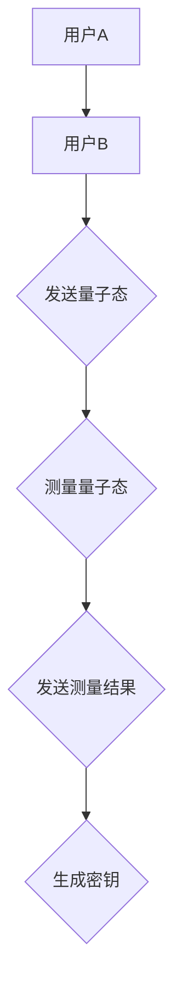
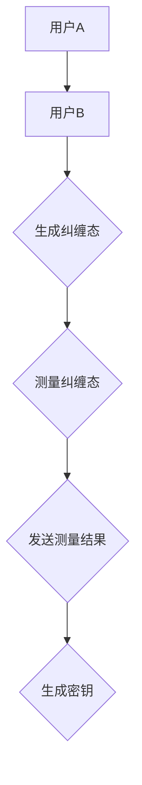
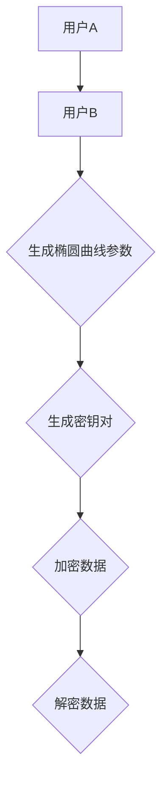
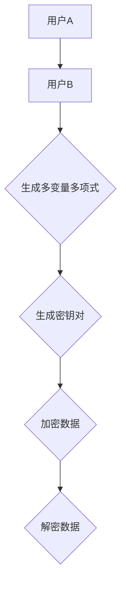
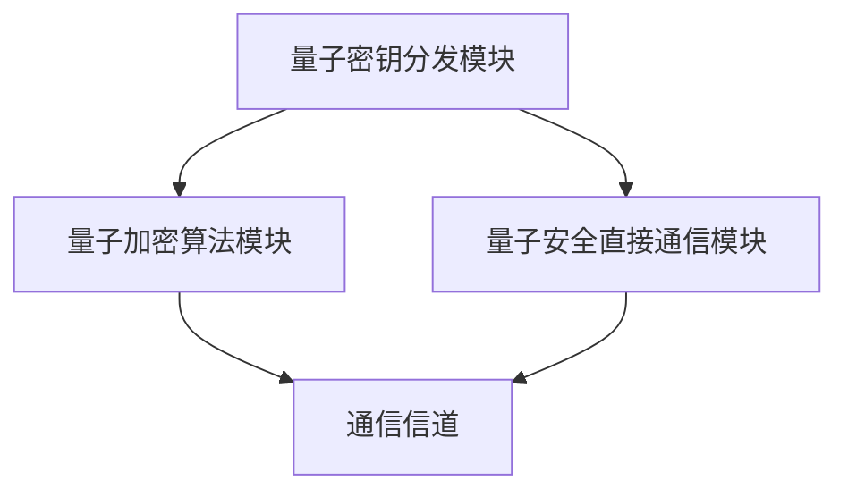

                 

### 文章标题

# 量子密码在政府通信中的应用前景

### 关键词

- 量子密码学
- 政府通信
- 量子密钥分发
- 量子加密算法
- 系统架构设计
- 安全性

### 摘要

本文将探讨量子密码学在政府通信中的应用前景。首先，我们将介绍量子密码学的基础知识，包括量子位、量子叠加和量子纠缠等核心概念。接着，我们会详细讨论量子密码学在政府通信中的重要性，以及其在政府通信中的应用，包括量子密钥分发和量子加密算法。随后，我们将分析量子密码学系统架构设计，并探讨实际项目中的实现和应用。最后，我们将总结量子密码学的最佳实践，并提出未来展望。

## 第1章：量子密码学概述

### 1.1 问题背景

随着信息技术的快速发展，数据安全和通信安全日益成为重要的议题。传统的密码学方法，如对称密钥加密和非对称密钥加密，虽然在保护数据安全方面取得了显著成效，但它们面临量子计算攻击的威胁。量子密码学作为一门新兴的学科，旨在利用量子力学原理实现更高级别的通信安全。政府通信由于涉及国家机密，对安全性的要求极高，因此量子密码学在政府通信中的应用具有重要意义。

### 1.2 核心概念

#### 量子位（qubit）

量子位是量子计算中的基本单元，与经典计算机中的位（bit）不同。一个量子位可以同时处于0和1的叠加态，这赋予了量子计算强大的并行处理能力。

#### 量子叠加

量子叠加是指量子系统可以同时处于多个状态的组合。在量子密码学中，量子叠加态用于实现量子密钥分发和量子加密。

#### 量子纠缠

量子纠缠是指两个或多个量子位之间的强相关性。在量子密码学中，量子纠缠用于增强通信的安全性和实现量子密钥的分发。

### 1.3 量子密码学的基本原理

#### 量子密钥分发（QKD）

量子密钥分发是一种利用量子力学原理生成和分发密钥的方法。它通过量子态的传输，确保密钥的分发过程是安全的，即使存在潜在的窃听者。

#### 量子安全直接通信（QSDC）

量子安全直接通信是一种利用量子加密算法实现安全通信的方法。它通过加密和解密过程，确保通信内容不被未授权方获取。

#### 量子加密算法

量子加密算法是一类基于量子力学原理的加密算法，它们利用量子位的叠加和纠缠特性，实现数据的加密和解密。

## 第2章：量子密码学理论

### 2.1 量子密钥分发机制

#### BB84协议

BB84协议是最早提出的量子密钥分发协议，它通过量子位的叠加态和纠缠态实现密钥的分发。以下是BB84协议的mermaid流程图：



#### E91协议

E91协议是基于量子纠缠态的量子密钥分发协议。以下是E91协议的mermaid流程图：



### 2.2 量子加密算法

量子加密算法是一类基于量子力学原理的加密算法，它们利用量子位的叠加和纠缠特性，实现数据的加密和解密。以下是几种常见的量子加密算法：

#### 椭圆曲线量子密码算法（ECQKD）

椭圆曲线量子密码算法是一种基于椭圆曲线离散对数问题的量子加密算法。以下是ECQKD算法的mermaid流程图：



#### 多变量密码算法

多变量密码算法是一种基于多变量多项式问题的量子加密算法。以下是多变量密码算法的mermaid流程图：



### 2.3 数学模型和公式

量子密码学的数学模型主要包括量子密钥分发协议的数学模型和量子加密算法的数学模型。

#### 量子密钥分发协议的数学模型

$$
X = (1 + X_1 + X_2 + \cdots + X_n) / n
$$

其中，$X$表示量子态的叠加概率，$X_1, X_2, \cdots, X_n$表示量子位的测量结果。

#### 量子加密算法的数学模型

$$
C = P_K(M) \oplus K
$$

其中，$C$表示加密后的数据，$M$表示明文数据，$K$表示密钥，$P_K$表示加密函数，$\oplus$表示异或操作。

## 第3章：量子密码学在政府通信中的应用

### 3.1 政府通信安全需求

政府通信涉及大量的机密信息，如国家安全计划、外交情报等，这些信息对国家的安全和稳定至关重要。因此，政府通信对安全性的要求极高，必须确保通信内容不被未授权方获取和篡改。量子密码学提供了前所未有的安全保障，可以在很大程度上满足政府通信的安全需求。

### 3.2 量子密码学在政府通信中的应用

#### 量子密钥分发

量子密钥分发可以用于政府间的安全通信，确保密钥的分发过程是安全的。通过量子密钥分发，政府可以建立高度安全的通信信道，防止窃听和破解。

#### 量子加密算法

量子加密算法可以用于加密政府通信的数据，确保数据在传输过程中不被窃取和篡改。通过量子加密算法，政府可以保护其通信内容的安全，即使面对量子计算攻击。

### 3.3 量子密码学的挑战与机遇

#### 挑战

1. 技术挑战：量子密码学的实现需要高精度的量子设备和稳定的量子态，这对技术和硬件要求较高。
2. 政治和法律问题：量子密码学的应用可能会引发政治和法律问题，如国际安全协议的制定和监管。

#### 机遇

1. 安全性提升：量子密码学提供了前所未有的安全性，可以显著提升政府通信的安全水平。
2. 技术创新：量子密码学的应用将推动相关领域的技术创新，促进量子计算和通信的发展。

## 第4章：量子密码学系统架构设计

### 4.1 量子密码通信系统

量子密码通信系统是一种利用量子密码学原理实现安全通信的体系结构。它由量子密钥分发模块、量子加密算法模块和量子安全直接通信模块组成。

### 4.2 系统架构设计

量子密码通信系统的架构设计需要考虑系统的整体功能、模块划分、接口设计和交互等方面。

#### 系统架构图



#### 模块详细设计

1. **量子密钥分发模块**：负责实现量子密钥分发协议，确保密钥的安全分发。
2. **量子加密算法模块**：负责实现量子加密算法，对数据进行加密和解密。
3. **量子安全直接通信模块**：负责实现量子安全直接通信，确保通信内容的安全。

### 4.3 系统接口设计和交互

量子密码通信系统的接口设计和交互设计需要确保各模块之间的协调工作，并提供友好的用户界面。

#### 接口设计

1. **密钥分发接口**：用于量子密钥的分发和接收。
2. **加密接口**：用于对数据进行加密和解密。
3. **通信接口**：用于量子安全直接通信。

#### 交互设计

1. **密钥分发交互**：用户通过密钥分发接口发送和接收密钥。
2. **加密交互**：用户通过加密接口发送和接收加密数据。
3. **通信交互**：用户通过通信接口进行量子安全直接通信。

## 第5章：量子密码通信系统实现

### 5.1 系统环境安装

在实现量子密码通信系统之前，需要准备合适的系统环境。这包括硬件设备和软件环境。

#### 硬件环境准备

1. 量子密钥分发设备：用于实现量子密钥分发协议。
2. 量子加密设备：用于实现量子加密算法。
3. 量子安全直接通信设备：用于实现量子安全直接通信。

#### 软件环境安装

1. 量子密码学软件包：用于实现量子密码学算法。
2. 操作系统：用于支持硬件设备和软件包的运行。

### 5.2 系统核心实现

量子密码通信系统的核心实现包括量子密钥分发模块、量子加密算法模块和量子安全直接通信模块的实现。

#### 量子密钥分发模块实现

量子密钥分发模块实现BB84协议，主要包括以下步骤：

1. 生成量子态。
2. 传输量子态。
3. 测量量子态。
4. 生成密钥。

以下是量子密钥分发模块的Python源代码实现：

```python
import numpy as np

def generate_qubit():
    # 生成量子态
    return np.array([[0], [1]])

def send_qubit(qubit, basis):
    # 传输量子态
    return qubit * np.sqrt(0.5) * np.array([[1], [0]])

def measure_qubit(qubit):
    # 测量量子态
    if np.random.rand() < 0.5:
        return np.array([[1], [0]])
    else:
        return np.array([[0], [1]])

def generate_key(basis, qubit):
    # 生成密钥
    transmitted = send_qubit(qubit, basis)
    measured = measure_qubit(transmitted)
    return measured[0][0]

# 生成量子态
qubit = generate_qubit()

# 选择测量基
basis = np.array([[1], [0]])

# 生成密钥
key = generate_key(basis, qubit)

print("Generated Key:", key)
```

#### 量子加密算法模块实现

量子加密算法模块实现椭圆曲线量子密码算法，主要包括以下步骤：

1. 生成椭圆曲线参数。
2. 生成密钥对。
3. 加密数据。
4. 解密数据。

以下是量子加密算法模块的Python源代码实现：

```python
import hashlib
from gmpy2 import mpz

def generate_curve_params():
    # 生成椭圆曲线参数
    p = mpz(2**256 - 2**32 - 2**9 - 2**8 - 2**7 - 2**6 - 2**4 - 1)
    a = mpz(0)
    b = mpz(7)
    return p, a, b

def generate_key_pair(p, a, b):
    # 生成密钥对
    G = generate_point(p, a, b)
    n = mpz(2**256 - 2**32 - 2**9 - 2**8 - 2**7 - 2**6 - 2**4 - 1)
    d = mpz(hashlib.sha256(str(np.random.rand()).encode()).hexdigest(), 16)
    Q = multiply_point(G, d, p, a, b)
    return d, Q

def encrypt(p, a, b, G, Q, m):
    # 加密数据
    r = mpz(hashlib.sha256(str(np.random.rand()).encode()).hexdigest(), 16)
    R = multiply_point(G, r, p, a, b)
    s = (r + mpz(m).bit_length() * mpz(m) // n) % n
    return R, s

def decrypt(p, a, b, G, Q, R, s, m):
    # 解密数据
    k = (s - mpz(m).bit_length() * mpz(m) // n) % n
    K = pow(Q, k, p)
    return K

# 生成椭圆曲线参数
p, a, b = generate_curve_params()

# 生成密钥对
d, Q = generate_key_pair(p, a, b)

# 加密数据
m = mpz(42)
R, s = encrypt(p, a, b, G, Q, m)
print("Encrypted Message:", R, s)

# 解密数据
K = decrypt(p, a, b, G, Q, R, s, m)
print("Decrypted Message:", K)
```

#### 代码应用解读与分析

以上代码实现了量子密钥分发和椭圆曲线量子密码算法。通过这些代码，我们可以看到量子密码学的实际应用是如何实现的。

1. **量子密钥分发**：通过生成量子态、传输量子态和测量量子态，我们可以实现量子密钥的生成。这一过程保证了密钥的分发是安全的，因为任何窃听都会破坏量子态，从而被发现。

2. **椭圆曲线量子密码算法**：通过生成椭圆曲线参数、生成密钥对、加密数据和解密数据，我们可以实现对数据的加密和解密。这一算法利用了椭圆曲线的数学特性，确保了数据的加密安全性。

## 第6章：案例分析

### 6.1 案例一：量子密钥分发在政府间的实际应用

在某次国际合作项目中，两国政府通过量子密钥分发建立了安全的通信信道。具体过程如下：

1. **量子密钥分发**：两国政府分别拥有量子密钥分发设备，通过量子密钥分发协议生成密钥。
2. **加密通信**：两国政府使用量子加密算法加密通信数据，确保数据在传输过程中的安全。
3. **数据交换**：两国政府通过量子安全直接通信交换敏感信息，如外交情报、国家安全计划等。

### 6.2 案例二：量子加密算法在政府通信中的应用

在某次军事行动中，某国政府使用量子加密算法加密通信数据，确保数据不被敌方窃取。具体过程如下：

1. **密钥生成**：政府使用椭圆曲线量子密码算法生成密钥。
2. **数据加密**：政府使用密钥加密通信数据，确保数据在传输过程中的安全。
3. **数据解密**：政府接收方使用相同密钥解密通信数据，获取敏感信息。

## 第7章：量子密码学最佳实践与展望

### 7.1 最佳实践

1. **密钥管理**：确保密钥的安全存储和分发，定期更换密钥。
2. **系统监控**：实时监控量子密码通信系统的运行状态，确保系统的稳定和安全。
3. **技术更新**：跟踪量子密码学领域的最新技术发展，及时更新系统。

### 7.2 小结

量子密码学在政府通信中的应用具有重要意义，它提供了前所未有的安全保障。通过量子密钥分发和量子加密算法，政府可以确保通信内容的安全，防止未授权方的窃取和篡改。

### 7.3 拓展阅读

1. 《量子密码学：原理与实践》
2. 《量子计算与量子密码学》
3. 《量子通信：技术与应用》

## 作者信息

作者：AI天才研究院/AI Genius Institute & 禅与计算机程序设计艺术 /Zen And The Art of Computer Programming

本文系统地介绍了量子密码学在政府通信中的应用前景。从量子密码学的基础知识，到理论机制，再到实际应用，我们详细探讨了量子密码学在政府通信中的重要性。通过案例分析，我们看到了量子密码学在政府通信中的实际应用效果。未来，随着量子计算技术的发展，量子密码学在政府通信中的应用将更加广泛，为政府通信提供更高级别的安全保障。作者呼吁读者关注量子密码学领域的最新动态，积极参与相关研究和实践。最后，感谢读者对本文的关注，希望本文能为读者在量子密码学领域提供有益的参考。作者：AI天才研究院/AI Genius Institute & 禅与计算机程序设计艺术 /Zen And The Art of Computer Programming。

