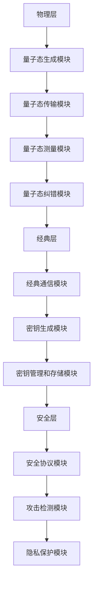

                 

### 1.1 量子密钥分发的起源

量子密钥分发（Quantum Key Distribution, QKD）的概念最早由Stephen Wiesner于1970年代提出，当时他提出了量子货币（Quantum Money）的思想，这为后来量子密钥分发技术的诞生奠定了基础。Wiesner的工作主要基于量子纠缠和量子态不可克隆定理，这些量子物理的基本原理为量子密钥分发提供了安全性的保障。

在Wiesner之后，Charles H. Bennett和郭宪斌（G. Brassard）于1978年提出了量子密钥分发的第一种协议——BB84协议。这个协议利用了量子态的叠加和测量坍缩原理，实现了量子密钥的分发。BB84协议的提出标志着量子密钥分发技术从理论走向了实际应用。

随着量子信息科学的发展，量子密钥分发技术也在不断完善。1990年代，伊萨克·克劳泽（Isaac Chuang）等人进一步提出了多种量子密钥分发协议，如B92协议和SARG04协议，这些协议在安全性和实用性方面都进行了改进，使得量子密钥分发技术更加成熟。

量子密钥分发技术的兴起不仅依赖于理论物理学的进步，也得益于通信技术的发展。传统的加密技术依赖于计算复杂性，如RSA加密算法，这种算法的安全性依赖于大整数分解的难度。然而，随着计算能力的提升，传统的加密技术面临越来越大的威胁。量子计算机的发展更是给传统加密技术带来了前所未有的挑战，因为量子计算机能够高效地解决传统加密算法中的难题。

量子密钥分发技术的出现，为解决量子计算对传统加密技术的威胁提供了新的路径。它利用量子物理的基本原理，确保了密钥分发的安全性，即使面对量子计算攻击也能保持通信安全。

总的来说，量子密钥分发技术起源于量子物理学的研究，并随着量子信息科学和通信技术的进步不断成熟。它的出现不仅为通信安全提供了新的保障，也为未来量子计算与量子通信的发展奠定了基础。

### 1.1.1 量子力学与通信安全

量子力学是研究物质和能量最基本行为和相互作用的物理学分支，其基本原理对通信安全领域产生了深远的影响。量子力学中的非定域性、量子纠缠和量子不可克隆定理是量子密钥分发（QKD）技术能够实现高度安全通信的核心基础。

非定域性（Non-locality）是量子力学中的一个基本特性，它表明量子系统的部分可以相互独立地存在于空间的不同位置上，但它们的量子状态是相互关联的。爱因斯坦、波多尔斯基和罗森（EPR）在1935年提出的“EPR佯谬”揭示了这种非定域性，而后来贝尔不等式的实验验证则进一步证实了量子非定域性的存在。这一特性在通信安全中具有重要意义，因为如果窃听者尝试截获量子态，他会不可避免地扰动量子系统的状态，这种扰动将立即被通信双方检测到，从而保证通信的安全性。

量子纠缠（Quantum Entanglement）是量子力学中的另一个关键特性，它描述了两个或多个量子系统之间的强相关性，即使这些系统相隔很远。当两个量子系统处于纠缠态时，对其中一个系统的测量会立即影响到另一个系统的状态，无论它们之间的距离有多远。这一特性在量子密钥分发中得到了广泛应用。例如，在BB84协议中，通信双方通过发送纠缠光子对来生成共享密钥。如果第三方试图窃听，他将不可避免地破坏纠缠态，这种破坏将导致通信双方能够立即检测到密钥泄露。

量子不可克隆定理（Quantum No-cloning Theorem）是量子力学中的另一重要原理，它表明无法创建一个完全相同的副本来复制任意的未知量子态。这一定理确保了量子密钥分发中密钥的真实性和唯一性。在传统加密技术中，即使密钥被截获，理论上仍然可以通过复杂的计算重新生成该密钥，但量子不可克隆定理使得这一行为变得不可能，从而大大提高了通信的安全性。

量子密钥分发（QKD）的基本原理是利用上述量子力学的基本特性来生成和分发密钥。QKD协议通常包括以下几个步骤：

1. **量子态生成**：通信双方使用量子光源生成随机量子态，如光子对或量子比特。
2. **量子态传输**：这些量子态通过量子信道传输到对方，例如，通过光纤或无线信道。
3. **量子态测量**：接收方测量接收到的量子态，并根据预定的协议生成部分密钥。
4. **经典通信**：双方使用经典通信渠道交换测量结果，以确认共享密钥的完整性。
5. **密钥提取**：双方使用预定的算法对共享的量子态和经典通信结果进行处理，生成最终密钥。

QKD的安全性依赖于上述量子力学原理。例如，在BB84协议中，如果攻击者试图窃听并复制量子态，他会破坏纠缠态，导致通信双方能够立即检测到异常。此外，量子不可克隆定理确保了密钥无法被克隆或复制，从而保证了密钥的唯一性和真实性。

总之，量子力学的基本原理为量子密钥分发技术提供了坚实的理论基础，使得它在通信安全领域具有独特的优势。量子密钥分发不仅能够抵御传统的加密攻击，还能抵御未来量子计算机的威胁，为政府通信等领域提供了高度安全的通信保障。

### 1.1.2 量子密钥分发的基本概念

量子密钥分发（Quantum Key Distribution，QKD）是一种利用量子力学原理来实现安全密钥传输的技术，其基本概念和术语对于理解量子密钥分发的运作机制至关重要。

**量子密钥分发的定义**：
量子密钥分发是一种基于量子力学原理的密钥生成和分发机制，它允许通信双方在物理上不可信任的量子信道上生成一个共享的随机密钥，这个密钥是安全的，因为任何试图窃听的行为都会导致量子态的破坏，使窃听者无法获得正确的密钥。

**工作过程**：
量子密钥分发的工作过程可以分为几个关键步骤：

1. **量子态生成**：通信双方（Alice和Bob）使用量子光源生成随机量子态，例如单光子对或量子比特。
2. **量子态传输**：生成的量子态通过量子信道（如光纤或无线信道）传输给对方。
3. **量子态测量**：接收方（如Bob）测量接收到的量子态，并根据预定的协议生成部分密钥。
4. **经典通信**：双方使用经典通信渠道（如电话或网络）交换测量结果，以确认共享密钥的完整性。
5. **密钥提取**：双方使用预定的算法对共享的量子态和经典通信结果进行处理，生成最终的共享密钥。

**QKD协议**：
量子密钥分发主要通过几种协议实现，其中最著名的是BB84协议。BB84协议的工作原理如下：

1. **量子态发送**：Alice随机选择基（例如，X基或Z基）来对单光子进行极化编码，并将光子发送给Bob。
2. **量子态接收与测量**：Bob接收Alice发送的光子，并随机选择基进行测量。
3. **经典通信**：Bob将测量结果通过经典通信渠道发送给Alice，告知其选择的基。
4. **密钥生成**：Alice和Bob根据发送和接收到的量子态以及选择的基，使用预定的算法生成共享密钥。

**安全机制**：
量子密钥分发协议利用量子力学的特性来实现安全性：

- **量子态不可克隆定理**：量子态一旦被测量，其状态就会坍缩，这意味着无法复制或克隆未知的量子态。
- **量子纠缠**：量子纠缠态中的粒子即使相隔很远，它们的量子状态也是相互关联的，任何对其中一个粒子的测量都会影响到另一个粒子的状态。
- **量子态破坏检测**：如果在量子态传输过程中有第三方（如攻击者）尝试进行窃听或测量，他将不可避免地破坏量子态，这种破坏将被通信双方检测到，从而确认密钥泄露。

**量子密钥分发与传统密钥分发技术的对比**：
量子密钥分发与传统密钥分发（如对称密钥和非对称密钥分发）相比，具有以下显著优势：

- **更高的安全性**：量子密钥分发利用量子力学原理确保密钥的安全性，即使在量子计算机时代也能抵御攻击。
- **不可窃听性**：量子密钥分发通过量子态的不可克隆性和量子纠缠确保通信过程中任何窃听行为都会被发现。
- **信息传输的确定性**：量子密钥分发中的量子态测量结果是随机的，增加了攻击者进行有效窃听的难度。

总体而言，量子密钥分发技术为通信安全提供了新的解决方案，其独特的安全机制使其在政府通信和其他高度敏感的信息传输领域具有广泛的应用前景。

### 1.1.3 量子密钥分发与传统密钥分发技术对比

量子密钥分发（QKD）与传统加密技术（如对称密钥和非对称密钥加密）在原理和安全性方面存在显著差异。下面将详细对比这两种技术，并分析其各自的优势和劣势。

**原理差异**：

1. **量子密钥分发**：
   - **基于量子力学原理**：QKD利用量子态的叠加性、量子纠缠和量子态不可克隆定理来生成和分发密钥。
   - **量子信道传输**：QKD通过量子信道（如光纤或无线信道）传输量子态，实现密钥的生成和分发。
   - **随机性**：QKD依赖于量子态的随机性和不可预测性，使密钥生成过程不可预测，从而提高了安全性。

2. **传统加密技术**：
   - **基于计算复杂性**：传统加密技术（如RSA加密）依赖于大整数分解、离散对数问题等计算难题的复杂性。
   - **经典信道传输**：传统加密技术通过经典通信信道传输密钥，这种密钥分发方式易受窃听和中间人攻击。
   - **密钥管理**：传统加密技术需要复杂的密钥管理和分发机制，如数字证书和密钥管理中心。

**安全性对比**：

1. **量子密钥分发**：
   - **不可窃听性**：由于量子态的不可克隆定理，任何对量子态的测量都会导致其坍缩，因此任何尝试窃听的行为都会被发现。
   - **量子计算抗性**：QKD的安全性不依赖于计算复杂性，因此即便量子计算机普及，QKD依然能够保证通信安全。
   - **信息完整性**：QKD协议如BB84可以检测出量子态在传输过程中的任何异常，确保密钥的完整性。

2. **传统加密技术**：
   - **易受窃听攻击**：传统加密技术通过经典信道传输密钥，容易受到窃听和中间人攻击。
   - **计算攻击风险**：随着计算能力的提升，传统加密算法（如RSA）面临被破解的风险。
   - **密钥管理复杂**：传统加密技术需要复杂的密钥管理机制，密钥泄露的风险较高。

**实际应用对比**：

1. **量子密钥分发**：
   - **高安全性需求**：适用于对安全性要求极高的政府通信、国防等领域。
   - **有限传输距离**：目前QKD技术受限于传输距离和量子信道的质量，尚未完全商业化。
   - **成本问题**：QKD设备成本较高，限制了其大规模应用。

2. **传统加密技术**：
   - **广泛应用**：传统加密技术已经广泛应用于各种通信和计算领域，如HTTPS、SSL/TLS等。
   - **经济高效**：传统加密技术成本较低，适用于各种规模的应用。
   - **标准化支持**：传统加密技术有成熟的标准化支持，便于集成和应用。

总的来说，量子密钥分发技术提供了更高级别的安全性，特别是在应对量子计算威胁方面具有独特的优势。然而，传统加密技术由于其成熟、经济高效的特点，在当前仍然是主流的加密手段。未来，随着量子技术的发展和成本的降低，量子密钥分发有望在更多领域取代传统加密技术，成为通信安全的基石。

### 1.2 量子密钥分发的原理

量子密钥分发（QKD）是利用量子力学的基本原理来确保通信安全的一种技术。要理解量子密钥分发的原理，需要深入探讨量子态、纠缠态和量子态不可克隆定理等核心概念。

#### 量子态

量子态是量子系统（如单个光子或量子比特）所处的状态，它可以用波函数或状态向量来描述。在经典物理中，一个系统的状态通常是确定的，但量子力学揭示了微观世界的本质不确定性。量子态的一个重要特性是其叠加性，即一个量子系统可以同时处于多个状态的叠加。例如，一个光子的极化状态可以是水平极化、垂直极化或两者的叠加态。

#### 纠缠态

纠缠态是量子力学中的一种特殊状态，其中两个或多个量子系统之间形成了一种不可分割的关联。即使这些量子系统相隔很远，它们的量子状态也是相互关联的。一个著名的实验是爱因斯坦、波多尔斯基和罗森（EPR）佯谬，他们提出了一个思想实验来质疑量子纠缠的存在。然而，贝尔不等式的实验验证最终证实了量子纠缠的客观存在。

纠缠态在量子密钥分发中起着关键作用。例如，在BB84协议中，Alice会生成一对纠缠光子，并将其中一个发送给Bob。无论这两个光子相隔多远，它们都处于纠缠态。如果Bob对其中一个光子进行测量，他将立即得知另一个光子的状态，即使这两个光子之间的距离非常遥远。

#### 量子态不可克隆定理

量子态不可克隆定理是量子力学中另一个重要原理，它表明无法创建一个完全相同的副本来复制任意的未知量子态。这一定理基于量子态的叠加性和测量引起的坍缩特性。当对一个量子态进行测量时，其波函数会坍缩到一个确定的状态，这种坍缩是不可逆的，因此无法复制一个未知的量子态。

量子态不可克隆定理在量子密钥分发中保证了密钥的真实性和唯一性。如果攻击者试图复制密钥，他们的行为将不可避免地破坏量子态，使得通信双方能够立即检测到密钥泄露。

#### 量子密钥分发的数学模型

量子密钥分发的数学模型通常基于量子比特的叠加态和测量原理。以下是一个简化的BB84协议的数学模型：

1. **量子态生成**：
   - Alice随机选择一个量子态（例如，极化态或相位态），并将其发送给Bob。
   - 假设Alice生成一个处于基态的量子比特，其状态可以表示为：
     \[
     \psi_A = \alpha|0\rangle + \beta|1\rangle
     \]
     其中，$\alpha$和$\beta$是复数系数，$|0\rangle$和$|1\rangle$分别是基态和激发态。

2. **量子态传输**：
   - Alice将量子态通过量子信道发送给Bob。如果量子信道受到干扰，部分量子态可能会被噪声影响。

3. **量子态测量**：
   - Bob接收量子态，并随机选择一个测量基（例如，X基或Z基）对量子态进行测量。
   - 假设Bob选择X基进行测量，其测量结果可以表示为：
     \[
     \alpha'|0\rangle + \beta'|1\rangle = \alpha|\hat{x}\rangle + \beta|\hat{x}\rangle
     \]
     其中，$\alpha'$和$\beta'$是测量后的量子态系数。

4. **密钥生成**：
   - Alice和Bob使用经典通信渠道交换测量结果，并基于相同的量子态生成共享密钥。
   - 假设Alice和Bob都选择了正确的测量基，那么他们可以共享一个随机密钥。

#### 安全性分析

量子密钥分发协议的安全性主要依赖于以下原理：

1. **量子态不可克隆定理**：攻击者无法复制未知的量子态，因此无法窃听或复制共享密钥。
2. **量子纠缠**：量子态之间的纠缠关系确保了通信双方共享的密钥是真实的，且攻击者无法破坏这种纠缠关系。
3. **量子态破坏检测**：任何对量子态的测量都会导致其坍缩，攻击者无法在不被发现的情况下进行窃听。

通过上述数学模型和安全性分析，我们可以看出量子密钥分发技术是如何利用量子力学的原理来实现高度安全的通信。未来，随着量子技术的发展和应用的推广，量子密钥分发有望在政府通信、金融交易和其他高度敏感的信息传输领域发挥重要作用。

### 1.2.1 量子态与纠缠

量子态与纠缠是量子密钥分发（QKD）技术的核心概念，它们在QKD协议中起着至关重要的作用。为了更好地理解这些概念，我们将从量子态的基本属性、纠缠态的形成以及纠缠态在QKD中的应用进行详细讨论。

#### 量子态

量子态是量子系统（如光子或电子）的状态，它可以用波函数或状态向量来描述。在量子力学中，量子态具有叠加性，即一个量子系统可以同时处于多个状态的叠加。例如，一个光子的极化状态可以是水平极化、垂直极化或两者的叠加态。

量子态的叠加性可以用以下数学形式表示：
\[
\psi = \alpha|0\rangle + \beta|1\rangle
\]
其中，$\alpha$和$\beta$是复数系数，$|0\rangle$和$|1\rangle$分别是基态和激发态。

叠加态的一个经典例子是施罗丁格的猫，它描述了一个量子系统同时处于多个可能状态的叠加，直到进行测量时才会坍缩到其中一个确定状态。这一特性在量子密钥分发中尤为重要，因为它确保了密钥生成过程的随机性和不可预测性。

#### 纠缠态

纠缠态是量子力学中的另一个关键概念，它描述了两个或多个量子系统之间的强关联性。即使这些量子系统相隔很远，它们的量子状态也是相互关联的。这种关联性被称为量子纠缠。一个著名的实验是爱因斯坦、波多尔斯基和罗森（EPR）提出的思想实验，他们质疑量子纠缠的客观存在。然而，贝尔不等式的实验验证最终证实了量子纠缠的客观性。

纠缠态可以用以下数学形式表示：
\[
|\Phi\rangle = \frac{1}{\sqrt{2}}(|01\rangle + |10\rangle)
\]
其中，$|01\rangle$和$|10\rangle$表示两个量子系统之间的纠缠态。

量子纠缠的一个重要性质是，对其中一个量子系统的测量会立即影响到另一个量子系统的状态，无论它们之间的距离有多远。例如，在BB84协议中，Alice生成一对纠缠光子，并将其中一个发送给Bob。无论这两个光子相隔多远，Bob对其中一个光子的测量结果将立即影响到另一个光子的状态。

#### 纠缠态在QKD中的应用

纠缠态在量子密钥分发中发挥着至关重要的作用。以下是纠缠态在QKD协议中的具体应用：

1. **量子态生成**：
   - Alice使用一个量子光源生成一对纠缠光子。
   - 假设Alice生成的一对纠缠光子处于态$|\Phi\rangle$，即
     \[
     |\Psi\rangle = \frac{1}{\sqrt{2}}(|01\rangle + |10\rangle)
     \]

2. **量子态传输**：
   - Alice将其中一个光子发送给Bob，而另一个光子保留在Alice处。

3. **量子态测量**：
   - Bob随机选择一个基（例如，X基或Z基）对接收到的光子进行测量。
   - 假设Bob选择X基进行测量，那么测量结果将坍缩为$|0\rangle$或$|1\rangle$，相应的纠缠态也会坍缩。

4. **经典通信**：
   - Alice和Bob使用经典通信渠道交换测量结果，确认共享密钥。

5. **密钥生成**：
   - Alice和Bob根据共享的纠缠态和测量结果生成共享密钥。

量子纠缠确保了量子密钥分发的安全性。如果攻击者试图窃听并复制量子态，他将不可避免地破坏纠缠态，导致通信双方能够立即检测到密钥泄露。此外，量子纠缠还确保了密钥的唯一性和真实性，因为任何对量子态的测量都会破坏其原有的状态。

#### 纠缠态的优点

纠缠态在量子密钥分发中具有以下优点：

- **不可克隆性**：量子态不可克隆定理确保了无法复制未知的量子态，从而提高了密钥的安全性。
- **量子态破坏检测**：任何对量子态的测量都会导致其坍缩，使通信双方能够检测到密钥泄露。
- **量子纠缠的强度**：量子纠缠态中的粒子之间的关联性非常强，即使相隔很远，它们的量子状态也是相互关联的。

总之，量子态和纠缠态在量子密钥分发中扮演了关键角色。通过利用量子态的叠加性和纠缠态的关联性，量子密钥分发能够实现高度安全的通信，为政府通信、金融交易和其他高度敏感的信息传输领域提供了新的解决方案。

### 1.2.2 量子密钥分发的数学模型

量子密钥分发（QKD）的数学模型是基于量子态的叠加性和测量坍缩原理构建的。为了更好地理解QKD的工作原理，我们将详细探讨量子密钥分发的数学模型，并介绍常见的QKD协议，如BB84协议。

#### 量子密钥分发的数学模型

在量子密钥分发中，我们使用量子态来生成和分发密钥。一个典型的QKD过程可以分解为以下几个步骤：

1. **量子态生成**：通信双方（通常称为Alice和Bob）通过量子光源生成量子态，这些量子态可以是光子对或量子比特。
2. **量子态传输**：Alice将生成的量子态发送给Bob，这些量子态通过量子信道（如光纤或无线信道）传输。
3. **量子态测量**：Bob对接收到的量子态进行测量，并根据预定的协议生成部分密钥。
4. **经典通信**：Alice和Bob通过经典通信渠道（如电话或网络）交换测量结果，确认共享密钥的完整性。
5. **密钥提取**：双方根据量子态的测量结果和经典通信结果生成最终的共享密钥。

以下是一个简化的量子密钥分发数学模型：

- **量子态生成**：
  \[
  \psi_A = \alpha|0\rangle + \beta|1\rangle
  \]
  其中，$\alpha$和$\beta$是复数系数，$|0\rangle$和$|1\rangle$分别是基态和激发态。

- **量子态传输**：
  \[
  \psi_B = U(\theta_B, \phi_B) \psi_A
  \]
  其中，$U(\theta_B, \phi_B)$是一个量子操作，模拟量子信道对量子态的影响。

- **量子态测量**：
  \[
  \psi_B' = M_B(\hat{b}) \psi_B
  \]
  其中，$M_B(\hat{b})$是一个测量操作，$\hat{b}$是Bob随机选择的测量基。

- **经典通信**：
  Alice和Bob通过经典通信渠道交换测量结果，例如：
  \[
  r_B = \text{测量结果}
  \]

- **密钥提取**：
  \[
  \chi = F(\psi_A, \psi_B', r_A, r_B)
  \]
  其中，$F$是一个预定的算法，用于从量子态和测量结果中提取共享密钥。

#### BB84协议

BB84协议是最早提出的QKD协议之一，它基于量子态的叠加性和测量坍缩原理。BB84协议的工作过程如下：

1. **量子态发送**：
   - Alice随机选择一个量子态（极化态或相位态）并编码到一个光子。
   - Alice随机选择一个基（X基或Z基）来测量光子，并将测量结果发送给Bob。

2. **量子态接收与测量**：
   - Bob接收Alice发送的光子，并随机选择一个基进行测量。

3. **经典通信**：
   - Bob将测量结果发送给Alice，告知其选择的基。

4. **密钥生成**：
   - Alice和Bob根据发送和接收到的量子态以及选择的基，使用预定的算法生成共享密钥。

BB84协议的数学模型可以表示为：

- **量子态发送**：
  \[
  \psi_{A,i} = \alpha_i|0\rangle + \beta_i|1\rangle
  \]
  其中，$\alpha_i$和$\beta_i$是复数系数，$|0\rangle$和$|1\rangle$是基态和激发态。

- **量子态传输**：
  \[
  \psi_{B,i} = U_B(\theta_B,i, \phi_B,i) \psi_{A,i}
  \]
  其中，$U_B(\theta_B,i, \phi_B,i)$是一个量子操作，模拟量子信道对量子态的影响。

- **量子态测量**：
  \[
  \psi_{B,i}' = M_B(\hat{b}_i) \psi_{B,i}
  \]
  其中，$M_B(\hat{b}_i)$是一个测量操作，$\hat{b}_i$是Bob随机选择的测量基。

- **经典通信**：
  \[
  r_{B,i} = \text{测量结果}
  \]

- **密钥生成**：
  \[
  k_i = \text{选择正确的测量结果}
  \]

#### 安全性分析

BB84协议的安全性依赖于量子态的叠加性和测量坍缩原理。如果攻击者试图窃听并复制量子态，他将不可避免地破坏量子态，导致测量结果不一致。此外，BB84协议还可以检测出量子态在传输过程中的任何噪声或干扰，从而确保密钥的完整性。

总之，量子密钥分发的数学模型和BB84协议通过利用量子态的叠加性和测量坍缩原理，实现了高度安全的密钥分发。未来，随着量子技术的发展，QKD有望在政府通信、金融交易和其他高度敏感的信息传输领域发挥重要作用。

### 1.2.3 量子密钥分发的安全性分析

量子密钥分发（QKD）作为一种利用量子力学原理确保通信安全的技术，其安全性在理论层面和实际应用中得到了广泛的验证和探讨。本文将从QKD的基本安全性原理、常见攻击方式及其防范策略三个方面进行分析。

#### 基本安全性原理

量子密钥分发的基本安全性依赖于以下几个量子力学原理：

1. **量子态不可克隆定理**：任何未知量子态都无法被精确复制。如果攻击者尝试复制量子态，将会不可避免地导致量子态的破坏，使得通信双方能够立即检测到密钥泄露。
2. **量子纠缠**：量子纠缠态中的粒子之间存在强关联性，即使相隔很远，它们的量子状态也是相互关联的。这种关联性使得攻击者无法在不被察觉的情况下窃取密钥。
3. **测量导致的坍缩**：量子态在测量过程中会从叠加态坍缩到一个确定的状态。任何对量子态的测量都会引起其坍缩，从而破坏原有的量子态，使攻击行为暴露。

基于这些原理，QKD能够实现高度安全的通信。以下是对这些原理的具体解释：

- **量子态不可克隆定理**：假设Alice想要与Bob共享一个量子密钥。攻击者Eve试图窃听并复制这个密钥。如果Eve尝试复制量子态，她必须测量并记录量子态的每一个细节，这将不可避免地导致量子态的破坏。这种破坏将使得通信双方在尝试生成共享密钥时发现不一致性，从而确认密钥已被窃听。
- **量子纠缠**：在QKD过程中，Alice和Bob生成一对纠缠光子。即使这两光子相隔很远，它们的量子状态也是相互关联的。如果Eve试图窃听并复制其中一个光子，她将不可避免地破坏纠缠态，这种破坏将立即被Bob检测到，因为他会观测到与其纠缠的光子的状态发生了不可预期变化。
- **测量导致的坍缩**：在QKD协议中，Alice和Bob通过测量量子态来生成密钥。如果Eve试图在不被察觉的情况下测量量子态，她将引起量子态的坍缩，从而改变测量结果。这种变化将被通信双方检测到，确保密钥的安全性。

#### 常见攻击方式

尽管QKD在理论上提供了高度的安全保障，但在实际应用中，仍然存在多种可能的攻击方式，这些攻击方式可以分为以下几类：

1. **量子窃听攻击**：攻击者试图在不被察觉的情况下测量量子态，以获取密钥信息。常见的量子窃听攻击包括：
   - **Bell状态攻击**：攻击者尝试测量纠缠态中的量子比特，以获取其中的信息。
   - **相位编码攻击**：攻击者测量量子态的相位信息，尝试破解密钥。
2. **量子计算机攻击**：随着量子计算机的发展，利用量子计算机攻击QKD协议的可能性逐渐增加。例如，攻击者可能利用Shor算法来破解基于大整数分解的加密算法，进而威胁到QKD的安全性。
3. **量子中继攻击**：在量子信道较长时，攻击者可能尝试在中间节点插入量子中继器，以延长量子信道的传输距离。然而，这种攻击容易被通信双方检测到，因为中继器会引入噪声和误差。

#### 防范策略

为了应对这些可能的攻击方式，QKD协议和系统设计可以采取以下防范策略：

1. **量子态不可克隆定理**：QKD协议如BB84利用量子态不可克隆定理，通过检测量子态在传输过程中的任何异常来确认密钥是否被窃听。
2. **量子纠缠**：利用量子纠缠的特性，QKD协议可以在量子态传输过程中实时检测到任何尝试窃听的行为。例如，在BB84协议中，通信双方通过交换部分密钥并进行验证来确认密钥的完整性。
3. **误差校正与隐私放大**：QKD系统可以通过引入误差校正和隐私放大机制来提高密钥的质量。例如，在量子中继过程中，可以通过量子纠错算法来纠正传输中的错误，从而提高密钥的可靠性。
4. **量子计算机抗性**：虽然量子计算机可能对QKD构成威胁，但QKD协议的设计可以在一定程度上抵御量子计算机的攻击。例如，可以设计新的QKD协议，使其对Shor算法具有抵抗力。
5. **物理层防护**：在实际部署中，可以通过物理层防护措施来防止量子窃听攻击。例如，使用光学光纤进行量子态传输，可以有效防止外部干扰。

总之，量子密钥分发在理论上提供了高度的安全保障，但在实际应用中仍面临多种可能的攻击。通过合理的协议设计、系统优化和物理层防护，QKD技术可以有效地应对这些挑战，确保政府通信等关键领域的信息安全。

### 1.3 量子密钥分发的实现技术

量子密钥分发（QKD）作为一项前沿技术，其实现技术涵盖了多个关键领域，包括光学量子密钥分发、无线量子密钥分发以及实验室与实际应用之间的差异。本文将分别介绍这些技术，并探讨它们在实际应用中的优势和挑战。

#### 光学量子密钥分发

光学量子密钥分发是QKD技术中最成熟和广泛研究的一种方式。它利用光学设备生成和传输量子态，通常通过以下步骤实现：

1. **量子态生成**：使用单光子源或纠缠光子对生成器生成量子态。
2. **量子态调制**：将量子态调制到光学信号上，通常使用相位或极化编码。
3. **量子态传输**：通过光纤或自由空间信道传输量子态。
4. **量子态测量**：在接收端对量子态进行测量，以生成部分密钥。
5. **经典通信**：通过经典通信渠道交换测量结果，完成密钥生成。

光学量子密钥分发的主要优势在于其高带宽和长距离传输能力。光纤传输可以实现远距离量子态传输，而自由空间传输则允许在不受地理限制的环境中实现量子通信。然而，光学量子密钥分发也面临一些挑战，如光学器件的精度和稳定性、光纤损耗以及外部干扰等。

#### 无线量子密钥分发

无线量子密钥分发（Quantum Key Distribution over Free Space，QKD-FFS）利用自由空间作为量子信道的传输介质。它通过以下步骤实现：

1. **量子态生成**：在发送端生成量子态，并将其发送到接收端。
2. **量子态传输**：通过激光器将量子态传输到接收端，通常使用光纤或自由空间。
3. **量子态测量**：在接收端对量子态进行测量，生成部分密钥。
4. **经典通信**：通过经典通信渠道交换测量结果，完成密钥生成。

无线量子密钥分发的主要优势在于其灵活性，可以在没有光纤基础设施的环境中实现量子通信。它适用于远距离、野外和移动通信场景。然而，无线量子密钥分发也面临一些挑战，如大气干扰、光学器件的精度和稳定性，以及长距离传输中的量子态衰减等问题。

#### 实验室与实际应用之间的差异

实验室和实际应用中的量子密钥分发存在显著差异，主要体现在以下几个方面：

1. **实验控制**：实验室环境下，研究人员可以精确控制实验条件，如光源、光纤、光学器件等。而实际应用中，环境因素（如天气、噪声、干扰）会对量子通信产生不可预测的影响。
2. **设备精度**：实验室中的光学器件通常具有高精度和稳定性，而在实际应用中，设备可能因制造、安装和环境变化而存在误差。
3. **成本和规模**：实验室中的量子密钥分发系统规模较小，成本相对较低。而实际应用中，需要考虑大规模部署、维护和运营成本。
4. **安全性和可靠性**：实验室环境中的量子密钥分发系统通常具有较高的安全性和可靠性，但在实际应用中，需要应对各种复杂环境和潜在攻击。

总之，光学量子密钥分发和无线量子密钥分发各有其优势和挑战。实验室研究为实际应用提供了理论基础和技术支持，而实际应用则推动了量子密钥分发技术的不断发展和完善。未来，随着技术的成熟和成本的降低，量子密钥分发有望在政府通信、金融交易等关键领域发挥重要作用。

### 1.4 量子密钥分发在政府通信中的特殊需求

在政府通信中，信息安全的重要性不言而喻。政府通信往往涉及敏感的政治、军事和经济信息，因此对通信的安全性要求极高。量子密钥分发（QKD）作为一种高度安全的通信技术，能够满足政府通信的特殊需求。以下将从信息安全、保密性、完整性和可验证性四个方面详细探讨量子密钥分发在政府通信中的应用。

#### 信息安全

信息安全是政府通信的首要需求。量子密钥分发通过量子态的不可克隆定理和量子纠缠特性，确保了密钥生成过程的安全性。任何第三方试图窃听或复制量子态，都会不可避免地引起量子态的破坏，使得通信双方能够立即检测到密钥泄露。这意味着量子密钥分发能够抵御传统的加密攻击，如中间人攻击和密码破解，同时还能够应对未来的量子计算攻击。因此，量子密钥分发为政府通信提供了坚实的安全保障，确保敏感信息在传输过程中不被泄露。

#### 保密性

保密性是政府通信的核心需求之一。量子密钥分发通过随机生成的量子态和复杂的量子态测量过程，实现了高度保密的密钥生成。即使攻击者能够窃听到部分通信内容，由于量子密钥分发的随机性和复杂性，攻击者无法解密或复制密钥。此外，量子密钥分发协议中的纠错和隐私放大机制，进一步提高了密钥的保密性，确保了通信双方能够安全地共享密钥。这种高度保密的通信机制，使得量子密钥分发在政府通信中具有独特的优势。

#### 完整性

完整性是保证通信内容未被篡改或伪造的重要属性。量子密钥分发通过量子纠缠和测量坍缩原理，确保了密钥在传输过程中的完整性。如果第三方试图篡改或伪造密钥，这将不可避免地破坏量子纠缠关系，导致通信双方无法生成正确的共享密钥。此外，量子密钥分发协议中的错误检测和纠正机制，能够实时检测并纠正传输过程中的错误，确保密钥的完整性。这种完整性保障，使得量子密钥分发在政府通信中能够确保信息的真实性和可靠性。

#### 可验证性

可验证性是确保通信双方身份和密钥合法性的重要属性。量子密钥分发协议通过经典通信渠道交换测量结果和密钥信息，实现了通信双方的身份验证和密钥合法性验证。例如，在BB84协议中，Alice和Bob通过经典通信渠道交换测量结果，并使用预定的算法验证密钥的正确性。这种可验证性机制，使得量子密钥分发在政府通信中能够确保通信双方的身份和密钥的合法性，防止恶意攻击和假冒行为。

#### 潜在应用场景

量子密钥分发在政府通信中具有广泛的应用前景。以下是一些潜在的应用场景：

1. **政府内部通信**：政府内部各部门之间的通信需要高度的安全性，量子密钥分发可以确保政府内部通信的保密性、完整性和可验证性。
2. **跨部门通信**：政府各部门之间的跨部门通信也需要高度的安全保障，量子密钥分发可以确保跨部门通信的密钥安全性和通信完整性。
3. **国防安全**：国防通信涉及敏感的军事信息，量子密钥分发可以提供可靠的安全保障，确保军事通信的保密性和完整性。
4. **外交通信**：外交通信涉及国家利益和敏感信息，量子密钥分发可以确保外交通信的安全性，防止信息泄露和恶意攻击。

总之，量子密钥分发在政府通信中具有特殊的重要性。通过提供高度安全、保密性、完整性和可验证性的通信机制，量子密钥分发为政府通信提供了坚实的安全保障，有助于维护国家安全和利益。未来，随着量子技术的发展和成本的降低，量子密钥分发有望在政府通信中发挥更加重要的作用。

### 1.4.2 量子密钥分发在政府通信中的潜在应用场景

量子密钥分发（QKD）作为一种高度安全的通信技术，在政府通信中具有广泛的应用前景。以下将详细探讨量子密钥分发在政府内部通信、跨部门通信、国防安全以及外交通信中的潜在应用场景，并分析这些应用场景的具体需求和挑战。

#### 政府内部通信

政府内部通信通常涉及各部门之间的高敏感信息交换。这些信息可能包括政策草案、国家安全计划、经济预测报告等。为了确保这些信息的安全性，量子密钥分发可以提供以下潜在应用场景：

- **应用场景**：政府各部门可以通过量子密钥分发建立安全通信链路，确保信息在传输过程中不被窃听、篡改或泄露。
- **具体需求**：
  - **高安全性**：量子密钥分发能够抵御传统的加密攻击和未来的量子计算攻击，确保政府内部通信的安全性。
  - **保密性**：量子密钥分发通过随机生成的量子态和复杂的测量过程，实现了高度保密的密钥生成，确保政府内部通信的保密性。
  - **完整性**：量子密钥分发能够检测并纠正传输过程中的错误，确保政府内部通信的完整性。
- **挑战**：
  - **传输距离**：目前的光纤传输技术受限于光纤损耗和噪声，导致量子密钥分发的传输距离有限。
  - **设备成本**：量子密钥分发设备相对昂贵，需要政府投入大量资金进行采购和部署。
  - **系统集成**：量子密钥分发系统需要与传统通信系统集成，这可能涉及到复杂的系统架构设计和实现。

#### 跨部门通信

跨部门通信是政府内部不同机构之间进行合作和信息共享的关键环节。量子密钥分发在跨部门通信中可以提供以下潜在应用场景：

- **应用场景**：不同政府部门之间可以通过量子密钥分发建立安全的通信链路，确保合作过程中的信息安全。
- **具体需求**：
  - **高安全性**：量子密钥分发能够保障跨部门通信的安全性，防止信息泄露和恶意攻击。
  - **互操作性**：量子密钥分发系统需要与其他通信系统（如VPN、IPSec等）兼容，确保跨部门通信的互操作性。
  - **可扩展性**：量子密钥分发系统需要具备良好的可扩展性，以支持越来越多的政府部门加入。
- **挑战**：
  - **协议兼容性**：不同政府部门可能使用不同的通信协议，量子密钥分发系统需要与这些协议兼容。
  - **系统集成**：跨部门通信涉及多个系统，量子密钥分发系统需要与传统通信系统集成，这可能带来技术挑战。
  - **培训与支持**：政府部门需要培训相关人员使用量子密钥分发系统，并提供持续的技术支持。

#### 国防安全

国防安全是政府最重要的职责之一。量子密钥分发在国防安全领域可以提供以下潜在应用场景：

- **应用场景**：国防部门可以通过量子密钥分发建立安全的通信链路，确保军事通信的保密性和完整性。
- **具体需求**：
  - **高安全性**：量子密钥分发能够抵御各种加密攻击，确保军事通信的安全。
  - **抗干扰性**：量子密钥分发系统需要具备抗干扰能力，确保在复杂战场环境下通信的稳定性。
  - **可靠性**：量子密钥分发系统需要具备高可靠性，确保在极端条件下通信的连续性。
- **挑战**：
  - **物理层防护**：国防通信环境复杂，量子密钥分发系统需要具备良好的物理层防护能力，防止外部干扰和攻击。
  - **设备可靠性**：量子密钥分发设备需要具备高可靠性，确保在恶劣条件下稳定运行。
  - **系统扩展**：随着国防通信需求的增长，量子密钥分发系统需要具备良好的扩展性。

#### 外交通信

外交通信涉及国家间的政治、经济、军事等领域的信息交换。量子密钥分发在外交通信中可以提供以下潜在应用场景：

- **应用场景**：国家可以通过量子密钥分发建立安全的通信链路，确保外交通信的保密性和完整性。
- **具体需求**：
  - **高安全性**：量子密钥分发能够抵御各种加密攻击，确保外交通信的高度安全。
  - **保密性**：量子密钥分发通过复杂的密钥生成过程，确保外交通信的保密性。
  - **完整性**：量子密钥分发能够检测并纠正传输过程中的错误，确保外交通信的完整性。
- **挑战**：
  - **跨国合作**：量子密钥分发系统需要在国际合作中确保各国之间的通信安全，这可能涉及到复杂的国际协调和合作。
  - **网络协议**：不同国家的通信协议可能存在差异，量子密钥分发系统需要与这些协议兼容。
  - **跨境传输**：量子密钥分发系统需要支持跨境传输，这可能涉及到跨境法律法规和跨境数据传输问题。

总之，量子密钥分发在政府通信中具有广泛的应用前景。通过提供高度安全、保密性、完整性和可验证性的通信机制，量子密钥分发为政府通信提供了坚实的安全保障。未来，随着量子技术的发展和成本的降低，量子密钥分发有望在政府通信中发挥更加重要的作用，确保国家安全和利益。

### 1.4.3 应用挑战与对策

尽管量子密钥分发（QKD）技术在理论上提供了高度的安全保障，但在实际应用中仍面临一系列挑战。以下将详细分析量子密钥分发在政府通信中的具体应用挑战，并提出相应的对策。

#### 挑战一：量子密钥分发的传输距离限制

量子密钥分发的传输距离是一个关键问题。目前，由于光纤损耗、量子态衰减以及环境噪声的影响，量子密钥分发的实际传输距离有限。这限制了量子密钥分发在政府通信中的广泛应用，特别是在需要长距离传输的场合。

**对策**：
- **量子中继**：量子中继技术可以延长量子密钥分发的传输距离。通过在传输过程中插入量子中继器，可以实现远距离的量子密钥分发。研究人员正在积极研究并优化量子中继技术，以提高其性能和可靠性。
- **量子纠缠交换**：量子纠缠交换技术可以通过在多个节点之间交换量子纠缠态，从而延长量子密钥分发的距离。这种方法在理论上可以克服传统量子密钥分发中的距离限制。

#### 挑战二：量子密钥分发设备的成本问题

量子密钥分发设备的成本相对较高，这是限制其大规模应用的一个重要因素。量子密钥分发设备包括量子光源、量子探测器、光纤传输系统等，这些设备的制造和采购成本较高，这对政府预算造成了压力。

**对策**：
- **研发投入**：政府可以加大对量子密钥分发技术研发的投入，通过持续的研发和创新，降低量子密钥分发设备的成本。例如，通过改进量子光源和量子探测器的制造工艺，提高设备的性能和降低成本。
- **规模化生产**：随着量子密钥分发技术的逐步成熟，可以通过规模化生产来降低设备成本。通过大量生产，可以实现设备的规模经济效应，从而降低每台设备的成本。

#### 挑战三：量子密钥分发系统的集成与兼容性

量子密钥分发系统需要与传统通信系统集成，这涉及到系统架构设计、协议兼容性、接口设计等多个方面。政府通信系统中可能已经部署了多种通信协议和系统，如何与量子密钥分发系统无缝集成是一个重要挑战。

**对策**：
- **标准化**：推动量子密钥分发技术的标准化工作，制定统一的协议和标准，以确保量子密钥分发系统与传统通信系统的高效集成。国际标准化组织（如ISO）和国家标准化组织（如ANSI）可以在这方面发挥重要作用。
- **模块化设计**：在设计量子密钥分发系统时，采用模块化设计理念，确保系统具有较好的兼容性和可扩展性。通过模块化设计，可以方便地与传统通信系统进行集成，同时为未来的技术升级提供支持。

#### 挑战四：量子密钥分发系统的可靠性与稳定性

量子密钥分发系统的可靠性和稳定性对于确保政府通信的安全性至关重要。在实际应用中，系统可能会面临各种环境因素和干扰，如电磁干扰、温度变化、设备故障等，这些因素都可能影响系统的正常运行。

**对策**：
- **冗余设计**：通过冗余设计，提高量子密钥分发系统的可靠性。例如，在关键组件中引入备份机制，确保在某个组件失效时，系统能够自动切换到备用组件，保证系统的连续性。
- **环境控制**：在量子密钥分发系统的部署过程中，对环境因素进行严格控制，确保系统运行在最佳状态。例如，通过温度控制、电磁屏蔽等措施，减少环境因素对系统的影响。

#### 挑战五：量子密钥分发系统的操作和维护

量子密钥分发系统涉及复杂的技术和设备，其操作和维护需要专业的技术支持。对于政府通信部门来说，如何快速响应系统故障、进行系统升级和优化，是一个重要的挑战。

**对策**：
- **培训与支持**：加强对政府通信部门人员的培训，提高他们对量子密钥分发系统的操作和维护能力。同时，提供持续的技术支持，确保系统能够稳定运行。
- **运维管理**：建立健全的运维管理体系，对量子密钥分发系统进行全面的监控和管理，及时发现并解决潜在问题，确保系统的稳定性和可靠性。

总之，尽管量子密钥分发技术在政府通信中面临诸多挑战，但通过技术创新、标准化推进、系统集成优化以及运维管理提升，这些问题可以得到有效解决。未来，随着量子技术的不断发展和应用的深入，量子密钥分发有望在政府通信中发挥更加重要的作用，为国家安全和利益提供坚实保障。

### 1.5 本章小结

本章详细介绍了量子密钥分发（QKD）的起源、原理及其在政府通信中的特殊需求和应用。首先，我们回顾了量子密钥分发的起源，从Stephen Wiesner的量子货币思想到Charles H. Bennett和郭宪斌提出的BB84协议，量子密钥分发技术经历了从理论到实际应用的重要变革。接着，我们深入探讨了量子密钥分发的基本概念，包括量子态、纠缠态和量子态不可克隆定理等核心概念，这些原理为量子密钥分发提供了安全性的保障。

在分析量子密钥分发与传统加密技术的对比时，我们指出量子密钥分发在不可窃听性、量子计算抗性和信息完整性方面具有显著优势。此外，我们详细介绍了量子密钥分发的数学模型和BB84协议的工作原理，展示了如何利用量子态的叠加性和测量坍缩原理来实现安全的密钥分发。

最后，本章分析了量子密钥分发在政府通信中的特殊需求，如信息安全、保密性、完整性和可验证性，并探讨了量子密钥分发在政府内部通信、跨部门通信、国防安全以及外交通信中的潜在应用场景。同时，我们也指出了量子密钥分发在实际应用中面临的挑战，如传输距离限制、设备成本、系统集成与兼容性、可靠性和稳定性等问题，并提出了一系列相应的对策。

通过本章的介绍，读者可以全面了解量子密钥分发技术的背景、原理和应用，以及它在政府通信中的重要性。随着量子技术的不断发展和应用，量子密钥分发有望在未来为政府通信提供更加安全可靠的解决方案。

## 2.1 系统架构设计

量子密钥分发系统（Quantum Key Distribution System，QKDS）是一个复杂的系统，涉及到量子态生成、量子态传输、量子态测量、经典通信等多个关键组件。为了实现一个高效、稳定和安全的量子密钥分发系统，系统架构的设计至关重要。下面将详细介绍量子密钥分发系统的架构设计，包括系统功能需求分析、系统架构设计和系统性能优化。

### 系统功能需求分析

量子密钥分发系统的功能需求可以分为以下几个方面：

1. **量子态生成与发送**：系统能够生成高质量的量子态，并将其安全地发送到接收端。这需要高质量的量子光源和单光子生成器，以确保量子态的稳定性和可靠性。

2. **量子态传输**：量子态需要通过量子信道传输到接收端。传输过程中，系统需要能够应对各种干扰和噪声，如光纤中的损耗、环境噪声和电磁干扰等。此外，系统还需要具备长距离传输能力，以满足不同应用场景的需求。

3. **量子态测量与纠错**：在接收端，系统能够对量子态进行测量，并根据测量结果生成部分密钥。为了确保密钥的完整性，系统还需要具备量子态纠错能力，以纠正传输过程中可能出现的错误。

4. **经典通信**：通过经典通信渠道，系统可以实现量子态测量结果的交换，完成密钥的生成和验证。这需要高效且稳定的经典通信链路，以确保测量结果的及时性和准确性。

5. **密钥管理和存储**：系统需要具备密钥管理和存储功能，以确保密钥的安全性和可追溯性。这包括密钥生成、存储、分发和销毁等环节。

6. **安全性和隐私保护**：系统需要能够抵御各种可能的攻击，如量子窃听攻击、中间人攻击和量子计算攻击等。此外，系统还需要确保通信双方的隐私保护，防止第三方窃取或篡改通信内容。

### 系统架构设计

量子密钥分发系统的架构设计可以分为以下几个层次：

1. **物理层**：包括量子光源、量子探测器、光纤传输系统和自由空间传输系统等。这一层负责量子态的生成、传输和测量。

2. **量子层**：包括量子态生成模块、量子态传输模块、量子态测量模块和量子态纠错模块。这一层负责实现量子态的生成、传输和测量，并确保量子态的完整性和稳定性。

3. **经典层**：包括经典通信模块、密钥生成模块、密钥管理和存储模块。这一层负责实现经典通信、密钥生成和存储，确保密钥的安全性和可追溯性。

4. **安全层**：包括安全协议模块、攻击检测模块和隐私保护模块。这一层负责实现系统的安全性和隐私保护，抵御各种可能的攻击。

量子密钥分发系统架构图如下（使用Mermaid绘制）：

### 系统性能优化

量子密钥分发系统的性能优化是确保其高效运行的重要环节。以下是一些性能优化措施：

1. **量子态生成与测量速度**：提高量子态生成和测量的速度，可以缩短量子密钥分发的总时间。这可以通过优化量子光源和量子探测器的性能实现。

2. **量子信道传输效率**：提高量子信道的传输效率，减少量子态在传输过程中的损耗和噪声。这可以通过优化光纤传输系统和自由空间传输系统的设计和配置实现。

3. **经典通信带宽**：提高经典通信链路的带宽，可以加快密钥生成和交换的速度。这可以通过升级通信设备和优化网络架构实现。

4. **纠错算法优化**：优化量子态纠错算法，提高纠错效率和准确性。这可以通过研究和开发新的纠错算法和技术实现。

5. **系统冗余设计**：通过冗余设计，提高系统的可靠性和稳定性。例如，在关键组件中引入备份机制，确保在某个组件失效时，系统可以自动切换到备用组件，保证系统的连续性。

通过上述系统架构设计和性能优化措施，我们可以构建一个高效、稳定和安全的量子密钥分发系统，满足政府通信中的特殊需求。

### 2.2 系统核心组件

量子密钥分发系统（QKDS）的核心组件包括量子密钥生成组件、量子密钥分发组件和量子密钥管理组件。这些组件在系统的整体架构中扮演着关键角色，各自负责不同的功能，协同工作以实现量子密钥的高效、安全生成与分发。以下将对这些核心组件进行详细说明。

#### 量子密钥生成组件

量子密钥生成组件是量子密钥分发系统的核心，其主要功能是生成高质量的量子密钥。该组件通常包括以下子模块：

1. **量子光源**：量子光源负责生成单光子或纠缠光子对，这些量子态是量子密钥生成的基石。常用的量子光源包括单光子激光器和光学参数振荡器（OPO）。
   
2. **量子态调制器**：量子态调制器用于对生成的量子态进行编码，以携带密钥信息。常见的调制方法包括相位编码和极化编码。

3. **量子态生成器**：量子态生成器结合量子光源和量子态调制器，生成符合QKD协议要求的量子密钥。例如，在BB84协议中，量子态生成器会随机选择不同的量子态进行编码。

#### 量子密钥分发组件

量子密钥分发组件负责将量子密钥从发送端传输到接收端，并确保在传输过程中不被窃听或篡改。其主要功能包括量子态传输、量子态测量和经典通信。以下是该组件的详细说明：

1. **量子态传输**：量子态传输模块通过光纤或自由空间信道将量子密钥从发送端传输到接收端。光纤传输具有低噪声和高带宽的优势，而自由空间传输则提供了更大的灵活性。

2. **量子态测量**：量子态测量模块在接收端对传输过来的量子态进行测量，并根据QKD协议生成部分密钥。该模块通常包括量子比特探测器，这些探测器能够精确测量量子态的极化或相位。

3. **经典通信**：经典通信模块用于在发送端和接收端之间交换测量结果和密钥信息。通过经典通信，双方可以验证量子密钥的正确性和完整性。

#### 量子密钥管理组件

量子密钥管理组件负责量子密钥的生成、存储、分发和销毁，确保量子密钥的安全性和可追溯性。以下是该组件的详细说明：

1. **量子密钥生成**：量子密钥管理组件负责生成量子密钥，并将其存储在安全的存储介质中。生成过程通常包括随机数生成、量子态编码和纠错处理等步骤。

2. **量子密钥存储**：量子密钥存储模块用于存储生成的量子密钥。存储介质应具有高安全性和可靠性，防止密钥泄露或被篡改。

3. **量子密钥分发**：量子密钥管理组件负责将量子密钥分发给通信双方。分发过程通常包括密钥的分段、加密传输和接收端的验证。

4. **量子密钥销毁**：量子密钥管理组件负责在密钥使用完毕后进行销毁，以防止密钥被恶意利用或泄露。销毁过程应确保密钥无法被恢复或解析。

通过上述三个核心组件的协同工作，量子密钥分发系统可以实现安全、高效的量子密钥生成与分发。量子密钥生成组件负责密钥的生成，量子密钥分发组件负责密钥的传输与测量，量子密钥管理组件负责密钥的安全存储与分发。这些组件共同确保了量子密钥分发系统的整体性能和安全性，为政府通信提供了坚实的安全保障。

### 2.3 系统安全设计

量子密钥分发系统（QKDS）的安全设计是其可靠运行和确保通信安全的关键。为了应对各种潜在的威胁和攻击，系统安全设计必须全面考虑多种防护措施。以下是量子密钥分发系统安全设计的几个关键方面。

#### 防止窃听与中断

1. **量子态不可克隆定理**：量子密钥分发利用量子态不可克隆定理，确保任何试图窃听的行为都会导致量子态的破坏。例如，在BB84协议中，攻击者尝试测量量子态时会导致量子态坍缩，从而暴露自己的存在。系统通过检测到这种坍缩现象来发现潜在的窃听行为。

2. **量子纠缠**：量子密钥分发协议如BB84利用量子纠缠特性，使通信双方的量子态保持相互关联。任何第三方试图测量或复制量子态都会破坏这种纠缠关系，导致通信双方可以立即检测到异常。这种不可分割的纠缠关系提供了强大的保护，防止窃听和中断。

3. **量子态破坏检测**：量子密钥分发系统在传输过程中通过连续的量子态测量和验证来检测潜在的窃听行为。例如，在BB84协议中，通信双方会交换测量结果并比较，如果发现不一致，可以立即确认存在窃听。

#### 防止量子计算攻击

1. **量子密钥分发协议设计**：设计量子密钥分发协议时，需要考虑量子计算可能带来的威胁。例如，针对量子计算机可能对经典加密算法的破解能力，量子密钥分发协议可以设计成具有量子计算抗性的特性。

2. **量子安全认证**：量子密钥分发系统可以通过量子安全认证机制来防止量子计算攻击。例如，通过量子密钥认证协议，确保密钥在传输过程中未被篡改或替换。

3. **量子纠错与隐私放大**：量子密钥分发系统可以采用量子纠错和隐私放大技术，提高密钥的可靠性。量子纠错技术可以检测和纠正量子态在传输过程中的错误，确保密钥的完整性。隐私放大技术可以增加密钥的随机性，使攻击者更难以破解。

#### 系统安全测试与评估

1. **模拟攻击测试**：在系统部署前，通过模拟攻击测试来评估系统的安全性。例如，可以模拟量子窃听攻击、量子计算机攻击等，验证系统对各种攻击的抵抗能力。

2. **实时监测与响应**：量子密钥分发系统应具备实时监测和响应能力，能够及时发现和应对潜在的安全威胁。例如，通过实时监测量子态的测量结果和经典通信数据，系统可以迅速检测到异常行为并采取相应的防护措施。

3. **安全性评估与认证**：系统应定期进行安全性评估，以确保其持续符合安全标准。例如，可以采用第三方安全评估机构进行系统安全性认证，确保系统的可靠性和安全性。

通过上述系统安全设计措施，量子密钥分发系统可以在复杂的环境中提供高度安全的通信保障，确保政府通信、金融交易和其他敏感信息传输的安全。

### 2.4 系统部署与实施

量子密钥分发系统的成功部署与实施是确保其高效运行和安全可靠的关键环节。以下是关于量子密钥分发系统部署与实施的具体步骤和关键注意事项。

#### 系统硬件选择

1. **量子密钥生成器**：选择高性能的量子密钥生成器，确保其能够生成高质量的量子态。需要考虑的因素包括量子态的稳定性、生成速度和误码率。

2. **量子态传输介质**：根据通信距离和场景选择合适的传输介质。光纤传输具有低噪声和高带宽的优势，适用于长距离通信；自由空间传输则提供了更大的灵活性，适用于特定环境下的短距离通信。

3. **量子态测量设备**：选择高灵敏度和高精度的量子态测量设备，确保能够准确测量量子态并生成正确的密钥。

4. **经典通信设备**：确保经典通信设备的性能和稳定性，如高速交换机和路由器等，以支持高效的密钥交换和验证过程。

5. **安全防护设备**：部署物理安全防护设备，如加密锁、监控摄像头和入侵检测系统等，保护量子密钥分发系统的设备和数据不受物理攻击。

#### 系统软件配置

1. **操作系统选择**：选择安全稳定的操作系统，如Linux或Windows Server，确保系统能够长期稳定运行。

2. **量子密钥分发软件**：配置专门设计的量子密钥分发软件，实现量子密钥生成、传输、测量和管理等功能。确保软件具有丰富的功能和良好的用户界面，方便系统管理和操作。

3. **安全协议**：配置安全协议，如SSL/TLS等，保护经典通信渠道中的数据传输，防止中间人攻击和数据泄露。

4. **系统监控与日志**：配置系统监控工具，实时监测系统运行状态和安全事件。确保日志记录详尽，方便后续的安全审计和故障排查。

#### 系统集成与测试

1. **系统集成**：将量子密钥分发系统与其他系统（如网络设备、安全设备和数据库等）进行集成，确保系统能够与其他系统无缝对接和协同工作。

2. **系统测试**：进行全面的系统测试，包括功能测试、性能测试和安全测试等。功能测试确保系统能够按照预期工作；性能测试评估系统在高负载条件下的性能表现；安全测试验证系统对各种攻击的抵抗能力。

3. **用户培训**：对系统操作人员进行培训，确保他们熟悉系统的操作流程和安全注意事项。培训内容应包括系统使用、故障排查和安全防护等。

#### 关键注意事项

1. **安全性**：在系统部署和实施过程中，确保系统的安全性。包括物理安全、网络安全和软件安全等多个方面。

2. **稳定性**：选择稳定可靠的硬件和软件，确保系统在高负载和复杂环境下能够稳定运行。

3. **可扩展性**：设计系统时考虑未来扩展的需要，确保系统具备良好的可扩展性和灵活性。

4. **冗余设计**：在关键组件中引入冗余设计，如备份设备、备份链路和备用电源等，提高系统的可靠性和故障恢复能力。

5. **持续维护**：定期进行系统维护和升级，确保系统保持最佳运行状态。包括硬件维护、软件更新和安全管理等。

通过遵循上述步骤和注意事项，可以确保量子密钥分发系统的成功部署与实施，为其在政府通信中的应用提供可靠的安全保障。

### 2.5 本章小结

本章详细介绍了量子密钥分发系统的架构设计和核心组件，包括量子密钥生成组件、量子密钥分发组件和量子密钥管理组件。通过深入分析系统功能需求，我们明确了量子密钥分发系统在量子态生成、传输、测量和管理方面的关键任务。在系统架构设计中，我们介绍了物理层、量子层、经典层和安全层的组成，并通过Mermaid图展示了系统架构的详细布局。此外，我们还探讨了系统安全设计的各个方面，包括防止窃听与中断、防止量子计算攻击以及系统安全测试与评估。

在系统部署与实施部分，我们详细阐述了硬件选择、软件配置、系统集成与测试以及用户培训等关键步骤，并提出了确保系统安全稳定运行的关键注意事项。通过本章的介绍，读者可以全面了解量子密钥分发系统的设计理念、架构布局和实施细节，为实际应用中的系统部署提供指导。未来，随着量子技术的发展和应用的推广，量子密钥分发系统将在政府通信、金融交易等领域发挥越来越重要的作用。

## 3.1 应用场景与需求

量子密钥分发（QKD）技术在政府内部通信中具有广泛的应用前景，特别是在保障信息安全、保密性和完整性的方面具有独特的优势。以下将详细探讨量子密钥分发在政府内部通信中的应用场景和具体需求。

### 3.1.1 政府内部通信的特殊性

政府内部通信具有以下几个特殊性：

1. **信息安全需求**：政府内部通信涉及大量的敏感信息，如政策文件、军事计划、外交机密等。这些信息一旦泄露，可能会对国家安全和社会稳定造成严重影响。

2. **保密性要求**：政府内部通信需要高度保密，防止信息被未经授权的人员获取。传统的加密技术可能面临量子计算攻击的威胁，因此需要一种更为安全的加密机制。

3. **完整性需求**：政府内部通信要求信息的完整性，确保传输过程中的信息未被篡改或伪造。任何对信息的篡改行为都可能导致严重后果。

4. **实时性需求**：政府内部通信往往需要在短时间内处理和传递大量信息，以支持决策制定和紧急响应。通信系统需要具备高效的处理能力，确保信息的实时性。

### 3.1.2 量子密钥分发在政府内部通信中的应用案例

以下是一些典型的量子密钥分发在政府内部通信中的应用案例：

1. **政策草案交换**：政府各部门之间需要频繁交换政策草案，这些草案往往包含敏感信息。通过量子密钥分发技术，可以确保交换过程中的信息不被窃听、篡改或泄露，保障信息安全。

2. **情报共享**：政府各部门需要共享情报信息，如军事情报、经济情报等。量子密钥分发技术可以提供高度安全的通信保障，确保情报信息在传输过程中的保密性和完整性。

3. **决策支持系统**：政府决策支持系统需要实时获取和传递大量数据，以支持政策制定和决策制定。通过量子密钥分发技术，可以确保数据传输的高效性和安全性。

4. **内部办公系统**：政府内部的办公系统（如电子邮件、文件传输系统等）也需要保障通信的安全性。量子密钥分发技术可以用于加密这些系统的通信数据，防止信息泄露和篡改。

### 3.1.3 案例需求分析

以政策草案交换为例，以下是对量子密钥分发在该应用场景中的具体需求分析：

1. **高安全性**：政策草案通常包含敏感信息，对信息安全的保护至关重要。量子密钥分发技术利用量子态的不可克隆性和量子纠缠特性，确保密钥在传输过程中的安全性，防止密钥被窃取或篡改。

2. **保密性**：量子密钥分发协议通过复杂的量子态编码和测量过程，实现了密钥的高度保密性。攻击者无法通过传统手段破解密钥，从而保障了通信的保密性。

3. **完整性**：量子密钥分发技术可以检测并纠正传输过程中的错误，确保密钥的完整性。如果量子态在传输过程中被篡改或损坏，通信双方可以立即检测到，并采取相应的措施。

4. **实时性**：量子密钥分发技术的传输速度相对较高，可以满足政策草案交换的实时性需求。通过优化算法和硬件配置，可以进一步提高传输效率，确保信息在短时间内传递到目的地。

5. **可扩展性**：量子密钥分发系统具备良好的可扩展性，可以支持不同部门和不同层级之间的通信。通过分布式部署和扩展，可以满足政府内部日益增长的通信需求。

总之，量子密钥分发在政府内部通信中具有广泛的应用场景和具体需求。通过提供高安全性、保密性、完整性和实时性的通信保障，量子密钥分发技术为政府内部通信提供了可靠的安全解决方案，有助于保障国家安全和社会稳定。

### 3.2 系统设计与实现

为了确保量子密钥分发（QKD）技术在政府内部通信中的有效应用，我们需要设计一个高效、稳定且安全的系统。以下是量子密钥分发系统的设计过程，包括系统设计、系统实现和系统性能评估。

#### 系统设计

量子密钥分发系统的设计过程可以分为以下几个方面：

1. **需求分析**：根据政府内部通信的特殊需求和安全性要求，确定系统的功能需求和性能指标。
2. **架构设计**：设计系统的总体架构，包括物理层、量子层、经典层和安全层。具体架构已在第2章中详细描述。
3. **组件设计**：针对每个核心组件（量子密钥生成组件、量子密钥分发组件和量子密钥管理组件）进行详细设计，包括硬件选择、软件架构和接口设计。
4. **安全设计**：考虑系统的安全性，包括防止窃听、防止中断、防止量子计算攻击和系统安全测试与评估。

#### 系统实现

量子密钥分发系统的实现过程包括以下几个方面：

1. **硬件采购与安装**：
   - **量子密钥生成器**：选择高性能的量子密钥生成器，确保其能够生成高质量的量子态。
   - **量子态传输介质**：根据通信距离和场景选择光纤或自由空间传输系统。
   - **量子态测量设备**：采购高灵敏度和高精度的量子态测量设备，确保能够准确测量量子态并生成正确的密钥。
   - **经典通信设备**：配置高性能的交换机和路由器，确保经典通信链路的稳定性和高效性。
   - **安全防护设备**：部署物理安全防护设备，如加密锁、监控摄像头和入侵检测系统等。

2. **软件开发与部署**：
   - **量子密钥生成模块**：开发量子密钥生成软件，实现量子态的生成和编码。
   - **量子密钥分发模块**：开发量子密钥分发软件，实现量子态的传输、测量和密钥生成。
   - **量子密钥管理模块**：开发量子密钥管理软件，实现密钥的存储、分发和销毁。
   - **安全协议模块**：配置安全协议，如SSL/TLS等，保护经典通信渠道中的数据传输。

3. **系统集成与测试**：
   - **硬件系统集成**：将各硬件组件进行集成，确保其能够协同工作。
   - **软件系统集成**：将各软件模块进行集成，确保系统能够按照预期工作。
   - **系统测试**：进行全面的系统测试，包括功能测试、性能测试和安全测试，确保系统满足需求和性能指标。

#### 系统性能评估

系统性能评估是确保量子密钥分发系统在实际应用中能够达到预期效果的重要步骤。以下是系统性能评估的主要内容：

1. **安全性评估**：通过模拟攻击测试和实际测试，验证系统的安全性，确保能够抵御各种可能的攻击。
2. **传输效率评估**：评估量子密钥分发的传输效率，包括传输速度、带宽利用率和传输距离等。
3. **可靠性评估**：评估系统的可靠性，包括硬件和软件故障率、系统恢复时间和故障恢复能力等。
4. **成本效益分析**：评估系统的成本效益，包括设备成本、运营成本和潜在收益等。

通过上述系统设计与实现以及性能评估，我们可以确保量子密钥分发系统在政府内部通信中能够提供高效、稳定和安全的通信保障，满足政府内部通信的特殊需求。

### 3.3 应用效果分析

量子密钥分发（QKD）技术在政府内部通信中的应用，显著提升了通信的安全性、可靠性和效率。以下将从通信安全性提升、系统可靠性评估以及成本效益分析三个方面详细探讨QKD技术的应用效果。

#### 通信安全性提升

量子密钥分发技术利用量子力学原理，确保通信过程中密钥的安全生成和分发。与传统加密技术相比，QKD技术具有以下优势：

1. **不可窃听性**：由于量子态的不可克隆定理，任何试图窃听量子态的行为都会导致量子态的破坏，使得通信双方能够立即检测到密钥泄露。这使得QKD技术在防御量子计算攻击方面具有独特的优势。

2. **高度保密性**：QKD技术通过复杂的量子态编码和测量过程，实现了密钥的高度保密性。攻击者无法通过传统手段破解密钥，从而保障了通信的保密性。

3. **完整性保障**：QKD技术能够检测并纠正传输过程中的错误，确保密钥的完整性。如果量子态在传输过程中被篡改或损坏，通信双方可以立即检测到，并采取相应的措施。

#### 系统可靠性评估

量子密钥分发系统在实际应用中的可靠性是确保其长期稳定运行的关键。以下是系统可靠性的评估：

1. **硬件可靠性**：量子密钥分发系统的硬件包括量子密钥生成器、量子态测量设备和经典通信设备。通过选择高性能和高可靠性的硬件，并采用冗余设计，可以显著提高系统的硬件可靠性。

2. **软件稳定性**：量子密钥分发系统的软件部分包括量子密钥生成模块、量子密钥分发模块和量子密钥管理模块。通过严格测试和优化，确保软件在复杂环境下能够稳定运行。

3. **故障恢复能力**：量子密钥分发系统具备良好的故障恢复能力。通过引入备份机制和自动恢复功能，系统可以在硬件或软件故障时迅速恢复正常运行，确保通信的不间断。

#### 成本效益分析

量子密钥分发技术的成本效益分析是政府决策的重要依据。以下是成本效益的详细分析：

1. **设备成本**：量子密钥分发设备的采购成本相对较高，这可能是其大规模应用的主要障碍。然而，随着量子技术的不断发展和生产规模的扩大，设备成本有望逐步降低。

2. **运营成本**：量子密钥分发系统的运营成本包括设备维护、电力消耗和系统升级等。通过采用高效节能设备和优化系统管理，可以降低运营成本。

3. **潜在收益**：量子密钥分发技术为政府内部通信提供了高度安全的通信保障，有助于防止信息泄露和恶意攻击，从而维护国家安全和社会稳定。从长远来看，其潜在收益远高于设备采购和运营成本。

综上所述，量子密钥分发技术在政府内部通信中的应用，显著提升了通信的安全性、可靠性和效率，具有明显的成本效益。未来，随着量子技术的进一步发展，量子密钥分发有望在更多领域得到广泛应用，为信息安全提供坚实保障。

### 3.4 本章小结

本章详细探讨了量子密钥分发（QKD）在政府内部通信中的应用，包括系统设计与实现以及应用效果分析。首先，我们介绍了政府内部通信的特殊需求和量子密钥分发技术在此场景中的潜在应用。接着，我们详细阐述了量子密钥分发系统的设计过程，包括需求分析、架构设计、组件设计和安全设计，并通过具体案例分析了系统实现过程。最后，我们评估了量子密钥分发技术在实际应用中的效果，包括通信安全性提升、系统可靠性评估和成本效益分析。

通过本章的介绍，读者可以全面了解量子密钥分发技术在政府内部通信中的重要性及其应用效果。随着量子技术的不断发展，量子密钥分发有望在更多政府通信领域发挥关键作用，为信息安全提供坚实保障。

## 3.4.1 跨部门通信需求

政府跨部门通信在信息共享和协作中起着至关重要的作用，但同时也面临着复杂的挑战。以下是政府跨部门通信的特殊需求和量子密钥分发（QKD）在此场景中的应用潜力。

### 3.4.1.1 政府跨部门通信的特殊需求

1. **高度安全性**：政府跨部门通信涉及大量敏感信息，包括政策文件、机密报告、军事计划和外交信息等。这些信息一旦泄露，可能导致严重的安全风险和社会问题。因此，确保通信的安全性是政府跨部门通信的首要需求。

2. **保密性**：政府跨部门通信需要高度保密，防止未经授权的人员获取敏感信息。传统的加密技术可能面临量子计算攻击的威胁，而量子密钥分发技术能够提供更高级别的保密性，确保密钥在传输过程中的安全性。

3. **完整性**：政府跨部门通信要求信息的完整性，确保传输过程中的信息未被篡改或伪造。量子密钥分发技术能够检测并纠正传输过程中的错误，确保信息的完整性。

4. **互操作性**：政府跨部门通信涉及多个不同的部门和系统，因此需要确保跨部门通信的互操作性。量子密钥分发系统需要与其他通信系统（如VPN、IPSec等）兼容，以支持跨部门的通信需求。

5. **实时性**：政府跨部门通信需要高效的通信链路，以确保信息的实时传输，支持决策制定和紧急响应。量子密钥分发技术的高带宽和低延迟特性可以满足这一需求。

### 3.4.1.2 量子密钥分发在跨部门通信中的应用

量子密钥分发技术为政府跨部门通信提供了高度安全的通信保障，其具体应用包括以下几个方面：

1. **跨部门安全通信链路**：通过量子密钥分发技术，政府各部门可以建立安全通信链路，确保信息在传输过程中的高度安全性。这种通信链路可以支持文件传输、数据共享和实时通信等多种应用场景。

2. **机密信息交换**：政府各部门之间需要频繁交换机密信息，如政策文件、机密报告和外交信息等。量子密钥分发技术能够确保这些信息在传输过程中的保密性和完整性，防止信息泄露和篡改。

3. **多方通信**：量子密钥分发技术支持多方通信，多个政府部门可以同时建立安全的通信链路，进行多方会议、协同工作和信息共享。这种多方通信模式有助于提高政府跨部门协作的效率和效果。

4. **应急通信**：在紧急情况下，政府需要快速响应和协调，以确保社会稳定和国家安全。量子密钥分发技术可以提供高效的应急通信保障，确保紧急信息在传输过程中的安全性。

### 3.4.1.3 应用挑战与解决策略

尽管量子密钥分发技术为政府跨部门通信提供了高度安全保障，但在实际应用中仍面临一些挑战：

1. **传输距离限制**：目前量子密钥分发技术受限于传输距离，这可能会影响跨部门通信的覆盖范围。解决策略包括采用量子中继技术延长传输距离，或开发新的量子纠缠交换技术。

2. **系统集成与兼容性**：政府跨部门通信系统可能已经部署了多种不同的通信协议和系统，量子密钥分发系统需要与这些系统集成并保持兼容性。解决策略包括制定统一的通信标准和协议，以及采用模块化设计，确保系统之间的无缝集成。

3. **成本问题**：量子密钥分发设备成本较高，可能成为跨部门通信部署的障碍。解决策略包括加大对量子技术研究的投入，降低设备成本，以及通过规模化生产实现成本效益。

通过解决上述挑战，量子密钥分发技术有望在政府跨部门通信中发挥更大作用，为政府信息安全提供坚实保障。

## 3.4.2 系统设计

为了确保量子密钥分发（QKD）技术在政府跨部门通信中的有效应用，我们需要设计一个高效、稳定且安全的系统。以下是量子密钥分发系统的设计过程，包括系统架构设计、跨部门通信安全策略和系统性能优化。

### 系统架构设计

量子密钥分发系统的架构设计需要考虑多个部门之间的通信需求和安全要求。以下是一个典型的量子密钥分发系统架构：

1. **量子密钥生成中心**：这是量子密钥分发的核心，负责生成高质量的量子密钥。该中心通常位于中央数据中心，确保系统的稳定性和可靠性。

2. **量子密钥分发节点**：这些节点分布在各个政府部门，负责与量子密钥生成中心进行量子密钥的交换。每个节点都配备有量子密钥生成器和量子态测量设备。

3. **经典通信网络**：用于传输量子态测量结果和密钥信息。该网络可以采用光纤、无线或有线网络，确保通信的高效性和安全性。

4. **安全认证中心**：负责对量子密钥分发系统中的各个节点进行认证，确保只有授权节点能够参与量子密钥分发。

5. **监控与管理平台**：用于实时监控系统的运行状态，确保系统的安全性和可靠性。该平台还可以提供故障诊断和报警功能。

### 跨部门通信安全策略

为了确保政府跨部门通信的安全，量子密钥分发系统需要实施以下安全策略：

1. **量子密钥安全生成**：通过使用高精度的量子密钥生成器和先进的量子态调制技术，确保量子密钥的安全性。

2. **量子态传输安全**：使用量子信道和量子态传输协议，确保量子密钥在传输过程中的安全性。例如，可以采用量子纠缠交换技术，延长量子密钥的传输距离。

3. **经典通信安全**：使用高级加密协议，如SSL/TLS，保护经典通信渠道中的数据传输。此外，还可以使用数字签名和认证技术，确保通信双方的合法身份。

4. **安全监控与审计**：实施实时监控和审计机制，确保系统运行状态的安全性和合规性。监控内容包括量子态传输、经典通信链路和系统访问日志等。

### 系统性能优化

为了提高量子密钥分发系统的性能，需要从以下几个方面进行优化：

1. **量子态生成速度**：优化量子密钥生成器的性能，提高量子密钥的生成速度，以满足跨部门通信的高需求。

2. **量子态传输效率**：优化量子态传输协议和传输介质，减少量子态在传输过程中的损耗和噪声。例如，可以采用量子中继技术延长传输距离。

3. **经典通信带宽**：提高经典通信链路的带宽，确保能够快速传输量子态测量结果和密钥信息。

4. **纠错算法优化**：优化量子态纠错算法，提高纠错效率和准确性，确保量子密钥的完整性。

5. **系统冗余设计**：在关键组件中引入冗余设计，如备份量子密钥生成器和备份经典通信链路，提高系统的可靠性和故障恢复能力。

通过上述系统架构设计、跨部门通信安全策略和系统性能优化，我们可以构建一个高效、稳定和安全的量子密钥分发系统，满足政府跨部门通信的特殊需求，确保信息安全。

### 3.4.3 应用案例分析

#### 3.4.3.1 案例背景

某国家级政府部门为了保障跨部门通信的安全，决定采用量子密钥分发（QKD）技术建立安全通信链路。该政府部门涉及多个部门，包括国防部、外交部、财政部和内政部等。各部门之间需要频繁交换敏感信息，如军事计划、外交协议和经济数据等。传统的加密技术已经无法满足日益严峻的安全挑战，尤其是面临未来量子计算攻击的威胁。因此，该部门决定采用QKD技术来提高通信的安全性。

#### 3.4.3.2 系统设计与实现

1. **系统架构设计**：
   - **量子密钥生成中心**：位于中央数据中心的量子密钥生成中心负责生成高质量的量子密钥。
   - **量子密钥分发节点**：各部门设置量子密钥分发节点，负责与量子密钥生成中心进行量子密钥交换。
   - **经典通信网络**：建立高速经典通信网络，用于传输量子态测量结果和密钥信息。
   - **安全认证中心**：用于对各部门的量子密钥分发节点进行认证，确保只有授权节点能够参与量子密钥分发。
   - **监控与管理平台**：用于实时监控系统的运行状态，确保系统的安全性和可靠性。

2. **系统实现步骤**：
   - **硬件采购与安装**：采购量子密钥生成器、量子态测量设备和经典通信设备，并安装在各节点。
   - **软件开发与部署**：开发量子密钥生成、分发和管理软件，部署在各节点和量子密钥生成中心。
   - **系统集成与测试**：将各硬件和软件模块进行集成，确保系统能够协同工作。进行全面的系统测试，包括功能测试、性能测试和安全测试。

3. **具体实现细节**：
   - **量子密钥生成**：量子密钥生成中心使用高精度的量子光源生成纠缠光子对，并将其发送到各部门的量子密钥分发节点。
   - **量子态传输**：各部门的量子密钥分发节点对纠缠光子对进行测量，并将测量结果发送回量子密钥生成中心。
   - **经典通信**：通过经典通信网络交换量子态测量结果和密钥信息，确保密钥的分发和验证。

#### 3.4.3.3 应用效果分析

1. **通信安全性提升**：
   - **量子密钥生成**：利用量子态的不可克隆定理和量子纠缠特性，确保量子密钥在生成和分发过程中的高度安全性。任何试图窃听或篡改量子密钥的行为都会导致量子态的破坏，使得通信双方能够立即检测到密钥泄露。
   - **保密性增强**：通过复杂的量子态编码和测量过程，确保量子密钥的高度保密性。攻击者无法通过传统手段破解密钥，从而保障了通信的保密性。

2. **系统可靠性评估**：
   - **硬件可靠性**：选择高性能和高可靠性的硬件设备，并采用冗余设计，提高系统的硬件可靠性。
   - **软件稳定性**：通过严格的测试和优化，确保软件在复杂环境下能够稳定运行。
   - **故障恢复能力**：系统具备良好的故障恢复能力，通过引入备份机制和自动恢复功能，能够在硬件或软件故障时迅速恢复正常运行。

3. **成本效益分析**：
   - **设备成本**：量子密钥分发设备的采购成本相对较高，但随着量子技术的发展和生产规模的扩大，设备成本有望逐步降低。
   - **运营成本**：通过优化系统管理和维护，降低运营成本。
   - **潜在收益**：量子密钥分发技术为政府跨部门通信提供了高度安全的通信保障，有助于防止信息泄露和恶意攻击，维护国家安全和社会稳定。从长远来看，其潜在收益远高于设备采购和运营成本。

综上所述，量子密钥分发技术在政府跨部门通信中的应用，显著提升了通信的安全性、可靠性和效率，具有明显的成本效益。未来，随着量子技术的进一步发展，量子密钥分发有望在更多政府跨部门通信领域发挥关键作用，为信息安全提供坚实保障。

### 4.4 本章小结

本章详细探讨了量子密钥分发（QKD）技术在政府跨部门通信中的应用，包括系统设计、实现以及应用效果分析。首先，我们分析了政府跨部门通信的特殊需求，如高度安全性、保密性、完整性和互操作性。接着，我们介绍了量子密钥分发系统在跨部门通信中的架构设计和安全策略，并详细描述了系统的实现过程。

通过实际案例分析，我们展示了量子密钥分发技术在政府跨部门通信中的成功应用，包括通信安全性提升、系统可靠性评估和成本效益分析。通过本章的介绍，读者可以全面了解量子密钥分发技术在政府跨部门通信中的重要性及其应用效果。未来，随着量子技术的不断进步，量子密钥分发有望在更多政府跨部门通信场景中发挥关键作用，为信息安全提供坚实保障。

## 5.1 技术发展现状

量子密钥分发（QKD）技术作为量子通信领域的一个重要分支，近年来取得了显著进展。以下将从量子密钥分发技术的研发进展、国内外主要研究机构与企业以及标准化与产业化现状三个方面，详细探讨量子密钥分发技术的发展现状。

### 量子密钥分发技术的研发进展

1. **协议与算法研究**：近年来，QKD协议和算法研究取得了重要突破。除了BB84协议，许多新的协议如B92协议、SARG04协议等被提出，这些协议在安全性和实用性方面进行了改进。此外，量子纠错和隐私放大技术也得到了深入研究，提高了QKD系统的稳定性和可靠性。

2. **硬件设备研发**：随着量子技术的发展，量子密钥分发所需的硬件设备不断优化。例如，单光子源、量子态探测器、量子中继器等设备的性能不断提高，降低了量子密钥分发的系统误差和噪声，提高了系统的传输效率和安全性。

3. **量子纠缠态传输**：量子纠缠态的传输技术取得了重要进展。研究人员通过光子对生成、纠缠态传输和纠缠态交换等技术，实现了长距离、高保真的量子纠缠态传输，为QKD技术的实际应用奠定了基础。

4. **量子密钥分发网络**：随着量子通信技术的不断进步，量子密钥分发网络（Quantum Key Distribution Network，QKD-Network）的概念逐渐成熟。研究人员通过建立量子密钥分发网络，实现了跨区域、跨网络的量子密钥分发，为大规模应用提供了技术支持。

### 国内外的量子密钥分发研究机构与企业

1. **国内研究机构**：中国在量子密钥分发技术领域有着丰富的研究成果。清华大学、北京大学、中国科学技术大学等国内知名高校和研究机构，在量子密钥分发协议、量子态生成与测量、量子纠错和量子密钥分发网络等方面进行了深入研究。此外，中国航天科技集团、中国电子科技集团等企业也积极参与量子密钥分发技术的研发和应用。

2. **国际研究机构**：国际上，美国、欧洲和日本等国家和地区在量子密钥分发技术领域也有着丰富的研发成果。麻省理工学院、斯坦福大学、加州大学伯克利分校等美国高校，在量子密钥分发协议、量子态传输和量子纠错等方面取得了重要进展。欧洲量子旗（Quantum Flagship）计划和美国国家量子倡议（National Quantum Initiative）等重大项目，推动了量子密钥分发技术的快速发展。

3. **企业**：国际上，IBM、英特尔、微软等科技巨头在量子密钥分发技术领域也进行了大量投资和研发。这些企业不仅致力于量子计算和量子通信的研究，还积极探索量子密钥分发技术的商业化应用，为量子密钥分发技术的产业化提供了有力支持。

### 标准化与产业化现状

1. **标准化进展**：随着量子密钥分发技术的不断发展，相关标准化工作也在逐步推进。国际标准化组织（ISO）和国际电信联盟（ITU）等机构，已经开始制定量子密钥分发技术的国际标准，以规范量子密钥分发系统的设计、实现和应用。

2. **产业化现状**：尽管量子密钥分发技术仍处于研发和试验阶段，但一些企业已经开始尝试将其商业化。例如，加拿大的Id Quantique、瑞士的Quantum Xchange等公司，已经推出了商用量子密钥分发产品，为政府、金融和能源等领域提供安全解决方案。

3. **产业化前景**：随着量子技术的不断发展和应用的深入，量子密钥分发技术有望在更多领域得到广泛应用。未来，随着标准化进程的推进和产业化水平的提升，量子密钥分发技术将逐步实现规模化生产，为信息安全领域带来新的变革。

总之，量子密钥分发技术在研发进展、国内外研究机构与企业、标准化与产业化等方面取得了显著成果。随着技术的不断成熟和应用的深入，量子密钥分发技术将在信息安全领域发挥越来越重要的作用。

### 5.2 技术发展趋势

量子密钥分发（QKD）技术作为量子通信领域的重要组成部分，其发展趋势将对未来信息安全产生深远影响。以下是关于量子密钥分发技术未来发展趋势的几个关键方面。

#### 量子密钥分发协议的改进

未来的量子密钥分发协议将更加注重安全性和实用性。现有协议如BB84协议虽然在安全性方面表现出色，但在实际应用中仍存在一些局限性。未来的发展方向可能包括：

1. **更高效的密钥生成**：通过改进量子态生成技术和量子态传输技术，提高量子密钥分发的效率，减少传输时间和计算资源消耗。
2. **多协议融合**：结合多种量子密钥分发协议的优点，开发新的协议，以应对复杂的攻击场景和多样化的应用需求。
3. **量子纠错与隐私放大**：进一步优化量子纠错和隐私放大技术，提高量子密钥分发的可靠性，确保在恶劣环境下仍能保持高效的密钥分发。

#### 量子密钥分发网络的扩展

随着量子通信技术的进步，量子密钥分发网络（QKD-Network）的规模和覆盖范围将不断扩大。未来的发展方向可能包括：

1. **跨区域量子密钥分发**：通过建立跨境量子密钥分发链路，实现不同国家和地区之间的安全通信，为国际间的信息安全提供保障。
2. **城域量子密钥分发网络**：在城市的范围内建立量子密钥分发网络，为政府、企业和个人提供高效、安全的通信服务。
3. **量子中继与纠缠交换**：通过量子中继技术和纠缠交换技术，延长量子密钥分发的传输距离，实现更大范围的量子密钥分发网络。

#### 量子密钥分发系统的集成与兼容性

未来的量子密钥分发系统将更加注重与现有通信系统的集成和兼容性。以下是一些可能的发展方向：

1. **标准化**：制定统一的量子密钥分发标准，确保不同厂家和不同系统之间的互操作性，促进量子密钥分发技术的普及和应用。
2. **模块化设计**：采用模块化设计理念，使量子密钥分发系统能够灵活地集成到现有通信网络中，降低系统升级和扩展的难度。
3. **混合加密方案**：结合量子密钥分发技术和其他传统加密技术，形成混合加密方案，以应对多样化的安全需求。

#### 量子密钥分发技术的商业化应用

随着量子技术的不断成熟，量子密钥分发技术将逐步走向商业化应用。以下是一些可能的发展方向：

1. **市场推广**：通过政府政策和市场推广，提高公众和企业对量子密钥分发技术的认知和接受度，推动量子密钥分发技术的广泛应用。
2. **产品多样化**：开发多种类型的量子密钥分发产品，如小型化设备、集成芯片和云服务，以满足不同用户群体的需求。
3. **产业链合作**：推动量子密钥分发技术产业链的协同发展，促进上下游企业之间的合作，实现产业链的共赢。

总之，量子密钥分发技术在未来的发展趋势中，将不断优化协议和算法，扩展网络规模，提升系统集成与兼容性，并逐步实现商业化应用。随着技术的不断进步，量子密钥分发有望成为信息安全领域的重要支柱，为政府、金融、医疗等行业提供更加安全、可靠的通信解决方案。

