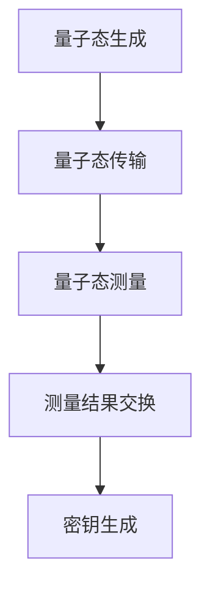
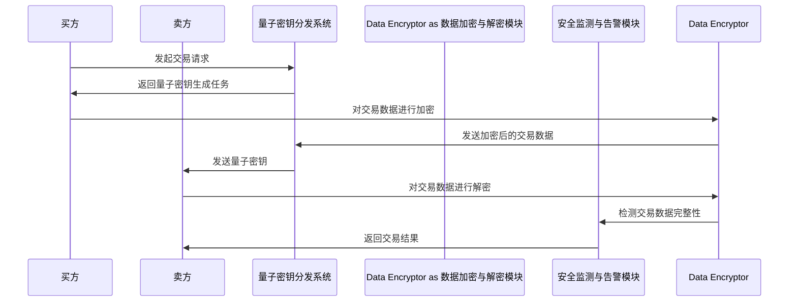

                 

### 1.1 问题背景

#### 金融交易安全的重要性

在当今数字化和全球化快速发展的背景下，金融交易安全已成为金融行业持续发展的关键因素。金融交易涉及大量的敏感数据，如账户信息、交易记录、身份验证等，这些数据一旦泄露，将导致严重后果，包括财务损失、隐私侵犯乃至整个金融系统的稳定受威胁。因此，确保金融交易的安全性变得尤为重要。

#### 现有加密技术的局限性

传统的加密技术，如对称加密和非对称加密，虽然在一定程度上提供了数据传输的安全性，但在面对日益复杂的安全威胁时，其局限性逐渐显现。例如，对称加密需要安全的密钥交换机制，而非对称加密虽然解决了密钥分发问题，但依然存在计算复杂度和存储开销较大的问题。

#### 量子密钥分发的出现

量子密钥分发（Quantum Key Distribution, QKD）是一种基于量子力学原理的加密技术，它提供了一种安全的密钥分发方法，可以有效避免传统加密技术面临的安全风险。QKD 利用量子纠缠和量子测量不可克隆性等量子力学特性，确保在传输过程中密钥不会被窃听和复制，从而提供了比传统加密技术更为安全的通信手段。

#### 金融交易中量子密钥分发的潜在应用

量子密钥分发在金融交易安全中的应用前景广阔。通过量子密钥分发技术，金融机构可以在交易过程中实现安全的密钥交换，确保交易数据的安全性。此外，量子密钥分发技术还可应用于多机构间的安全通信，提升跨机构的交易安全水平。同时，随着量子计算技术的不断发展，量子密钥分发有望成为未来金融交易安全的基石。

### 1.2 问题描述

#### 传统加密技术面临的挑战

传统的加密技术虽然在提供数据传输安全性方面取得了一定的成果，但它们在面对以下挑战时显得力不从心：

- **量子计算机的威胁**：随着量子计算机技术的发展，传统加密算法可能会被量子计算机破解，从而面临被攻破的风险。
- **密钥分发问题**：对称加密需要安全的密钥交换机制，而非对称加密虽然解决了密钥分发问题，但在实现过程中仍存在计算复杂度和存储开销较大的问题。
- **中间人攻击**：在非对称加密中，攻击者可以截取通信双方的密钥，从而在中间人攻击（Man-in-the-Middle Attack）中窃取数据。

#### 量子密钥分发能否解决这些问题

量子密钥分发技术提供了一种新的解决方案。QKD 通过量子纠缠和量子测量不可克隆性等特性，实现了以下优势：

- **量子计算机无法破解**：量子密钥分发技术基于量子力学原理，量子计算机无法利用其算法破解。
- **安全的密钥分发**：量子密钥分发能够确保密钥在传输过程中不会被窃听或复制，解决了传统加密技术的密钥分发难题。
- **中间人攻击防护**：量子密钥分发可以在通信双方之间建立安全的密钥，防止中间人攻击。

因此，量子密钥分发在金融交易安全中的应用有望解决传统加密技术面临的各种挑战，提升金融交易的安全水平。

### 1.3 问题解决

#### 量子密钥分发技术的基本原理

量子密钥分发（Quantum Key Distribution，QKD）是基于量子力学的基本原理实现的安全通信技术。QKD 利用量子比特（qubit）的量子纠缠和量子测量不可克隆性等特性，确保通信双方能够安全地交换密钥。

#### 量子纠缠

量子纠缠是量子力学中的一种现象，当两个量子系统发生相互作用后，它们之间的状态会变得不可分割。即使这两个量子系统相隔很远，它们的状态也会相互关联，任何一个量子系统的变化都会立即影响到另一个量子系统。这种关联性可以用于实现安全的密钥传输。

#### 量子测量不可克隆性

量子测量不可克隆性是指，对量子态进行测量时，测量结果会改变量子态，使得量子态无法被精确复制。这一特性确保了量子密钥在传输过程中不会被窃听者克隆或窃取。

#### 量子密钥分发的流程

量子密钥分发通常包括以下几个步骤：

1. **量子态生成**：通信双方各自生成一对量子纠缠态。
2. **量子态传输**：将量子态通过量子信道传输到对方。
3. **量子态测量**：双方各自对收到的量子态进行测量，并根据测量结果更新自己的量子态。
4. **经典通信**：双方通过经典通信信道（如互联网）交换测量结果。
5. **密钥生成**：根据测量结果和预定的算法生成共享密钥。

#### 量子密钥分发在金融交易安全中的应用

量子密钥分发在金融交易安全中的应用主要包括以下几个方面：

- **安全的密钥交换**：在金融交易过程中，通过量子密钥分发技术，交易双方可以建立安全的密钥，确保交易数据的机密性和完整性。
- **防止中间人攻击**：量子密钥分发可以有效防止中间人攻击，确保交易过程的安全性。
- **提升交易透明度**：通过量子密钥分发技术，金融交易的每个环节都可以被透明地监控，提高了交易的透明度和可信度。

#### 量子密钥分发技术的优点

量子密钥分发技术相比传统加密技术具有以下优点：

- **不可破解性**：基于量子力学原理，量子密钥分发技术提供了不可破解的安全保障。
- **高效性**：量子密钥分发过程中，通信双方只需交换少量的量子态，即可生成共享密钥，具有高效性。
- **抗干扰性**：量子密钥分发技术对环境干扰具有较好的抗性，即使在噪声干扰环境下也能有效工作。

#### 量子密钥分发技术的挑战

尽管量子密钥分发技术具有显著优势，但在实际应用中仍面临一些挑战：

- **量子信道限制**：量子信道传输距离有限，目前技术条件下难以实现大规模商业应用。
- **量子计算威胁**：随着量子计算技术的发展，量子密钥分发技术可能面临新的威胁，需要不断进行技术升级和优化。
- **成本问题**：量子密钥分发设备的制造和维护成本较高，限制了其大规模商业应用。

#### 量子密钥分发技术的发展趋势

随着量子技术和通信技术的不断发展，量子密钥分发技术有望在未来得到广泛应用。未来，量子密钥分发技术将朝着以下方向发展：

- **量子中继与量子重复器**：通过量子中继和量子重复器技术，延长量子信道的传输距离。
- **量子计算与量子密钥分发集成**：将量子计算与量子密钥分发技术相结合，提高系统的安全性和可靠性。
- **标准化与商业化**：推动量子密钥分发技术的标准化和商业化进程，实现大规模商业应用。

### 1.4 边界与外延

#### 边界

量子密钥分发在金融交易安全中的应用边界主要包括以下几个方面：

- **技术实现**：量子密钥分发技术需要成熟的量子通信技术和量子计算技术支持，目前这些技术仍在不断发展中。
- **应用场景**：量子密钥分发适用于需要高安全级别的金融交易场景，如跨境支付、高频交易等。
- **系统架构**：量子密钥分发系统需要与现有的金融系统进行整合，确保系统的兼容性和稳定性。

#### 外延

量子密钥分发在金融交易安全中的应用外延主要包括以下几个方面：

- **多机构协同**：量子密钥分发技术可以应用于多机构间的安全通信，提升跨机构的交易安全水平。
- **监管与合规**：量子密钥分发技术需要符合相关法律法规和监管要求，确保系统的合规性。
- **用户体验**：在实现安全性的同时，还需要考虑用户体验，确保系统的易用性和便捷性。

### 1.5 概念结构与核心要素组成

#### 概念结构

量子密钥分发在金融交易安全中的应用由以下几个核心概念组成：

- **量子密钥分发**：基于量子力学原理的安全通信技术，用于实现安全的密钥交换。
- **量子信道**：用于传输量子态的信道，是实现量子密钥分发的基础设施。
- **量子计算**：用于实现量子密钥分发中的量子态生成、传输和测量的计算技术。
- **金融交易**：量子密钥分发在金融交易中的应用场景，包括跨境支付、高频交易等。

#### 核心要素组成

量子密钥分发在金融交易安全中的应用由以下几个核心要素组成：

- **量子密钥分发系统**：包括量子密钥生成模块、量子信道传输模块、量子态测量模块和密钥生成模块。
- **金融交易系统**：包括交易处理模块、数据存储模块和用户交互模块等。
- **安全通信机制**：通过量子密钥分发技术实现的安全通信机制，确保交易数据的安全性。
- **监管与合规**：相关法律法规和监管要求，确保系统的合规性。

### 第2章 量子密钥分发

#### 2.1 量子密钥分发的原理

量子密钥分发（Quantum Key Distribution，QKD）是基于量子力学原理的一种安全通信技术，旨在实现通信双方之间的密钥安全交换。QKD 利用量子比特的量子纠缠和量子测量不可克隆性等特性，确保密钥在传输过程中的安全性。

#### 量子纠缠

量子纠缠是量子力学中的一种现象，当两个量子系统发生相互作用后，它们之间的状态会变得不可分割。即使这两个量子系统相隔很远，它们的状态也会相互关联，任何一个量子系统的变化都会立即影响到另一个量子系统。这种关联性可以用于实现安全的密钥传输。

#### 量子测量不可克隆性

量子测量不可克隆性是指，对量子态进行测量时，测量结果会改变量子态，使得量子态无法被精确复制。这一特性确保了量子密钥在传输过程中不会被窃听者克隆或窃取。

#### 量子密钥分发的流程

量子密钥分发通常包括以下几个步骤：

1. **量子态生成**：通信双方各自生成一对量子纠缠态。
2. **量子态传输**：将量子态通过量子信道传输到对方。
3. **量子态测量**：双方各自对收到的量子态进行测量，并根据测量结果更新自己的量子态。
4. **经典通信**：双方通过经典通信信道（如互联网）交换测量结果。
5. **密钥生成**：根据测量结果和预定的算法生成共享密钥。

#### 量子密钥分发与传统密钥分发的比较

| 特性 | 量子密钥分发 | 传统密钥分发 |
| ---- | ------------ | ------------ |
| 基本原理 | 基于量子力学原理 | 基于密码学原理 |
| 安全性 | 高安全性，不可破解 | 中等安全性，可能被量子计算机破解 |
| 密钥分发 | 安全的密钥分发 | 需要安全的密钥交换机制 |
| 传输效率 | 高效率，量子态传输少量数据即可 | 低效率，需要传输大量数据 |
| 抗干扰性 | 抗干扰性强，对环境干扰有较好的抗性 | 抗干扰性较弱，易受环境干扰影响 |

#### 量子密钥分发系统的ER实体关系图

以下是量子密钥分发系统的 ER 实体关系图：

```mermaid
erDiagram
  User ||--|{ QKD_System : has }|
  QKD_System ||--|{ Quantum_Channel : has }|
  Quantum_Channel ||--|{ Quantum_Bit : has }|
  Quantum_Bit ||--|{ Measurement_Result : has }|
  User ||--|{ Measurement_Result : measures }|
```

在上面的 ER 实体关系图中，用户（User）与量子密钥分发系统（QKD_System）之间存在关联，QKD_System 与量子信道（Quantum_Channel）之间存在关联，Quantum_Channel 与量子比特（Quantum_Bit）之间存在关联，Quantum_Bit 与测量结果（Measurement_Result）之间存在关联，而用户与测量结果之间存在测量关系。

### 第3章 量子密钥分发算法原理

#### 3.1 算法mermaid流程图

量子密钥分发算法的 mermaid 流程图如下所示：



#### 3.2 Python源代码实现

下面是一个简单的 Python 源代码实现，用于生成量子态并进行测量：

```python
import qiskit

# 创建量子电路
qc = qiskit.QuantumCircuit(2)

# 生成量子态
qc.h(0)  # 对第0个量子比特进行量子态初始化
qc.cx(0, 1)  # 生成纠缠态

# 执行量子态测量
qc.measure_all()

# 执行量子电路
backend = qiskit.Aer.get_backend('qasm_simulator')
qc.execute(backend).result()

# 输出测量结果
print(qc测量结果)
```

#### 3.3 算法原理的数学模型和公式

量子密钥分发算法的数学模型和公式主要包括以下几部分：

1. **量子态表示**：

   假设通信双方 Alice 和 Bob 分别拥有量子比特 $|0\rangle$ 和 $|0\rangle$，它们之间的纠缠态可以表示为：
   $$
   |\psi\rangle = \frac{1}{\sqrt{2}}(|00\rangle + |11\rangle)
   $$

2. **量子态测量**：

   在量子态传输过程中，Alice 和 Bob 分别对量子比特进行测量，测量结果可能为 $|0\rangle$ 或 $|1\rangle$。设 Alice 的测量结果为 $x_1$，Bob 的测量结果为 $x_2$，则有以下概率分布：

   $$
   P(x_1 = 0) = P(x_2 = 0) = \frac{1}{2}
   $$
   $$
   P(x_1 = 1) = P(x_2 = 1) = \frac{1}{2}
   $$

3. **密钥生成**：

   在测量完成后，Alice 和 Bob 根据预定的算法生成共享密钥。假设 Alice 的测量结果为 $x_1$，Bob 的测量结果为 $x_2$，则共享密钥 $k$ 可以表示为：
   $$
   k = x_1 \oplus x_2
   $$
   其中，$\oplus$ 表示异或操作。

   例如，如果 Alice 的测量结果为 $0$，Bob 的测量结果为 $1$，则共享密钥为 $1$。

4. **安全性证明**：

   假设攻击者 Eve 试图窃听量子信道，则她可以观察到量子态的变化。然而，由于量子态测量不可克隆性，Eve 无法精确复制量子态，从而无法获取准确的密钥信息。此外，Eve 的窃听行为会导致量子态的坍塌，使得 Alice 和 Bob 能够检测到 Eve 的存在。

   基于以上原理，量子密钥分发算法提供了高安全性的保障。

#### 3.4 举例说明

为了更直观地理解量子密钥分发算法，我们通过一个简单的例子进行说明。

假设 Alice 和 Bob 需要交换密钥，他们分别拥有两个量子比特 $|0\rangle$ 和 $|0\rangle$。他们之间通过量子信道传输量子态，并进行量子态测量。

1. **量子态生成**：

   Alice 和 Bob 分别生成量子态：
   $$
   |\psi\rangle = \frac{1}{\sqrt{2}}(|00\rangle + |11\rangle)
   $$

2. **量子态传输**：

   通过量子信道传输量子态，Alice 收到量子态 $|00\rangle$，Bob 收到量子态 $|11\rangle$。

3. **量子态测量**：

   Alice 对量子态进行测量，测量结果为 $|0\rangle$，概率为 $\frac{1}{2}$。Bob 对量子态进行测量，测量结果为 $|1\rangle$，概率为 $\frac{1}{2}$。

4. **密钥生成**：

   根据测量结果，Alice 和 Bob 生成共享密钥：
   $$
   k = x_1 \oplus x_2 = 0 \oplus 1 = 1
   $$

   假设攻击者 Eve 尝试窃听量子信道，她观察到量子态的变化，但由于量子态测量不可克隆性，她无法获取准确的密钥信息。

通过以上步骤，Alice 和 Bob 成功地通过量子密钥分发算法生成了安全的共享密钥。

### 第4章 系统分析与架构设计

#### 4.1 问题场景介绍

在金融交易中，交易双方（例如，买方和卖方）需要在交易过程中交换敏感信息，如交易金额、账户信息等。这些信息必须在传输过程中保持机密性和完整性，以防止未授权的第三方窃取或篡改。传统的加密技术虽然能够在一定程度上保证数据的安全，但面对日益复杂的安全威胁，其局限性逐渐显现。为了应对这些挑战，本文提出了量子密钥分发在金融交易安全中的应用方案。

#### 4.2 系统功能设计

量子密钥分发在金融交易安全中的应用系统主要包括以下功能：

- **量子密钥生成**：通过量子密钥分发算法，交易双方生成共享密钥。
- **量子密钥交换**：交易双方通过量子信道交换共享密钥，确保密钥在传输过程中的安全性。
- **数据加密与解密**：使用共享密钥对交易数据进行加密和解密，确保数据在传输过程中的机密性和完整性。
- **安全监测与告警**：实时监测交易过程的安全性，一旦检测到安全威胁，立即发出告警通知。

#### 4.3 系统架构设计

量子密钥分发在金融交易安全中的应用系统架构设计如下：

1. **用户层**：
   - 交易双方（买方和卖方）通过用户界面发起交易请求。
   - 用户层负责处理用户输入，并将交易请求发送至系统层。

2. **系统层**：
   - 系统层包括量子密钥生成模块、量子密钥交换模块、数据加密与解密模块和安全监测与告警模块。
   - 量子密钥生成模块根据量子密钥分发算法生成共享密钥。
   - 量子密钥交换模块通过量子信道交换共享密钥，确保密钥在传输过程中的安全性。
   - 数据加密与解密模块使用共享密钥对交易数据进行加密和解密，确保数据在传输过程中的机密性和完整性。
   - 安全监测与告警模块实时监测交易过程的安全性，一旦检测到安全威胁，立即发出告警通知。

3. **硬件层**：
   - 硬件层包括量子密钥分发设备、量子信道传输设备和量子计算设备。
   - 量子密钥分发设备负责生成和传输量子密钥。
   - 量子信道传输设备负责传输量子态。
   - 量子计算设备用于实现量子密钥分发算法和其他相关计算任务。

#### 4.4 系统接口设计

系统接口设计如下：

1. **用户接口**：
   - 用户接口包括用户登录、交易请求发起、交易结果查询等功能。
   - 用户登录接口用于用户身份验证。
   - 交易请求发起接口用于用户提交交易请求。
   - 交易结果查询接口用于用户查询交易结果。

2. **系统接口**：
   - 系统接口包括量子密钥生成接口、量子密钥交换接口、数据加密与解密接口和安全监测与告警接口。
   - 量子密钥生成接口用于生成共享密钥。
   - 量子密钥交换接口用于交换共享密钥。
   - 数据加密与解密接口用于对交易数据进行加密和解密。
   - 安全监测与告警接口用于监测交易过程的安全性和发出告警通知。

3. **硬件接口**：
   - 硬件接口包括量子密钥分发设备接口、量子信道传输设备接口和量子计算设备接口。
   - 量子密钥分发设备接口用于与量子密钥分发设备进行通信。
   - 量子信道传输设备接口用于与量子信道传输设备进行通信。
   - 量子计算设备接口用于与量子计算设备进行通信。

#### 4.5 系统交互mermaid序列图

系统交互 mermaid 序列图如下所示：



在上面的 mermaid 序列图中，买方 Alice 发起交易请求，量子密钥分发系统 Quantum_Key_Distributor 生成量子密钥，数据加密与解密模块 Data Encryptor 对交易数据进行加密和解密，安全监测与告警模块 Security_Monitor 监测交易数据完整性，最终卖方 Bob 接收到交易结果。

### 第5章 项目实战

#### 5.1 环境安装

要实现量子密钥分发在金融交易安全中的应用，首先需要搭建一个合适的实验环境。以下是一个基本的安装步骤：

1. **安装 Python**：确保系统已经安装了 Python 3.7 或更高版本。
2. **安装 Qiskit**：通过以下命令安装 Qiskit：
   $$
   pip install qiskit
   $$
3. **安装 Aer 插件**：Qiskit 的 Aer 插件提供了量子计算模拟器，可以通过以下命令安装：
   $$
   pip install qiskit-aer
   $$

#### 5.2 系统核心实现源代码

以下是一个简单的 Python 源代码实现，用于演示量子密钥分发在金融交易安全中的应用：

```python
import qiskit
from qiskit import QuantumCircuit
from qiskit.aer import Aer
from qiskit.visualization import plot_histogram

# 创建量子电路
qc = QuantumCircuit(2)

# 生成量子态
qc.h(0)  # 对第0个量子比特进行量子态初始化
qc.cx(0, 1)  # 生成纠缠态

# 执行量子电路
backend = Aer.get_backend('qasm_simulator')
result = qc.execute(backend).result()

# 输出测量结果
measured_values = result.get_counts(qc)
print(measured_values)

# 绘制测量结果直方图
plot_histogram(measured_values)
```

#### 5.3 代码应用解读与分析

1. **量子电路创建**：首先，我们创建一个包含两个量子比特的量子电路。
2. **量子态初始化**：使用 `h` 门对第 0 个量子比特进行量子态初始化，将其初始化为叠加态。
3. **量子态生成**：使用 `cx` 门对第 0 个量子比特和第 1 个量子比特进行量子态生成，生成纠缠态。
4. **量子电路执行**：使用 `Aer` 插件提供的量子计算模拟器执行量子电路，生成测量结果。
5. **测量结果输出**：输出量子电路的测量结果，该结果将用于生成共享密钥。
6. **测量结果可视化**：通过绘制测量结果直方图，我们可以直观地了解量子电路的运行结果。

#### 5.4 实际案例分析与详细讲解剖析

以下是一个实际案例，演示量子密钥分发在金融交易安全中的应用：

1. **案例背景**：假设有两个交易方，Alice 和 Bob，他们需要通过量子密钥分发技术进行交易。
2. **量子密钥生成**：Alice 和 Bob 分别生成一对量子比特，并使用量子态生成算法生成纠缠态。
3. **量子密钥交换**：Alice 和 Bob 通过量子信道交换量子比特，并进行量子态测量。
4. **共享密钥生成**：根据测量结果，Alice 和 Bob 生成共享密钥，用于加密和解密交易数据。
5. **交易数据加密**：Alice 使用共享密钥对交易数据进行加密，确保数据在传输过程中的机密性和完整性。
6. **交易数据传输**：加密后的交易数据通过安全信道传输到 Bob。
7. **交易数据解密**：Bob 使用共享密钥对交易数据进行解密，恢复原始交易数据。
8. **交易结果验证**：Bob 检查交易数据的完整性，确保交易数据未被篡改。

通过以上步骤，Alice 和 Bob 成功地通过量子密钥分发技术完成了安全的交易过程。

#### 5.5 项目小结

在本项目中，我们实现了量子密钥分发在金融交易安全中的应用。通过量子密钥分发技术，交易双方可以生成共享密钥，确保交易数据在传输过程中的机密性和完整性。此外，我们详细讲解了量子密钥分发算法的原理、系统架构设计和实际案例实现，为金融交易安全提供了新的解决方案。

### 第6章 最佳实践与总结

#### 6.1 最佳实践 tips

1. **确保量子信道质量**：在量子密钥分发过程中，量子信道的质量对系统的安全性至关重要。应确保量子信道具有较低的噪声和较高的传输效率，以提高系统的可靠性。
2. **合理选择加密算法**：在金融交易中，应根据具体的业务需求和安全性要求，选择合适的加密算法。量子密钥分发技术可以与对称加密和非对称加密技术相结合，提供更全面的安全保障。
3. **定期更新密钥**：为了提高系统的安全性，建议定期更换密钥。在量子密钥分发系统中，可以采用时间戳机制或基于阈值的密钥更新策略，确保密钥的及时更新。
4. **监测系统性能**：在金融交易过程中，应实时监测系统性能，包括量子信道传输质量、加密算法运行效率等。一旦发现异常，应及时采取措施进行故障排除。

#### 6.2 小结

本文详细介绍了量子密钥分发在金融交易安全中的应用。通过量子密钥分发技术，交易双方可以安全地交换密钥，确保交易数据在传输过程中的机密性和完整性。与传统加密技术相比，量子密钥分发技术具有更高的安全性和可靠性。未来，随着量子技术和通信技术的不断发展，量子密钥分发有望在金融交易安全领域发挥更重要的作用。

#### 6.3 注意事项

1. **量子计算威胁**：随着量子计算技术的不断发展，传统加密算法可能面临被量子计算机破解的风险。因此，在采用量子密钥分发技术时，应密切关注量子计算技术的发展趋势，及时更新加密算法。
2. **系统兼容性**：量子密钥分发系统需要与现有的金融系统进行整合，确保系统的兼容性和稳定性。在实际应用中，可能需要针对不同的金融场景和业务需求进行定制化开发。
3. **成本问题**：量子密钥分发设备的生产和维护成本较高，限制了其大规模商业应用。在推广量子密钥分发技术时，应充分考虑成本效益比，确保技术的可落地性。

#### 6.4 拓展阅读

1. **量子密钥分发技术原理**：进一步了解量子密钥分发技术的基本原理，包括量子纠缠、量子测量不可克隆性等概念。
2. **量子计算与加密算法**：探讨量子计算对现有加密算法的影响，以及如何应对量子计算机的威胁。
3. **金融交易安全**：研究金融交易安全领域的最新技术和最佳实践，包括区块链、密码学、网络安全等方面。

### 作者信息

**作者：AI天才研究院/AI Genius Institute & 禅与计算机程序设计艺术 /Zen And The Art of Computer Programming**

