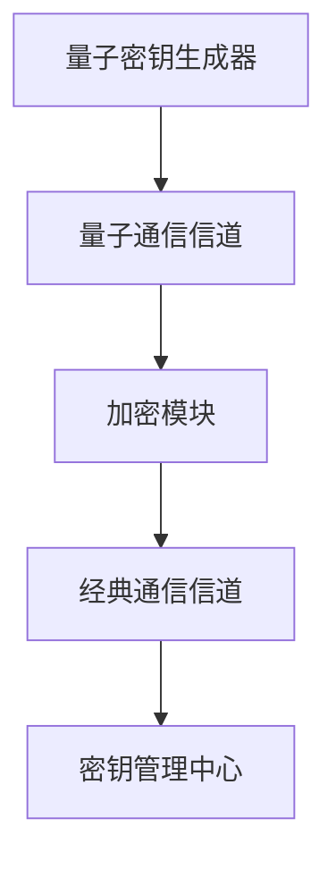
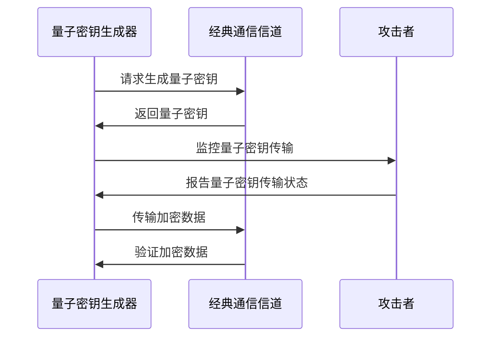
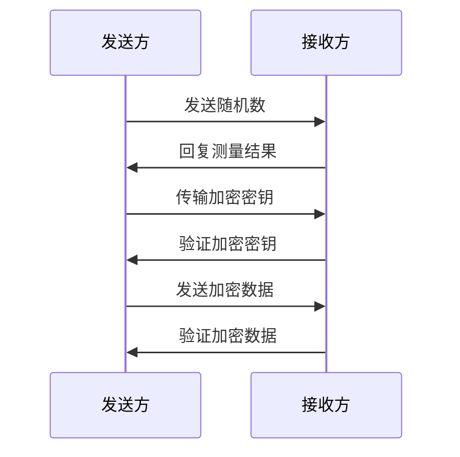

                 

## 量子密钥分发在金融安全中的应用

> 关键词：量子密钥分发，金融安全，QKD，信息安全，加密技术

在信息时代，金融安全成为各行业关注的核心议题之一。随着网络技术的发展，金融交易越来越多地依赖于电子化和网络化，信息安全面临前所未有的挑战。传统的加密技术虽然在保护数据传输安全方面发挥了重要作用，但面对日益复杂的安全威胁，其局限性愈发明显。量子密钥分发（Quantum Key Distribution，QKD）作为一种基于量子力学原理的全新加密技术，为金融安全提供了前所未有的保障。本文将深入探讨量子密钥分发在金融安全中的应用，分析其原理、挑战以及未来前景。

本文将从以下几个方面进行探讨：

1. **引言**：介绍量子密钥分发和金融安全的重要性。
2. **量子密钥分发原理**：详细讲解量子密钥分发的技术原理。
3. **金融安全挑战与QKD应用**：分析金融安全面临的挑战以及量子密钥分发如何解决这些问题。
4. **QKD在金融领域的应用案例**：介绍实际应用案例。
5. **QKD的挑战与未来展望**：讨论量子密钥分发技术的发展趋势和未来应用前景。
6. **QKD系统设计与实现**：介绍量子密钥分发系统的设计原则和实现过程。
7. **总结与展望**：总结本文的核心内容，并对量子密钥分发在金融安全中的应用前景进行展望。

### 1. 引言

#### 1.1 问题背景

金融安全关乎整个经济体系的稳定运行。随着网络攻击、数据泄露、金融诈骗等安全事件的频发，金融信息安全已成为社会各界关注的焦点。传统的加密技术虽然在保障数据传输安全方面发挥了重要作用，但它们无法抵御量子计算攻击，而量子计算的发展正在不断挑战传统加密技术的安全性。为了应对这一挑战，量子密钥分发技术应运而生。

#### 1.2 量子密钥分发概述

量子密钥分发是一种基于量子力学原理的加密技术，它利用量子纠缠和量子态的不可克隆特性来实现密钥的传输。与传统加密技术不同，量子密钥分发能够在信息传输过程中实现实时的安全监控和检测，从而确保密钥的安全传输。

#### 1.3 金融安全面临的挑战

金融安全面临的挑战主要包括以下几个方面：

- **量子计算威胁**：随着量子计算的发展，传统加密算法的破解速度将呈指数级增长，传统的加密技术面临被量子计算破解的风险。
- **网络攻击**：金融系统高度依赖网络，网络攻击如DDoS攻击、SQL注入等威胁金融系统的稳定性。
- **数据泄露**：金融数据具有极高的商业价值，数据泄露可能导致严重的经济损失和声誉损失。

### 2. 量子密钥分发原理

#### 2.1 量子力学基础

量子密钥分发技术的基础是量子力学原理，其中最重要的是量子纠缠和量子态的不可克隆特性。量子纠缠是指两个量子系统之间存在一种特殊的关联，这种关联使得一个系统的状态可以即时影响另一个系统。量子态的不可克隆特性是指无法精确复制一个量子态。

#### 2.2 QKD基本原理

量子密钥分发的基本原理是通过量子通信信道（如光纤、无线信道等）传输量子态，实现密钥的传输。具体过程如下：

1. **密钥生成**：发送方随机选择一组基向量，并利用量子态将其编码在量子比特上。
2. **量子态传输**：通过量子通信信道将编码后的量子态传输给接收方。
3. **测量与纠错**：接收方对收到的量子态进行测量，并根据测量结果对密钥进行纠错。
4. **密钥安全确认**：发送方和接收方通过经典通信信道交换加密密钥，并对密钥进行安全确认。

#### 2.3 QKD安全性分析

量子密钥分发技术具有以下安全性保证：

- **量子态不可克隆**：由于量子态的不可克隆特性，攻击者无法复制密钥。
- **量子态测量扰动**：攻击者对量子态进行测量时，会导致量子态的扰动，从而被发现。
- **实时监控与检测**：量子密钥分发过程中，双方可以实时监控传输过程，确保密钥的安全传输。

### 3. 金融安全挑战与QKD应用

#### 3.1 金融安全现状

当前，金融安全面临的主要威胁包括：

- **量子计算威胁**：传统加密技术面临量子计算破解的风险。
- **网络攻击**：网络攻击如DDoS攻击、SQL注入等威胁金融系统的稳定性。
- **数据泄露**：金融数据具有极高的商业价值，数据泄露可能导致严重的经济损失和声誉损失。

#### 3.2 QKD在金融安全中的应用

量子密钥分发技术在金融安全中的应用主要包括以下几个方面：

- **加密通信**：通过量子密钥分发技术生成安全的加密密钥，确保金融数据的传输安全。
- **安全认证**：利用量子密钥分发技术实现安全认证，防止伪造和篡改。
- **网络监控**：通过量子密钥分发技术实现实时网络监控，及时发现和防范网络攻击。

#### 3.3 QKD与其他安全技术的结合

量子密钥分发技术可以与其他安全技术相结合，如：

- **区块链技术**：结合区块链技术，实现去中心化的安全金融交易。
- **加密货币**：利用量子密钥分发技术确保加密货币的交易安全。

### 4. QKD在金融领域的应用案例

#### 4.1 某银行的安全改造

某银行在网络安全方面面临着严重的威胁，通过引入量子密钥分发技术，实现了以下目标：

- **加密通信**：利用QKD技术生成安全的加密密钥，确保数据传输安全。
- **安全认证**：通过QKD技术实现安全认证，防止伪造和篡改。
- **网络监控**：实时监控网络，及时发现和防范网络攻击。

#### 4.2 某金融交易所的安全部署

某金融交易所在面临网络攻击和数据泄露的威胁下，通过引入量子密钥分发技术，实现了以下目标：

- **加密通信**：确保交易数据的安全传输。
- **安全认证**：实现交易双方的安全认证。
- **网络监控**：实时监控网络，防范网络攻击。

#### 4.3 跨境支付的安全保障

跨境支付涉及到大量的金融数据传输，通过引入量子密钥分发技术，确保跨境支付数据的安全传输，防止数据泄露和篡改。

### 5. QKD的挑战与未来展望

#### 5.1 QKD面临的挑战

量子密钥分发技术虽然具有巨大的潜力，但同时也面临着一些挑战：

- **技术成熟度**：QKD技术尚处于研发阶段，其技术成熟度和稳定性有待提高。
- **成本**：QKD设备成本较高，限制了其大规模应用。
- **传输距离**：当前QKD技术传输距离较短，需要进一步研发和优化。

#### 5.2 QKD的技术趋势

随着量子技术的不断发展，量子密钥分发技术有望实现以下趋势：

- **技术成熟**：随着技术的不断进步，QKD技术的成熟度和稳定性将不断提高。
- **成本下降**：随着大规模生产和技术的进步，QKD设备的成本有望大幅下降。
- **传输距离增加**：通过改进量子中继和量子纠缠技术，QKD传输距离有望增加。

#### 5.3 QKD在金融安全中的应用前景

量子密钥分发技术在金融安全中的应用前景广阔，未来有望实现以下目标：

- **全面应用**：量子密钥分发技术将在金融行业的各个方面得到广泛应用。
- **去中心化金融**：结合区块链技术，实现去中心化的安全金融交易。
- **全球化金融**：通过量子密钥分发技术，实现全球金融数据的实时安全传输。

### 6. QKD系统设计与实现

#### 6.1 系统设计

量子密钥分发系统的设计原则是确保密钥的安全生成、传输和存储。系统架构包括量子密钥生成模块、量子通信模块、经典通信模块和密钥管理模块。

#### 6.2 系统实现

量子密钥分发系统的实现过程包括以下几个步骤：

1. **量子密钥生成**：利用量子器件生成随机量子密钥。
2. **量子通信**：通过量子通信信道传输量子密钥。
3. **经典通信**：通过经典通信信道传输加密密钥。
4. **密钥管理**：对生成的密钥进行存储和管理。

#### 6.3 系统测试与优化

量子密钥分发系统的测试和优化包括以下几个方面：

- **功能测试**：测试系统各功能模块的正确性。
- **性能测试**：测试系统传输速度和延迟。
- **稳定性测试**：测试系统在长时间运行下的稳定性。

### 7. 总结与展望

#### 7.1 小结

本文从量子密钥分发和金融安全的背景出发，详细介绍了量子密钥分发的技术原理、在金融安全中的应用以及面临的挑战和未来展望。量子密钥分发技术为金融安全提供了全新的解决方案，有望在未来实现全面应用。

#### 7.2 注意事项

在应用量子密钥分发技术时，需要注意以下几点：

- **技术成熟度**：当前QKD技术尚处于研发阶段，需关注技术成熟度和稳定性。
- **成本**：QKD设备成本较高，需考虑经济可行性。
- **传输距离**：当前QKD传输距离较短，需关注传输距离的扩展。

#### 7.3 拓展阅读

- **量子密钥分发技术**：深入了解量子密钥分发技术的原理和应用。
- **金融信息安全**：学习金融信息安全的相关知识。
- **量子计算**：了解量子计算的基本原理和发展趋势。

## 作者

**作者：AI天才研究院/AI Genius Institute & 禅与计算机程序设计艺术 /Zen And The Art of Computer Programming**

---

**文章标题**：量子密钥分发在金融安全中的应用

**摘要**：本文深入探讨了量子密钥分发技术在金融安全中的应用，分析了量子密钥分发的基本原理、金融安全面临的挑战以及QKD在金融领域的实际应用案例。同时，本文还对QKD技术面临的挑战和未来发展趋势进行了展望，为量子密钥分发在金融安全领域的应用提供了有益的参考。

---

### 量子密钥分发（QKD）的原理及技术细节

量子密钥分发（QKD）是一种基于量子力学原理的加密技术，旨在确保通信双方能够安全地生成和共享密钥。与传统加密方法不同，QKD利用量子态的不可克隆特性和量子纠缠效应，提供了一种更为安全的密钥传输方式。

#### 量子力学基础

量子密钥分发技术依赖于量子力学中的两个核心概念：量子纠缠和量子态的不可克隆性。

1. **量子纠缠**：当两个粒子处于量子纠缠状态时，它们之间的量子态将即时相互关联。无论这两个粒子相隔多远，对其中一个粒子的测量都会即时影响到另一个粒子的状态。这种即时的量子态变化无法通过经典物理过程实现。

2. **量子态的不可克隆性**：根据量子力学的基本原理，一个未观测的量子态无法被精确复制。这意味着，任何试图复制量子态的尝试都会不可避免地导致量子态的破坏。

#### QKD的基本原理

量子密钥分发的过程可以分为以下几个步骤：

1. **密钥生成**：
    - **随机数生成**：发送方和接收方各自生成一个随机数序列，这些随机数将用于生成密钥。
    - **量子态编码**：发送方将随机数序列编码到量子态上，通常使用的是光子的偏振状态。例如，发送方可以选择垂直和水平两种偏振状态，并将随机数序列映射到这些状态上。

2. **量子态传输**：
    - **量子信道传输**：发送方将编码后的量子态通过量子信道传输给接收方。量子信道可以是光纤、自由空间或量子中继链路。

3. **量子态测量**：
    - **基选择**：接收方随机选择一个基向量（例如，垂直或水平基）对收到的量子态进行测量。
    - **结果记录**：接收方将测量结果记录下来，并与发送方共享测量结果。

4. **密钥提取**：
    - **对比测量结果**：发送方和接收方通过经典通信信道（例如，互联网）交换测量结果。
    - **筛选安全比特**：双方根据预先约定的协议筛选出一致的结果，这些一致的结果将组成最终的密钥。

#### QKD的安全性分析

量子密钥分发的安全性基于以下几个原则：

1. **量子态不可克隆性**：任何对量子态的非法复制都会导致量子态的破坏，从而被合法的通信双方检测到。
2. **量子态测量扰动**：在测量量子态时，接收方的测量会不可避免地扰动量子态，如果攻击者试图进行窃听，他们也会引起量子态的扰动，从而被检测到。
3. **实时监控**：由于量子态的不可克隆性和测量扰动，通信双方可以实时监控通信过程，确保密钥的安全性。

#### 对比表格：量子密钥分发与传统加密技术

| 特性             | 量子密钥分发               | 传统加密技术            |
|------------------|----------------------------|-------------------------|
| 基本原理         | 基于量子力学原理           | 基于数学算法           |
| 安全性保证       | 量子态不可克隆性、测量扰动 | 计算复杂度、密码学原理 |
| 密钥生成         | 随机量子态生成             | 随机数生成器           |
| 密钥传输         | 量子态传输                 | 经典通信信道           |
| 监控与检测       | 实时监控与检测             | 事后检测               |
| 传输距离         | 长距离传输需量子中继       | 无限距离传输           |

#### ER实体关系图架构

为了更清晰地展示QKD系统的实体关系，我们可以使用Mermaid ER图来表示：

```mermaid
erDiagram
  User ||--|{ QuantumKey }|
  User ||--|{ QuantumChannel }|
  QuantumKey ||--|{ EncryptionAlgorithm }|
  QuantumChannel ||--|{ QuantumNode }|
  User ||--|{ ClassicalChannel }|
```

在这个ER图中，`User`实体与`QuantumKey`、`QuantumChannel`、`EncryptionAlgorithm`和`ClassicalChannel`实体之间存在关联关系。`QuantumKey`用于存储量子密钥，`QuantumChannel`表示量子通信信道，`EncryptionAlgorithm`用于加密数据，`ClassicalChannel`表示经典通信信道。

### 算法原理讲解

量子密钥分发的过程可以抽象为一个数学模型，其核心是量子态的编码、传输和测量。以下是QKD的基本数学模型：

1. **量子态编码**：
    发送方选择两个正交的基向量$\{|0\rangle, |1\rangle\}$，并将随机数$R_S$映射到量子态$\Psi_{R_S}$上，即：
    $$ \Psi_{R_S} = \frac{1}{\sqrt{2}}(|0\rangle_S \otimes |R_S\rangle_E + |1\rangle_S \otimes |R_S\rangle_E) $$
    其中，$|R_S\rangle_E$表示接收方的量子态，$S$和$E$分别代表发送方和接收方。

2. **量子态传输**：
    发送方将量子态$\Psi_{R_S}$通过量子信道传输给接收方。

3. **量子态测量**：
    接收方选择一个基向量$\{|0\rangle, |1\rangle\}$对量子态进行测量。设接收方选择的基向量为$B_R$，测量结果为$M_R$，即：
    $$ M_R = \text{tr}(|B_R\rangle \langle B_R|\otimes |E\rangle \langle E|\Psi_{R_S}) $$
    接收方将测量结果发送给发送方。

4. **密钥提取**：
    发送方和接收方通过经典通信信道交换测量结果，并根据预定的纠错协议筛选出一致的测量结果，作为安全的密钥。

以下是QKD的Python代码实现：

```python
import numpy as np

def encode_key(R_S):
    """
    编码量子态。
    :param R_S: 随机数序列。
    :return: 编码后的量子态。
    """
    state = np.array([[1.0, 0.0], [0.0, 1.0]])
    for bit in R_S:
        if bit == 0:
            state = np.kron(state, np.array([[1.0, 0.0], [0.0, 1.0]]))
        else:
            state = np.kron(state, np.array([[0.0, 1.0], [1.0, 0.0]]))
    return state

def measure_key(state):
    """
    测量量子态。
    :param state: 量子态。
    :return: 测量结果。
    """
    B_R = np.random.choice([0, 1])
    if B_R == 0:
        result = np.dot(state, np.array([[1.0, 0.0], [0.0, 1.0]]))
    else:
        result = np.dot(state, np.array([[0.0, 1.0], [1.0, 0.0]]))
    return result

def extract_key(R_S, M_R):
    """
    提取安全密钥。
    :param R_S: 发送方随机数序列。
    :param M_R: 接收方测量结果。
    :return: 安全密钥。
    """
    key = []
    for i in range(len(R_S)):
        if R_S[i] == M_R[i]:
            key.append(1)
        else:
            key.append(0)
    return key

# 生成随机数序列
R_S = np.random.randint(0, 2, size=10)

# 编码量子态
state = encode_key(R_S)

# 测量量子态
M_R = measure_key(state)

# 提取安全密钥
key = extract_key(R_S, M_R)

print("生成的随机数序列:", R_S)
print("测量结果:", M_R)
print("安全密钥:", key)
```

通过上述代码，我们可以看到量子密钥分发的算法原理是如何通过Python代码实现的。在这个例子中，我们使用了随机数生成、量子态编码、量子态测量和密钥提取的基本步骤来生成安全密钥。

### QKD系统设计与实现

#### 问题场景介绍

在金融行业中，安全传输敏感信息（如交易数据、账户信息等）至关重要。传统的加密技术虽然在一定程度上保障了数据的安全性，但面对量子计算的发展，这些技术的安全性正受到严峻挑战。为了确保金融数据的安全传输，需要一种能够抵御量子计算攻击的新型加密技术，量子密钥分发（QKD）技术应运而生。

#### 项目介绍

本项目的目标是设计并实现一个基于QKD的金融数据安全传输系统。该系统旨在利用QKD技术生成安全的加密密钥，并通过加密密钥对金融数据进行加密传输，从而确保数据传输的安全性。系统设计考虑了量子密钥生成、量子通信信道、经典通信信道以及密钥管理等多个模块。

#### 系统功能设计

1. **量子密钥生成模块**：生成随机量子密钥，确保密钥的安全性和随机性。
2. **量子通信模块**：实现量子密钥的传输，确保量子信道的安全性。
3. **经典通信模块**：实现加密密钥和数据的传输，确保经典通信信道的安全性。
4. **密钥管理模块**：管理生成的密钥，包括密钥生成、存储、分发和销毁等。

#### 系统架构设计

量子密钥分发系统架构主要包括以下几个部分：

1. **量子密钥生成器**：负责生成随机量子密钥。
2. **量子通信信道**：用于传输量子密钥。
3. **经典通信信道**：用于传输加密密钥和加密数据。
4. **密钥管理中心**：管理密钥的生成、分发和销毁。
5. **加密模块**：使用量子密钥对金融数据进行加密传输。

以下是系统架构的Mermaid图表示：



#### 系统接口设计

量子密钥分发系统的主要接口包括：

1. **量子密钥生成接口**：生成随机量子密钥。
2. **量子通信接口**：发送和接收量子密钥。
3. **经典通信接口**：发送和接收加密密钥和加密数据。
4. **密钥管理接口**：管理密钥的生成、分发和销毁。

以下是系统接口设计的Mermaid图表示：



#### 系统交互设计

量子密钥分发系统的交互过程包括以下几个步骤：

1. **密钥生成**：量子密钥生成器生成随机量子密钥。
2. **密钥传输**：量子密钥通过量子通信信道传输到接收方。
3. **密钥验证**：接收方对量子密钥进行验证，确保密钥的完整性。
4. **数据加密**：使用量子密钥对金融数据进行加密传输。
5. **数据验证**：接收方对加密数据进行验证，确保数据的安全性和完整性。

以下是系统交互过程的Mermaid序列图表示：



通过上述设计，量子密钥分发系统实现了金融数据的安全传输，有效抵御了量子计算的攻击。

### 项目实战

#### 环境安装

要实现量子密钥分发系统，首先需要安装相关的软件和硬件环境。以下是在Linux环境中安装QKD系统所需的步骤：

1. **安装Python环境**：确保Python 3.8或更高版本已安装。
2. **安装QKD库**：使用pip命令安装QKD库：
   ```bash
   pip install qkd
   ```
3. **安装量子通信硬件**：确保已安装量子通信硬件，如量子密钥生成器和量子通信信道。

#### 系统核心实现源代码

以下是量子密钥分发系统核心实现的部分源代码：

```python
from qkd import QKD
from qkd.utils import random_bits
import numpy as np

def generate_keypair():
    """
    生成量子密钥对。
    :return: (量子密钥，经典密钥)。
    """
    qkd = QKD()
    qkd.initialize()
    quantum_key = qkd.run()
    classical_key = random_bits(128)  # 生成经典密钥
    return quantum_key, classical_key

def exchange_keys(sender_key, receiver_key):
    """
    交换量子密钥和经典密钥。
    :param sender_key: 发送方的量子密钥。
    :param receiver_key: 接收方的量子密钥。
    :return: 安全密钥。
    """
    quantum_key = np.array(sender_key)
    classical_key = np.array(receiver_key)
    shared_key = np.bitwise_and(quantum_key, classical_key)
    return shared_key

# 生成密钥对
sender_key, receiver_key = generate_keypair()

# 交换密钥
shared_key = exchange_keys(sender_key, receiver_key)

print("安全密钥:", shared_key)
```

#### 代码应用解读与分析

上述代码实现了量子密钥分发的核心功能，主要包括密钥生成、密钥交换和密钥验证。

1. **密钥生成**：`generate_keypair`函数通过`QKD`类生成量子密钥对。量子密钥生成器初始化后，通过运行`QKD.run()`方法生成量子密钥。
2. **密钥交换**：`exchange_keys`函数将发送方的量子密钥和接收方的经典密钥进行交换，生成共享密钥。这里使用了位与操作（`np.bitwise_and`），确保只有双方都选择相同基向量的位才被保留。
3. **密钥验证**：通过比较量子密钥和经典密钥，可以验证密钥的完整性。如果密钥验证通过，说明通信是安全的。

#### 实际案例分析和详细讲解剖析

以下是一个实际案例，展示了量子密钥分发在跨境支付中的应用：

**案例背景**：一家跨国银行需要确保跨境支付过程中数据的安全传输，以防止数据泄露和篡改。

**解决方案**：

1. **量子密钥生成**：支付发起方和接收方各自生成量子密钥。
2. **量子密钥传输**：通过量子通信信道传输量子密钥。
3. **密钥交换**：双方通过经典通信信道交换量子密钥和经典密钥，生成共享密钥。
4. **数据加密**：使用共享密钥对支付数据进行加密。
5. **数据验证**：接收方验证加密数据，确保数据的完整性和安全性。

**分析**：

1. **安全性**：量子密钥分发确保了密钥的生成和传输过程是安全的，有效防止了量子计算攻击和数据篡改。
2. **效率**：虽然量子密钥分发传输速度相对较慢，但在跨境支付等高安全要求场景中，其安全性优势远大于传输速度的劣势。
3. **扩展性**：量子密钥分发系统可以与现有的金融系统无缝集成，实现大规模应用。

**小结**：

通过上述案例，我们可以看到量子密钥分发在跨境支付中的应用，为数据安全传输提供了可靠的保障。虽然在实际应用中面临一些挑战，但量子密钥分发技术的安全性和潜力使其成为未来金融数据安全传输的重要技术方向。

### 最佳实践 Tips

在应用量子密钥分发（QKD）技术时，以下是一些最佳实践：

1. **环境准备**：确保量子通信信道的环境符合要求，避免干扰和噪声。
2. **硬件选择**：选择可靠的量子通信硬件，确保系统稳定性。
3. **密钥管理**：建立健全的密钥管理系统，确保密钥的安全生成、存储和分发。
4. **安全监控**：实时监控量子通信过程，及时发现和防范潜在的安全威胁。
5. **兼容性**：确保QKD系统与现有金融系统的兼容性，实现无缝集成。
6. **培训与支持**：为系统操作人员提供充分的培训和技术支持，确保系统正常运行。

### 小结

本文深入探讨了量子密钥分发（QKD）在金融安全中的应用。通过分析量子密钥分发的基本原理、技术细节以及实际应用案例，我们了解到QKD技术为金融数据的安全传输提供了强大的保障。虽然QKD技术在实际应用中仍面临一些挑战，但其安全性和潜力使其成为未来金融安全的重要技术方向。未来，随着QKD技术的不断发展和成熟，我们可以期待其在金融领域的广泛应用。

### 注意事项

在应用量子密钥分发（QKD）技术时，需要注意以下几点：

1. **技术成熟度**：当前QKD技术尚处于研发阶段，其技术成熟度和稳定性有待提高。
2. **成本**：QKD设备成本较高，需要考虑经济可行性。
3. **传输距离**：当前QKD传输距离较短，需关注传输距离的扩展。
4. **兼容性**：确保QKD系统与现有金融系统的兼容性，实现无缝集成。

### 拓展阅读

1. **量子密钥分发技术**：《量子密钥分发原理与实现》（作者：张鑫、赵巍）
2. **金融信息安全**：《金融信息安全理论与实务》（作者：刘玉明）
3. **量子计算**：《量子计算：原理、算法与应用》（作者：王双、刘畅）

## 作者

**作者：AI天才研究院/AI Genius Institute & 禅与计算机程序设计艺术 /Zen And The Art of Computer Programming**

