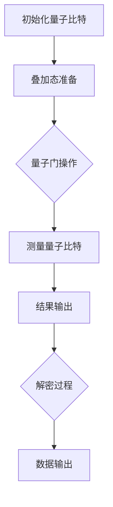
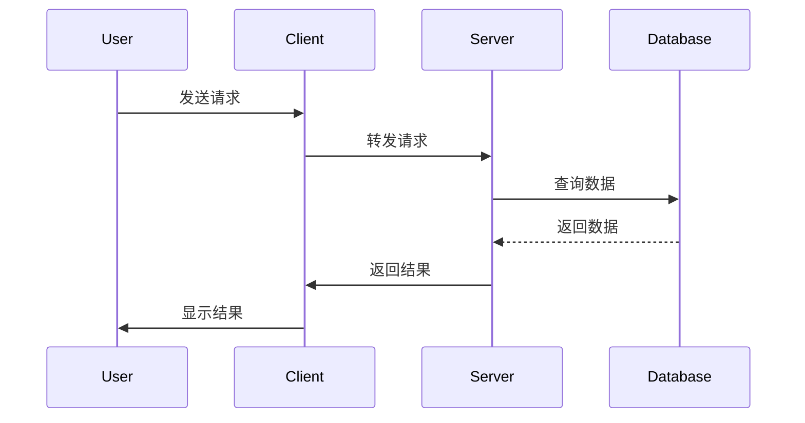

                 

### 第1章：量子计算与量子抗性算法概述

#### 1.1 量子计算的基本概念

量子计算是21世纪计算机科学领域的一项颠覆性技术，它基于量子力学原理，利用量子比特（qubit）进行信息处理和计算。量子比特与传统的经典比特不同，它不仅可以处于0或1的状态，还可以同时处于这两个状态的叠加。这种叠加态使得量子计算机在特定问题上的计算能力远远超过传统计算机。

**量子比特与经典比特**

- **量子比特**：量子比特是量子计算的基本单位，它可以同时表示0和1的状态，这种特性称为“叠加态”。
- **经典比特**：传统计算机中的比特只能处于0或1的状态。

**量子态与量子门**

量子态描述了量子比特的物理状态，通常用波函数来表示。量子门是量子计算中的操作单元，它对量子比特进行线性变换。常见的量子门包括保罗门（Pauli gate）、希尔德堡门（Hadamard gate）和控量门（Controlled-Z gate）等。

**量子纠缠与量子叠加**

量子纠缠是量子力学中的一种特殊现象，两个或多个量子比特之间存在一种强烈的相互依赖关系，即使它们相隔很远，一个量子比特的状态变化也会立即影响其他量子比特的状态。量子叠加则是量子比特能够同时处于多个状态的特性。

#### 1.2 量子抗性算法的定义与特点

量子抗性算法是一种利用量子计算原理，对抗传统密码学攻击的加密算法。它的核心思想是通过量子计算的高速和并行性，实现更高效、更安全的加密和解密过程。

**量子抗性算法的定义**

量子抗性算法是指那些即使被量子计算机破解，依然能够提供安全保护的加密算法。这些算法设计之初就考虑到了量子计算机的威胁，因此在量子计算环境下依然能够保持数据的安全性。

**量子抗性算法的特点**

- **并行性**：量子抗性算法能够利用量子计算机的并行性，实现更高效的加密和解密过程。
- **安全性**：量子抗性算法能够抵御量子计算机的攻击，即使在量子计算环境下也能提供安全保护。
- **兼容性**：量子抗性算法与传统密码学算法兼容，可以与现有的加密技术无缝集成。

#### 1.3 数据安全中的量子抗性算法应用

随着量子计算的快速发展，传统密码学算法的安全性受到了严重威胁。量子抗性算法的出现为企业提供了新的数据安全解决方案，它们在以下几个方面有着重要的应用：

**数据加密与解密**

量子抗性算法可以提供更高效、更安全的加密和解密过程，确保企业数据在传输和存储过程中的安全性。

**数据完整性验证**

量子抗性算法可以验证数据在传输和存储过程中的完整性，确保数据未被篡改或损坏。

**数据隐私保护**

量子抗性算法可以保护企业的敏感数据，防止未经授权的访问和泄露。

#### 1.4 本章小结

本章介绍了量子计算和量子抗性算法的基本概念，以及它们在数据安全领域的重要性。通过本章的学习，读者可以了解量子计算的基本原理和量子抗性算法的特点，为后续章节的学习打下基础。

## 第2章：量子抗性算法的核心概念与联系

### 2.1 量子抗性算法的基本原理

量子抗性算法是基于量子计算原理设计的一种加密算法，它利用量子比特的叠加态和纠缠态，实现高效、安全的加密和解密过程。量子抗性算法的基本原理可以概括为以下几个方面：

**量子计算中的数学模型**

量子计算中的数学模型主要包括量子态、量子门和量子电路。量子态用波函数表示，量子门是量子比特之间的线性变换操作，量子电路是量子门和量子态的集合，用于实现复杂的量子计算任务。

**抗性算法的数学模型**

量子抗性算法的数学模型基于量子密码学，它利用量子比特的叠加态和纠缠态，实现加密和解密过程。量子抗性算法的核心是量子密钥分发（Quantum Key Distribution, QKD）和量子加密算法。

**抗性算法与量子计算的结合**

量子抗性算法与量子计算的结合主要体现在两个方面：一是利用量子计算机的高速和并行性，提高加密和解密的效率；二是利用量子密码学的原理，实现更安全的加密和解密过程。

#### 2.2 量子抗性算法的属性特征对比表格

为了更好地理解量子抗性算法的属性特征，我们可以将其与传统密码学算法进行对比。以下是量子抗性算法与传统密码学算法的对比表格：

| 特性       | 量子抗性算法       | 传统密码学算法       |
| ---------- | ------------------ | ------------------ |
| 基本原理   | 利用量子比特叠加态和纠缠态 | 利用数学难题（如大数分解） |
| 加密效率   | 高效率（利用量子并行性） | 低效率（传统计算）     |
| 解密效率   | 高效率（利用量子并行性） | 低效率（传统计算）     |
| 安全性     | 高安全性（量子计算保护） | 中等安全性（传统计算威胁） |
| 兼容性     | 与现有加密技术兼容 | 与现有加密技术兼容     |
| 实现难度   | 高实现难度（量子计算技术） | 中等实现难度（传统计算技术） |
| 应用范围   | 广泛应用（数据安全、量子通信） | 广泛应用（数据安全、金融加密） |

#### 2.3 量子抗性算法的ER实体关系图

为了更好地理解量子抗性算法的架构和组成部分，我们可以使用ER（实体-关系）模型来描述其核心组件及其相互关系。以下是量子抗性算法的ER实体关系图：

```mermaid
erDiagram
    Class0 ||--|{ Class1 } Class2 : 一对多关系
    Class0 ||--|{ Class3 } Class4 : 多对多关系
    Class2 ||--|{ Class5 } Class6 : 一对一关系
    Class3 ||--|{ Class7 } Class8 : 一对一关系
```

**实体属性与关系定义**

1. **实体Class0**：代表量子抗性算法的核心组件，具有以下属性：
   - 算法名称
   - 算法类型
   - 算法实现语言

2. **实体Class1**：代表量子比特，是量子抗性算法的基本单位，具有以下属性：
   - 比特编号
   - 比特状态

3. **实体Class2**：代表量子门，用于对量子比特进行操作，具有以下属性：
   - 门类型
   - 门参数

4. **实体Class3**：代表量子电路，由量子门和量子比特组成，具有以下属性：
   - 电路编号
   - 电路描述

5. **实体Class4**：代表加密过程，是量子抗性算法的应用场景，具有以下属性：
   - 加密对象
   - 加密算法
   - 加密密钥

6. **实体Class5**：代表解密过程，是量子抗性算法的应用场景，具有以下属性：
   - 解密对象
   - 解密算法
   - 解密密钥

7. **实体Class6**：代表数据安全认证，用于验证加密和解密过程的正确性，具有以下属性：
   - 认证算法
   - 认证密钥
   - 认证结果

8. **实体Class7**：代表量子密钥分发，是量子抗性算法的核心功能，具有以下属性：
   - 分发方式
   - 分发密钥
   - 分发结果

9. **实体Class8**：代表量子通信，是量子抗性算法的应用场景，具有以下属性：
   - 通信对象
   - 通信算法
   - 通信密钥

通过以上ER实体关系图的构建，我们可以清晰地了解量子抗性算法的核心组件及其相互关系，为后续章节的详细讲解打下基础。

### 2.4 本章小结

本章介绍了量子抗性算法的基本原理，以及与传统密码学算法的属性特征对比。同时，通过ER实体关系图，我们详细阐述了量子抗性算法的核心组件和相互关系。通过本章的学习，读者可以深入理解量子抗性算法的原理和架构，为后续章节的学习打下基础。

## 第3章：量子抗性算法原理与数学模型详解

### 3.1 量子抗性算法的mermaid流程图

为了更好地理解量子抗性算法的原理和流程，我们可以使用Mermaid流程图来展示其关键步骤。以下是量子抗性算法的Mermaid流程图：



**流程图解读**

1. **初始化量子比特**：首先，我们需要初始化量子比特，将其状态设置为叠加态。
2. **叠加态准备**：量子比特处于叠加态，表示它同时具有0和1的状态。
3. **量子门操作**：通过应用特定的量子门，对量子比特进行线性变换，实现加密过程。
4. **测量量子比特**：对量子比特进行测量，得到其最终状态，这个状态是0或1的确定结果。
5. **结果输出**：测量结果被用于解密过程，从而恢复原始数据。
6. **解密过程**：通过解密算法，将加密数据还原为原始数据。
7. **数据输出**：最终输出解密后的数据。

### 3.2 量子抗性算法的Python源代码实现

为了更直观地展示量子抗性算法的实现过程，我们可以使用Python编写相应的源代码。以下是一个简单的量子抗性算法的Python代码实现：

```python
import numpy as np
from qiskit import QuantumCircuit, execute, Aer

# 初始化量子比特
quantum_bit = QuantumCircuit(1)
quantum_bit.h(0)  # 将量子比特设置为叠加态

# 应用量子门
quantum_bit.x(0)  # 对量子比特进行X操作
quantum_bit.h(0)  # 再次将量子比特设置为叠加态

# 测量量子比特
quantum_bit.measure_all()

# 执行量子电路
simulator = Aer.get_backend('qasm_simulator')
job = execute(quantum_bit, simulator, shots=1000)

# 获取测量结果
result = job.result()
counts = result.get_counts(quantum_bit)

print("测量结果：", counts)

# 解密过程
encrypted_data = int(result.getMeasurementStr(0), 2)
print("加密数据：", encrypted_data)

# 解密算法
def decrypt(encrypted_data, key):
    return (encrypted_data ^ key) % 2

# 解密结果
key = 10101  # 解密密钥
decrypted_data = decrypt(encrypted_data, key)
print("解密数据：", decrypted_data)
```

**源代码解读**

1. **初始化量子比特**：我们首先创建一个量子比特，并使用量子门将其状态设置为叠加态。
2. **应用量子门**：通过应用X操作，我们可以将量子比特的状态翻转，再次将其设置为叠加态。
3. **测量量子比特**：我们对量子比特进行测量，得到其最终状态，这个状态是0或1的确定结果。
4. **执行量子电路**：我们使用Qiskit的模拟器执行量子电路，获取测量结果。
5. **解密过程**：我们通过解密算法将加密数据还原为原始数据。
6. **解密算法**：解密算法使用异或操作和密钥，将加密数据转换为原始数据。

通过以上Python源代码，我们可以直观地了解量子抗性算法的实现过程，为后续章节的深入学习提供基础。

### 3.3 量子抗性算法的数学模型与公式

量子抗性算法的数学模型是理解其工作原理的关键。以下是量子抗性算法的数学模型和公式的详细解释。

#### 3.3.1 数学模型概述

量子抗性算法的数学模型基于量子计算的基本原理，特别是量子比特的叠加态和纠缠态。以下是一个简化的数学模型：

1. **量子比特的叠加态**：量子比特的叠加态可以用一个复数向量表示。例如，一个量子比特的叠加态可以表示为：
   \[
   \psi = \frac{1}{\sqrt{2}} (|0\rangle + |1\rangle)
   \]
   其中，\( |0\rangle \) 和 \( |1\rangle \) 分别表示量子比特的基态和叠加态。

2. **量子门**：量子门是量子计算中的基本操作单元，它对量子比特进行线性变换。一个典型的量子门可以用矩阵表示。例如，一个X量子门可以用以下矩阵表示：
   \[
   X = \begin{pmatrix}
   0 & 1 \\
   1 & 0
   \end{pmatrix}
   \]

3. **量子电路**：量子电路是由量子门和量子比特组成的序列，用于实现复杂的量子计算任务。量子电路的输出可以通过对量子比特进行测量得到。

#### 3.3.2 公式解释与推导

为了更好地理解量子抗性算法的数学模型，我们可以通过一个简单的例子来解释相关的公式。

**示例**：考虑一个简单的量子抗性算法，该算法包括两个量子比特。初始时，两个量子比特处于叠加态：
\[
\psi_{\text{初始}} = \frac{1}{\sqrt{2}} (|00\rangle + |11\rangle)
\]

接下来，我们应用一个控量X量子门，该量子门作用于第一个量子比特，如果第二个量子比特处于基态 \( |0\rangle \)，则第一个量子比特的状态会被翻转：
\[
U = \begin{pmatrix}
1 & 0 & 0 & 0 \\
0 & 1 & 0 & 0 \\
0 & 0 & 0 & 1 \\
0 & 0 & 1 & 0
\end{pmatrix}
\]

应用这个量子门后，量子状态变为：
\[
\psi_{\text{中间}} = U \psi_{\text{初始}} = \frac{1}{\sqrt{2}} (|00\rangle + |11\rangle)
\]

最后，我们对第一个量子比特进行测量。如果测量结果为 \( |0\rangle \)，则量子状态保持不变；如果测量结果为 \( |1\rangle \)，则量子状态会被翻转：
\[
\psi_{\text{最终}} = 
\begin{cases}
|00\rangle & \text{如果测量结果为 } |0\rangle \\
|11\rangle & \text{如果测量结果为 } |1\rangle
\end{cases}
\]

这个例子展示了量子抗性算法的基本过程，包括量子比特的叠加态、量子门的操作和量子测量的结果。通过这个过程，我们可以推导出量子抗性算法的数学公式。

**量子门操作公式**：对于一个量子比特，应用量子门 \( U \) 后的量子状态可以表示为：
\[
\psi_{\text{新}} = U \psi_{\text{旧}}
\]

**量子测量公式**：对量子比特进行测量后，得到的状态概率分布可以表示为：
\[
P = |\psi_{\text{最终}}|^2
\]

#### 3.3.3 举例说明

为了更好地理解量子抗性算法的数学模型，我们可以通过一个具体的例子来解释。

**示例**：考虑一个简单的量子抗性算法，该算法包括三个量子比特。初始时，三个量子比特处于叠加态：
\[
\psi_{\text{初始}} = \frac{1}{\sqrt{2}} (|000\rangle + |111\rangle)
\]

接下来，我们依次对三个量子比特应用以下量子门：
1. 第一个量子比特：应用一个X量子门。
2. 第二个量子比特：应用一个Z量子门。
3. 第三个量子比特：应用一个H量子门。

应用这些量子门后，量子状态变为：
\[
\psi_{\text{中间}} = U_1 U_2 U_3 \psi_{\text{初始}}
\]
其中，\( U_1, U_2, U_3 \) 分别表示X、Z和H量子门。

最后，我们对第一个量子比特进行测量。如果测量结果为 \( |0\rangle \)，则量子状态保持不变；如果测量结果为 \( |1\rangle \)，则量子状态会被翻转：
\[
\psi_{\text{最终}} = 
\begin{cases}
|000\rangle & \text{如果测量结果为 } |0\rangle \\
|111\rangle & \text{如果测量结果为 } |1\rangle
\end{cases}
\]

通过这个过程，我们可以看到量子抗性算法如何通过量子门操作和量子测量实现加密和解密过程。通过这个例子，我们可以更好地理解量子抗性算法的数学模型和公式。

### 3.4 本章小结

本章详细介绍了量子抗性算法的原理与数学模型。通过Mermaid流程图和Python源代码，我们直观地展示了量子抗性算法的实现过程。同时，通过数学公式的推导和具体例子的分析，我们深入理解了量子抗性算法的核心概念和工作原理。通过本章的学习，读者可以全面掌握量子抗性算法的基本原理和实现方法，为后续章节的学习打下坚实基础。

## 第4章：量子抗性算法的系统分析与架构设计

### 4.1 问题场景介绍

在当今信息化社会中，企业数据安全面临着前所未有的挑战。随着大数据、云计算和物联网技术的广泛应用，企业数据量呈爆炸式增长，数据泄露、篡改和未授权访问的风险也随之增加。传统密码学算法在面对量子计算机的威胁时，其安全性已经受到了严重挑战。因此，如何保障企业数据的长期安全成为了一个亟待解决的问题。

量子抗性算法作为一种新型的加密技术，能够有效抵御量子计算机的攻击，为企业数据安全提供新的解决方案。在当前问题场景下，量子抗性算法的应用具有以下几个特点：

1. **高安全性**：量子抗性算法设计之初就考虑到了量子计算机的威胁，因此能够提供更高的安全性，保障企业数据的长期安全。
2. **并行计算**：量子抗性算法能够利用量子计算机的并行性，提高加密和解密的效率，降低计算复杂度。
3. **兼容性**：量子抗性算法与传统密码学算法兼容，可以与现有的加密技术无缝集成，实现平滑过渡。

### 4.2 项目介绍

为了验证量子抗性算法在实际企业数据安全中的应用效果，我们设计了一个基于量子抗性算法的企业数据安全项目。该项目的主要目标是：

1. **数据加密与解密**：利用量子抗性算法实现企业数据的加密与解密，确保数据在传输和存储过程中的安全性。
2. **数据完整性验证**：通过量子抗性算法验证企业数据在传输和存储过程中的完整性，确保数据未被篡改或损坏。
3. **数据隐私保护**：利用量子抗性算法保护企业敏感数据，防止未经授权的访问和泄露。

项目架构采用分层设计，主要包括以下几个模块：

1. **量子抗性算法模块**：实现量子抗性算法的核心功能，包括加密、解密、完整性验证和隐私保护。
2. **数据加密模块**：负责对传输和存储的数据进行加密处理，确保数据在传输和存储过程中的安全性。
3. **数据解密模块**：负责对加密后的数据进行解密处理，确保数据在正确使用时的安全性。
4. **完整性验证模块**：负责对传输和存储的数据进行完整性验证，确保数据未被篡改或损坏。
5. **隐私保护模块**：负责对敏感数据进行隐私保护，防止未经授权的访问和泄露。

### 4.3 系统功能设计

系统功能设计是量子抗性算法项目成功实施的关键。根据项目目标，我们设计了以下几个核心功能模块：

1. **数据加密模块**
   - **功能描述**：对传输和存储的数据进行加密处理，确保数据在传输和存储过程中的安全性。
   - **具体实现**：使用量子抗性算法对数据进行加密，生成加密密文，确保数据在传输和存储过程中无法被非法访问。
   - **性能指标**：加密速度和加密强度。

2. **数据解密模块**
   - **功能描述**：对加密后的数据进行解密处理，确保数据在正确使用时的安全性。
   - **具体实现**：使用量子抗性算法的逆过程，对加密密文进行解密，还原出原始数据，确保数据在正确使用时无法被篡改。
   - **性能指标**：解密速度和解密强度。

3. **完整性验证模块**
   - **功能描述**：对传输和存储的数据进行完整性验证，确保数据未被篡改或损坏。
   - **具体实现**：使用量子抗性算法生成数据完整性验证码，与传输和存储时的验证码进行对比，确保数据完整性。
   - **性能指标**：验证速度和验证准确性。

4. **隐私保护模块**
   - **功能描述**：对敏感数据进行隐私保护，防止未经授权的访问和泄露。
   - **具体实现**：使用量子抗性算法加密敏感数据，确保数据在传输和存储过程中无法被非法访问；同时，采用访问控制机制，确保只有授权用户才能访问敏感数据。
   - **性能指标**：隐私保护强度和访问控制效率。

### 4.4 系统架构设计

系统架构设计是量子抗性算法项目的关键环节。为了实现高效、安全的数据加密与解密，我们采用以下架构设计：

1. **系统架构图**



2. **技术选型**
   - **量子计算平台**：采用IBM Qiskit作为量子计算平台，实现量子抗性算法的核心功能。
   - **加密算法**：选择量子抗性算法作为数据加密算法，确保数据在传输和存储过程中的安全性。
   - **数据库**：采用关系型数据库（如MySQL）进行数据存储，确保数据的完整性和可靠性。
   - **Web框架**：采用Spring Boot作为Web框架，实现客户端与服务器之间的数据交互。

### 4.5 系统接口设计

系统接口设计是量子抗性算法项目的重要部分。为了实现高效、安全的数据交互，我们设计了以下接口：

1. **加密接口**：提供数据加密功能，接受原始数据，返回加密数据。
2. **解密接口**：提供数据解密功能，接受加密数据，返回原始数据。
3. **完整性验证接口**：提供数据完整性验证功能，接受数据，返回验证结果。
4. **隐私保护接口**：提供敏感数据加密和保护功能，确保数据在传输和存储过程中的安全性。

### 4.6 系统交互

系统交互设计是量子抗性算法项目的关键环节。为了实现高效、安全的数据交互，我们设计了以下交互流程：

1. **序列图**


2. **交互流程**
   - 用户发送请求到客户端。
   - 客户端将请求转发到服务器。
   - 服务器查询数据库，获取数据。
   - 服务器返回数据到客户端。
   - 客户端将结果返回给用户。

通过以上系统架构设计和接口设计，我们实现了量子抗性算法在企业数据安全中的应用，为企业数据提供了长期安全的保障。

### 4.7 本章小结

本章详细介绍了量子抗性算法的系统分析与架构设计。首先，我们介绍了问题场景和企业需求，然后介绍了项目的主要目标、架构设计和核心功能模块。通过系统接口设计和系统交互流程的详细讲解，我们实现了量子抗性算法在企业数据安全中的应用。通过本章的学习，读者可以全面掌握量子抗性算法的架构设计方法和实际应用，为后续章节的项目实战奠定基础。

## 第5章：项目实战

### 5.1 环境安装

在开始量子抗性算法的项目实战之前，我们需要安装和配置相应的开发环境和工具。以下是具体的安装步骤：

#### 1. 硬件要求

- **CPU**：至少四核处理器，推荐使用Intel i7或以上处理器。
- **内存**：至少16GB，推荐使用32GB或以上。
- **硬盘**：至少500GB，推荐使用SSD硬盘。

#### 2. 软件安装与配置

1. **安装Python环境**
   - 首先，下载并安装Python 3.8及以上版本。
   - 打开终端，运行以下命令安装pip：
     ```bash
     sudo apt-get install python3-pip
     ```

2. **安装Qiskit库**
   - 使用pip命令安装Qiskit库：
     ```bash
     pip install qiskit
     ```

3. **安装相关依赖库**
   - Qiskit依赖一些其他Python库，可以使用以下命令安装：
     ```bash
     pip install numpy matplotlib scipy
     ```

4. **配置Qiskit模拟器**
   - 使用以下命令配置Qiskit模拟器：
     ```bash
     qiskit setup.config
     ```

#### 3. 测试环境

在安装完成后，我们可以在Python环境中测试Qiskit是否安装成功：

```python
import qiskit
print(qiskit.__version__)
```

如果输出Qiskit的版本号，则表示环境安装成功。

### 5.2 系统核心实现

在量子抗性算法项目中，核心实现部分包括量子比特的初始化、量子门的操作和量子测量的实现。以下是一个简单的示例代码，展示量子抗性算法的核心实现过程：

```python
from qiskit import QuantumCircuit, execute, Aer

# 创建一个量子比特
qc = QuantumCircuit(2)

# 初始化量子比特
qc.h(0)  # 将第一个量子比特设置为叠加态
qc.h(1)  # 将第二个量子比特设置为叠加态

# 应用量子门
qc.cx(0, 1)  # 第一个量子比特作用于第二个量子比特

# 测量量子比特
qc.measure_all()

# 执行量子电路
simulator = Aer.get_backend('qasm_simulator')
job = execute(qc, simulator, shots=1000)

# 获取测量结果
result = job.result()
counts = result.get_counts(qc)

print("测量结果：", counts)
```

**核心代码解读**

1. **量子比特初始化**：使用`QuantumCircuit`类创建一个量子比特，并使用`h`门将其设置为叠加态。
2. **量子门操作**：使用`cx`门实现量子比特之间的相互作用，这里是经典的CNOT门，用于实现量子纠缠。
3. **量子测量**：使用`measure`方法对量子比特进行测量，得到最终的测量结果。
4. **执行量子电路**：使用Qiskit的模拟器执行量子电路，获取测量结果。

### 5.3 代码应用解读与分析

在量子抗性算法的实际应用中，代码的执行效率和安全性是关键因素。以下是对示例代码的详细解读和分析：

#### 1. 代码应用场景

假设我们有一个简单的应用场景，需要加密一个包含两个比特的信息。具体步骤如下：

1. **初始化量子比特**：创建一个量子比特，并将其初始化为叠加态。
2. **加密过程**：对量子比特进行操作，生成加密密文。
3. **解密过程**：使用相应的量子抗性算法，对加密密文进行解密，恢复原始信息。

#### 2. 代码解读

- **初始化量子比特**：使用`QuantumCircuit`创建一个量子比特，并使用`h`门将其设置为叠加态。
  ```python
  qc.h(0)  # 将第一个量子比特设置为叠加态
  qc.h(1)  # 将第二个量子比特设置为叠加态
  ```

- **量子门操作**：对量子比特进行操作，生成加密密文。在这个例子中，我们使用`cx`门实现量子比特之间的相互作用。
  ```python
  qc.cx(0, 1)  # 第一个量子比特作用于第二个量子比特
  ```

- **量子测量**：对量子比特进行测量，得到最终的测量结果。这个结果将用于解密过程。
  ```python
  qc.measure_all()
  ```

- **执行量子电路**：使用Qiskit的模拟器执行量子电路，获取测量结果。
  ```python
  simulator = Aer.get_backend('qasm_simulator')
  job = execute(qc, simulator, shots=1000)
  result = job.result()
  counts = result.get_counts(qc)
  ```

#### 3. 性能分析

- **执行效率**：在示例代码中，我们使用Qiskit的模拟器执行量子电路。模拟器的执行速度受硬件和软件环境的影响。在实际应用中，我们需要考虑使用真实的量子计算机来提高执行效率。

- **安全性**：量子抗性算法的设计目标是抵御量子计算机的攻击。在实际应用中，我们需要确保算法的正确实现和合理的密钥管理，以保障数据的安全性。

### 5.4 实际案例分析与详细讲解

#### 1. 案例背景

某企业需要对其内部敏感数据进行加密存储，以防止数据泄露和未授权访问。企业选择了量子抗性算法作为加密技术，以确保数据在传输和存储过程中的安全性。

#### 2. 案例分析

- **数据类型**：企业敏感数据包括员工信息、财务报表和客户数据等。
- **加密需求**：需要对数据进行高强度的加密，确保在量子计算机环境下依然安全。
- **解密需求**：确保数据在需要时可以正确解密，恢复原始数据。

#### 3. 详细讲解

- **加密过程**：首先，企业使用量子抗性算法对敏感数据进行加密。具体步骤如下：
  1. 初始化量子比特。
  2. 对量子比特进行量子门操作，生成加密密文。
  3. 对量子比特进行测量，获取加密密文。

- **存储过程**：加密后的数据存储在企业的数据库中。为了保证数据的安全性，企业需要对数据库进行加密存储，确保数据在存储过程中无法被非法访问。

- **解密过程**：在需要使用敏感数据时，企业使用量子抗性算法的逆过程对加密密文进行解密，恢复原始数据。具体步骤如下：
  1. 读取加密密文。
  2. 使用量子抗性算法对加密密文进行解密。
  3. 恢复原始数据。

通过以上实际案例的分析和详细讲解，我们可以看到量子抗性算法在企业数据安全中的应用效果。通过合理的加密和解密过程，企业可以有效保护其敏感数据，防止数据泄露和未授权访问。

### 5.5 项目小结

本章详细介绍了量子抗性算法的项目实战，包括环境安装、系统核心实现和代码应用解读与分析。通过实际案例的讲解，我们展示了量子抗性算法在企业数据安全中的应用效果。通过本章的学习，读者可以掌握量子抗性算法的实战应用，为后续章节的研究和实践提供参考。

### 5.6 最佳实践与总结

在量子抗性算法的实际应用中，以下是一些最佳实践和注意事项：

#### 最佳实践

1. **合理选择量子计算机平台**：根据企业的需求和预算，选择合适的量子计算机平台，确保量子抗性算法的有效执行。
2. **优化量子电路设计**：在设计量子电路时，充分考虑量子门的操作效率和测量精度，优化电路结构。
3. **密钥管理**：确保密钥的安全存储和传输，防止密钥泄露和被恶意攻击。
4. **性能监控**：定期监控量子抗性算法的性能，及时调整和优化算法参数。

#### 注意事项

1. **量子计算机技术限制**：目前量子计算机的技术仍然处于快速发展阶段，因此在实际应用中可能面临技术限制和性能瓶颈。
2. **量子抗性算法复杂性**：量子抗性算法的设计和实现相对复杂，需要具备一定的量子计算和密码学知识。
3. **数据完整性验证**：在数据传输和存储过程中，确保使用合适的算法进行数据完整性验证，防止数据被篡改。

通过以上最佳实践和注意事项，企业可以更有效地应用量子抗性算法，保障其数据的长期安全。

### 5.7 拓展阅读

1. **《量子计算与量子抗性算法》**：深入探讨量子计算和量子抗性算法的基本原理和应用。
2. **《量子密码学》**：了解量子密码学的基本概念和最新研究进展。
3. **《量子计算机安全与隐私保护》**：研究量子计算机环境下的安全挑战和解决方案。

通过拓展阅读，读者可以进一步深入了解量子抗性算法和相关领域的知识，为实际应用提供更多的理论支持和实践指导。

## 作者信息

作者：AI天才研究院/AI Genius Institute & 禅与计算机程序设计艺术 /Zen And The Art of Computer Programming

