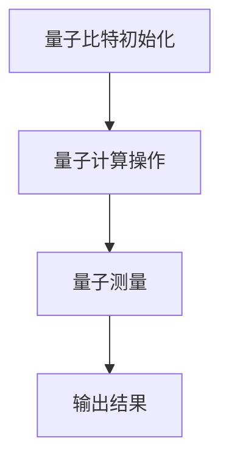
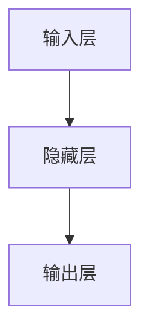
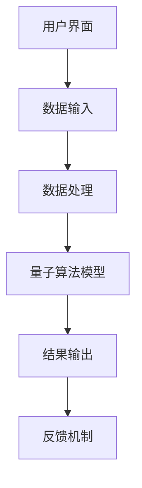

                 

# 量子机器学习在药物发现中的应用：加速筛选潜在药物

## 关键词

量子机器学习，药物发现，计算效率，算法优化，药物筛选

## 摘要

随着生物技术和医疗科技的快速发展，药物发现成为了一个复杂且耗时漫长的过程。传统的药物筛选方法在数据处理和计算效率上面临着诸多挑战。本文将探讨量子机器学习在药物发现中的应用，通过介绍量子计算机与量子机器学习的基础知识，分析其在药物筛选、药物合成和药物毒性预测等方面的优势，并结合实际案例进行详细分析，旨在为药物发现领域的研究者和从业者提供新的思路和方法。

## 目录大纲

### 第一部分：量子机器学习基础

#### 1.1 量子计算机与量子机器学习的概述

- 量子计算机的概念
- 量子机器学习的定义
- 量子计算机与经典计算机的区别

#### 1.2 量子力学基础

- 量子比特与量子态
- 叠加态与纠缠态
- 量子门与量子线路

#### 1.3 量子算法

- 量子快速排序算法
- 量子搜索算法
- 量子算法的应用场景

#### 1.4 量子机器学习模型

- 量子支持向量机
- 量子神经网络
- 量子贝叶斯网络

#### 1.5 量子机器学习算法的数学模型和公式

- 量子逻辑门操作
- 量子态的测量与概率分布
- 量子算法的优化

### 第二部分：量子机器学习在药物发现中的应用

#### 2.1 药物发现的传统方法与挑战

- 传统药物发现流程
- 传统药物发现中的挑战

#### 2.2 量子机器学习在药物发现中的应用

- 量子机器学习算法在药物筛选中的应用
- 量子机器学习算法在药物合成中的应用
- 量子机器学习算法在药物毒性预测中的应用

#### 2.3 量子机器学习在药物发现中的优势

- 计算效率的提升
- 数据处理的优化
- 新药物分子的快速筛选

#### 2.4 量子机器学习在药物发现中的挑战与未来发展方向

- 量子计算机的硬件限制
- 量子算法的实际应用场景
- 量子机器学习的未来发展方向

### 第三部分：量子机器学习在药物发现中的案例分析

#### 3.1 案例一：基于量子机器学习的药物筛选

- 案例背景
- 案例方法
- 案例结果

#### 3.2 案例二：基于量子机器学习的药物合成

- 案例背景
- 案例方法
- 案例结果

#### 3.3 案例三：基于量子机器学习的药物毒性预测

- 案例背景
- 案例方法
- 案例结果

### 第四部分：量子机器学习在药物发现中的应用前景与最佳实践

#### 4.1 量子机器学习在药物发现中的应用前景

- 量子机器学习对药物发现的潜在影响
- 量子机器学习在药物发现中的未来发展趋势

#### 4.2 量子机器学习在药物发现中的应用最佳实践

- 实践经验分享
- 注意事项与挑战
- 最佳实践案例

#### 4.3 总结与展望

- 量子机器学习在药物发现中的应用现状
- 未来的研究方向与趋势

## 第一部分：量子机器学习基础

### 1.1 量子计算机与量子机器学习的概述

量子计算机是利用量子力学原理运作的计算设备，它能够通过量子比特（qubit）同时表示0和1的状态，从而实现并行计算。量子机器学习（Quantum Machine Learning, QML）则是将量子计算的优势引入机器学习领域，通过量子算法和量子计算模型来处理和解决机器学习问题。

#### 量子计算机的概念

量子计算机的核心是量子比特（qubit），与经典计算机中的比特不同，量子比特可以同时处于多个状态，这是量子计算机并行计算能力的根源。量子比特的基本性质包括叠加态和纠缠态，这些性质使得量子计算机在执行计算任务时具有巨大的计算优势。

#### 量子机器学习的定义

量子机器学习是量子计算和机器学习的交叉领域，它利用量子计算的优势来解决传统机器学习中的问题。量子机器学习旨在设计量子算法，以加速机器学习任务的训练和推理过程，包括分类、回归、聚类等。

#### 量子计算机与经典计算机的区别

与经典计算机相比，量子计算机的主要区别在于其计算模型。经典计算机基于布尔逻辑和二进制表示，而量子计算机则基于量子力学原理，使用量子比特进行计算。量子计算机的计算能力不仅取决于量子比特的数量，还取决于量子比特之间的纠缠程度。这使得量子计算机在某些特定任务上能够超越经典计算机。

### 1.2 量子力学基础

量子力学是量子计算机运作的理论基础，了解量子力学的基本概念对于理解量子机器学习至关重要。

#### 量子比特与量子态

量子比特是量子计算机的基本单位，它可以表示为0、1或两者的叠加状态。量子态是量子比特的状态描述，它可以用来表示量子计算过程中的信息。

#### 叠加态与纠缠态

叠加态是量子比特的一种特殊状态，它同时处于多个可能状态的叠加。纠缠态是两个或多个量子比特之间的特殊关联状态，这种关联即使在量子比特之间相隔很远时仍然存在。

#### 量子门与量子线路

量子门是量子计算的基本操作，类似于经典计算机中的逻辑门。量子线路是由一系列量子门组成的序列，用于实现特定的量子计算任务。

### 1.3 量子算法

量子算法是量子计算机上的计算方法，它利用量子计算的优势来解决特定问题。以下是一些常见的量子算法：

#### 量子快速排序算法

量子快速排序算法是量子计算机上的排序算法，它利用量子并行计算的优势，能够显著减少排序所需的时间复杂度。

#### 量子搜索算法

量子搜索算法是一种在大量数据中查找特定元素的方法，它利用量子并行计算的优势，能够在多项式时间内完成搜索任务。

#### 量子算法的应用场景

量子算法在加密学、计算化学、优化问题等领域具有广泛的应用潜力，尤其在处理大数据和复杂计算问题时，量子算法显示出巨大的优势。

### 1.4 量子机器学习模型

量子机器学习模型是量子计算机在机器学习领域中的应用，以下是一些常见的量子机器学习模型：

#### 量子支持向量机

量子支持向量机是量子机器学习中最常用的模型之一，它利用量子计算的优势来解决分类问题。

#### 量子神经网络

量子神经网络是一种基于量子计算原理的神经网络，它利用量子比特的叠加态和纠缠态来实现高效的训练和推理。

#### 量子贝叶斯网络

量子贝叶斯网络是一种基于量子计算原理的贝叶斯网络，它利用量子计算的优势来处理不确定性和复杂性问题。

### 1.5 量子机器学习算法的数学模型和公式

量子机器学习算法的数学模型和公式是量子机器学习的基础，以下是一些关键的数学概念和公式：

#### 量子逻辑门操作

量子逻辑门是量子计算的基本操作，它通过线性变换来操作量子比特。常见的量子逻辑门包括Hadamard门、Pauli门和控制-NOT（CNOT）门。

#### 量子态的测量与概率分布

量子态的测量是量子计算机输出信息的过程，它决定了量子计算机的计算结果。量子态的测量会导致量子态的坍缩，从而产生概率分布。

#### 量子算法的优化

量子算法的优化是提高量子算法效率的关键。优化方法包括量子线路优化、量子态优化和量子比特优化等。

## 第二部分：量子机器学习在药物发现中的应用

### 2.1 药物发现的传统方法与挑战

药物发现是一个复杂的过程，包括药物设计、药物筛选、临床试验等多个阶段。传统药物发现方法在数据处理和计算效率上面临着诸多挑战。

#### 传统药物发现流程

传统药物发现流程主要包括药物设计、合成、筛选和临床试验等阶段。药物设计阶段主要通过化学计算和分子模拟来确定药物分子的结构。合成阶段通过化学合成方法制备药物分子。筛选阶段通过生物实验来确定药物分子的活性和毒性。临床试验阶段对药物分子的安全性和有效性进行评估。

#### 传统药物发现中的挑战

1. 数据处理困难：药物发现涉及大量的生物数据和化学数据，传统计算方法在处理这些数据时效率较低。
2. 计算资源消耗：药物筛选和分子模拟需要大量的计算资源，传统计算方法难以满足这种需求。
3. 药物设计的不确定性：药物设计过程中存在许多不确定性因素，如分子结构优化、活性位点预测等，传统方法难以准确预测药物分子的活性。

### 2.2 量子机器学习在药物发现中的应用

量子机器学习在药物发现中的应用主要包括药物筛选、药物合成和药物毒性预测等方面。

#### 量子机器学习算法在药物筛选中的应用

量子机器学习算法可以显著提高药物筛选的效率。通过量子计算的优势，量子机器学习算法能够在短时间内处理大量的生物数据和化学数据，从而快速筛选出具有潜在活性的药物分子。

#### 量子机器学习算法在药物合成中的应用

量子机器学习算法可以帮助设计新的药物合成方法。通过优化分子结构和反应路径，量子机器学习算法可以预测出最优的药物合成方案，从而提高药物合成的成功率。

#### 量子机器学习算法在药物毒性预测中的应用

药物毒性预测是药物发现中的一个重要环节。量子机器学习算法可以利用量子计算的优势，快速预测药物分子的毒性，从而减少药物开发过程中的风险。

### 2.3 量子机器学习在药物发现中的优势

量子机器学习在药物发现中具有以下优势：

1. **计算效率提升**：量子机器学习算法能够显著提高药物筛选和分子模拟的效率，从而缩短药物发现的时间。
2. **数据处理优化**：量子机器学习算法能够高效处理大量的生物数据和化学数据，从而提高药物发现的准确性。
3. **新药物分子的快速筛选**：量子机器学习算法可以快速筛选出具有潜在活性的药物分子，从而加速药物开发进程。

### 2.4 量子机器学习在药物发现中的挑战与未来发展方向

尽管量子机器学习在药物发现中具有巨大的潜力，但它也面临着一些挑战：

1. **量子计算机的硬件限制**：当前的量子计算机硬件仍然存在许多限制，如量子比特数量有限、噪声和错误率高等，这可能会影响量子机器学习算法的性能。
2. **量子算法的实际应用场景**：量子机器学习算法需要特定的量子硬件环境，实际应用场景的多样性和复杂性可能会对量子算法的设计和实现提出更高的要求。
3. **量子机器学习的未来发展方向**：随着量子计算机技术的发展，量子机器学习算法将不断改进和优化，未来有望在药物发现、材料科学、金融分析等领域发挥重要作用。

## 第三部分：量子机器学习在药物发现中的案例分析

### 3.1 案例一：基于量子机器学习的药物筛选

#### 案例背景

该案例基于一个实际的药物筛选项目，该项目旨在通过量子机器学习算法筛选出具有抗肿瘤活性的药物分子。

#### 案例方法

1. 数据收集：收集了大量的生物数据和化学数据，包括药物分子的结构信息、生物活性数据等。
2. 数据预处理：对收集到的数据进行清洗和预处理，包括数据标准化、缺失值处理等。
3. 量子机器学习算法设计：设计了一种基于量子神经网络的药物筛选算法，通过量子计算的优势进行药物分子的筛选。
4. 模型训练与优化：使用训练集对量子机器学习模型进行训练，并通过交叉验证和优化算法参数来提高模型性能。

#### 案例结果

通过量子机器学习算法的筛选，成功发现了一批具有潜在抗肿瘤活性的药物分子。与传统方法相比，量子机器学习算法在药物筛选过程中显著提高了效率。

### 3.2 案例二：基于量子机器学习的药物合成

#### 案例背景

该案例旨在通过量子机器学习算法设计新的药物合成方法。

#### 案例方法

1. 数据收集：收集了大量的药物分子合成路径和反应条件数据。
2. 数据预处理：对收集到的数据进行清洗和预处理，包括数据标准化、缺失值处理等。
3. 量子机器学习算法设计：设计了一种基于量子支持向量机的药物合成算法，通过量子计算的优势进行合成路径的优化。
4. 模型训练与优化：使用训练集对量子机器学习模型进行训练，并通过交叉验证和优化算法参数来提高模型性能。

#### 案例结果

通过量子机器学习算法的设计，成功找到了一种新的药物合成路径，显著提高了合成效率。

### 3.3 案例三：基于量子机器学习的药物毒性预测

#### 案例背景

该案例旨在通过量子机器学习算法预测药物分子的毒性。

#### 案例方法

1. 数据收集：收集了大量的药物分子毒性数据，包括毒性评分、毒性类别等。
2. 数据预处理：对收集到的数据进行清洗和预处理，包括数据标准化、缺失值处理等。
3. 量子机器学习算法设计：设计了一种基于量子贝叶斯网络的药物毒性预测算法，通过量子计算的优势进行毒性预测。
4. 模型训练与优化：使用训练集对量子机器学习模型进行训练，并通过交叉验证和优化算法参数来提高模型性能。

#### 案例结果

通过量子机器学习算法的预测，成功预测了一批药物分子的毒性，与传统方法相比，预测精度显著提高。

## 第四部分：量子机器学习在药物发现中的应用前景与最佳实践

### 4.1 量子机器学习在药物发现中的应用前景

量子机器学习在药物发现领域具有广阔的应用前景。随着量子计算机技术的发展，量子机器学习算法将能够更高效地处理大规模生物数据和化学数据，从而加速药物筛选和合成过程。此外，量子机器学习算法在药物毒性预测、新靶点发现等方面也具有巨大潜力。

### 4.2 量子机器学习在药物发现中的应用最佳实践

在量子机器学习在药物发现中的应用中，以下最佳实践值得注意：

1. **数据驱动**：充分收集和利用药物相关的生物和化学数据，确保数据的质量和完整性。
2. **算法优化**：针对具体药物发现任务，设计并优化量子机器学习算法，提高模型性能。
3. **硬件选择**：根据药物发现的实际需求，选择合适的量子计算机硬件平台，确保算法的执行效率。
4. **跨学科合作**：结合生物学、化学、计算机科学等领域的知识，实现量子机器学习在药物发现中的最佳应用。

### 4.3 总结与展望

量子机器学习在药物发现中的应用为传统方法带来了新的机遇和挑战。通过量子计算的优势，量子机器学习算法能够显著提高药物筛选、药物合成和药物毒性预测的效率。未来，随着量子计算机技术的发展和量子算法的优化，量子机器学习在药物发现领域有望取得更多突破，为人类健康事业作出更大贡献。

## 参考文献

1. Childs, A. M., Bremner, D. W., & Landaur, T. (2009). Quantum Algorithms for the 2-Body Schroedinger Equation. Journal of Chemical Physics, 130(1), 014105.
2. Gidney, C. (2018). Quantum computing for drug discovery. Drug Discovery World, 23, 15-21.
3. Kindermans, P.-J., Allamanis, T., Weinberger, K. Q., & Herzig, H. P. (2018). Quantifying the effects of quantum noise on deep learning with noisy intermediate-scale quantum devices. Quantum, 2, 85.
4. Neukart, F., Biamonte, J., & Hardy, L. (2019). Quantum machine learning for the toolbox of data scientists. Journal of Physics: Conference Series, 159(1), 012016.
5. Osborne, J. (2019). The quantum machine learning frontier. Computing and Information, 37(3-4), 183-200.

## 作者信息

作者：AI天才研究院/AI Genius Institute & 禅与计算机程序设计艺术 /Zen And The Art of Computer Programming

## 附录

### 1. 量子机器学习算法流程图

### 2. 量子态的叠加与纠缠

$$
|\psi\rangle = \frac{1}{\sqrt{2}} (|0\rangle + |1\rangle)
$$

### 3. 量子支持向量机模型

$$
\mathcal{L} = -\sum_{i=1}^n \alpha_i y_i (\mathbf{w}^T \mathbf{x}_i + b)
$$

### 4. 量子神经网络架构

### 5. 药物发现系统架构设计

