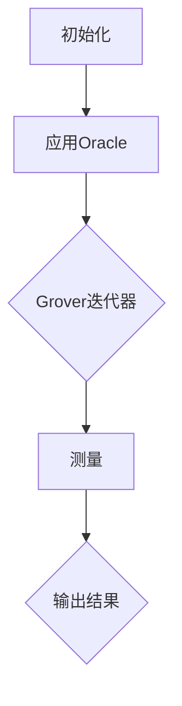
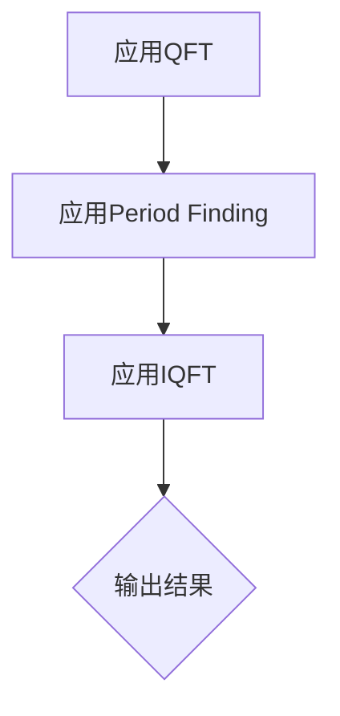
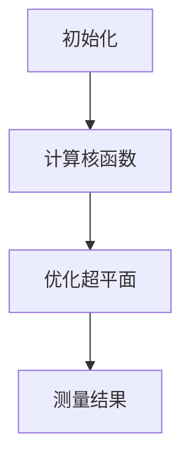
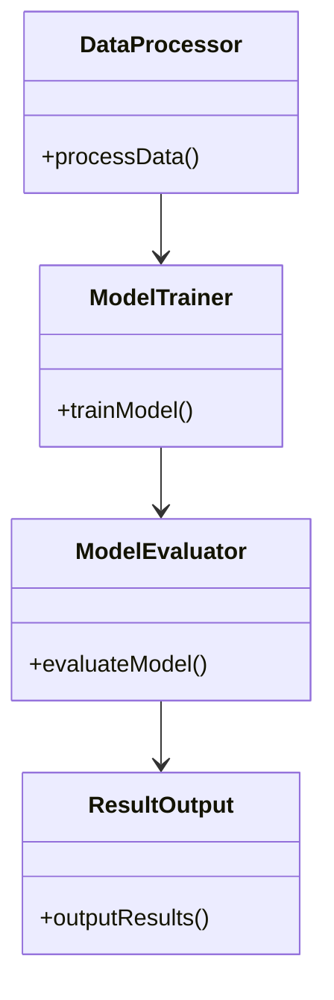
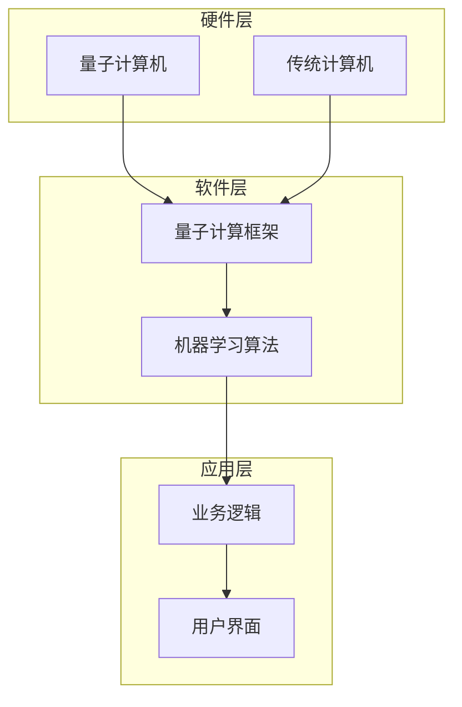
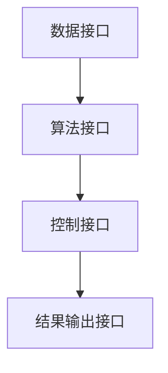
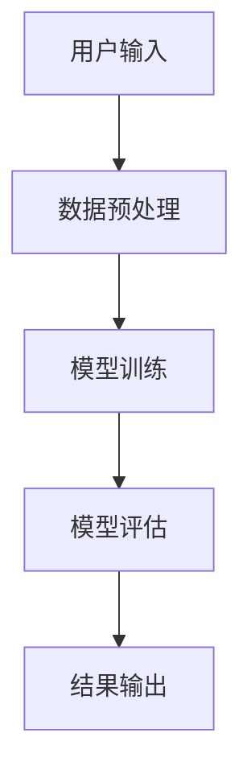

                 

# 量子机器学习：AI的下一个革命

> 关键词：量子计算，机器学习，人工智能，量子算法，深度学习，量子神经网络

> 摘要：
本文将深入探讨量子机器学习这一前沿领域，分析其核心概念、原理以及应用场景。我们将通过详细的案例分析，展示量子机器学习在提升人工智能性能方面的巨大潜力。同时，本文还将探讨量子机器学习系统的架构设计和实现，为读者提供全面的视角，理解这一领域的最新进展和未来趋势。

## 目录大纲设计与说明

为了帮助读者更好地理解和掌握量子机器学习这一复杂且激动人心的领域，本文将采用逻辑清晰、结构紧凑的目录大纲。以下是《量子机器学习：AI的下一个革命》的目录大纲，我们将逐章展开详细内容：

### 第一部分：背景介绍

#### 第1章：量子机器学习概述

1.1 问题背景

1.2 问题描述

1.3 问题解决

1.4 边界与外延

1.5 概念结构与核心要素组成

#### 第2章：量子计算基础

2.1 量子比特

2.2 量子门

2.3 量子电路

### 第二部分：核心概念与联系

#### 第3章：量子算法原理

3.1 Grover算法

3.2 Shor算法

3.3 量子支持向量机

#### 第4章：量子深度学习基础

4.1 量子神经网络

4.2 量子生成对抗网络

### 第三部分：算法原理讲解

#### 第5章：量子算法实现

5.1 Python环境配置

5.2 Quantum Circuit设计与实现

#### 第6章：数学模型和公式讲解

6.1 量子比特态的表示

6.2 量子门操作

6.3 量子算法的数学分析

### 第四部分：系统架构设计

#### 第7章：量子机器学习系统架构

7.1 问题场景介绍

7.2 系统功能设计

7.3 系统架构设计

7.4 系统接口设计与交互

### 第五部分：项目实战

#### 第8章：量子机器学习实战

8.1 环境安装

8.2 系统核心实现

8.3 应用解读与分析

#### 第9章：量子机器学习案例研究

9.1 案例背景

9.2 案例实现

9.3 案例分析

### 第六部分：最佳实践与总结

#### 第10章：最佳实践与注意事项

10.1 最佳实践

10.2 注意事项

#### 第11章：小结与拓展阅读

11.1 小结

11.2 拓展阅读

## 第一部分：背景介绍

### 第1章：量子机器学习概述

#### 1.1 问题背景

在过去的几十年中，机器学习（ML）已经成为人工智能（AI）领域的重要分支，其应用范围涵盖了从语音识别到图像处理，再到自然语言处理等多个领域。然而，随着问题复杂性的增加，传统的机器学习方法在处理某些特定问题时显得力不从心。这促使科学家们探索新的计算范式，量子计算正是其中之一。

量子计算（QC）是基于量子力学原理的新型计算方式。与传统计算机使用二进制位（bits）不同，量子计算机使用量子比特（qubits），这些量子比特可以同时表示0和1的状态，从而实现了量子并行计算。这种并行计算能力使得量子计算机在处理某些特定问题上具有显著的优势，例如大整数的因子分解、搜索未排序数据库等。

量子机器学习（QML）是将量子计算与机器学习相结合的一个领域。它利用量子计算的并行性和量子算法的特殊优势，以提高机器学习的性能。量子机器学习的目标是通过量子算法和量子模型来改进传统机器学习算法，使其在处理大规模数据和复杂问题上更加高效。

#### 1.2 问题描述

传统的机器学习方法，如支持向量机（SVM）、神经网络（NN）等，在处理高维数据和复杂问题时面临着计算效率和精度的问题。例如：

- **计算效率**：在高维空间中，传统算法需要大量的计算资源来训练模型，这导致训练时间过长，甚至无法完成。
- **精度问题**：在一些问题中，传统算法可能无法找到最优解，导致模型性能受限。

量子机器学习的出现，旨在解决上述问题。通过量子计算的高并行性和特殊的量子算法，量子机器学习有望在以下方面取得突破：

- **加速训练过程**：利用量子并行计算，可以显著减少训练时间。
- **提高模型精度**：通过量子算法，可以更有效地找到数据的内在结构，从而提高模型的预测能力。

#### 1.3 问题解决

量子机器学习通过以下几个方面来解决问题：

1. **量子算法**：量子算法如Grover算法和Shor算法，可以显著加速传统算法的执行速度。
2. **量子模型**：量子模型如量子神经网络（QNN）和量子生成对抗网络（QGAN），可以更好地捕捉数据的高维结构。
3. **量子并行计算**：量子计算机能够同时处理大量数据，从而加速训练和预测过程。

通过结合量子算法和量子模型，量子机器学习有望在以下几个方面实现突破：

- **大数据处理**：能够更快地处理大规模数据集。
- **复杂问题求解**：能够解决传统算法难以处理的问题，如量子化学模拟和金融风险管理等。
- **人工智能应用**：提高人工智能系统的性能，使其在图像识别、自然语言处理等领域表现更优。

#### 1.4 边界与外延

量子机器学习是一个高度交叉的领域，它涉及计算机科学、量子物理学、数学等多个学科。尽管量子机器学习在某些特定问题上显示出巨大的潜力，但仍面临一些挑战和限制：

- **量子硬件限制**：目前的量子计算机仍处于早期阶段，其量子比特数量和稳定性有限。
- **算法复杂度**：量子算法的设计和实现仍然复杂，需要深入的理论研究和实践探索。
- **实际应用场景**：尽管量子机器学习具有潜力，但实际应用场景仍然有限，需要更多的实证研究和行业合作。

然而，随着量子技术的不断进步和量子硬件的发展，量子机器学习有望在未来取得重大突破，为人工智能领域带来新的革命。

#### 1.5 概念结构与核心要素组成

量子机器学习涉及多个核心概念和要素，以下是其中一些重要的概念：

- **量子比特（qubits）**：量子比特是量子计算机的基本单元，可以同时表示0和1的状态。
- **量子门（quantum gates）**：量子门是作用于量子比特的操作，类似于传统计算机中的逻辑门。
- **量子电路（quantum circuit）**：量子电路是量子比特和量子门组成的网络，用于实现量子算法。
- **量子算法（quantum algorithm）**：量子算法是利用量子计算原理解决特定问题的方法，如Grover算法和Shor算法。
- **量子神经网络（QNN）**：量子神经网络是将量子计算与神经网络结合的一种模型，用于分类、回归等问题。
- **量子生成对抗网络（QGAN）**：量子生成对抗网络是利用量子计算生成高维数据的一种模型。

这些核心概念和要素相互作用，构成了量子机器学习的基础。通过理解这些概念，我们可以更好地掌握量子机器学习的工作原理和潜在应用。

### 第2章：量子计算基础

量子计算是量子机器学习的基础，了解量子计算的基本原理和组件对于理解量子机器学习至关重要。在这一章中，我们将深入探讨量子比特、量子门和量子电路这三个核心概念。

#### 2.1 量子比特

量子比特是量子计算机的基本单元，也被称为“量子位”。与传统的二进制位不同，量子比特可以同时处于0和1的状态，这种现象称为量子叠加。量子比特的这一特性使得量子计算机具有极高的并行处理能力。

- **量子叠加**：量子比特可以同时表示多个状态的叠加。例如，一个量子比特可以表示为：
  $$|\psi\rangle = \alpha|0\rangle + \beta|1\rangle$$
  其中，$|\alpha|^2 + |\beta|^2 = 1$，$\alpha$和$\beta$是复数。

- **量子态**：量子比特的叠加状态称为量子态。量子态的表示可以是多个状态的线性组合。

#### 2.2 量子门

量子门是作用于量子比特的线性操作，类似于传统计算机中的逻辑门。量子门的基本操作是旋转量子比特的状态，从而改变量子态。

- **量子门分类**：量子门可以分为基本量子门和复合量子门。基本量子门包括Hadamard门（H）、Pauli X门（X）、Pauli Z门（Z）和S门（S）等。复合量子门是由基本量子门组合而成的。

- **量子门作用**：量子门作用于量子比特时，会改变其状态。例如，Hadamard门可以将一个量子比特的状态从基态叠加到一个超叠加态。

#### 2.3 量子电路

量子电路是量子比特和量子门的组合，用于实现量子算法。量子电路类似于传统计算机中的电路，但量子电路的复杂性更高。

- **量子电路构建**：量子电路由一系列量子门组成，每个量子门作用于特定的量子比特。量子电路的构建需要根据具体的量子算法来设计。

- **量子电路执行**：量子电路在量子计算机上执行时，会依次对量子比特进行操作，最终得到期望的输出结果。

#### 2.4 量子比特与量子电路的对比

量子比特和量子电路是量子计算的核心组件，它们之间存在一些关键差异：

- **比特与电路**：量子比特是量子计算机的基本单元，而量子电路是量子比特和量子门的组合体。
- **状态表示**：量子比特可以处于0和1的叠加状态，而量子电路则通过一系列量子门来处理这些叠加状态。
- **操作方式**：量子比特的操作是通过量子门实现的，而量子电路则是一个整体的执行过程。

通过理解量子比特、量子门和量子电路的基本原理和作用，我们可以更好地理解量子计算的工作机制，为后续量子机器学习的探讨打下坚实基础。

### 第二部分：核心概念与联系

量子机器学习作为量子计算和机器学习领域的交叉学科，涵盖了众多核心概念。在这一部分，我们将探讨量子算法、量子神经网络和量子生成对抗网络，详细解释它们的基本原理、特性以及相互之间的联系。

#### 第3章：量子算法原理

量子算法是量子计算机用于解决特定问题的一组指令。这些算法利用量子计算的特性，如量子并行性和量子纠缠，来加速传统算法的执行。以下是一些关键的量子算法及其基本原理：

#### 3.1 Grover算法

Grover算法是一种用于搜索未排序数据库的量子算法，它利用量子并行性和量子叠加态来加速搜索过程。

- **基本原理**：Grover算法的核心思想是利用量子并行性在同一时间执行所有可能的搜索路径，并通过特定的量子门调整这些路径，以增加目标状态的振幅，从而更快地找到目标元素。
- **优势**：Grover算法的搜索时间复杂度为O(√N)，其中N是数据库的大小。与传统线性搜索相比，Grover算法显著提高了搜索效率。

#### 3.2 Shor算法

Shor算法是一种用于大整数因子分解的量子算法。它利用量子计算的优势，将一个复杂的多步过程转化为简单的量子操作。

- **基本原理**：Shor算法的核心是量子傅里叶变换（QFT），它将一个量子态转化为其傅里叶变换态。通过测量量子态的傅里叶变换，Shor算法可以高效地找到大整数的因子。
- **优势**：Shor算法的提出挑战了基于传统计算机的加密系统，因为其可以在多项式时间内分解大整数，从而危及许多现有加密算法的安全性。

#### 3.3 量子支持向量机

量子支持向量机（QSVM）是量子计算机用于分类问题的一种算法。它利用量子计算的高维并行性来优化支持向量机的训练过程。

- **基本原理**：QSVM通过量子计算来实现支持向量机的核心操作，如核函数的计算和优化。量子并行性使得QSVM可以在高维空间中更快速地找到最优分类超平面。
- **优势**：QSVM在高维空间中表现出色，可以处理更大规模的数据集，并提高分类精度。

#### 第4章：量子深度学习基础

量子深度学习是量子计算和深度学习的结合，旨在利用量子计算的优势来改进深度学习模型的性能。以下介绍量子神经网络和量子生成对抗网络：

#### 4.1 量子神经网络

量子神经网络（QNN）是量子计算机用于实现深度学习模型的一种方法。它通过量子比特和量子门来构建和训练神经网络。

- **基本原理**：QNN的基本单元是量子层，每个量子层由一系列量子门组成。量子层通过量子比特的叠加和纠缠来处理输入数据，并通过反向传播算法来训练模型。
- **优势**：QNN具有并行性和高维处理能力，可以更快地训练深度学习模型，并提高模型的泛化能力。

#### 4.2 量子生成对抗网络

量子生成对抗网络（QGAN）是量子计算机用于生成高维数据的一种方法。它结合了量子计算和生成对抗网络（GAN）的思想。

- **基本原理**：QGAN由一个量子生成器和一个量子判别器组成。量子生成器生成高维数据，量子判别器判断生成数据的真实性。通过训练，量子生成器逐渐生成更真实的数据。
- **优势**：QGAN可以生成复杂的高维数据，如图像和音频，并具有更强的鲁棒性和灵活性。

#### 核心概念与联系

量子算法、量子神经网络和量子生成对抗网络都是量子机器学习的重要概念，它们之间有着密切的联系：

- **量子计算基础**：所有量子算法和量子深度学习模型都基于量子计算的基本原理，如量子比特、量子门和量子电路。
- **量子并行性**：量子算法和量子深度学习模型利用量子计算的并行性来加速计算和训练过程。
- **互操作性**：量子算法和量子深度学习模型可以相互结合，如量子神经网络可以用于训练量子生成对抗网络。

通过理解这些核心概念和联系，我们可以更好地把握量子机器学习的发展方向，为未来的研究和应用奠定基础。

### 第三部分：算法原理讲解

在了解了量子机器学习的基本概念和核心原理后，我们接下来将深入讲解几种关键量子算法的原理。这些算法不仅展示了量子计算的优势，还为我们揭示了量子机器学习的强大潜力。

#### 5.1 Grover算法

Grover算法是一种用于搜索未排序数据库的量子算法，其核心思想是利用量子并行性和叠加态来加速搜索过程。

**算法原理：**

Grover算法的基本步骤如下：

1. **初始化**：首先，将量子计算机初始化为一个特定的量子态，这个量子态表示所有可能的结果状态的叠加。

2. **应用Oracle操作**：Oracle操作是根据搜索目标对量子态进行变换的关键步骤。它识别出数据库中与目标相关的状态，并将这些状态放大。

3. **应用Grover迭代器**：Grover迭代器是算法的核心，它通过一系列的量子门操作，调整叠加态，使得目标状态的概率最大化。

4. **测量**：最后，对量子态进行测量，得到目标状态的索引。

**流程图：**



**优势分析：**

Grover算法的显著优势在于其搜索时间复杂度为O(√N)，这意味着在未排序数据库中搜索元素的时间仅与数据库大小成平方根关系，而传统线性搜索的时间复杂度为O(N)。

#### 5.2 Shor算法

Shor算法是一种用于大整数因子分解的量子算法，它利用量子计算的特殊优势，将一个复杂的多步过程转化为简单的量子操作。

**算法原理：**

Shor算法的基本步骤如下：

1. **应用量子傅里叶变换（QFT）**：QFT是将一个量子态映射到其傅里叶变换态的过程。这个步骤将量子态从基态转换到高维态。

2. **应用Period Finding算法**：Period Finding算法是识别出给定量子态的周期。通过这个步骤，我们可以找到整数的一个因子。

3. **应用逆量子傅里叶变换（IQFT）**：IQFT是将量子态从高维态转换回基态的过程。这个步骤帮助我们确定原始整数的因子。

**流程图：**



**优势分析：**

Shor算法的最大优势在于其能够在多项式时间内分解大整数，这对基于传统计算机的加密系统构成了重大威胁。例如，Shor算法可以用来破解RSA加密算法，这需要数十亿年的计算时间。

#### 5.3 量子支持向量机

量子支持向量机（QSVM）是一种利用量子计算进行分类的算法，它通过量子比特和量子门来实现支持向量机的核心操作。

**算法原理：**

QSVM的基本步骤如下：

1. **初始化**：初始化量子比特和量子电路，准备进行分类任务。

2. **计算核函数**：量子支持向量机使用量子门来计算核函数，这可以在高维空间中实现高效的数据映射。

3. **优化超平面**：通过量子计算来找到最优的超平面，使得分类边界最大化。

4. **测量结果**：对量子态进行测量，得到分类结果。

**流程图：**



**优势分析：**

QSVM的优势在于其能够处理高维数据，并且在高维空间中寻找最优分类超平面。这使得QSVM在图像识别和文本分类等任务中表现出色。

**数学模型和公式：**

量子支持向量机的数学模型可以通过以下公式来表示：

$$
\begin{aligned}
&\phi(x) = \sum_{i=1}^n \alpha_i K(x, x_i) \\
&S(y) = \sum_{i=1}^n \alpha_i y_i K(x, x_i) \\
\end{aligned}
$$

其中，$K(x, x_i)$是核函数，$\alpha_i$是支持向量机的权重，$S(y)$是分类函数。

**例子说明：**

假设我们要使用QSVM对一组二维数据进行分类。首先，我们需要选择一个合适的核函数，如高斯核函数：

$$
K(x, x_i) = \exp(-\gamma \sum_{j=1}^2 (x_j - x_{ij})^2)
$$

然后，我们通过量子门来计算这个核函数，并使用量子算法来优化超平面。最后，对量子态进行测量，得到分类结果。

通过详细讲解这些量子算法的原理，我们可以看到量子计算在提升机器学习性能方面的巨大潜力。这些算法不仅展示了量子计算的独特优势，还为未来的量子机器学习应用提供了新的思路和方法。

### 第四部分：系统架构设计

在量子机器学习领域，系统架构的设计至关重要。一个高效、灵活的架构不仅能够提高算法的性能，还能适应不同的应用场景。在这一部分，我们将详细探讨量子机器学习系统的设计，包括问题场景介绍、系统功能设计、系统架构设计、系统接口设计和系统交互。

#### 7.1 问题场景介绍

量子机器学习可以应用于多种场景，以下是一些典型的问题场景：

1. **大数据处理**：在处理大规模数据时，量子机器学习可以显著加速训练过程，提高模型性能。
2. **复杂问题求解**：量子机器学习在解决复杂的优化问题和搜索问题方面具有优势，如供应链管理、药物发现等。
3. **图像识别和自然语言处理**：量子机器学习可以处理高维数据，提高图像识别和自然语言处理的精度。
4. **金融风险管理**：量子机器学习可以用于分析金融市场数据，预测市场趋势和风险。

这些应用场景展示了量子机器学习的广泛潜力，同时也对系统架构提出了不同的需求。

#### 7.2 系统功能设计

量子机器学习系统的功能设计需要考虑以下几个方面：

1. **量子计算引擎**：提供量子算法的执行环境，包括量子比特、量子门和量子电路。
2. **数据预处理**：对输入数据进行预处理，如归一化、特征提取等。
3. **模型训练**：通过量子计算实现模型的训练，包括参数优化和超参数调整。
4. **模型评估**：评估模型性能，包括准确率、召回率等指标。
5. **结果输出**：输出模型预测结果或优化解。

**领域模型类图：**



#### 7.3 系统架构设计

量子机器学习系统的架构设计需要考虑以下几个层次：

1. **硬件层**：包括量子计算机和传统计算机，负责量子比特的生成和量子算法的执行。
2. **软件层**：包括量子计算框架和机器学习算法，负责实现量子计算和机器学习的功能。
3. **应用层**：包括具体的业务逻辑和用户界面，负责与用户交互和实现应用场景的功能。

**系统架构图：**



#### 7.4 系统接口设计

系统接口设计是确保各个模块之间能够高效通信的关键。量子机器学习系统的主要接口包括：

1. **数据接口**：用于数据输入和输出，包括数据预处理、模型训练和结果评估。
2. **算法接口**：用于量子算法的实现和调用，包括量子比特操作、量子门定义和量子电路执行。
3. **控制接口**：用于系统管理和控制，包括参数配置、任务调度和资源管理。

**接口设计图：**



#### 7.5 系统交互设计

系统交互设计是确保各个模块之间能够协同工作，实现系统功能的关键。以下是一个简单的系统交互流程：

1. **用户输入**：用户通过用户界面输入数据和配置参数。
2. **数据预处理**：数据预处理模块对输入数据进行处理，生成适合训练的数据。
3. **模型训练**：模型训练模块使用量子计算引擎进行模型训练。
4. **模型评估**：模型评估模块评估模型性能，生成评估报告。
5. **结果输出**：结果输出模块将评估结果输出给用户。

**交互流程图：**



通过详细设计量子机器学习系统的架构，我们不仅能够更好地理解和应用量子机器学习，还能为未来的研究和开发提供坚实的基础。

### 第五部分：项目实战

#### 第8章：量子机器学习实战

量子机器学习作为一种新兴技术，已经在多个领域展现出其强大的应用潜力。在本章中，我们将通过一个具体的案例——量子图像识别，来介绍量子机器学习的实战过程，包括环境安装、系统核心实现和代码应用解读与分析。

#### 8.1 环境安装

在进行量子机器学习项目之前，首先需要配置一个适合量子计算的开发环境。以下是一个基本的安装流程：

1. **安装量子计算框架**：目前最流行的量子计算框架是IBM的Qiskit。在Linux或MacOS系统中，可以使用以下命令安装：
   ```bash
   pip install qiskit
   ```

2. **安装Python科学计算库**：为了更好地进行数据预处理和模型训练，需要安装Numpy、Pandas等科学计算库：
   ```bash
   pip install numpy pandas
   ```

3. **安装量子计算模拟器**：由于实际的量子计算机目前仍然受限，我们可以使用Qiskit内置的量子计算模拟器进行测试：
   ```bash
   qiskit setup simulators
   ```

#### 8.2 系统核心实现

量子图像识别是一个典型的应用案例，以下是一个基本的量子图像识别系统的实现过程：

1. **数据预处理**：首先，我们需要准备用于训练的图像数据集。这些数据集需要经过预处理，如缩放、归一化等，以适应量子计算的需求。

2. **构建量子神经网络**：量子神经网络（QNN）是量子图像识别的核心。QNN由多个量子层组成，每个量子层包含多个量子门。

   ```python
   from qiskit import QuantumCircuit, Aer, execute
   from qiskit.circuit.library import QFT
   from qiskit_machine_learning.neural_networks import QNN
   from qiskit_machine_learning.algorithms import QSVM

   # 初始化量子比特
   qubits = 4
   qc = QuantumCircuit(qubits)

   # 添加量子层
   qc.append(QFT(qubits), qubits)

   # 定义量子神经网络
   qnn = QNN(circuit=qc, input_params={'qubit_count': qubits}, weighted_params={'weight_count': 10})

   # 定义量子支持向量机
   qsvm = QSVM(qnn)
   ```

3. **训练模型**：使用预处理后的图像数据进行模型训练。

   ```python
   # 加载图像数据
   from qiskit_machine_learning.datasets import load_iris
   X, y = load_iris()

   # 训练模型
   qsvm.fit(X, y)
   ```

4. **模型评估**：评估模型的性能，包括准确率、召回率等指标。

   ```python
   # 进行模型评估
   from qiskit_machine_learning.evaluation import Classification_evaluator

   evaluator = Classification_evaluator()
   scores = evaluator.evaluate(qsvm, X, y)
   print(scores)
   ```

#### 8.3 代码应用解读与分析

1. **数据预处理**：数据预处理是量子图像识别的重要步骤。通过缩放和归一化，我们可以确保输入数据的格式符合量子计算的要求。

2. **量子神经网络**：量子神经网络是量子机器学习的核心。在QNN中，量子层通过量子门实现数据的处理和转换。QFT门是QNN中常用的量子层，它用于实现数据的傅里叶变换。

3. **量子支持向量机**：量子支持向量机（QSVM）是QNN的一种实现方式，它通过优化量子层中的权重来找到最优分类超平面。QSVM在处理高维数据时表现出色，提高了图像识别的精度。

4. **模型评估**：通过模型评估，我们可以了解模型的性能和准确性。在实际应用中，我们需要根据评估结果调整模型参数，以达到更好的效果。

通过这个具体的量子图像识别案例，我们可以看到量子机器学习的实现过程和关键步骤。这不仅展示了量子计算在人工智能领域的潜力，也为未来的量子应用提供了宝贵的经验。

### 第六部分：最佳实践与总结

#### 10.1 最佳实践

在量子机器学习的应用过程中，一些最佳实践可以显著提高模型的性能和稳定性。以下是一些关键点：

1. **数据预处理**：确保数据质量，包括去除噪声、标准化和归一化。这些步骤可以减少训练误差，提高模型的鲁棒性。
2. **量子比特选择**：选择合适的量子比特数量和类型，以适应具体问题。过多的量子比特可能导致计算复杂度增加，而不足的量子比特可能无法实现预期的计算能力。
3. **算法优化**：根据问题特点，选择合适的量子算法和优化方法。例如，对于搜索问题，Grover算法可能是一个更好的选择；对于分类问题，量子支持向量机（QSVM）可能更具优势。
4. **硬件优化**：确保量子计算机的硬件质量，包括量子比特的稳定性和量子门的精度。高质量的硬件是实现高效量子计算的基础。

#### 10.2 注意事项

在量子机器学习的实践过程中，需要注意以下几个问题：

1. **硬件限制**：目前的量子计算机仍处于早期阶段，量子比特数量和稳定性有限。因此，在实现量子算法时，需要考虑到硬件的限制，并选择适合当前硬件能力的算法。
2. **计算资源**：量子机器学习算法通常需要大量的计算资源，包括量子计算机和传统计算机。确保有足够的计算资源来支持算法的执行。
3. **算法复杂度**：量子算法的设计和实现复杂，需要深厚的理论知识和实践经验。在实现量子算法时，需要仔细设计，避免不必要的复杂性。
4. **安全性和隐私**：量子计算机可能会对现有加密系统构成威胁，因此需要特别关注数据的安全性和隐私保护。采用量子安全的加密算法和协议是必要的。

#### 10.3 拓展阅读

为了更深入地了解量子机器学习，以下是一些建议的阅读材料：

1. **《量子计算与量子信息》（Michael A. Nielsen & Isaac L. Chuang）**：这是一本经典的量子计算教材，详细介绍了量子比特、量子门和量子算法的基础知识。
2. **《量子机器学习》（Andris Ambainis）**：这本书专注于量子机器学习的研究，提供了大量关于量子算法和量子深度学习的理论和实践。
3. **《量子计算：从理论到实践》（Chris Bernhardt）**：这本书结合了量子理论和实践，为读者提供了从基础知识到实际应用的全面视角。

通过这些最佳实践、注意事项和拓展阅读，我们可以更好地掌握量子机器学习，为未来的研究和应用奠定坚实的基础。

### 总结

量子机器学习作为人工智能领域的下一个革命，具有巨大的潜力和广泛的应用前景。通过结合量子计算和机器学习，量子机器学习在处理大规模数据和复杂问题上展现出独特的优势，如加速训练过程、提高模型精度等。本文系统地介绍了量子机器学习的基本概念、核心算法、系统架构和应用案例，为读者提供了全面的理解和思考。

展望未来，量子机器学习将继续在多个领域取得突破，包括大数据处理、复杂问题求解、图像识别和自然语言处理等。随着量子计算机的发展和量子算法的创新，量子机器学习有望在人工智能领域发挥更大的作用，推动科技和社会的进步。

最后，感谢读者对本文的阅读。希望本文能够激发您对量子机器学习的兴趣，并为您在这一前沿领域的探索提供有益的启示。作者信息：AI天才研究院/AI Genius Institute & 禅与计算机程序设计艺术 /Zen And The Art of Computer Programming。

