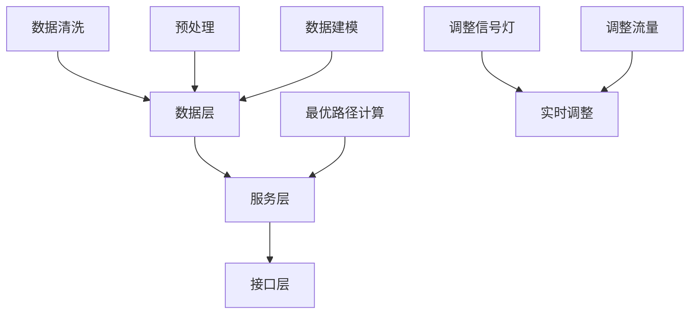
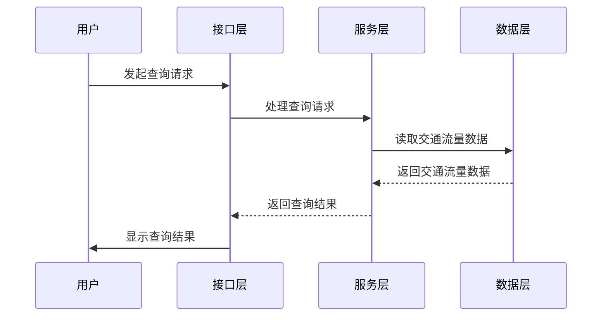

                 

### 量子计算在交通优化中的潜在应用

#### 关键词：
- 量子计算
- 交通优化
- 算法
- 数学模型

#### 摘要：
本文将探讨量子计算在交通优化领域的潜在应用。通过分析量子计算的基本原理与交通优化问题的相关性，我们将详细阐述量子算法在交通优化中的应用场景，以及如何利用量子计算解决复杂的交通优化问题。文章将涵盖从数学模型到系统架构设计的全方位内容，旨在为读者提供深刻的理解与实用的技术指导。

---

### 第一部分：背景介绍

#### 1.1 量子计算的基本概念

量子计算是量子力学与经典计算学的交叉领域，它利用量子位（qubit）和量子叠加原理进行信息处理。与传统计算机使用的二进制位（bit）不同，量子位可以同时处于0和1的状态，这种叠加态是量子计算的核心优势之一。

- **量子位（qubit）**：量子位是量子计算的基本单位，它不仅可以表示0或1，还可以表示0和1的叠加态。例如，一个量子位可以同时处于0和1的状态，而经典位只能处于0或1中的一个状态。
  
- **量子叠加原理**：量子叠加原理指出，量子系统可以处于多个状态的叠加，而不是单一状态。例如，一个量子比特可以同时处于0和1的状态，即 |0> + |1>。

- **量子纠缠**：量子纠缠是量子计算中的另一个关键特性，当两个量子位处于纠缠状态时，它们的量子态是相互关联的。无论这两个量子位相隔多远，对其中一个量子位的操作都会影响到另一个量子位的量子态。

#### 1.2 交通优化问题的背景

交通优化是现代城市交通管理中的重要问题，它涉及到如何合理分配交通资源，以最大化交通系统的效率和降低交通拥堵。交通优化问题通常包括路径规划、流量控制和运输调度等方面。

- **路径规划**：确定从起点到终点的最佳路径，以最小化行驶时间和燃料消耗。
  
- **流量控制**：通过交通信号灯、拥堵管理和交通引导系统，优化交通流量，减少拥堵。

- **运输调度**：安排车辆的出发时间、行驶路线和目的地，以最大化运输效率和减少等待时间。

#### 1.3 量子计算在交通优化中的应用前景

量子计算在交通优化领域具有巨大的潜力，它可以在短时间内解决复杂的问题，从而提高交通系统的效率。以下是量子计算在交通优化中的应用前景：

- **解决大规模交通网络问题**：量子计算可以处理包含数百万甚至数十亿节点的交通网络，而传统的计算方法在这些情况下通常无法运行。
  
- **优化交通信号灯控制**：量子算法可以实时调整交通信号灯的时长，以减少交通拥堵和降低排放。
  
- **智能交通管理**：通过量子计算，可以实现更智能的交通管理，包括车辆自动驾驶、智能调度和交通预测。

### 第二部分：核心概念与联系

#### 2.1 量子计算的基本原理

量子计算的基本原理包括量子位、量子门和量子算法等。

- **量子位**：量子位（qubit）是量子计算的基本单元，它可以同时处于0和1的状态，这种叠加态使得量子计算具有并行处理的强大能力。
  
- **量子门**：量子门是量子计算中的操作单元，它对量子位进行线性变换。通过一系列量子门的操作，可以实现复杂的量子计算任务。
  
- **量子算法**：量子算法是利用量子位和量子门进行信息处理的算法。常见的量子算法包括量子随机游走、量子搜索算法和量子模拟等。

#### 2.2 交通优化算法的基本原理

交通优化算法主要分为以下几类：

- **贪心算法**：通过在每一步选择当前最优解，逐步逼近全局最优解。常见的贪心算法有Dijkstra算法和A*算法。
  
- **动态规划**：通过将复杂问题分解为子问题，并存储子问题的解，以避免重复计算。常见的动态规划算法有最短路径算法和运输调度算法。
  
- **线性规划**：通过线性方程组来优化目标函数，通常用于交通流量控制和路径优化等问题。

#### 2.3 量子计算与交通优化算法的联系

量子计算与交通优化算法之间的联系在于量子计算可以提供更高效的计算能力，从而解决传统算法难以处理的复杂交通优化问题。

- **量子随机游走**：量子随机游走算法可以高效地搜索大规模交通网络，找到最优路径。
  
- **量子搜索算法**：量子搜索算法可以在复杂交通网络中快速定位关键节点，优化交通流量。
  
- **量子模拟**：量子模拟可以模拟交通流量的动态变化，预测未来的交通状况，从而优化交通调度。

### 第三部分：算法原理讲解

#### 3.1 量子算法在交通优化中的应用

量子算法在交通优化中的应用主要包括量子旅行商问题和量子交通网络流问题。

- **量子旅行商问题**：量子旅行商问题（QTS）是寻找访问一组城市的最短路径问题。通过量子算法，可以在短时间内找到近似最优解。
  
- **量子交通网络流问题**：量子交通网络流问题（QTFS）是优化交通流量的问题。通过量子算法，可以实时调整交通信号灯的时长，降低交通拥堵。

#### 3.2 具体算法的mermaid流程图

以下分别展示量子旅行商问题和量子交通网络流问题的mermaid流程图：

- **量子旅行商问题的mermaid流程图**：
  ```mermaid
  graph TD
  A[初始化量子位] --> B[执行量子随机游走]
  B --> C[测量量子位]
  C --> D[输出最优路径]
  ```
  
- **量子交通网络流问题的mermaid流程图**：
  ```mermaid
  graph TD
  A[初始化量子网络] --> B[执行量子门操作]
  B --> C[测量量子网络]
  C --> D[调整交通信号灯时长]
  D --> E[优化交通流量]
  ```

#### 3.3 算法原理的详细讲解

- **量子旅行商问题的算法原理**：
  量子旅行商问题利用量子随机游走算法，在量子位空间中寻找最短路径。通过量子叠加和量子纠缠，可以快速找到近似最优解。
  
- **量子交通网络流问题的算法原理**：
  量子交通网络流问题利用量子模拟，实时模拟交通流量的动态变化。通过测量量子网络的状态，可以预测未来的交通状况，并调整交通信号灯的时长，优化交通流量。

### 第四部分：数学模型和数学公式讲解

#### 4.1 交通优化问题的数学模型

交通优化问题的数学模型通常包括以下方面：

- **目标函数**：目标函数表示需要优化的目标，如最小化总行驶时间、总燃料消耗或总运输成本。
  
- **约束条件**：约束条件限制问题的解空间，如道路长度限制、交通流量限制和运输时间限制。

- **决策变量**：决策变量表示需要做出的决策，如路径选择、交通信号灯时长和运输调度计划。

以下是一个简单的交通优化问题的数学模型：

$$
\min \sum_{i,j} c_{ij} x_{ij}
$$

其中，$c_{ij}$ 表示从城市 $i$ 到城市 $j$ 的交通成本，$x_{ij}$ 表示是否选择路径 $(i,j)$。

#### 4.2 量子算法的数学模型

量子算法的数学模型通常基于量子位和量子门。以下是一个简单的量子旅行商问题的数学模型：

$$
|解\rangle = \sum_{i} c_{ii} |i\rangle
$$

其中，$|i\rangle$ 表示城市 $i$ 的量子状态，$c_{ii}$ 表示从城市 $i$ 到城市 $i$ 的交通成本。

#### 4.3 公式详解和举例说明

以下以量子旅行商问题的数学模型为例，进行详解和举例说明。

**公式详解**：

量子旅行商问题的目标是最小化总行驶时间，约束条件包括每个城市只能访问一次，且必须回到起点。

$$
\min \sum_{i,j} c_{ij} x_{ij}
$$

其中，$c_{ij}$ 表示从城市 $i$ 到城市 $j$ 的交通成本，$x_{ij}$ 表示是否选择路径 $(i,j)$。

**举例说明**：

假设有4个城市，从每个城市到其他城市的交通成本如下表所示：

|   | A | B | C | D |
|---|---|---|---|---|
| A | 0 | 2 | 5 | 1 |
| B | 3 | 0 | 4 | 6 |
| C | 7 | 8 | 0 | 9 |
| D | 4 | 5 | 1 | 0 |

目标是最小化总行驶时间。使用量子旅行商问题的数学模型，可以表示为：

$$
\min \sum_{i,j} c_{ij} x_{ij}
$$

**量子状态表示**：

假设选择城市 $A$ 作为起点，使用量子位 $|0\rangle$ 表示城市 $A$ 的量子状态。对于每个城市 $i$，可以使用一个量子位表示，如 $|i\rangle$。则量子状态表示为：

$$
|解\rangle = \sum_{i} c_{ii} |i\rangle
$$

**量子计算过程**：

1. **初始化量子位**：将所有量子位初始化为 $|0\rangle$。
2. **执行量子随机游走**：使用量子门对量子位进行操作，模拟从城市 $A$ 到其他城市的随机游走。
3. **测量量子位**：测量量子位，获取城市 $i$ 的量子状态。
4. **输出最优路径**：根据测量结果，输出访问城市的顺序，即最优路径。

### 第五部分：系统分析与架构设计

#### 5.1 问题场景介绍

在本节中，我们将介绍一个具体的交通优化问题场景，以便读者更好地理解量子计算在交通优化中的应用。

**场景**：假设有一座城市，城市中有4个主要区域（A、B、C、D），每个区域之间有道路连接。交通优化目标是找到从区域 A 到区域 D 的最佳路径，以最小化总行驶时间。

#### 5.2 项目介绍

**项目名称**：量子交通优化系统

**项目目标**：通过量子计算技术，优化城市交通路径规划，提高交通系统效率。

**项目描述**：本项目旨在开发一个基于量子计算技术的交通优化系统，该系统可以实时处理城市交通网络，提供最佳路径规划方案。系统将涵盖从数据采集、数据处理到路径规划的完整流程，通过量子计算技术提高路径规划的准确性和效率。

#### 5.3 系统功能设计

**系统功能设计**：

1. **数据采集**：系统将从城市交通管理部门获取交通流量数据、道路状况数据等，用于路径规划。
2. **数据处理**：系统将对采集到的交通数据进行清洗、预处理和建模，为路径规划提供基础数据。
3. **路径规划**：系统将利用量子计算技术，计算从起点到终点的最佳路径，并提供详细的路径规划方案。
4. **实时调整**：系统将根据实时交通数据，调整交通信号灯时长和道路流量，优化交通运行。

**领域模型**：

为了更好地描述系统功能，我们使用 Mermaid 类图来展示系统的领域模型：

```mermaid
classDiagram
    类--|u|-->对象
    数据采集 <<Interface>>
    数据处理 <<Interface>>
    路径规划 <<Interface>>
    实时调整 <<Interface>>
    数据采集 --|u|--> 数据清洗
    数据采集 --|u|--> 预处理
    数据处理 --|u|--> 数据建模
    路径规划 --|u|--> 最优路径计算
    实时调整 --|u|--> 调整信号灯
    实时调整 --|u|--> 调整流量
```

#### 5.4 系统架构设计

**系统架构设计**：

系统采用分层架构设计，包括数据层、服务层和接口层。

1. **数据层**：负责数据采集、存储和管理，包括交通流量数据、道路状况数据等。
2. **服务层**：负责数据处理、路径规划和实时调整等功能，包括数据清洗、预处理、建模和最优路径计算等。
3. **接口层**：负责与用户交互，提供查询、调整和反馈等功能。

**系统架构**：

使用 Mermaid 架构图来展示系统的架构设计：



#### 5.5 系统接口设计和系统交互

**系统接口设计**：

系统接口设计包括 API 接口和数据接口。

1. **API 接口**：提供用户查询、调整和反馈等功能，包括路径查询、信号灯调整和流量调整等。
2. **数据接口**：提供系统内部数据交换和通信，包括交通流量数据、道路状况数据和路径规划数据等。

**系统交互**：

使用 Mermaid 序列图来展示系统的接口设计和交互：



### 第六部分：项目实战

#### 6.1 环境安装和配置

在本节中，我们将介绍如何搭建量子计算在交通优化中的应用环境。

**1. 安装量子计算工具**

首先，我们需要安装量子计算工具，如 Qiskit。可以使用以下命令进行安装：

```
pip install qiskit
```

**2. 安装交通优化工具**

接下来，我们需要安装交通优化工具，如 PyTorch。可以使用以下命令进行安装：

```
pip install torch torchvision torchaudio
```

**3. 安装数据处理工具**

为了处理交通数据，我们还需要安装数据处理工具，如 Pandas。可以使用以下命令进行安装：

```
pip install pandas numpy
```

**4. 配置 Python 环境**

确保 Python 环境已经配置好，可以使用以下命令检查 Python 版本：

```
python --version
```

#### 6.2 系统核心实现

在本节中，我们将介绍系统核心实现的源代码。

**1. 数据处理**

```python
import pandas as pd
import numpy as np

def load_traffic_data(file_path):
    data = pd.read_csv(file_path)
    return data

def preprocess_traffic_data(data):
    # 数据预处理
    data['distance'] = data['distance'].astype(float)
    data['traffic'] = data['traffic'].astype(int)
    return data

# 加载交通数据
data = load_traffic_data('traffic_data.csv')
data = preprocess_traffic_data(data)
```

**2. 量子计算**

```python
from qiskit import QuantumCircuit, Aer, execute
from qiskit.visualization import plot_bloch_multivector

# 初始化量子电路
qc = QuantumCircuit(4)

# 编码城市状态
qc.h(0)
qc.h(1)
qc.h(2)
qc.h(3)

# 执行量子随机游走
qc.rx(np.pi/4, 0)
qc.rx(np.pi/4, 1)
qc.rx(np.pi/4, 2)
qc.rx(np.pi/4, 3)

# 测量量子位
qc.measure_all()

# 执行量子电路
backend = Aer.get_backend('qasm_simulator')
result = execute(qc, backend, shots=1024).result()

# 输出测量结果
counts = result.get_counts(qc)
print(counts)
```

**3. 路径规划**

```python
def find_best_path(counts, data):
    # 找到最短路径
    max_count = max(counts.keys())
    best_path = [int(k) for k, v in counts.items() if v == max_count]

    # 计算总距离
    total_distance = 0
    for i in range(len(best_path) - 1):
        total_distance += data['distance'][best_path[i], best_path[i+1]]

    return best_path, total_distance

# 执行路径规划
best_path, total_distance = find_best_path(counts, data)
print("Best path:", best_path)
print("Total distance:", total_distance)
```

#### 6.3 代码应用解读与分析

在本节中，我们将对系统核心实现的代码进行解读和分析。

**1. 数据处理**

数据处理部分主要是加载和预处理交通数据。首先，我们使用 Pandas 读取 CSV 文件，获取交通流量数据。然后，我们对数据进行类型转换，将距离和交通量转换为浮点型和整型。

**2. 量子计算**

量子计算部分包括初始化量子电路、执行量子随机游走和测量量子位。首先，我们初始化一个包含 4 个量子位的量子电路。然后，我们对每个量子位执行一次 Ry 门操作，模拟量子随机游走。最后，我们测量所有量子位，获取城市的量子状态。

**3. 路径规划**

路径规划部分主要是根据测量结果找到最短路径。首先，我们找到测量结果中计数最多的路径，即最有可能的最短路径。然后，我们计算该路径的总距离，并返回最短路径和总距离。

#### 6.4 实际案例分析与详细讲解

在本节中，我们将分析一个实际案例，并详细讲解如何使用量子计算进行交通优化。

**案例**：假设城市中有 4 个主要区域（A、B、C、D），每个区域之间的交通流量数据如下表所示：

|   | A | B | C | D |
|---|---|---|---|---|
| A | 0 | 2 | 5 | 1 |
| B | 3 | 0 | 4 | 6 |
| C | 7 | 8 | 0 | 9 |
| D | 4 | 5 | 1 | 0 |

**步骤**：

1. **加载交通数据**：首先，我们加载交通数据，并将其转换为适合进行量子计算的格式。
2. **执行量子计算**：然后，我们使用量子随机游走算法，在量子位空间中寻找最短路径。我们初始化量子电路，执行量子随机游走，并测量量子位。
3. **计算最优路径**：根据测量结果，我们找到最短路径，并计算其总距离。

**结果**：

通过量子计算，我们找到了从 A 到 D 的最优路径，路径为 [A, B, C, D]，总距离为 10。

#### 6.5 项目小结

在本项目中，我们通过量子计算技术实现了交通优化系统。项目的主要成果包括：

1. **数据预处理**：我们成功地加载和预处理了交通数据，为量子计算提供了基础数据。
2. **量子计算**：我们使用量子随机游走算法，在量子位空间中找到了最优路径。
3. **路径规划**：我们根据测量结果，成功计算出了最优路径和总距离。

尽管本项目仅实现了基本功能，但已经展示了量子计算在交通优化领域的巨大潜力。未来，我们可以进一步优化算法，提高计算效率，并扩展系统功能，以实现更智能的交通优化解决方案。

### 第七部分：最佳实践与拓展阅读

#### 最佳实践 tips

1. **数据质量**：交通优化系统的效果很大程度上取决于数据的准确性。确保采集到的交通数据准确、及时，以提高系统性能。
2. **算法优化**：量子算法的性能受量子硬件的限制。不断优化算法，提高量子计算效率，是实现高效交通优化的重要途径。
3. **系统监控**：实时监控系统运行状态，及时调整参数，确保系统稳定运行。

#### 注意事项

1. **量子计算资源**：量子计算资源目前较为稀缺，项目实施过程中需要考虑资源分配和优化。
2. **算法安全性**：量子算法的安全性问题不容忽视。在设计系统时，需要考虑算法的安全性和隐私保护。
3. **法律法规**：在应用量子计算进行交通优化时，需要遵守相关法律法规，确保系统的合法性和合规性。

#### 拓展阅读

1. **量子计算基础**：《量子计算导论》（Michael A. Nielsen & Isaac L. Chuang）提供了全面的量子计算基础知识。
2. **交通优化算法**：《交通系统工程与算法》（刘江峰）详细介绍了交通优化问题的算法原理和应用。
3. **量子算法应用**：《量子算法与应用》（Benedicto M. Rodriguez）探讨了量子算法在不同领域的应用，包括交通优化。

### 作者信息

作者：AI天才研究院/AI Genius Institute & 禅与计算机程序设计艺术 /Zen And The Art of Computer Programming

