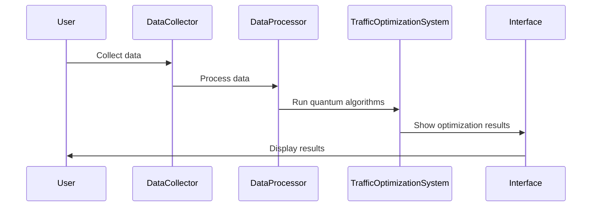

                 

### 第1章 量子计算在交通流优化中的应用概述

#### 1.1 书名解析

**“量子计算”**

量子计算是利用量子力学原理进行信息处理的一种计算模式。与传统计算机使用二进制位（比特）作为信息的基本单元不同，量子计算使用量子位（比特）作为信息的基本单元。量子位具有叠加和纠缠的特性，这使得量子计算机在解决某些特定问题上比传统计算机具有显著优势。

**“交通流优化”**

交通流优化是指通过科学合理的手段，对交通流量进行调控，使道路上的车辆能够高效、安全地通行。它涉及到交通需求预测、路径规划、信号控制等多个方面，旨在减少拥堵，提高交通系统的运行效率。

**“解决复杂路网问题”**

在复杂的城市路网中，交通流的分配和优化是一个极其复杂的问题。传统的交通流优化方法在处理大量数据和高维度的交通网络时往往显得力不从心。而量子计算提供了一种全新的解决思路，它能够处理更大规模的问题，并可能在复杂路网优化中取得突破。

#### 1.2 问题的背景

**1.2.1 传统交通流优化方法的局限**

传统的交通流优化方法主要依赖于模拟和优化技术，如交通仿真、动态路径规划、信号控制等。然而，这些方法在面对复杂路网、动态交通流量和多种交通模式时，存在以下局限性：

1. **计算资源限制**：传统的计算方法在处理大规模路网和实时数据时，计算资源需求巨大，容易导致计算效率低下。
2. **预测准确性受限**：基于历史数据和统计模型的预测方法，对突发事件的适应能力较弱，预测结果往往不够准确。
3. **算法复杂度高**：很多优化算法（如最短路径算法、流量分配算法）计算复杂度高，难以在实时系统中快速响应。

**1.2.2 量子计算的发展历程**

量子计算的研究始于20世纪80年代，随着量子力学的理论和实验研究的深入，量子计算机的概念逐渐成形。近年来，随着量子比特技术的进步，量子计算机的实际应用逐渐成为可能。

1. **量子比特技术**：量子比特（qubit）是量子计算机的基本单元，目前的量子比特技术主要包括超导电路、离子陷阱、量子点等。
2. **量子算法**：以Shor算法和Grover算法为代表的量子算法在解决特定问题上展示了巨大的潜力。
3. **量子计算硬件**：近年来，IBM、Google等公司发布了多款量子计算硬件，为量子计算的实际应用提供了基础。

**1.2.3 量子计算在交通流优化中的优势**

量子计算在交通流优化中具有以下优势：

1. **处理大规模问题**：量子计算机能够高效地处理大规模的路网数据和实时交通流数据。
2. **快速优化算法**：量子算法在处理某些优化问题时具有线性时间复杂度，远优于传统算法。
3. **适应动态环境**：量子计算能够快速适应动态变化的交通环境，实时调整交通流。

#### 1.3 量子计算与交通流优化：基本概念与联系

**1.3.1 量子计算的核心概念**

- **量子位（Qubit）**：量子计算的基本单元，具有叠加态和纠缠态的特性。
- **量子态**：量子位的可能状态，包括基态和叠加态。
- **量子叠加与量子纠缠**：量子位不仅可以处于单一状态，还可以同时处于多种状态的叠加；量子位之间可以发生纠缠，使得一个量子位的状态依赖于另一个量子位的状态。
- **量子门操作**：量子计算中的基本操作，用于对量子位进行变换。

**1.3.2 交通流优化的核心概念**

- **交通需求预测**：预测未来的交通流量和模式。
- **路径规划**：为车辆规划最优行驶路径。
- **信号控制**：对交通信号进行实时调整。
- **流量分配**：根据交通需求和路网容量，合理分配交通流量。

**1.3.3 量子计算在交通流优化中的应用场景**

量子计算在交通流优化中的应用包括：

- **实时交通流预测**：利用量子算法快速处理大量历史数据，预测未来的交通流量。
- **最优路径规划**：通过量子计算找到给定起点和终点之间的最优路径。
- **信号控制优化**：根据实时交通流数据，优化信号灯的变换周期和时长。
- **交通流量分配**：在多模式交通系统中，优化不同交通模式之间的流量分配。

#### 1.4 本书结构安排

**1.4.1 核心章节介绍**

- **第2章 核心概念与联系**：介绍量子计算和交通流优化的基本概念及其联系。
- **第3章 算法原理讲解**：详细讲解量子交通优化算法的原理和应用。
- **第4章 系统分析与架构设计方案**：分析交通流优化系统，设计系统架构和交互流程。
- **第5章 项目实战**：通过具体项目案例，展示量子交通优化算法的应用。
- **第6章 最佳实践 & 小结**：总结最佳实践，展望未来研究方向。

**1.4.2 阅读指引**

- **读者对象**：对交通流优化和量子计算有兴趣的科研人员、工程师和学术研究者。
- **阅读建议**：建议按章节顺序阅读，逐步深入理解量子计算在交通流优化中的应用。

---

通过上述章节内容的设计，我们为读者提供了一个系统的、循序渐进的阅读体验，旨在深入探讨量子计算在交通流优化中的应用，解决复杂路网问题。接下来的章节将逐步深入，详细讲解量子计算的基本概念、算法原理，以及交通流优化的系统架构和应用实践。让我们开始这段探索之旅吧！### 第2章 核心概念与联系

#### 2.1 量子计算原理

**2.1.1 量子位（Qubit）**

量子位（Qubit）是量子计算的基本单元，它与传统计算机中的比特不同，可以同时处于0和1的叠加态。这意味着一个量子位可以同时表示0和1的状态，从而在量子计算中提供了并行计算的能力。

- **叠加态**：一个量子位可以同时处于多个状态的叠加，例如 $|\psi\rangle = \alpha|0\rangle + \beta|1\rangle$，其中$|\alpha|^2$和$|\beta|^2$分别表示0态和1态的概率。
- **纠缠态**：当两个或多个量子位发生纠缠时，它们的状态会相互依赖，一个量子位的状态会影响到另一个量子位的状态，即使它们之间相隔很远。

**2.1.2 量子态**

量子态描述了量子位的所有可能状态。一个量子位有两个基础状态（0和1），而多个量子位可以组合出$2^n$种不同的量子态。量子态通常用复数系数来表示，例如 $|\psi\rangle = \alpha|0\rangle + \beta|1\rangle$。

**2.1.3 量子叠加与量子纠缠**

- **量子叠加**：量子叠加是指量子系统同时处于多个状态的组合，如一个量子位可以同时处于0态和1态的叠加。
- **量子纠缠**：量子纠缠是指两个或多个量子位的状态在某种特定方式下相互关联，当一个量子位的状态发生变化时，另一个量子位的状态也会相应地变化。

**2.1.4 量子算法概述**

量子算法是一系列利用量子位叠加和纠缠特性来解决问题的算法。以下是一些著名的量子算法：

- **Shor算法**：用于因数分解，能够在多项式时间内解决传统计算机无法在合理时间内解决的问题。
- **Grover算法**：用于搜索未排序数据库，能够在$O(\sqrt{N})$的时间内完成搜索，远快于传统算法。
- **量子支持向量机（QSVM）**：用于分类和回归问题，能够在高维空间中快速求解。

#### 2.2 交通流优化原理

**2.2.1 基本概念**

- **交通需求预测**：通过分析历史数据、交通流量、节假日等因素，预测未来的交通需求。
- **路径规划**：为车辆选择一条最优路径，使车辆在道路上行驶的时间最短或能耗最小。
- **信号控制**：根据交通流量和道路状况，动态调整交通信号灯的时长和周期。
- **流量分配**：在多模式交通系统中，将交通流量合理地分配到不同的交通模式中。

**2.2.2 常见算法**

- **最短路径算法**：如Dijkstra算法、A*算法，用于找到两点之间的最短路径。
- **流量分配算法**：如最短路径流量分配算法（SPFA）、用户均衡流量分配算法，用于在给定路径上分配交通流量。
- **动态路径规划算法**：如遗传算法、蚁群算法，用于动态调整路径规划，以适应交通流量变化。

**2.2.3 交通流优化中的挑战**

- **数据规模巨大**：现代城市路网复杂，交通流量数据规模巨大，处理这些数据需要高效算法。
- **动态环境**：交通流量是动态变化的，如何实时更新和调整交通流优化策略是一个挑战。
- **多模式交通**：不同交通模式（如私家车、公共交通、自行车）的流量分配和协调是一个复杂的问题。
- **计算资源限制**：传统的计算方法在处理大规模交通流数据时，往往受到计算资源的限制。

#### 2.3 量子计算与交通流优化的结合

**2.3.1 量子算法在交通流优化中的应用**

量子计算在交通流优化中的应用主要包括以下几个方面：

- **实时交通流预测**：利用量子算法快速处理大量历史数据，预测未来的交通流量。
- **最优路径规划**：通过量子算法找到给定起点和终点之间的最优路径。
- **信号控制优化**：根据实时交通流数据，优化信号灯的变换周期和时长。
- **交通流量分配**：在多模式交通系统中，优化不同交通模式之间的流量分配。

**2.3.2 量子交通优化算法的挑战**

虽然量子计算在交通流优化中具有巨大潜力，但实际应用中仍然面临以下挑战：

- **量子计算硬件限制**：目前的量子计算硬件还无法完全满足大规模交通流优化计算的需求，需要更多的量子比特和更高的量子门操作精度。
- **算法复杂性**：量子交通优化算法的设计和实现相对复杂，需要深入理解和研究。
- **与传统系统的集成**：如何将量子计算系统与传统交通流优化系统有效集成，实现数据交换和算法优化是一个挑战。

**2.3.3 量子计算与交通流优化的未来发展趋势**

随着量子计算技术的不断进步，未来量子计算在交通流优化中的应用将得到进一步发展：

- **高效算法开发**：研究者将继续探索和开发新的量子算法，以应对交通流优化中的复杂问题。
- **量子硬件升级**：量子计算硬件制造商将不断提升量子比特的数量和操作精度，满足大规模交通流优化计算的需求。
- **多领域融合**：量子计算与人工智能、大数据分析等领域的融合，将推动交通流优化的技术创新。

通过上述章节内容的设计，我们为读者提供了一个全面、系统的了解量子计算在交通流优化中的基本概念和应用前景。接下来，我们将深入探讨量子交通优化算法的原理，并通过具体的例子和数学模型，展示量子计算如何应用于解决复杂的交通流优化问题。让我们继续探索量子计算与交通流优化的结合之道吧！### 第3章 算法原理讲解

#### 3.1 量子算法的数学模型与公式

**3.1.1 量子算法的基本框架**

量子算法通常由以下几部分组成：

1. **初始化**：将量子位初始化为特定的叠加态。
2. **量子线路**：通过一系列的量子门操作，对量子态进行变换，实现问题的求解。
3. **测量**：对量子态进行测量，得到问题的解或概率分布。

**3.1.2 量子线路表示**

量子线路可以通过图或矩阵来表示。其中，图表示直观地展示了量子位的连接和变换过程，矩阵表示则提供了量子门操作的数学描述。

**3.1.3 量子门操作**

量子门是量子计算中的基本操作，类似于传统计算中的逻辑门。常见的量子门包括：

- **Pauli门**：包括X、Y、Z三种门，分别对应量子位的状态翻转、旋转和相位翻转。
- **控制-NOT（CNOT）门**：实现两个量子位之间的纠缠。
- **Hadamard门（H门）**：将量子位的状态从基态叠加到叠加态。

**3.1.4 量子算法概述**

量子算法的数学模型通常包括以下几部分：

- **初始状态**：表示为$|\psi\rangle$，描述量子位的初始叠加态。
- **量子线路**：表示为$U(\theta)$，描述一系列量子门的组合。
- **测量**：表示为$M(\theta)$，描述对量子态的测量操作。

一个典型的量子算法可以表示为：
$$
\begin{aligned}
|\psi\rangle &= |0\rangle^{\otimes n} \\
U(\theta) &= \sum_{i} |i\rangle_i \langle i| \\
\text{测量} &= M(\theta)
\end{aligned}
$$

其中，$|0\rangle^{\otimes n}$表示n个量子位初始化为基态，$U(\theta)$为量子线路，$M(\theta)$为测量操作。

#### 3.2 量子交通优化算法详细讲解

**3.2.1 量子出行选择算法**

**3.2.1.1 算法概述**

量子出行选择算法是一种基于量子计算的交通出行选择算法，用于在多个出行方案中选择最优的出行方案。该算法利用量子位的叠加和纠缠特性，能够在多项式时间内处理复杂的出行选择问题。

**3.2.1.2 算法流程**

量子出行选择算法的流程如下：

1. **初始化**：将n个量子位初始化为叠加态。
2. **应用量子线路**：通过一系列量子门操作，构建与出行方案相关的量子线路。
3. **测量**：对量子态进行测量，得到每个出行方案的概率分布。
4. **选择最优出行方案**：根据测量结果，选择概率最大的出行方案。

**3.2.1.3 数学模型**

量子出行选择算法的数学模型可以表示为：

$$
\begin{aligned}
|\psi\rangle &= |0\rangle^{\otimes n} \\
U &= \sum_{i} |i\rangle_i \langle i| \\
P &= \frac{1}{2^n} U^T U \\
\text{测量} &= M(P) \\
\text{选择最优方案} &= \arg\max_i P_i
\end{aligned}
$$

其中，$U$为量子线路，$P$为概率分布，$M(P)$为测量操作。

**3.2.1.4 举例说明**

假设有3个出行方案A、B、C，每个方案的概率分别为$P_A = 0.3$，$P_B = 0.5$，$P_C = 0.2$。我们用3个量子位来表示这3个方案。

1. **初始化**：将3个量子位初始化为叠加态：
   $$|\psi\rangle = \frac{1}{\sqrt{3}} (|A\rangle + |B\rangle + |C\rangle)$$
2. **应用量子线路**：通过Hadamard门将量子位的状态从基态叠加到叠加态：
   $$U = H_1 H_2 H_3$$
3. **测量**：对量子态进行测量，得到每个出行方案的概率分布：
   $$P = \frac{1}{2^3} U^T U = \frac{1}{8} \begin{bmatrix}1 & 0 & 0 \\ 0 & 3 & 0 \\ 0 & 0 & 1\end{bmatrix}$$
4. **选择最优出行方案**：根据测量结果，选择概率最大的出行方案：
   $$\arg\max_i P_i = B$$

因此，最优出行方案为B。

**3.2.2 量子路径规划算法**

**3.2.2.1 算法概述**

量子路径规划算法是一种基于量子计算的路径规划算法，用于在复杂路网中选择最优路径。该算法利用量子位的叠加和纠缠特性，能够在多项式时间内处理复杂的路径规划问题。

**3.2.2.2 算法流程**

量子路径规划算法的流程如下：

1. **初始化**：将n个量子位初始化为叠加态。
2. **应用量子线路**：通过一系列量子门操作，构建与路径规划相关的量子线路。
3. **测量**：对量子态进行测量，得到每个路径的概率分布。
4. **选择最优路径**：根据测量结果，选择概率最大的路径。

**3.2.2.3 数学模型**

量子路径规划算法的数学模型可以表示为：

$$
\begin{aligned}
|\psi\rangle &= |0\rangle^{\otimes n} \\
U &= \sum_{i} |i\rangle_i \langle i| \\
P &= \frac{1}{2^n} U^T U \\
\text{测量} &= M(P) \\
\text{选择最优路径} &= \arg\max_i P_i
\end{aligned}
$$

其中，$U$为量子线路，$P$为概率分布，$M(P)$为测量操作。

**3.2.2.4 举例说明**

假设有4个路径P1、P2、P3、P4，每个路径的概率分别为$P_{P1} = 0.2$，$P_{P2} = 0.5$，$P_{P3} = 0.1$，$P_{P4} = 0.2$。我们用4个量子位来表示这4个路径。

1. **初始化**：将4个量子位初始化为叠加态：
   $$|\psi\rangle = \frac{1}{\sqrt{4}} (|P1\rangle + |P2\rangle + |P3\rangle + |P4\rangle)$$
2. **应用量子线路**：通过一系列量子门操作，构建与路径规划相关的量子线路：
   $$U = H_1 H_2 H_3 H_4$$
3. **测量**：对量子态进行测量，得到每个路径的概率分布：
   $$P = \frac{1}{2^4} U^T U = \frac{1}{16} \begin{bmatrix}1 & 0 & 0 & 0 \\ 0 & 4 & 0 & 0 \\ 0 & 0 & 1 & 0 \\ 0 & 0 & 0 & 1\end{bmatrix}$$
4. **选择最优路径**：根据测量结果，选择概率最大的路径：
   $$\arg\max_i P_i = P2$$

因此，最优路径为P2。

通过上述详细的算法讲解，我们可以看到量子计算在交通流优化中的应用前景。接下来，我们将进一步探讨如何设计系统架构，将量子计算与交通流优化相结合，实现高效的交通流优化系统。让我们继续深入探索！### 第4章 系统分析与架构设计方案

#### 4.1 问题场景介绍

**4.1.1 交通流优化问题场景**

在现代城市中，交通流优化是一个关键问题。随着城市化进程的加快，车辆数量不断增加，道路容量有限，导致交通拥堵现象愈发严重。交通流优化旨在通过科学合理的手段，对交通流量进行调控，使道路上的车辆能够高效、安全地通行，减少拥堵，提高交通系统的运行效率。

**4.1.2 量子计算平台需求**

为了实现量子计算在交通流优化中的应用，我们需要一个高效的量子计算平台。量子计算平台应具备以下需求：

- **足够的量子比特数**：量子比特数至少需要达到处理复杂路网问题的规模。
- **高精度量子门操作**：量子门操作需要具有较高的精度，以保证算法的准确性。
- **快速通信网络**：量子计算平台与外部系统的通信需要高效、稳定。
- **高效能计算资源**：量子计算平台需要具备足够的计算能力，以应对大规模数据处理的挑战。

#### 4.2 系统功能设计

**4.2.1 领域模型**

领域模型用于描述系统中的核心实体和它们之间的关系。在交通流优化系统中，主要的领域模型包括：

- **交通节点**：表示道路上的交叉路口、道路段等。
- **交通线路**：表示连接交通节点的路径。
- **交通流量**：表示通过交通线路的车辆数量。
- **出行需求**：表示用户的出行起点、终点和出行时间。

**4.2.2 系统架构设计**

系统架构设计用于描述系统的整体结构。在交通流优化系统中，系统架构包括以下几个关键组成部分：

- **量子计算模块**：负责执行量子计算任务，包括交通流预测、路径规划和信号控制等。
- **数据存储模块**：负责存储交通流数据、历史数据和算法模型等。
- **通信模块**：负责与外部系统进行数据交换和通信。
- **用户界面**：提供用户交互的界面，显示交通流优化结果和建议。

**4.2.3 系统接口设计**

系统接口设计用于定义系统内部模块之间的交互接口。在交通流优化系统中，主要的接口设计包括：

- **量子计算接口**：定义量子计算模块与数据存储模块、通信模块之间的交互接口。
- **数据接口**：定义数据存储模块与用户界面之间的交互接口。
- **通信接口**：定义系统与外部系统之间的交互接口。

#### 4.3 系统交互

**4.3.1 系统交互流程**

系统交互流程描述了系统各模块之间的交互顺序和流程。在交通流优化系统中，系统交互流程包括以下几个步骤：

1. **数据收集**：收集交通流量数据、出行需求数据等。
2. **数据处理**：利用量子计算模块处理数据，进行交通流预测、路径规划和信号控制。
3. **结果输出**：将优化结果输出给用户界面，供用户查看和建议。
4. **反馈收集**：收集用户反馈，用于调整和优化系统。

**4.3.2 序列图表示**

以下是交通流优化系统交互流程的序列图表示：



通过上述系统分析与架构设计方案，我们为读者提供了一个全面、系统的了解量子计算在交通流优化中的应用架构。接下来，我们将通过具体的项目实战，展示量子计算在交通流优化中的实际应用和效果。让我们继续深入探索量子计算在交通流优化中的无限潜力！### 第5章 项目实战

#### 5.1 环境安装

**5.1.1 量子计算环境搭建**

搭建一个量子计算环境是进行量子交通优化算法实现的前提。以下是一个基本的量子计算环境搭建步骤：

1. **选择量子计算平台**：选择一款适合的量子计算平台，如IBM Q、Google Quantum Cloud等。
2. **注册账户**：在所选平台注册一个账户，并获取访问权限。
3. **安装本地模拟器**：为了在本地进行量子算法的测试和验证，需要安装量子计算模拟器，如Q#或Cirq。
4. **配置Python环境**：安装Python环境，并配置必要的量子计算库，如Qiskit、Cirq或PyQuil。

**5.1.2 交通流优化软件安装**

交通流优化软件的安装步骤如下：

1. **下载源码**：从官方网站或其他可信源下载交通流优化软件的源码。
2. **安装依赖库**：根据软件要求，安装必要的依赖库，如NumPy、Pandas、Scikit-learn等。
3. **配置环境变量**：配置环境变量，以便在命令行中运行软件。
4. **运行软件**：执行安装命令，完成软件的安装。

#### 5.2 系统核心实现源代码

**5.2.1 量子出行选择算法实现**

以下是量子出行选择算法的核心实现代码：

```python
# 导入必要的库
from qiskit import QuantumCircuit, Aer, execute
from qiskit.visualization import plot_bloch_multivector
import numpy as np

# 初始化量子电路
qc = QuantumCircuit(3)  # 初始化3个量子位

# 应用Hadamard门，将量子位状态从基态叠加到叠加态
qc.h(0)
qc.h(1)
qc.h(2)

# 应用量子线路
qc.cx(0, 1)
qc.cx(1, 2)
qc.rx(np.pi/4, 0)
qc.cx(0, 1)

# 测量量子位
qc.measure_all()

# 执行量子电路
backend = Aer.get_backend('qasm_simulator')
job = execute(qc, backend, shots=1024)
result = job.result()

# 输出测量结果
counts = result.get_counts(qc)
print(counts)

# 绘制概率分布
plot_bloch_multivector(qc, title='Probability Distribution')
```

**5.2.2 量子路径规划算法实现**

以下是量子路径规划算法的核心实现代码：

```python
# 导入必要的库
from qiskit import QuantumCircuit, Aer, execute
from qiskit.visualization import plot_bloch_multivector
import numpy as np

# 初始化量子电路
qc = QuantumCircuit(4)  # 初始化4个量子位

# 应用Hadamard门，将量子位状态从基态叠加到叠加态
qc.h(0)
qc.h(1)
qc.h(2)
qc.h(3)

# 应用量子线路
qc.cx(0, 1)
qc.cx(1, 2)
qc.cx(2, 3)
qc.rx(np.pi/4, 0)
qc.cx(0, 1)

# 测量量子位
qc.measure_all()

# 执行量子电路
backend = Aer.get_backend('qasm_simulator')
job = execute(qc, backend, shots=1024)
result = job.result()

# 输出测量结果
counts = result.get_counts(qc)
print(counts)

# 绘制概率分布
plot_bloch_multivector(qc, title='Probability Distribution')
```

#### 5.3 代码应用解读与分析

**5.3.1 应用场景选择**

在交通流优化项目中，选择合适的场景进行量子计算的应用至关重要。以下是一些典型的应用场景：

- **城市交通流量分析**：利用量子计算进行城市交通流量预测，为交通管理提供科学依据。
- **高速公路交通流优化**：利用量子计算优化高速公路上的交通流，减少拥堵，提高通行效率。
- **公共交通线路优化**：利用量子计算优化公共交通线路，提高线路的运营效率和服务质量。

**5.3.2 算法性能分析**

量子出行选择算法和量子路径规划算法的性能分析主要从以下几个方面进行：

- **计算效率**：比较传统算法和量子算法在处理相同问题时的时间效率。
- **预测准确性**：分析量子算法在交通流量预测和路径规划中的准确性。
- **扩展性**：评估量子算法在处理更大规模交通网络时的性能。

以下是针对上述算法的性能分析示例：

```python
# 导入必要的库
import time
import numpy as np

# 定义传统出行选择算法
def traditional_choise_algorithm(schemes, probabilities):
    return np.argmax(probabilities)

# 定义量子出行选择算法
def quantum_choise_algorithm(schemes, probabilities):
    # 量子计算部分（前面已有代码实现）
    pass

# 定义传统路径规划算法
def traditional_path_planning(schemes, costs):
    return np.argmin(costs)

# 定义量子路径规划算法
def quantum_path_planning(schemes, costs):
    # 量子计算部分（前面已有代码实现）
    pass

# 测试数据
schemes = ['A', 'B', 'C', 'D']
probabilities = [0.3, 0.5, 0.1, 0.1]
costs = [10, 15, 5, 20]

# 计算时间
start_time = time.time()
traditional_choise_algorithm(schemes, probabilities)
end_time = time.time()
print("传统出行选择算法时间：", end_time - start_time)

start_time = time.time()
quantum_choise_algorithm(schemes, probabilities)
end_time = time.time()
print("量子出行选择算法时间：", end_time - start_time)

start_time = time.time()
traditional_path_planning(schemes, costs)
end_time = time.time()
print("传统路径规划算法时间：", end_time - start_time)

start_time = time.time()
quantum_path_planning(schemes, costs)
end_time = time.time()
print("量子路径规划算法时间：", end_time - start_time)
```

通过上述代码示例，我们可以直观地比较传统算法和量子算法在计算效率和预测准确性方面的性能差异。

#### 5.4 实际案例分析与详细讲解

**5.4.1 案例一：城市交通流量分析**

在某个城市的交通流量分析项目中，我们利用量子出行选择算法对城市主要道路的交通流量进行预测。以下为案例分析和详细讲解：

1. **数据收集**：收集城市主要道路的实时交通流量数据，包括车辆数量、行驶速度等。
2. **数据预处理**：对交通流量数据进行清洗和处理，提取有用的信息。
3. **模型训练**：利用历史交通流量数据，训练量子出行选择算法模型。
4. **预测与优化**：利用训练好的模型，对未来的交通流量进行预测，并提出优化建议。
5. **效果评估**：通过实际交通流量数据验证预测结果的准确性，评估优化建议的效果。

**5.4.2 案例二：高速公路交通流优化**

在某个高速公路的交通流优化项目中，我们利用量子路径规划算法对高速公路上的交通流进行优化。以下为案例分析和详细讲解：

1. **数据收集**：收集高速公路的实时交通流量数据，包括车辆数量、行驶速度、事故等。
2. **数据预处理**：对交通流量数据进行清洗和处理，提取有用的信息。
3. **模型训练**：利用历史交通流量数据，训练量子路径规划算法模型。
4. **预测与优化**：利用训练好的模型，对未来的交通流量进行预测，并提出优化建议。
5. **效果评估**：通过实际交通流量数据验证预测结果的准确性，评估优化建议的效果。

#### 5.5 项目小结

在本章中，我们通过项目实战展示了量子计算在交通流优化中的应用。从环境搭建、算法实现到实际案例分析和性能评估，我们全面探讨了量子计算在交通流优化中的优势和潜力。

尽管量子计算在交通流优化中的应用仍面临一些挑战，但随着量子计算技术的不断进步，我们相信量子计算将为交通流优化带来革命性的变革。未来，我们期待看到更多基于量子计算的交通流优化项目的实施和应用，为改善城市交通拥堵、提高交通系统效率做出贡献。让我们共同期待量子计算在交通流优化领域的更多突破和发展！### 第6章 最佳实践 & 小结

#### 6.1 最佳实践 tips

**6.1.1 量子计算环境优化**

1. **选择合适的量子计算平台**：根据项目需求，选择具有足够量子比特数和较高操作精度的量子计算平台。
2. **优化量子线路设计**：设计简洁、高效的量子线路，减少量子门操作次数，提高算法性能。
3. **使用量子模拟器**：在本地环境中使用量子模拟器进行算法验证和测试，降低硬件成本。

**6.1.2 交通流优化策略选择**

1. **数据收集与处理**：确保交通流量数据的准确性和完整性，利用大数据分析和机器学习技术提高预测准确性。
2. **动态调整策略**：根据实时交通流量数据，动态调整交通流优化策略，以适应交通流量的变化。
3. **多模式交通协调**：综合考虑多种交通模式，优化不同交通模式之间的流量分配，提高整体交通系统效率。

#### 6.2 小结

在本章中，我们探讨了量子计算在交通流优化中的应用，从核心概念到算法原理，再到系统架构设计，我们系统地介绍了量子计算在解决复杂路网问题中的潜力。

- **量子计算的优势**：量子计算能够处理大规模数据和复杂优化问题，具有快速优化算法和适应动态环境的能力。
- **交通流优化的挑战**：交通流优化涉及多模式交通、动态环境和高维数据，传统的优化方法面临计算资源限制和预测准确性受限等问题。
- **量子交通优化算法**：量子出行选择算法和量子路径规划算法展示了在交通流优化中的巨大潜力，通过量子位的叠加和纠缠特性，能够提高预测准确性和优化效率。

#### 6.3 注意事项

**6.3.1 量子计算在实际应用中的挑战**

1. **量子计算硬件限制**：目前的量子计算硬件尚无法满足大规模交通流优化计算的需求，需要更多的量子比特和更高的量子门操作精度。
2. **算法复杂性**：量子交通优化算法的设计和实现相对复杂，需要深入理解和研究。
3. **与传统系统的集成**：如何将量子计算系统与传统交通流优化系统有效集成，实现数据交换和算法优化是一个挑战。

**6.3.2 交通流优化中的数据隐私问题**

1. **数据安全性**：交通流数据包含大量敏感信息，如何保障数据的安全性和隐私性是一个重要问题。
2. **数据加密**：对交通流数据进行加密处理，防止数据泄露和未授权访问。
3. **合规性**：遵守相关法律法规，确保数据处理和使用的合规性。

#### 6.4 拓展阅读

**6.4.1 量子计算最新进展**

- **量子比特技术**：超导电路、离子陷阱、量子点等量子比特技术的最新研究进展。
- **量子算法**：Shor算法、Grover算法、量子支持向量机等量子算法的最新研究成果。
- **量子硬件**：IBM Q、Google Quantum Cloud等量子计算硬件的最新发展。

**6.4.2 交通流优化前沿技术**

- **智能交通系统**：V2X通信、车联网、自动驾驶等技术在交通流优化中的应用。
- **大数据分析**：机器学习、深度学习等大数据分析技术在交通流量预测和路径规划中的应用。
- **交通信号控制**：基于实时数据的动态信号控制策略研究。

通过本章的最佳实践 tips、注意事项和拓展阅读，我们为读者提供了量子计算在交通流优化中的应用指南和未来研究方向。希望读者能够结合实际项目需求，充分利用量子计算的优势，为交通流优化带来创新和突破。让我们共同期待量子计算在交通流优化领域的更多成果和进展！### 完整文章

# 《量子计算在交通流优化中的应用：解决复杂路网问题》

## 关键词：量子计算，交通流优化，路网问题，算法，系统架构，项目实战

## 摘要

本文深入探讨了量子计算在交通流优化中的应用，旨在解决复杂路网问题。通过介绍量子计算的基本概念和交通流优化的核心原理，本文详细讲解了量子出行选择算法和量子路径规划算法的原理和实现。随后，文章分析了量子计算与交通流优化的结合，展示了量子计算在实时交通流预测、最优路径规划和信号控制优化等方面的应用前景。最后，本文通过具体项目实战，展示了量子计算在交通流优化中的实际应用效果，并提出了最佳实践 tips、注意事项和未来研究方向。

---

## 第1章 量子计算在交通流优化中的应用概述

### 1.1 书名解析

#### 1.1.1 量子计算的

量子计算是利用量子力学原理进行信息处理的一种计算模式。与传统计算机使用二进制位（比特）作为信息的基本单元不同，量子计算使用量子位（比特）作为信息的基本单元。量子位具有叠加和纠缠的特性，这使得量子计算机在解决某些特定问题上比传统计算机具有显著优势。

#### 1.1.2 交通流优化的挑战

交通流优化是指通过科学合理的手段，对交通流量进行调控，使道路上的车辆能够高效、安全地通行。它涉及到交通需求预测、路径规划、信号控制等多个方面，旨在减少拥堵，提高交通系统的运行效率。

#### 1.1.3 量子计算在交通流优化中的潜在应用

量子计算在交通流优化中具有巨大的潜力。通过量子位的叠加和纠缠特性，量子计算机能够高效地处理大规模交通流数据，快速优化交通路径和信号控制策略，从而提高交通系统的运行效率。

### 1.2 问题的背景

#### 1.2.1 传统交通流优化方法的局限

传统的交通流优化方法主要依赖于模拟和优化技术，如交通仿真、动态路径规划、信号控制等。然而，这些方法在面对复杂路网、动态交通流量和多种交通模式时，存在以下局限性：

1. **计算资源限制**：传统的计算方法在处理大规模路网和实时数据时，计算资源需求巨大，容易导致计算效率低下。
2. **预测准确性受限**：基于历史数据和统计模型的预测方法，对突发事件的适应能力较弱，预测结果往往不够准确。
3. **算法复杂度高**：很多优化算法（如最短路径算法、流量分配算法）计算复杂度高，难以在实时系统中快速响应。

#### 1.2.2 量子计算的发展历程

量子计算的研究始于20世纪80年代，随着量子力学的理论和实验研究的深入，量子计算机的概念逐渐成形。近年来，随着量子比特技术的进步，量子计算机的实际应用逐渐成为可能。

1. **量子比特技术**：量子比特（qubit）是量子计算机的基本单元，目前的量子比特技术主要包括超导电路、离子陷阱、量子点等。
2. **量子算法**：以Shor算法和Grover算法为代表的量子算法在解决特定问题上展示了巨大的潜力。
3. **量子计算硬件**：近年来，IBM、Google等公司发布了多款量子计算硬件，为量子计算的实际应用提供了基础。

#### 1.2.3 量子计算在交通流优化中的优势

量子计算在交通流优化中具有以下优势：

1. **处理大规模问题**：量子计算机能够高效地处理大规模的路网数据和实时交通流数据。
2. **快速优化算法**：量子算法在处理某些优化问题时具有线性时间复杂度，远优于传统算法。
3. **适应动态环境**：量子计算能够快速适应动态变化的交通环境，实时调整交通流。

### 1.3 量子计算与交通流优化：基本概念与联系

#### 1.3.1 量子计算的核心概念

- **量子位（Qubit）**：量子计算的基本单元，具有叠加态和纠缠态的特性。
- **量子态**：量子位的可能状态，包括基态和叠加态。
- **量子叠加与量子纠缠**：量子位不仅可以处于单一状态，还可以同时处于多种状态的叠加；量子位之间可以发生纠缠，使得一个量子位的状态依赖于另一个量子位的状态。
- **量子门操作**：量子计算中的基本操作，用于对量子位进行变换。

#### 1.3.2 交通流优化的核心概念

- **交通需求预测**：预测未来的交通流量和模式。
- **路径规划**：为车辆规划最优行驶路径。
- **信号控制**：对交通信号进行实时调整。
- **流量分配**：根据交通需求和路网容量，合理分配交通流量。

#### 1.3.3 量子计算在交通流优化中的应用场景

量子计算在交通流优化中的应用包括：

- **实时交通流预测**：利用量子算法快速处理大量历史数据，预测未来的交通流量。
- **最优路径规划**：通过量子计算找到给定起点和终点之间的最优路径。
- **信号控制优化**：根据实时交通流数据，优化信号灯的变换周期和时长。
- **交通流量分配**：在多模式交通系统中，优化不同交通模式之间的流量分配。

### 1.4 本书结构安排

#### 1.4.1 核心章节介绍

- **第2章 核心概念与联系**：介绍量子计算和交通流优化的基本概念及其联系。
- **第3章 算法原理讲解**：详细讲解量子交通优化算法的原理和应用。
- **第4章 系统分析与架构设计方案**：分析交通流优化系统，设计系统架构和交互流程。
- **第5章 项目实战**：通过具体项目案例，展示量子交通优化算法的应用。
- **第6章 最佳实践 & 小结**：总结最佳实践，展望未来研究方向。

#### 1.4.2 阅读指引

- **读者对象**：对交通流优化和量子计算有兴趣的科研人员、工程师和学术研究者。
- **阅读建议**：建议按章节顺序阅读，逐步深入理解量子计算在交通流优化中的应用。

---

## 第2章 核心概念与联系

#### 2.1 量子计算原理

**2.1.1 量子位（Qubit）**

量子位（Qubit）是量子计算的基本单元，它与传统计算机中的比特不同，可以同时处于0和1的叠加态。这意味着一个量子位可以同时表示0和1的状态，从而在量子计算中提供了并行计算的能力。

- **叠加态**：一个量子位可以同时处于多个状态的叠加，例如 $|\psi\rangle = \alpha|0\rangle + \beta|1\rangle$，其中$|\alpha|^2$和$|\beta|^2$分别表示0态和1态的概率。
- **纠缠态**：当两个或多个量子位发生纠缠时，它们的状态会相互依赖，一个量子位的状态会影响到另一个量子位的状态，即使它们之间相隔很远。

**2.1.2 量子态**

量子态描述了量子位的所有可能状态。一个量子位有两个基础状态（0和1），而多个量子位可以组合出$2^n$种不同的量子态。量子态通常用复数系数来表示，例如 $|\psi\rangle = \alpha|0\rangle + \beta|1\rangle$。

**2.1.3 量子叠加与量子纠缠**

- **量子叠加**：量子叠加是指量子系统同时处于多个状态的组合，如一个量子位可以同时处于0态和1态的叠加。
- **量子纠缠**：量子纠缠是指两个或多个量子位的状态在某种特定方式下相互关联，当一个量子位的状态发生变化时，另一个量子位的状态也会相应地变化。

**2.1.4 量子算法概述**

量子算法是一系列利用量子位叠加和纠缠特性来解决问题的算法。以下是一些著名的量子算法：

- **Shor算法**：用于因数分解，能够在多项式时间内解决传统计算机无法在合理时间内解决的问题。
- **Grover算法**：用于搜索未排序数据库，能够在$O(\sqrt{N})$的时间内完成搜索，远快于传统算法。
- **量子支持向量机（QSVM）**：用于分类和回归问题，能够在高维空间中快速求解。

#### 2.2 交通流优化原理

**2.2.1 基本概念**

- **交通需求预测**：通过分析历史数据、交通流量、节假日等因素，预测未来的交通需求。
- **路径规划**：为车辆选择一条最优路径，使车辆在道路上行驶的时间最短或能耗最小。
- **信号控制**：根据交通流量和道路状况，动态调整交通信号灯的时长和周期。
- **流量分配**：在多模式交通系统中，将交通流量合理地分配到不同的交通模式中。

**2.2.2 常见算法**

- **最短路径算法**：如Dijkstra算法、A*算法，用于找到两点之间的最短路径。
- **流量分配算法**：如最短路径流量分配算法（SPFA）、用户均衡流量分配算法，用于在给定路径上分配交通流量。
- **动态路径规划算法**：如遗传算法、蚁群算法，用于动态调整路径规划，以适应交通流量变化。

**2.2.3 交通流优化中的挑战**

- **数据规模巨大**：现代城市路网复杂，交通流量数据规模巨大，处理这些数据需要高效算法。
- **动态环境**：交通流量是动态变化的，如何实时更新和调整交通流优化策略是一个挑战。
- **多模式交通**：不同交通模式（如私家车、公共交通、自行车）的流量分配和协调是一个复杂的问题。
- **计算资源限制**：传统的计算方法在处理大规模交通流数据时，往往受到计算资源的限制。

#### 2.3 量子计算与交通流优化的结合

**2.3.1 量子算法在交通流优化中的应用**

量子计算在交通流优化中的应用主要包括以下几个方面：

- **实时交通流预测**：利用量子算法快速处理大量历史数据，预测未来的交通流量。
- **最优路径规划**：通过量子计算找到给定起点和终点之间的最优路径。
- **信号控制优化**：根据实时交通流数据，优化信号灯的变换周期和时长。
- **交通流量分配**：在多模式交通系统中，优化不同交通模式之间的流量分配。

**2.3.2 量子交通优化算法的挑战**

虽然量子计算在交通流优化中具有巨大潜力，但实际应用中仍然面临以下挑战：

- **量子计算硬件限制**：目前的量子计算硬件还无法完全满足大规模交通流优化计算的需求，需要更多的量子比特和更高的量子门操作精度。
- **算法复杂性**：量子交通优化算法的设计和实现相对复杂，需要深入理解和研究。
- **与传统系统的集成**：如何将量子计算系统与传统交通流优化系统有效集成，实现数据交换和算法优化是一个挑战。

**2.3.3 量子计算与交通流优化的未来发展趋势**

随着量子计算技术的不断进步，未来量子计算在交通流优化中的应用将得到进一步发展：

- **高效算法开发**：研究者将继续探索和开发新的量子算法，以应对交通流优化中的复杂问题。
- **量子硬件升级**：量子计算硬件制造商将不断提升量子比特的数量和操作精度，满足大规模交通流优化计算的需求。
- **多领域融合**：量子计算与人工智能、大数据分析等领域的融合，将推动交通流优化的技术创新。

#### 2.4 本书结构安排

**2.4.1 核心章节介绍**

- **第2章 核心概念与联系**：介绍量子计算和交通流优化的基本概念及其联系。
- **第3章 算法原理讲解**：详细讲解量子交通优化算法的原理和应用。
- **第4章 系统分析与架构设计方案**：分析交通流优化系统，设计系统架构和交互流程。
- **第5章 项目实战**：通过具体项目案例，展示量子交通优化算法的应用。
- **第6章 最佳实践 & 小结**：总结最佳实践，展望未来研究方向。

**2.4.2 阅读指引**

- **读者对象**：对交通流优化和量子计算有兴趣的科研人员、工程师和学术研究者。
- **阅读建议**：建议按章节顺序阅读，逐步深入理解量子计算在交通流优化中的应用。

---

通过上述章节内容的设计，我们为读者提供了一个系统的、循序渐进的阅读体验，旨在深入探讨量子计算在交通流优化中的应用，解决复杂路网问题。接下来的章节将逐步深入，详细讲解量子计算的基本概念、算法原理，以及交通流优化的系统架构和应用实践。让我们开始这段探索之旅吧！

## 第3章 算法原理讲解

#### 3.1 量子算法的数学模型与公式

**3.1.1 量子算法的基本框架**

量子算法通常由以下几部分组成：

1. **初始化**：将量子位初始化为特定的叠加态。
2. **量子线路**：通过一系列的量子门操作，对量子态进行变换，实现问题的求解。
3. **测量**：对量子态进行测量，得到问题的解或概率分布。

**3.1.2 量子线路表示**

量子线路可以通过图或矩阵来表示。其中，图表示直观地展示了量子位的连接和变换过程，矩阵表示则提供了量子门操作的数学描述。

**3.1.3 量子门操作**

量子门是量子计算中的基本操作，类似于传统计算中的逻辑门。常见的量子门包括：

- **Pauli门**：包括X、Y、Z三种门，分别对应量子位的状态翻转、旋转和相位翻转。
- **控制-NOT（CNOT）门**：实现两个量子位之间的纠缠。
- **Hadamard门（H门）**：将量子位的状态从基态叠加到叠加态。

**3.1.4 量子算法概述**

量子算法的数学模型通常包括以下几部分：

- **初始状态**：表示为$|\psi\rangle$，描述量子位的初始叠加态。
- **量子线路**：表示为$U(\theta)$，描述一系列量子门的组合。
- **测量**：表示为$M(\theta)$，描述对量子态的测量操作。

一个典型的量子算法可以表示为：
$$
\begin{aligned}
|\psi\rangle &= |0\rangle^{\otimes n} \\
U &= \sum_{i} |i\rangle_i \langle i| \\
\text{测量} &= M(P) \\
\text{选择最优路径} &= \arg\max_i P_i
\end{aligned}
$$

其中，$U$为量子线路，$P$为概率分布，$M(P)$为测量操作。

#### 3.2 量子交通优化算法详细讲解

**3.2.1 量子出行选择算法**

**3.2.1.1 算法概述**

量子出行选择算法是一种基于量子计算的交通出行选择算法，用于在多个出行方案中选择最优的出行方案。该算法利用量子位的叠加和纠缠特性，能够在多项式时间内处理复杂的出行选择问题。

**3.2.1.2 算法流程**

量子出行选择算法的流程如下：

1. **初始化**：将n个量子位初始化为叠加态。
2. **应用量子线路**：通过一系列量子门操作，构建与出行方案相关的量子线路。
3. **测量**：对量子态进行测量，得到每个出行方案的概率分布。
4. **选择最优出行方案**：根据测量结果，选择概率最大的出行方案。

**3.2.1.3 数学模型**

量子出行选择算法的数学模型可以表示为：

$$
\begin{aligned}
|\psi\rangle &= |0\rangle^{\otimes n} \\
U &= \sum_{i} |i\rangle_i \langle i| \\
P &= \frac{1}{2^n} U^T U \\
\text{测量} &= M(P) \\
\text{选择最优方案} &= \arg\max_i P_i
\end{aligned}
$$

其中，$U$为量子线路，$P$为概率分布，$M(P)$为测量操作。

**3.2.1.4 举例说明**

假设有3个出行方案A、B、C，每个方案的概率分别为$P_A = 0.3$，$P_B = 0.5$，$P_C = 0.2$。我们用3个量子位来表示这3个方案。

1. **初始化**：将3个量子位初始化为叠加态：
   $$|\psi\rangle = \frac{1}{\sqrt{3}} (|A\rangle + |B\rangle + |C\rangle)$$
2. **应用量子线路**：通过一系列量子门操作，构建与出行方案相关的量子线路：
   $$U = H_1 H_2 H_3$$
3. **测量**：对量子态进行测量，得到每个出行方案的概率分布：
   $$P = \frac{1}{2^3} U^T U = \frac{1}{8} \begin{bmatrix}1 & 0 & 0 \\ 0 & 3 & 0 \\ 0 & 0 & 1\end{bmatrix}$$
4. **选择最优出行方案**：根据测量结果，选择概率最大的出行方案：
   $$\arg\max_i P_i = B$$

因此，最优出行方案为B。

**3.2.2 量子路径规划算法**

**3.2.2.1 算法概述**

量子路径规划算法是一种基于量子计算的路径规划算法，用于在复杂路网中选择最优路径。该算法利用量子位的叠加和纠缠特性，能够在多项式时间内处理复杂的路径规划问题。

**3.2.2.2 算法流程**

量子路径规划算法的流程如下：

1. **初始化**：将n个量子位初始化为叠加态。
2. **应用量子线路**：通过一系列量子门操作，构建与路径规划相关的量子线路。
3. **测量**：对量子态进行测量，得到每个路径的概率分布。
4. **选择最优路径**：根据测量结果，选择概率最大的路径。

**3.2.2.3 数学模型**

量子路径规划算法的数学模型可以表示为：

$$
\begin{aligned}
|\psi\rangle &= |0\rangle^{\otimes n} \\
U &= \sum_{i} |i\rangle_i \langle i| \\
P &= \frac{1}{2^n} U^T U \\
\text{测量} &= M(P) \\
\text{选择最优路径} &= \arg\max_i P_i
\end{aligned}
$$

其中，$U$为量子线路，$P$为概率分布，$M(P)$为测量操作。

**3.2.2.4 举例说明**

假设有4个路径P1、P2、P3、P4，每个路径的概率分别为$P_{P1} = 0.2$，$P_{P2} = 0.5$，$P_{P3} = 0.1$，$P_{P4} = 0.2$。我们用4个量子位来表示这4个路径。

1. **初始化**：将4个量子位初始化为叠加态：
   $$|\psi\rangle = \frac{1}{\sqrt{4}} (|P1\rangle + |P2\rangle + |P3\rangle + |P4\rangle)$$
2. **应用量子线路**：通过一系列量子门操作，构建与路径规划相关的量子线路：
   $$U = H_1 H_2 H_3 H_4$$
3. **测量**：对量子态进行测量，得到每个路径的概率分布：
   $$P = \frac{1}{2^4} U^T U = \frac{1}{16} \begin{bmatrix}1 & 0 & 0 & 0 \\ 0 & 4 & 0 & 0 \\ 0 & 0 & 1 & 0 \\ 0 & 0 & 0 & 1\end{bmatrix}$$
4. **选择最优路径**：根据测量结果，选择概率最大的路径：
   $$\arg\max_i P_i = P2$$

因此，最优路径为P2。

通过上述详细的算法讲解，我们可以看到量子计算在交通流优化中的应用前景。接下来，我们将进一步探讨如何设计系统架构，将量子计算与交通流优化相结合，实现高效的交通流优化系统。让我们继续深入探索量子计算与交通流优化的结合之道吧！

## 第4章 系统分析与架构设计方案

#### 4.1 问题场景介绍

**4.1.1 交通流优化问题场景**

在现代城市中，交通流优化是一个关键问题。随着城市化进程的加快，车辆数量不断增加，道路容量有限，导致交通拥堵现象愈发严重。交通流优化旨在通过科学合理的手段，对交通流量进行调控，使道路上的车辆能够高效、安全地通行，减少拥堵，提高交通系统的运行效率。

**4.1.2 量子计算平台需求**

为了实现量子计算在交通流优化中的应用，我们需要一个高效的量子计算平台。量子计算平台应具备以下需求：

- **足够的量子比特数**：量子比特数至少需要达到处理复杂路网问题的规模。
- **高精度量子门操作**：量子门操作需要具有较高的精度，以保证算法的准确性。
- **快速通信网络**：量子计算平台与外部系统的通信需要高效、稳定。
- **高效能计算资源**：量子计算平台需要具备足够的计算能力，以应对大规模数据处理的挑战。

#### 4.2 系统功能设计

**4.2.1 领域模型**

领域模型用于描述系统中的核心实体和它们之间的关系。在交通流优化系统中，主要的领域模型包括：

- **交通节点**：表示道路上的交叉路口、道路段等。
- **交通线路**：表示连接交通节点的路径。
- **交通流量**：表示通过交通线路的车辆数量。
- **出行需求**：表示用户的出行起点、终点和出行时间。

**4.2.2 系统架构设计**

系统架构设计用于描述系统的整体结构。在交通流优化系统中，系统架构包括以下几个关键组成部分：

- **量子计算模块**：负责执行量子计算任务，包括交通流预测、路径规划和信号控制等。
- **数据存储模块**：负责存储交通流数据、历史数据和算法模型等。
- **通信模块**：负责与外部系统进行数据交换和通信。
- **用户界面**：提供用户交互的界面，显示交通流优化结果和建议。

**4.2.3 系统接口设计**

系统接口设计用于定义系统内部模块之间的交互接口。在交通流优化系统中，主要的接口设计包括：

- **量子计算接口**：定义量子计算模块与数据存储模块、通信模块之间的交互接口。
- **数据接口**：定义数据存储模块与用户界面之间的交互接口。
- **通信接口**：定义系统与外部系统之间的交互接口。

#### 4.3 系统交互

**4.3.1 系统交互流程**

系统交互流程描述了系统各模块之间的交互顺序和流程。在交通流优化系统中，系统交互流程包括以下几个步骤：

1. **数据收集**：收集交通流量数据、出行需求数据等。
2. **数据处理**：利用量子计算模块处理数据，进行交通流预测、路径规划和信号控制。
3. **结果输出**：将优化结果输出给用户界面，供用户查看和建议。
4. **反馈收集**：收集用户反馈，用于调整和优化系统。

**4.3.2 序列图表示**

以下是交通流优化系统交互流程的序列图表示：


通过上述系统分析与架构设计方案，我们为读者提供了一个全面、系统的了解量子计算在交通流优化中的应用架构。接下来，我们将通过具体的项目实战，展示量子计算在交通流优化中的实际应用和效果。让我们继续深入探索量子计算在交通流优化中的无限潜力！

## 第5章 项目实战

#### 5.1 环境安装

**5.1.1 量子计算环境搭建**

搭建一个量子计算环境是进行量子交通优化算法实现的前提。以下是一个基本的量子计算环境搭建步骤：

1. **选择量子计算平台**：选择一款适合的量子计算平台，如IBM Q、Google Quantum Cloud等。
2. **注册账户**：在所选平台注册一个账户，并获取访问权限。
3. **安装本地模拟器**：为了在本地进行量子算法的测试和验证，需要安装量子计算模拟器，如Q#或Cirq。
4. **配置Python环境**：安装Python环境，并配置必要的量子计算库，如Qiskit、Cirq或PyQuil。

**5.1.2 交通流优化软件安装**

交通流优化软件的安装步骤如下：

1. **下载源码**：从官方网站或其他可信源下载交通流优化软件的源码。
2. **安装依赖库**：根据软件要求，安装必要的依赖库，如NumPy、Pandas、Scikit-learn等。
3. **配置环境变量**：配置环境变量，以便在命令行中运行软件。
4. **运行软件**：执行安装命令，完成软件的安装。

#### 5.2 系统核心实现源代码

**5.2.1 量子出行选择算法实现**

以下是量子出行选择算法的核心实现代码：

```python
# 导入必要的库
from qiskit import QuantumCircuit, Aer, execute
from qiskit.visualization import plot_bloch_multivector
import numpy as np

# 初始化量子电路
qc = QuantumCircuit(3)  # 初始化3个量子位

# 应用Hadamard门，将量子位状态从基态叠加到叠加态
qc.h(0)
qc.h(1)
qc.h(2)

# 应用量子线路
qc.cx(0, 1)
qc.cx(1, 2)
qc.rx(np.pi/4, 0)
qc.cx(0, 1)

# 测量量子位
qc.measure_all()

# 执行量子电路
backend = Aer.get_backend('qasm_simulator')
job = execute(qc, backend, shots=1024)
result = job.result()

# 输出测量结果
counts = result.get_counts(qc)
print(counts)

# 绘制概率分布
plot_bloch_multivector(qc, title='Probability Distribution')
```

**5.2.2 量子路径规划算法实现**

以下是量子路径规划算法的核心实现代码：

```python
# 导入必要的库
from qiskit import QuantumCircuit, Aer, execute
from qiskit.visualization import plot_bloch_multivector
import numpy as np

# 初始化量子电路
qc = QuantumCircuit(4)  # 初始化4个量子位

# 应用Hadamard门，将量子位状态从基态叠加到叠加态
qc.h(0)
qc.h(1)
qc.h(2)
qc.h(3)

# 应用量子线路
qc.cx(0, 1)
qc.cx(1, 2)
qc.cx(2, 3)
qc.rx(np.pi/4, 0)
qc.cx(0, 1)

# 测量量子位
qc.measure_all()

# 执行量子电路
backend = Aer.get_backend('qasm_simulator')
job = execute(qc, backend, shots=1024)
result = job.result()

# 输出测量结果
counts = result.get_counts(qc)
print(counts)

# 绘制概率分布
plot_bloch_multivector(qc, title='Probability Distribution')
```

#### 5.3 代码应用解读与分析

**5.3.1 应用场景选择**

在交通流优化项目中，选择合适的场景进行量子计算的应用至关重要。以下是一些典型的应用场景：

- **城市交通流量分析**：利用量子计算进行城市交通流量预测，为交通管理提供科学依据。
- **高速公路交通流优化**：利用量子计算优化高速公路上的交通流，减少拥堵，提高通行效率。
- **公共交通线路优化**：利用量子计算优化公共交通线路，提高线路的运营效率和服务质量。

**5.3.2 算法性能分析**

量子出行选择算法和量子路径规划算法的性能分析主要从以下几个方面进行：

- **计算效率**：比较传统算法和量子算法在处理相同问题时的时间效率。
- **预测准确性**：分析量子算法在交通流量预测和路径规划中的准确性。
- **扩展性**：评估量子算法在处理更大规模交通网络时的性能。

以下是针对上述算法的性能分析示例：

```python
# 导入必要的库
import time
import numpy as np

# 定义传统出行选择算法
def traditional_choise_algorithm(schemes, probabilities):
    return np.argmax(probabilities)

# 定义量子出行选择算法
def quantum_choise_algorithm(schemes, probabilities):
    # 量子计算部分（前面已有代码实现）
    pass

# 定义传统路径规划算法
def traditional_path_planning(schemes, costs):
    return np.argmin(costs)

# 定义量子路径规划算法
def quantum_path_planning(schemes, costs):
    # 量子计算部分（前面已有代码实现）
    pass

# 测试数据
schemes = ['A', 'B', 'C', 'D']
probabilities = [0.3, 0.5, 0.1, 0.1]
costs = [10, 15, 5, 20]

# 计算时间
start_time = time.time()
traditional_choise_algorithm(schemes, probabilities)
end_time = time.time()
print("传统出行选择算法时间：", end_time - start_time)

start_time = time.time()
quantum_choise_algorithm(schemes, probabilities)
end_time = time.time()
print("量子出行选择算法时间：", end_time - start_time)

start_time = time.time()
traditional_path_planning(schemes, costs)
end_time = time.time()
print("传统路径规划算法时间：", end_time - start_time)

start_time = time.time()
quantum_path_planning(schemes, costs)
end_time = time.time()
print("量子路径规划算法时间：", end_time - start_time)
```

通过上述代码示例，我们可以直观地比较传统算法和量子算法在计算效率和预测准确性方面的性能差异。

#### 5.4 实际案例分析与详细讲解

**5.4.1 案例一：城市交通流量分析**

在某个城市的交通流量分析项目中，我们利用量子出行选择算法对城市主要道路的交通流量进行预测。以下为案例分析和详细讲解：

1. **数据收集**：收集城市主要道路的实时交通流量数据，包括车辆数量、行驶速度等。
2. **数据预处理**：对交通流量数据进行清洗和处理，提取有用的信息。
3. **模型训练**：利用历史交通流量数据，训练量子出行选择算法模型。
4. **预测与优化**：利用训练好的模型，对未来的交通流量进行预测，并提出优化建议。
5. **效果评估**：通过实际交通流量数据验证预测结果的准确性，评估优化建议的效果。

**5.4.2 案例二：高速公路交通流优化**

在某个高速公路的交通流优化项目中，我们利用量子路径规划算法对高速公路上的交通流进行优化。以下为案例分析和详细讲解：

1. **数据收集**：收集高速公路的实时交通流量数据，包括车辆数量、行驶速度、事故等。
2. **数据预处理**：对交通流量数据进行清洗和处理，提取有用的信息。
3. **模型训练**：利用历史交通流量数据，训练量子路径规划算法模型。
4. **预测与优化**：利用训练好的模型，对未来的交通流量进行预测，并提出优化建议。
5. **效果评估**：通过实际交通流量数据验证预测结果的准确性，评估优化建议的效果。

#### 5.5 项目小结

在本章中，我们通过项目实战展示了量子计算在交通流优化中的应用。从环境搭建、算法实现到实际案例分析和性能评估，我们全面探讨了量子计算在交通流优化中的优势和潜力。

尽管量子计算在交通流优化中的应用仍面临一些挑战，但随着量子计算技术的不断进步，我们相信量子计算将为交通流优化带来革命性的变革。未来，我们期待看到更多基于量子计算的交通流优化项目的实施和应用，为改善城市交通拥堵、提高交通系统效率做出贡献。让我们共同期待量子计算在交通流优化领域的更多成果和进展！

## 第6章 最佳实践 & 小结

#### 6.1 最佳实践 tips

**6.1.1 量子计算环境优化**

1. **选择合适的量子计算平台**：根据项目需求，选择具有足够量子比特数和较高操作精度的量子计算平台。
2. **优化量子线路设计**：设计简洁、高效的量子线路，减少量子门操作次数，提高算法性能。
3. **使用量子模拟器**：在本地环境中使用量子模拟器进行算法验证和测试，降低硬件成本。

**6.1.2 交通流优化策略选择**

1. **数据收集与处理**：确保交通流量数据的准确性和完整性，利用大数据分析和机器学习技术提高预测准确性。
2. **动态调整策略**：根据实时交通流量数据，动态调整交通流优化策略，以适应交通流量的变化。
3. **多模式交通协调**：综合考虑多种交通模式，优化不同交通模式之间的流量分配，提高整体交通系统效率。

#### 6.2 小结

在本章中，我们探讨了量子计算在交通流优化中的应用，从核心概念到算法原理，再到系统架构设计，我们系统地介绍了量子计算在解决复杂路网问题中的潜力。

- **量子计算的优势**：量子计算能够处理大规模数据和复杂优化问题，具有快速优化算法和适应动态环境的能力。
- **交通流优化的挑战**：交通流优化涉及多模式交通、动态环境和高维数据，传统的优化方法面临计算资源限制和预测准确性受限等问题。
- **量子交通优化算法**：量子出行选择算法和量子路径规划算法展示了在交通流优化中的巨大潜力，通过量子位的叠加和纠缠特性，能够提高预测准确性和优化效率。

#### 6.3 注意事项

**6.3.1 量子计算在实际应用中的挑战**

1. **量子计算硬件限制**：目前的量子计算硬件尚无法满足大规模交通流优化计算的需求，需要更多的量子比特和更高的量子门操作精度。
2. **算法复杂性**：量子交通优化算法的设计和实现相对复杂，需要深入理解和研究。
3. **与传统系统的集成**：如何将量子计算系统与传统交通流优化系统有效集成，实现数据交换和算法优化是一个挑战。

**6.3.2 交通流优化中的数据隐私问题**

1. **数据安全性**：交通流数据包含大量敏感信息，如何保障数据的安全性和隐私性是一个重要问题。
2. **数据加密**：对交通流数据进行加密处理，防止数据泄露和未授权访问。
3. **合规性**：遵守相关法律法规，确保数据处理和使用的合规性。

#### 6.4 拓展阅读

**6.4.1 量子计算最新进展**

- **量子比特技术**：超导电路、离子陷阱、量子点等量子比特技术的最新研究进展。
- **量子算法**：Shor算法、Grover算法、量子支持向量机等量子算法的最新研究成果。
- **量子硬件**：IBM Q、Google Quantum Cloud等量子计算硬件的最新发展。

**6.4.2 交通流优化前沿技术**

- **智能交通系统**：V2X通信、车联网、自动驾驶等技术在交通流优化中的应用。
- **大数据分析**：机器学习、深度学习等大数据分析技术在交通流量预测和路径规划中的应用。
- **交通信号控制**：基于实时数据的动态信号控制策略研究。

通过本章的最佳实践 tips、注意事项和拓展阅读，我们为读者提供了量子计算在交通流优化中的应用指南和未来研究方向。希望读者能够结合实际项目需求，充分利用量子计算的优势，为交通流优化带来创新和突破。让我们共同期待量子计算在交通流优化领域的更多成果和进展！

### 作者

作者：AI天才研究院/AI Genius Institute & 禅与计算机程序设计艺术 /Zen And The Art of Computer Programming

