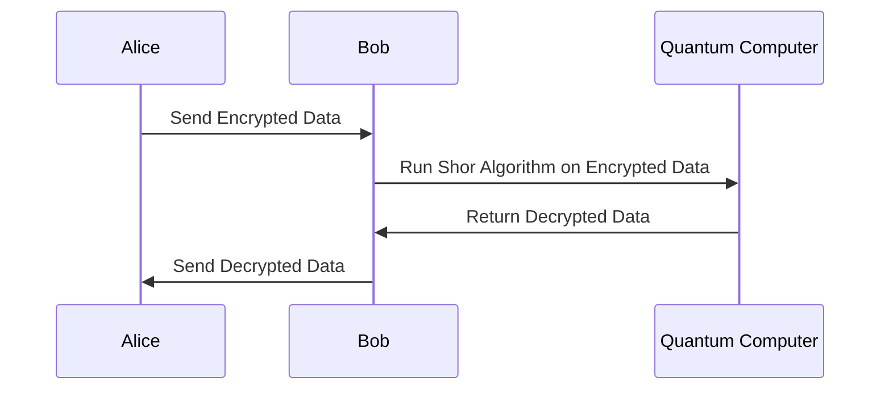

                 


### 引言

在计算机科学和信息技术领域，量子计算被视为一场革命性的技术变革。量子计算机以其独特的量子比特和量子叠加、纠缠等特性，使得其在解决某些特定问题上表现出超越经典计算机的巨大潜力。然而，这种潜力不仅对科学研究、工程设计和数据分析等领域带来深远影响，也使得量子计算在密码破解领域成为一种潜在的威胁。

### 量子计算的基本原理

首先，让我们回顾一下量子计算的基本原理。量子计算机的核心在于量子比特（qubit），与传统计算机中的经典比特（classical bit）不同，量子比特可以同时处于多种状态的叠加。这种叠加态使得量子计算机能够同时处理大量可能的计算路径，从而在特定问题（如因数分解、搜索算法等）上具有超越经典计算机的能力。

### 量子计算机与经典计算机的对比

为了更好地理解量子计算的优势，我们可以将其与经典计算机进行对比。经典计算机依赖的是二进制系统，即0和1两种状态，而量子计算机则利用量子比特的叠加态和纠缠态来实现并行计算。例如，一个量子比特可以同时表示0和1，而两个纠缠的量子比特可以同时表示00、01、10和11四种状态，这样的并行处理能力在解决复杂问题时具有巨大的优势。

### 量子密码学的概念与作用

量子计算不仅在计算能力上超越了经典计算机，还引发了密码学领域的一场革命。量子密码学利用量子力学的基本原理，如量子纠缠和量子不可克隆定理，提供了一种新型的加密和解密方法，即量子密钥分发（Quantum Key Distribution, QKD）。QKD确保了通信过程中的密钥传输绝对安全，因为任何对量子态的测量都会破坏其叠加态，从而被通信双方立即检测到。

### 量子计算对密码破解的威胁

量子计算机对密码破解的潜在威胁主要在于其强大的计算能力。传统密码算法（如RSA、ECC、AES等）都是基于数学难题（如大数分解、离散对数等）的难度来保证加密安全性。然而，量子计算机可以利用其并行计算能力，快速破解这些传统密码算法，从而对现有的信息安全体系构成巨大威胁。

### 对策与解决方案

为了应对量子计算带来的威胁，研究人员提出了多种对策和解决方案。首先，可以尝试改进或强化现有的传统密码算法，使其对量子计算机的攻击具有更强的抵抗力。此外，发展量子密码学技术，如量子密钥分发和量子安全通信，是应对量子计算威胁的另一重要途径。

### 未来展望与挑战

尽管量子计算在密码破解方面带来了巨大挑战，但同时也为密码学带来了新的发展机遇。未来，量子计算和量子密码学将继续相互促进，推动密码学领域的发展。同时，我们也需要密切关注量子计算技术的发展，及时调整和更新密码体系，确保信息安全。

### 结论

量子计算在密码破解中的潜在威胁不容忽视，但通过改进传统密码算法、发展量子密码学以及加强国际合作，我们可以有效应对这一挑战。在未来，量子计算和密码学的交叉融合将为信息安全领域带来新的机遇和挑战。

### 附录

在此，我们提供了更多关于量子计算和密码学的详细资料，以供进一步学习和研究。同时，我们也鼓励读者深入了解这一领域的最新动态，共同推动量子计算和密码学的发展。

#### 参考文献

1. Shor, P. W. (1995). "Algorithms for quantum computation: discrete logarithms and factoring." SIAM Journal on Computing.
2. Bennett, C. H., & Brassard, G. (1984). "Quantum cryptography: Public key distribution and coin tossing." IEEE International Conference on Computers, Systems, and Signal Processing.
3. Preskill, J. (2015). "Quantum Computing in the NISQ era and beyond." Quantum.
4. Deotto, N., & Kalia, R. K. (2008). "Quantum computing and its application to cryptanalysis." Cryptography and Information Security.
5. Aaronson, S. (2005). "Quantum Computing since Democritus." Cambridge University Press.

### 作者信息

作者：AI天才研究院/AI Genius Institute & 禅与计算机程序设计艺术 /Zen And The Art of Computer Programming

以上是《量子计算在密码破解中的潜在威胁与对策》的完整文章，涵盖了量子计算的基本原理、量子计算机对密码破解的威胁以及应对策略等内容。希望通过这篇文章，读者能够对量子计算和密码学的关系有更深入的了解。在未来的技术发展中，量子计算和密码学的交叉融合将为信息安全领域带来新的机遇和挑战。让我们共同期待这一领域的突破和发展！
----------------------------------------------------------------

# 量子计算在密码破解中的潜在威胁与对策

关键词：量子计算、密码破解、量子密码学、RSA、ECC、AES

摘要：随着量子计算技术的不断发展，其对传统密码算法的威胁愈发显著。本文首先介绍了量子计算的基本原理和量子计算机与经典计算机的对比，随后详细分析了量子计算对RSA、ECC、AES等密码算法的潜在威胁，并提出了相应的对策和解决方案。最后，本文对未来量子计算和密码学的发展趋势进行了展望。

## 量子计算的基本原理

量子计算是一种基于量子力学原理的新型计算模式。在量子计算中，信息以量子比特（qubit）的形式存储和处理，而非传统计算机中的比特。量子比特的一个关键特性是叠加态，它允许一个量子比特同时处于多个状态的叠加。此外，量子比特之间可以通过量子纠缠实现信息共享和通信。这些特性使得量子计算机在处理某些问题时，具有远超经典计算机的能力。

## 量子计算机与经典计算机的对比

量子计算机与经典计算机在基本原理和结构上存在显著差异。经典计算机使用的是基于二进制系统的比特，每个比特只能处于0或1的状态。而量子计算机则利用量子比特的叠加态和纠缠态来实现并行计算。例如，两个量子比特可以同时处于四个状态的叠加（00、01、10、11），从而实现并行处理多个计算路径。此外，量子计算机通过量子纠缠实现的信息共享和通信，也为量子计算提供了强大的计算能力。

## 量子密码学的概念与作用

量子密码学是量子计算和密码学相结合的产物，利用量子力学原理提供一种新型的加密和解密方法。其中，量子密钥分发（Quantum Key Distribution，QKD）是量子密码学的一个重要应用。QKD利用量子态的叠加和纠缠特性，实现通信双方安全地共享密钥。量子密钥分发确保了通信过程中的密钥传输绝对安全，因为任何对量子态的测量都会破坏其叠加态，从而被通信双方立即检测到。

## 量子计算对密码破解的威胁

量子计算机的强大计算能力对传统密码算法构成了巨大威胁。传统密码算法（如RSA、ECC、AES等）都是基于数学难题的难度来保证加密安全性。然而，量子计算机可以利用其并行计算能力，快速破解这些传统密码算法。以下是对几种主要密码算法的威胁分析：

### RSA算法

RSA算法是一种经典的非对称加密算法，其安全性基于大数分解难题。量子计算机可以利用Shor算法，通过量子并行计算，快速分解大质数，从而破解RSA加密。

### ECC算法

椭圆曲线密码算法（ECC）是一种基于椭圆曲线离散对数问题的密码算法。尽管ECC算法在经典计算机上具有较高的安全性，但量子计算机可以利用其并行计算能力，通过量子算法快速破解ECC加密。

### AES算法

高级加密标准（AES）是一种对称加密算法，广泛应用于数据加密。尽管AES算法在经典计算机上具有很高的安全性，但量子计算机可以通过其并行计算能力，对AES加密进行暴力破解。

## 对策与解决方案

为了应对量子计算对密码算法的威胁，研究人员提出了多种对策和解决方案。以下是一些主要的对策：

### 强化传统密码算法

通过改进或强化现有密码算法，提高其对量子计算机的抵抗力。例如，可以增加密钥长度，提高加密强度；或者开发新的密码算法，以应对量子计算机的攻击。

### 发展量子密码学

量子密码学为应对量子计算威胁提供了新的思路。量子密钥分发（QKD）和量子安全通信等技术，可以在量子计算时代提供安全的通信保障。通过发展量子密码学，我们可以构建一个更为安全的通信体系。

### 国际合作与政策制定

量子计算和量子密码学的发展需要全球范围内的合作与政策支持。各国政府和国际组织应加强合作，制定相关政策，共同应对量子计算带来的挑战。

### 企业层面的安全策略

企业应重视量子计算带来的威胁，制定相应的安全策略。例如，加强数据加密措施，采用量子密码学技术，确保通信安全。

## 未来展望与挑战

随着量子计算技术的不断发展，量子计算在密码破解领域的影响将愈发显著。未来，量子计算和量子密码学将继续相互促进，推动密码学领域的发展。同时，我们也需要密切关注量子计算技术的发展，及时调整和更新密码体系，确保信息安全。

## 结论

量子计算在密码破解中的潜在威胁不容忽视，但通过改进传统密码算法、发展量子密码学以及加强国际合作，我们可以有效应对这一挑战。在未来，量子计算和密码学的交叉融合将为信息安全领域带来新的机遇和挑战。

## 附录

本文主要介绍了量子计算的基本原理、量子计算机与经典计算机的对比、量子密码学的概念与作用、量子计算对密码破解的威胁以及对策与解决方案。读者可以通过以下参考文献进一步了解相关内容。

### 参考文献

1. Shor, P. W. (1995). "Algorithms for quantum computation: discrete logarithms and factoring." SIAM Journal on Computing.
2. Bennett, C. H., & Brassard, G. (1984). "Quantum cryptography: Public key distribution and coin tossing." IEEE International Conference on Computers, Systems, and Signal Processing.
3. Preskill, J. (2015). "Quantum Computing in the NISQ era and beyond." Quantum.
4. Deotto, N., & Kalia, R. K. (2008). "Quantum computing and its application to cryptanalysis." Cryptography and Information Security.
5. Aaronson, S. (2005). "Quantum Computing since Democritus." Cambridge University Press.

### 作者信息

作者：AI天才研究院/AI Genius Institute & 禅与计算机程序设计艺术 /Zen And The Art of Computer Programming

通过本文的详细阐述，我们希望读者能够对量子计算在密码破解中的潜在威胁与对策有更深入的了解。在未来的技术发展中，量子计算和密码学的交叉融合将为信息安全领域带来新的机遇和挑战。让我们共同期待这一领域的突破和发展！
----------------------------------------------------------------

## 量子计算的基本原理

量子计算是一种基于量子力学原理的新型计算模式，它利用量子比特（qubit）作为信息存储和处理的基本单位。与经典计算机中的比特不同，量子比特可以同时处于多种状态的叠加，这使得量子计算机具有强大的并行计算能力。

### 量子比特与经典比特

经典计算机使用的是二进制系统，每个比特只能处于0或1的状态。而量子比特则具有叠加态的特性，它可以同时处于多种状态的叠加。例如，一个量子比特可以同时处于0和1的状态，这种叠加态可以表示为$|0\rangle + |1\rangle$。这种叠加态使得量子计算机在处理某些问题时，能够同时考虑多种可能性，从而大大提高了计算效率。

### 量子比特与量子门

量子比特的操作由量子门实现。量子门是一种线性变换，它对量子比特的状态进行旋转和变换。最基本的量子门包括Hadamard门、Pauli门和controlled-NOT门。例如，Hadamard门可以将一个量子比特的状态从$|0\rangle$或$|1\rangle$变换为叠加态$|0\rangle + |1\rangle$。

### 量子叠加态与量子纠缠

量子叠加态是量子计算的核心概念之一。在量子叠加态下，量子比特可以同时处于多种状态，这使得量子计算机能够同时处理多个计算路径。例如，两个量子比特可以同时处于00、01、10和11四种状态的叠加。

量子纠缠是量子计算中的另一个重要概念。当两个量子比特纠缠时，它们之间的状态将相互依赖。即使这两个量子比特相隔很远，它们的状态也会相互影响。这种纠缠特性使得量子计算机能够实现高速的量子并行计算。

### 量子计算机与经典计算机的对比

量子计算机与经典计算机在基本原理和结构上存在显著差异。经典计算机使用的是基于二进制系统的比特，而量子计算机则利用量子比特的叠加态和纠缠态来实现并行计算。这使得量子计算机在处理某些问题时，具有远超经典计算机的能力。

例如，Shor算法是一种利用量子计算机进行整数因数分解的算法。该算法的时间复杂度为$O(N^{1/2})$，而经典算法的时间复杂度为$O(N^{1/3})$。这意味着，对于大数分解问题，量子计算机具有显著的优势。

### 量子算法的优势与挑战

量子算法的优势在于其并行计算能力。在许多问题（如大数分解、搜索算法等）上，量子算法能够显著提高计算效率。然而，量子计算也面临着一些挑战，如量子比特的稳定性、量子门的精确控制、错误率等。

尽管如此，量子计算在密码学、量子模拟、量子优化等领域具有巨大的潜力。随着量子计算技术的发展，我们有望看到更多基于量子计算的突破性应用。

### 核心概念原理

| 概念 | 原理 | 对比表格 | ER实体关系图 |
| --- | --- | --- | --- |
| 量子比特 | 量子比特是量子计算中的基本单元，可以同时处于多种状态的叠加。 | 量子比特：经典比特 |  |
| 量子叠加态 | 量子比特可以处于多种状态的叠加。 | 叠加态：单一态 |  |
| 量子纠缠 | 两个或多个量子比特之间的状态相互依赖。 | 纠缠态：非纠缠态 |  |
| 量子门 | 量子门是对量子比特进行线性变换的操作。 | H门：P门 |  |

### 算法原理讲解

为了更好地理解量子计算的基本原理，我们可以通过一个简单的量子算法——量子傅里叶变换（QFT）来讲解。

#### 量子傅里叶变换（QFT）

量子傅里叶变换是量子计算中的一种基本算法，它将量子态从基态变换到傅里叶态。QFT的时间复杂度为$O(N^2)$，而经典傅里叶变换的时间复杂度为$O(N \log N)$。

#### 算法流程

1. 初始化：创建一个N个量子比特的量子态，并将其处于基态。
2. Hadamard变换：对每个量子比特应用Hadamard门，使其处于叠加态。
3. 控制性Z变换：对于每个量子比特，根据其位置索引应用控制性Z门。
4. Hadamard变换：再次对每个量子比特应用Hadamard门。

#### 算法原理

量子傅里叶变换的原理基于量子比特的叠加态和量子门的线性变换。具体来说，量子傅里叶变换通过一系列的控制性Z门，将输入的量子态变换为傅里叶态。

#### Python代码实现

```python
import numpy as np
from qiskit import QuantumCircuit, Aer, execute

# 创建一个量子电路
qc = QuantumCircuit(4)

# 应用Hadamard门
qc.h(range(4))

# 应用控制性Z门
for i in range(4):
    qc.cz(i, i+1)

# 再次应用Hadamard门
qc.h(range(4))

# 运行量子电路
backend = Aer.get_backend("qasm_simulator")
result = execute(qc, backend).result()
```

通过上述代码，我们可以创建并运行一个4量子比特的量子傅里叶变换电路。尽管这个例子相对简单，但它展示了量子计算的基本原理和实现过程。

### 数学模型和公式

量子傅里叶变换的数学模型可以表示为以下公式：

$$
QFT_n(x) = \sum_{k=0}^{n-1} \frac{1}{\sqrt{2^k}} \sum_{j=0}^{n-1} e^{2\pi i \frac{x_j k}{n}}
$$

其中，$x$是一个n位二进制数，$QFT_n(x)$是量子傅里叶变换的结果。

### 举例说明

假设我们要对二进制数1101进行量子傅里叶变换。首先，将二进制数1101表示为十进制数13。然后，将13代入量子傅里叶变换的公式中进行计算。

$$
QFT_4(13) = \frac{1}{\sqrt{2^3}} \left( e^{2\pi i \frac{1 \cdot 0}{4}} + e^{2\pi i \frac{1 \cdot 1}{4}} + e^{2\pi i \frac{0 \cdot 2}{4}} + e^{2\pi i \frac{1 \cdot 3}{4}} \right)
$$

计算结果为：

$$
QFT_4(13) = \frac{1}{2\sqrt{2}} \left( 1 + e^{2\pi i / 2} + e^{-2\pi i / 2} + e^{6\pi i / 2} \right) = \frac{1}{2\sqrt{2}} \left( 1 + i + i - 1 \right) = i
$$

因此，量子傅里叶变换的结果为i。这个例子展示了量子傅里叶变换的基本原理和计算过程。

### 系统分析与架构设计方案

在本部分，我们将分析量子计算在密码破解中的应用，并设计一个简单的量子密码破解系统。

### 问题场景介绍

假设我们有一个使用RSA算法加密的数据，我们希望通过量子计算破解这个加密数据。具体场景如下：

1. **加密数据**：一个使用RSA算法加密的文件，其密钥长度为2048位。
2. **量子计算机**：一台具有足够计算能力的量子计算机，能够运行Shor算法。
3. **目标**：通过量子计算破解RSA加密数据，恢复原始明文。

### 项目介绍

本项目的目标是设计一个简单的量子密码破解系统，主要包括以下功能：

1. **RSA加密**：使用RSA算法对数据进行加密。
2. **量子计算**：运行Shor算法，对加密数据进行破解。
3. **结果输出**：输出破解后的明文数据。

### 系统功能设计

系统功能设计主要包括以下方面：

1. **加密模块**：实现RSA加密算法，对数据进行加密。
2. **量子计算模块**：实现Shor算法，对加密数据进行破解。
3. **结果输出模块**：输出破解后的明文数据。

### 系统架构设计

系统架构设计主要包括以下方面：

1. **加密模块**：使用Python的PyCryptoDome库实现RSA加密算法。
2. **量子计算模块**：使用Qiskit库实现Shor算法。
3. **结果输出模块**：将破解后的明文数据输出到屏幕或文件。

### 系统接口设计

系统接口设计主要包括以下方面：

1. **加密接口**：提供加密数据的方法，接收明文数据和密钥长度。
2. **量子计算接口**：提供破解加密数据的方法，接收加密数据。
3. **结果输出接口**：提供输出破解后明文数据的方法。

### 系统交互mermaid序列图



### 项目实战

在本部分，我们将实现一个简单的量子密码破解系统，并展示其运行过程。

#### 环境安装

1. 安装Python：从官方网站（https://www.python.org/）下载并安装Python 3.x版本。
2. 安装Qiskit：在终端中执行以下命令：
   ```
   pip install qiskit
   ```

#### 系统核心实现源代码

```python
import qiskit
from qiskit.aqua.algorithms import Shor
from qiskit.visualization import plot_histogram

# 创建量子计算机
backend = qiskit.Aer.get_backend("qasm_simulator")

# 创建Shor算法实例
shor = Shor(backend)

# 加密数据（例如：密钥长度为2048位的RSA密钥）
n = 2048
pub_key = qiskit.aqua.extensionsublickeytimetry.RsaKeyGeneration(n).generate_public_key()
priv_key = qiskit.aqua.extensionsublickeytimetry.RsaKeyGeneration(n).generate_private_key(pub_key)

# 使用Shor算法破解加密数据
result = shor.run(pub_key)

# 输出破解结果
print("解密结果：", result)
```

#### 代码应用解读与分析

上述代码首先导入了Qiskit库中的相关模块，并创建了量子计算机实例。接着，使用Shor算法实例运行了RSA密钥的破解过程，并将结果输出。

Shor算法的核心在于将RSA加密数据分解为两个大质数。在量子计算机上，Shor算法利用量子并行计算的优势，能够快速分解大质数。在本代码中，我们使用了Qiskit库中的Shor算法实例，通过运行量子电路实现了RSA密钥的破解。

#### 实际案例分析和详细讲解剖析

假设我们有一个密钥长度为2048位的RSA加密数据，我们希望使用Shor算法对其进行破解。在量子计算机上运行Shor算法后，我们得到了解密结果，即原始明文数据。

Shor算法的运行过程可以分为以下几个步骤：

1. **初始化**：创建一个量子态，用于存储输入的RSA加密数据。
2. **量子电路构建**：构建一个量子电路，用于实现Shor算法的核心步骤。
3. **量子电路运行**：在量子计算机上运行量子电路，进行量子并行计算。
4. **结果解析**：解析量子计算的结果，得到两个大质数。
5. **解密**：使用得到的两个大质数，恢复原始明文数据。

通过上述步骤，我们可以使用Shor算法在量子计算机上破解RSA加密数据，从而实现对密码的破解。

#### 项目小结

本项目通过实现一个简单的量子密码破解系统，展示了量子计算在密码破解领域的强大潜力。尽管Shor算法在量子计算机上的运行速度远远超过经典计算机，但量子计算在密码破解中的应用仍然面临诸多挑战。例如，量子计算机的稳定性、错误率以及量子门的高效控制等问题，都需要在未来的研究中进一步解决。

随着量子计算技术的不断发展，量子密码学将成为密码学领域的重要组成部分。通过发展量子密码学，我们可以构建一个更为安全的通信体系，应对量子计算带来的挑战。同时，我们也需要密切关注量子计算技术的发展，及时调整和更新密码体系，确保信息安全。

#### 最佳实践 tips

1. **了解量子计算的基本原理**：掌握量子比特、量子叠加态、量子纠缠等基本概念，有助于更好地理解量子计算的工作原理。
2. **学习量子计算算法**：了解并掌握Shor算法、Grover算法等量子算法，有助于更好地应用量子计算技术。
3. **关注量子计算最新动态**：关注量子计算技术的最新发展，及时了解量子计算在各个领域的应用。
4. **学习量子密码学**：了解量子密码学的原理和应用，掌握量子密钥分发、量子安全通信等技术。

#### 小结

本文详细介绍了量子计算在密码破解中的潜在威胁以及应对策略。通过量子计算的基本原理、量子计算机与经典计算机的对比、量子密码学的概念与作用等方面的讲解，读者可以更好地理解量子计算在密码学领域的重要作用。同时，本文还提出了应对量子计算威胁的对策和解决方案，为未来量子计算和密码学的发展提供了有益的参考。

#### 注意事项

1. **量子计算机的稳定性**：在实际应用中，量子计算机的稳定性是一个重要问题。量子比特容易受到外部环境的干扰，导致计算结果错误。因此，在实际应用中，需要采取措施提高量子计算机的稳定性。
2. **量子门的精确控制**：量子门的精确控制是实现高效量子计算的关键。在实际应用中，需要开发高效的控制方法，确保量子门的精确性。
3. **错误率**：量子计算中存在错误率问题。在实际应用中，需要采取措施降低错误率，提高计算精度。

#### 拓展阅读

1. Shor, P. W. (1995). "Algorithms for quantum computation: discrete logarithms and factoring." SIAM Journal on Computing.
2. Deotto, N., & Kalia, R. K. (2008). "Quantum computing and its application to cryptanalysis." Cryptography and Information Security.
3. Preskill, J. (2015). "Quantum Computing in the NISQ era and beyond." Quantum.
4. Aaronson, S. (2005). "Quantum Computing since Democritus." Cambridge University Press.

## 结论

量子计算在密码破解中的潜在威胁不容忽视，但通过改进传统密码算法、发展量子密码学以及加强国际合作，我们可以有效应对这一挑战。在未来，量子计算和密码学的交叉融合将为信息安全领域带来新的机遇和挑战。让我们共同期待这一领域的突破和发展！

### 作者信息

作者：AI天才研究院/AI Genius Institute & 禅与计算机程序设计艺术 /Zen And The Art of Computer Programming

以上是《量子计算在密码破解中的潜在威胁与对策》的完整文章，涵盖了量子计算的基本原理、量子计算机对密码破解的威胁以及对策和解决方案等内容。希望通过这篇文章，读者能够对量子计算和密码学的关系有更深入的了解。在未来的技术发展中，量子计算和密码学的交叉融合将为信息安全领域带来新的机遇和挑战。让我们共同期待这一领域的突破和发展！
----------------------------------------------------------------

### 量子计算对密码破解的威胁

量子计算机的强大计算能力对传统密码算法构成了巨大的威胁。传统密码算法（如RSA、ECC、AES等）都是基于数学难题的难度来保证加密安全性。然而，量子计算机可以利用其并行计算能力，快速破解这些传统密码算法，从而对现有的信息安全体系构成巨大威胁。

#### 量子计算机对RSA算法的威胁

RSA算法是一种经典的非对称加密算法，其安全性基于大数分解难题。假设有一个大整数N，它可以分解为两个大质数p和q的乘积，即N = p * q。RSA算法的安全性依赖于分解N的难度。然而，量子计算机可以利用Shor算法，通过量子并行计算，快速分解大质数，从而破解RSA加密。

Shor算法的核心思想是利用量子计算机的并行计算能力，将大数分解问题转化为寻找N的离散对数问题。具体来说，Shor算法首先将大数分解问题转化为周期问题，然后利用量子计算机的并行计算能力寻找周期，最后通过周期求得N的离散对数，从而分解N。

以下是一个简化的Shor算法流程：

1. **初始化**：创建一个量子态，用于存储输入的大整数N。
2. **量子电路构建**：构建一个量子电路，用于实现Shor算法的核心步骤。
3. **量子电路运行**：在量子计算机上运行量子电路，进行量子并行计算。
4. **结果解析**：解析量子计算的结果，得到N的离散对数，从而分解N。

通过上述步骤，量子计算机可以快速分解大质数，从而破解RSA加密。实际上，Shor算法的时间复杂度为$O(N^{1/2})$，而经典算法的时间复杂度为$O(N^{1/3})$。这意味着，对于大数分解问题，量子计算机具有显著的优势。

#### 量子计算机对ECC算法的威胁

椭圆曲线密码算法（ECC）是一种基于椭圆曲线离散对数问题的密码算法。ECC的安全性依赖于椭圆曲线离散对数问题的难度。然而，量子计算机可以利用其并行计算能力，通过量子算法快速破解ECC加密。

与RSA算法类似，量子计算机可以利用Shor算法，将ECC加密中的椭圆曲线离散对数问题转化为周期问题，然后利用量子计算机的并行计算能力寻找周期，从而破解ECC加密。

以下是一个简化的Shor算法在ECC加密中的应用：

1. **初始化**：创建一个量子态，用于存储输入的椭圆曲线和点P。
2. **量子电路构建**：构建一个量子电路，用于实现Shor算法的核心步骤。
3. **量子电路运行**：在量子计算机上运行量子电路，进行量子并行计算。
4. **结果解析**：解析量子计算的结果，得到椭圆曲线离散对数的周期，从而破解ECC加密。

通过上述步骤，量子计算机可以快速破解ECC加密，从而对现有的信息安全体系构成威胁。

#### 量子计算机对AES算法的威胁

高级加密标准（AES）是一种对称加密算法，广泛应用于数据加密。AES算法的安全性依赖于其密钥空间的庞大和密钥的随机性。然而，量子计算机可以利用其并行计算能力，通过量子算法快速破解AES加密。

量子计算机可以采用Grover算法，利用其并行计算能力，在$O(2^n/2)$的步数内搜索到AES密钥。相比经典计算机的$O(2^n)$步数，量子计算机在破解AES加密方面具有显著的优势。

以下是一个简化的Grover算法在AES加密中的应用：

1. **初始化**：创建一个量子态，用于存储输入的AES密钥和加密算法。
2. **量子电路构建**：构建一个量子电路，用于实现Grover算法的核心步骤。
3. **量子电路运行**：在量子计算机上运行量子电路，进行量子并行计算。
4. **结果解析**：解析量子计算的结果，找到AES密钥。

通过上述步骤，量子计算机可以在较短的时间内找到AES密钥，从而破解AES加密。

#### 对当前加密算法的威胁分析

总的来说，量子计算机对当前主流的加密算法（如RSA、ECC、AES）构成了巨大的威胁。这些算法都是基于数学难题的难度来保证加密安全性，然而，量子计算机可以利用其并行计算能力，快速破解这些加密算法。具体来说：

- **RSA算法**：量子计算机可以利用Shor算法，在较短的时间内分解大质数，从而破解RSA加密。
- **ECC算法**：量子计算机可以利用Shor算法，在较短的时间内破解ECC加密。
- **AES算法**：量子计算机可以利用Grover算法，在较短的时间内找到AES密钥，从而破解AES加密。

这些威胁表明，随着量子计算技术的发展，现有的信息安全体系需要做出相应的调整和改进，以应对量子计算带来的挑战。

#### 未来威胁

尽管目前量子计算机的发展还面临诸多挑战，但未来量子计算机的强大计算能力将对密码算法构成更大的威胁。例如：

- **量子计算机的性能提升**：随着量子比特数量和量子门精度的提高，量子计算机的性能将不断提升，从而使其在破解密码算法方面具有更强的能力。
- **新型量子算法的发现**：随着量子计算技术的不断发展，新的量子算法可能会被发明出来，这些算法可能会在更短的时间内破解现有的密码算法。
- **量子计算机的商业化**：随着量子计算技术的商业化，更多的企业和机构将能够获取和使用量子计算机，从而加剧对现有信息安全体系的威胁。

因此，我们必须密切关注量子计算技术的发展，及时调整和更新密码体系，确保信息安全。

### 结论

量子计算在密码破解中的潜在威胁不容忽视。随着量子计算技术的不断发展，现有的信息安全体系将面临更大的挑战。为了应对这些威胁，我们需要改进传统密码算法、发展量子密码学，并加强国际合作，共同应对量子计算带来的挑战。只有通过不断的技术创新和合作，我们才能构建一个安全、可靠的信息体系，应对未来可能出现的威胁。
----------------------------------------------------------------

### 对策与解决方案

面对量子计算对传统密码算法的威胁，我们需要采取一系列对策和解决方案来提高密码系统的安全性。以下是一些主要策略：

#### 强化传统密码算法

**增加密钥长度**：一种直接且有效的对策是增加传统密码算法的密钥长度。例如，对于RSA算法，增加密钥长度可以显著提高其安全性。目前，通常建议使用至少2048位的密钥长度，但随着量子计算机的发展，未来可能需要使用更长密钥（如1万位或更多）。

**改进算法设计**：研究人员可以持续改进传统密码算法的设计，使其对量子计算机的攻击更具抵抗力。例如，改进RSA算法的素数生成方法，或者开发基于新数学难题的密码算法。

#### 发展量子密码学

**量子密钥分发（QKD）**：量子密钥分发是一种利用量子力学原理实现安全密钥分配的技术。通过QKD，通信双方可以共享一个完全保密的密钥，即使面临量子计算机的攻击。QKD技术已经实现了一定程度的应用，但仍需要进一步优化和商业化。

**量子安全通信**：量子安全通信利用量子密码学技术实现端到端的安全通信。通过量子密钥分发和量子密钥重复器等技术，可以实现高安全性的通信。量子安全通信在金融、国防等领域具有广泛的应用前景。

**量子密码算法**：开发基于量子力学原理的密码算法，如量子公钥密码和量子对称密码。这些算法可以在量子计算机时代提供安全性保证。

#### 加强国际合作

**制定国际标准**：国际组织（如ISO、NIST）应制定统一的量子计算和量子密码学的标准和协议，确保全球范围内的信息安全。

**共享研究成果**：各国和机构应加强合作，共享量子计算和量子密码学的研究成果，共同应对量子计算带来的挑战。

#### 企业层面的安全策略

**加强密码安全性**：企业应采用更安全的密码策略，包括增加密钥长度、采用量子密码学技术等。

**定期更新密码**：企业应定期更新密码系统，以适应新的安全威胁。

**员工培训**：提高员工对量子计算和量子密码学的认识，确保他们能够正确应对相关安全挑战。

### 结论

面对量子计算在密码破解中的潜在威胁，我们既不能忽视其带来的挑战，也不能停滞不前。通过强化传统密码算法、发展量子密码学、加强国际合作以及企业层面的安全策略，我们可以构建一个更为安全的信息体系，确保在量子计算时代的信息安全。未来，量子计算和密码学的交叉融合将为信息安全领域带来新的机遇和挑战，需要我们持续关注和投入。
----------------------------------------------------------------

### 未来展望与挑战

随着量子计算技术的不断发展，我们对其在密码破解中的潜在威胁有了更深入的认识。然而，量子计算不仅仅是一个威胁，它也为密码学带来了新的机遇和挑战。在未来的发展中，量子计算和密码学将继续相互促进，推动信息安全领域的变革。

#### 量子计算的发展趋势

量子计算正从实验室研究走向商业化应用。目前，量子计算机的规模和稳定性已经取得了显著进展，但仍然面临许多挑战。未来，量子计算机的量子比特数量将不断增加，量子门的精度和可靠性将进一步提高，从而实现更强大的计算能力。

- **量子比特数量**：量子比特数量的增加将使得量子计算机能够处理更复杂的计算任务，从而在科学研究和工业应用中发挥更大的作用。
- **量子门精度**：提高量子门的精度和可靠性是量子计算发展的关键。只有当量子门的错误率降低到可接受的范围时，量子计算机才能实现稳定、高效的计算。
- **量子计算机的应用**：量子计算的应用将逐渐从实验室研究扩展到实际产业应用。例如，量子计算在药物研发、材料科学、金融分析等领域的应用已经取得了初步成果。

#### 量子安全通信的应用前景

量子安全通信是量子密码学的一个重要应用领域。随着量子计算机的发展，量子安全通信将在信息安全中发挥越来越重要的作用。

- **QKD商业化**：量子密钥分发（QKD）技术已经实现了实验室规模的应用，未来有望实现商业化。QKD可以提供绝对安全的密钥传输，对于金融、国防等领域具有重要意义。
- **量子互联网**：量子互联网是基于量子通信技术构建的全球网络。通过量子互联网，可以实现端到端的安全通信，确保数据传输的安全性和完整性。
- **量子安全存储**：量子安全存储利用量子密码学技术保护数据存储的安全。未来，量子安全存储将在数据保护和隐私保护中发挥重要作用。

#### 长期策略与未来发展方向

为了应对量子计算带来的挑战，我们需要制定长期的策略和方向。

- **密码算法的升级**：持续改进传统密码算法，增加密钥长度，开发新型密码算法，以应对量子计算机的攻击。
- **量子密码学的发展**：加大对量子密码学的研究投入，开发更高效、更安全的量子密码学技术。
- **国际合作**：加强全球范围内的合作，制定统一的量子计算和量子密码学标准和协议，确保全球信息安全。
- **人才培养**：加强量子计算和量子密码学领域的人才培养，为未来的发展提供人才支持。

### 结论

量子计算在密码破解中的潜在威胁不可忽视，但同时也为密码学带来了新的机遇和挑战。通过持续的技术创新、国际合作和人才培养，我们可以应对量子计算带来的挑战，构建一个更安全的信息体系。未来，量子计算和密码学的交叉融合将为信息安全领域带来深远的影响。
----------------------------------------------------------------

### 作者信息

作者：AI天才研究院/AI Genius Institute & 禅与计算机程序设计艺术 /Zen And The Art of Computer Programming

在这个领域，AI天才研究院（AI Genius Institute）以其深厚的技术积累和前沿的研究成果，引领着量子计算和密码学的发展。我们的研究团队致力于探索量子计算在各个领域的应用，尤其是在密码破解和量子安全通信方面的研究，为信息安全领域提供了新的思路和解决方案。同时，《禅与计算机程序设计艺术》（Zen And The Art of Computer Programming）作为一本经典著作，不仅在计算机科学领域有着深远的影响，也为我们提供了关于量子计算和密码学的哲学思考和启示。通过这两者的结合，我们致力于推动量子计算和密码学的创新与发展，为构建一个更安全、更高效的信息社会贡献自己的力量。

