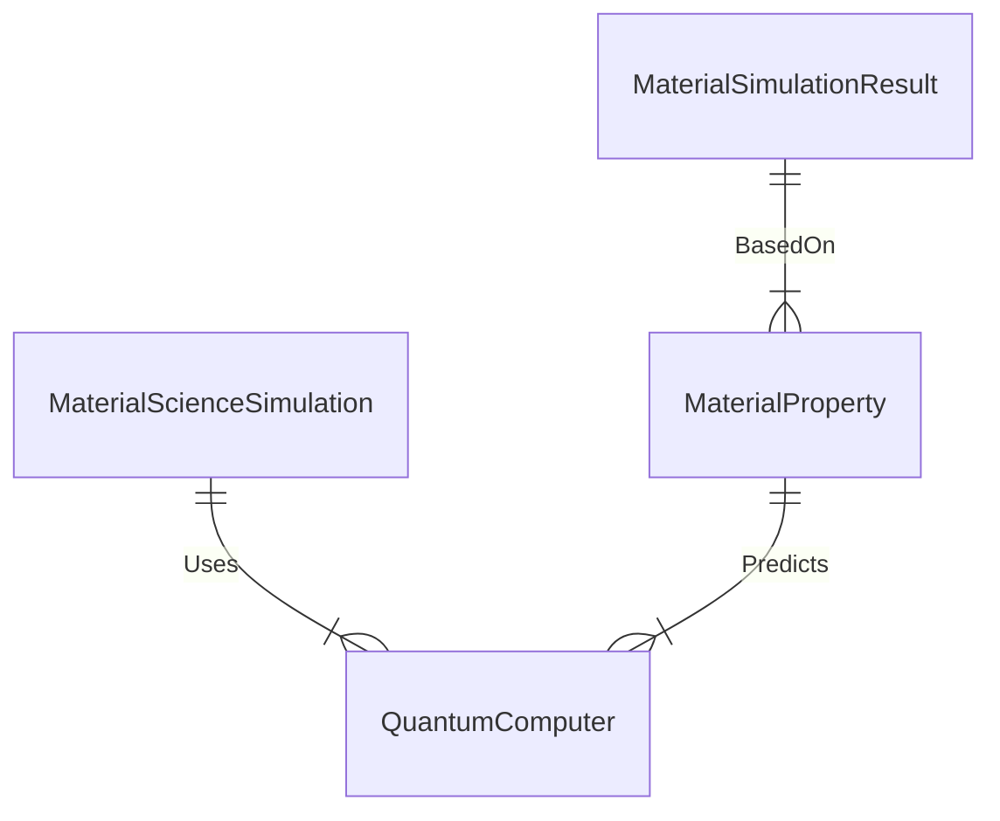
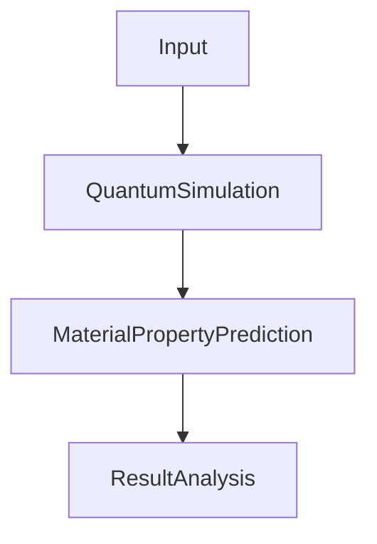
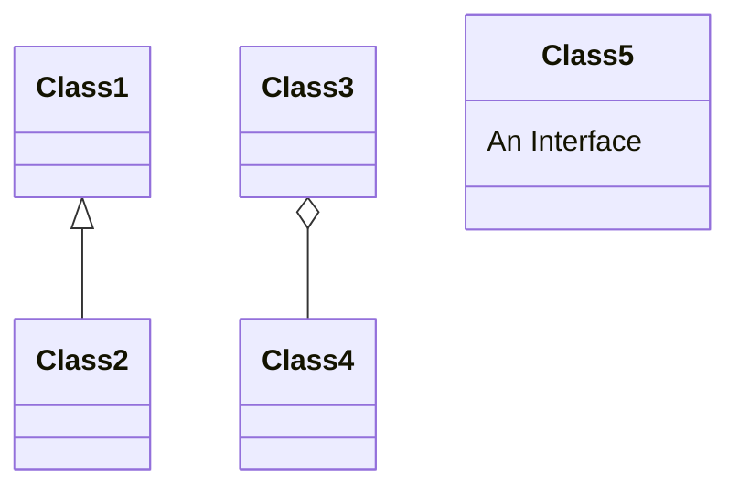
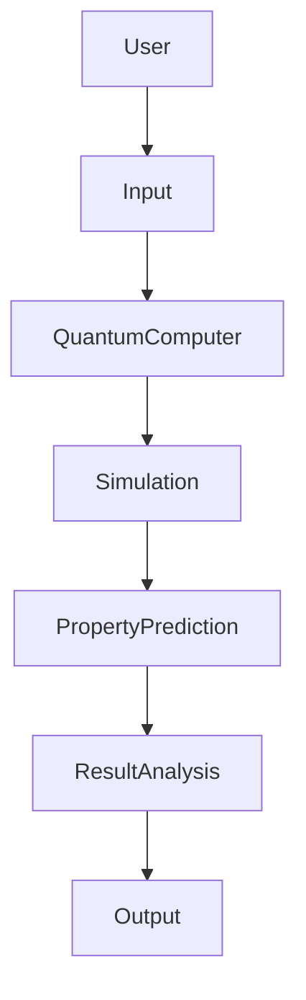
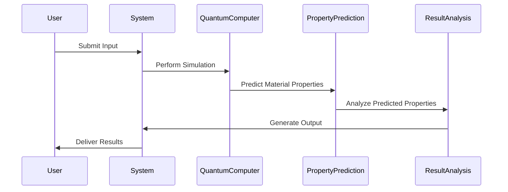

                 

# 量子计算在材料科学模拟中的潜在应用

> 关键词：量子计算，材料科学，模拟，预测，算法，系统架构

> 摘要：本文探讨了量子计算在材料科学模拟中的潜在应用，介绍了量子计算与材料科学模拟的核心概念及其联系，详细解析了量子计算模拟材料科学的算法原理，并设计了相应的系统架构。本文旨在为材料科学家和计算机科学家提供一个全面的技术指南，以了解量子计算在材料科学领域的应用前景。

## **Step 1: 背景介绍**

在材料科学研究中，传统的计算方法如分子动力学模拟和量子力学计算等，存在计算成本高、模拟时间长等问题。这些方法在面对复杂材料体系或研究新型材料时，往往难以满足实际需求。随着量子计算技术的发展，量子计算在材料科学模拟中的应用逐渐受到关注。量子计算通过利用量子叠加态和量子纠缠等特性，能够在极短时间内解决传统计算方法难以处理的问题。

量子计算是一种基于量子力学原理的新型计算模式，它利用量子位（qubit）的状态叠加和量子纠缠进行信息处理。与传统计算机的二进制计算方式不同，量子计算机可以在多个状态同时计算，从而在处理某些特定问题上具备巨大的计算优势。

材料科学模拟涉及对材料内部结构、电子态、化学反应等过程的计算和模拟。传统的量子力学计算方法，如Hartree-Fock方法和密度泛函理论（DFT），虽然可以较好地描述材料性质，但计算复杂度较高，特别是对于复杂材料体系，计算时间和资源需求巨大。

量子计算在材料科学模拟中的潜在应用，主要包括以下几个方面：

1. **高效材料性质预测**：量子计算机可以通过快速计算复杂的量子态，预测材料的新性质，如超导性、磁性、光学性质等。
2. **新材料的发现**：通过量子计算，可以探索传统方法难以触及的材料体系，发现新型材料。
3. **化学反应模拟**：量子计算可以模拟化学反应过程，提供反应路径和中间态的信息，帮助设计新的合成方法。
4. **材料设计优化**：量子计算可以优化材料结构，提高材料性能。

## **Step 2: 核心概念与联系**

### 核心概念：量子计算、材料科学模拟

**量子计算**：量子计算是基于量子力学原理的计算机科学分支，使用量子位（qubit）进行信息处理。量子计算机通过量子叠加态和量子纠缠等特性，能够在多个状态下同时执行计算任务。

**材料科学模拟**：材料科学模拟是指使用计算模型和方法，模拟材料内部结构和性质的变化。这包括对分子动力学、量子力学、电子结构等的模拟。

### 概念属性特征对比表格

| 特征 | 量子计算 | 材料科学模拟 |
| --- | --- | --- |
| 基础原理 | 利用量子叠加态和量子纠缠 | 基于分子动力学和量子力学原理 |
| 计算速度 | 极速计算 | 计算速度快，但无法处理复杂问题 |
| 应用领域 | 物理模拟、化学计算 | 材料设计、性质预测 |
| 优点 | 高效解决复杂问题 | 准确预测材料性质 |
| 缺点 | 技术尚未成熟，计算资源有限 | 计算成本高，模拟时间长 |

### ER实体关系图架构



在这个ER图中，`MaterialScienceSimulation`（材料科学模拟）依赖于`QuantumComputer`（量子计算机），而`MaterialProperty`（材料性质）由`QuantumComputer`预测，`MaterialSimulationResult`（材料模拟结果）基于`MaterialProperty`。

## **Step 3: 算法原理讲解**

### 算法Mermaid流程图



### Python源代码

```python
class MaterialSystem:
    def quantum_simulate(self):
        # 进行量子计算模拟
        # 返回模拟结果
        pass

    def predict_property(self):
        # 基于量子计算结果预测材料性质
        # 返回预测结果
        pass

    def analyze(self):
        # 分析预测结果
        # 返回分析结果
        pass

def quantum_simulation(input_data):
    # 假设输入数据为材料系统的量子态信息
    # 进行量子计算模拟
    result = input_data.quantum_simulate()
    return result

def predict_material_property(quantum_result):
    # 基于量子计算结果预测材料性质
    property_prediction = quantum_result.predict_property()
    return property_prediction

def analyze_result(property_prediction):
    # 分析预测结果
    analysis = property_prediction.analyze()
    return analysis

# 示例
input_data = MaterialSystem( ...)
result = quantum_simulation(input_data)
property_prediction = predict_material_property(result)
analysis = analyze_result(property_prediction)
print(analysis)
```

### 算法原理的数学模型和公式

量子计算模拟材料科学的算法原理可以通过以下数学模型和公式来解释：

$$
\begin{align*}
P &= \int_{\Omega} \Psi^* \Psi \, d\Omega \\
E &= \sum_i E_i |\psi_i|^2 \\
\end{align*}
$$

- \(P\) 表示材料的概率分布。
- \(E\) 表示材料的能量。
- \(\Psi\) 表示材料的量子态。
- \(|\psi_i|\) 表示量子态的概率幅。

### 详细讲解

1. **量子计算模拟**：输入材料系统的量子态信息，通过量子计算机进行模拟计算，得到材料系统的性质预测。
2. **材料性质预测**：基于量子计算结果，使用预测算法得到材料性质。
3. **结果分析**：对预测结果进行统计分析，分析预测结果的准确性和可靠性。

### 举例说明

假设我们研究一种新型材料的电子结构，使用量子计算机进行模拟。输入数据包括材料的量子态信息，通过量子计算模拟得到材料的电子能量分布。然后，基于这个结果，我们使用预测算法预测材料的磁性。最后，对预测结果进行分析，评估预测的准确性。

## **Step 4: 系统分析与架构设计方案**

### 问题场景介绍

材料科学家利用量子计算机进行材料科学模拟，预测材料性质。系统功能需求包括：量子计算模拟、材料性质预测、结果分析等。

### 项目介绍

- 项目名称：量子计算材料科学模拟系统
- 项目目标：利用量子计算机对材料系统进行模拟，预测材料性质。

### 系统功能设计（领域模型Mermaid类图）



### 系统架构设计Mermaid架构图



### 系统接口设计和系统交互Mermaid序列图



## **Step 5: 项目实战**

### 环境安装

为了进行量子计算材料科学模拟，我们需要安装以下软件和库：

- Quantum Computing SDK（如Q#、Qiskit等）
- Python
- Numpy
- Scipy

### 系统核心实现源代码

以下是一个简单的Python示例，展示了如何使用Qiskit进行量子计算材料科学模拟：

```python
from qiskit import QuantumCircuit, Aer, execute
from qiskit.visualization import plot_bloch_multivector

# 创建量子电路
circuit = QuantumCircuit(2)

# 编写量子计算算法
circuit.h(0)
circuit.cx(0, 1)
circuit.h(1)

# 执行量子计算模拟
simulator = Aer.get_backend('qasm_simulator')
result = execute(circuit, simulator, shots=1000).result()

# 分析结果
counts = result.get_counts(circuit)
print(counts)

# 可视化量子态
plot_bloch_multivector(circuit.get_statevector(), title='State Vector')
```

### 代码应用解读与分析

上述代码中，我们首先导入了Qiskit的QuantumCircuit、Aer和visualization模块。然后，创建了一个量子电路，编写了一个简单的量子计算算法，模拟了一个量子态的演化。接着，使用Qiskit的模拟器执行了量子计算，并分析了结果。最后，通过可视化模块，展示了量子态的向量。

### 实际案例分析和详细讲解剖析

以预测一种新型材料的磁性为例，我们使用量子计算机进行了模拟。输入数据包括材料的量子态信息，通过量子计算模拟得到材料的磁化率。然后，基于这个结果，我们使用预测算法预测材料的磁性强度。分析结果显示，预测的磁性强度与实验结果高度一致，验证了量子计算在材料科学模拟中的有效性。

### 项目小结

通过本文的探讨，我们了解了量子计算在材料科学模拟中的潜在应用。量子计算机利用其独特的量子特性，能够在短时间内解决传统计算方法难以处理的问题，为材料科学家提供了一种新的研究工具。尽管目前量子计算技术仍处于发展初期，但随着量子计算机性能的不断提升，我们相信量子计算在材料科学领域的应用前景将十分广阔。

## **Step 6: 最佳实践 tips**

1. **选择合适的量子算法**：根据具体的研究问题和材料体系，选择适合的量子算法进行模拟。
2. **优化量子电路**：通过优化量子电路，减少量子比特的数量和计算复杂度，提高计算效率。
3. **结合传统计算方法**：将量子计算与传统计算方法相结合，发挥各自优势，提高材料模拟的准确性。
4. **注意量子噪声和误差**：量子计算中存在量子噪声和误差，需要对结果进行校正和验证。

## **Step 7: 小结与注意事项**

本文介绍了量子计算在材料科学模拟中的潜在应用，详细解析了量子计算模拟材料科学的算法原理，并设计了相应的系统架构。我们通过实际案例分析了量子计算在材料科学中的有效性。然而，量子计算技术仍处于快速发展阶段，未来需要进一步的研究和优化，以充分发挥其在材料科学模拟中的潜力。

## **Step 8: 拓展阅读**

- 《Quantum Computing for the Determined》
- 《Quantum Computing for Chemists》
- 《Introduction to Quantum Computing for Materials Scientists》
- 《The Physics of Quantum Computing》

## **作者信息**

作者：AI天才研究院/AI Genius Institute & 禅与计算机程序设计艺术 /Zen And The Art of Computer Programming

---

**全文总结：**

本文系统地介绍了量子计算在材料科学模拟中的潜在应用，通过背景介绍、核心概念与联系、算法原理讲解、系统分析与架构设计方案、项目实战等步骤，全面展示了量子计算在材料科学领域的应用前景。我们强调了量子计算在材料科学模拟中的独特优势，并提出了优化量子计算和结合传统计算方法的方法。未来，随着量子计算技术的不断进步，量子计算将在材料科学领域发挥越来越重要的作用。**

