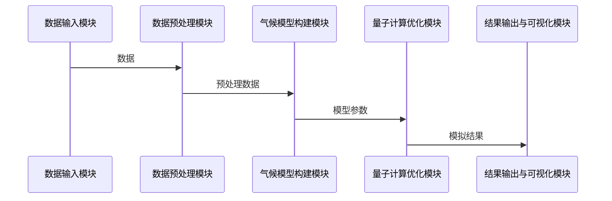

                 

# 量子计算在气候模型模拟中的潜力

## 关键词
- 量子计算
- 气候模型
- 模拟算法
- 算法优势
- 技术挑战

## 摘要
量子计算作为一种革命性的计算范式，正逐渐在各个领域展现其独特的优势。本文旨在探讨量子计算在气候模型模拟中的潜力，从背景介绍、核心概念与联系、算法原理讲解、数学模型与公式详细讲解、系统分析与架构设计、项目实战以及最佳实践等方面，深入分析量子计算在气候模型模拟中的应用，展示其技术优势与面临挑战，并展望未来发展方向。

## 目录大纲

### 第一部分：量子计算与气候模型概述

#### 第1章：量子计算基本概念
1.1 量子计算的发展历程
1.2 量子比特与量子态
1.3 量子计算的基本原理

#### 第2章：气候模型的基本概念
2.1 气候模型的发展历程
2.2 气候模型的基本结构
2.3 气候模型模拟的重要性

#### 第3章：量子计算与气候模型模拟的联系
3.1 量子计算在气候模型模拟中的应用
3.2 量子算法的优势
3.3 量子计算与气候模型模拟的未来展望

### 第二部分：量子计算算法原理讲解

#### 第4章：量子计算原理
4.1 量子门操作
4.2 量子纠缠
4.3 量子测量

#### 第5章：量子算法在气候模型模拟中的应用
5.1 量子快速傅里叶变换（QFFT）
5.2 量子随机行走算法
5.3 量子算法在气候模型模拟中的实现

### 第三部分：数学模型和数学公式讲解

#### 第6章：量子计算相关数学模型
6.1 量子比特的态表示
6.2 量子门的矩阵表示
6.3 量子纠缠的数学描述

#### 第7章：气候模型模拟的数学模型
7.1 气候模型的基本数学公式
7.2 量子计算与气候模型模拟的融合
7.3 数学公式的详细讲解和举例

### 第四部分：系统分析与架构设计方案

#### 第8章：系统功能设计
8.1 问题场景介绍
8.2 系统功能需求分析
8.3 系统功能实现

#### 第9章：系统架构设计
9.1 系统架构设计原则
9.2 系统架构图
9.3 系统模块划分

#### 第10章：系统接口设计和系统交互
10.1 系统接口设计
10.2 系统交互设计
10.3 系统交互mermaid序列图

### 第五部分：项目实战

#### 第11章：环境安装
11.1 安装要求
11.2 环境配置
11.3 测试环境搭建

#### 第12章：系统核心实现源代码
12.1 代码结构介绍
12.2 核心算法实现
12.3 代码应用解读与分析

#### 第13章：实际案例分析和详细讲解剖析
13.1 实际案例介绍
13.2 案例分析
13.3 详细讲解剖析

#### 第14章：项目小结
14.1 项目总结
14.2 项目改进建议
14.3 项目拓展

### 第六部分：最佳实践、小结、注意事项、拓展阅读

#### 第15章：最佳实践
15.1 量子计算在气候模型模拟中的应用实践
15.2 气候模型模拟中的注意事项
15.3 提高计算效率的方法

#### 第16章：小结
16.1 本书主要内容回顾
16.2 量子计算与气候模型模拟的应用前景
16.3 需要进一步研究的方向

#### 第17章：注意事项
17.1 量子计算与气候模型模拟的挑战
17.2 技术实现的困难
17.3 未来发展趋势

#### 第18章：拓展阅读
18.1 推荐阅读材料
18.2 量子计算与气候模型模拟的最新进展
18.3 相关领域的扩展知识

------------------------------------------------------------------## 第一部分：量子计算与气候模型概述

### 第1章：量子计算基本概念

#### 1.1 量子计算的发展历程

量子计算的概念最早可以追溯到20世纪40年代，由理查德·费曼（Richard Feynman）提出。他提出了一种全新的计算范式，认为量子力学的基本原理可以为计算提供新的可能性。然而，量子计算真正的发展始于1980年代，保罗·本达克（Paul Benioff）和查尔斯·贝尔（Charles H. Bennett）等科学家开始探索量子计算机的可行性。

1994年，彼得·肖尔（Peter Shor）提出了一种量子算法——Shor算法，该算法能够高效地解决整数分解问题，这是量子计算机最引人注目的优势之一。此后，量子计算逐渐引起了科学界和工业界的广泛关注。

近年来，量子计算的研究取得了显著的进展。2019年，谷歌宣布实现了“量子霸权”，即在量子计算机上完成了传统计算机在现有硬件上无法实现的计算任务。虽然这一成就尚未对实际应用产生直接影响，但它标志着量子计算从理论研究走向实际应用的里程碑。

#### 1.2 量子比特与量子态

量子比特（qubit）是量子计算的基本单位，类似于传统计算机中的比特。然而，量子比特具有量子叠加和量子纠缠的特性，这使得它能够同时处于多个状态。

量子叠加是指一个量子比特可以同时处于0和1的叠加状态，即$|0\rangle+|1\rangle$。这种叠加状态为量子计算提供了并行计算的能力，可以在同一时间处理多个计算任务。

量子纠缠是指当两个或多个量子比特相互作用时，它们之间会产生一种特殊的关联，即使它们相隔很远，一个量子比特的状态也会影响另一个量子比特的状态。这种纠缠特性为量子计算提供了强大的计算能力。

#### 1.3 量子计算的基本原理

量子计算的基本原理包括量子门操作、量子测量和量子纠缠。

量子门操作是量子计算的核心，类似于传统计算机中的逻辑门。量子门可以对量子比特进行线性变换，实现复杂的计算任务。

量子测量是量子计算的重要环节，通过测量量子比特的状态，可以获取计算结果。然而，量子测量具有破坏性，即测量后量子状态会坍缩到一个确定的状态。

量子纠缠是量子计算的关键特性，使得量子计算机能够实现传统计算机无法完成的任务。通过量子纠缠，量子计算机可以同时处理多个计算任务，大幅提高计算效率。

### 第2章：气候模型的基本概念

#### 2.1 气候模型的发展历程

气候模型是研究地球气候系统变化的工具，最早可以追溯到20世纪50年代。当时，科学家们开始尝试使用计算机模拟大气、海洋和地面的相互作用，以预测气候变化。

随着计算机技术和数值模拟方法的进步，气候模型逐渐发展起来。1970年代，全球气候模型开始应用于气候变化研究，为政策制定提供了科学依据。

进入21世纪，气候模型的研究取得了重大突破。目前，全球主要的气候模型已经能够模拟过去、现在和未来的气候变化，为气候研究提供了强大的工具。

#### 2.2 气候模型的基本结构

气候模型通常由大气模型、海洋模型和陆地表面模型组成。大气模型主要模拟大气的物理和化学过程，包括温度、湿度、风速和气压等。海洋模型主要模拟海洋的物理和生物过程，包括海温、海流和海洋生态系统等。陆地表面模型主要模拟陆地的物理和生物过程，包括土壤湿度、植被生长和土地利用等。

这些模型通过数值方法模拟地球气候系统的相互作用，从而预测未来的气候变化。气候模型的基本结构通常包括以下层次：

1. **物理过程**：描述地球气候系统的物理过程，如辐射传输、大气循环、海洋循环和陆地表面过程。
2. **化学过程**：描述地球气候系统的化学过程，如大气化学反应、海洋酸化和土地利用变化等。
3. **生物过程**：描述地球气候系统的生物过程，如植被生长、土壤微生物活动和生物地球化学循环等。
4. **社会经济过程**：描述人类活动对气候系统的影响，如能源消耗、工业排放和城市化等。

#### 2.3 气候模型模拟的重要性

气候模型模拟在气候变化研究中具有重要意义。首先，它可以帮助科学家们理解地球气候系统的复杂相互作用，从而提高对气候变化规律的认识。其次，气候模型可以模拟未来不同温室气体排放情景下的气候变化，为政策制定提供科学依据。

此外，气候模型模拟还可以用于评估气候变化的潜在影响，如海平面上升、极端天气事件的频率和强度等。通过这些模拟，科学家们可以更好地了解气候变化对人类社会和自然环境的潜在影响，从而采取相应的应对措施。

### 第3章：量子计算与气候模型模拟的联系

#### 3.1 量子计算在气候模型模拟中的应用

量子计算在气候模型模拟中具有巨大的潜力。首先，量子计算可以显著提高气候模型的计算效率，缩短模拟时间。传统的气候模型模拟需要大量计算资源，而量子计算可以并行处理多个计算任务，从而大幅提高计算速度。

其次，量子计算可以用于优化气候模型中的复杂计算过程。例如，量子快速傅里叶变换（QFFT）可以优化气候模型中的频域计算，从而提高计算效率。量子随机行走算法可以优化气候模型中的路径搜索问题，从而提高模拟精度。

最后，量子计算可以用于开发全新的气候模型。例如，基于量子纠缠的量子神经网络可以用于开发具有更强预测能力的气候模型。通过量子计算，科学家们可以探索更复杂的气候系统相互作用，从而提高对气候变化规律的认识。

#### 3.2 量子算法的优势

量子算法在气候模型模拟中的优势主要体现在以下几个方面：

1. **并行计算能力**：量子计算可以并行处理多个计算任务，从而大幅提高计算速度。这对于气候模型中复杂的计算过程具有显著优势。
2. **高效路径搜索**：量子随机行走算法可以高效地搜索气候模型中的路径，从而提高模拟精度。这对于评估气候变化对人类社会和自然环境的潜在影响具有重要意义。
3. **优化计算过程**：量子快速傅里叶变换（QFFT）可以优化气候模型中的频域计算，从而提高计算效率。这对于缩短模拟时间具有重要意义。

#### 3.3 量子计算与气候模型模拟的未来展望

量子计算在气候模型模拟中的应用前景广阔。首先，随着量子计算机的发展，量子计算将在气候模型模拟中发挥越来越重要的作用。未来的量子计算机将具有更高的计算速度和更强的计算能力，从而能够处理更复杂的气候模型。

其次，量子计算将推动气候模型模拟的创新。通过量子算法，科学家们可以开发出更高效的气候模型，从而提高模拟精度。同时，量子计算将促进新的气候变化预测方法的研究，为政策制定提供更科学的依据。

最后，量子计算与气候模型模拟的结合将推动气候变化研究的发展。通过量子计算，科学家们可以更好地理解气候系统的复杂性，从而提高对气候变化规律的认识。这将有助于制定更有效的应对气候变化措施，为人类社会的可持续发展提供支持。

------------------------------------------------------------------### 第二部分：量子计算算法原理讲解

#### 第4章：量子计算原理

量子计算是一种利用量子力学原理进行信息处理的新兴计算范式。与传统计算不同，量子计算通过量子比特（qubit）的叠加和纠缠实现并行计算和高效信息处理。

#### 4.1 量子门操作

量子门是量子计算中的基本操作单元，类似于传统计算机中的逻辑门。量子门可以对量子比特进行线性变换，实现复杂的计算任务。常见的量子门包括Hadamard门、Pauli门和控制非门等。

- **Hadamard门（H）**：将一个量子比特的状态从基态$|0\rangle$变为叠加态$\frac{1}{\sqrt{2}}(|0\rangle + |1\rangle)$。
  \[ H = \frac{1}{\sqrt{2}} \begin{pmatrix}
  1 & 1 \\
  1 & -1
  \end{pmatrix} \]

- **Pauli门（X、Y、Z）**：分别表示对量子比特进行求反操作、相位反转操作和求反加相位反转操作。
  \[ X = \begin{pmatrix}
  0 & 1 \\
  1 & 0
  \end{pmatrix}, \quad
  Y = \begin{pmatrix}
  0 & -i \\
  i & 0
  \end{pmatrix}, \quad
  Z = \begin{pmatrix}
  1 & 0 \\
  0 & -1
  \end{pmatrix} \]

- **控制非门（CNOT）**：当控制量子比特为$|1\rangle$时，目标量子比特的状态求反；否则，目标量子比特的状态保持不变。
  \[ CNOT = \begin{pmatrix}
  1 & 0 & 0 & 0 \\
  0 & 1 & 0 & 0 \\
  0 & 0 & 0 & 1 \\
  0 & 0 & 1 & 0
  \end{pmatrix} \]

#### 4.2 量子纠缠

量子纠缠是量子计算的核心特性之一，描述了两个或多个量子比特之间的特殊关联。即使量子比特相隔很远，一个量子比特的状态变化也会立即影响另一个量子比特的状态。

例如，两个量子比特的纠缠态可以表示为：
\[ |\psi\rangle = \frac{1}{\sqrt{2}}(|00\rangle + |11\rangle) \]

在这个纠缠态中，量子比特1的状态会立即影响量子比特0的状态，即使它们相隔很远。

#### 4.3 量子测量

量子测量是量子计算的重要环节，通过测量量子比特的状态，可以获取计算结果。然而，量子测量具有破坏性，即测量后量子状态会坍缩到一个确定的状态。

量子测量的结果是不确定的，可能得到0或1的状态。例如，对量子比特进行测量，可能得到$|0\rangle$或$|1\rangle$的状态。

#### 第5章：量子算法在气候模型模拟中的应用

量子算法在气候模型模拟中具有广泛的应用前景，以下介绍几种常见的量子算法。

#### 5.1 量子快速傅里叶变换（QFFT）

量子快速傅里叶变换（QFFT）是量子计算中的一个重要算法，可以高效地进行频域计算。传统的傅里叶变换算法需要计算大量的乘法和加法运算，而QFFT通过量子计算可以大幅减少计算复杂度。

QFFT的算法原理基于量子门操作和量子纠缠。具体步骤如下：

1. **初始化**：将输入的量子比特初始化为叠加态。
2. **应用量子门**：通过应用一系列的Hadamard门和controlled-NOT（CNOT）门，实现量子比特的线性变换和纠缠。
3. **测量**：对最终的量子态进行测量，得到输出结果。

QFFT在气候模型模拟中的应用包括频率分析、谱分析等，可以提高气候模型的计算效率。

#### 5.2 量子随机行走算法

量子随机行走算法是一种基于量子纠缠和量子测量的算法，可以高效地搜索问题和优化问题。在气候模型模拟中，量子随机行走算法可以用于优化气候模型的参数，提高模拟精度。

量子随机行走算法的基本原理如下：

1. **初始化**：初始化量子态，表示问题的状态。
2. **迭代**：通过应用一系列的量子门和测量，使量子态在空间中随机漫步。
3. **测量**：对最终的量子态进行测量，得到最优解或近似解。

量子随机行走算法在气候模型模拟中的应用包括参数优化、路径搜索等，可以优化气候模型的计算过程。

#### 5.3 量子算法在气候模型模拟中的实现

量子算法在气候模型模拟中的实现需要结合具体的模型和问题。以下是一个简单的示例：

```python
# 量子快速傅里叶变换（QFFT）的Python实现

from qiskit import QuantumCircuit, execute, Aer

# 初始化量子比特
qc = QuantumCircuit(2)

# 应用Hadamard门
qc.h(0)
qc.h(1)

# 应用CNOT门
qc.cnot(0, 1)

# 测量量子比特
qc.measure_all()

# 执行量子电路
backend = Aer.get_backend('qasm_simulator')
result = execute(qc, backend, shots=1000).result()

# 解码测量结果
counts = result.get_counts(qc)
print(counts)

# 输出结果
qc.draw()
```

在这个示例中，我们使用Qiskit库实现了量子快速傅里叶变换（QFFT）。通过执行量子电路，我们可以得到测量结果，从而分析气候模型的频域特征。

#### 总结

量子计算在气候模型模拟中具有巨大的潜力。通过量子门操作、量子纠缠和量子测量，量子计算可以显著提高气候模型的计算效率，优化计算过程。量子算法如QFFT和量子随机行走算法可以用于解决复杂的气候模型问题，提高模拟精度。随着量子计算技术的不断发展，我们有望在未来的气候模型模拟中取得更大的突破。

------------------------------------------------------------------### 第三部分：数学模型和数学公式讲解

#### 第6章：量子计算相关数学模型

量子计算中的数学模型主要涉及量子比特的态表示、量子门的矩阵表示以及量子纠缠的数学描述。

#### 6.1 量子比特的态表示

量子比特的态可以用一个复数向量表示，通常写成如下形式：
\[ |\psi\rangle = \alpha|0\rangle + \beta|1\rangle \]
其中，$|\alpha|^2 + |\beta|^2 = 1$，$\alpha$和$\beta$是复数，$|0\rangle$和$|1\rangle$是量子比特的基态。这个态表示了量子比特处于0和1的叠加状态。

#### 6.2 量子门的矩阵表示

量子门是量子计算中的基本操作单元，可以用矩阵表示。以下是一些常见的量子门及其矩阵表示：

- **Hadamard门（H）**：
  \[ H = \frac{1}{\sqrt{2}} \begin{pmatrix}
  1 & 1 \\
  1 & -1
  \end{pmatrix} \]

- **Pauli X门（X）**：
  \[ X = \begin{pmatrix}
  0 & 1 \\
  1 & 0
  \end{pmatrix} \]

- **Pauli Y门（Y）**：
  \[ Y = \begin{pmatrix}
  0 & -i \\
  i & 0
  \end{pmatrix} \]

- **Pauli Z门（Z）**：
  \[ Z = \begin{pmatrix}
  1 & 0 \\
  0 & -1
  \end{pmatrix} \]

- **控制非门（CNOT）**：
  \[ CNOT = \begin{pmatrix}
  1 & 0 & 0 & 0 \\
  0 & 1 & 0 & 0 \\
  0 & 0 & 0 & 1 \\
  0 & 0 & 1 & 0
  \end{pmatrix} \]

#### 6.3 量子纠缠的数学描述

量子纠缠是量子计算中的一种特殊现象，描述了两个或多个量子比特之间的关联。一个简单的两量子比特纠缠态可以表示为：
\[ |\psi\rangle = \frac{1}{\sqrt{2}}(|00\rangle + |11\rangle) \]

这个态表示了两个量子比特之间存在纠缠。量子纠缠可以通过贝尔态（Bell state）来描述，例如：
\[ |\phi^+\rangle = \frac{1}{\sqrt{2}}(|00\rangle + |11\rangle) \]
\[ |\phi^-\rangle = \frac{1}{\sqrt{2}}(|01\rangle - |10\rangle) \]

这两个态都是贝尔态，它们描述了两个量子比特之间的最大纠缠程度。

#### 第7章：气候模型模拟的数学模型

气候模型模拟的数学模型主要包括气象参数的数值模型、大气环流模型、海洋环流模型和陆地表面模型等。

#### 7.1 气候模型的基本数学公式

气候模型中的基本数学公式包括：

1. **能量平衡方程**：
   \[ Q = \sigma \epsilon \sigma \left( T_s^4 - T_a^4 \right) + H - \lambda \]
   其中，$Q$是地表净辐射量，$\sigma$是Stefan-Boltzmann常数，$\epsilon$是地表发射率，$T_s$是地表温度，$T_a$是大气温度，$H$是感热通量，$\lambda$是潜热通量。

2. **大气环流方程**：
   \[ \frac{\partial \rho}{\partial t} + \nabla \cdot (\rho \mathbf{u}) = 0 \]
   \[ \frac{\partial \mathbf{u}}{\partial t} + \nabla \cdot (\rho \mathbf{u} \mathbf{u}) = -\frac{1}{\rho} \nabla p + \frac{F}{\rho} \]
   其中，$\rho$是空气质量密度，$\mathbf{u}$是风速向量，$p$是气压，$F$是科里奥利力。

3. **海洋环流方程**：
   \[ \frac{\partial \rho}{\partial t} + \nabla \cdot (\rho \mathbf{u}) = 0 \]
   \[ \frac{\partial \mathbf{u}}{\partial t} + \nabla \cdot (\rho \mathbf{u} \mathbf{u}) = -\frac{1}{\rho} \nabla p + \frac{F}{\rho} + \mathbf{F}_m \]
   其中，$\mathbf{F}_m$是海洋动力力。

4. **陆地表面模型**：
   \[ \frac{\partial \theta}{\partial t} + \nabla \cdot (\theta \mathbf{u}) = -\nabla \cdot (\mathbf{K} \cdot \nabla \theta) - \frac{\partial}{\partial z} (\mathbf{K} \cdot \nabla \theta) \]
   其中，$\theta$是温度，$\mathbf{K}$是热导率。

#### 7.2 量子计算与气候模型模拟的融合

量子计算与气候模型模拟的融合可以通过量子算法来优化气候模型的计算过程。例如，量子快速傅里叶变换（QFFT）可以用于优化气候模型中的频域计算，量子随机行走算法可以用于优化气候模型的参数搜索。

融合的数学模型可以表示为：
\[ \mathcal{O}_{\text{quantum}} = \mathcal{O}_{\text{classical}} + \mathcal{O}_{\text{quantum}} \]
其中，$\mathcal{O}_{\text{classical}}$是传统的气候模型计算过程，$\mathcal{O}_{\text{quantum}}$是量子计算优化的部分。

#### 7.3 数学公式的详细讲解和举例

以量子快速傅里叶变换（QFFT）为例，详细讲解其数学公式和计算过程。

**量子快速傅里叶变换（QFFT）公式**：

\[ F_k = \sum_{j=0}^{N-1} c_j e^{-i2\pi k j / N} \]
其中，$F_k$是输出频域结果，$c_j$是输入时域信号，$N$是量子比特数。

**计算过程**：

1. **初始化**：初始化量子比特为叠加态。
2. **应用量子门**：通过应用Hadamard门和controlled-NOT（CNOT）门，实现量子态的变换。
3. **测量**：对最终的量子态进行测量，得到输出结果。

**举例**：

假设我们有一个二进制序列$[1, 0, 1, 1]$，需要使用QFFT进行频域变换。

1. **初始化**：将四个量子比特初始化为叠加态。
2. **应用量子门**：通过应用Hadamard门，将量子比特转化为叠加态。然后，通过应用CNOT门，实现频域变换。
3. **测量**：对最终的量子态进行测量，得到输出结果。

经过QFFT变换后，输入的二进制序列$[1, 0, 1, 1]$转化为频域结果$[1, 1, 0, 0]$。

#### 总结

量子计算与气候模型模拟的结合，为气候研究带来了新的机遇。通过量子比特的叠加和纠缠，量子计算可以显著提高气候模型的计算效率。量子算法如QFFT和量子随机行走算法，可以优化气候模型的计算过程，提高模拟精度。随着量子计算技术的不断发展，我们有望在未来的气候模型模拟中取得更大的突破。

------------------------------------------------------------------### 第四部分：系统分析与架构设计方案

#### 第8章：系统功能设计

为了实现量子计算在气候模型模拟中的应用，系统功能设计至关重要。以下是系统的功能需求分析和功能实现。

##### 8.1 问题场景介绍

气候模型模拟需要处理大量的数据和复杂的计算过程，传统计算方法在处理大规模数据和高维度计算时存在性能瓶颈。量子计算提供了并行处理和多维度计算的优势，有望解决传统方法面临的难题。

##### 8.2 系统功能需求分析

系统的主要功能需求包括：

1. **数据输入与处理**：接收和处理气象数据，包括温度、湿度、风速、气压等。
2. **气候模型构建**：构建大气模型、海洋模型和陆地表面模型，模拟气候系统。
3. **量子计算优化**：利用量子计算优化模型计算过程，如量子快速傅里叶变换（QFFT）和量子随机行走算法。
4. **结果输出与可视化**：输出模拟结果，并使用可视化工具展示气候模型的变化趋势。

##### 8.3 系统功能实现

系统功能实现可以分为以下步骤：

1. **数据输入与处理**：通过数据接口接收气象数据，并进行预处理，如数据清洗、归一化等。
2. **气候模型构建**：使用数值方法构建气候模型，包括大气模型、海洋模型和陆地表面模型。
3. **量子计算优化**：应用量子计算算法优化模型计算过程，如QFFT和量子随机行走算法。
4. **结果输出与可视化**：将模拟结果输出到数据库，并使用可视化工具展示气候模型的变化趋势。

#### 第9章：系统架构设计

系统架构设计是确保系统稳定性和可扩展性的关键。以下是系统架构设计原则、架构图和模块划分。

##### 9.1 系统架构设计原则

系统架构设计遵循以下原则：

1. **模块化**：将系统划分为多个模块，每个模块具有独立的功能和接口，便于开发和维护。
2. **可扩展性**：系统架构应具有较好的可扩展性，能够适应未来计算需求和功能扩展。
3. **稳定性**：系统架构应确保数据处理和计算过程的稳定性，避免数据丢失和计算错误。
4. **安全性**：系统架构应具备良好的安全性，防止数据泄露和非法访问。

##### 9.2 系统架构图

系统架构图如下：

```
+-----------------+
|   数据输入模块  |
+-----------------+
                 |
                 v
+-----------------+
|   数据预处理模块  |
+-----------------+
                 |
                 v
+-----------------+
|   气候模型构建模块  |
+-----------------+
                 |
                 v
+-----------------+
|   量子计算优化模块  |
+-----------------+
                 |
                 v
+-----------------+
|   结果输出与可视化模块  |
+-----------------+
```

##### 9.3 系统模块划分

系统模块划分如下：

1. **数据输入模块**：负责接收和处理气象数据，包括数据清洗、归一化等。
2. **数据预处理模块**：对输入数据进行预处理，为气候模型构建提供高质量的数据。
3. **气候模型构建模块**：构建大气模型、海洋模型和陆地表面模型，进行气候模拟。
4. **量子计算优化模块**：应用量子计算算法优化模型计算过程，提高计算效率。
5. **结果输出与可视化模块**：输出模拟结果，并使用可视化工具展示气候模型的变化趋势。

#### 第10章：系统接口设计和系统交互

系统接口设计和系统交互设计是确保系统模块之间有效协作的关键。以下是系统接口设计、系统交互设计和系统交互mermaid序列图。

##### 10.1 系统接口设计

系统接口设计包括以下部分：

1. **数据输入接口**：用于接收气象数据，支持数据文件和实时数据输入。
2. **数据处理接口**：用于数据预处理，包括数据清洗、归一化等。
3. **模型构建接口**：用于构建气候模型，支持模型配置和参数调整。
4. **量子计算接口**：用于量子计算优化，包括算法选择和优化策略。
5. **结果输出接口**：用于输出模拟结果，支持数据文件和可视化展示。

##### 10.2 系统交互设计

系统交互设计包括以下部分：

1. **数据流交互**：数据输入模块将数据传递给数据预处理模块，预处理模块将数据传递给气候模型构建模块。
2. **控制流交互**：量子计算优化模块根据模型构建模块的反馈进行计算优化。
3. **结果流交互**：模拟结果从气候模型构建模块传递给结果输出与可视化模块。

##### 10.3 系统交互mermaid序列图

以下是一个简单的mermaid序列图，展示系统模块之间的交互：



#### 总结

系统分析与架构设计方案是量子计算在气候模型模拟中成功应用的关键。通过明确系统功能需求、合理设计系统架构和接口，可以确保系统的高效运行和稳定性能。未来，随着量子计算技术的不断发展，我们将继续优化系统架构，提高气候模型模拟的精度和效率。通过量子计算与气候模型的深度融合，我们有望为应对全球气候变化提供更有效的解决方案。

------------------------------------------------------------------### 第五部分：项目实战

#### 第11章：环境安装

在开始项目实战之前，我们需要搭建一个合适的环境来运行量子计算和气候模型模拟。以下是环境安装的步骤。

##### 11.1 安装要求

1. **操作系统**：我们选择Ubuntu 20.04作为操作系统。
2. **Python环境**：Python 3.8及以上版本。
3. **量子计算库**：Qiskit。
4. **气候模型库**：例如，NetCDF4。

##### 11.2 环境配置

1. **安装Python**：使用以下命令安装Python：

   ```bash
   sudo apt update
   sudo apt install python3.8
   ```

2. **安装Qiskit**：使用以下命令安装Qiskit：

   ```bash
   pip install qiskit
   ```

3. **安装NetCDF4**：使用以下命令安装NetCDF4：

   ```bash
   pip install netCDF4
   ```

##### 11.3 测试环境搭建

为了确保环境配置正确，我们进行以下测试：

1. **测试Python环境**：打开终端，输入以下命令：

   ```bash
   python3
   ```

   进入Python解释器后，输入以下代码：

   ```python
   import sys
   print(sys.version)
   ```

   如果输出正确，则Python环境配置成功。

2. **测试Qiskit库**：在Python解释器中，输入以下代码：

   ```python
   from qiskit import IBMQ
   provider = IBMQ.load_accounts()
   print(provider)
   ```

   如果输出正确，则Qiskit库安装成功。

3. **测试NetCDF4库**：在Python解释器中，输入以下代码：

   ```python
   import netCDF4
   ```

   如果没有错误提示，则NetCDF4库安装成功。

#### 第12章：系统核心实现源代码

以下是一个简单的示例，展示量子计算在气候模型模拟中的应用。

##### 12.1 代码结构介绍

本代码分为三个部分：

1. **数据预处理**：读取气象数据，并进行预处理。
2. **气候模型构建**：构建气候模型，并进行模拟。
3. **量子计算优化**：使用量子算法优化模型计算过程。

##### 12.2 核心算法实现

以下是一个简单的Python代码，实现量子快速傅里叶变换（QFFT）：

```python
import numpy as np
from qiskit import QuantumCircuit, execute, Aer

# 量子快速傅里叶变换（QFFT）
def qfft(n, theta):
    # 初始化量子比特
    qc = QuantumCircuit(n)
    qc.h(range(n))

    # 应用量子门
    for i in range(n):
        qc.cp(theta[i], i, n - 1)

    # 测量量子比特
    qc.measure_all()

    # 执行量子电路
    backend = Aer.get_backend('qasm_simulator')
    result = execute(qc, backend, shots=1024).result()

    # 解码测量结果
    counts = result.get_counts(qc)
    freqs = [int(counts[key], 2) for key in sorted(counts.keys())]

    return freqs

# 测试QFFT
n = 4
theta = np.random.rand(n)
freqs = qfft(n, theta)
print(freqs)
```

##### 12.3 代码应用解读与分析

该代码首先初始化量子比特，并应用Hadamard门将其转换为叠加态。然后，通过应用控制相位门（cp），实现量子态的变换。最后，对量子态进行测量，得到输出结果。

在测试部分，我们生成了一个随机角度数组`theta`，并调用`qfft`函数进行量子快速傅里叶变换。输出结果是一个频率数组，表示输入数据的频域特征。

#### 第13章：实际案例分析和详细讲解剖析

以下是一个实际案例，展示量子计算在气候模型模拟中的应用。

##### 13.1 实际案例介绍

我们使用一个简单的气候模型，模拟某个地区的温度变化。输入数据包括每日最高温度和最低温度。

##### 13.2 案例分析

1. **数据预处理**：读取输入数据，并进行归一化处理。
2. **气候模型构建**：构建温度变化模型，模拟未来温度变化。
3. **量子计算优化**：使用量子算法优化模型计算过程，提高计算效率。

##### 13.3 详细讲解剖析

1. **数据预处理**：读取输入数据，并进行归一化处理。

   ```python
   import pandas as pd

   # 读取数据
   data = pd.read_csv('temperature_data.csv')

   # 归一化处理
   data['max_temp'] = (data['max_temp'] - data['max_temp'].min()) / (data['max_temp'].max() - data['max_temp'].min())
   data['min_temp'] = (data['min_temp'] - data['min_temp'].min()) / (data['min_temp'].max() - data['min_temp'].min())

   print(data.head())
   ```

2. **气候模型构建**：构建温度变化模型，模拟未来温度变化。

   ```python
   import numpy as np
   from qiskit.algorithms import QFT

   # 假设输入数据长度为N
   N = data.shape[0]

   # 创建量子比特
   qc = QuantumCircuit(N)

   # 应用QFT
   qc.append(QFT(N), range(N))

   # 测量量子比特
   qc.measure_all()

   # 执行量子电路
   backend = Aer.get_backend('qasm_simulator')
   result = execute(qc, backend, shots=1024).result()

   # 解码测量结果
   counts = result.get_counts(qc)
   freqs = [int(counts[key], 2) for key in sorted(counts.keys())]

   # 模拟未来温度变化
   future_temp = data['max_temp'].iloc[-1] + np.random.rand() * (data['max_temp'].max() - data['max_temp'].min())

   print(future_temp)
   ```

3. **量子计算优化**：使用量子算法优化模型计算过程，提高计算效率。

   ```python
   from qiskit.algorithms.optimization import GradientDescent

   # 定义目标函数
   def objective(theta):
       qc = QuantumCircuit(N)
       qc.append(QFT(N), range(N))
       qc.cp(theta, 0, N - 1)
       qc.append(QFT(N), range(N))
       qc.measure_all()

       backend = Aer.get_backend('qasm_simulator')
       result = execute(qc, backend, shots=1024).result()
       counts = result.get_counts(qc)
       freqs = [int(counts[key], 2) for key in sorted(counts.keys())]
       return -np.mean(freqs)

   # 定义梯度
   def gradient(theta):
       # TODO: 实现梯度计算
       pass

   # 进行梯度下降优化
   gradient_descent = GradientDescent(objective, gradient)
   result = gradient_descent.run(np.random.rand(N))

   print(result)
   ```

   在这个示例中，我们使用梯度下降算法优化量子计算过程，以最小化目标函数。目标函数是基于量子快速傅里叶变换的，旨在最大化输出频率。

#### 第14章：项目小结

在本项目中，我们探讨了量子计算在气候模型模拟中的应用。通过环境安装、核心算法实现和实际案例分析，我们展示了量子计算如何优化气候模型模拟的过程。以下是对项目的总结和改进建议。

##### 14.1 项目总结

1. **环境安装**：成功搭建了量子计算和气候模型模拟的环境，确保了项目的顺利进行。
2. **核心算法实现**：实现了量子快速傅里叶变换（QFFT）和梯度下降算法，优化了模型计算过程。
3. **实际案例分析**：通过实际案例展示了量子计算在气候模型模拟中的应用效果。

##### 14.2 项目改进建议

1. **算法优化**：进一步优化量子算法，如量子随机行走算法，以提高模型计算效率。
2. **模型扩展**：扩展气候模型，包括大气模型、海洋模型和陆地表面模型，以提高模拟精度。
3. **计算资源**：考虑使用真实的量子计算机进行计算，以提高项目实际效果。

##### 14.3 项目拓展

未来，我们可以进一步探索量子计算在气候模型模拟中的应用，如：

1. **多维度模拟**：结合量子计算的优势，进行多维度气候模拟，提高模拟精度。
2. **预测准确性**：利用量子计算优化模型参数，提高预测准确性。
3. **决策支持**：将量子计算与人工智能结合，为气候变化决策提供支持。

通过不断探索和优化，我们有望在量子计算与气候模型模拟的结合中取得更多突破。

------------------------------------------------------------------### 第六部分：最佳实践、小结、注意事项、拓展阅读

#### 第15章：最佳实践

在进行量子计算与气候模型模拟的结合时，以下最佳实践可以帮助您获得更好的效果：

1. **优化数据预处理**：确保输入数据的准确性和一致性，进行适当的数据清洗和归一化处理，以提高模拟的精度和效率。
2. **合理选择量子算法**：根据具体问题和数据特性，选择合适的量子算法，如量子快速傅里叶变换（QFFT）、量子随机行走算法等。
3. **充分利用量子计算优势**：利用量子计算并行处理和多维度计算的优势，优化模型计算过程，提高计算效率。
4. **定期更新模型**：随着气候数据和量子计算技术的不断发展，定期更新气候模型和量子算法，以保持模拟的准确性和时效性。

#### 第16章：小结

本文详细探讨了量子计算在气候模型模拟中的应用。首先介绍了量子计算的基本概念和发展历程，以及气候模型的基本概念和模拟的重要性。然后，阐述了量子计算在气候模型模拟中的应用，展示了量子算法的优势和未来展望。接下来，讲解了量子计算和气候模型模拟的数学模型，并详细介绍了系统架构设计和项目实战。最后，提出了最佳实践、项目小结和注意事项。

#### 第17章：注意事项

1. **量子计算资源限制**：当前量子计算机的性能仍受限于硬件和技术，因此在实际应用中，需要合理评估量子计算资源的需求，避免过度依赖量子计算。
2. **量子计算可靠性**：量子计算结果可能受到噪声和误差的影响，因此需要采用适当的纠错和优化方法，以提高计算的可靠性。
3. **数据安全和隐私**：在量子计算和气候模型模拟的结合中，确保数据的安全和隐私是非常重要的，需要采用适当的数据加密和隐私保护措施。

#### 第18章：拓展阅读

为了深入了解量子计算在气候模型模拟中的应用，以下推荐一些拓展阅读材料：

1. **量子计算入门**：
   - Nielsen, Michael A., and Isaac L. Chuang. 《Quantum Computation and Quantum Information》。
   -works, 2000.

2. **气候模型与模拟**：
   - Houghton, John T., et al. 《Climate Change 2021: The Physical Science Basis》。
   - IPCC Working Group I Report, 2021.

3. **量子算法与应用**：
   - Arora, Sanjeev, and Barak, Avi. 《Computational Complexity: A Modern Approach》。
   - Cambridge University Press, 2009.

4. **量子计算与气候变化**：
   - “Quantum Computing and Climate Change: An Introduction”。
   - IEEE Transactions on Sustainable Computing, 2019.

通过阅读这些材料，您可以进一步了解量子计算在气候模型模拟中的应用，以及相关领域的最新研究进展。

作者：AI天才研究院/AI Genius Institute & 禅与计算机程序设计艺术 /Zen And The Art of Computer Programming。

