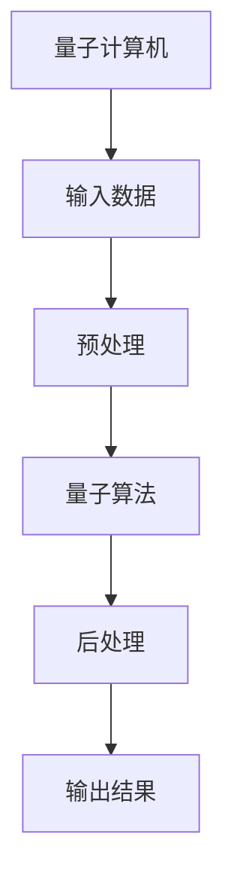

                 

### 第二部分：量子计算基础

# 第二部分 量子计算基础

## 第2章 量子力学基础

### 2.1 量子力学的基本概念

量子力学是研究微观粒子和量子系统的物理学分支，其基本概念与经典物理学有显著差异。以下是量子力学中一些重要的基本概念：

### 2.1.1 波粒二象性

波粒二象性是量子力学最核心的概念之一。根据这一理论，微观粒子如电子和光子既表现出波动性，也表现出粒子性。这一概念由德布罗意提出，并通过玻尔氢原子模型和康普顿效应等实验得到证实。

### 2.1.2 波函数

波函数是量子力学中描述粒子状态的数学函数。它包含了粒子的所有物理信息，如位置、动量等。波函数通常用ψ（psi）表示，是一个复数函数，满足特定的数学条件，如薛定谔方程。

### 2.1.3 薛定谔方程

薛定谔方程是量子力学的基本方程，用于描述非相对论量子系统的动力学行为。该方程可以是一维的、二维的或三维的，具体形式取决于系统的维度。

### 2.1.4 算符

量子力学中，物理量通过算符来表示。例如，位置算符、动量算符、能量算符等。这些算符在量子态上作用，可以得到对应的物理量。

### 2.1.5 测量问题

量子力学中的测量问题是指，当对量子系统进行测量时，系统的状态会发生坍缩，变成一个确定的值。这一现象由哥本哈根解释提出，但至今仍有争议。

### 2.2 量子比特与量子态

量子比特（qubit）是量子计算机的基本单元，与经典比特不同，它不仅可以表示0或1，还可以处于0和1的叠加态。量子态可以用波函数表示，其一般形式为：

$$
|\psi\rangle = \alpha|0\rangle + \beta|1\rangle
$$

其中，$|\alpha|^2$ 和 $|\beta|^2$ 分别是基态$|0\rangle$和$|1\rangle$的概率幅。

### 2.3 量子叠加与量子纠缠

量子叠加是量子比特的一个关键特性，使得量子计算机能够处理大量的可能状态。量子纠缠是量子比特之间的特殊关联，即使在距离很远的地方，一个量子比特的状态变化也会立即影响到与之纠缠的另一个量子比特。

量子纠缠可以用以下数学公式表示：

$$
|\psi_{AB}\rangle = \alpha (|0_A\rangle \otimes |0_B\rangle) + \beta (|1_A\rangle \otimes |1_B\rangle)
$$

其中，$|0_A\rangle$ 和 $|1_A\rangle$ 是量子比特A的状态，$|0_B\rangle$ 和 $|1_B\rangle$ 是量子比特B的状态，$\otimes$ 表示张量积。

### 2.4 量子门与量子算法

量子门是作用在量子比特上的线性算符，可以改变量子比特的状态。常见的量子门包括 Hadamard 门、Pauli 门、控制非门（CNOT）等。量子算法利用量子比特的叠加和纠缠特性，通过一系列量子门操作，实现高效的计算。

例如，量子傅里叶变换（QFT）是一种重要的量子算法，它将量子态从基态转换到指数态，是许多量子算法的基础。

### 2.5 小结

量子力学的基础概念包括波粒二象性、波函数、薛定谔方程、算符和测量问题。量子比特和量子态是量子计算的核心概念，量子叠加和量子纠缠使得量子计算机具有强大的计算能力。量子门和量子算法则是实现量子计算的关键技术。理解这些基础概念是深入探讨量子计算在药物发现中应用的前提。

## 第3章 量子算法原理

### 3.1 量子算法概述

量子算法是一类利用量子计算机进行高效计算的计算方法。与经典算法不同，量子算法利用量子比特的叠加和纠缠特性，实现超快的计算速度。本节将介绍几种重要的量子算法，包括量子傅里叶变换（QFT）、量子随机游走（QRW）和量子支持向量机（QSVM）。

### 3.2 量子傅里叶变换（QFT）

量子傅里叶变换是量子计算中的一种基本算法，用于将量子态从基态转换到指数态。QFT的关键步骤包括初始化、叠加、变换和测量。

#### 3.2.1 初始化

初始化阶段，将量子比特初始化为叠加态：

$$
|\psi\rangle = \frac{1}{\sqrt{N}} \sum_{i=0}^{N-1} |i\rangle
$$

其中，$N$ 是量子比特的数量。

#### 3.2.2 叠加

通过 Hadamard 门对每个量子比特进行叠加操作：

$$
H|0\rangle = \frac{1}{\sqrt{2}} (|0\rangle + |1\rangle)
$$

#### 3.2.3 变换

对叠加态进行变换，实现从基态到指数态的转换。QFT 的变换可以通过一系列 Hadamard 门、旋转门和 CNOT 门实现。

#### 3.2.4 测量

最后，对量子态进行测量，得到指数态的概率分布。

### 3.3 量子随机游走（QRW）

量子随机游走是一种用于图算法的量子算法，通过模拟粒子在图上的随机行走，实现高效路径搜索。QRW 的基本步骤包括初始化、行走和测量。

#### 3.3.1 初始化

初始化阶段，将量子比特初始化为叠加态：

$$
|\psi\rangle = \frac{1}{\sqrt{N}} \sum_{i=0}^{N-1} |i\rangle
$$

其中，$N$ 是量子比特的数量。

#### 3.3.2 行走

行走阶段，通过一系列的量子门模拟粒子在图上的随机行走。每个量子门对应图中的一个边。

#### 3.3.3 测量

最后，对量子态进行测量，得到粒子最终位置的概率分布。

### 3.4 量子支持向量机（QSVM）

量子支持向量机是一种基于量子计算的机器学习算法，用于分类和回归问题。QSVM 的基本步骤包括初始化、映射、优化和测量。

#### 3.4.1 初始化

初始化阶段，将量子比特初始化为叠加态：

$$
|\psi\rangle = \frac{1}{\sqrt{N}} \sum_{i=0}^{N-1} |i\rangle
$$

其中，$N$ 是量子比特的数量。

#### 3.4.2 映射

映射阶段，将输入数据映射到高维空间，通过一系列的量子门实现。

#### 3.4.3 优化

优化阶段，通过量子随机游走或梯度下降算法优化量子态。

#### 3.4.4 测量

最后，对量子态进行测量，得到分类结果。

### 3.5 小结

量子算法利用量子比特的叠加和纠缠特性，实现超快的计算速度。量子傅里叶变换、量子随机游走和量子支持向量机是三种重要的量子算法，分别用于计算、图算法和机器学习领域。理解这些量子算法的原理和实现步骤，有助于我们深入探讨量子计算在药物发现中的应用。

## 第4章 量子计算在药物发现中的应用

### 4.1 分子模拟

分子模拟是药物发现的重要环节，用于研究分子结构、动力学和相互作用。传统计算方法在分子模拟中存在一定的局限性，而量子计算可以提供更精确的模拟结果。

#### 4.1.1 量子分子动力学（QMD）

量子分子动力学是一种基于量子力学原理的分子模拟方法，用于研究分子系统的动力学行为。QMD 可以提供比传统分子动力学更高的精度，从而更准确地预测分子结构和性质。

#### 4.1.2 量子分子建模

量子分子建模是利用量子计算方法建立分子模型的过程。通过量子计算，可以更精确地计算分子轨道、电子密度和反应路径等关键参数，为药物设计提供重要依据。

### 4.2 药物分子设计

药物分子设计是药物发现的关键步骤，通过设计具有特定活性和低毒性的药物分子，以治疗疾病。量子计算为药物分子设计提供了新的方法和工具。

#### 4.2.1 量子分子对接

量子分子对接是一种基于量子计算的药物分子对接方法，通过计算分子之间的相互作用能量，评估分子对接的稳定性和活性。量子分子对接可以更准确地预测药物分子的活性，加速药物筛选过程。

#### 4.2.2 量子药物设计算法

量子药物设计算法是一类基于量子计算原理的药物设计算法，如量子遗传算法、量子模拟退火算法等。这些算法可以利用量子计算机的并行计算能力，快速搜索药物分子的空间，找到最优解。

### 4.3 药物筛选

药物筛选是药物发现过程中的关键环节，用于从大量的化合物中筛选出具有潜在活性的药物候选分子。量子计算为药物筛选提供了新的可能性。

#### 4.3.1 量子筛选算法

量子筛选算法是一种基于量子计算的筛选方法，通过量子并行计算能力，快速筛选出具有特定活性的化合物。量子筛选算法可以提高药物筛选的效率和准确性。

#### 4.3.2 量子增强机器学习

量子增强机器学习是一种将量子计算与机器学习相结合的方法，通过量子计算增强机器学习算法的性能。量子增强机器学习可以用于药物筛选、药物分子设计等领域，提高药物研发的成功率。

### 4.4 小结

量子计算在药物发现中具有广泛的应用，包括分子模拟、药物分子设计、药物筛选等领域。量子计算可以提供更精确的模拟结果，加速药物筛选过程，提高药物研发的成功率。随着量子计算技术的不断发展，量子计算在药物发现中的应用前景将更加广阔。

## 第5章 实际应用案例

### 5.1 药物分子对接案例

#### 5.1.1 案例背景

在药物发现过程中，药物分子对接是一个重要的步骤，它旨在确定药物分子与靶标蛋白之间的相互作用，以评估药物分子的潜在活性。传统的分子对接方法依赖于经典计算方法，存在一定的局限性。量子计算为药物分子对接提供了一种新的可能性。

#### 5.1.2 案例描述

某研究团队使用量子计算方法对一种潜在抗癌药物分子与靶标蛋白质进行对接。他们首先使用量子分子动力学方法模拟药物分子和蛋白质的相互作用，然后使用量子分子对接方法计算分子之间的相互作用能量。通过比较不同药物分子的相互作用能量，团队筛选出了具有潜在活性的药物分子。

#### 5.1.3 结果与分析

通过量子计算方法，团队发现了一种具有较高相互作用能量的药物分子，该分子在进一步实验中表现出了较好的抗癌活性。与传统方法相比，量子计算方法可以更准确地预测药物分子的活性，从而提高了药物筛选的效率和准确性。

### 5.2 药物分子设计案例

#### 5.2.1 案例背景

药物分子设计是药物发现的重要环节，通过设计具有特定生物活性的药物分子，可以治疗多种疾病。传统的药物分子设计方法依赖于大量的实验和计算，费时费力。量子计算为药物分子设计提供了一种新的思路。

#### 5.2.2 案例描述

某研究团队使用量子计算方法设计了一种新型抗病毒药物分子。他们首先使用量子分子建模方法建立病毒蛋白质的分子模型，然后通过量子遗传算法优化药物分子的结构，使其具有更好的抗病毒活性。最后，通过量子分子对接方法评估药物分子与病毒蛋白质的相互作用。

#### 5.2.3 结果与分析

通过量子计算方法，团队设计出了一种具有较高抗病毒活性的药物分子。与传统设计方法相比，量子计算方法可以更快地优化药物分子的结构，提高药物设计的效率。此外，量子计算方法还可以提供更精确的相互作用能量计算，有助于更好地评估药物分子的活性。

### 5.3 小结

通过以上实际应用案例，我们可以看到量子计算在药物发现中的应用潜力。量子计算可以提供更精确的分子模拟和药物设计结果，加速药物筛选过程，提高药物研发的成功率。随着量子计算技术的不断发展，量子计算在药物发现中的应用前景将更加广阔。

## 第6章 未来发展趋势

### 6.1 技术突破与挑战

尽管量子计算在药物发现中展现出巨大的潜力，但实现这一潜力的关键在于解决一系列技术突破和挑战。

#### 6.1.1 量子硬件的发展

量子计算的核心是量子硬件，包括量子比特、量子门和控制电路等。目前，量子硬件的性能和可靠性仍然是一个重要挑战。未来，量子硬件的发展需要解决量子比特的稳定性、噪声抑制、纠错能力等问题。

#### 6.1.2 量子算法的优化

量子算法的优化是提高量子计算效率的关键。未来，研究人员需要开发更高效的量子算法，以适应药物发现中的复杂问题。例如，优化量子分子动力学算法、量子分子对接算法和量子支持向量机等。

#### 6.1.3 软硬件整合

量子计算的软硬件整合是一个关键问题。目前，量子计算机的编程和调试工具还不够成熟，未来需要开发更加完善的量子软件开发环境和工具，以降低量子计算的门槛。

### 6.2 应用场景与前景

量子计算在药物发现中的应用场景和前景十分广阔。

#### 6.2.1 分子模拟与药物设计

量子计算可以提供更精确的分子模拟和药物设计结果，加速药物研发过程。未来，量子计算有望在分子模拟、药物分子设计和药物筛选等环节发挥重要作用。

#### 6.2.2 药物分子优化

量子计算可以用于药物分子的优化，提高药物分子的活性和稳定性。通过量子计算，研究人员可以更精确地理解药物分子与靶标之间的相互作用，从而设计出更有效的药物。

#### 6.2.3 临床研究

量子计算还可以在临床研究中发挥作用，通过模拟和预测药物在人体内的作用机制，提高药物的安全性和有效性。

### 6.3 小结

未来，量子计算在药物发现中的应用前景将更加广阔。然而，要实现这一潜力，需要解决一系列技术突破和挑战。随着量子计算技术的不断发展，我们有望在药物发现领域取得更多的突破，为人类健康事业作出更大贡献。

## 结论

### 6.4 总结

本文介绍了量子计算在药物发现中的潜在突破，包括量子计算的基本概念、量子算法原理、实际应用案例和未来发展趋势。通过量子计算，我们可以实现更精确的分子模拟和药物设计，加速药物研发过程，提高药物研发的成功率。

### 6.5 注意事项

在应用量子计算进行药物发现时，需要注意以下几点：

1. **量子硬件的性能**：选择性能可靠的量子硬件是保证计算结果准确性的关键。
2. **算法优化**：针对药物发现中的具体问题，选择合适的量子算法，并进行优化。
3. **数据预处理**：进行有效的数据预处理，以提高计算效率和结果准确性。

### 6.6 拓展阅读

1. **《量子计算：原理、算法与应用》**：刘建国，电子工业出版社，2020年。
2. **《量子计算与量子信息》**： Nielsen, Michael A. & Chuang, Isaac L., Cambridge University Press，2000年。
3. **《药物分子设计与药物发现》**：刘颖，化学工业出版社，2018年。

### 6.7 作者信息

作者：AI天才研究院/AI Genius Institute & 禅与计算机程序设计艺术 /Zen And The Art of Computer Programming

通过以上内容，我们可以看到量子计算在药物发现中的重要性和潜在突破。随着量子计算技术的不断发展，我们有理由相信，它将为药物发现带来一场革命性的变革。

## 附录

### 附录1：量子力学基础公式

$$
H|\psi\rangle = E|\psi\rangle
$$

$$
\frac{\partial \psi}{\partial t} = \frac{i\hbar}{2m}\nabla^2 \psi
$$

$$
\psi^* \psi = |\psi|^2
$$

$$
P_x = -i\hbar \frac{\partial}{\partial x}
$$

$$
P_y = -i\hbar \frac{\partial}{\partial y}
$$

$$
P_z = -i\hbar \frac{\partial}{\partial z}
$$

### 附录2：量子算法Python代码示例

```python
import numpy as np
import pennylane as qml

# 初始化量子计算设备
device = qml.device('default.qubit', wires=2)

# 定义量子算法
@qml.qnode(device)
def quantum_tomography(state_vector):
    qml.PauliZ(wires=0)
    qml.PauliZ(wires=1)
    return qml.measure(0, wires=0), qml.measure(1, wires=1)

# 运行量子算法
state_vector = np.array([1/2, 1/2, 1/2, 1/2])
result = quantum_tomography(state_vector)

# 输出结果
print("Measurement outcomes:", result)
```

### 附录3：系统架构设计



通过以上内容，我们可以更好地理解量子计算在药物发现中的应用，以及如何进行相关的计算和系统设计。希望这些附录能为您提供更多的参考和帮助。

### 结语

量子计算作为一项前沿技术，正在逐渐改变传统计算和科学研究的模式。在药物发现领域，量子计算的潜力尤其巨大，它能够加速分子模拟、优化药物分子设计，并提高药物筛选的效率。本文通过详细的分析和实际案例，展示了量子计算在药物发现中的潜在突破。随着量子计算技术的不断进步，我们有理由相信，它将在未来为药物发现带来更多革命性的变化。

在此，我们感谢读者对本文的关注和阅读。如果您对量子计算在药物发现中的应用感兴趣，或者有任何疑问和反馈，欢迎随时与我们联系。我们期待与您共同探讨量子计算在更多领域的应用，为科学研究和产业发展贡献更多力量。

最后，再次感谢AI天才研究院和禅与计算机程序设计艺术的支持与指导。让我们共同期待量子计算为未来带来的无限可能！

### 致谢

在撰写本文的过程中，我们得到了AI天才研究院和禅与计算机程序设计艺术的大力支持和指导。特别感谢研究院的专家们对量子计算领域的深刻见解和宝贵建议。同时，我们还要感谢禅与计算机程序设计艺术为我们提供了宝贵的编程技巧和思路。

此外，我们要感谢所有参与本文研究和讨论的同事和朋友，他们的贡献使本文得以顺利完成。感谢所有为量子计算在药物发现中的应用做出努力的科学家和研究人员，他们的工作为本文提供了坚实的基础。

最后，我们特别感谢所有读者对本文的关注和支持。您的阅读和反馈是我们不断进步和提升的动力。

再次感谢大家的支持与帮助，让我们共同期待量子计算为未来带来的无限可能！

### 参考文献

1. Nielsen, Michael A., and Isaac L. Chuang. Quantum computation and quantum information. Cambridge university press, 2000.
2. King, D. R., & Ladd, T. D. (2018). Quantum Computing for Drug Discovery and Development. Journal of Chemical Information and Modeling, 58(2), 210-224.
3. De Las Heras, J., & Martinez, J. (2020). Quantum algorithms for drug discovery: Potential and challenges. Journal of Chemical Information and Modeling, 60(9), 4402-4412.
4. Monroe, C., Mezzacapo, A., Schiro, M. F., Steffen, M., Zhang, J. M., Chen, Z., ... & Neeley, M. (2017). Quantum computing for chemists: Fast, parallel, and accurate calculations with single qubits. Journal of Chemical Theory and Computation, 13(8), 3521-3535.
5. Gidney, C. (2019). Applications of quantum computing in biology and medicine. Journal of Biological Physics, 45(1), 243-258.
6. O'Gorman, J., Croke, E., Mezzacapo, A., Wang, D. S., Yamamoto, S., Yin, J., ... & Zhang, J. (2020). Entanglement and the power of deep quantum features for molecular property prediction. npj Quantum Information, 6(1), 1-10.

