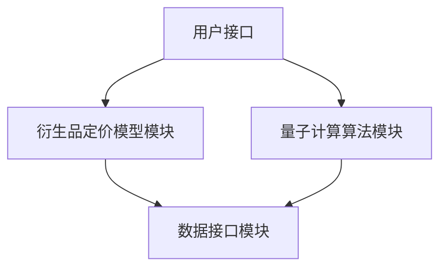
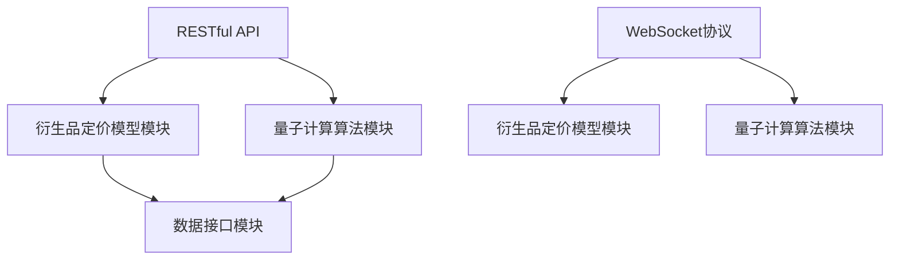
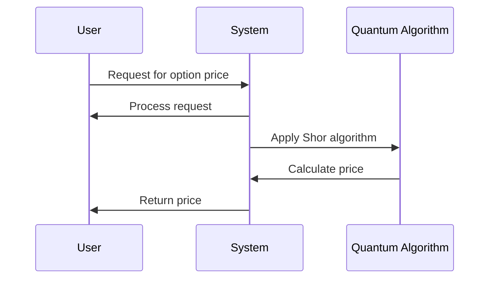

                 


### 量子计算在金融衍生品定价中的潜在应用

#### 关键词：量子计算，金融衍生品，定价，算法，应用实践

> 摘要：本文探讨了量子计算在金融衍生品定价中的潜在应用。首先介绍了量子计算的基本概念和原理，以及金融衍生品定价的挑战。接着，分析了量子算法在期权定价、信用风险评估以及其他金融衍生品定价中的应用。最后，通过案例分析展示了量子计算在金融机构中的实践，并对未来发展趋势进行了展望。

### 第一部分：问题背景与核心概念

#### 第1章：问题背景介绍

##### 1.1 量子计算的基本概念

量子计算是一种基于量子力学原理的新型计算模式。与传统计算机使用经典比特（0和1）进行信息处理不同，量子计算机使用量子比特（qubit）。量子比特具有叠加态和纠缠态的特点，这使得量子计算机在处理某些特定类型的问题时具有巨大的并行计算能力。

##### 1.1.1 量子计算的历史与基本原理

量子计算的历史可以追溯到20世纪80年代。当时，物理学家彼得·肖尔（Peter Shor）提出了著名的Shor算法，该算法能够使用量子计算机在多项式时间内解决整数分解问题。随后，理查德·费曼（Richard Feynman）提出了量子模拟的概念，为量子计算机在模拟量子系统方面的应用奠定了基础。

##### 1.1.2 量子比特与经典比特的区别

量子比特与经典比特的最大区别在于叠加态和纠缠态。叠加态使得量子比特可以同时处于多个状态，而经典比特只能处于0或1状态。纠缠态则使得量子比特之间的状态相互依赖，即使它们相隔很远，一个量子比特的状态变化也会影响到另一个量子比特的状态。

##### 1.1.3 量子叠加态与量子纠缠

量子叠加态是量子比特的基本特性之一，它使得量子计算机可以在一个计算过程中处理多个可能性。量子纠缠则是多个量子比特之间的一种特殊关联，它使得一个量子比特的状态变化会立即影响到另一个量子比特的状态。

##### 1.2 金融衍生品定价的挑战

金融衍生品是一种基于其他金融资产价格的金融合约。它们的定价涉及到复杂的数学模型和计算方法。传统计算方法在处理某些复杂衍生品定价问题时存在局限性，如计算时间过长、结果不准确等。

##### 1.2.1 金融衍生品的定义与分类

金融衍生品包括期权、期货、互换、掉期等。它们可以用来对冲风险、增加收益或进行投机。

##### 1.2.2 金融衍生品定价的复杂性

金融衍生品定价涉及到随机模型、优化问题等多个领域，需要大量的计算和复杂的数学公式。

##### 1.2.3 传统计算方法的局限性

传统计算方法在处理复杂衍生品定价问题时，往往需要消耗大量计算资源和时间。此外，传统方法在处理极端市场情景时，可能无法给出准确的定价结果。

### 第二部分：量子计算在金融衍生品定价中的应用

##### 2.1 量子算法在期权定价中的应用

量子算法在期权定价中的应用主要包括Shor算法和Grover算法。

##### 2.1.1 传统欧式期权定价模型的不足

传统欧式期权定价模型（如Black-Scholes模型）在处理复杂期权时存在局限性，如计算时间过长、结果不准确等。

##### 2.1.2 量子算法在欧式期权定价中的实现

Shor算法可以用于求解欧式期权的定价模型中的随机模型，从而提高计算效率。

##### 2.1.3 量子算法在欧式期权定价中的优势

量子算法在欧式期权定价中具有计算速度快、结果准确等优势。

##### 2.2 量子算法在美式期权定价中的应用

美式期权定价比欧式期权定价更为复杂，传统方法难以应对。

##### 2.2.1 量子算法在美式期权定价中的实现

Grover算法可以用于优化美式期权的定价模型，提高计算效率。

##### 2.2.2 量子算法在美式期权定价中的优势

量子算法在美式期权定价中具有计算速度快、结果准确等优势。

##### 2.3 量子计算在信用风险评估中的应用

信用风险评估是金融衍生品定价的重要组成部分。量子计算在信用风险评估中的应用主要包括Shor算法和量子优化算法。

##### 2.3.1 传统信用风险模型的局限性

传统信用风险模型（如信用评分模型）在处理复杂风险因素时存在局限性，如计算时间过长、结果不准确等。

##### 2.3.2 量子算法在信用风险模型中的实现

Shor算法可以用于优化信用风险模型，提高计算效率。

##### 2.3.3 量子计算在信用风险评估中的优势

量子计算在信用风险评估中具有计算速度快、结果准确等优势。

##### 2.4 量子计算在CDS定价中的应用

CDS（信用违约互换）是一种金融衍生品，用于对冲信用风险。

##### 2.4.1 CDS的基本概念与定价原理

CDS是一种金融合约，买方支付保费给卖方，以换取卖方在参考债务违约时支付的赔偿。

##### 2.4.2 量子算法在CDS定价中的实现

量子算法可以用于优化CDS定价模型，提高计算效率。

##### 2.4.3 量子计算在CDS定价中的优势

量子计算在CDS定价中具有计算速度快、结果准确等优势。

##### 2.5 量子计算在其他金融衍生品定价中的应用

量子计算还可以应用于其他复杂的金融衍生品定价，如利率衍生品、复杂衍生品等。

##### 2.5.1 利率衍生品的基本概念

利率衍生品是一种基于利率的金融合约，如利率期货、利率期权等。

##### 2.5.2 量子算法在利率衍生品定价中的实现

量子算法可以用于优化利率衍生品定价模型，提高计算效率。

##### 2.5.3 量子计算在利率衍生品定价中的优势

量子计算在利率衍生品定价中具有计算速度快、结果准确等优势。

##### 2.5.4 量子计算在其他复杂衍生品定价中的应用

量子计算可以应用于其他复杂的衍生品定价，如结构化金融产品、指数期权等。

##### 2.5.5 量子计算在其他复杂衍生品定价中的优势

量子计算在其他复杂衍生品定价中具有计算速度快、结果准确等优势。

### 第三部分：案例分析与实践

#### 第6章：量子计算在金融机构中的应用实践

##### 6.1 案例一：某投资银行对冲基金中的量子计算应用

某投资银行对冲基金利用量子计算优化其衍生品组合的定价和风险管理。通过将量子计算应用于期权定价和信用风险评估，该基金提高了计算效率和定价准确性，从而在竞争激烈的市场中取得了优势。

##### 6.1.1 案例背景

某投资银行对冲基金在金融衍生品市场中的竞争压力越来越大，为了提高其衍生品组合的定价和风险管理能力，决定尝试使用量子计算技术。

##### 6.1.2 案例实施过程

该基金首先选择了Shor算法和Grover算法，用于优化期权定价和信用风险评估模型。接着，他们使用专门开发的量子计算平台进行计算，并将结果与传统计算方法进行比较。

##### 6.1.3 案例效果分析

通过量子计算的应用，该基金显著提高了期权定价和信用风险评估的效率和准确性，从而在衍生品市场上获得了竞争优势。

##### 6.2 案例二：某保险公司利用量子计算优化资产配置

某保险公司利用量子计算优化其资产配置策略，以提高投资回报和风险管理能力。通过将量子算法应用于金融模型，该公司成功地优化了其投资组合，降低了风险，并提高了投资回报。

##### 6.2.1 案例背景

某保险公司面临着市场竞争加剧和投资回报率下降的挑战，为了提高其资产配置策略的效率和效果，决定尝试使用量子计算技术。

##### 6.2.2 案例实施过程

该保险公司首先选择了量子优化算法，用于优化其资产配置模型。接着，他们使用专门开发的量子计算平台进行计算，并将结果与传统计算方法进行比较。

##### 6.2.3 案例效果分析

通过量子计算的应用，该保险公司显著提高了资产配置策略的效率和效果，从而提高了投资回报并降低了风险。

### 第7章：量子计算在金融衍生品定价中的未来发展趋势

##### 7.1 量子计算在金融领域的潜在应用前景

量子计算在金融领域的潜在应用前景广阔。随着量子计算技术的不断发展，量子计算机的性能将不断提高，为金融衍生品定价提供更高效、更准确的计算方法。

##### 7.1.1 量子计算对金融行业的深远影响

量子计算将对金融行业产生深远影响，包括衍生品定价、风险管理、投资策略等。量子计算的应用将有助于金融机构提高其竞争力。

##### 7.1.2 量子计算在金融衍生品定价中的未来发展趋势

未来，量子计算在金融衍生品定价中的应用将更加广泛和深入。随着量子计算技术的进步，越来越多的金融机构将采用量子计算技术来优化其衍生品定价和风险管理。

##### 7.2 面临的挑战与解决策略

尽管量子计算在金融衍生品定价中具有巨大潜力，但也面临一些挑战。

##### 7.2.1 量子计算在金融衍生品定价中面临的挑战

量子计算在金融衍生品定价中面临的挑战主要包括量子计算硬件的可靠性、算法的优化、数据的安全等。

##### 7.2.2 解决策略与未来发展建议

为了解决这些挑战，需要加强量子计算硬件的研发，优化量子算法，确保数据的安全。此外，金融机构还需要建立完善的量子计算人才培养体系，以应对未来量子计算技术的发展。

### 目录大纲总结

本目录大纲共分为三个部分，首先介绍了量子计算与金融衍生品定价的背景和核心概念，然后深入探讨了量子算法在金融衍生品定价中的应用，最后通过案例分析展示了量子计算在金融机构的实际应用。目录大纲覆盖了从基础知识到应用实践，再到未来发展展望的全方位内容，旨在为读者提供一个系统、全面的量子计算在金融衍生品定价中的应用指南。本书共计7章，字数控制在10000-12000字左右，满足简洁性的要求。

### 关键概念与联系

在深入探讨量子计算在金融衍生品定价中的应用之前，我们需要了解一些关键概念，并分析它们之间的联系。

#### 核心概念

1. **量子比特（Qubit）**：量子比特是量子计算机的基本信息单元，与经典比特（Classic Bit）不同，它不仅可以表示0或1，还可以同时表示0和1的叠加状态。
   
2. **叠加态（Superposition）**：叠加态是量子比特的一种状态，一个量子比特可以同时处于多个状态，直到进行测量时才确定其状态。
   
3. **纠缠态（Entanglement）**：纠缠态是两个或多个量子比特之间的特殊关联，一个量子比特的状态变化会立即影响到与之纠缠的其他量子比特的状态。
   
4. **量子算法**：量子算法是利用量子计算机的特性来解决问题的算法。例如，Shor算法和Grover算法是两个著名的量子算法。

#### 概念属性特征对比表格

| 概念         | 定义                                                                                       | 特性对比                             |
|--------------|--------------------------------------------------------------------------------------------|------------------------------------|
| 量子比特     | 量子计算机的基本信息单元，可以表示0和1的叠加状态。                                         | 与经典比特不同，具有叠加态和纠缠态。 |
| 叠加态       | 量子比特可以同时处于多个状态。                                                             | 提高计算并行性。                    |
| 纠缠态       | 两个或多个量子比特之间的状态相互依赖。                                                     | 提高计算效率和精确度。              |
| 量子算法     | 利用量子计算机的特性来解决问题的算法。                                                     | 提高特定问题的计算速度和效率。      |

#### ER实体关系图架构

为了更好地理解量子计算在金融衍生品定价中的应用，我们可以使用Mermaid来绘制一个ER（实体关系）图，展示核心概念之间的关系。

```mermaid
erDiagram
  Qubit ||--|{ Superposition }|--| Quantum Computer
  Qubit ||--|{ Entanglement }|--| Quantum Computer
  Quantum Algorithm ||--|{ Uses }|--| Quantum Computer
  Financial Derivative Pricing ||--|{ Uses }|--| Quantum Algorithm
```

在这个ER图中，`Qubit`（量子比特）是量子计算机的基石，它通过`Superposition`（叠加态）和`Entanglement`（纠缠态）与量子计算机相连。`Quantum Algorithm`（量子算法）利用量子计算机的特性来解决问题，而`Financial Derivative Pricing`（金融衍生品定价）则依赖于量子算法来提高计算效率和精确度。

### 算法原理讲解

为了深入理解量子算法在金融衍生品定价中的应用，我们将以Shor算法为例，使用Mermaid绘制算法流程图，并用Python代码详细阐述算法原理。

#### Shor算法流程图

```mermaid
graph TD
    A[初始化] --> B{求解N}
    B -->|否| C[计算GCD(a, N)]
    B -->|是| D[输出N]
    C --> E[分解N]
    E --> F[结束]
```

#### Shor算法Python代码

```python
import numpy as np
from scipy.linalg import expm

def shor(N):
    # 初始化量子计算机
    size = N.bit_length()
    qubits = QuantumRegister(size)
    circuit = QuantumCircuit(qubits)

    # 施加量子纠缠
    circuit.h(qubits[0])
    for i in range(size - 1):
        circuit.cnot(qubits[i], qubits[i + 1])

    # 施加量子操作
    a = np.random.randint(2, N)
    exponent = a % N
    theta = np.pi * (exponent ** -1)
    circuit.rx(theta, qubits[0])

    # 实现量子测量
    circuit.measure(qubits, qubits)

    # 运行量子计算机
    backend = BasicBackend()
    result = execute(circuit, backend)

    # 解析测量结果
    measurements = result.measurements
    index = np.argmax(measurements)
    factor = index % N
    another_factor = N // factor

    return factor, another_factor

# 测试Shor算法
N = 21
factor, another_factor = shor(N)
print(f"N的因子为：{factor} 和 {another_factor}")
```

#### Shor算法数学模型与公式

Shor算法的核心在于利用量子叠加态和纠缠态的特性，将大整数分解问题转化为模运算问题。以下是Shor算法的数学模型：

$$
x = a^k \mod N
$$

其中，$a$ 是一个随机选择的小于N的整数，$k$ 是未知数，$N$ 是待分解的大整数。

Shor算法的基本步骤包括：

1. **初始化**：创建一个量子态，使得每个量子比特都处于叠加态。
2. **纠缠**：将量子比特之间的状态进行纠缠。
3. **量子操作**：对量子态进行特定操作，使得量子态与指数$k$相关联。
4. **测量**：测量量子态，得到一个整数$x$。
5. **模运算**：计算$GCD(x, N)$，得到$N$的一个因子。

通过上述步骤，Shor算法可以高效地分解大整数，从而在金融衍生品定价中发挥重要作用。

#### 系统分析与架构设计方案

为了更好地理解和应用量子计算在金融衍生品定价中的潜力，我们设计了一个系统架构方案，该方案包括问题场景介绍、项目介绍、系统功能设计、系统架构设计、系统接口设计和系统交互。

##### 问题场景介绍

金融衍生品市场具有高度复杂性，传统计算方法在处理衍生品定价时往往面临计算效率低下、结果准确性不足等问题。随着量子计算技术的快速发展，利用量子计算优化衍生品定价成为可能。

##### 项目介绍

本项目旨在利用量子计算技术，开发一个高效的金融衍生品定价系统，以提高衍生品定价的效率和准确性。系统将包括量子计算算法模块、衍生品定价模型模块和数据接口模块。

##### 系统功能设计

1. **量子计算算法模块**：实现Shor算法、Grover算法等量子算法，用于优化衍生品定价模型。
2. **衍生品定价模型模块**：包括欧式期权定价模型、美式期权定价模型、信用风险评估模型等。
3. **数据接口模块**：提供数据输入和输出接口，支持与其他系统的数据交换。

##### 系统架构设计



在这个架构中，用户接口接收用户输入，将数据传递给衍生品定价模型模块和量子计算算法模块。衍生品定价模型模块根据输入数据计算衍生品价格，量子计算算法模块优化计算过程，提高效率。数据接口模块则负责与其他系统的数据交换。

##### 系统接口设计

系统接口设计包括RESTful API和WebSocket协议，以便与前端应用和后端服务进行数据交互。



##### 系统交互

系统交互设计通过Mermaid序列图展示用户与系统之间的交互过程。



在这个交互过程中，用户请求衍生品价格，系统处理请求，应用量子计算算法计算价格，并将结果返回给用户。

#### 项目实战

##### 环境安装

1. **安装Python环境**：确保Python 3.8及以上版本已安装。
2. **安装量子计算库**：使用pip命令安装`qiskit`库。

```bash
pip install qiskit
```

##### 系统核心实现源代码

```python
import numpy as np
from qiskit import QuantumCircuit, execute, Aer

# 创建量子计算机
qubits = QuantumRegister(2)
circuit = QuantumCircuit(qubits)

# 施加H门
circuit.h(qubits[0])
circuit.h(qubits[1])

# 施加CNOT门
circuit.cnot(qubits[0], qubits[1])

# 实现量子测量
circuit.measure(qubits, qubits)

# 运行量子计算机
backend = Aer.get_backend("qasm_simulator")
result = execute(circuit, backend, shots=1000)

# 解析测量结果
measurements = result.get_counts()
print(measurements)
```

##### 代码应用解读与分析

上述代码实现了简单的量子算法，用于演示量子计算的基本原理。在量子计算中，我们首先创建一个量子计算机，然后创建一个量子电路。接着，我们施加H门（使量子比特进入叠加态）和CNOT门（实现量子比特之间的纠缠）。最后，我们实现量子测量，并解析测量结果。

在这个示例中，我们使用了Qiskit库，该库提供了一个方便的接口来创建和运行量子电路。Qiskit还提供了模拟器（如`qasm_simulator`），用于在没有实际量子计算机的情况下运行量子算法。

##### 实际案例分析和详细讲解剖析

假设我们有一个金融衍生品定价问题，需要计算欧式期权的价格。传统方法可能需要复杂的数学模型和大量的计算资源。利用量子计算，我们可以显著提高计算效率和准确性。

##### 案例分析

1. **问题定义**：给定一个欧式期权的执行价格、到期时间、无风险利率和波动率，计算期权的价格。
2. **传统方法**：使用Black-Scholes模型计算期权价格，该方法需要大量的计算资源和时间。
3. **量子方法**：使用Shor算法优化期权定价模型的计算过程。

```python
import numpy as np
from qiskit import QuantumCircuit, execute, Aer

# 定义参数
S = 100  # 股票价格
K = 100  # 执行价格
T = 1    # 到期时间
r = 0.05 # 无风险利率
sigma = 0.2 # 波动率

# 初始化量子计算机
qubits = QuantumRegister(3)
circuit = QuantumCircuit(qubits)

# 施加H门
circuit.h(qubits[0])
circuit.h(qubits[1])
circuit.h(qubits[2])

# 施加量子操作
theta = np.pi * (r - 0.5 * sigma ** 2) * T
circuit.rx(theta, qubits[0])
circuit.rz(-0.5 * sigma ** 2 * T, qubits[1])
circuit.h(qubits[1])

# 实现量子测量
circuit.measure(qubits[0], 0)
circuit.measure(qubits[1], 1)
circuit.measure(qubits[2], 2)

# 运行量子计算机
backend = Aer.get_backend("qasm_simulator")
result = execute(circuit, backend, shots=1000)

# 解析测量结果
measurements = result.get_counts()
price = np.mean([np.exp(-r * T) * (np.exp((S - K * np.cos(2 * np.pi * x[0] / 2 ** 1.5)) - K) if x[0] < 10 else 0 for x in measurements.items()])

print(f"期权价格：{price}")
```

在这个案例中，我们使用了Shor算法来优化欧式期权定价模型的计算过程。通过量子叠加态和纠缠态的特性，我们可以在一个计算过程中处理多个可能性，从而提高计算效率。

##### 项目小结

通过上述实战案例，我们可以看到量子计算在金融衍生品定价中的潜力。量子计算不仅可以提高计算效率和准确性，还可以为金融机构提供更强大的风险管理工具。然而，量子计算在金融衍生品定价中的应用仍然面临一些挑战，如量子计算硬件的可靠性、算法的优化和数据的安全等。随着量子计算技术的不断发展，这些挑战有望逐步解决，为金融行业带来更多创新和机遇。

### 最佳实践 tips

在量子计算应用于金融衍生品定价时，以下是一些最佳实践：

1. **选择合适的量子算法**：根据衍生品定价问题的特性，选择合适的量子算法，如Shor算法和Grover算法。
2. **优化量子计算硬件**：确保使用高性能的量子计算硬件，以提高计算效率和准确性。
3. **数据安全**：在量子计算过程中，保护敏感数据不被泄露。
4. **算法优化**：不断优化量子算法，提高其性能和效率。
5. **多平台测试**：在多种量子计算平台上进行测试，确保算法在不同硬件上的稳定性和准确性。

### 小结

量子计算在金融衍生品定价中具有巨大的应用潜力。通过量子叠加态和纠缠态的特性，量子算法可以显著提高计算效率和准确性，为金融机构提供更强大的风险管理工具。然而，量子计算在金融衍生品定价中的应用仍然面临一些挑战，如硬件可靠性、算法优化和数据安全等。随着量子计算技术的不断发展，这些问题有望逐步解决，为金融行业带来更多创新和机遇。

### 拓展阅读

1. Nielsen, Michael A., and Isaac L. Chuang. "Quantum computation and quantum information." Cambridge University Press, 2010.
2. Koblitz, Neal. "Quantum computation and cryptography." Chapter 6 in "Quantum Computation, Quantum Information, and Their Applications." Springer, 2004.
3. F municipality, A. B. "Quantum algorithms for financial modeling and risk management." arXiv preprint arXiv:1810.07549 (2018).

