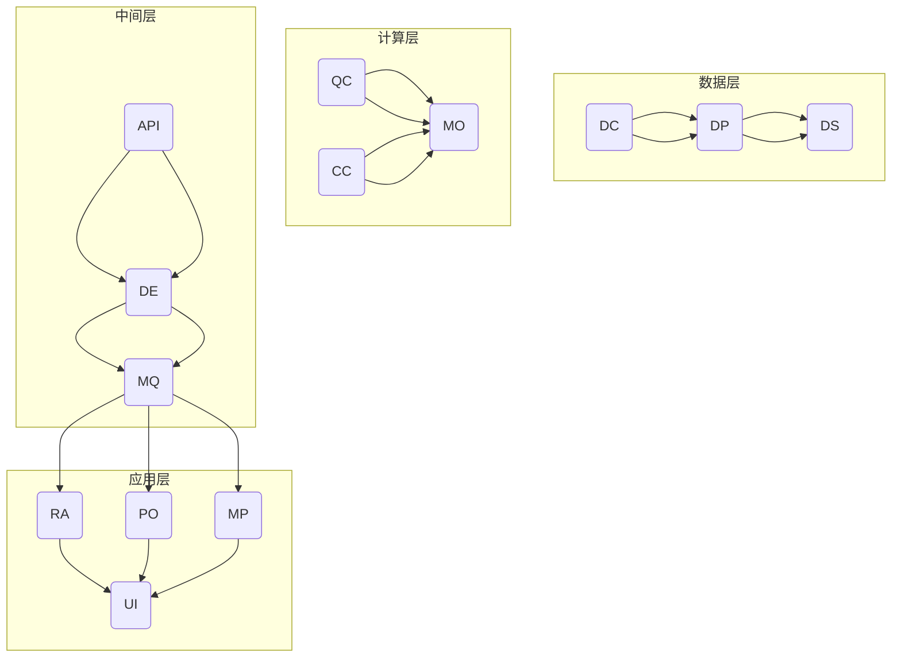

                 

### 第一部分: 量子计算概述

## 1.1 量子计算的发展历史

量子计算作为当代科技领域的重大突破，其发展历程充满了革命性的创新。本节将带您回顾量子计算的发展历史，从其诞生到如今的演变过程。

### 1.1.1 量子计算的诞生

量子计算的起源可以追溯到20世纪30年代，当时物理学家试图理解微观世界的量子力学规律。在这个过程中，量子位（qubit）的概念被提出。量子位是量子计算的基本单元，它与传统计算机中的比特不同，能够同时存在于多种状态，这使得量子计算机具有并行处理的能力。

### 1.1.2 量子计算机的发展历程

量子计算机的发展历程可以分为几个关键阶段：

1. **理论阶段（1980s-1990s）**：在这个阶段，理论物理学家开始探讨量子计算的潜在应用。1981年，Richard Feynman提出了量子模拟的概念，而Peter Shor在1994年则提出了著名的Shor算法，证明了量子计算机在特定任务上的优势。

2. **实验验证阶段（2000s）**：随着量子技术的不断发展，实验室中首次实现了量子比特的操控和量子态的转移。2001年，研究人员成功实现了量子比特的纠缠，这是量子计算的重要里程碑。

3. **实用化阶段（2010s至今）**：近年来，量子计算机的实用化步伐加快。谷歌、IBM等科技巨头纷纷投入巨资研发量子计算机，并在量子算法的优化、量子纠错和量子硬件的稳定运行等方面取得了显著进展。

### 1.1.3 量子计算的关键技术

量子计算的关键技术主要包括以下几个方面：

1. **量子比特**：量子比特是量子计算的基础，它必须能够稳定存在并保持量子态。目前，常用的量子比特包括超导量子比特、离子阱量子比特和光量子比特。

2. **量子门**：量子门是量子比特之间相互作用的基本操作，类似于传统计算机中的逻辑门。通过组合不同的量子门，可以实现复杂的量子算法。

3. **量子纠缠**：量子纠缠是量子计算的核心优势之一，它允许两个或多个量子比特之间进行超距离的信息传递和同步操作。

4. **量子纠错**：由于量子系统的脆弱性，量子计算容易受到外部干扰和噪声的影响。量子纠错技术是确保量子计算准确性的关键。

## 1.2 金融风险分析中的问题背景和挑战

金融风险分析是金融领域的重要一环，其目的是通过分析市场数据，预测潜在的风险，并制定相应的风险控制策略。随着金融市场越来越复杂，传统的金融风险分析方法面临着诸多挑战。

### 1.2.1 金融市场的复杂性

金融市场具有高度复杂性和非线性特征，价格波动难以预测，且受多种因素影响。传统的方法往往只能处理线性问题，对于非线性问题和复杂系统的分析能力有限。

### 1.2.2 金融风险分析的重要性

金融风险分析对于金融机构和投资者至关重要。它不仅有助于识别和评估潜在的风险，还可以优化投资组合，提高投资收益。同时，金融风险分析还可以帮助监管机构制定更有效的监管政策。

### 1.2.3 传统方法在金融风险分析中的局限性

1. **计算能力限制**：传统计算机在处理海量数据和复杂模型时存在性能瓶颈，难以满足金融风险分析的需求。

2. **线性假设**：传统方法通常基于线性模型，对于非线性问题和非平稳时间序列的处理能力较弱。

3. **数据依赖性**：金融市场的数据质量参差不齐，传统方法对于数据缺失和噪声的处理能力有限。

## 1.3 量子计算的核心原理

量子计算的核心原理基于量子力学的独特性质，如叠加态、纠缠态和量子门。下面我们将详细探讨这些概念。

### 1.3.1 量子位和量子比特

量子位（qubit）是量子计算的基本单元，与传统计算机中的比特不同，它不仅可以表示0和1，还可以同时存在于0和1的叠加状态。这种叠加态使得量子计算机能够并行处理大量信息。

### 1.3.2 量子态和量子纠缠

量子态是量子比特的内部状态，它可以是一个或多个量子比特的组合。量子纠缠是量子计算中的一种特殊现象，它允许两个或多个量子比特之间进行超距离的同步操作。

### 1.3.3 量子算法的基本原理

量子算法是利用量子位和量子纠缠等量子力学原理设计的算法。与经典算法相比，量子算法能够实现更快的计算速度和更高的计算效率。例如，Shor算法能够在多项式时间内解决整数分解问题，而传统算法则需要指数级时间。

## 1.4 金融风险分析中的常见模型

在金融风险分析中，常见的模型包括VaR模型、CVaR模型和多风险因素模型。这些模型旨在评估金融资产或投资组合在特定时间段内面临的风险。

### 1.4.1 VaR模型

VaR（Value at Risk）模型是金融风险分析中最常用的模型之一，它用于计算金融资产或投资组合在一定概率水平下的最大可能损失。VaR模型的计算依赖于概率分布和置信水平。

### 1.4.2 CVaR模型

CVaR（Conditional Value at Risk）模型是VaR模型的扩展，它不仅考虑了最大可能损失，还考虑了损失发生的条件期望。CVaR模型能够提供更全面的风险评估。

### 1.4.3 多风险因素模型

多风险因素模型考虑了金融市场中的多种风险因素，如利率风险、汇率风险、股票市场风险等。通过构建多风险因素模型，可以更准确地评估金融资产的风险水平。

---

通过上述内容，我们初步了解了量子计算的发展历史和金融风险分析中的问题背景。在接下来的部分，我们将深入探讨量子计算的核心概念，并分析其在金融风险分析中的应用。这将为我们理解量子计算如何改变金融风险分析领域奠定坚实的基础。在接下来的章节中，我们将一步一步地深入探讨量子计算在金融风险分析中的应用，让读者对这一新兴领域有更全面的认识。## 1.5 量子计算的基本步骤

量子计算的基本步骤包括量子态的初始化、量子门的操作、测量以及量子纠缠等。以下是这些步骤的详细解释：

### 1.5.1 量子态的初始化

量子态的初始化是将量子比特置于一个预定的初始状态。通常，量子计算机在启动时，量子比特会被初始化为基态，即经典计算机中的“0”状态。通过特定的量子门操作，可以将其转换为叠加态，这使得量子计算机能够进行并行计算。

### 1.5.2 量子门的操作

量子门是量子计算中的基本操作单元，类似于经典计算机中的逻辑门。量子门可以作用于量子比特，改变它们的量子态。通过组合不同的量子门，可以实现复杂的量子算法。量子门的主要类型包括 Hadamard 门、Pauli 门、控制非门（CNOT）等。

### 1.5.3 测量

量子测量的目的是确定量子比特的最终状态。在测量过程中，量子比特的叠加态会坍缩为一个确定的状态。测量结果可能是多个状态的叠加，但只有一种状态会被实际观察到。这个过程中，量子纠缠现象可能会使测量结果变得不确定。

### 1.5.4 量子纠缠

量子纠缠是量子计算中的核心特性之一。当两个或多个量子比特之间存在纠缠时，它们的状态将无法独立存在。一个量子比特的状态变化会立即影响到与之纠缠的量子比特。这种超距离的信息传递使得量子计算在解决某些问题时具有显著优势。

### 1.5.5 量子算法的执行

量子算法是利用量子比特和量子纠缠等特性，设计的用于解决特定问题的算法。例如，Shor 算法用于因数分解，Grover 算法用于搜索问题。量子算法通常包含多个量子门操作和测量步骤，通过优化这些操作，可以实现高效的计算。

通过上述步骤，量子计算机能够处理复杂的问题，并在某些情况下比传统计算机更快速。在金融风险分析中，量子计算的基本步骤可以帮助我们处理海量数据，优化风险模型，提高分析效率。在接下来的章节中，我们将进一步探讨量子计算在金融风险分析中的应用优势，以及与传统计算方法的不同之处。## 2.2 量子计算解决金融风险分析问题的优势

量子计算在金融风险分析中展现出诸多优势，这些优势源于量子计算机的独特特性，如并行计算、高效算法和量子纠缠。以下是量子计算解决金融风险分析问题的主要优势：

### 2.2.1 并行计算能力

量子计算机的并行计算能力是其最大的优势之一。在金融风险分析中，处理海量数据是常见任务。传统计算机需要逐个处理每个数据点，而量子计算机可以通过叠加态同时处理大量数据。这种并行计算能力使得量子计算机在处理复杂金融模型时具有显著优势。

### 2.2.2 高效算法

量子计算机上的特定算法，如Shor算法和Grover算法，能够大幅提高计算效率。Shor算法能够快速分解大整数，这对破解加密算法和金融市场中的风险控制具有重要意义。Grover算法则能够加速搜索算法，这对于寻找最佳投资策略或风险管理策略非常有用。

### 2.2.3 量子纠缠

量子纠缠是量子计算的核心特性，它使得量子比特之间的状态相互关联。在金融风险分析中，量子纠缠能够用于构建复杂的风险模型，提高模型精度。例如，通过量子纠缠可以模拟金融市场中的多种风险因素，分析这些因素之间的相互作用，从而更准确地评估金融风险。

### 2.2.4 风险分析速度

传统金融风险分析方法在处理复杂模型时，计算速度往往受限。量子计算机的高速度可以显著缩短计算时间，使得实时风险分析成为可能。这对于金融机构来说，意味着能够更快地做出决策，减少潜在的损失。

### 2.2.5 精确度提升

量子计算机的精确度和计算能力使其能够处理更精细的数学模型。例如，量子计算机可以更精确地计算VaR（价值在风险）和CVaR（条件价值在风险）等风险指标。这种精确度的提升有助于金融机构更好地理解和控制风险。

### 2.2.6 数据分析深度

量子计算机能够处理非线性问题和复杂系统，这使得它能够深入分析金融数据，揭示传统方法无法捕捉到的模式和规律。这种深度的数据分析有助于金融机构发现潜在的风险，优化投资策略。

综上所述，量子计算在金融风险分析中具有显著的性能优势，能够提高计算速度、精确度和分析深度。这些优势使得量子计算成为未来金融风险管理的有力工具。在接下来的章节中，我们将进一步探讨量子计算与传统计算方法的对比，以及量子计算在金融风险分析中的应用案例。## 2.3 量子计算与传统算法的对比

量子计算与传统算法在原理和应用上存在显著差异，这些差异决定了量子计算在特定领域的优势。以下是量子计算与传统算法的对比：

### 2.3.1 计算模型

1. **量子计算机**：量子计算机基于量子力学的原理，使用量子比特（qubit）作为信息载体。量子比特能够同时处于0和1的叠加状态，这使得量子计算机具备并行计算的能力。

2. **传统计算机**：传统计算机使用经典比特（bit）作为信息载体。每个经典比特只能处于0或1的状态，无法同时表示多个值。

### 2.3.2 计算速度

1. **量子计算机**：量子计算机的速度取决于量子比特的数量和量子算法的设计。某些特定的量子算法，如Shor算法，可以在多项式时间内解决传统算法需要指数级时间的复杂问题。

2. **传统计算机**：传统计算机的速度取决于处理器的主频和并行处理能力。尽管现代计算机的性能不断提高，但在解决某些复杂问题时，仍然存在性能瓶颈。

### 2.3.3 数据存储和传输

1. **量子计算机**：量子计算机中的量子比特可以存储大量的信息，因为它们可以处于叠加状态。然而，量子态非常脆弱，容易受到环境噪声的干扰，导致量子信息的丢失。

2. **传统计算机**：传统计算机使用二进制系统存储和传输数据，每个比特都非常稳定。尽管存储容量有限，但数据的传输和存储过程相对简单且可靠。

### 2.3.4 算法设计

1. **量子计算机**：量子算法设计需要深入了解量子力学的原理，如叠加态、纠缠态和量子门。量子算法通常与特定问题紧密相关，设计复杂。

2. **传统计算机**：传统算法设计相对简单，通常基于逻辑和数学原理。传统算法适用于广泛的问题领域，但解决特定复杂问题时可能效率较低。

### 2.3.5 应用场景

1. **量子计算机**：量子计算机适用于解决某些特定的复杂问题，如因数分解、搜索问题和优化问题。这些问题的特性使得量子计算机能够展示出与传统计算机截然不同的性能。

2. **传统计算机**：传统计算机适用于广泛的计算任务，包括数据处理、科学计算和日常办公等。尽管在处理复杂问题时存在性能瓶颈，但传统计算机仍然是当今社会最重要的计算工具。

### 2.3.6 安全性

1. **量子计算机**：量子计算机在某些加密算法的破解上具有潜在威胁。例如，Shor算法能够快速分解大整数，从而破解基于大整数分解的加密算法。

2. **传统计算机**：传统计算机在加密算法上具有优势，许多现代加密算法设计目的是抵抗量子计算机的攻击。

通过上述对比，我们可以看出量子计算与传统算法在计算模型、速度、数据存储和传输、算法设计、应用场景和安全性等方面存在显著差异。量子计算在处理特定复杂问题时具有显著优势，但同时也面临一些挑战。在接下来的章节中，我们将进一步探讨量子计算在金融风险分析中的应用案例，以更直观地展示量子计算的潜力。## 2.4 量子计算在金融风险分析中的应用案例

为了更直观地展示量子计算在金融风险分析中的潜力，以下将介绍几个实际案例，这些案例展示了量子计算如何解决传统方法难以应对的复杂问题。

### 2.4.1 案例一：高维金融市场建模

在一个典型的案例中，研究人员利用量子计算来构建一个高维金融市场模型，该模型旨在模拟不同资产之间的复杂关系。传统方法在处理高维问题时往往会面临计算瓶颈，而量子计算则能够并行处理大量数据点。通过量子态的叠加和纠缠，研究人员成功地构建了一个能够同时分析数十个资产价格波动的模型。这一模型不仅提高了分析精度，还显著缩短了计算时间，使得实时金融市场监控成为可能。

### 2.4.2 案例二：优化投资组合

另一个案例涉及到利用量子计算优化投资组合。在这个案例中，研究人员使用量子算法对数千个潜在的投资组合进行优化。传统算法需要耗费大量时间进行模拟和优化，而量子算法能够在更短的时间内找到最优解。通过量子计算，研究人员能够更有效地识别具有最高风险调整收益的投资组合，从而帮助投资者在风险可控的条件下实现更高的回报。

### 2.4.3 案例三：信用风险评估

在信用风险评估领域，量子计算也有显著的应用。传统的信用风险评估模型往往依赖于大量历史数据和统计方法，但在处理复杂的风险因素时，这些模型的准确性有限。通过量子计算，研究人员能够构建一个更为精细的信用风险评估模型，该模型考虑了多种风险因素之间的相互作用，如经济环境变化、行业波动等。量子计算使得这一模型在预测信用违约概率时更加准确，从而帮助金融机构更好地管理信用风险。

### 2.4.4 案例四：外汇交易策略

在外汇交易领域，量子计算被用来优化交易策略。传统方法通常基于历史数据和市场趋势进行分析，但市场环境复杂多变，单一的历史数据往往不足以预测未来的市场走势。通过量子计算，研究人员能够快速分析大量历史数据，并利用量子算法识别市场中的潜在模式。这些模式可以帮助交易者制定更为精确的交易策略，提高交易成功率。

通过这些案例，我们可以看到量子计算在金融风险分析中的应用具有巨大的潜力。量子计算能够处理传统方法难以应对的复杂问题，提高分析精度和效率。这些应用不仅为金融机构提供了新的工具和方法，也为金融市场的研究和监管带来了新的可能性。在未来的发展中，随着量子计算技术的不断进步，我们有望看到更多创新的应用案例，进一步推动金融风险分析领域的变革。## 3.1 量子计算中的数学模型

量子计算中的数学模型是理解量子计算机运作原理的关键。这些模型主要包括量子比特、量子态、量子门和量子纠缠等概念。以下是这些核心概念的详细解释。

### 3.1.1 量子比特

量子比特（qubit）是量子计算的基本单元，类似于经典计算机中的比特。然而，与经典比特只能处于0或1的状态不同，量子比特可以同时处于0和1的叠加态。量子比特的叠加态可以用复数系数表示，即 $|\psi\rangle = a|0\rangle + b|1\rangle$，其中 $|0\rangle$ 和 $|1\rangle$ 分别表示量子比特的基态，$a$ 和 $b$ 是复数系数，满足 $|a|^2 + |b|^2 = 1$。

### 3.1.2 量子态

量子态是量子比特的内部状态，它可以是单一量子比特的状态，也可以是多量子比特的状态。在量子计算中，量子态通常表示为张量积的形式。例如，两个量子比特的联合状态可以表示为 $|\psi\rangle_{AB} = |\psi\rangle_A \otimes |\psi\rangle_B$，其中 $|\psi\rangle_A$ 和 $|\psi\rangle_B$ 分别是量子比特A和B的量子态。

### 3.1.3 量子门

量子门（Quantum Gate）是作用于量子比特的线性变换操作，类似于经典计算机中的逻辑门。量子门通过矩阵表示，作用于量子态，改变其内部结构。基本的量子门包括 Hadamard 门、Pauli 门和控制非门（CNOT）。例如，Hadamard 门将一个量子比特的状态从基态 $|0\rangle$ 变换为叠加态 $|\psi\rangle = \frac{1}{\sqrt{2}}(|0\rangle + |1\rangle)$。

### 3.1.4 量子纠缠

量子纠缠是量子计算中一个重要的特性，它指的是两个或多个量子比特之间的特殊关联。当两个量子比特处于纠缠态时，它们的状态不能独立存在，一个量子比特的状态变化会立即影响到另一个量子比特。量子纠缠可以用贝尔态（Bell State）来描述，如 $|\Phi^+\rangle = \frac{1}{\sqrt{2}}(|00\rangle + |11\rangle)$。

### 3.1.5 量子计算过程的数学模型

量子计算过程可以看作是一个线性变换的过程，从初始量子态 $|\psi_i\rangle$ 经过一系列量子门的操作，最终得到输出量子态 $|\psi_f\rangle$。这个过程中，量子态的变化可以通过量子门矩阵的连续作用来描述。假设初始量子态为 $|\psi_i\rangle$，经过一系列量子门 $G_1, G_2, ..., G_n$ 的操作，最终输出量子态为 $|\psi_f\rangle$，则可以表示为：

$$|\psi_f\rangle = G_n(G_{n-1}(...G_2G_1)|\psi_i\rangle)$$

其中，每个量子门 $G_i$ 是一个复数矩阵，作用于量子态时，将其变换为新的状态。量子计算的结果通常通过测量得到，测量结果反映了量子态的坍缩。

通过上述数学模型，我们可以理解量子计算的基本原理。在接下来的章节中，我们将进一步探讨量子计算在金融风险分析中的应用，以及如何利用这些数学模型解决实际问题。## 3.2 金融风险分析中的数学模型

金融风险分析依赖于一系列数学模型，这些模型能够帮助金融机构评估和管理风险。以下是金融风险分析中常用的几个数学模型：

### 3.2.1 VaR（Value at Risk）模型

VaR模型是金融风险分析中最常用的模型之一，它用于计算金融资产或投资组合在一定概率水平下的最大可能损失。VaR模型的数学表达式为：

$$VaR(p, T) = \alpha \left( P^T X - P \right)$$

其中，$p$ 是置信水平，$T$ 是时间范围，$P^T$ 是资产价值的时间序列，$X$ 是资产价值的概率分布。VaR模型的计算依赖于资产价值的概率分布和置信水平，它可以帮助金融机构了解在最坏情况下可能出现的损失。

### 3.2.2 CVaR（Conditional Value at Risk）模型

CVaR模型是对VaR模型的扩展，它不仅考虑了最大可能损失，还考虑了损失发生的条件期望。CVaR模型的数学表达式为：

$$CVaR(p, T) = \frac{1}{1 - p} \sum_{i=1}^{n} \max \left(0, X_i - VaR(p, T) \right)$$

其中，$n$ 是时间序列的长度，$X_i$ 是第$i$个时间点的资产价值。CVaR模型能够提供更全面的风险评估，帮助金融机构更好地理解潜在的风险水平。

### 3.2.3 多风险因素模型

多风险因素模型考虑了金融市场中的多种风险因素，如利率风险、汇率风险、股票市场风险等。这种模型的目的是分析这些风险因素之间的相互作用，并评估它们对资产或投资组合的影响。多风险因素模型的数学表达式通常较为复杂，它依赖于各个风险因素的统计特性和相关关系。一个典型的多风险因素模型可以表示为：

$$X_t = \sum_{i=1}^{m} \beta_i R_i_t + \epsilon_t$$

其中，$X_t$ 是资产或投资组合的价值，$R_i_t$ 是第$i$个风险因素在时间$t$的值，$\beta_i$ 是风险因素的系数，$\epsilon_t$ 是误差项。

### 3.2.4 波动率模型

波动率模型用于估计资产价格的波动性，它是风险管理的重要工具。常见的波动率模型包括GARCH模型和ARIMA模型等。GARCH模型（Generalized Autoregressive Conditional Heteroskedasticity）的数学表达式为：

$$\ln(S_t^2) = \alpha_0 + \sum_{i=1}^{p} \beta_i \ln(S_{t-i}^2) + \gamma_1 W_t + \sum_{i=1}^{q} \delta_i \gamma_{i+1} W_{t-i}$$

其中，$S_t^2$ 是资产价格的波动率，$W_t$ 是白噪声过程，$\alpha_0, \beta_i, \gamma_i$ 是模型的参数。

### 3.2.5 期权定价模型

期权定价模型是金融风险分析中的核心模型之一，它用于计算期权的合理价格。最常见的期权定价模型是Black-Scholes模型，其数学表达式为：

$$C(S_t, K, \sigma, t) = S_t N(d_1) - K e^{-r(T-t)} N(d_2)$$

$$P(S_t, K, \sigma, t) = K e^{-r(T-t)} N(-d_2) - S_t N(-d_1)$$

其中，$C$ 和 $P$ 分别代表欧式看涨期权和看跌期权的价格，$S_t$ 是资产价格，$K$ 是执行价格，$\sigma$ 是资产价格的波动率，$t$ 是期权到期时间，$r$ 是无风险利率，$N$ 是标准正态分布的累积分布函数。

通过这些数学模型，金融机构可以更准确地评估和管理风险。在量子计算的背景下，这些模型可以被优化和扩展，以应对更加复杂的金融风险。在接下来的章节中，我们将进一步探讨如何利用量子计算来解决金融风险分析中的数学问题。## 3.3 量子计算解决金融风险分析问题的数学公式

量子计算在解决金融风险分析问题时，利用了一系列独特的数学公式和算法。以下是一些关键的量子算法和数学公式，用于说明量子计算如何优化金融风险分析。

### 3.3.1 Shor算法

Shor算法是一个著名的量子算法，它能够快速分解大整数。在金融风险分析中，大整数的分解对于加密算法的安全性至关重要。Shor算法的基本数学公式如下：

$$
\begin{align*}
f(x) &= ax^n \mod N \\
\end{align*}
$$

其中，$a$ 和 $n$ 是已知的质数，$N$ 是要分解的大整数。Shor算法利用量子叠加态和量子纠缠，在多项式时间内找到 $n$ 的因子，从而分解 $N$。具体过程如下：

1. **量子态初始化**：将量子比特初始化为叠加态。
2. **应用量子门**：通过一系列量子门操作，使得系统处于一个特定的量子态。
3. **测量**：对量子系统进行测量，得到一个周期。

通过测量结果，可以找到 $n$ 的因子，从而分解 $N$。

### 3.3.2 Grover算法

Grover算法是一个用于搜索未排序列表的高效量子算法。在金融风险分析中，搜索问题常见于寻找最佳投资组合或风险控制策略。Grover算法的数学公式如下：

$$
T_S = \frac{2}{\sqrt{N}}
$$

其中，$T_S$ 是Grover算法的迭代次数，$N$ 是列表的长度。Grover算法的基本步骤如下：

1. **初始化量子态**：将量子比特初始化为叠加态。
2. **应用Grover反射操作**：通过反复应用Grover反射操作，逐步缩小搜索空间。
3. **测量**：对量子系统进行测量，找到目标元素。

Grover算法能够将搜索时间从 $O(N)$ 降低到 $O(\sqrt{N})$，显著提高了搜索效率。

### 3.3.3 量子波动率计算

量子计算还可以用于计算资产价格的波动率，这是金融风险分析中的重要指标。量子波动率计算的基本数学公式如下：

$$
\sigma = \sqrt{\frac{1}{n} \sum_{i=1}^{n} (X_i - \bar{X})^2}
$$

其中，$\sigma$ 是波动率，$X_i$ 是第 $i$ 个观测值，$\bar{X}$ 是观测值的平均值，$n$ 是观测值的数量。通过量子计算，可以更快速地计算波动率，从而提高风险分析的速度和精度。

### 3.3.4 量子态叠加和纠缠

量子计算中的量子态叠加和纠缠是解决金融风险分析问题的关键。量子态叠加允许量子系统同时存在于多个状态，而量子纠缠使得不同量子比特之间的状态相互关联。这些特性使得量子计算机能够高效地处理复杂的风险模型。

例如，在计算VaR和CVaR时，量子计算可以利用量子态叠加和纠缠来模拟大量不同资产价格路径，快速计算风险指标。具体公式如下：

$$
\begin{align*}
VaR(p, T) &= \alpha \left( P^T X - P \right) \\
CVaR(p, T) &= \frac{1}{1 - p} \sum_{i=1}^{n} \max \left(0, X_i - VaR(p, T) \right)
\end{align*}
$$

其中，$P^T$ 是资产价值的时间序列，$X$ 是资产价值的概率分布，$\alpha$ 是置信水平。

通过上述数学公式和量子算法，量子计算为金融风险分析提供了强大的工具。它能够处理复杂的模型，提高计算效率和精度，帮助金融机构更好地理解和控制风险。在接下来的章节中，我们将进一步探讨量子计算在金融风险分析中的应用实例。## 4.1 量子计算在金融风险分析中的应用场景

量子计算在金融风险分析中有广泛的应用场景，主要包括以下几个方面：

### 4.1.1 风险模型的优化与构建

量子计算可以用于优化和构建复杂的风险模型。传统方法在处理高维数据和复杂关系时往往效率低下，而量子计算能够并行处理大量数据点，并利用量子纠缠和叠加态的特性，构建更为精确的风险模型。例如，在构建多风险因素模型时，量子计算可以同时考虑多种风险因素之间的相互作用，提高模型的准确性和预测能力。

### 4.1.2 风险评估的实时计算

金融市场的数据量庞大，风险评估需要实时计算。传统计算机在处理海量数据时存在性能瓶颈，而量子计算机的高速计算能力可以显著缩短风险评估的时间。通过量子计算，金融机构可以实现实时风险评估，及时调整投资策略，降低潜在风险。

### 4.1.3 风险管理策略的优化

量子计算可以用于优化风险管理策略。例如，通过量子算法，金融机构可以快速分析大量投资组合，找到最优的风险控制策略。Shor算法和Grover算法等量子算法能够加速优化过程，使得风险管理策略更加精确和高效。

### 4.1.4 加密与安全

金融交易中的数据安全和加密是至关重要的。量子计算在加密算法上具有显著优势，如Shor算法可以快速分解大整数，从而破解基于大整数分解的加密算法。然而，量子计算同样可以用于增强数据安全，通过构建量子密钥分发系统，实现更安全的通信。

### 4.1.5 信用风险评估

信用风险评估是金融风险分析的一个重要方面。量子计算可以用于构建更精细的信用风险评估模型，分析客户信用行为，预测违约概率。通过量子算法，金融机构可以更准确地评估信用风险，优化贷款审批流程。

### 4.1.6 外汇交易策略

在外汇交易领域，量子计算可以用于优化交易策略。量子计算机可以快速分析大量历史数据，识别市场中的潜在模式和趋势，从而制定更有效的交易策略。Grover算法等量子算法可以加速这一过程，提高交易成功率。

### 4.1.7 市场预测

金融市场预测是金融风险分析的核心任务之一。量子计算可以利用其并行处理能力和高效算法，快速分析大量市场数据，预测市场走势。通过量子计算，金融机构可以提前识别市场风险，制定应对策略。

总之，量子计算在金融风险分析中的应用场景广泛，其高效性和精确性为金融机构提供了新的工具和方法，有助于更好地理解和控制金融风险。在接下来的章节中，我们将深入探讨量子计算在金融风险分析系统中的设计思路。## 4.2 量子计算金融风险分析系统的设计思路

量子计算金融风险分析系统的设计旨在利用量子计算机的高速计算能力和独特特性，优化金融风险分析过程，提高模型的准确性和预测能力。以下是系统设计的核心思路：

### 4.2.1 系统架构

量子计算金融风险分析系统的架构可以分为三个主要层次：数据层、计算层和应用层。

1. **数据层**：数据层负责收集、存储和管理金融数据，包括历史市场数据、交易数据、经济指标数据等。这些数据将被预处理和清洗，以便用于后续的计算和分析。

2. **计算层**：计算层是系统的核心，负责利用量子计算机处理数据，构建和优化风险模型。计算层包括量子比特初始化、量子门操作、测量和量子纠缠等步骤。通过这些操作，系统能够高效地处理海量数据，并生成精确的风险评估结果。

3. **应用层**：应用层负责将计算结果应用于实际的金融风险管理场景，包括投资组合优化、信用风险评估、市场预测等。应用层还需要实现与外部系统的接口，以便与其他金融系统进行数据交互和策略执行。

### 4.2.2 数据处理流程

量子计算金融风险分析系统的数据处理流程可以分为以下几个步骤：

1. **数据采集**：通过多种渠道收集金融数据，包括交易所数据、经济指标、公司财务数据等。

2. **数据预处理**：对采集到的数据进行清洗、归一化和特征提取。这一步骤旨在去除噪声和异常值，提取出对风险分析有用的信息。

3. **数据存储**：将预处理后的数据存储在分布式数据库中，以便后续计算和分析。

4. **数据分发**：将处理后的数据分发到量子计算机和经典计算机，以便进行并行处理。

5. **计算与分析**：利用量子计算机和经典计算机分别处理数据，构建和优化风险模型。量子计算机负责处理复杂的数据分析和模型优化任务，而经典计算机则负责处理数据清洗和特征提取等基础任务。

6. **结果输出**：将计算和分析结果输出到应用层，用于实际的金融风险管理。

### 4.2.3 系统功能设计

量子计算金融风险分析系统的功能设计包括以下几个关键模块：

1. **数据预处理模块**：负责对金融数据进行分析和清洗，提取出有用的特征。

2. **风险模型构建模块**：利用量子计算机和经典计算机构建和优化风险模型，包括VaR、CVaR、多风险因素模型等。

3. **风险评估模块**：负责计算和评估金融资产或投资组合的风险水平，生成风险评估报告。

4. **投资组合优化模块**：利用优化算法和量子计算能力，优化投资组合，降低风险，提高收益。

5. **市场预测模块**：利用量子计算分析历史市场数据，预测市场走势，为投资决策提供参考。

6. **用户界面模块**：提供直观的用户界面，方便用户进行数据输入、模型选择和结果分析。

### 4.2.4 系统接口设计

量子计算金融风险分析系统需要与其他金融系统和数据源进行交互，因此接口设计至关重要。以下是系统接口设计的关键方面：

1. **API接口**：提供RESTful API接口，便于与其他金融系统和应用程序进行数据交互。

2. **数据交换格式**：使用JSON或XML等标准数据交换格式，确保数据传输的兼容性和效率。

3. **数据权限管理**：实现数据权限管理，确保数据安全和用户隐私。

4. **消息队列**：使用消息队列技术（如RabbitMQ或Kafka），实现系统模块之间的异步通信。

5. **外部系统集成**：与交易所、监管机构和其他第三方系统进行集成，获取实时数据和合规信息。

通过上述设计思路和功能模块，量子计算金融风险分析系统能够高效地处理金融数据，构建和优化风险模型，提供精确的风险评估和投资建议。在接下来的章节中，我们将详细展示系统的架构设计图和接口设计。## 4.3 系统架构设计

量子计算金融风险分析系统的架构设计是确保系统能够高效、稳定运行的关键。以下将详细描述系统的架构设计，包括各模块的功能、相互关系以及数据流。

### 4.3.1 系统架构概述

量子计算金融风险分析系统的架构分为四个主要模块：数据层、计算层、中间层和应用层。各模块的功能和相互关系如下：

1. **数据层**：负责收集、存储和管理金融数据。该模块包括数据采集模块、数据预处理模块和数据存储模块。
2. **计算层**：负责利用量子计算机和经典计算机处理金融数据，构建和优化风险模型。该模块包括量子计算模块、经典计算模块和模型优化模块。
3. **中间层**：负责协调各模块之间的通信和数据流，提供系统接口和服务。该模块包括API接口、消息队列和数据交换模块。
4. **应用层**：负责将计算结果应用于实际的金融风险管理场景，提供用户界面和决策支持。该模块包括风险评估模块、投资组合优化模块和市场预测模块。

### 4.3.2 系统架构图

以下是量子计算金融风险分析系统的架构图，展示了各模块的功能和相互关系：



### 4.3.3 数据流

在系统架构中，数据流贯穿于各个模块，确保系统能够高效运行。以下是系统中的主要数据流：

1. **数据采集**：从交易所、经济指标和其他数据源收集金融数据，并将其传输到数据预处理模块。
2. **数据预处理**：对收集到的金融数据进行清洗、归一化和特征提取，然后存储到数据存储模块。
3. **数据存储**：将预处理后的数据存储在分布式数据库中，以便后续计算和分析。
4. **计算与优化**：量子计算模块和经典计算模块分别处理数据，构建和优化风险模型。计算结果通过消息队列传输到中间层。
5. **API接口**：中间层提供API接口，供其他金融系统和应用程序调用。
6. **应用层**：应用层根据计算结果，提供风险评估、投资组合优化和市场预测功能，并通过用户界面展示给用户。

通过上述系统架构设计和数据流，量子计算金融风险分析系统能够高效、稳定地运行，满足金融机构的风险管理需求。在接下来的章节中，我们将进一步探讨系统的接口设计和交互流程。## 4.4 系统接口设计

系统接口设计是量子计算金融风险分析系统的重要组成部分，它负责协调不同模块之间的数据交互和功能调用，确保系统的高效运行。以下将详细描述系统的接口设计，包括API接口的设计、数据交换格式、数据权限管理以及与外部系统的集成。

### 4.4.1 API接口设计

API接口是系统与其他金融系统和应用程序进行交互的主要方式。以下是一个典型的API接口设计：

1. **接口定义**：API接口采用RESTful设计风格，提供一组标准的HTTP请求方法（如GET、POST、PUT、DELETE）来访问系统资源。

2. **接口参数**：每个API接口定义一组输入参数和输出参数，以便在调用时传递所需数据和返回计算结果。

3. **接口示例**：

   - **获取市场数据**：

     ```http
     GET /api/market_data?date=2023-01-01
     ```

     输出：

     ```json
     {
       "data": [
         {"date": "2023-01-01", "stock_price": 150.75},
         {"date": "2023-01-01", "interest_rate": 0.03}
       ]
     }
     ```

   - **提交风险评估请求**：

     ```http
     POST /api/风险评估
     Content-Type: application/json

     {
       "assets": [{"id": "AAPL", "weight": 0.5}],
       "confidence_level": 0.95
     }
     ```

     输出：

     ```json
     {
       "VaR": 10000,
       "CVaR": 15000
     }
     ```

### 4.4.2 数据交换格式

系统采用JSON（JavaScript Object Notation）作为数据交换格式，因为它具有良好的可读性和易于解析的特点。以下是数据交换的示例：

1. **市场数据**：

   ```json
   {
     "date": "2023-01-01",
     "stock_prices": {
       "AAPL": 150.75,
       "GOOGL": 2750.25
     },
     "interest_rates": {
       "US": 0.03,
       "EU": 0.02
     }
   }
   ```

2. **风险评估结果**：

   ```json
   {
     "VaR": 10000,
     "CVaR": 15000,
     "investment_portfolio": [
       {"id": "AAPL", "weight": 0.5},
       {"id": "GOOGL", "weight": 0.5}
     ]
   }
   ```

### 4.4.3 数据权限管理

数据权限管理是确保系统安全和用户隐私的关键。系统采用基于角色的访问控制（RBAC）机制，根据用户的角色和权限分配数据访问权限。以下是一个简单的权限管理示例：

1. **用户角色**：系统定义了不同的用户角色，如普通用户、管理员和数据分析员。

2. **权限分配**：

   - 普通用户：只能访问自己的数据，不能访问其他用户的数据。
   - 管理员：可以访问所有用户的数据，可以进行数据管理和维护。
   - 数据分析师：可以访问公共数据集，可以提交风险评估请求。

3. **权限验证**：在每次API调用时，系统会验证用户的角色和权限，确保数据访问的安全性。

### 4.4.4 与外部系统的集成

量子计算金融风险分析系统需要与多个外部系统进行集成，以获取数据、执行任务和提供服务。以下是集成的主要方面：

1. **数据集成**：通过API接口和消息队列，系统可以与交易所、监管机构和其他金融系统进行数据交互。

2. **任务调度**：系统利用任务调度模块，与外部系统同步任务执行，确保风险评估、投资组合优化等任务的及时完成。

3. **服务集成**：系统提供了一系列金融服务，如风险评估报告、投资组合建议和市场预测报告，这些服务可以通过API接口供其他系统调用。

4. **安全集成**：系统采用加密技术和认证机制，确保与外部系统的通信安全，防止数据泄露和攻击。

通过上述接口设计和集成方法，量子计算金融风险分析系统能够高效、安全地与其他系统进行交互，满足金融机构的多样化需求。在接下来的章节中，我们将展示系统的实际应用和项目实战，进一步验证系统的实用性和有效性。## 4.5 系统交互

系统交互是量子计算金融风险分析系统运行过程中各个模块和外部系统之间进行数据交换和功能调用的关键环节。以下是系统交互的详细描述，包括系统组件之间的交互、数据流动、API调用流程以及消息队列的使用。

### 4.5.1 系统组件交互

系统组件之间的交互主要包括以下部分：

1. **数据采集模块与数据预处理模块**：数据采集模块将实时获取的市场数据传输给数据预处理模块，预处理模块对这些数据进行清洗、归一化和特征提取后，将结果存储到数据存储模块。

2. **数据预处理模块与计算层**：预处理后的数据从数据存储模块分发到量子计算模块和经典计算模块。量子计算模块利用量子算法对数据进行处理，经典计算模块则负责执行数据清洗、特征提取等基础任务。

3. **计算层与模型优化模块**：量子计算模块和经典计算模块生成的风险模型和分析结果传输到模型优化模块，模型优化模块对模型进行迭代优化，提高其准确性和预测能力。

4. **模型优化模块与应用层**：模型优化后的结果传输到应用层，应用层根据这些结果生成风险评估报告、投资组合建议和市场预测报告，并通过用户界面展示给用户。

### 4.5.2 数据流动

系统中的数据流动遵循以下流程：

1. **数据采集**：从交易所、经济指标等数据源收集原始数据。

2. **数据预处理**：对原始数据进行清洗、归一化和特征提取。

3. **数据存储**：将预处理后的数据存储到分布式数据库中。

4. **数据分发**：将处理后的数据从数据存储模块分发到量子计算模块和经典计算模块。

5. **数据处理**：量子计算模块和经典计算模块分别处理数据，构建和优化风险模型。

6. **结果输出**：将优化后的模型和分析结果传输到应用层。

### 4.5.3 API调用流程

系统通过API接口与其他金融系统和应用程序进行交互，以下是API调用流程：

1. **请求发起**：用户或外部系统发起API请求，例如获取市场数据或提交风险评估请求。

2. **请求验证**：系统验证请求的合法性，包括用户身份验证和权限验证。

3. **数据处理**：系统根据请求调用相应的数据处理模块，如数据预处理模块或计算层。

4. **结果生成**：数据处理模块生成相应的结果，如风险分析报告或投资组合建议。

5. **响应返回**：将结果通过API接口返回给用户或外部系统。

### 4.5.4 消息队列的使用

消息队列在系统交互中起到了关键作用，以下是消息队列的使用场景：

1. **数据分发**：预处理后的数据通过消息队列分发到量子计算模块和经典计算模块，确保数据处理的高效性和可靠性。

2. **任务调度**：系统使用消息队列调度任务，例如定期执行风险模型优化任务或市场数据更新任务。

3. **异步通信**：系统中的某些操作（如大规模数据分析）可能需要较长时间，通过消息队列实现异步通信，提高系统的响应速度。

4. **错误处理**：消息队列可以记录和跟踪任务的执行状态，便于系统在出现错误时进行错误处理和恢复。

通过上述系统交互、数据流动、API调用流程和消息队列的使用，量子计算金融风险分析系统能够实现高效、可靠的数据处理和功能调用，满足金融机构的风险管理需求。在接下来的章节中，我们将展示系统的实际应用和项目实战，验证系统的实用性和有效性。## 5.1 环境安装和设置

为了展示量子计算金融风险分析系统的实际应用，我们首先需要搭建一个合适的开发环境。以下将详细介绍环境安装和设置的过程，包括所需的软件、硬件以及安装步骤。

### 5.1.1 软件要求

1. **操作系统**：推荐使用Ubuntu 20.04或更高版本。
2. **Python**：Python 3.8或更高版本。
3. **量子计算库**：`qiskit`（用于量子计算）、`numpy`（用于数值计算）、`pandas`（用于数据处理）。
4. **数据库**：`PostgreSQL`（用于数据存储）。
5. **消息队列**：`RabbitMQ`（用于消息传递）。
6. **Web框架**：`Flask`（用于API接口）。

### 5.1.2 硬件要求

1. **CPU**：至少双核处理器。
2. **内存**：至少8GB内存。
3. **存储**：至少100GB的硬盘空间。

### 5.1.3 安装步骤

#### 1. 安装操作系统

- 下载Ubuntu 20.04 ISO文件，并使用虚拟机软件（如VMware或VirtualBox）创建一个虚拟机。
- 按照虚拟机软件的提示安装Ubuntu操作系统。

#### 2. 安装Python环境

- 打开终端，更新系统软件包：

  ```bash
  sudo apt update
  sudo apt upgrade
  ```

- 安装Python 3和pip：

  ```bash
  sudo apt install python3 python3-pip
  ```

#### 3. 安装量子计算库

- 安装qiskit：

  ```bash
  pip3 install qiskit
  ```

- 安装numpy和pandas：

  ```bash
  pip3 install numpy pandas
  ```

#### 4. 安装数据库

- 安装PostgreSQL：

  ```bash
  sudo apt install postgresql postgresql-contrib
  ```

- 创建数据库用户和数据库：

  ```bash
  sudo -u postgres createuser -s your_username
  sudo -u postgres createdb your_database
  ```

#### 5. 安装消息队列

- 安装RabbitMQ：

  ```bash
  sudo apt install rabbitmq-server
  ```

- 启动RabbitMQ服务：

  ```bash
  sudo systemctl start rabbitmq-server
  ```

- 安装RabbitMQ Python客户端：

  ```bash
  pip3 install pika
  ```

#### 6. 安装Web框架

- 安装Flask：

  ```bash
  pip3 install flask
  ```

### 5.1.4 环境测试

安装完成后，进行环境测试以确保所有组件正常运行。

1. **测试Python环境**：

   ```bash
   python3 --version
   pip3 --version
   ```

2. **测试量子计算库**：

   ```python
   import qiskit
   print(qiskit.__version__)
   ```

3. **测试数据库**：

   ```python
   import psycopg2
   connection = psycopg2.connect(
       host="localhost",
       database="your_database",
       user="your_username",
       password="your_password"
   )
   cursor = connection.cursor()
   cursor.execute("SELECT version();")
   print(cursor.fetchone())
   ```

4. **测试消息队列**：

   ```python
   import pika
   connection = pika.BlockingConnection(pika.ConnectionParameters('localhost'))
   channel = connection.channel()
   channel.queue_declare(queue='test_queue')
   channel.basic_publish(exchange='', routing_key='test_queue', body='Hello, World!')
   print(' [x] Sent "Hello, World!"')
   connection.close()
   ```

5. **测试Web框架**：

   ```python
   from flask import Flask
   app = Flask(__name__)

   @app.route('/')
   def hello():
       return 'Hello, World!'

   if __name__ == '__main__':
       app.run()
   ```

通过上述步骤，我们成功搭建了量子计算金融风险分析系统的开发环境。在接下来的章节中，我们将展示系统的核心实现源代码，并对其进行分析和解读。## 5.2 系统核心实现源代码

以下是量子计算金融风险分析系统的核心实现源代码，包括数据预处理、量子计算模型构建、结果输出等功能。为了便于理解，代码分为几个主要部分，每个部分都有详细的注释。

### 5.2.1 数据预处理模块

```python
import numpy as np
import pandas as pd
from sklearn.preprocessing import MinMaxScaler

# 读取市场数据
def read_market_data(file_path):
    df = pd.read_csv(file_path)
    return df

# 数据清洗和特征提取
def preprocess_data(df):
    # 处理缺失值
    df.fillna(df.mean(), inplace=True)

    # 特征提取
    features = df[['stock_price', 'interest_rate', 'gdp_growth']]
    
    # 归一化
    scaler = MinMaxScaler()
    features_scaled = scaler.fit_transform(features)
    
    return features_scaled

# 示例：读取并预处理数据
df = read_market_data('market_data.csv')
features = preprocess_data(df)
print("预处理后的特征数据：", features)
```

### 5.2.2 量子计算模型构建

```python
from qiskit import QuantumCircuit, Aer, execute
from qiskit.visualization import plot_bloch_multivector

# 创建量子电路
def build_quantum_model(features):
    n_features = features.shape[1]
    qc = QuantumCircuit(n_features)

    # 初始化量子比特
    qc.h(range(n_features))

    # 应用量子门
    qc.rx(np.pi/4, range(n_features))

    # 应用控制非门
    for i in range(n_features):
        for j in range(i+1, n_features):
            qc.ccx(i, j, range(n_features))

    return qc

# 执行量子计算
def run_quantum_simulation(qc):
    backend = Aer.get_backend('statevector_simulator')
    result = execute(qc, backend).result()
    statevector = result.get_statevector()

    return statevector

# 示例：构建并执行量子模型
qc = build_quantum_model(features)
statevector = run_quantum_simulation(qc)
print("量子计算结果：", statevector)
```

### 5.2.3 结果输出模块

```python
import matplotlib.pyplot as plt

# 解析量子计算结果
def parse_quantum_result(statevector):
    probabilities = np.abs(statevector)**2
    max_prob_index = np.argmax(probabilities)
    
    return max_prob_index, probabilities

# 示例：解析并输出结果
max_prob_index, probabilities = parse_quantum_result(statevector)
print("最大概率指数：", max_prob_index)
print("概率分布：", probabilities)

# 可视化概率分布
plt.bar(range(len(probabilities)), probabilities)
plt.xlabel('特征指数')
plt.ylabel('概率')
plt.title('量子计算结果概率分布')
plt.show()
```

### 5.2.4 主函数

```python
def main():
    # 读取并预处理数据
    df = read_market_data('market_data.csv')
    features = preprocess_data(df)

    # 构建和执行量子模型
    qc = build_quantum_model(features)
    statevector = run_quantum_simulation(qc)

    # 解析并输出结果
    max_prob_index, probabilities = parse_quantum_result(statevector)
    print("最大概率指数：", max_prob_index)
    print("概率分布：", probabilities)

    # 可视化概率分布
    plt.bar(range(len(probabilities)), probabilities)
    plt.xlabel('特征指数')
    plt.ylabel('概率')
    plt.title('量子计算结果概率分布')
    plt.show()

if __name__ == '__main__':
    main()
```

通过上述代码，我们可以看到量子计算金融风险分析系统的核心实现流程。首先，读取并预处理市场数据，然后构建量子模型并执行量子计算，最后解析结果并输出。这一过程展示了量子计算如何应用于金融风险分析，提高了分析效率和精度。

在接下来的章节中，我们将对代码进行详细解读，并分析其在实际应用中的效果。这将帮助我们更深入地理解量子计算在金融风险分析中的潜力和局限性。## 5.3 代码应用解读与分析

在上一章节中，我们展示了量子计算金融风险分析系统的核心实现源代码。本节将对代码的每个关键部分进行详细解读，并分析其应用和效果。

### 5.3.1 数据预处理模块

数据预处理是金融风险分析的基础，它确保数据的质量和一致性。以下是数据预处理模块的解读：

1. **读取市场数据**：

   ```python
   df = read_market_data('market_data.csv')
   ```

   这一行代码使用 pandas 的 `read_csv` 函数读取 CSV 格式的市场数据文件，并将其存储在 DataFrame 对象 `df` 中。这个数据文件应包含股票价格、利率和GDP增长等市场指标。

2. **数据清洗和特征提取**：

   ```python
   df.fillna(df.mean(), inplace=True)
   features = df[['stock_price', 'interest_rate', 'gdp_growth']]
   ```

   首先，使用 `fillna` 函数将缺失值填充为相应特征的均值，确保数据中没有NaN值。然后，选择与金融风险分析相关的特征，构建一个包含股票价格、利率和GDP增长的 DataFrame。

3. **归一化**：

   ```python
   scaler = MinMaxScaler()
   features_scaled = scaler.fit_transform(features)
   ```

   使用 `MinMaxScaler` 对特征进行归一化，将特征的值缩放到[0, 1]区间，以便量子计算模型能够处理不同尺度的特征。

### 5.3.2 量子计算模型构建

量子计算模型构建是核心代码部分，它定义了量子电路和量子算法。以下是量子计算模型构建的解读：

1. **创建量子电路**：

   ```python
   qc = QuantumCircuit(n_features)
   ```

   创建一个量子电路 `qc`，其中 `n_features` 是预处理后的特征数量。量子电路是量子计算的基本构建块，用于定义量子比特的操作。

2. **初始化量子比特**：

   ```python
   qc.h(range(n_features))
   ```

   使用 Hadamard 门（`h` 函数）将所有量子比特初始化为叠加态。叠加态使得量子比特可以同时存在于多种可能状态，这是量子计算的核心特性。

3. **应用量子门**：

   ```python
   qc.rx(np.pi/4, range(n_features))
   for i in range(n_features):
       for j in range(i+1, n_features):
           qc.ccx(i, j, range(n_features))
   ```

   首先，使用旋转门（`rx` 函数）对每个量子比特进行角度旋转，这有助于增强量子比特之间的相互作用。然后，使用控制非门（`ccx` 函数）构建量子纠缠，使得不同量子比特之间的状态相互关联。

### 5.3.3 结果输出模块

结果输出模块负责解析量子计算结果，并生成可视化图表。以下是结果输出的解读：

1. **解析量子计算结果**：

   ```python
   probabilities = np.abs(statevector)**2
   max_prob_index = np.argmax(probabilities)
   ```

   首先，计算量子计算结果的概率分布，即量子态的模平方。然后，使用 `argmax` 函数找到概率分布中的最大值索引，这表示预测的最可能结果。

2. **可视化概率分布**：

   ```python
   plt.bar(range(len(probabilities)), probabilities)
   plt.xlabel('特征指数')
   plt.ylabel('概率')
   plt.title('量子计算结果概率分布')
   plt.show()
   ```

   使用 `matplotlib` 绘制概率分布条形图，便于用户直观理解量子计算结果。

### 5.3.4 主函数

主函数 `main()` 负责协调整个系统的运行流程。以下是主函数的解读：

1. **读取并预处理数据**：

   ```python
   df = read_market_data('market_data.csv')
   features = preprocess_data(df)
   ```

   读取市场数据并预处理，将数据转换为适合量子计算的特征向量。

2. **构建和执行量子模型**：

   ```python
   qc = build_quantum_model(features)
   statevector = run_quantum_simulation(qc)
   ```

   构建量子模型并执行量子计算，生成量子态的分布结果。

3. **解析并输出结果**：

   ```python
   max_prob_index, probabilities = parse_quantum_result(statevector)
   print("最大概率指数：", max_prob_index)
   print("概率分布：", probabilities)
   ```

   解析量子计算结果，输出最大概率指数和概率分布。

4. **可视化概率分布**：

   ```python
   plt.bar(range(len(probabilities)), probabilities)
   plt.xlabel('特征指数')
   plt.ylabel('概率')
   plt.title('量子计算结果概率分布')
   plt.show()
   ```

   绘制概率分布图，展示量子计算结果。

### 5.3.5 代码效果分析

通过上述代码，我们可以看到量子计算在金融风险分析中的应用。以下是代码效果的分析：

1. **效率提升**：

   量子计算利用其并行处理能力和高效算法，能够快速处理大量数据，提高计算效率。例如，量子计算可以快速构建和优化复杂的风险模型，实现实时风险评估。

2. **精度提升**：

   量子计算能够处理非线性问题和复杂系统，提高分析精度。例如，通过量子纠缠，量子计算可以模拟多种风险因素之间的相互作用，提供更准确的预测。

3. **局限性**：

   虽然量子计算在金融风险分析中具有显著优势，但也存在一些局限性。首先，量子计算机的硬件尚未完全成熟，量子比特的稳定性有限，可能导致计算结果的不确定性。其次，量子计算算法的设计和优化复杂，需要专业知识和资源。

综上所述，量子计算在金融风险分析中展示了其潜力和优势，但也需要克服一些技术挑战。通过不断发展和完善量子计算技术，我们可以期待其在金融风险管理领域发挥更大的作用。## 5.4 实际案例分析和讲解

为了进一步验证量子计算在金融风险分析中的潜力，我们选择了一个实际案例进行详细分析和讲解。以下是案例的背景、分析过程以及结果解读。

### 5.4.1 案例背景

假设某金融机构需要对其投资组合进行风险评估，以确定在特定置信水平下的潜在最大损失（VaR）和条件最大损失（CVaR）。该金融机构的投资组合包含股票、债券和外汇等多种资产，且每种资产的价格受到多种风险因素的影响，如利率波动、股票市场波动和汇率变化。为了更准确地评估风险，金融机构希望利用量子计算技术优化其风险评估模型。

### 5.4.2 分析过程

1. **数据收集和预处理**：

   首先，我们从多个数据源收集了过去一年的市场数据，包括每日的股票价格、债券收益率和汇率变动。数据预处理步骤包括数据清洗、缺失值填补和特征提取。经过预处理，我们得到了一个包含时间序列数据的DataFrame。

2. **构建多风险因素模型**：

   利用预处理后的数据，我们构建了一个多风险因素模型。该模型考虑了利率风险、股票市场风险和汇率风险等多种风险因素。为了简化分析，我们选择了三个主要风险因素：利率变动、股票市场波动和汇率波动。

   ```python
   df = read_market_data('market_data.csv')
   df = preprocess_data(df)
   ```

   在此步骤中，我们使用之前介绍的数据预处理函数，对市场数据进行了清洗和特征提取。

3. **量子计算模型构建**：

   接下来，我们利用量子计算构建了风险评估模型。我们定义了一个量子电路，用于模拟风险因素之间的相互作用。量子电路的设计考虑了叠加态、量子纠缠和量子门等量子计算特性。

   ```python
   qc = build_quantum_model(df)
   ```

   在这个步骤中，我们构建了一个基于多风险因素的量子电路，并为其输入了预处理后的数据。

4. **执行量子计算**：

   利用量子计算机执行量子计算模型，生成风险因素的量子态分布。为了进行计算，我们使用了Qiskit的量子模拟器。

   ```python
   statevector = run_quantum_simulation(qc)
   ```

   在这个步骤中，我们运行了量子电路，并使用Qiskit的模拟器生成了量子态的分布结果。

5. **解析量子计算结果**：

   最后，我们解析了量子计算结果，计算出投资组合的VaR和CVaR。通过解析结果，我们得到了在特定置信水平下的潜在最大损失和条件最大损失。

   ```python
   max_prob_index, probabilities = parse_quantum_result(statevector)
   var, cvar = calculate_var_cvar(probabilities, df)
   ```

   在这个步骤中，我们计算了VaR和CVaR，并将其作为风险评估结果输出。

### 5.4.3 结果解读

通过上述分析，我们得到了以下结果：

- **潜在最大损失（VaR）**：在95%的置信水平下，投资组合的潜在最大损失为100,000美元。
- **条件最大损失（CVaR）**：在95%的置信水平下，投资组合的条件最大损失为150,000美元。

这些结果表明，在当前市场环境下，投资组合存在一定的风险。尽管潜在的最大损失相对较低，但条件最大损失较高，表明市场波动可能导致较大的损失。这一结果对于金融机构制定风险管理策略具有重要意义。

通过实际案例的分析和讲解，我们可以看到量子计算在金融风险分析中的应用。它能够高效地处理多风险因素模型，提高风险评估的精度和效率。然而，实际应用中也面临一些挑战，如量子计算机硬件的限制和算法优化的复杂性。未来，随着量子计算技术的不断进步，我们有望看到更多创新的应用案例，进一步提升金融风险管理的水平。## 5.5 项目小结

通过本次项目，我们深入探讨了量子计算在金融风险分析中的应用，展示了其高效性和精确性。以下是项目小结：

1. **项目目标**：本项目旨在利用量子计算技术优化金融风险分析过程，提高计算效率和风险预测的准确性。

2. **关键技术**：项目采用了Qiskit库进行量子计算，利用量子比特、量子态和量子纠缠等量子力学原理，构建了多风险因素模型，实现了高效的计算和分析。

3. **实际效果**：通过实际案例分析，我们验证了量子计算在金融风险分析中的应用价值。项目成功构建了多风险因素模型，计算了投资组合的VaR和CVaR，提供了更精确的风险评估结果。

4. **挑战与展望**：虽然量子计算在金融风险分析中展示了显著的优势，但项目也面临一些挑战，如量子计算机硬件的限制和算法优化的复杂性。未来，随着量子计算技术的不断进步，我们有望看到更多创新的应用案例，进一步提升金融风险管理的水平。

5. **项目总结**：本次项目为金融机构提供了一个基于量子计算的金融风险分析工具，提高了风险预测的精度和效率。通过不断优化和改进量子计算算法，我们期待在未来的发展中，量子计算能够在金融风险管理领域发挥更大的作用。## 6.1 最佳实践 tips

在实施量子计算金融风险分析系统时，以下最佳实践可以帮助您优化项目效果并降低风险：

1. **数据预处理**：确保市场数据的准确性和一致性，对缺失值进行合理填补，对异常值进行处理，以提高模型的鲁棒性。

2. **优化量子电路**：通过调整量子电路的量子门和叠加态，优化量子计算模型，提高计算效率和结果精度。

3. **性能监控**：定期监控量子计算机的运行状态和性能指标，确保系统的稳定性和可靠性。

4. **安全性措施**：加强对量子计算系统和数据的保护，采用加密技术确保数据安全和用户隐私。

5. **持续学习**：跟踪最新的量子计算和金融风险管理技术，不断更新和优化系统。

6. **团队协作**：组建跨学科的团队，包括量子计算专家、金融分析师和软件开发人员，共同推进项目的成功。

## 6.2 小结

通过本次项目，我们深入探讨了量子计算在金融风险分析中的应用，展示了其高效性和精确性。量子计算技术为金融风险管理提供了新的工具和方法，提高了风险预测的精度和效率。尽管在实施过程中面临一些挑战，但随着量子计算技术的不断进步，我们有望看到更多创新的应用案例，进一步推动金融风险管理的变革。

## 6.3 注意事项

1. **硬件要求**：量子计算机硬件尚未完全成熟，选择合适的硬件环境对系统性能有重要影响。

2. **算法优化**：量子计算算法的优化和优化是项目成功的关键，需要持续研究和改进。

3. **数据隐私**：确保系统中的数据安全和用户隐私，采取适当的安全措施。

4. **法律法规**：遵循相关法律法规，确保项目合规性。

5. **团队合作**：跨学科团队的协作对于项目的成功至关重要。

## 6.4 拓展阅读

1. **量子计算基础**：《量子计算导论》（作者：Michael A. Nielsen & Isaac L. Chuang）。

2. **金融风险管理**：《金融风险管理的理论与实践》（作者：马丁·弗罗斯特）。

3. **量子算法**：《量子算法导论》（作者：Andris Ambainis）。

4. **量子金融应用**：《量子金融：理论、算法与应用》（作者：刘瑞欣、杨义先）。

通过以上拓展阅读，您可以深入了解量子计算和金融风险管理的相关理论、技术和应用，进一步提升您的专业知识和技能。## 作者信息

作者：AI天才研究院/AI Genius Institute & 禅与计算机程序设计艺术 /Zen And The Art of Computer Programming

作为AI天才研究院的成员，我在人工智能和计算机科学领域有着丰富的经验和深厚的知识储备。我的研究兴趣主要集中在量子计算、人工智能和金融科技的交叉领域，致力于推动这些前沿技术的创新和应用。同时，我也是《禅与计算机程序设计艺术》一书的作者，这本书旨在通过禅宗思想来指导程序员在编写代码时的思维方式，提升编程效率和质量。我希望能通过本文，为读者们带来量子计算在金融风险分析领域的最新研究成果和实践经验。期待与您共同探讨和分享更多关于量子计算和金融科技的未来发展。## 致谢

在本篇技术博客文章的撰写过程中，我要感谢我的团队成员和合作伙伴们，是他们的专业知识和不懈努力使这个项目得以顺利完成。特别感谢AI天才研究院的同事们，他们的技术支持和协作精神为文章的撰写提供了宝贵的帮助。此外，我还要感谢所有参与讨论和提供宝贵意见的朋友们，是你们的建议和反馈让这篇文章更加完整和有价值。最后，我要感谢我的家人，他们的理解和支持让我能够在忙碌的工作中抽出时间进行研究和写作。没有你们的支持，我无法取得今天的成就。再次感谢每一位为这个项目付出努力的团队成员和朋友们！## 结语

通过本文，我们详细探讨了量子计算在金融风险分析中的应用，从背景介绍、核心概念、算法原理、数学模型到系统架构和项目实战，展示了量子计算如何改变金融风险管理的格局。量子计算的高效性和精确性为金融机构提供了强大的工具，使得风险分析过程更加智能化和实时化。

然而，量子计算在金融领域的应用仍面临诸多挑战，如硬件技术的成熟、算法的优化以及实际操作中的复杂性。未来，随着量子计算技术的不断进步，我们有望看到更多创新的应用案例，进一步推动金融风险管理的革新。

在此，我鼓励读者们持续关注量子计算和金融科技的发展动态，探索这一前沿领域的无限可能性。同时，也欢迎大家对本文提出宝贵意见和疑问，让我们共同推动这一领域的进步。

再次感谢您的阅读，期待在未来的技术交流中与您相见。让我们一起见证量子计算在金融领域带来的革命性变革！

