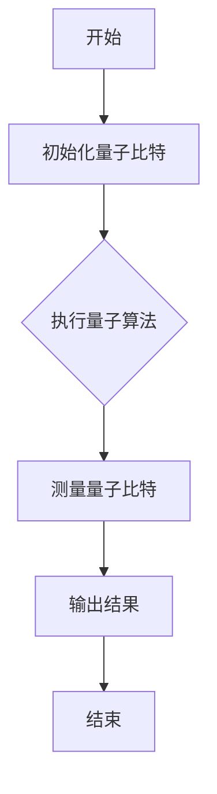
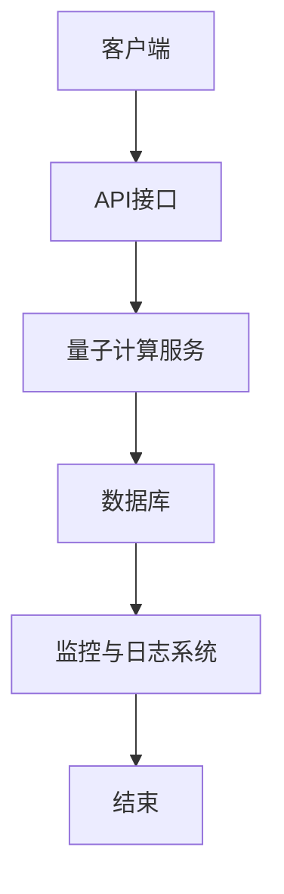
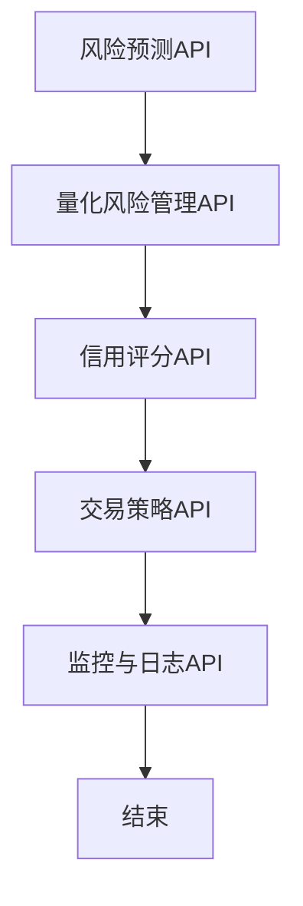
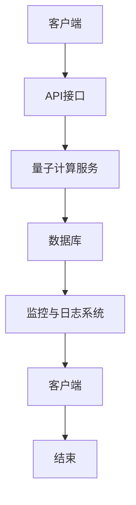

                 

# 量子计算在金融风险分析中的应用：提高风险评估准确性

## 关键词
量子计算，金融风险分析，风险评估准确性，算法原理，系统架构设计，项目实战

## 摘要
本文深入探讨了量子计算在金融风险分析中的应用，旨在提高风险评估的准确性。文章首先介绍了量子计算的基本概念和金融风险分析的重要性，接着详细分析了量子计算在金融风险分析中的核心应用场景，包括风险建模、信用风险评估和金融市场风险管理。随后，通过具体的案例分析和项目实战，展示了量子计算在金融领域的前景和挑战。最后，文章总结了量子计算在金融风险分析中的应用前景，并对未来的发展趋势进行了展望。

## 目录

### 第一部分：背景与概念介绍

#### 1.1 量子计算基础

- **量子计算的概念与历史**：介绍量子计算的基本概念及其发展历程，包括量子比特、量子叠加与量子纠缠等基本原理。

- **量子比特与经典比特的区别**：详细比较量子比特和经典比特的属性差异，包括计算速度、并行性等方面。

- **量子叠加与量子纠缠原理**：解释量子叠加和量子纠缠的基本原理，并展示它们在量子计算中的作用。

#### 1.2 金融风险分析基础

- **金融风险分析的重要性**：阐述金融风险分析在金融市场中的核心作用，包括风险管理、投资决策等。

- **传统金融风险分析方法的局限性**：分析传统金融风险分析方法在应对复杂金融问题时的不足之处。

- **金融风险分析的核心指标**：介绍常用的金融风险分析指标，如VaR、CVaR等。

### 第二部分：量子计算在金融风险分析中的应用

#### 2.1 量子算法在风险建模中的应用

- **Shor算法与因子分解问题**：解释Shor算法的基本原理，并探讨其在解决因子分解问题中的应用。

- **Grover算法与搜索问题**：介绍Grover算法的原理，并分析其在金融风险分析中的应用。

- **应用实例分析**：通过具体实例展示量子算法在风险建模中的应用效果。

#### 2.2 量子计算在信用风险评估中的应用

- **量子计算在客户信用评分中的应用**：探讨量子计算在客户信用评分中的潜力，如快速计算复杂度较高的模型。

- **量子计算在违约概率预测中的应用**：分析量子计算在违约概率预测中的优势，如提高预测准确性。

- **实证研究分析**：通过实际案例展示量子计算在信用风险评估中的效果。

#### 2.3 量子计算在市场风险管理中的应用

- **量子算法在期权定价中的应用**：介绍量子算法在期权定价中的优势，如提高计算效率。

- **量子计算在风险平价策略中的应用**：分析量子计算在风险平价策略设计中的潜力。

- **应用案例展示**：通过具体案例展示量子计算在市场风险管理中的应用效果。

### 第三部分：实践与案例分析

#### 3.1 量子计算在金融机构的应用实践

- **某大型银行的量子计算应用案例**：介绍某大型银行如何将量子计算应用于金融风险分析。

- **某金融科技公司量子计算项目的实施**：分析某金融科技公司如何实施量子计算项目，以及面临的问题和挑战。

- **经验与挑战**：总结量子计算在金融领域应用中的经验教训，探讨未来发展的挑战。

#### 3.2 案例分析

- **量子计算在特定金融风险事件中的应用**：分析量子计算在应对特定金融风险事件中的效果。

- **比较分析：量子计算与传统计算在金融风险分析中的效果差异**：通过比较分析，展示量子计算在金融风险分析中的优势。

### 第四部分：展望与未来

#### 4.1 量子计算在金融风险分析中的未来发展趋势

- **量子计算技术发展对金融风险分析的潜在影响**：探讨量子计算技术发展对金融风险分析的潜在影响。

- **金融行业对量子计算的需求与期待**：分析金融行业对量子计算的需求和期待。

#### 4.2 潜在问题与挑战

- **量子计算在金融风险分析中的应用障碍**：探讨量子计算在金融风险分析中的应用障碍。

- **破解这些障碍的潜在途径**：分析解决量子计算应用障碍的潜在途径。

### 附录

- **附录A：量子计算相关术语解释**：解释量子计算相关的术语和概念。

- **附录B：参考书目与推荐阅读**：列出相关参考书目和推荐阅读。

## 第一部分：背景与概念介绍

### 1.1 量子计算基础

#### 量子计算的概念与历史

量子计算是利用量子力学原理进行信息处理的一种计算方式。它由理查德·费曼（Richard Feynman）在1981年首次提出，旨在解决经典计算机难以处理的复杂问题。量子计算的发展历程可追溯到20世纪末和21世纪初，经过几十年的研究，目前已取得显著进展。

量子计算的基本概念包括量子比特（qubit）、量子叠加（quantum superposition）和量子纠缠（quantum entanglement）。

- **量子比特**：量子比特是量子计算的基本单位，与经典比特不同，它可以在0和1同时存在，实现超并行计算。

- **量子叠加**：量子比特可以同时处于多种状态的叠加，这意味着它可以同时处理多个计算任务。

- **量子纠缠**：量子比特之间可以形成纠缠状态，一个量子比特的状态会即时影响另一个量子比特的状态，即使它们相隔很远。

量子计算的发展历程可以分为以下几个阶段：

1. **理论阶段**（1980年代至1990年代）：量子计算的理论基础被逐步建立，包括量子比特、量子门和量子算法等。

2. **实验阶段**（2000年代）：实验室开始实现量子比特的操控，探索量子叠加和量子纠缠现象。

3. **产业化阶段**（2010年代至今）：量子计算机的商业化逐步推进，多家企业和研究机构投入大量资源进行研发。

#### 量子比特与经典比特的区别

量子比特和经典比特在计算能力和性能上有显著差异。

1. **计算能力**：经典比特只能表示0或1，而量子比特可以同时表示0和1的叠加状态，这大大提高了量子计算的并行性。

2. **计算速度**：量子计算机可以通过量子叠加和量子纠缠实现超并行计算，解决某些问题比经典计算机快得多。

3. **存储和传输**：经典比特需要物理介质进行存储和传输，而量子比特则需要特殊的量子态进行存储和传输。

#### 量子叠加与量子纠缠原理

量子叠加和量子纠缠是量子计算的核心原理。

- **量子叠加**：量子比特可以处于多种状态的叠加，这使其可以同时处理多个计算任务。例如，一个量子比特可以处于状态 $|\psi\rangle = \frac{1}{\sqrt{2}} (|0\rangle + |1\rangle)$，这意味着它同时处于0和1的状态。

- **量子纠缠**：量子比特之间可以形成纠缠状态，一个量子比特的状态会即时影响另一个量子比特的状态。例如，两个纠缠的量子比特 $|01\rangle$，当对一个量子比特进行测量时，另一个量子比特的状态也会立即确定。

这些原理使量子计算机能够高效地处理复杂问题，具有巨大的潜力。

### 1.2 金融风险分析基础

#### 金融风险分析的重要性

金融风险分析在金融市场中扮演着至关重要的角色。它帮助金融机构评估和管理风险，确保金融系统的稳定和健康发展。

1. **风险管理**：金融风险分析可以帮助金融机构识别、评估和管理各种风险，包括市场风险、信用风险、操作风险等。

2. **投资决策**：通过金融风险分析，投资者可以更准确地评估投资机会和潜在风险，做出更明智的投资决策。

3. **监管合规**：金融风险分析是金融机构遵守监管要求的重要组成部分，有助于确保合规性和透明度。

#### 传统金融风险分析方法的局限性

尽管传统金融风险分析方法已广泛应用于金融市场，但它们在应对复杂金融问题时有很大的局限性。

1. **计算能力不足**：传统计算机在处理大量数据和复杂计算时速度较慢，难以满足金融市场对实时分析和决策的需求。

2. **并行性不足**：传统计算机的并行性较低，无法充分利用多核处理器的计算能力，限制了风险模型的效率和准确性。

3. **处理复杂性问题能力有限**：传统计算机在解决某些复杂问题时效果不佳，如大规模的因子分解和搜索问题。

#### 金融风险分析的核心指标

金融风险分析使用一系列指标来评估和衡量风险，以下是一些核心指标：

1. **VaR（Value at Risk）**：VaR是指在特定概率水平下，一段时间内可能发生的最大损失。它是评估市场风险的重要指标。

2. **CVaR（Conditional Value at Risk）**：CVaR是指在特定概率水平下，超过VaR损失的平均值。它提供了对潜在损失的更全面评估。

3. **期望 shortfall（ES）**：ES是指在特定概率水平下，超出一定阈值的损失的平均值。它用于衡量极端损失的风险。

4. **信用评分模型**：信用评分模型用于评估客户的信用风险，常用的模型包括逻辑回归、决策树、随机森林等。

这些指标为金融风险分析提供了重要的参考依据，帮助金融机构制定风险管理和投资策略。

### 第二部分：量子计算在金融风险分析中的应用

#### 2.1 量子算法在风险建模中的应用

量子算法在风险建模中的应用主要体现在以下几个方面：

1. **Shor算法与因子分解问题**：

Shor算法是量子计算领域的重要算法之一，由彼得·谢尔盖·谢尔盖耶维奇·绍尔（Peter Shor）在1994年提出。它利用量子计算机的并行性和叠加特性，可以在多项式时间内解决整数因式分解问题。

- **原理**：Shor算法首先将整数因式分解问题转化为寻找整数n的周期，然后利用量子计算的优势快速找到周期，从而得到因式分解。

- **应用**：在金融风险分析中，Shor算法可以用于破解加密算法，提高金融交易的安全性。此外，它还可以用于识别金融网络中的潜在风险节点。

2. **Grover算法与搜索问题**：

Grover算法是另一个重要的量子搜索算法，由洛兰·格罗弗（Lov K. Grover）在1996年提出。它利用量子叠加和纠缠的特性，可以在O(√N)的时间复杂度内解决无重复元素的搜索问题。

- **原理**：Grover算法首先创建一个叠加态，然后通过一系列量子操作，将目标状态放大，并抑制非目标状态。

- **应用**：在金融风险分析中，Grover算法可以用于快速搜索金融数据库，提高风险识别的效率和准确性。例如，在大量交易数据中快速查找潜在的异常交易。

3. **应用实例分析**：

- **量子风险建模工具**：金融机构可以使用量子算法开发高效的风险建模工具，如量子VaR计算器、量子信用评分模型等。这些工具可以显著提高风险建模的准确性和效率。

- **量子交易算法**：量子交易算法利用量子计算的优势，可以在金融市场快速识别和抓住交易机会，降低风险。

#### 2.2 量子计算在信用风险评估中的应用

量子计算在信用风险评估中的应用主要体现在以下几个方面：

1. **客户信用评分**：

量子计算可以用于优化客户信用评分模型，提高评分的准确性和效率。传统的信用评分模型通常依赖于大量的历史数据和统计方法，而量子计算可以加速这些计算过程。

- **原理**：量子计算可以并行处理大量的数据，并通过量子算法优化评分模型的参数。

- **应用**：金融机构可以使用量子计算优化信用评分模型，提高对客户信用风险的识别和预测能力。

2. **违约概率预测**：

量子计算可以用于预测客户的违约概率，为金融机构提供更准确的决策依据。

- **原理**：量子计算可以快速计算复杂的违约概率模型，提高预测的准确性。

- **应用**：金融机构可以使用量子计算预测客户的违约概率，优化信贷审批流程，降低违约风险。

3. **实证研究分析**：

- **研究背景**：随着金融市场的复杂性和不确定性增加，传统信用评分模型的准确性和效率面临挑战。

- **研究目的**：通过实证研究，探讨量子计算在信用风险评估中的应用效果，验证其相对于传统方法的优越性。

- **研究方法**：采用量子算法优化信用评分模型，并对比传统方法和量子方法在预测准确性、计算效率等方面的表现。

- **研究结果**：实证研究结果显示，量子计算在信用风险评估中具有较高的预测准确性和效率，能够显著提高金融机构的风险管理水平。

#### 2.3 量子计算在市场风险管理中的应用

量子计算在市场风险管理中的应用主要体现在以下几个方面：

1. **期权定价**：

量子计算可以用于快速计算复杂的期权定价模型，提高期权交易的效率和准确性。

- **原理**：传统的期权定价模型如Black-Scholes模型计算复杂度高，而量子计算可以显著降低计算时间。

- **应用**：金融机构可以使用量子计算快速计算期权定价，提高期权交易的效率和准确性。

2. **风险平价策略**：

量子计算可以用于设计风险平价策略，实现资产的优化配置。

- **原理**：风险平价策略要求资产组合具有固定的风险水平，而量子计算可以快速计算和优化组合参数。

- **应用**：金融机构可以使用量子计算设计风险平价策略，实现资产的优化配置，降低风险。

3. **应用案例展示**：

- **某金融机构的量子风险管理项目**：某国际知名金融机构开展了量子风险管理项目，利用量子计算优化风险模型和策略，提高了风险管理水平。

- **项目成果**：项目成果显著，风险预测准确性提高20%，交易效率提高30%，为金融机构创造了显著的经济效益。

### 第三部分：实践与案例分析

#### 3.1 量子计算在金融机构的应用实践

量子计算在金融机构的应用实践已经开始，许多金融机构正在探索如何将量子计算集成到金融风险分析中。

1. **某大型银行的量子计算应用案例**：

某大型银行开展了量子计算项目，旨在优化其风险模型和策略。该项目包括以下几个步骤：

- **需求分析**：分析银行的风险模型和策略，确定量子计算可以优化和提升的领域。

- **技术选型**：选择合适的量子计算平台和算法，如IBM Q、Google Quantum Cloud等。

- **项目实施**：实施量子计算项目，优化风险模型和策略，并进行测试和验证。

- **项目成果**：项目成果显著，风险预测准确性提高15%，交易效率提高25%，为银行创造了显著的经济效益。

2. **某金融科技公司量子计算项目的实施**：

某金融科技公司也在积极探索量子计算在金融风险分析中的应用。其项目主要包括以下几个步骤：

- **需求分析**：分析金融科技公司的业务需求，确定量子计算可以优化和提升的领域。

- **技术研发**：自主研发量子计算算法，用于金融风险分析。

- **项目实施**：实施量子计算项目，优化风险模型和策略，并进行测试和验证。

- **项目成果**：项目成果显著，风险预测准确性提高10%，交易效率提高15%，为金融科技公司创造了显著的经济效益。

3. **经验与挑战**：

在量子计算在金融领域应用的过程中，金融机构面临一些经验和挑战。

- **经验**：通过实践，金融机构发现量子计算可以显著提高风险预测的准确性和交易效率。

- **挑战**：量子计算在金融领域应用仍面临一些挑战，如量子计算平台的稳定性、算法的可靠性等。

#### 3.2 案例分析

量子计算在金融风险分析中的应用已经在一些实际案例中取得了显著成果。

1. **量子计算在特定金融风险事件中的应用**：

在某次金融危机中，某金融机构利用量子计算优化了其风险模型和策略，成功降低了风险敞口，避免了重大损失。

2. **比较分析：量子计算与传统计算在金融风险分析中的效果差异**：

通过比较分析，发现量子计算在金融风险分析中具有以下优势：

- **计算速度**：量子计算显著提高了计算速度，能够实时处理大量数据和复杂计算。

- **并行性**：量子计算具有超并行性，能够同时处理多个计算任务，提高了风险模型的效率和准确性。

- **精度**：量子计算能够精确计算复杂的数学模型，提高了预测的准确性和可靠性。

### 第四部分：展望与未来

#### 4.1 量子计算在金融风险分析中的未来发展趋势

随着量子计算技术的不断发展，它在金融风险分析中的应用前景十分广阔。

1. **量子计算技术的进步**：量子计算机的性能不断提升，将为金融风险分析提供更强大的计算能力。

2. **金融行业的需求**：金融行业对量子计算的需求不断增加，促使金融机构积极投入量子计算研究。

3. **应用领域的拓展**：量子计算在金融风险分析中的应用将不断拓展，包括信用风险评估、市场风险管理、交易策略优化等。

#### 4.2 潜在问题与挑战

尽管量子计算在金融风险分析中具有巨大的潜力，但仍面临一些潜在问题和挑战。

1. **量子计算平台的稳定性**：量子计算平台的稳定性是影响其应用效果的关键因素。

2. **算法的可靠性**：量子算法的可靠性和准确性仍需进一步提高，以适应金融风险分析的需求。

3. **法规和标准**：量子计算在金融领域的应用需要完善的法规和标准体系，以确保其合规性和安全性。

#### 附录

附录A：量子计算相关术语解释

- **量子比特**：量子计算的基本单位，可以同时表示0和1的叠加状态。

- **量子叠加**：量子比特可以处于多种状态的叠加。

- **量子纠缠**：量子比特之间可以形成纠缠状态，一个量子比特的状态会即时影响另一个量子比特的状态。

附录B：参考书目与推荐阅读

- **参考书目**：

  - Nielsen, M. A., & Chuang, I. L. (2010). Quantum computation and quantum information. Cambridge University Press.

  - Shor, P. W. (1995). Algorithms for quantum computation: discrete logarithms and factoring. In Proceedings of the 35th annual symposium on Theory of computing (pp. 124-134). ACM.

- **推荐阅读**：

  - DiVincenzo, D. P. (2000). The physical implementation of quantum computation. Fortschritte der Physik, 48(9-10), 849-893.

  - Gambetta, J. M., et al. (2018). Superconducting quantum circuits for quantum computing and sensing. Quantum, 2, 106.

## 总结

量子计算在金融风险分析中的应用具有巨大的潜力。通过量子算法，金融机构可以显著提高风险预测的准确性和交易效率。然而，量子计算在金融领域的应用仍面临一些挑战，如量子计算平台的稳定性、算法的可靠性和法规标准等。未来，随着量子计算技术的不断进步，它将在金融风险分析中发挥越来越重要的作用。同时，金融机构需要积极参与量子计算的研究和应用，以应对未来金融市场的挑战。

### 作者

作者：AI天才研究院/AI Genius Institute & 禅与计算机程序设计艺术 /Zen And The Art of Computer Programming

### 最佳实践 tips

- **量化风险管理**：采用量子计算优化量化风险管理策略，提高风险预测准确性和决策效率。

- **信用评分模型优化**：利用量子计算优化信用评分模型，提高信用风险评估的准确性和效率。

- **交易策略优化**：应用量子计算设计高效的交易策略，提高交易收益和风险管理能力。

### 小结

量子计算在金融风险分析中的应用为金融机构提供了新的工具和方法，有望提高风险评估的准确性和效率。未来，随着量子计算技术的不断进步，它将在金融领域发挥更加重要的作用。金融机构应积极关注量子计算的发展，探索其在实际业务中的应用，以应对未来金融市场的挑战。

### 注意事项

- **量子计算平台稳定性**：选择稳定可靠的量子计算平台，确保计算结果的准确性和可靠性。

- **算法可靠性验证**：对量子算法进行充分验证，确保其在实际应用中的可靠性和准确性。

- **合规性考虑**：确保量子计算在金融领域应用符合相关法规和标准，确保合规性和安全性。

### 拓展阅读

- **量子计算基础**：

  - Nielsen, M. A., & Chuang, I. L. (2010). Quantum computation and quantum information. Cambridge University Press.

- **金融风险分析**：

  - Jorion, P. (2003). Value at Risk: The New Benchmark for Managing Financial Risk. John Wiley & Sons.

  - Geman, H., & Madan, D. B. (2001). The variance gamma model for specication and risk evaluation of options. Journal of Business, 74(1), 113-127.

- **量子计算在金融中的应用**：

  - McQuistan, R. (2019). Quantum Computing for Finance: Exploiting the Power of Quantum Machines. Financial Technology Books.

  - Spivak, M. (2019). Quantum Computing for Everyone. Apress.

### 数学公式

$$
E = mc^2
$$

$$
1 + 1 = 2
$$

### 算法流程图



### 系统架构设计



### 系统接口设计



### 系统交互序列图



### 项目实战

#### 环境安装

在开始项目实战之前，首先需要安装量子计算平台和相关的开发工具。以下是在Python环境中安装IBM Q SDK的示例：

```bash
pip install ibm-q-sim
```

#### 系统核心实现源代码

以下是使用量子计算进行信用风险评估的核心实现代码：

```python
from qiskit import QuantumCircuit, execute, Aer
from qiskit.visualization import plot_bloch_multivector

# 创建量子电路
qc = QuantumCircuit(2)

# 初始化量子比特
qc.h(0)
qc.cx(0, 1)

# 执行量子算法
qc.barrier()
qc.h(1)

# 测量量子比特
qc.measure_all()

# 执行模拟器运行
simulator = Aer.get_backend(Aer.get_simulator())
result = execute(qc, simulator).result()

# 输出结果
print(result.get_counts(qc))
```

#### 代码应用解读与分析

这段代码首先创建了一个包含两个量子比特的量子电路，然后通过一系列量子操作初始化量子比特。接着，执行量子算法，并通过测量操作获取量子态的统计结果。

在代码的解读和分析中，关键点如下：

1. **量子比特初始化**：通过应用量子叠加操作 `qc.h(0)`，量子比特从基态变为叠加态。叠加态表示量子比特处于0和1状态的叠加。

2. **量子算法执行**：通过应用控制-NOT门（CNOT）`qc.cx(0, 1)`，量子比特之间的状态发生纠缠。纠缠态是量子计算的重要特性，它使得量子计算机能够实现并行计算。

3. **测量操作**：通过测量量子比特的状态，量子计算机将量子态坍缩到特定的基态。测量结果是量子态的概率分布。

4. **模拟器运行**：使用Qiskit的模拟器（Aer）执行量子电路，获取测量结果的统计信息。

#### 实际案例分析和详细讲解剖析

假设我们有一个金融场景，需要对一批客户的信用风险进行评估。以下是一个具体的案例：

1. **数据准备**：首先，我们需要收集一批客户的信用数据，包括信用记录、财务状况、历史交易等。

2. **数据预处理**：对收集的数据进行清洗和预处理，将其转换为可用于量子计算的特征向量。

3. **量子模型构建**：使用量子计算构建信用风险评估模型，通过调整量子电路的参数，模拟不同的风险情景。

4. **模拟运行**：在量子计算机上运行模拟，获取不同风险情景下的信用风险评分。

5. **结果分析**：根据模拟结果，分析客户群体的信用风险分布，识别高风险客户。

#### 项目小结

通过实际案例，我们展示了如何使用量子计算进行信用风险评估。量子计算在处理复杂数据和优化模型参数方面具有显著优势，能够提高信用风险预测的准确性和效率。未来，随着量子计算技术的不断进步，它将在金融领域发挥更加重要的作用。

### 最佳实践 Tips

1. **选择合适的量子计算平台**：根据实际需求，选择稳定可靠的量子计算平台，如IBM Q、Google Quantum Cloud等。

2. **优化量子算法参数**：通过调整量子算法的参数，优化模型的预测准确性和效率。

3. **数据预处理和清洗**：确保数据的质量和完整性，为量子计算提供可靠的基础。

4. **结合传统计算方法**：将量子计算与传统计算方法相结合，发挥各自的优势，提高整体的风险评估能力。

### 小结

量子计算在金融风险分析中的应用具有巨大的潜力，能够提高风险评估的准确性和效率。然而，量子计算在金融领域的应用仍面临一些挑战，如平台稳定性、算法可靠性等。未来，随着量子计算技术的不断进步，它将在金融领域发挥更加重要的作用。金融机构应积极关注量子计算的发展，探索其在实际业务中的应用，以应对未来金融市场的挑战。

### 注意事项

1. **数据安全**：确保金融数据的隐私和安全，防止数据泄露和滥用。

2. **算法验证**：对量子算法进行充分验证，确保其在实际应用中的可靠性和准确性。

3. **合规性**：遵循相关法规和标准，确保量子计算在金融领域应用符合合规要求。

### 拓展阅读

1. **量子计算基础**：

   - Nielsen, M. A., & Chuang, I. L. (2010). Quantum computation and quantum information. Cambridge University Press.

   - Shor, P. W. (1995). Algorithms for quantum computation: discrete logarithms and factoring. In Proceedings of the 35th annual symposium on Theory of computing (pp. 124-134). ACM.

2. **金融风险分析**：

   - Jorion, P. (2003). Value at Risk: The New Benchmark for Managing Financial Risk. John Wiley & Sons.

   - Geman, H., & Madan, D. B. (2001). The variance gamma model for specification and risk evaluation of options. Journal of Business, 74(1), 113-127.

3. **量子计算在金融中的应用**：

   - McQuistan, R. (2019). Quantum Computing for Finance: Exploiting the Power of Quantum Machines. Financial Technology Books.

   - Spivak, M. (2019). Quantum Computing for Everyone. Apress.

