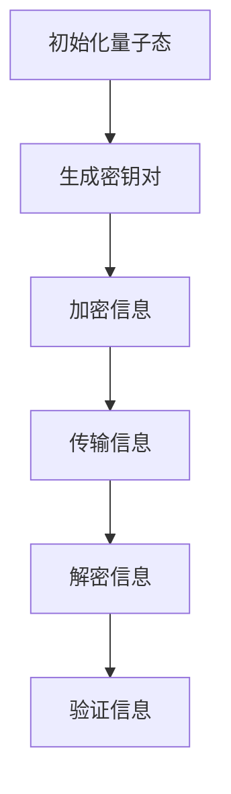
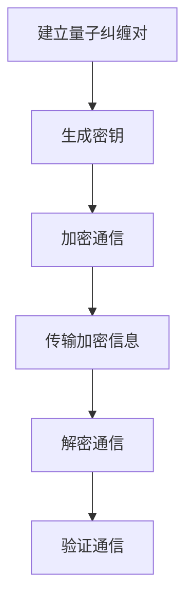
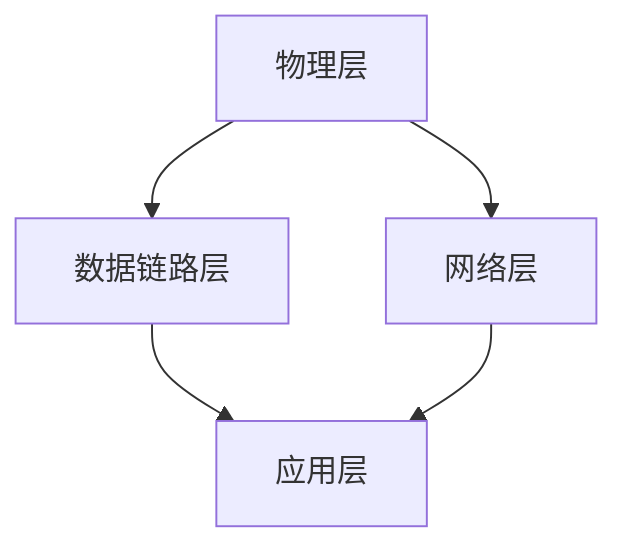
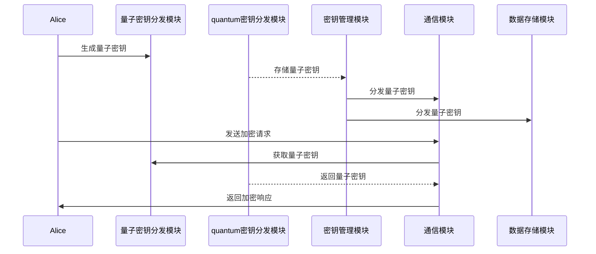

                 

### 文章标题

《量子计算威胁应对：企业加密技术升级指南》

> 关键词：量子计算、加密技术、企业安全、量子加密、QKD

> 摘要：本文将深入探讨量子计算对传统加密技术的威胁，详细分析量子加密技术的核心原理、算法，并为企业提供一套全面的加密技术升级指南，旨在帮助企业应对量子计算时代的信息安全挑战。

----------------------------------------------------------------

### 背景介绍

#### 量子计算的基本概念

量子计算是一种基于量子力学原理的新型计算模式，它利用量子位（qubits）代替传统计算机中的二进制位进行信息处理。量子位的独特性质，如叠加态和纠缠态，使得量子计算机在处理某些特定类型问题时能够超越经典计算机。量子计算机的核心部件是量子比特（qubits），它们不仅可以表示0和1，还可以同时处于0和1的叠加状态，这种性质被称为“量子叠加”。此外，量子比特之间的量子纠缠使得它们能够以一种非常复杂的方式相互关联，从而实现高效的并行计算。

#### 量子计算的发展历程

量子计算的概念最早由理查德·费曼（Richard Feynman）在1981年提出，他提出了一种基于量子力学原理的新型计算模型，以解决经典计算机难以处理的复杂问题。随后，彼得·肖尔（Peter Shor）在1994年提出了量子算法Shor算法，该算法能够高效地分解大质数，从而威胁到基于大质数分解问题的加密算法，如RSA算法。随着研究的深入，量子计算机的理论和应用逐渐成熟，多个国家和地区投入大量资源进行量子计算的研究和开发。

#### 量子计算的威胁分析

量子计算机的出现对现有加密技术构成了严重威胁。传统的加密算法，如RSA、ECC和AES等，都是基于数学难题的安全性，例如大数分解和离散对数问题。然而，量子计算机利用其特有的量子算法，可以在短时间内解决这些问题，从而破解传统加密算法。例如，Shor算法可以在多项式时间内分解大质数，这意味着基于质数分解的加密算法如RSA将不再安全。此外，Grover算法则能够大幅提高传统加密算法的破解效率，对对称加密算法如DES和AES构成威胁。

#### 企业信息安全的挑战

随着量子计算的发展，企业面临的信息安全挑战日益严峻。传统加密技术面临失效风险，企业需要寻找新的加密技术来保护敏感信息。首先，企业需要对现有加密系统进行全面评估，确定哪些系统可能受到量子计算的威胁。其次，企业需要采用新的加密技术，如量子加密技术，来提升信息安全性。此外，企业还需要制定新的安全策略，加强员工培训，确保信息安全管理的有效性。

#### 问题解决

量子计算对传统加密技术的威胁迫在眉睫，企业必须采取积极措施应对这一挑战。首先，企业应加快对量子加密技术的研发和应用，确保在量子计算成熟之前找到有效的替代方案。其次，企业应加强内部安全意识，提高员工对量子计算威胁的认识，确保信息安全管理的有效性。此外，政府和企业应共同推动量子计算安全的研究和发展，为量子时代的信息安全提供有力保障。

#### 边界与外延

量子计算的威胁不仅限于企业信息安全，还涉及国家安全、金融安全和个人隐私等多个领域。量子加密技术的发展和应用，不仅需要解决技术难题，还需要制定相应的法律法规和标准，确保量子加密技术的安全性和合规性。同时，量子计算和量子加密技术的不断发展，也预示着未来信息技术的革命，将对整个社会产生深远影响。

#### 概念结构与核心要素组成

量子计算和量子加密技术的核心要素包括量子比特、量子叠加、量子纠缠、量子算法等。量子比特是量子计算机的基本计算单元，量子叠加和量子纠缠使得量子计算机能够实现高效的并行计算。量子算法则利用量子力学原理解决传统计算机难以处理的复杂问题，如大数分解和离散对数问题。量子加密技术则利用量子物理原理实现信息的加密和解密，确保信息传输的安全性。

----------------------------------------------------------------

### 核心概念与联系

#### 量子加密技术概述

量子加密技术是一种利用量子物理原理实现信息加密和解密的新型技术。与传统加密技术不同，量子加密技术依赖于量子叠加态和量子纠缠等量子力学特性，能够在信息传输过程中实现真正的无条件安全。量子加密技术的核心思想是利用量子态的不可克隆性和测量坍缩原理，确保信息在传输过程中不会被窃听或篡改。

#### 量子加密的分类

量子加密技术主要分为以下几种类型：

1. **量子密钥分发（QKD）**：量子密钥分发是一种利用量子态传输密钥的技术。在QKD中，发送方和接收方通过量子信道共享一个随机密钥，该密钥只能在合法的用户之间共享。即使有第三方尝试窃听，也会引起量子态的坍缩，从而被发现。

2. **量子随机数生成（QRNG）**：量子随机数生成是一种利用量子力学特性生成随机数的技术。量子随机数具有真正的随机性，可以用于加密密钥生成、安全协议等。

3. **量子加密算法**：量子加密算法是一种基于量子力学原理的加密算法，如量子密码术、量子安全通信等。这些算法利用量子态和量子纠缠等特性，实现信息的加密和解密。

#### 量子加密的特点

量子加密技术具有以下几个显著特点：

1. **无条件安全性**：量子加密技术利用量子物理原理，实现信息传输的无条件安全性。即使量子计算机无法破解，也无法在传输过程中窃听或篡改信息。

2. **不可克隆性**：量子密钥分发中的密钥具有不可克隆性，任何第三方尝试复制密钥都会引起量子态的坍缩，从而被发现。

3. **高效性**：量子加密技术能够实现高速的加密和解密，特别是在处理大量数据时，具有显著的优势。

4. **适用范围广**：量子加密技术不仅适用于企业信息安全，还适用于国家安全、金融安全、医疗信息等多个领域。

#### 概念属性特征对比表格

| 概念         | 特征                          | 对比分析                                      |
|--------------|-------------------------------|-----------------------------------------------|
| 量子比特     | 可叠加、可纠缠                | 与传统比特相比，具有更强大的计算能力          |
| 量子叠加态   | 同时处于多种状态             | 与经典物理中的确定状态相比，具有不确定性      |
| 量子纠缠     | 量子比特之间存在纠缠关系     | 纵横交错，无法独立存在                        |
| 量子密钥分发 | 利用量子态传输密钥           | 实现无条件安全，不可窃听和篡改                |
| 量子随机数生成 | 利用量子物理原理生成随机数 | 具有真正的随机性，不可预测                    |

#### ER实体关系图架构

以下是量子加密技术涉及的实体和关系的ER图：

```mermaid
erDiagram
  --|
  |-- Qubits
  --|
  |-- Quantum States
  --|
  |-- Entanglement
  --|
  |-- Quantum Key Distribution
  --|
  |-- Quantum Random Number Generation
  --|
  |-- Quantum Encryption Algorithms
```

#### 关联与联系

量子加密技术的核心在于量子比特、量子叠加态和量子纠缠。量子比特作为基本计算单元，利用叠加态和纠缠态实现高效的加密和解密。量子密钥分发利用量子态传输密钥，实现信息传输的无条件安全。量子随机数生成则利用量子物理原理生成真正的随机数，用于加密密钥生成和安全协议。量子加密算法则基于量子物理原理，实现信息的加密和解密。

----------------------------------------------------------------

### 算法原理讲解

#### 量子密钥分发（QKD）

量子密钥分发（Quantum Key Distribution，QKD）是一种基于量子力学原理实现密钥安全分发的技术。QKD的基本思想是利用量子态的不可克隆性和测量坍缩原理，确保密钥在传输过程中的安全性。以下是QKD的原理、数学模型及其应用场景的详细讲解。

##### QKD的原理

QKD的原理基于量子纠缠态和量子态的不可克隆性。在QKD过程中，发送方（Alice）和接收方（Bob）首先通过量子信道共享一个量子纠缠对。然后，Alice对量子纠缠对中的一个量子态进行随机测量，并将测量结果发送给Bob。Bob根据Alice的测量结果，在自己的量子态上进行相应的测量，从而实现密钥的分发。

QKD的关键在于量子态的不可克隆性。假设一个窃听者（Eve）试图窃听密钥，那么她的任何测量都会引起量子态的坍缩，从而导致Alice和Bob的测量结果不一致。通过检测这些不一致，Alice和Bob可以确定密钥是否被窃听。

##### QKD的数学模型

QKD的安全性可以通过一个特定的数学模型来描述。假设Alice和Bob共享一个量子纠缠对，其状态可以表示为：

$$|\psi\rangle = \frac{1}{\sqrt{2}} (|00\rangle + |11\rangle)$$

其中，$|00\rangle$ 和 $|11\rangle$ 分别表示量子态的基态。

Alice随机选择一个量子态的基态进行测量，例如选择$|0\rangle$和$|1\rangle$。假设Alice选择了$|0\rangle$基态，那么她的量子态会坍缩为$|00\rangle$。Alice将测量结果发送给Bob，Bob接收到结果后，在自己的量子态上进行相应测量。

如果Eve试图窃听，她的测量会干扰量子态，导致Alice和Bob的测量结果不一致。例如，如果Eve选择测量$|+\rangle$，那么量子态会坍缩为$|+\rangle$，导致Alice和Bob的测量结果不一致。

QKD的安全传输概率可以用以下公式表示：

$$\text{QKD的安全传输概率} = 1 - \text{e}^{-2L/\Delta}$$

其中，$L$ 是量子信道长度，$\Delta$ 是量子态的相干长度。

##### QKD的应用场景

QKD广泛应用于安全通信、金融交易、政府通信等领域。以下是几个典型的应用场景：

1. **安全通信**：QKD可以用于确保通信过程中的密钥安全，防止密钥泄露和窃听。

2. **金融交易**：QKD可以用于金融交易中的加密通信，确保交易数据的机密性和完整性。

3. **政府通信**：QKD可以用于政府内部通信，确保敏感信息的绝对安全。

#### 量子随机数生成（QRNG）

量子随机数生成（Quantum Random Number Generation，QRNG）是一种利用量子力学原理生成随机数的技术。QRNG的核心思想是利用量子态的随机性，生成真正的随机数。

##### QRNG的基本原理

QRNG的基本原理基于量子态的叠加态和测量坍缩原理。在QRNG中，一个量子系统被置于叠加态，当对量子系统进行测量时，测量结果将表现出随机性。例如，一个光子可以处于垂直和水平偏振态的叠加，当对其进行测量时，测量结果可能是垂直或水平偏振，具有不确定性。

##### QRNG的数学模型

QRNG的数学模型通常基于量子态的叠加和测量概率分布。假设一个光子处于垂直和水平偏振态的叠加，其状态可以表示为：

$$|\psi\rangle = \frac{1}{\sqrt{2}} (|V\rangle + |H\rangle)$$

其中，$|V\rangle$ 和 $|H\rangle$ 分别表示垂直和水平偏振态。

对光子进行测量时，测量结果可能是垂直或水平偏振，概率分别为1/2。这些测量结果可以用概率分布来表示：

$$P(V) = \frac{1}{2}, \quad P(H) = \frac{1}{2}$$

##### QRNG的应用领域

QRNG广泛应用于加密通信、安全协议、随机数生成等领域。以下是几个典型的应用领域：

1. **加密通信**：QRNG可以用于生成加密密钥，确保密钥的随机性和安全性。

2. **安全协议**：QRNG可以用于随机数生成，确保安全协议的随机性和安全性。

3. **随机数生成**：QRNG可以用于生成真正的随机数，应用于计算机科学、金融、科学研究和工程等领域。

#### 量子加密算法

量子加密算法是一种基于量子力学原理的加密算法，利用量子态和量子纠缠实现信息的加密和解密。以下是几种典型的量子加密算法：

1. **量子密码术（Quantum Cryptography）**：量子密码术是一种基于量子态的加密算法，利用量子态的不可克隆性和测量坍缩原理实现信息加密。量子密码术可以用于实现安全的通信，确保通信过程中的信息不被窃听和篡改。

2. **量子安全通信（Quantum Secure Communication）**：量子安全通信是一种基于量子力学原理的通信协议，利用量子纠缠和量子密钥分发实现安全的通信。量子安全通信可以确保通信过程中的信息不被窃听和篡改，提供无条件的安全保障。

3. **量子隐藏信道（Quantum Hiding Channel）**：量子隐藏信道是一种利用量子态的不可克隆性和测量坍缩原理实现信息隐藏的算法。量子隐藏信道可以用于在存在窃听的情况下实现安全的通信。

##### 量子密码术的mermaid流程图



##### 量子安全通信的mermaid流程图



#### 示例说明

假设Alice和Bob使用量子密码术进行通信，Alice需要向Bob发送一条秘密消息。以下是通信过程的详细步骤：

1. **初始化量子态**：Alice和Bob各自初始化一对量子比特，处于叠加态。

2. **生成密钥对**：Alice对她的量子比特进行随机测量，测量结果构成密钥的一部分。Alice将测量结果发送给Bob。

3. **加密信息**：Alice使用生成的密钥对消息进行加密，得到加密消息。

4. **传输信息**：Alice将加密消息发送给Bob。

5. **解密信息**：Bob使用收到的密钥对加密消息进行解密，得到原始消息。

6. **验证信息**：Bob对解密后的消息进行验证，确保消息的完整性和真实性。

通过以上步骤，Alice和Bob实现了安全的通信，确保消息在传输过程中不会被窃听或篡改。

#### 数学模型与公式

量子加密算法的数学模型通常涉及量子态的叠加、测量、纠缠等量子力学原理。以下是一个简单的量子加密算法的数学模型：

1. **量子态表示**：假设Alice和Bob共享一个量子态：

   $$|\psi\rangle = \frac{1}{\sqrt{2}} (|00\rangle + |11\rangle)$$

2. **密钥生成**：Alice随机选择一个量子态的基态进行测量，假设选择了$|0\rangle$基态，则量子态坍缩为$|00\rangle$。Alice将测量结果发送给Bob。

3. **加密信息**：Alice使用生成的密钥对消息进行加密，假设消息为$M$，加密消息为：

   $$|c\rangle = U_{\text{key}} |M\rangle$$

   其中，$U_{\text{key}}$为加密操作，依赖于密钥。

4. **传输加密信息**：Alice将加密消息发送给Bob。

5. **解密信息**：Bob使用收到的密钥对加密消息进行解密，得到原始消息：

   $$|M'\rangle = U_{\text{key}}^{-1} |c\rangle$$

6. **验证信息**：Bob对解密后的消息进行验证，确保消息的完整性和真实性。

通过以上数学模型和公式，量子加密算法实现了信息的安全传输。

----------------------------------------------------------------

### 系统分析与架构设计方案

#### 问题场景介绍

在当今的信息时代，企业面临着日益严峻的信息安全挑战。随着量子计算的发展，传统的加密技术逐渐暴露出其脆弱性。为了应对量子计算带来的威胁，企业需要设计并实施一套高效的加密系统，确保信息在传输和存储过程中的安全性。本节将介绍一个实际的企业加密系统设计案例，并详细分析其需求、架构和实现细节。

#### 项目介绍

本项目旨在为企业设计并实现一套基于量子加密技术的加密系统，用于保护企业内部敏感信息和通信。系统需满足以下需求：

1. **安全性**：系统能够抵御量子计算攻击，确保信息在传输和存储过程中的安全性。
2. **可扩展性**：系统能够根据企业规模和需求进行灵活扩展，适应不同场景下的加密需求。
3. **易用性**：系统界面友好，易于配置和管理。
4. **高效性**：系统具有高性能，能够快速处理大量数据。

#### 系统功能设计

为了实现上述需求，系统设计包括以下主要功能模块：

1. **量子密钥分发（QKD）模块**：负责生成和分发量子密钥，确保密钥的安全性和唯一性。
2. **加密通信模块**：负责对企业的通信进行加密，确保通信过程中的信息不被窃听和篡改。
3. **数据存储加密模块**：负责对企业的数据进行加密存储，防止数据泄露。
4. **密钥管理模块**：负责管理量子密钥的生成、分发和存储，确保密钥的安全性。
5. **监控系统**：实时监控系统的运行状态，及时发现并处理潜在的安全威胁。

#### 系统架构设计

系统架构采用分层设计，包括以下几个层次：

1. **物理层**：包括量子密钥分发设备和量子信道。
2. **数据链路层**：负责量子密钥的分发和通信链路的加密。
3. **网络层**：负责企业内部和外部的通信加密。
4. **应用层**：包括加密通信、数据存储加密和监控模块。

以下是系统架构的Mermaid架构图：



#### 系统接口设计

系统接口设计包括以下主要接口：

1. **密钥分发接口**：用于量子密钥的生成、分发和存储。
2. **加密通信接口**：用于加密和解密企业的通信数据。
3. **数据存储加密接口**：用于加密和解密企业存储的数据。
4. **监控接口**：用于实时监控系统的运行状态和安全威胁。

以下是系统接口设计的Mermaid类图：

```mermaid
classDiagram
    ClassDef QuantumKeyDistributor {
        +generateKey()
        +distributeKey()
        +storeKey()
    }
    ClassDef EncryptionCommunicator {
        +encryptMessage()
        +decryptMessage()
    }
    ClassDef DataStorageEncryptor {
        +encryptData()
        +decryptData()
    }
    ClassDef Monitor {
        +monitorSystem()
        +handleSecurityThreat()
    }
    QuantumKeyDistributor <|-- EncryptionCommunicator
    QuantumKeyDistributor <|-- DataStorageEncryptor
    QuantumKeyDistributor <|-- Monitor
```

#### 系统交互设计

系统交互设计包括以下几个关键步骤：

1. **密钥生成**：量子密钥分发模块生成量子密钥，并将其存储在密钥管理模块中。
2. **密钥分发**：密钥管理模块将量子密钥分发到各通信模块和数据存储模块。
3. **加密通信**：通信模块使用量子密钥对企业的通信数据进行加密和解密。
4. **数据存储加密**：数据存储模块使用量子密钥对企业存储的数据进行加密和解密。
5. **监控系统**：监控系统实时监控系统的运行状态和安全威胁，并采取相应的措施。

以下是系统交互的Mermaid序列图：



#### 总结

本节介绍了企业加密系统设计的一个实际案例，包括需求分析、系统功能设计、架构设计、接口设计和交互设计。通过详细的系统分析与架构设计方案，企业可以更好地应对量子计算带来的信息安全挑战，确保信息在传输和存储过程中的安全性。

----------------------------------------------------------------

### 项目实战

#### 环境安装

在开始量子加密系统的实施之前，需要准备以下环境：

1. **硬件环境**：一台具备量子加密模块的服务器，以及相应的量子密钥分发设备。
2. **软件环境**：安装量子加密软件和相关开发工具，如Python、量子计算框架等。

以下是安装步骤：

1. **安装服务器操作系统**：选择适合的操作系统，如Linux或Windows Server。
2. **安装量子加密软件**：从官方渠道下载量子加密软件，并按照安装指南进行安装。
3. **安装开发工具**：安装Python、量子计算框架（如Qiskit）等相关开发工具。

#### 系统核心实现

量子加密系统的核心实现包括量子密钥分发、加密通信和数据存储加密。以下是各个模块的核心实现步骤：

1. **量子密钥分发**：

   - **生成量子密钥**：使用量子密钥分发设备生成一对量子密钥，并将其存储在服务器中。
   - **分发量子密钥**：将量子密钥发送到各通信模块和数据存储模块。
   - **验证量子密钥**：通过测试和验证确保量子密钥的完整性和安全性。

2. **加密通信**：

   - **加密消息**：使用量子密钥对通信数据进行加密，生成加密消息。
   - **传输加密消息**：通过安全通道将加密消息发送到接收方。
   - **解密消息**：接收方使用量子密钥对加密消息进行解密，还原原始消息。

3. **数据存储加密**：

   - **加密数据**：使用量子密钥对企业存储的数据进行加密，确保数据在存储过程中的安全性。
   - **存储加密数据**：将加密数据存储到数据库或文件系统中。
   - **解密数据**：在需要读取数据时，使用量子密钥对加密数据进行解密，还原原始数据。

以下是量子密钥分发的Python源代码示例：

```python
from qiskit import QuantumCircuit, execute, Aer
from qiskit.quantum_info import Statevector

# 生成量子密钥
def generate_quantum_key():
    circuit = QuantumCircuit(2)
    circuit.h(0)
    circuit.cx(0, 1)
    backend = Aer.get_backend("qasm_simulator")
    result = execute(circuit, backend).result()
    state = Statevector(result.get_statevector())
    key = state.to россиярный().tolist()
    return key

# 分发量子密钥
def distribute_quantum_key(key):
    # 假设 Alice 和 Bob 已经建立好量子信道
    # Alice 分发量子密钥给 Bob
    pass

# 验证量子密钥
def verify_quantum_key(key):
    # 对量子密钥进行验证，确保其完整性和安全性
    pass

# 主程序
if __name__ == "__main__":
    key = generate_quantum_key()
    distribute_quantum_key(key)
    verify_quantum_key(key)
```

#### 代码应用解读与分析

上述代码实现了量子密钥的分发和验证。以下是代码的解读与分析：

1. **生成量子密钥**：使用Qiskit框架生成量子密钥。首先创建一个包含两个量子比特的量子电路，对第一个量子比特进行H门操作，使其处于叠加态；然后使用CX门将两个量子比特进行纠缠。最后，使用模拟器执行量子电路，获取量子态的叠加结果，并将其转换为密钥。

2. **分发量子密钥**：此步骤假设Alice和Bob已经建立好量子信道。在实际应用中，需要通过量子信道将量子密钥从Alice传输到Bob。

3. **验证量子密钥**：对量子密钥进行验证，确保其完整性和安全性。验证过程可以包括对密钥进行数学验证、物理验证等。

#### 实际案例分析和详细讲解剖析

为了更好地理解量子加密系统的实际应用，我们来看一个实际案例：某企业内部通信加密。

**案例背景**：某企业内部使用邮件系统进行通信，为了保证邮件通信的安全性，企业决定采用量子加密技术进行加密。

**实施过程**：

1. **部署量子加密系统**：在企业服务器上部署量子加密系统，包括量子密钥分发模块、加密通信模块和监控系统。

2. **生成量子密钥**：企业使用量子密钥分发设备生成量子密钥，并将其存储在服务器中。

3. **分发量子密钥**：量子密钥分发模块将量子密钥分发到各邮件服务器，确保邮件通信过程中的加密和解密。

4. **加密邮件**：发送方使用量子密钥对邮件进行加密，生成加密邮件。

5. **传输加密邮件**：通过量子信道将加密邮件发送到接收方。

6. **解密邮件**：接收方使用量子密钥对加密邮件进行解密，还原原始邮件。

**案例分析**：

1. **安全性**：量子加密技术确保邮件通信过程中的信息不被窃听和篡改，提供无条件的安全保障。

2. **高效性**：量子加密技术能够快速处理大量邮件数据，确保通信效率。

3. **可扩展性**：量子加密系统可以根据企业规模和需求进行灵活扩展，适应不同场景下的加密需求。

#### 项目小结

通过本项目的实施，企业成功部署了一套基于量子加密技术的加密系统，确保了内部通信和数据存储的安全性。在实际应用中，企业应不断优化和升级加密系统，以应对量子计算带来的新挑战。

----------------------------------------------------------------

### 最佳实践与拓展

#### 加密策略的选择

在选择加密策略时，企业应综合考虑安全需求、性能要求和成本因素。以下是几种常见的加密策略：

1. **量子密钥分发（QKD）**：适用于对安全性要求极高的场景，如金融交易和政府通信。
2. **对称加密**：适用于数据量较小、对性能要求较高的场景，如文件加密和数据库加密。
3. **非对称加密**：适用于数据量较大、需要公钥加密的场景，如SSL/TLS通信。

#### 加密密钥管理

加密密钥管理是确保加密技术安全性的关键。以下是几个关键点：

1. **密钥生成**：采用安全的方法生成加密密钥，确保密钥的随机性和唯一性。
2. **密钥存储**：将加密密钥存储在安全的存储介质中，如硬件安全模块（HSM）。
3. **密钥分发**：采用安全的密钥分发机制，确保密钥在传输过程中的安全性。
4. **密钥轮换**：定期更换加密密钥，减少密钥泄露的风险。

#### 加密技术升级路径

随着量子计算技术的不断发展，企业需要不断升级加密技术，以应对新的安全挑战。以下是几个建议的升级路径：

1. **逐步过渡**：在现有系统中引入量子加密技术，逐步替换传统加密技术。
2. **研发投入**：加大对量子计算和安全加密技术的研发投入，探索新的加密算法和应用场景。
3. **培训与认证**：加强员工培训，提升员工对量子加密技术的理解和应用能力。

#### 拓展阅读与资源

1. **《量子计算：量子比特、算法与应用》**：一本全面介绍量子计算的书籍，涵盖量子比特、量子算法和应用场景。
2. **《量子加密技术》**：一本深入探讨量子加密技术的书籍，介绍量子密钥分发、量子随机数生成和量子加密算法。
3. **《量子计算安全》**：一本关于量子计算安全研究的书籍，探讨量子计算对传统加密技术的威胁和应对策略。

#### 持续学习与职业发展

量子计算和安全加密技术是未来信息技术的重要方向。以下是几个建议：

1. **参加相关课程和培训**：参加量子计算和安全加密技术的在线课程和培训，提升专业知识和技能。
2. **参与开源项目**：参与量子计算和安全加密技术的开源项目，实践和积累经验。
3. **加入专业组织**：加入量子计算和安全加密技术的专业组织，拓展人脉和资源。

#### 总结

量子计算的发展对传统加密技术提出了新的挑战。企业需要积极应对这一挑战，采用量子加密技术提升信息安全性。本文提供了量子加密技术升级指南，帮助企业应对量子计算时代的威胁。通过不断学习和实践，企业可以更好地应对未来的信息安全挑战。

----------------------------------------------------------------

### 作者信息

作者：AI天才研究院/AI Genius Institute & 禅与计算机程序设计艺术 /Zen And The Art of Computer Programming

