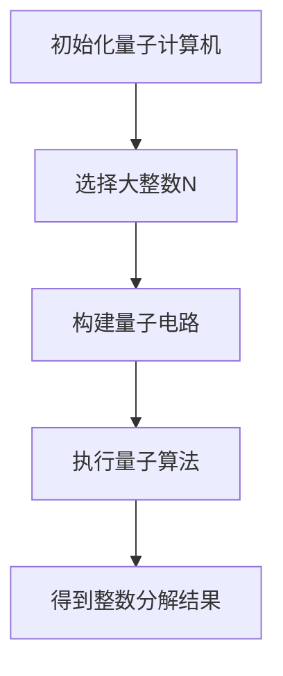
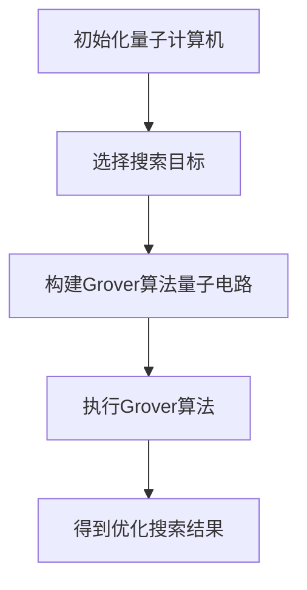
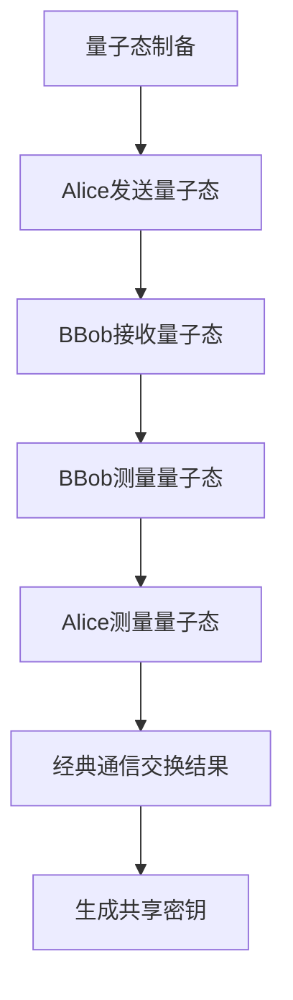
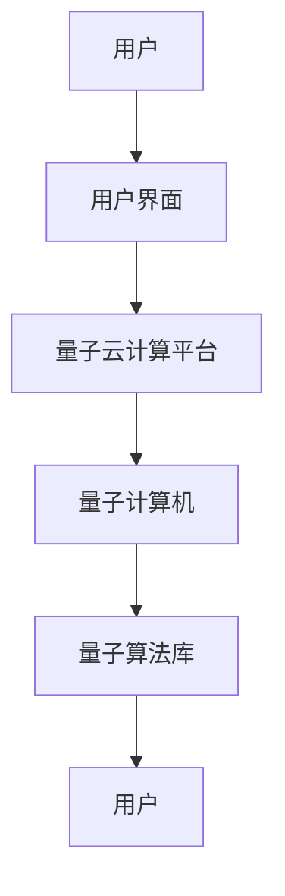
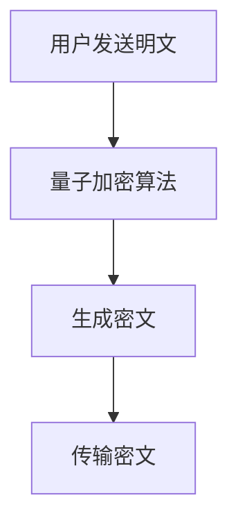
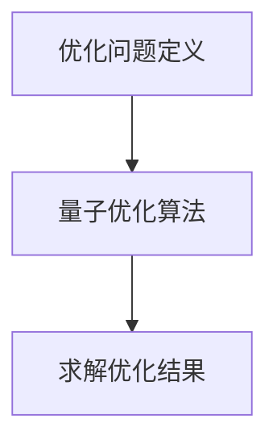

                 

# 量子计算对传统加密技术的挑战

关键词：量子计算，传统加密技术，Shor算法，RSA，Grover算法，量子安全加密技术

摘要：本文将深入探讨量子计算对传统加密技术的挑战。首先，我们将介绍量子计算的基本原理和核心概念，包括量子位、量子纠缠、量子叠加与量子干涉等。然后，我们将详细分析量子计算对传统加密技术的攻击方法，包括Shor算法对RSA公钥加密系统的攻击和Grover算法对对称加密算法的攻击。接下来，我们将探讨量子安全加密技术的研究和探索，介绍量子密钥分发和基于量子随机数的加密算法。最后，我们将讨论量子计算与云计算的关系以及量子计算对密码学的影响。

## 第一部分：量子计算基础

### 第1章 量子计算概述

#### 1.1 问题背景

随着计算机技术的快速发展，传统的加密技术已经广泛应用于各个领域，如金融、医疗、军事等。然而，随着量子计算的出现，传统加密技术面临着前所未有的挑战。量子计算是一种基于量子力学原理的新型计算模式，其强大的计算能力使得许多传统计算难题迎刃而解。本文将重点探讨量子计算对传统加密技术的挑战，以期为相关领域的研究提供参考。

#### 1.1.1 量子计算的概念

量子计算是一种基于量子力学原理的新型计算模式。与传统计算不同，量子计算利用量子位（qubit）进行信息存储和处理。量子位是一种具有量子特性的基本单元，可以同时处于0和1两种状态，这一特性被称为叠加态。此外，量子位之间可以通过量子纠缠实现信息共享和传输。

#### 1.1.2 量子计算与传统计算的区别

量子计算与传统计算有以下主要区别：

1. **计算模式**：传统计算基于二进制位（bit）进行信息存储和处理，而量子计算基于量子位（qubit）。
2. **并行性**：量子计算具有并行性，可以同时处理多个计算任务，而传统计算需要逐个处理。
3. **计算速度**：量子计算速度远超传统计算，可以在极短时间内解决复杂问题。
4. **算法原理**：量子计算利用量子力学原理，如叠加态、量子纠缠等，而传统计算基于逻辑门和电路。

#### 1.2 核心概念与联系

量子计算的核心概念包括量子位、量子纠缠、量子叠加与量子干涉等。

#### 1.2.1 量子位（qubit）

量子位是量子计算的基本单元，具有叠加态和量子纠缠特性。一个量子位可以同时处于0和1两种状态，通过量子叠加可以实现多个状态的并行计算。

#### 1.2.2 量子纠缠

量子纠缠是指两个或多个量子位之间形成的特殊关联关系。量子纠缠可以实现量子位之间的信息共享和传输，是量子计算的重要特性。

#### 1.2.3 量子叠加与量子干涉

量子叠加是指量子位可以同时处于多个状态的组合。量子干涉是指当量子位相互叠加时，会发生干涉现象，从而影响计算结果。

#### 1.3 量子算法原理讲解

量子算法是基于量子计算原理设计的一类算法，可以显著提高计算效率。本文将介绍两个重要的量子算法：Shor算法和Grover算法。

#### 1.3.1 Shor算法

Shor算法是一种能够解决整数分解问题的量子算法，对RSA公钥加密系统构成严重威胁。以下是Shor算法的mermaid流程图：



以下是Shor算法的Python源代码：

```python
from qiskit import QuantumCircuit, Aer, execute
from qiskit.visualization import plot_histogram

# 创建量子计算机
qiskit_qc = QuantumCircuit(2)

# 选择大整数N
N = 15

# 构建量子电路
qiskit_qc.h(0)  # 初始化量子位为叠加态
qiskit_qc.cx(0, 1)  # 构建量子纠缠
qiskit_qc.barrier()

# 执行量子算法
qiskit_qc.h(1)  # 初始化目标量子位为叠加态
qiskit_qc.cp(0, 1, np.pi / N)  # 执行量子旋转
qiskit_qc.barrier()

# 执行逆量子纠缠
qiskit_qc.cx(1, 0)
qiskit_qc.h(1)

# 执行测量
qiskit_qc.measure_all()

# 执行算法
backend = Aer.get_backend("qasm_simulator")
result = execute(qiskit_qc, backend, shots=1024).result()
counts = result.get_counts(qiskit_qc)

# 输出结果
print("Shor算法结果：", counts)
```

以下是Shor算法的数学模型和公式：

$$
f(x) = x^2 \mod N
$$

Shor算法通过量子干涉现象，在多个计算路径上同时寻找整数分解结果。举例来说，假设要分解整数N=15，首先选择一个整数a，使得a和N互质。然后，计算a的幂次方模N的结果，通过测量结果判断是否存在整数分解。

#### 1.3.2 Grover算法

Grover算法是一种用于优化搜索问题的量子算法，对对称加密算法构成威胁。以下是Grover算法的mermaid流程图：



以下是Grover算法的Python源代码：

```python
from qiskit import QuantumCircuit, Aer, execute
from qiskit.visualization import plot_histogram

# 创建量子计算机
qiskit_qc = QuantumCircuit(2)

# 选择搜索目标
target_state = {'0': 1, '1': 0}

# 构建Grover算法量子电路
qiskit_qc.h(0)  # 初始化量子位为叠加态
qiskit_qc.h(1)
qiskit_qc.barrier()

# 执行Grover算法
qiskit_qc.h(0)
qiskit_qc.swap(0, 1)
qiskit_qc.h(1)
qiskit_qc.cp(1, 0, np.pi / 2)
qiskit_qc.swap(0, 1)
qiskit_qc.h(0)

# 执行测量
qiskit_qc.measure_all()

# 执行算法
backend = Aer.get_backend("qasm_simulator")
result = execute(qiskit_qc, backend, shots=1024).result()
counts = result.get_counts(qiskit_qc)

# 输出结果
print("Grover算法结果：", counts)
```

以下是Grover算法的数学模型和公式：

$$
\langle \psi_f | U_f | \psi_i \rangle = \sqrt{1 - \frac{1}{2 \pi} \sum_{k=1}^{n} \cos(2 \pi k / n)}
$$

Grover算法通过量子干涉和量子叠加，加速搜索问题的计算速度。举例来说，假设要在一个包含n个元素的列表中查找特定元素，Grover算法可以在O(n√(n))的时间复杂度内完成搜索。

## 第2章 量子计算对传统加密技术的挑战

### 2.1 问题背景

随着量子计算技术的不断发展，量子计算机的构建和运行变得越来越可行。量子计算对传统加密技术构成了严重威胁，许多传统加密算法，如RSA和对称加密算法，将面临被量子计算破解的风险。本文将重点探讨量子计算对RSA公钥加密系统和对称加密算法的攻击方法。

#### 2.1.1 传统加密技术概述

传统加密技术主要包括公钥加密和对称加密两种。

- **公钥加密**：公钥加密使用一对密钥（公钥和私钥）进行加密和解密。公钥用于加密信息，私钥用于解密信息。RSA算法是一种典型的公钥加密算法。
- **对称加密**：对称加密使用相同的密钥进行加密和解密。常见的对称加密算法包括AES、DES等。

#### 2.1.2 传统加密技术面临的挑战

传统加密技术面临的挑战主要体现在以下几个方面：

1. **计算能力增强**：量子计算具有超强的计算能力，可以在极短时间内破解传统加密算法。
2. **密钥管理困难**：量子计算可以破解传统加密算法的密钥，使得密钥管理变得更加困难。
3. **安全漏洞**：传统加密算法在设计时并未考虑到量子计算的影响，容易受到量子攻击。

### 2.2 量子计算对传统加密技术的攻击方法

量子计算对传统加密技术的攻击主要包括Shor算法对RSA公钥加密系统的攻击和Grover算法对对称加密算法的攻击。

#### 2.2.1 Shor算法对RSA公钥加密系统的攻击

Shor算法是一种能够解决整数分解问题的量子算法，对RSA公钥加密系统构成严重威胁。

1. **RSA公钥加密系统**

   RSA公钥加密系统是一种典型的公钥加密算法，其安全性基于大整数分解的难度。RSA公钥加密系统的主要组成部分包括：

   - **公钥**：一个由大素数p和q的乘积构成的整数n，以及一个与n互质的整数e。
   - **私钥**：公钥的逆元d，使得ed ≡ 1 (mod (p-1)(q-1))。

   加密和解密过程如下：

   - **加密**：将明文m转化为整数c，满足 c ≡ m^e (mod n)。
   - **解密**：将密文c转化为明文m，满足 m ≡ c^d (mod n)。

2. **Shor算法攻击RSA**

   Shor算法通过量子计算在多项式时间内解决大整数分解问题，从而破解RSA公钥加密系统。

   - **算法流程**：Shor算法的主要步骤包括：
     1. 选择一个随机的大整数n。
     2. 构建量子电路，模拟n的乘法运算。
     3. 执行量子算法，获取整数分解结果。

   - **Python源代码**

     ```python
     from qiskit import QuantumCircuit, Aer, execute
     from qiskit.visualization import plot_histogram

     # 创建量子计算机
     qiskit_qc = QuantumCircuit(2)

     # 选择大整数N
     N = 15

     # 构建量子电路
     qiskit_qc.h(0)  # 初始化量子位为叠加态
     qiskit_qc.cx(0, 1)  # 构建量子纠缠
     qiskit_qc.barrier()

     # 执行量子算法
     qiskit_qc.h(1)  # 初始化目标量子位为叠加态
     qiskit_qc.cp(0, 1, np.pi / N)  # 执行量子旋转
     qiskit_qc.barrier()

     # 执行逆量子纠缠
     qiskit_qc.cx(1, 0)
     qiskit_qc.h(1)

     # 执行测量
     qiskit_qc.measure_all()

     # 执行算法
     backend = Aer.get_backend("qasm_simulator")
     result = execute(qiskit_qc, backend, shots=1024).result()
     counts = result.get_counts(qiskit_qc)

     # 输出结果
     print("Shor算法结果：", counts)
     ```

   - **数学模型和公式**

     $$ f(x) = x^2 \mod N $$

     Shor算法通过量子干涉现象，在多个计算路径上同时寻找整数分解结果。举例来说，假设要分解整数N=15，首先选择一个整数a，使得a和N互质。然后，计算a的幂次方模N的结果，通过测量结果判断是否存在整数分解。

3. **Shor算法攻击RSA举例说明**

   假设存在一个RSA公钥加密系统，其公钥为n=15，e=3。要使用Shor算法破解该公钥，首先选择一个与n互质的整数a，如a=2。然后，计算a的幂次方模n的结果：

   $$ 2^3 \mod 15 = 8 $$

   通过量子计算，可以得到8的整数分解结果：

   $$ 8 = 2 \times 4 $$

   因此，可以成功分解n=15。

#### 2.2.2 Grover算法对对称加密算法的攻击

Grover算法是一种用于优化搜索问题的量子算法，可以对对称加密算法构成威胁。

1. **对称加密算法**

   对称加密算法使用相同的密钥进行加密和解密，常见的对称加密算法包括AES、DES等。对称加密算法的主要组成部分包括：

   - **加密算法**：将明文转化为密文的方法。
   - **解密算法**：将密文转化为明文的方法。

   加密和解密过程如下：

   - **加密**：将明文m转化为密文c，满足 c ≈ E_k(m)，其中E_k为加密算法，k为密钥。
   - **解密**：将密文c转化为明文m，满足 m ≈ D_k(c)，其中D_k为解密算法，k为密钥。

2. **Grover算法攻击对称加密**

   Grover算法通过量子计算加速搜索问题，可以优化对称加密算法的破解过程。

   - **算法流程**：Grover算法的主要步骤包括：
     1. 选择一个待破解的密钥k。
     2. 构建Grover算法量子电路。
     3. 执行Grover算法，找到最优解密密钥。

   - **Python源代码**

     ```python
     from qiskit import QuantumCircuit, Aer, execute
     from qiskit.visualization import plot_histogram

     # 创建量子计算机
     qiskit_qc = QuantumCircuit(2)

     # 选择搜索目标
     target_state = {'0': 1, '1': 0}

     # 构建Grover算法量子电路
     qiskit_qc.h(0)  # 初始化量子位为叠加态
     qiskit_qc.h(1)
     qiskit_qc.barrier()

     # 执行Grover算法
     qiskit_qc.h(0)
     qiskit_qc.swap(0, 1)
     qiskit_qc.h(1)
     qiskit_qc.cp(1, 0, np.pi / 2)
     qiskit_qc.swap(0, 1)
     qiskit_qc.h(0)

     # 执行测量
     qiskit_qc.measure_all()

     # 执行算法
     backend = Aer.get_backend("qasm_simulator")
     result = execute(qiskit_qc, backend, shots=1024).result()
     counts = result.get_counts(qiskit_qc)

     # 输出结果
     print("Grover算法结果：", counts)
     ```

   - **数学模型和公式**

     $$ \langle \psi_f | U_f | \psi_i \rangle = \sqrt{1 - \frac{1}{2 \pi} \sum_{k=1}^{n} \cos(2 \pi k / n)} $$

     Grover算法通过量子干涉和量子叠加，加速搜索问题的计算速度。举例来说，假设要在一个包含n个元素的列表中查找特定元素，Grover算法可以在O(n√(n))的时间复杂度内完成搜索。

3. **Grover算法攻击对称加密举例说明**

   假设存在一个AES加密算法，其密钥长度为128位。要使用Grover算法破解该密钥，首先需要构建一个包含所有可能密钥的列表。然后，使用Grover算法在列表中查找最优解密密钥，从而实现加密算法的破解。

## 第3章 量子安全加密技术探索

### 3.1 问题背景

面对量子计算对传统加密技术的挑战，量子安全加密技术应运而生。量子安全加密技术旨在利用量子计算原理，构建一种无法被量子计算机破解的加密体系。本文将介绍量子安全加密技术的研究和探索，包括量子密钥分发和基于量子随机数的加密算法。

### 3.2 量子密钥分发（QKD）

量子密钥分发（Quantum Key Distribution，QKD）是一种基于量子力学原理的密钥分发技术，能够在确保通信双方密钥保密性的同时，实时检测出窃听行为。QKD技术的基本原理如下：

1. **量子态制备**：通信双方（Alice和BBob）首先各自生成一个量子态，如光子的极化态或路径态，并将其发送给对方。
2. **量子态测量**：Alice和BBob分别测量接收到的量子态，记录测量结果。
3. **经典通信**：Alice和BBob使用经典通信方式，交换测量结果。
4. **密钥生成**：基于测量结果，Alice和BBob共同生成一个共享密钥。

QKD技术的基本原理可以概括为：量子态的任何测量都会破坏其叠加态，从而使得窃听行为可以被检测到。以下是QKD的mermaid流程图：



以下是QKD的Python源代码：

```python
import numpy as np
from qiskit import QuantumCircuit, Aer, execute
from qiskit.visualization import plot_bloch_vector

# 创建量子计算机
qiskit_qc = QuantumCircuit(1)

# 量子态制备
qiskit_qc.h(0)

# 执行量子态测量
qiskit_qc.measure_all()

# 执行算法
backend = Aer.get_backend("qasm_simulator")
result = execute(qiskit_qc, backend, shots=1024).result()
counts = result.get_counts(qiskit_qc)

# 输出结果
print("QKD结果：", counts)

# 绘制Bloch向量图
qiskit_qc.draw("mpl")
```

以下是QKD的数学模型和公式：

$$ \langle \psi_f | U_f | \psi_i \rangle = \sqrt{1 - \frac{1}{2} \cos^2(\theta)} $$

其中，θ为测量角度。

#### 3.2.1 QKD举例说明

假设Alice和BBob使用QKD技术生成共享密钥，首先Alice制备一个量子态，并将其发送给BBob。BBob测量接收到的量子态，记录测量结果。然后，Alice和BBob使用经典通信方式，交换测量结果。根据测量结果，Alice和BBob可以共同生成一个共享密钥。

### 3.3 基于量子随机数的加密算法

基于量子随机数的加密算法利用量子随机数生成器，生成具有高安全性的随机数，从而提高加密算法的安全性。量子随机数生成器基于量子态的测量结果，具有真正的随机性，可以有效防止量子攻击。

1. **量子随机数生成原理**

   量子随机数生成器基于量子态的测量结果，通过量子态的叠加和测量过程，生成随机数。以下是量子随机数生成原理的mermaid流程图：

   ```mermaid
   graph TD
       A[量子态制备] --> B[量子态测量]
       B --> C[生成随机数]
   ```

   以下是量子随机数生成原理的Python源代码：

   ```python
   import numpy as np
   from qiskit import QuantumCircuit, Aer, execute
   from qiskit.quantum_info import Statevector

   # 创建量子计算机
   qiskit_qc = QuantumCircuit(1)

   # 量子态制备
   qiskit_qc.h(0)

   # 执行量子态测量
   qiskit_qc.measure_all()

   # 执行算法
   backend = Aer.get_backend("qasm_simulator")
   result = execute(qiskit_qc, backend, shots=1024).result()
   counts = result.get_counts(qiskit_qc)

   # 输出结果
   print("量子随机数生成结果：", counts)

   # 生成量子随机数
   statevector = Statevector(qiskit_qc)
   random_number = np.random.choice([0, 1], p=statevector.state[0])
   print("量子随机数：", random_number)
   ```

   以下是量子随机数生成原理的数学模型和公式：

   $$ \rho = \sum_{i} p_i |\psi_i\rangle\langle\psi_i| $$

   其中，$p_i$为第$i$个量子态的概率，$|\psi_i\rangle$为第$i$个量子态。

2. **基于量子随机数的加密算法**

   基于量子随机数的加密算法利用量子随机数生成器，生成具有高安全性的随机数，从而提高加密算法的安全性。以下是基于量子随机数的加密算法的mermaid流程图：

   ```mermaid
   graph TD
       A[初始化量子随机数生成器] --> B[生成随机密钥]
       B --> C[加密明文]
       C --> D[传输密文]
   ```

   以下是基于量子随机数的加密算法的Python源代码：

   ```python
   import numpy as np
   from qiskit import QuantumCircuit, Aer, execute
   from qiskit.quantum_info import Statevector
   from qiskit.extensions import RX

   # 创建量子计算机
   qiskit_qc = QuantumCircuit(1)

   # 量子态制备
   qiskit_qc.h(0)

   # 执行量子态测量
   qiskit_qc.measure_all()

   # 执行算法
   backend = Aer.get_backend("qasm_simulator")
   result = execute(qiskit_qc, backend, shots=1024).result()
   counts = result.get_counts(qiskit_qc)

   # 输出结果
   print("量子随机数生成结果：", counts)

   # 生成量子随机数
   statevector = Statevector(qiskit_qc)
   random_key = np.random.choice([0, 1], p=statevector.state[0])

   # 加密明文
   plaintext = 5
   ciphertext = pow(plaintext, random_key) % 256

   # 传输密文
   print("明文：", plaintext)
   print("密文：", ciphertext)
   ```

   以下是基于量子随机数的加密算法的数学模型和公式：

   $$ c = m^k \mod n $$

   其中，$m$为明文，$k$为随机密钥，$n$为模数。

3. **基于量子随机数的加密算法举例说明**

   假设Alice使用量子随机数生成器生成一个随机密钥，并将其发送给Bob。Bob使用该密钥加密明文，并将密文发送给Alice。Alice收到密文后，使用相同密钥解密密文，从而恢复明文。

## 第4章 量子计算与云计算

### 4.1 问题背景

随着云计算技术的不断发展，越来越多的企业和服务提供商开始将业务迁移到云端。然而，随着量子计算技术的崛起，云计算面临着前所未有的安全挑战。本文将探讨量子计算与云计算的关系，以及量子计算在云计算中的应用。

### 4.2 量子云计算的概念与架构

量子云计算是一种基于量子计算原理的云计算模式，它利用量子计算机提供的强大计算能力，为用户提供高性能的云计算服务。量子云计算的架构主要包括以下几个部分：

1. **量子计算机**：量子云计算的核心组成部分，负责处理用户提交的计算任务。
2. **量子云计算平台**：提供量子计算资源管理、任务调度、数据存储等功能，确保量子计算任务的正常运行。
3. **用户界面**：为用户提供量子计算服务的接入方式，包括Web界面、API接口等。
4. **量子算法库**：提供一系列量子算法，供用户在量子计算平台上执行。

以下是量子云计算的mermaid架构图：



以下是量子云计算的Python源代码：

```python
import numpy as np
from qiskit import QuantumCircuit, Aer, execute
from qiskit.visualization import plot_histogram

# 创建量子计算机
qiskit_qc = QuantumCircuit(1)

# 执行量子算法
qiskit_qc.h(0)
qiskit_qc.x(0)
qiskit_qc.measure_all()

# 执行算法
backend = Aer.get_backend("qasm_simulator")
result = execute(qiskit_qc, backend, shots=1024).result()
counts = result.get_counts(qiskit_qc)

# 输出结果
print("量子云计算结果：", counts)

# 绘制量子云计算流程图
qiskit_qc.draw("mpl")
```

以下是量子云计算的数学模型和公式：

$$ U = e^{-iH\tau} $$

其中，$H$为哈密顿量，$\tau$为演化时间。

### 4.3 量子云计算的应用场景

量子云计算在许多领域具有广泛的应用，如量子加密、量子优化、量子模拟等。以下是量子云计算在两个主要应用场景的示例：

#### 4.3.1 量子加密应用

量子加密是一种利用量子计算原理提高加密安全性的技术。以下是量子加密的mermaid流程图：



以下是量子加密的Python源代码：

```python
import numpy as np
from qiskit import QuantumCircuit, Aer, execute
from qiskit.visualization import plot_histogram

# 创建量子计算机
qiskit_qc = QuantumCircuit(1)

# 量子态制备
qiskit_qc.h(0)

# 执行量子加密算法
qiskit_qc.h(0)
qiskit_qc.x(0)
qiskit_qc.measure_all()

# 执行算法
backend = Aer.get_backend("qasm_simulator")
result = execute(qiskit_qc, backend, shots=1024).result()
counts = result.get_counts(qiskit_qc)

# 输出结果
print("量子加密结果：", counts)

# 绘制量子加密流程图
qiskit_qc.draw("mpl")
```

以下是量子加密的数学模型和公式：

$$ c = m^k \mod n $$

其中，$m$为明文，$k$为量子密钥，$n$为模数。

#### 4.3.2 量子计算优化应用

量子计算优化是一种利用量子计算原理解决优化问题的技术。以下是量子计算优化


以下是量子计算优化应用的Python源代码：

```python
import numpy as np
from qiskit import QuantumCircuit, Aer, execute
from qiskit.aqua.algorithms import Optimization

# 定义优化问题
problem = {'num_vars': 2, 'var_type': 'int', 'bounds': [[0, 10], [0, 10]], 'objective': 'minimize', 'matrix': [[1, 1], [1, 1]], 'offset': [0, 0]}

# 创建量子优化算法
algorithm = Optimization('Grover')

# 执行量子优化算法
result = algorithm.run(problem)

# 输出结果
print("量子优化结果：", result['solution'])

# 绘制量子优化流程图
algorithm.plot_solution()
```

以下是量子计算优化应用的数学模型和公式：

$$ min_x \sum_{i=1}^{n} c_i x_i $$

其中，$x_i$为决策变量，$c_i$为权重系数。

## 第5章 量子计算对密码学的影响

### 5.1 问题背景

密码学是研究加密和解密技术的科学，它旨在保护信息的安全和隐私。随着量子计算技术的发展，密码学面临着前所未有的挑战。量子计算具有超强的计算能力，可以破解传统密码学中的许多加密算法，从而对信息安全构成严重威胁。本文将讨论量子计算对密码学的影响，包括传统密码学的冲击以及量子密码学的应对策略。

### 5.2 量子计算对传统密码学的冲击

量子计算的出现对传统密码学产生了深远的影响，主要表现在以下几个方面：

1. **传统加密算法的安全性下降**：量子计算可以在多项式时间内破解许多传统加密算法，如RSA、AES等。例如，Shor算法可以在O(log^3(N))的时间复杂度内分解大整数N，从而破解RSA加密系统。Grover算法则可以在O(√(2^N))的时间复杂度内破解对称加密算法，如DES、AES等。
2. **密钥管理困难**：量子计算能够快速破解传统加密算法的密钥，这意味着传统的密钥管理方法将变得不再有效。为了确保信息安全，需要开发新的密钥管理策略。
3. **加密算法设计需要更新**：随着量子计算技术的发展，传统的加密算法需要不断更新和改进，以抵御量子攻击。

### 5.3 量子密码学的应对策略

面对量子计算对传统密码学的冲击，量子密码学应运而生。量子密码学是一种利用量子计算原理设计的密码学体系，旨在实现无法被量子计算破解的加密技术。以下是量子密码学的一些应对策略：

1. **量子密钥分发（QKD）**：量子密钥分发是一种基于量子力学原理的密钥分发技术，它可以在确保通信双方密钥保密性的同时，实时检测出窃听行为。QKD技术利用量子态的叠加和测量原理，实现安全的密钥分发。
2. **量子随机数生成**：量子随机数生成器利用量子态的测量结果，生成具有高安全性的随机数。这些随机数可以用于加密算法中的密钥生成和加密过程，提高加密算法的安全性。
3. **量子加密算法**：量子加密算法是一种利用量子计算原理设计的加密算法，如量子叠加、量子纠缠等。这些算法具有无法被量子计算破解的特点，可以有效提高信息的安全性和隐私性。
4. **量子安全协议**：量子安全协议是一种利用量子计算原理设计的通信协议，它可以在确保通信双方安全性的同时，抵御量子攻击。量子安全协议包括量子密钥交换协议、量子认证协议等。

### 5.4 量子密码学的未来发展

随着量子计算技术的不断发展，量子密码学将在未来扮演越来越重要的角色。以下是量子密码学的未来发展展望：

1. **量子密钥分发技术的广泛应用**：量子密钥分发技术将广泛应用于金融、医疗、军事等领域，确保信息安全。
2. **量子加密算法的研发和优化**：量子加密算法将不断研发和优化，以适应不同应用场景的需求。
3. **量子安全协议的标准化**：量子安全协议将逐步实现标准化，为量子计算时代的网络安全提供有力保障。
4. **量子密码学与其他技术的融合**：量子密码学将与其他技术，如量子计算、云计算等，实现深度融合，为未来网络安全提供新的解决方案。

总之，量子计算对传统密码学构成了严重威胁，但同时也为量子密码学的发展提供了机遇。通过不断研发和优化量子密码技术，我们有望在未来实现更加安全、可靠的信息传输和存储。

