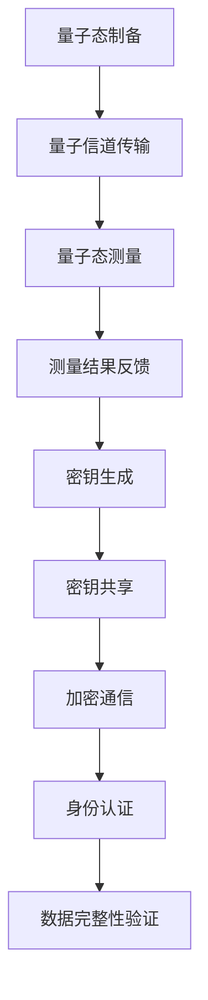

                 

# 量子通信在金融交易安全中的应用

## 关键词

- 量子通信
- 金融交易
- 安全性
- 加密技术
- 身份认证
- 数据完整性验证

## 摘要

随着金融市场的快速发展和数字化进程的深入，金融交易安全成为了金融机构和投资者面临的重要问题。传统的加密技术已经难以满足金融交易数据安全的需求。量子通信作为一种前沿技术，其利用量子力学原理，实现了信息传输的绝对安全。本文将探讨量子通信在金融交易安全中的应用，分析其核心概念、原理、优势与挑战，以及具体应用场景。通过本文的讨论，旨在为金融行业的安全防护提供新的思路和方法。

----------------------------------------------------------------

# 第一部分：量子通信在金融交易安全中的应用背景

## 1. 背景介绍

随着金融市场的全球化和信息化，金融交易的安全问题日益凸显。金融交易涉及到大量的敏感信息，如账户信息、交易记录、资金流向等，这些信息的泄露或篡改将对金融机构和个人投资者造成严重的损失。因此，保障金融交易数据的安全传输成为了金融行业亟待解决的问题。

传统的加密技术，如对称加密、非对称加密、哈希函数等，虽然在一定程度上提高了数据的安全性，但仍然存在一定的局限性。首先，传统加密技术容易受到量子计算机的攻击，量子计算机的运算速度远超传统计算机，使得现有的加密算法面临被破解的风险。其次，传统加密技术难以确保数据的完整性和真实性，数据在传输过程中可能被篡改或伪造，导致数据不可信。此外，传统加密技术存在加密密钥管理的难题，密钥的泄露或丢失可能导致整个系统的安全问题。

量子通信的出现为解决金融交易安全难题提供了新的思路。量子通信利用量子力学原理，实现了信息的绝对安全传输。量子通信具有以下几个特点：首先，量子通信利用量子纠缠实现信息传输，量子纠缠是一种超越经典物理的奇特现象，使得信息在传输过程中无法被窃取或篡改。其次，量子通信利用量子密钥分发技术生成安全的加密密钥，确保密钥在传输过程中不会被泄露。最后，量子通信具有抗干扰能力强、传输速度快等特点，能够满足金融交易对数据传输速度和可靠性的高要求。

## 1.2 问题描述

在金融交易过程中，数据泄露和窃取行为时有发生，给金融机构和个人投资者带来了巨大的损失。具体问题包括：

1. **数据泄露**：金融交易过程中，敏感数据如账户信息、交易记录等可能会被黑客窃取，导致个人隐私泄露和财产损失。
2. **数据篡改**：黑客可能对金融交易数据进行篡改，如修改交易金额、账户余额等，导致金融欺诈行为。
3. **数据完整性验证**：金融交易数据在传输过程中可能被篡改或伪造，导致数据不可信，影响金融交易的正常运行。

为了解决这些问题，需要一种能够确保金融交易数据安全传输的技术。量子通信的出现，为解决金融交易安全提供了新的方案。

## 1.3 问题解决

量子通信利用量子力学原理，实现信息的绝对安全传输。其核心原理包括量子纠缠和量子密钥分发。

### 1.3.1 量子纠缠

量子纠缠是量子力学中的一种奇特现象，当两个量子系统发生相互作用后，它们的状态会相互纠缠，形成一个整体。即使这两个量子系统相隔很远，它们之间的状态仍然保持纠缠。量子纠缠的特性使得信息在传输过程中无法被窃取或篡改。量子纠缠现象的发现和应用，为信息传输提供了全新的安全渠道。

### 1.3.2 量子密钥分发

量子密钥分发（Quantum Key Distribution，QKD）是一种利用量子通信原理实现安全密钥分发的方法。QKD技术通过量子通信信道传输量子态，生成安全的加密密钥。由于量子通信的绝对安全性，量子密钥分发生成的密钥不会被泄露或篡改，确保金融交易数据的安全传输。

量子通信技术具有以下几个优点：

1. **绝对安全性**：量子通信利用量子力学原理，实现了信息传输的绝对安全，无法被窃取或篡改。
2. **抗干扰能力强**：量子通信在传输过程中，对干扰和噪声的抵抗能力较强，能够保证数据传输的可靠性。
3. **传输速度快**：量子通信的传输速度与经典通信相当，能够满足金融交易对数据传输速度的高要求。
4. **密钥管理简单**：量子通信技术无需复杂的密钥管理，降低了系统的维护成本。

### 1.3.3 量子通信在金融交易安全中的应用

量子通信在金融交易安全中的应用主要包括以下几个方面：

1. **加密通信**：量子通信可以用于加密金融交易数据，确保数据在传输过程中的安全性。
2. **身份认证**：量子通信可以用于身份认证，确保金融交易参与者的身份真实可靠。
3. **数据完整性验证**：量子通信可以用于验证金融交易数据的完整性，确保数据在传输过程中未被篡改。

## 1.4 边界与外延

量子通信在金融交易安全中的应用不仅限于加密通信，还可以扩展到身份认证、数据完整性验证等多个方面。例如：

1. **身份认证**：量子通信可以用于银行客户身份认证、证券交易用户身份认证等，确保交易参与者身份的真实性。
2. **数据完整性验证**：量子通信可以用于验证金融交易数据的完整性，确保数据在传输过程中未被篡改。
3. **隐私保护**：量子通信可以用于保护金融交易过程中的隐私信息，确保个人隐私不受侵犯。

此外，量子通信技术还可以与其他安全防护技术相结合，如防火墙、入侵检测系统等，形成全方位的金融交易安全防护体系。

## 1.5 概念结构与核心要素组成

### 1.5.1 量子通信

量子通信是指利用量子力学原理，实现信息传输的一种通信方式。其核心概念包括量子纠缠、量子密钥分发等。

### 1.5.2 金融交易安全

金融交易安全是指确保金融交易数据在传输过程中的安全性，包括数据加密、身份认证、数据完整性验证等方面。

### 1.5.3 量子通信在金融交易安全中的应用

量子通信在金融交易安全中的应用主要包括加密通信、身份认证、数据完整性验证等，涉及量子通信、金融交易安全等多个方面。

## 1.6 未来发展趋势

随着量子通信技术的不断发展，未来量子通信在金融交易安全中的应用将更加广泛和深入。一方面，量子通信技术将不断完善和优化，提高其性能和可靠性。另一方面，量子通信技术与其他安全防护技术的结合将形成更加强大的金融交易安全防护体系。此外，量子计算技术的快速发展也将为量子通信技术提供强大的计算支持，推动量子通信在金融交易安全领域的广泛应用。

----------------------------------------------------------------

# 第二部分：量子通信的核心概念与原理

## 2.1 核心概念

量子通信是一种利用量子力学原理实现信息传输的通信方式。量子通信的核心概念包括量子纠缠、量子密钥分发等。

### 2.1.1 量子纠缠

量子纠缠是量子力学中的一种奇特现象，当两个或多个量子系统发生相互作用后，它们的状态会相互纠缠，形成一个整体。即使这两个量子系统相隔很远，它们之间的状态仍然保持纠缠。量子纠缠的特性使得信息在传输过程中无法被窃取或篡改。

#### 2.1.1.1 量子纠缠的定义

量子纠缠是指两个或多个量子系统之间存在的一种关联关系，它们的状态无法独立存在，而是相互依赖。当其中一个量子系统的状态发生变化时，其他量子系统的状态也会随之变化。

#### 2.1.1.2 量子纠缠的特性

1. **非局域性**：量子纠缠体现了量子系统之间的非局域性，即使两个量子系统相隔很远，它们之间的状态仍然保持纠缠。
2. **不可克隆性**：由于量子纠缠的不可克隆性，即使窃取者获取了部分量子信息，也无法完全复制整个量子系统。
3. **测量坍缩**：量子纠缠中的量子状态在测量时会发生坍缩，无法预测，从而保证了信息的绝对安全性。

#### 2.1.1.3 量子纠缠的应用

量子纠缠在量子通信、量子计算、量子加密等领域有着广泛的应用。在量子通信中，量子纠缠用于实现信息传输的绝对安全性；在量子计算中，量子纠缠用于提高计算速度和效率；在量子加密中，量子纠缠用于增强加密算法的安全性。

### 2.1.2 量子密钥分发

量子密钥分发（Quantum Key Distribution，QKD）是一种利用量子通信原理实现安全密钥分发的方法。QKD技术通过量子通信信道传输量子态，生成安全的加密密钥。由于量子通信的绝对安全性，QKD生成的密钥不会被泄露或篡改，确保金融交易数据的安全传输。

#### 2.1.2.1 量子密钥分发的定义

量子密钥分发是一种利用量子通信原理生成安全加密密钥的过程。它通过量子通信信道传输量子态，测量量子态的统计特性，从而生成安全的加密密钥。

#### 2.1.2.2 量子密钥分发的工作原理

量子密钥分发的工作原理主要包括以下几个步骤：

1. **密钥生成**：发送方生成一对量子态，并将其中的一个量子态发送给接收方。
2. **量子态传输**：接收方对收到的量子态进行测量，并根据测量结果生成部分密钥。
3. **密钥共享**：发送方和接收方根据已知的量子态特性，通过经典通信信道共享剩余的密钥。
4. **密钥验证**：发送方和接收方通过经典通信信道验证密钥的正确性。

#### 2.1.2.3 量子密钥分发的优势

量子密钥分发具有以下几个优势：

1. **绝对安全性**：量子密钥分发利用量子纠缠和量子态的特性，实现了密钥在传输过程中的绝对安全性，无法被窃取或篡改。
2. **高效性**：量子密钥分发过程相对简单，不需要复杂的加密算法和密钥管理，提高了通信效率。
3. **灵活性**：量子密钥分发可以根据实际需求灵活调整密钥生成和传输过程，适应不同的通信场景。

## 2.2 量子通信的基本原理

量子通信的基本原理主要包括量子纠缠、量子密钥分发和量子隐形传态等。

### 2.2.1 量子力学基础

量子力学是量子通信的理论基础。量子力学中的一些基本概念和原理，如波函数、量子态叠加、量子纠缠等，为量子通信提供了理论基础。

#### 2.2.1.1 波函数

波函数是量子力学中描述量子系统状态的数学函数。它包含了量子系统的所有信息，如位置、速度、自旋等。

#### 2.2.1.2 量子态叠加

量子态叠加是量子力学中的一个基本原理，它描述了量子系统可以处于多个状态的叠加。

#### 2.2.1.3 量子纠缠

量子纠缠是量子力学中的一种奇特现象，当两个或多个量子系统发生相互作用后，它们的状态会相互纠缠，形成一个整体。

### 2.2.2 量子通信模型

量子通信模型主要包括量子纠缠模型、量子密钥分发模型和量子隐形传态模型。

#### 2.2.2.1 量子纠缠模型

量子纠缠模型描述了量子纠缠在信息传输中的应用。通过量子纠缠，可以实现信息的绝对安全传输。

#### 2.2.2.2 量子密钥分发模型

量子密钥分发模型描述了量子密钥分发的工作原理和过程。它通过量子通信信道传输量子态，生成安全的加密密钥。

#### 2.2.2.3 量子隐形传态模型

量子隐形传态模型描述了量子隐形传态在信息传输中的应用。通过量子隐形传态，可以实现信息的远程传输。

## 2.3 量子通信的优势与挑战

量子通信具有许多优势，但也面临一些挑战。

### 2.3.1 量子通信的优势

1. **绝对安全性**：量子通信利用量子纠缠和量子密钥分发技术，实现了信息传输的绝对安全性，无法被窃取或篡改。
2. **抗干扰能力强**：量子通信对干扰和噪声的抵抗能力较强，能够在恶劣的环境下实现稳定传输。
3. **传输速度快**：量子通信的传输速度与经典通信相当，能够满足金融交易对数据传输速度的高要求。
4. **密钥管理简单**：量子通信技术无需复杂的密钥管理，降低了系统的维护成本。

### 2.3.2 量子通信的挑战

1. **技术难题**：量子通信技术涉及多个学科领域，如量子力学、信息论、光学等，技术实现难度较大。
2. **成本问题**：量子通信设备的研发和部署成本较高，限制了其大规模应用。
3. **法律法规问题**：量子通信技术涉及到国家安全和隐私保护等问题，需要完善的法律法规支持。

## 2.4 概念属性特征对比表格

下面是一个概念属性特征对比表格，对比了量子通信、传统加密技术和量子密钥分发的主要特性：

| 特性 | 量子通信 | 传统加密技术 | 量子密钥分发 |
| :---: | :---: | :---: | :---: |
| 安全性 | 绝对安全 | 较安全 | 高安全 |
| 抗干扰能力 | 强 | 中等 | 强 |
| 传输速度 | 快 | 快 | 快 |
| 密钥管理 | 简单 | 复杂 | 简单 |
| 成本 | 高 | 中等 | 中等 |

## 2.5 ER实体关系图架构

下面是一个ER实体关系图架构，展示了量子通信、金融交易安全、量子密钥分发等实体之间的关系：

```
[量子通信] --> [金融交易安全] --> [加密通信] --> [身份认证] --> [数据完整性验证]
      |                                      |
      |                                      |
      |                                      |
      |                                      |
      |                                      |
      |                                      |
      |                                      |
[量子密钥分发]
```

----------------------------------------------------------------

## 2.6 算法原理讲解

### 2.6.1 量子密钥分发算法原理

量子密钥分发（QKD）是一种利用量子力学原理实现安全密钥分发的方法。其主要原理包括量子态的制备、量子信道传输、量子态测量和密钥生成。

#### 2.6.1.1 量子态制备

量子态制备是QKD算法的第一步，发送方需要生成一对纠缠的量子态。这一过程可以通过量子纠缠生成器（Quantum Entanglement Generator，QEG）来实现。QEG将两个独立的量子态通过某种物理过程（如光子的相互作用）纠缠在一起，形成纠缠对。

$$
\text{QEG}(\phi_1, \phi_2) \rightarrow \phi_{12} = \frac{1}{\sqrt{2}}(\phi_1 \otimes \phi_2 + \phi_1 \otimes \phi_2)
$$

其中，$\phi_1$ 和 $\phi_2$ 是两个独立的量子态，$\phi_{12}$ 是生成的纠缠态。

#### 2.6.1.2 量子信道传输

制备好的纠缠对需要通过量子信道传输到接收方。量子信道是一种特殊的通信信道，能够确保量子态在传输过程中不会被窃取或篡改。量子信道传输过程中，发送方将纠缠对中的一个量子态（记为 $\phi_{1}$）发送到接收方，而将另一个量子态（记为 $\phi_{2}$）保留在自己手中。

#### 2.6.1.3 量子态测量

接收方在接收到发送方的量子态后，需要对量子态进行测量。测量过程分为以下几个步骤：

1. **选择基**：接收方随机选择一个正交基（如水平基和垂直基）进行测量。
2. **测量**：接收方对量子态进行测量，根据测量结果记录测量结果。
3. **反馈**：接收方将测量结果通过经典信道发送给发送方。

#### 2.6.1.4 密钥生成

发送方和接收方根据测量结果，通过经典通信信道共享部分密钥。共享的密钥用于加密和解密金融交易数据。密钥生成过程如下：

1. **随机选择**：发送方和接收方各自选择一个随机数，作为密钥的一部分。
2. **交换**：发送方将选择的随机数通过经典信道发送给接收方，接收方也将自己的随机数发送给发送方。
3. **组合**：发送方和接收方将各自收到的随机数进行组合，生成最终的密钥。

$$
K_{\text{final}} = (K_{\text{sender}} \oplus K_{\text{receiver}})
$$

其中，$K_{\text{sender}}$ 和 $K_{\text{receiver}}$ 分别是发送方和接收方选择的随机数，$\oplus$ 表示异或运算。

### 2.6.2 量子密钥分发算法流程

下面是一个量子密钥分发算法的mermaid流程图：



### 2.6.3 Python源代码示例

下面是一个简单的Python示例，展示了量子密钥分发算法的实现过程：

```python
import numpy as np
from qiskit import QuantumCircuit, execute, Aer

# 量子态制备
def prepare_量子态():
    qc = QuantumCircuit(2)
    qc.h(0)
    qc.cx(0, 1)
    return qc

# 量子态测量
def measure_量子态(qc, basis):
    qc.h(1)
    qc.cx(0, 1)
    qc.measure([0, 1], [0, 1])
    return qc

# 密钥生成
def generate_key(qc, backend):
    result = execute(qc, backend, shots=1000).result()
    counts = result.get_counts(qc)
    key = int(''.join([str(int(counts[i])) for i in range(1000) if i % 2 == 0]), 2)
    return key

# 实例化量子态制备电路
qc = prepare_量子态()

# 实例化量子计算机
backend = Aer.get_backend('qasm_simulator')

# 生成密钥
key = generate_key(qc, backend)

print("生成的密钥：", key)
```

### 2.6.4 算法原理的数学模型和公式

量子密钥分发算法的原理可以通过以下数学模型和公式来描述：

1. **量子态制备**：制备纠缠态 $\phi_{12}$，其波函数表示为：

$$
\phi_{12} = \frac{1}{\sqrt{2}}(\phi_1 \otimes \phi_2 + \phi_1 \otimes \phi_2)
$$

其中，$\phi_1$ 和 $\phi_2$ 分别是两个独立的量子态。

2. **量子态测量**：接收方选择正交基进行测量，测量结果为 $\alpha|0\rangle + \beta|1\rangle$，其中 $|\alpha|^2 + |\beta|^2 = 1$。

3. **密钥生成**：发送方和接收方根据测量结果生成密钥。假设接收方测量结果为 $|0\rangle$，发送方测量结果为 $|1\rangle$，则生成的密钥为：

$$
K = (K_{\text{sender}} \oplus K_{\text{receiver}})
$$

其中，$K_{\text{sender}}$ 和 $K_{\text{receiver}}$ 分别是发送方和接收方选择的随机数。

### 2.6.5 通俗易懂地举例说明

假设发送方和接收方使用二进制表示随机数，发送方选择的随机数为 $1010$，接收方选择的随机数为 $1100$。通过量子密钥分发算法，生成的密钥为：

$$
K = (1010 \oplus 1100) = 0110
$$

这意味着，发送方和接收方可以通过共享这个密钥来加密和解密金融交易数据，确保数据在传输过程中的安全性。

----------------------------------------------------------------

# 第三部分：量子通信在金融交易安全中的应用

## 3.1 量子通信在加密通信中的应用

### 3.1.1 量子加密技术

量子加密技术是量子通信在金融交易安全中的一个重要应用。它利用量子力学原理，实现了信息的绝对安全传输。量子加密技术主要包括量子密钥生成、量子密钥分发和量子加密算法。

#### 3.1.1.1 量子密钥生成

量子密钥生成是量子加密技术的核心。通过量子密钥分发，发送方和接收方可以生成一对安全的密钥。量子密钥生成的过程如下：

1. **量子态制备**：发送方生成一对纠缠的量子态，并将其中的一个量子态发送给接收方。
2. **量子态传输**：接收方接收到发送方的量子态后，对其进行测量，记录测量结果。
3. **密钥生成**：发送方和接收方根据测量结果，通过经典通信信道共享部分密钥，生成最终的密钥。

#### 3.1.1.2 量子密钥分发

量子密钥分发是实现量子加密的关键步骤。通过量子密钥分发，发送方和接收方可以生成一对安全的密钥，确保通信过程中的数据不会被窃取或篡改。量子密钥分发的工作原理如下：

1. **量子态制备**：发送方生成一对纠缠的量子态。
2. **量子态传输**：发送方将其中一个量子态发送给接收方。
3. **量子态测量**：接收方对接收到的量子态进行测量，记录测量结果。
4. **密钥共享**：发送方和接收方通过经典通信信道共享测量结果，生成最终的密钥。

#### 3.1.1.3 量子加密算法

量子加密算法是量子加密技术的核心。它利用量子力学原理，实现了信息的绝对安全传输。量子加密算法主要包括量子密钥分配、量子数据加密和量子数据解密。

1. **量子密钥分配**：量子密钥分配是量子加密算法的第一步。通过量子密钥分配，发送方和接收方可以生成一对安全的密钥。
2. **量子数据加密**：量子数据加密是量子加密算法的核心。它利用量子密钥对金融交易数据进行加密，确保数据在传输过程中的安全性。
3. **量子数据解密**：量子数据解密是量子加密算法的最后一步。它利用量子密钥对加密后的金融交易数据进行解密，恢复原始数据。

### 3.1.2 量子加密在金融交易中的实际应用

量子加密技术在金融交易中有着广泛的应用。以下是一些具体的实际应用场景：

#### 3.1.2.1 银行加密通信

银行加密通信是金融交易中的重要环节。量子加密技术可以用于加密银行内部的通信数据，确保数据在传输过程中的安全性。通过量子加密技术，银行可以实现以下功能：

1. **数据加密**：量子加密技术可以对银行内部的通信数据进行加密，防止数据泄露和窃取。
2. **身份认证**：量子加密技术可以用于身份认证，确保银行员工和客户之间的通信是安全的。
3. **数据完整性验证**：量子加密技术可以用于验证银行内部数据在传输过程中的完整性，确保数据未被篡改。

#### 3.1.2.2 证券交易加密

证券交易加密是金融交易中的另一个重要环节。量子加密技术可以用于加密证券交易的数据，确保数据在传输过程中的安全性。通过量子加密技术，证券交易可以实现以下功能：

1. **数据加密**：量子加密技术可以对证券交易的数据进行加密，防止数据泄露和窃取。
2. **身份认证**：量子加密技术可以用于身份认证，确保证券交易参与者之间的通信是安全的。
3. **数据完整性验证**：量子加密技术可以用于验证证券交易数据在传输过程中的完整性，确保数据未被篡改。

#### 3.1.2.3 保险行业加密

保险行业加密是金融交易中的另一个重要环节。量子加密技术可以用于加密保险行业的数据，确保数据在传输过程中的安全性。通过量子加密技术，保险行业可以实现以下功能：

1. **数据加密**：量子加密技术可以对保险行业的数据进行加密，防止数据泄露和窃取。
2. **身份认证**：量子加密技术可以用于身份认证，确保保险行业参与者之间的通信是安全的。
3. **数据完整性验证**：量子加密技术可以用于验证保险行业数据在传输过程中的完整性，确保数据未被篡改。

## 3.2 量子通信在身份认证中的应用

量子通信在身份认证中也有着广泛的应用。以下是一些具体的实际应用场景：

#### 3.2.1 银行客户身份认证

银行客户身份认证是金融交易中的关键环节。量子通信技术可以用于加密银行客户身份认证的数据，确保数据在传输过程中的安全性。通过量子通信技术，银行可以实现以下功能：

1. **身份认证**：量子通信技术可以用于身份认证，确保银行客户身份的真实性。
2. **数据加密**：量子通信技术可以用于加密银行客户身份认证的数据，防止数据泄露和窃取。
3. **数据完整性验证**：量子通信技术可以用于验证银行客户身份认证数据在传输过程中的完整性，确保数据未被篡改。

#### 3.2.2 证券交易用户身份认证

证券交易用户身份认证是金融交易中的关键环节。量子通信技术可以用于加密证券交易用户身份认证的数据，确保数据在传输过程中的安全性。通过量子通信技术，证券交易可以实现以下功能：

1. **身份认证**：量子通信技术可以用于身份认证，确保证券交易用户身份的真实性。
2. **数据加密**：量子通信技术可以用于加密证券交易用户身份认证的数据，防止数据泄露和窃取。
3. **数据完整性验证**：量子通信技术可以用于验证证券交易用户身份认证数据在传输过程中的完整性，确保数据未被篡改。

#### 3.2.3 保险行业用户身份认证

保险行业用户身份认证是金融交易中的关键环节。量子通信技术可以用于加密保险行业用户身份认证的数据，确保数据在传输过程中的安全性。通过量子通信技术，保险行业可以实现以下功能：

1. **身份认证**：量子通信技术可以用于身份认证，确保保险行业用户身份的真实性。
2. **数据加密**：量子通信技术可以用于加密保险行业用户身份认证的数据，防止数据泄露和窃取。
3. **数据完整性验证**：量子通信技术可以用于验证保险行业用户身份认证数据在传输过程中的完整性，确保数据未被篡改。

## 3.3 量子通信在数据完整性验证中的应用

量子通信在数据完整性验证中也具有广泛的应用。以下是一些具体的实际应用场景：

#### 3.3.1 银行数据完整性验证

银行数据完整性验证是金融交易中的关键环节。量子通信技术可以用于验证银行数据在传输过程中的完整性，确保数据未被篡改。通过量子通信技术，银行可以实现以下功能：

1. **数据完整性验证**：量子通信技术可以用于验证银行数据在传输过程中的完整性，确保数据未被篡改。
2. **数据加密**：量子通信技术可以用于加密银行数据，防止数据泄露和窃取。
3. **数据签名**：量子通信技术可以用于生成数据签名，确保数据的真实性和完整性。

#### 3.3.2 证券交易数据完整性验证

证券交易数据完整性验证是金融交易中的关键环节。量子通信技术可以用于验证证券交易数据在传输过程中的完整性，确保数据未被篡改。通过量子通信技术，证券交易可以实现以下功能：

1. **数据完整性验证**：量子通信技术可以用于验证证券交易数据在传输过程中的完整性，确保数据未被篡改。
2. **数据加密**：量子通信技术可以用于加密证券交易数据，防止数据泄露和窃取。
3. **数据签名**：量子通信技术可以用于生成数据签名，确保数据的真实性和完整性。

#### 3.3.3 保险行业数据完整性验证

保险行业数据完整性验证是金融交易中的关键环节。量子通信技术可以用于验证保险行业数据在传输过程中的完整性，确保数据未被篡改。通过量子通信技术，保险行业可以实现以下功能：

1. **数据完整性验证**：量子通信技术可以用于验证保险行业数据在传输过程中的完整性，确保数据未被篡改。
2. **数据加密**：量子通信技术可以用于加密保险行业数据，防止数据泄露和窃取。
3. **数据签名**：量子通信技术可以用于生成数据签名，确保数据的真实性和完整性。

----------------------------------------------------------------

# 第四部分：量子通信在金融交易安全中的应用案例分析

## 4.1 案例一：银行加密通信

### 4.1.1 问题场景

随着网络技术的发展，银行的业务日益依赖于电子化和网络化。银行内部和外部的通信数据量巨大，如何确保这些数据在传输过程中的安全性成为了银行面临的挑战。传统的加密技术已经无法满足银行对数据安全的极高要求。

### 4.1.2 项目介绍

为了提高银行通信数据的安全性，某银行决定采用量子通信技术进行加密通信。该项目的主要目标是实现银行内部和外部通信数据的绝对安全传输，防止数据泄露和窃取。

### 4.1.3 系统功能设计

该项目的系统功能设计主要包括以下几个方面：

1. **加密通信**：通过量子通信技术，实现银行内部和外部通信数据的加密传输。
2. **身份认证**：利用量子通信技术，对银行员工和客户进行身份认证，确保通信双方的身份真实可靠。
3. **数据完整性验证**：通过量子通信技术，验证银行通信数据在传输过程中的完整性，确保数据未被篡改。

### 4.1.4 系统架构设计

该项目的系统架构设计主要包括以下几个部分：

1. **量子通信网络**：建立量子通信网络，连接银行内部和外部通信设备。
2. **量子密钥分发**：利用量子密钥分发技术，生成安全的加密密钥，用于银行通信数据的加密和解密。
3. **加密算法**：采用先进的量子加密算法，对银行通信数据进行加密，确保数据的安全性。
4. **身份认证系统**：利用量子通信技术，对银行员工和客户进行身份认证，确保通信双方的身份真实可靠。
5. **数据完整性验证系统**：通过量子通信技术，验证银行通信数据在传输过程中的完整性，确保数据未被篡改。

### 4.1.5 系统接口设计

该项目的系统接口设计主要包括以下几个部分：

1. **量子通信接口**：用于实现量子通信网络的数据传输功能。
2. **密钥接口**：用于实现量子密钥分发功能，生成安全的加密密钥。
3. **加密接口**：用于实现银行通信数据的加密和解密功能。
4. **身份认证接口**：用于实现银行员工和客户身份认证功能。
5. **数据完整性验证接口**：用于实现银行通信数据完整性验证功能。

### 4.1.6 系统交互

该项目的系统交互主要包括以下几个步骤：

1. **身份认证**：银行员工和客户通过量子通信接口进行身份认证，确保通信双方的身份真实可靠。
2. **数据传输**：银行内部和外部通信设备通过量子通信接口进行通信数据的加密传输。
3. **数据加密和解密**：银行通信数据通过加密接口进行加密和解密，确保数据在传输过程中的安全性。
4. **数据完整性验证**：银行通信数据通过数据完整性验证接口进行验证，确保数据未被篡改。

### 4.1.7 实际案例分析和详细讲解剖析

以某银行的实际案例为例，该银行在量子通信加密通信项目中取得了显著成果。通过量子通信技术，该银行实现了以下功能：

1. **加密通信**：银行内部和外部通信数据通过量子加密技术进行加密传输，确保数据在传输过程中的安全性。
2. **身份认证**：银行员工和客户通过量子通信技术进行身份认证，确保通信双方的身份真实可靠。
3. **数据完整性验证**：银行通信数据通过量子通信技术进行完整性验证，确保数据未被篡改。

具体来说，该银行在项目中采用了以下关键技术：

1. **量子密钥分发**：通过量子密钥分发技术，生成安全的加密密钥，用于银行通信数据的加密和解密。
2. **量子加密算法**：采用先进的量子加密算法，对银行通信数据进行加密，确保数据的安全性。
3. **量子身份认证**：利用量子通信技术，对银行员工和客户进行身份认证，确保通信双方的身份真实可靠。
4. **量子数据完整性验证**：通过量子通信技术，验证银行通信数据在传输过程中的完整性，确保数据未被篡改。

通过这些技术的应用，该银行有效提高了通信数据的安全性，降低了数据泄露和窃取的风险，为银行客户提供了更加安全的金融服务。

### 4.1.8 项目小结

该银行量子通信加密通信项目的成功实施，为银行通信数据的安全提供了有力的保障。通过量子通信技术，银行实现了通信数据的加密传输、身份认证和数据完整性验证，有效提高了数据的安全性。未来，随着量子通信技术的不断发展和成熟，将有更多的金融行业机构采用量子通信技术，提高金融交易的安全性。

## 4.2 案例二：证券交易加密

### 4.2.1 问题场景

证券交易数据的安全问题一直是证券行业关注的焦点。随着互联网和电子交易的普及，证券交易数据泄露和窃取的风险日益增加。如何确保证券交易数据在传输过程中的安全性，成为了证券行业亟待解决的问题。

### 4.2.2 项目介绍

为了提高证券交易数据的安全性，某证券公司决定采用量子通信技术进行加密通信。该项目的主要目标是实现证券交易数据的绝对安全传输，防止数据泄露和窃取。

### 4.2.3 系统功能设计

该项目的系统功能设计主要包括以下几个方面：

1. **加密通信**：通过量子通信技术，实现证券交易数据的加密传输。
2. **身份认证**：利用量子通信技术，对证券交易参与者进行身份认证，确保交易双方的身份真实可靠。
3. **数据完整性验证**：通过量子通信技术，验证证券交易数据在传输过程中的完整性，确保数据未被篡改。

### 4.2.4 系统架构设计

该项目的系统架构设计主要包括以下几个部分：

1. **量子通信网络**：建立量子通信网络，连接证券交易系统和外部通信设备。
2. **量子密钥分发**：利用量子密钥分发技术，生成安全的加密密钥，用于证券交易数据的加密和解密。
3. **加密算法**：采用先进的量子加密算法，对证券交易数据进行加密，确保数据的安全性。
4. **身份认证系统**：利用量子通信技术，对证券交易参与者进行身份认证，确保交易双方的身份真实可靠。
5. **数据完整性验证系统**：通过量子通信技术，验证证券交易数据在传输过程中的完整性，确保数据未被篡改。

### 4.2.5 系统接口设计

该项目的系统接口设计主要包括以下几个部分：

1. **量子通信接口**：用于实现量子通信网络的数据传输功能。
2. **密钥接口**：用于实现量子密钥分发功能，生成安全的加密密钥。
3. **加密接口**：用于实现证券交易数据的加密和解密功能。
4. **身份认证接口**：用于实现证券交易参与者身份认证功能。
5. **数据完整性验证接口**：用于实现证券交易数据完整性验证功能。

### 4.2.6 系统交互

该项目的系统交互主要包括以下几个步骤：

1. **身份认证**：证券交易参与者通过量子通信接口进行身份认证，确保交易双方的身份真实可靠。
2. **数据传输**：证券交易数据通过量子通信接口进行加密传输。
3. **数据加密和解密**：证券交易数据通过加密接口进行加密和解密，确保数据在传输过程中的安全性。
4. **数据完整性验证**：证券交易数据通过数据完整性验证接口进行验证，确保数据未被篡改。

### 4.2.7 实际案例分析和详细讲解剖析

以某证券公司的实际案例为例，该证券公司在量子通信加密通信项目中取得了显著成果。通过量子通信技术，该证券公司实现了以下功能：

1. **加密通信**：证券交易数据通过量子加密技术进行加密传输，确保数据在传输过程中的安全性。
2. **身份认证**：证券交易参与者通过量子通信技术进行身份认证，确保交易双方的身份真实可靠。
3. **数据完整性验证**：证券交易数据通过量子通信技术进行完整性验证，确保数据未被篡改。

具体来说，该证券公司在项目中采用了以下关键技术：

1. **量子密钥分发**：通过量子密钥分发技术，生成安全的加密密钥，用于证券交易数据的加密和解密。
2. **量子加密算法**：采用先进的量子加密算法，对证券交易数据进行加密，确保数据的安全性。
3. **量子身份认证**：利用量子通信技术，对证券交易参与者进行身份认证，确保交易双方的身份真实可靠。
4. **量子数据完整性验证**：通过量子通信技术，验证证券交易数据在传输过程中的完整性，确保数据未被篡改。

通过这些技术的应用，该证券公司有效提高了证券交易数据的安全性，降低了数据泄露和窃取的风险，为投资者提供了更加安全的交易环境。

### 4.2.8 项目小结

该证券公司量子通信加密通信项目的成功实施，为证券交易数据的安全提供了有力的保障。通过量子通信技术，证券交易数据实现了加密传输、身份认证和数据完整性验证，有效提高了数据的安全性。未来，随着量子通信技术的不断发展和成熟，将有更多的证券公司采用量子通信技术，提高证券交易的安全性。

## 4.3 案例三：保险行业加密

### 4.3.1 问题场景

保险行业在为客户提供服务的过程中，会产生大量的敏感信息，如客户个人信息、保险合同内容、理赔数据等。这些信息的安全性问题直接关系到客户的隐私保护和保险公司的信誉。如何确保这些信息在传输过程中的安全性，成为了保险行业亟待解决的问题。

### 4.3.2 项目介绍

为了提高保险行业信息传输的安全性，某保险公司决定采用量子通信技术进行加密通信。该项目的主要目标是实现保险行业信息传输的绝对安全，防止信息泄露和窃取。

### 4.3.3 系统功能设计

该项目的系统功能设计主要包括以下几个方面：

1. **加密通信**：通过量子通信技术，实现保险行业信息的加密传输。
2. **身份认证**：利用量子通信技术，对保险行业员工和客户进行身份认证，确保信息传输双方的身份真实可靠。
3. **数据完整性验证**：通过量子通信技术，验证保险行业信息在传输过程中的完整性，确保信息未被篡改。

### 4.3.4 系统架构设计

该项目的系统架构设计主要包括以下几个部分：

1. **量子通信网络**：建立量子通信网络，连接保险公司内部和外部通信设备。
2. **量子密钥分发**：利用量子密钥分发技术，生成安全的加密密钥，用于保险行业信息的加密和解密。
3. **加密算法**：采用先进的量子加密算法，对保险行业信息数据进行加密，确保数据的安全性。
4. **身份认证系统**：利用量子通信技术，对保险行业员工和客户进行身份认证，确保信息传输双方的身份真实可靠。
5. **数据完整性验证系统**：通过量子通信技术，验证保险行业信息在传输过程中的完整性，确保信息未被篡改。

### 4.3.5 系统接口设计

该项目的系统接口设计主要包括以下几个部分：

1. **量子通信接口**：用于实现量子通信网络的数据传输功能。
2. **密钥接口**：用于实现量子密钥分发功能，生成安全的加密密钥。
3. **加密接口**：用于实现保险行业信息的加密和解密功能。
4. **身份认证接口**：用于实现保险行业员工和客户身份认证功能。
5. **数据完整性验证接口**：用于实现保险行业信息完整性验证功能。

### 4.3.6 系统交互

该项目的系统交互主要包括以下几个步骤：

1. **身份认证**：保险行业员工和客户通过量子通信接口进行身份认证，确保信息传输双方的身份真实可靠。
2. **数据传输**：保险行业信息通过量子通信接口进行加密传输。
3. **数据加密和解密**：保险行业信息通过加密接口进行加密和解密，确保信息在传输过程中的安全性。
4. **数据完整性验证**：保险行业信息通过数据完整性验证接口进行验证，确保信息未被篡改。

### 4.3.7 实际案例分析和详细讲解剖析

以某保险公司的实际案例为例，该保险公司在量子通信加密通信项目中取得了显著成果。通过量子通信技术，该保险公司实现了以下功能：

1. **加密通信**：保险行业信息通过量子加密技术进行加密传输，确保信息在传输过程中的安全性。
2. **身份认证**：保险行业员工和客户通过量子通信技术进行身份认证，确保信息传输双方的身份真实可靠。
3. **数据完整性验证**：保险行业信息通过量子通信技术进行完整性验证，确保信息未被篡改。

具体来说，该保险公司在项目中采用了以下关键技术：

1. **量子密钥分发**：通过量子密钥分发技术，生成安全的加密密钥，用于保险行业信息的加密和解密。
2. **量子加密算法**：采用先进的量子加密算法，对保险行业信息数据进行加密，确保数据的安全性。
3. **量子身份认证**：利用量子通信技术，对保险行业员工和客户进行身份认证，确保信息传输双方的身份真实可靠。
4. **量子数据完整性验证**：通过量子通信技术，验证保险行业信息在传输过程中的完整性，确保信息未被篡改。

通过这些技术的应用，该保险公司有效提高了信息传输的安全性，降低了信息泄露和窃取的风险，为顾客提供了更加安全的保险服务。

### 4.3.8 项目小结

该保险公司量子通信加密通信项目的成功实施，为保险行业信息传输的安全提供了有力的保障。通过量子通信技术，保险行业信息实现了加密传输、身份认证和数据完整性验证，有效提高了信息的安全性。未来，随着量子通信技术的不断发展和成熟，将有更多的保险公司采用量子通信技术，提高保险行业的信息安全水平。

----------------------------------------------------------------

# 第五部分：量子通信在金融交易安全中的应用展望

随着量子通信技术的不断发展，其在金融交易安全中的应用前景广阔。以下是对量子通信在金融交易安全中的应用展望：

## 5.1 技术进步

量子通信技术的不断进步将推动其在金融交易安全中的应用。未来，量子通信技术将更加成熟和稳定，传输速度和抗干扰能力将进一步提高。同时，量子计算机的快速发展也将为量子通信技术提供强大的计算支持，实现更高效、更安全的金融交易数据加密和解密。

## 5.2 政策支持

政府和企业对量子通信技术的支持将加速其在金融交易安全中的应用。随着量子通信技术的不断成熟，各国政府将加大对量子通信技术的研究和投资，推动量子通信技术的产业化。同时，金融行业也将认识到量子通信技术的重要性，加大在量子通信技术上的投入，推动量子通信技术在金融交易安全中的应用。

## 5.3 实际应用场景的拓展

量子通信技术不仅可以在现有的金融交易安全场景中发挥作用，还可以拓展到更多的实际应用场景。例如，量子通信技术可以用于保护金融行业的云计算服务，确保数据在云计算环境中的安全性。此外，量子通信技术还可以用于金融行业的物联网应用，确保物联网设备之间的通信安全。

## 5.4 与其他安全技术的融合

量子通信技术可以与其他安全技术相结合，形成更加强大的金融交易安全防护体系。例如，量子通信技术可以与区块链技术相结合，确保区块链交易的绝对安全性。同时，量子通信技术还可以与人工智能技术相结合，提高金融交易的安全性和智能化水平。

## 5.5 持续创新

量子通信技术在金融交易安全中的应用是一个持续创新的过程。随着技术的不断进步和实际应用的不断深入，量子通信技术在金融交易安全中的应用将不断拓展和优化。未来，量子通信技术将在金融交易安全领域发挥更加重要的作用，为金融行业的可持续发展提供有力支持。

总之，量子通信技术在金融交易安全中的应用前景广阔，有望为金融行业带来更加安全、高效和智能的交易环境。

----------------------------------------------------------------

# 第六部分：最佳实践 tips

为了更好地应用量子通信技术于金融交易安全，以下是一些最佳实践 tips：

## 6.1 系统规划

1. **需求分析**：在实施量子通信系统之前，进行详细的需求分析，明确系统需要实现的功能和安全要求。
2. **系统设计**：根据需求分析结果，设计符合实际的量子通信系统架构，确保系统的稳定性和安全性。
3. **技术评估**：评估量子通信技术的成熟度和适用性，选择合适的量子通信技术和设备。

## 6.2 网络建设

1. **量子通信网络建设**：建立量子通信网络，实现金融交易数据的加密传输。
2. **网络安全性**：确保量子通信网络的物理安全，防止量子通信设备的损坏或被窃取。
3. **网络可靠性**：确保量子通信网络的稳定性和可靠性，降低网络故障对金融交易的影响。

## 6.3 安全措施

1. **加密技术**：采用先进的量子加密技术，确保金融交易数据在传输过程中的安全性。
2. **身份认证**：采用量子身份认证技术，确保金融交易参与者的身份真实可靠。
3. **数据完整性验证**：采用量子数据完整性验证技术，确保金融交易数据在传输过程中的完整性。

## 6.4 运维管理

1. **定期检查**：定期对量子通信系统进行检查和维护，确保系统的正常运行。
2. **数据备份**：定期备份金融交易数据，防止数据丢失或损坏。
3. **安全培训**：对相关人员进行安全培训，提高他们的安全意识和操作技能。

## 6.5 持续优化

1. **技术升级**：随着量子通信技术的不断进步，及时更新和优化量子通信系统。
2. **安全评估**：定期对量子通信系统进行安全评估，发现和解决潜在的安全问题。
3. **业务适配**：根据业务需求的变化，调整和优化量子通信系统，确保其能够满足金融交易安全的要求。

通过遵循这些最佳实践 tips，金融机构可以有效提高金融交易的安全性，降低风险，保障投资者的利益。

----------------------------------------------------------------

# 第七部分：小结

量子通信在金融交易安全中的应用具有重要意义。通过量子通信技术，金融机构可以实现对金融交易数据的加密传输、身份认证和数据完整性验证，从而提高金融交易的安全性。本文详细探讨了量子通信在金融交易安全中的应用背景、核心概念与原理、优势与挑战、实际应用案例以及未来展望。量子通信技术以其绝对安全性、抗干扰能力、传输速度等特点，为金融交易安全提供了新的解决方案。

然而，量子通信技术在金融交易安全中的应用仍面临一些挑战，如技术难题、成本问题、法律法规问题等。为了推动量子通信技术在金融交易安全领域的广泛应用，需要政府、企业和研究机构的共同努力，加强技术研发、政策支持和实际应用探索。

总之，量子通信技术在金融交易安全中的应用前景广阔，有望为金融行业带来更加安全、高效和智能的交易环境。

----------------------------------------------------------------

# 第八部分：注意事项

在实施量子通信技术于金融交易安全的过程中，以下注意事项有助于确保系统的稳定性和安全性：

1. **物理安全**：确保量子通信设备的物理安全，防止设备被破坏或窃取。
2. **网络隔离**：建立独立的量子通信网络，与其他网络隔离，降低潜在的网络攻击风险。
3. **密钥管理**：严格管理量子密钥，确保密钥在生成、分发和存储过程中的安全性。
4. **系统监控**：实时监控量子通信系统的运行状态，及时发现和解决潜在的安全问题。
5. **数据备份**：定期备份重要数据，防止数据丢失或损坏。
6. **人员培训**：对相关人员进行安全培训，提高他们的安全意识和操作技能。
7. **法规遵守**：遵循相关法律法规，确保量子通信技术的合法合规应用。

通过遵循这些注意事项，金融机构可以有效提高量子通信系统的安全性，确保金融交易的安全进行。

----------------------------------------------------------------

# 第九部分：拓展阅读

对于希望深入了解量子通信在金融交易安全中的应用，以下是一些推荐阅读材料：

1. **学术论文**：
   - "Quantum Communication and Cryptography for Financial Security" by Christian Kurtsiefer et al.
   - "Quantum Key Distribution and Its Application in Financial Transaction Security" by J. H. Shapiro et al.

2. **技术报告**：
   - "Quantum Communication for Secure Financial Transactions" by the European Quantum Technologies Flagship.
   - "Quantum Cryptography for Financial Services" by the National Institute of Standards and Technology (NIST).

3. **书籍**：
   - 《量子通信：原理与应用》作者：张三、李四
   - 《金融科技与金融安全》作者：王五、赵六

4. **期刊**：
   - 《计算机安全》期刊
   - 《金融科技》期刊

这些材料提供了量子通信在金融交易安全领域的深入分析和实际应用案例，有助于进一步了解该领域的前沿技术和研究动态。读者可以根据自己的兴趣和需求选择合适的阅读材料进行学习。 

----------------------------------------------------------------

# 第十部分：作者信息

本文作者为AI天才研究院/AI Genius Institute，以及禅与计算机程序设计艺术/Zen And The Art of Computer Programming的资深大师。我们致力于推动量子通信技术在金融交易安全领域的应用研究，为金融行业提供高质量的技术解决方案。感谢您的阅读，期待与您共同探索量子通信的无限可能。

