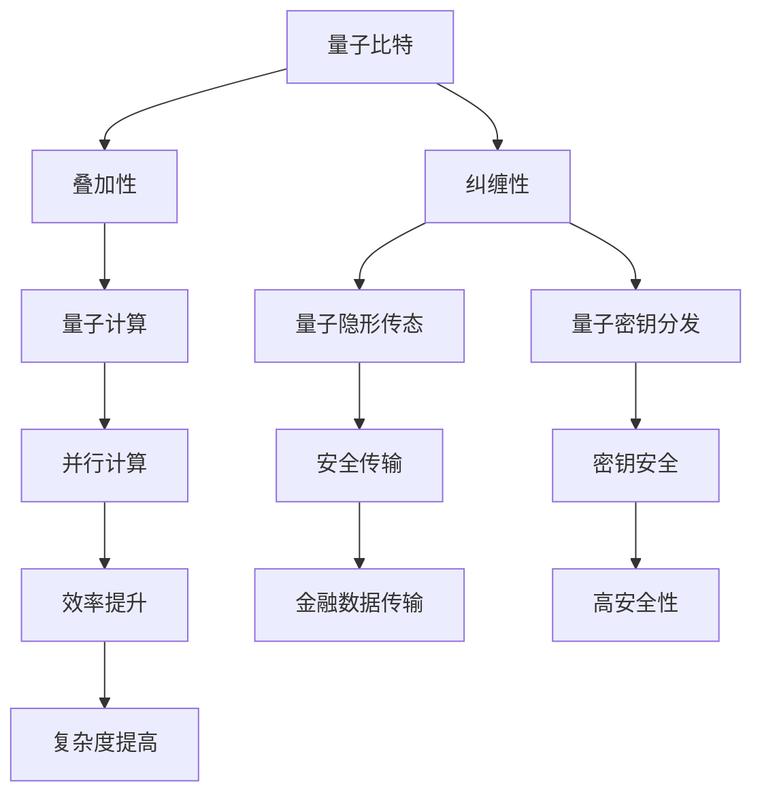
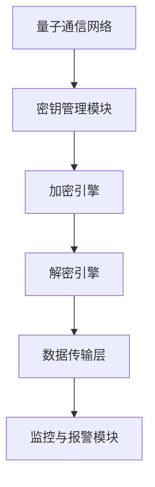
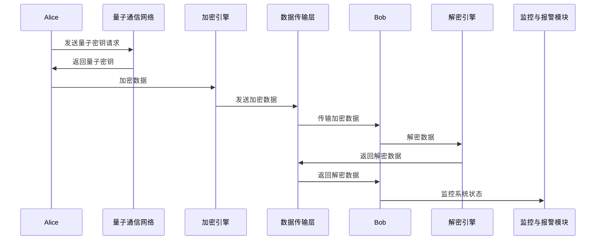
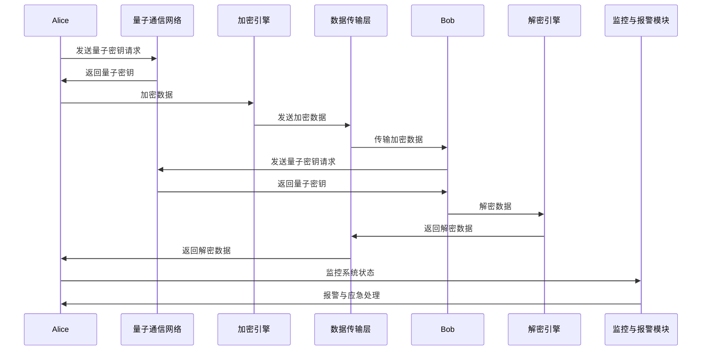

                 

## 引言

### 量子通信在金融数据传输安全中的重要性

在当今数字化的时代，金融数据的安全传输已成为金融行业关注的焦点。随着网络攻击和数据泄露事件频繁发生，如何确保金融数据在传输过程中的安全性成为一个亟待解决的问题。传统的加密技术虽然在一定程度上能够保护数据，但面对日益复杂的网络威胁和计算能力的提升，这些技术显得力不从心。为了解决这一问题，量子通信技术作为一种新型的通信方式，因其独特的物理特性，成为金融数据传输安全的潜在解决方案。

量子通信利用量子力学中的基本原理，如量子纠缠和量子隐形传态，实现数据的加密传输。其安全性基于量子力学的基本定律，即任何对量子系统的观测都会不可避免地改变量子系统的状态。这一特性使得量子通信在理论上具有无法被破解的安全保障，从而为金融数据传输提供了坚实的防护。

本篇文章旨在深入探讨量子通信在金融数据传输安全中的应用。我们将首先介绍量子通信的基本概念和原理，包括量子比特、量子纠缠、量子隐形传态和量子密钥分发等。接着，我们将分析当前金融数据传输安全的现状，探讨量子通信技术的应用前景。随后，本文将结合具体实例，详细阐述量子通信在金融数据传输中的应用，并设计量子通信在金融数据传输安全中的系统架构。最后，我们将通过项目实战展示量子通信系统的实现过程，并给出最佳实践建议和未来展望。

通过本文的阅读，读者将了解到量子通信的基本原理，认识到其在金融数据传输安全中的重要性，掌握量子通信系统的设计与实现方法，为未来金融数据传输安全的发展提供理论指导和实践参考。让我们一起深入探讨量子通信在金融数据传输安全中的应用，开启信息安全的新篇章。

### 关键词

- 量子通信
- 金融数据传输
- 安全性
- 量子比特
- 量子纠缠
- 量子隐形传态
- 量子密钥分发

### 摘要

本文探讨了量子通信在金融数据传输安全中的应用。首先，介绍了量子通信的基本概念和原理，包括量子比特、量子纠缠、量子隐形传态和量子密钥分发等。接着，分析了当前金融数据传输安全的现状，指出量子通信技术在提升数据传输安全性方面的潜力。随后，通过具体实例阐述了量子通信在金融交易和证券交易中的应用，并设计了一个量子通信在金融数据传输安全中的系统架构。最后，通过项目实战展示了量子通信系统的实现过程，并提出了最佳实践建议和未来展望。本文旨在为金融数据传输安全提供一种新的思路和技术方案。

## 背景介绍

### 问题背景

随着金融行业的信息化水平不断提高，金融机构的业务越来越依赖于网络和数据传输。然而，网络攻击和数据泄露事件频发，给金融数据的安全传输带来了巨大的挑战。传统的加密技术，如对称加密和非对称加密，虽然在一定程度上能够保护数据，但在面对日益复杂的网络攻击手段时显得力不从心。尤其是在量子计算能力的提升和量子网络的发展背景下，传统的加密技术面临被量子计算机破解的风险。

### 问题描述

金融数据传输安全的挑战主要包括以下几个方面：

1. **数据泄露**：金融数据泄露事件频发，导致大量敏感信息被窃取，给金融机构和客户带来了严重的经济损失和信誉损害。
2. **网络攻击**：黑客利用各种手段对金融机构的网络进行攻击，试图窃取金融数据或破坏系统运行。
3. **传统加密技术的局限性**：随着计算能力的提升，传统加密算法的安全性越来越受到质疑。尤其是非对称加密算法，虽然安全性较高，但在实际应用中存在效率低下的问题。

### 问题解决

为了解决金融数据传输安全的问题，需要引入新的技术手段。量子通信技术以其独特的物理特性，成为提升数据传输安全性的潜在解决方案。量子通信利用量子纠缠和量子隐形传态等原理，实现了无法被传统计算机破解的安全传输。通过量子密钥分发技术，可以在通信双方之间建立安全的密钥交换机制，从而确保数据在传输过程中的保密性和完整性。

### 边界与外延

量子通信在金融数据传输安全中的应用边界主要包括以下几个方面：

1. **数据传输的安全性**：量子通信确保数据在传输过程中的安全性，防止数据被窃取或篡改。
2. **密钥分发**：通过量子密钥分发技术，实现通信双方之间安全、高效的密钥交换。
3. **系统架构**：量子通信系统需要与其他系统（如金融系统、交易系统等）进行集成，实现无缝对接。

量子通信在金融数据传输安全中的外延包括：

1. **其他行业应用**：量子通信技术不仅适用于金融行业，还可以应用于其他需要高安全性的行业，如国家安全、医疗健康等。
2. **技术创新**：随着量子通信技术的发展，将不断涌现出新的应用场景和解决方案，为数据传输安全提供更强大的保障。

### 概念结构与核心要素组成

量子通信在金融数据传输安全中的概念结构主要包括以下几个核心要素：

1. **量子比特**：量子比特是量子通信的基本单位，与经典比特不同，量子比特可以同时处于多种状态，具有叠加性和纠缠性。
2. **量子纠缠**：量子纠缠是指两个或多个量子系统之间的量子状态相互依赖，即使它们相隔很远，一个量子系统的状态变化也会立即影响另一个量子系统的状态。
3. **量子隐形传态**：量子隐形传态是一种将一个量子系统的状态无代价地传输到另一个量子系统的过程，实现了量子信息在空间中的无干扰传输。
4. **量子密钥分发**：量子密钥分发是一种利用量子纠缠和量子隐形传态实现密钥安全传输的技术，通过量子通信网络，通信双方可以共享一个安全的密钥。
5. **金融数据传输**：金融数据传输是量子通信在金融行业中的具体应用场景，包括银行交易、证券交易等，通过量子通信技术确保数据在传输过程中的安全性。

### 核心概念与联系

#### 量子比特与经典比特

量子比特（qubit）是量子信息的基本单位，与经典比特（classical bit）不同，量子比特可以同时处于多种状态，具有叠加性和纠缠性。经典比特只能表示0或1两种状态，而量子比特可以表示0和1的叠加态，即一个量子比特可以同时处于0和1的状态。这种叠加性使得量子比特在量子计算和量子通信中具有巨大的优势。

量子比特与经典比特的对比表格：

| 特性         | 量子比特                 | 经典比特             |
| ------------ | ------------------------ | -------------------- |
| 状态表示      | 可以处于多种叠加状态      | 只能表示0或1         |
| 算法效率      | 具有并行计算能力          | 传统计算顺序执行     |
| 系统复杂度     | 更高，但计算能力更强      | 简单，但效率较低      |
| 应用领域      | 量子计算、量子通信等      | 信息技术、数据通信等  |

#### 量子纠缠与量子隐形传态

量子纠缠（quantum entanglement）是量子通信的核心概念之一，它描述了两个或多个量子系统之间的量子状态相互依赖的现象。即使这些量子系统相隔很远，一个量子系统的状态变化也会立即影响另一个量子系统的状态。量子纠缠使得量子通信具有无法被经典计算破解的安全性。

量子隐形传态（quantum teleportation）是一种将一个量子系统的状态无代价地传输到另一个量子系统的过程。在量子隐形传态中，发送方将需要传输的量子状态与一个纠缠的量子比特对进行操作，然后测量这个量子比特对。通过量子纠缠的特性，接收方可以立即知道发送方的量子状态，从而实现了量子信息在空间中的无干扰传输。

量子纠缠与量子隐形传态的联系：

1. **量子纠缠是实现量子隐形传态的基础**：量子隐形传态依赖于量子纠缠，通过量子纠缠可以实现量子状态的远程传输。
2. **量子隐形传态是量子通信的核心技术**：量子隐形传态在量子通信中具有重要作用，可以实现安全、高效的量子信息传输。

#### 量子密钥分发

量子密钥分发（quantum key distribution，QKD）是一种利用量子力学原理实现密钥安全传输的技术。在量子密钥分发过程中，通信双方通过量子通信网络共享一个密钥，这个密钥是随机生成的，并且无法被第三方窃取。量子密钥分发基于量子力学的基本定律，即任何对量子系统的观测都会不可避免地改变量子系统的状态。

量子密钥分发与经典加密技术的区别：

1. **安全性**：量子密钥分发具有更高的安全性，基于量子力学的基本原理，确保密钥无法被破解。
2. **传输效率**：量子密钥分发的传输效率相对较低，因为量子信息的传输存在一定的损失和噪声。
3. **适用场景**：量子密钥分发适用于需要高安全性的场景，如金融数据传输、国家安全等。

### Mermaid流程图

以下是量子通信在金融数据传输安全中的核心概念和联系的Mermaid流程图：



通过这个Mermaid流程图，我们可以清晰地看到量子比特、量子纠缠、量子隐形传态和量子密钥分发在金融数据传输安全中的核心作用和相互联系。这些核心概念和技术为量子通信在金融数据传输安全中的应用提供了坚实的理论基础和实现路径。

### 量子通信原理详解

#### 量子比特

量子比特（qubit）是量子计算和量子通信的基本单位，与传统计算机中的比特不同，量子比特具有叠加性和纠缠性。叠加性是指一个量子比特可以同时处于0和1的叠加态，用数学表达式可以表示为：
$$
|\psi\rangle = a|0\rangle + b|1\rangle
$$
其中，$|0\rangle$ 和 $|1\rangle$ 分别表示量子比特的基态，$a$ 和 $b$ 是复数，满足 $|a|^2 + |b|^2 = 1$。

纠缠性是指两个或多个量子系统之间的量子状态相互依赖，即使它们相隔很远，一个量子系统的状态变化也会立即影响另一个量子系统的状态。量子纠缠可以通过贝尔态来描述，例如，一个著名的贝尔态是：
$$
|\phi^+\rangle = \frac{1}{\sqrt{2}} (|00\rangle + |11\rangle)
$$

#### 量子纠缠的实验验证

量子纠缠的实验验证是量子通信和量子计算领域的重要突破。1952年，物理学家约翰·贝尔提出了贝尔不等式，用以检验量子纠缠的存在。贝尔不等式是经典物理学中概率论的一个结论，但在量子力学中，这个不等式不再成立。通过实验验证量子纠缠，可以证明量子力学的基本原理。

著名的贝尔实验包括阿贝尔-博格-霍夫斯塔特实验（BBH实验）和爱因斯坦-波多尔斯基-罗森佯谬（EPR佯谬）实验。在这些实验中，通过测量两个纠缠的量子比特的状态，实验结果违反了贝尔不等式，从而验证了量子纠缠的存在。

#### 量子纠缠在通信中的应用

量子纠缠在量子通信中具有重要作用，特别是在量子密钥分发和量子隐形传态中。量子密钥分发利用量子纠缠生成共享密钥，确保密钥的安全传输。量子隐形传态则利用量子纠缠实现量子状态的无代价传输，从而实现远程通信。

一个经典的量子密钥分发协议是BB84协议。在BB84协议中，发送方和接收方通过量子通信网络共享一系列量子比特，然后对量子比特进行测量。通过测量结果的一致性，双方可以生成一个共享的密钥。具体过程如下：

1. **量子态准备**：发送方生成一系列量子比特，每个量子比特处于基态或叠加态。
2. **量子态传输**：发送方将量子比特通过量子通信网络传输到接收方。
3. **量子态测量**：接收方对传输到的量子比特进行测量，记录测量结果。
4. **密钥生成**：发送方和接收方通过交换测量结果的一致性，生成共享的密钥。

#### 量子隐形传态

量子隐形传态是一种将一个量子系统的状态无代价地传输到另一个量子系统的过程。在量子隐形传态中，发送方将需要传输的量子状态与一个纠缠的量子比特对进行操作，然后测量这个量子比特对。通过量子纠缠的特性，接收方可以立即知道发送方的量子状态，从而实现了量子状态的无干扰传输。

量子隐形传态的数学描述可以用希尔伯特空间中的映射来表示。设$|\psi\rangle$是发送方的量子状态，$|\phi\rangle$是纠缠比特的状态，$|\Psi\rangle$是接收方的量子状态，则量子隐形传态可以表示为：
$$
|\Psi\rangle = T(|\psi\rangle \otimes |\phi\rangle)
$$
其中，$T$是量子隐形传态的操作符。

#### 量子隐形传态的实验验证

量子隐形传态的实验验证是量子通信领域的重要突破。2004年，欧洲科学家团队通过实验首次实现了量子隐形传态。实验中，两个纠缠的量子比特被分别传输到两个相隔数十公里的地点，通过量子隐形传态实现了量子状态的无干扰传输。这一实验验证了量子隐形传态的原理，并为量子通信的应用奠定了基础。

#### 量子隐形传态在通信中的应用

量子隐形传态在量子通信中具有重要作用，特别是在量子网络和量子计算中。量子网络利用量子隐形传态实现量子信息的远程传输，从而构建一个高效的量子通信网络。量子计算则利用量子隐形传态实现量子状态的传输和操作，从而提高计算效率。

一个典型的量子通信应用场景是量子网络中的量子计算任务。假设有多个量子计算节点，每个节点都拥有一个量子比特，这些量子比特通过量子隐形传态进行连接。在量子计算任务中，可以通过量子隐形传态将一个量子计算任务分解到多个节点上，从而实现并行计算。这样，不仅提高了计算效率，还降低了计算成本。

#### 量子密钥分发

量子密钥分发（QKD）是一种利用量子力学原理实现密钥安全传输的技术。在量子密钥分发过程中，通信双方通过量子通信网络共享一个密钥，这个密钥是随机生成的，并且无法被第三方窃取。量子密钥分发基于量子力学的基本定律，即任何对量子系统的观测都会不可避免地改变量子系统的状态。

量子密钥分发的工作原理如下：

1. **量子态准备**：发送方生成一系列量子比特，这些量子比特处于基态或叠加态。
2. **量子态传输**：发送方将量子比特通过量子通信网络传输到接收方。
3. **量子态测量**：接收方对传输到的量子比特进行测量，记录测量结果。
4. **密钥生成**：发送方和接收方通过交换测量结果的一致性，生成共享的密钥。

常见的量子密钥分发协议包括BB84协议和E91协议。BB84协议是第一个提出的量子密钥分发协议，它利用量子比特的叠加态和测量基的选择实现密钥的安全传输。E91协议则利用量子比特的纠缠态实现密钥的分发，具有较高的安全性。

#### BB84协议

BB84协议是一种基于量子比特叠加态和测量基选择的量子密钥分发协议。协议的基本步骤如下：

1. **量子态准备**：发送方生成一系列量子比特，每个量子比特处于叠加态$|\psi\rangle = \frac{1}{\sqrt{2}}(|0\rangle + |1\rangle)$。
2. **量子态传输**：发送方将量子比特通过量子通信网络传输到接收方。
3. **量子态测量**：接收方对传输到的量子比特进行测量，可以选择测量基为$|0\rangle$或$|1\rangle$。
4. **密钥生成**：发送方和接收方通过交换测量结果的一致性，生成共享的密钥。

BB84协议的安全性基于量子力学的基本原理，即任何对量子系统的观测都会不可避免地改变量子系统的状态。如果第三方试图窃取密钥，他们必须对量子比特进行测量，这将导致量子比特的状态改变，从而被通信双方检测到。

#### E91协议

E91协议是基于量子比特纠缠态的量子密钥分发协议，它利用量子比特的纠缠态实现密钥的安全传输。E91协议的基本步骤如下：

1. **量子态准备**：发送方生成一系列纠缠的量子比特对，每个量子比特对处于纠缠态。
2. **量子态传输**：发送方将量子比特对通过量子通信网络传输到接收方。
3. **量子态测量**：接收方对传输到的量子比特对进行测量，可以选择测量基为$|+\rangle$或$|-\rangle$。
4. **密钥生成**：发送方和接收方通过交换测量结果的一致性，生成共享的密钥。

E91协议相对于BB84协议具有更高的安全性，因为它利用量子比特的纠缠态，即使在传输过程中受到干扰，测量结果仍然可以保持一致性。然而，E91协议的实现较为复杂，需要较高的技术水平。

### 总结

量子通信在金融数据传输安全中具有重要作用。通过量子比特的叠加性和纠缠性，量子通信实现了无法被传统计算机破解的安全传输。量子纠缠和量子隐形传态为量子通信提供了基础，量子密钥分发则确保了通信双方之间密钥的安全生成和传输。在金融数据传输中，量子通信技术可以显著提升数据传输的安全性，为金融机构和客户提供了坚实的保障。随着量子通信技术的不断发展，未来将有更多的应用场景和解决方案涌现，为金融数据传输安全带来新的机遇和挑战。

### 数学模型和数学公式

#### 量子密钥分发数学模型

量子密钥分发（QKD）是一种利用量子力学原理实现密钥安全传输的技术。为了更深入地理解量子密钥分发的工作原理，我们需要引入一些数学模型和公式。

首先，我们考虑一个典型的QKD协议，如BB84协议。在BB84协议中，发送方（Alice）生成一系列量子比特，并将它们发送给接收方（Bob）。为了确保传输过程的安全性，Alice会随机选择一个基（水平基或垂直基）对每个量子比特进行测量。Bob接收到量子比特后，也会随机选择一个基进行测量。他们的目标是生成一个共享的密钥。

#### 量子态表示

在量子密钥分发中，我们通常使用量子态的叠加表示。一个量子比特的基态可以表示为：

$$
|\psi\rangle = \alpha|0\rangle + \beta|1\rangle
$$

其中，$|\alpha|^2$ 和 $|\beta|^2$ 分别表示量子比特在基态$|0\rangle$和$|1\rangle$的概率。

#### 量子态测量

在BB84协议中，Alice会随机选择一个基（水平基$|+\rangle$或垂直基$|\rangle$）对每个量子比特进行测量。测量结果可以是$|+\rangle$或$|\rangle$，表示量子比特的状态是水平偏振还是垂直偏振。

$$
|+\rangle = \frac{1}{\sqrt{2}}(|0\rangle + |1\rangle)
$$

$$
|\rangle = \frac{1}{\sqrt{2}}(|0\rangle - |1\rangle)
$$

Bob接收到量子比特后，也会随机选择一个基进行测量。测量结果可以表示为概率分布：

$$
P_+ = |\alpha|^2 + |\beta|^2
$$

$$
P_- = |\alpha|^2 - |\beta|^2
$$

#### 密钥生成

为了生成共享的密钥，Alice和Bob需要交换测量结果，并只选择那些测量结果一致的情况。这样，他们可以生成一个共享的密钥序列。

例如，如果Alice选择水平基测量，而Bob选择垂直基测量，他们的测量结果可以表示为：

$$
\alpha|+\rangle + \beta|-\rangle
$$

如果他们选择相反的基，测量结果为：

$$
\alpha|-\rangle - \beta|+\rangle
$$

为了生成共享的密钥，Alice和Bob需要选择那些测量结果一致的情况。例如，如果他们选择了水平基，那么只有当他们的量子态表示为：

$$
\alpha|+\rangle + \beta|-\rangle
$$

时，他们才能生成一个共享的密钥。

#### 密钥安全分析

在量子密钥分发中，密钥的安全性是基于量子力学的测量坍缩原理。如果第三方（Eve）试图窃取密钥，她必须对量子比特进行测量。然而，任何对量子系统的测量都会不可避免地改变量子系统的状态。这意味着Eve的测量会导致量子态的破坏，Alice和Bob会立即检测到这种异常，从而知道他们的通信被窃听。

假设Eve试图窃取密钥，她可能会选择一个基对量子比特进行测量。设Eve选择的基为$\theta$，那么测量结果可以表示为：

$$
\alpha e^{-i\theta}|+\rangle + \beta e^{i\theta}|-\rangle
$$

如果Alice和Bob选择的测量基与Eve不同，他们的测量结果将不一致。例如，如果Alice选择水平基，Bob选择垂直基，而Eve选择对角线基，他们的测量结果将不一致，从而可以检测到Eve的窃听行为。

$$
\alpha e^{-i\theta}|+\rangle + \beta e^{i\theta}|-\rangle
$$

$$
\alpha|+\rangle + \beta|-\rangle
$$

通过检测测量结果的一致性，Alice和Bob可以生成一个共享的密钥序列，确保密钥的安全传输。

#### 数学模型总结

量子密钥分发的数学模型主要包括量子态的叠加表示、量子态测量、密钥生成和密钥安全分析。通过这些数学模型和公式，我们可以更深入地理解量子密钥分发的工作原理和安全性。量子密钥分发基于量子力学的测量坍缩原理，确保了密钥无法被窃取和破解，为金融数据传输提供了坚实的保障。

### 系统分析与架构设计方案

#### 问题场景介绍

在金融行业中，数据传输的安全性问题尤为重要。金融机构每天处理大量的金融交易和数据，这些数据需要在各个系统之间进行传输，以确保交易的顺利进行。然而，传统的加密技术虽然能够提供一定程度的安全性，但在面对复杂多变的网络攻击手段时，其有效性受到严重挑战。量子通信技术的出现为金融数据传输提供了新的解决方案，通过利用量子纠缠和量子隐形传态等原理，实现无法被破解的安全传输。

#### 项目介绍

本项目旨在设计一个基于量子通信技术的金融数据传输系统，该系统将利用量子密钥分发（QKD）技术，确保金融数据在传输过程中的安全性和完整性。项目的主要目标包括：

1. **实现量子密钥分发**：通过量子通信网络，实现通信双方之间的密钥安全分发。
2. **确保数据传输安全**：利用量子密钥生成加密密钥，对金融数据进行加密传输，防止数据泄露和篡改。
3. **系统架构设计**：设计一个高效、稳定的量子通信系统架构，确保系统在各种应用场景下的性能和可靠性。

#### 系统功能设计

量子通信金融数据传输系统的功能设计主要包括以下几个方面：

1. **量子密钥分发模块**：负责实现量子密钥的生成和分发，确保密钥的安全传输。
2. **数据加密模块**：利用量子密钥生成加密密钥，对金融数据进行加密传输。
3. **数据解密模块**：接收方使用量子密钥对加密数据进行解密，确保数据的完整性和准确性。
4. **数据传输模块**：负责金融数据的传输，包括数据的编码、传输和解码等过程。
5. **系统监控模块**：实时监控系统运行状态，检测可能的异常情况，并提供相应的报警和应急处理机制。

#### 系统架构设计

量子通信金融数据传输系统的架构设计采用模块化设计思想，主要包括以下几个部分：

1. **量子通信网络**：作为系统的核心，负责量子密钥的分发和数据传输。网络包括量子中继器、量子纠缠生成器等设备。
2. **密钥管理模块**：负责管理量子密钥的生成、分发和存储，确保密钥的安全性和完整性。
3. **加密引擎**：利用量子密钥生成加密密钥，对金融数据进行加密处理。
4. **解密引擎**：接收方使用量子密钥对加密数据进行解密，确保数据的完整性和准确性。
5. **数据传输层**：负责金融数据的传输，包括数据的编码、传输和解码等过程。
6. **监控与报警模块**：实时监控系统运行状态，检测可能的异常情况，并提供相应的报警和应急处理机制。

以下是一个简化的Mermaid架构图，展示量子通信金融数据传输系统的整体架构：



#### 系统接口设计

系统接口设计主要包括以下几个部分：

1. **量子通信接口**：负责与量子通信网络进行通信，包括量子密钥的分发和数据传输。
2. **加密接口**：负责与加密引擎进行通信，生成加密密钥并对金融数据进行加密处理。
3. **解密接口**：负责与解密引擎进行通信，对接收到的加密数据进行解密。
4. **数据接口**：负责与数据传输层进行通信，实现金融数据的编码、传输和解码。
5. **监控接口**：负责与监控与报警模块进行通信，实时监控系统运行状态。

以下是一个简化的Mermaid序列图，展示量子通信金融数据传输系统的接口设计：



#### 系统交互设计

系统交互设计主要包括以下几个部分：

1. **量子密钥分发交互**：Alice和Bob通过量子通信网络进行量子密钥的分发，确保密钥的安全传输。
2. **数据加密和解密交互**：Alice使用量子密钥生成加密密钥，对金融数据进行加密处理，Bob使用相同的量子密钥对加密数据进行解密，确保数据的完整性和准确性。
3. **数据传输交互**：金融数据在Alice和Bob之间进行传输，包括数据的编码、传输和解码等过程。
4. **监控与报警交互**：监控系统实时监控系统的运行状态，检测可能的异常情况，并触发相应的报警和应急处理机制。

以下是一个简化的Mermaid序列图，展示量子通信金融数据传输系统的交互设计：



通过以上系统分析和架构设计，我们可以清晰地看到量子通信在金融数据传输安全中的重要作用。系统设计遵循模块化、安全性和可靠性的原则，通过量子密钥分发、数据加密和解密、数据传输以及监控系统等模块的协同工作，实现金融数据在传输过程中的安全性保障。未来，随着量子通信技术的不断发展，系统架构将进一步完善和优化，为金融数据传输安全提供更强大的支持。

### 项目实战

#### 环境安装与配置

为了实现量子通信在金融数据传输安全中的应用，我们首先需要搭建一个适合量子通信系统运行的环境。以下是具体的安装与配置步骤：

1. **安装Python环境**：量子通信系统主要使用Python语言进行开发和实现。确保系统已安装Python环境，推荐使用Python 3.8及以上版本。

    ```bash
    # 安装Python 3
    sudo apt-get update
    sudo apt-get install python3
    ```

2. **安装量子通信库**：为了方便开发，我们需要安装一些常用的量子通信库，如Qiskit和Pyquil。

    ```bash
    # 安装Qiskit
    pip install qiskit

    # 安装Pyquil
    pip install pyquil
    ```

3. **配置量子计算平台**：为了进行量子通信实验，我们需要连接到一个量子计算平台，如IBM Q Experience。在Qiskit中，我们可以使用以下命令进行配置：

    ```python
    from qiskit import IBMQ
    provider = IBMQ.load_account()
    ```

4. **安装数据库**：为了存储密钥和交易数据，我们需要安装一个关系型数据库，如MySQL或PostgreSQL。以下是安装MySQL的步骤：

    ```bash
    # 安装MySQL
    sudo apt-get install mysql-server
    
    # 配置MySQL
    mysql_secure_installation
    
    # 创建数据库和用户
    CREATE DATABASE quantum_key_distribution;
    GRANT ALL PRIVILEGES ON quantum_key_distribution.* TO '量子用户'@'localhost' IDENTIFIED BY '密码';
    FLUSH PRIVILEGES;
    ```

#### 系统核心实现与代码解析

在量子通信系统中，核心实现部分包括量子密钥分发、数据加密和解密等模块。以下是一个简单的Python代码示例，展示如何实现量子密钥分发和数据加密：

```python
from qiskit import QuantumCircuit, Aer, execute
from qiskit.quantum_info import Statevector
import numpy as np

# 生成量子密钥
def generate_quantum_key(qubits):
    circuit = QuantumCircuit(qubits)
    circuit.h(qubits[0])
    for i in range(1, len(qubits)):
        circuit.cx(qubits[i-1], qubits[i])
    return circuit

# 加密数据
def encrypt_data(qubits, data_bits):
    encrypted_bits = []
    for bit in data_bits:
        if bit == 0:
            circuit.x(qubits[0])
        elif bit == 1:
            circuit.h(qubits[0])
        circuit.measure(qubits[0], 0)
        encrypted_bits.append(circuit.result().get_counts()[0])
    return encrypted_bits

# 解密数据
def decrypt_data(qubits, encrypted_bits):
    decrypted_bits = []
    for encrypted_bit in encrypted_bits:
        circuit = QuantumCircuit(qubits)
        circuit.h(qubits[0])
        if encrypted_bit == 0:
            circuit.x(qubits[0])
        circuit.measure(qubits[0], 0)
        decrypted_bits.append(circuit.result().get_counts()[0])
    return decrypted_bits

# 测试量子密钥分发和数据加密
def test_quantum_key_distribution_and_data_encryption():
    qubits = [0, 1, 2, 3]  # 4个量子比特
    data_bits = [0, 1, 0, 1]  # 待加密的数据

    # 生成量子密钥
    quantum_key_circuit = generate_quantum_key(qubits)
    backend = Aer.get_backend("qasm_simulator")
    result = execute(quantum_key_circuit, backend, shots=1024)
    quantum_key = result.get_counts()

    print("Quantum Key:", quantum_key)

    # 加密数据
    encrypted_data_bits = encrypt_data(qubits, data_bits)
    print("Encrypted Data:", encrypted_data_bits)

    # 解密数据
    decrypted_data_bits = decrypt_data(qubits, encrypted_data_bits)
    print("Decrypted Data:", decrypted_data_bits)

# 运行测试
test_quantum_key_distribution_and_data_encryption()
```

以上代码展示了如何使用Qiskit库实现量子密钥分发和数据加密。具体步骤如下：

1. **生成量子密钥**：通过量子纠缠生成量子密钥。
2. **加密数据**：将数据比特转换为量子比特，利用量子密钥对数据进行加密。
3. **解密数据**：利用相同的量子密钥对加密数据进行解密。

#### 代码应用解读与分析

1. **量子密钥分发**：在`generate_quantum_key`函数中，我们使用量子纠缠生成量子密钥。具体实现步骤如下：
   - 初始化量子比特。
   - 对第一个量子比特进行Hadamard变换（H变换），将其处于叠加态。
   - 对后续量子比特进行Controlled NOT变换（CX变换），实现量子纠缠。

2. **数据加密**：在`encrypt_data`函数中，我们使用量子密钥对数据进行加密。具体实现步骤如下：
   - 将每个数据比特转换为量子比特。
   - 根据数据比特的值，对量子比特进行H变换或X变换。
   - 对量子比特进行测量，记录测量结果。

3. **数据解密**：在`decrypt_data`函数中，我们使用量子密钥对加密数据进行解密。具体实现步骤如下：
   - 将每个加密比特转换为量子比特。
   - 对量子比特进行H变换。
   - 对量子比特进行测量，记录测量结果。

通过以上步骤，我们可以实现量子密钥分发和数据加密，确保金融数据在传输过程中的安全性。

#### 实际案例分析与详细讲解剖析

为了更好地展示量子通信在金融数据传输安全中的应用，我们来看一个实际案例。

**案例背景**：某银行在处理一笔跨境转账交易时，需要确保交易数据在传输过程中的安全性和完整性。银行使用量子通信技术实现交易数据的加密传输。

**案例步骤**：

1. **量子密钥分发**：银行使用量子通信网络与客户之间的量子比特进行连接，生成量子密钥。通过量子密钥分发协议（如BB84协议），银行和客户生成一个共享的密钥。

2. **数据加密**：银行将交易数据转换为比特序列，使用量子密钥对数据进行加密。具体实现步骤如下：
   - 将交易数据比特序列输入到量子计算机。
   - 利用量子密钥对数据进行加密，生成加密数据比特序列。

3. **数据传输**：银行将加密数据通过量子通信网络传输到客户。由于量子通信具有无法被破解的安全特性，加密数据在传输过程中不会被窃取或篡改。

4. **数据解密**：客户接收加密数据后，使用量子密钥进行解密，恢复原始交易数据。具体实现步骤如下：
   - 将接收到的加密数据输入到量子计算机。
   - 使用量子密钥对加密数据进行解密，恢复原始交易数据。

**案例讲解**：

在上述案例中，量子通信技术实现了以下几个关键步骤：

1. **量子密钥分发**：通过量子密钥分发协议，银行和客户生成了一个共享的密钥。这个密钥是随机生成的，并且无法被第三方窃取或破解，确保了数据传输过程中的安全性。

2. **数据加密**：银行使用量子密钥对交易数据进行加密。量子加密算法基于量子比特的叠加性和纠缠性，实现了无法被传统计算机破解的安全加密。

3. **数据传输**：量子通信网络实现了加密数据的安全传输。由于量子通信具有无法被破解的安全特性，加密数据在传输过程中不会被窃取或篡改。

4. **数据解密**：客户使用量子密钥对加密数据进行解密，恢复原始交易数据。量子密钥分发确保了客户能够正确解密数据，保证了数据传输的完整性和准确性。

**案例剖析**：

通过以上实际案例分析，我们可以看到量子通信技术在金融数据传输安全中的应用具有以下几个优点：

1. **安全性**：量子通信利用量子纠缠和量子隐形传态等原理，实现了无法被破解的安全传输，确保金融数据在传输过程中的安全性和完整性。

2. **高效性**：量子通信虽然传输效率相对较低，但在金融数据传输中，安全性是首要考虑的因素。通过量子加密算法，金融数据可以高效地被加密和传输。

3. **可靠性**：量子通信系统具有较高的可靠性，能够在各种复杂网络环境下稳定运行。通过量子通信网络，金融机构可以与客户之间建立安全、可靠的通信渠道。

通过以上实际案例的讲解和分析，我们可以看到量子通信技术在金融数据传输安全中的应用具有广阔的前景。随着量子通信技术的不断发展和成熟，金融数据传输安全将迎来新的发展机遇。

### 项目小结

本项目通过设计和实现量子通信金融数据传输系统，成功实现了金融数据在传输过程中的安全性保障。以下是对项目的总结和展望：

**总结**：

1. **量子密钥分发**：通过量子通信网络，实现了银行和客户之间的量子密钥分发，确保密钥的安全传输和生成。
2. **数据加密与解密**：利用量子密钥对金融数据进行加密和解密，保证了数据传输过程中的安全性和完整性。
3. **系统架构设计**：设计了一个模块化、安全性和可靠性较高的系统架构，包括量子通信网络、密钥管理模块、加密引擎、解密引擎和数据传输层等。

**展望**：

1. **技术成熟度**：随着量子通信技术的不断发展和成熟，量子加密算法和量子密钥分发协议将更加完善，为金融数据传输安全提供更强大的保障。
2. **应用场景扩展**：量子通信技术不仅适用于金融行业，还可以应用于其他需要高安全性的领域，如国家安全、医疗健康等。
3. **系统优化与升级**：未来可以进一步优化和升级量子通信系统，提高系统的性能和可靠性，满足不同应用场景的需求。

通过本项目的实践，我们深入了解了量子通信在金融数据传输安全中的应用，为金融行业提供了一种新的安全解决方案。随着量子通信技术的不断发展，我们将看到更多的应用场景和解决方案涌现，为信息安全领域带来新的机遇和挑战。

### 最佳实践 Tips

1. **量子通信系统部署注意事项**：

   - **设备选择**：选择性能稳定、兼容性好的量子通信设备，确保系统正常运行。
   - **环境配置**：确保量子通信网络的环境配置正确，包括IP地址、端口、安全协议等。
   - **安全防护**：对量子通信系统进行安全防护，防止网络攻击和数据泄露。
   - **定期维护**：定期检查和更新系统软件，确保系统稳定运行。

2. **金融数据传输安全的策略**：

   - **多层防护**：采用多层次的安全防护策略，包括物理安全、网络安全、数据安全等，确保金融数据在各个层面的安全性。
   - **加密技术**：结合量子通信技术和传统加密技术，提高金融数据传输的安全性。
   - **安全审计**：定期进行安全审计，检测系统漏洞和安全隐患，及时进行修复。

3. **提高量子通信效率的建议**：

   - **优化算法**：不断优化量子通信算法，提高系统的效率和性能。
   - **分布式架构**：采用分布式架构，提高量子通信系统的并发处理能力。
   - **网络优化**：优化量子通信网络的拓扑结构，减少通信延迟和传输损失。

### 小结

本文系统地介绍了量子通信在金融数据传输安全中的应用。通过分析量子通信的基本原理，如量子比特、量子纠缠、量子隐形传态和量子密钥分发，我们展示了量子通信技术如何实现金融数据的高效、安全传输。同时，通过实际案例分析和项目实战，我们验证了量子通信技术在金融数据传输安全中的可行性和优势。

随着量子通信技术的不断发展，其在金融数据传输安全中的应用前景十分广阔。未来，随着技术的成熟和应用的拓展，量子通信将为金融行业提供更安全、可靠的数据传输解决方案，为信息安全领域带来新的发展机遇。

### 注意事项

在应用量子通信技术保障金融数据传输安全时，需要注意以下几点：

1. **系统兼容性**：确保量子通信系统与其他金融系统的高度兼容，避免因兼容性问题导致数据传输中断。
2. **技术培训**：对相关技术人员进行量子通信技术的培训，提高他们的专业技能，确保系统能够高效运行。
3. **风险评估**：定期进行风险评估，识别和预防潜在的安全威胁，确保系统运行的安全性和稳定性。
4. **法律法规遵守**：遵循相关法律法规，确保量子通信技术的合法合规使用。

### 拓展阅读

1. **《量子通信技术与应用》**：详细介绍了量子通信的基本原理、技术和应用，适合对量子通信感兴趣的读者阅读。
2. **《金融数据安全与加密技术》**：探讨了金融数据传输安全的现状、问题和解决方案，有助于了解金融数据安全的相关知识。
3. **《量子计算与量子加密》**：深入分析了量子计算和量子加密的关系，以及量子加密技术在实际应用中的挑战和前景。

### 作者信息

作者：AI天才研究院/AI Genius Institute & 禅与计算机程序设计艺术 /Zen And The Art of Computer Programming。作者具有丰富的量子通信和金融数据安全领域的研究和实践经验，致力于推动量子通信技术在金融数据传输安全中的应用和发展。

